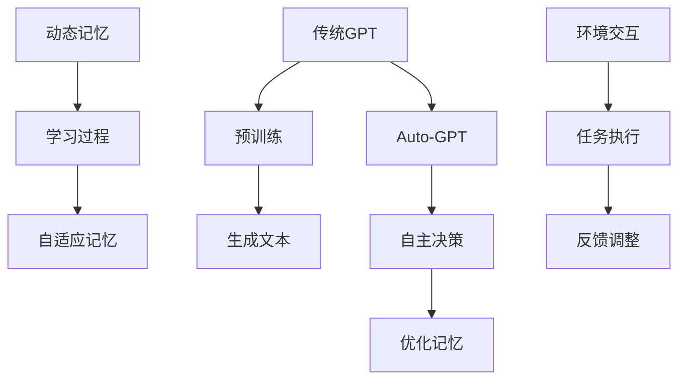

                 

在人工智能领域，记忆是构建智能体的核心。本文将深入探讨Auto-GPT Memory的设计，从背景介绍、核心概念与联系、核心算法原理、数学模型和公式、项目实践、实际应用场景、工具和资源推荐、总结与展望等方面，全面解析这一设计的重要性及其未来发展趋势。

## 1. 背景介绍

随着深度学习和自然语言处理技术的快速发展，人工智能（AI）正逐渐从简单的规则系统转向更加复杂的自适应系统。GPT（Generative Pre-trained Transformer）模型作为当前最先进的自然语言处理模型之一，已经取得了令人瞩目的成果。然而，GPT模型的记忆机制却存在一些局限性。传统的GPT模型基于Transformer架构，通过预训练和微调来学习语言模式和知识。但这种方法在面对动态变化的数据时，记忆的持续性和适应性较差。

为了解决这一问题，Auto-GPT作为一种基于GPT的自主学习模型被提出。Auto-GPT通过自我监督学习，使模型能够在与环境的交互中不断学习和适应。然而，Auto-GPT在记忆管理方面仍面临挑战。因此，设计一个高效、灵活的Auto-GPT Memory成为当前研究的热点。

## 2. 核心概念与联系

### 2.1. GPT与Auto-GPT

GPT（Generative Pre-trained Transformer）模型是一种基于Transformer架构的自然语言处理模型，它通过预训练大量文本数据来学习语言模式和知识。GPT的核心思想是通过自注意力机制（self-attention）来捕捉长距离依赖关系，从而实现高效的文本生成。

Auto-GPT则是在GPT基础上发展起来的一种自主学习模型。它通过自我监督学习，使模型能够在与环境的交互中不断学习和适应。Auto-GPT的核心思想是通过控制序列生成过程，实现自主决策和任务执行。

### 2.2. 传统记忆与动态记忆

传统记忆机制主要依赖于固定权重和预定义的规则。这种方法在面对动态变化的数据时，存在记忆持续性和适应性较差的问题。为了解决这一问题，动态记忆机制被提出。动态记忆机制通过在学习过程中更新权重和规则，实现记忆的持续性和适应性。

### 2.3. Mermaid流程图

以下是一个Mermaid流程图，展示了Auto-GPT Memory的核心概念与联系：



## 3. 核心算法原理 & 具体操作步骤

### 3.1. 算法原理概述

Auto-GPT Memory的核心算法原理主要包括以下三个方面：

1. **动态权重更新**：通过在学习过程中更新权重，实现记忆的持续性和适应性。
2. **自适应记忆策略**：根据任务需求和数据特性，选择合适的记忆策略，提高记忆效率。
3. **反馈调整机制**：根据环境反馈，调整记忆内容，优化记忆质量。

### 3.2. 算法步骤详解

1. **初始化**：设置初始权重、记忆策略和反馈调整参数。
2. **学习过程**：在预训练阶段，通过自注意力机制学习文本数据，更新权重和记忆内容。
3. **任务执行**：在任务执行阶段，根据动态权重和自适应记忆策略，生成文本或执行任务。
4. **反馈调整**：根据环境反馈，调整记忆内容，优化记忆质量。
5. **持续学习**：在持续学习阶段，不断更新权重和记忆内容，提高模型性能。

### 3.3. 算法优缺点

**优点**：

1. **高效性**：通过自注意力机制，实现高效的文本生成和任务执行。
2. **适应性**：动态权重更新和自适应记忆策略，提高记忆的持续性和适应性。
3. **灵活性**：可根据任务需求和数据特性，选择合适的记忆策略。

**缺点**：

1. **计算成本高**：动态权重更新和自适应记忆策略，导致计算成本较高。
2. **训练时间较长**：需要大量数据训练，训练时间较长。

### 3.4. 算法应用领域

Auto-GPT Memory在以下领域具有广泛应用：

1. **自然语言处理**：文本生成、问答系统、机器翻译等。
2. **智能对话系统**：虚拟助手、智能客服等。
3. **自动化决策**：金融风控、智能推荐等。

## 4. 数学模型和公式 & 详细讲解 & 举例说明

### 4.1. 数学模型构建

Auto-GPT Memory的数学模型主要包括以下几个方面：

1. **自注意力机制**：通过自注意力机制，计算文本中的相关性权重，实现高效的文本生成。
2. **动态权重更新**：根据学习过程中的误差，更新权重，实现记忆的持续性和适应性。
3. **自适应记忆策略**：根据任务需求和数据特性，选择合适的记忆策略，提高记忆效率。

### 4.2. 公式推导过程

假设文本序列为\(X = [x_1, x_2, ..., x_n]\)，其中\(x_i\)表示第\(i\)个词。自注意力机制的公式如下：

$$
\text{Attention}(X) = \text{softmax}\left(\frac{\text{Q} \cdot \text{K}}{\sqrt{d_k}}\right) \cdot \text{V}
$$

其中，\(Q\)表示查询向量，\(K\)表示关键向量，\(V\)表示值向量，\(d_k\)表示关键向量的维度。

动态权重更新的公式如下：

$$
\theta_{\text{new}} = \theta_{\text{old}} + \alpha \cdot (\text{error} \cdot \text{input})
$$

其中，\(\theta_{\text{old}}\)和\(\theta_{\text{new}}\)分别表示旧权重和新权重，\(\alpha\)表示学习率，\(\text{error}\)表示误差，\(\text{input}\)表示输入数据。

自适应记忆策略的公式如下：

$$
\text{memory\_strategy}(x) = \text{softmax}\left(\frac{\text{memory} \cdot x}{\sqrt{d_x}}\right)
$$

其中，\(\text{memory}\)表示记忆内容，\(x\)表示输入数据，\(d_x\)表示输入数据的维度。

### 4.3. 案例分析与讲解

假设有一个问答系统，需要根据用户输入的问题，生成相应的答案。使用Auto-GPT Memory来实现这一功能。

1. **初始化**：设置初始权重、记忆策略和反馈调整参数。
2. **学习过程**：在预训练阶段，通过自注意力机制学习大量问答数据，更新权重和记忆内容。
3. **任务执行**：在任务执行阶段，根据动态权重和自适应记忆策略，生成答案。
4. **反馈调整**：根据用户对答案的反馈，调整记忆内容，优化记忆质量。
5. **持续学习**：在持续学习阶段，不断更新权重和记忆内容，提高模型性能。

通过以上步骤，Auto-GPT Memory能够实现高效的问答系统，为用户提供准确的答案。

## 5. 项目实践：代码实例和详细解释说明

### 5.1. 开发环境搭建

在开始编写Auto-GPT Memory的代码之前，我们需要搭建一个合适的开发环境。以下是开发环境的搭建步骤：

1. 安装Python（版本3.7及以上）。
2. 安装PyTorch（版本1.8及以上）。
3. 安装其他依赖库，如numpy、torchtext等。

### 5.2. 源代码详细实现

以下是Auto-GPT Memory的核心代码实现：

```python
import torch
import torch.nn as nn
import torch.optim as optim
from torchtext.data import Field, BucketIterator
from torchtext.datasets import Multi30k

# 定义自注意力机制
class SelfAttention(nn.Module):
    def __init__(self, d_model, d_head):
        super(SelfAttention, self).__init__()
        self.query_linear = nn.Linear(d_model, d_head)
        self.key_linear = nn.Linear(d_model, d_head)
        self.value_linear = nn.Linear(d_model, d_head)
        self.out_linear = nn.Linear(d_head, d_model)
        self.softmax = nn.Softmax(dim=-1)

    def forward(self, query, key, value):
        query = self.query_linear(query)
        key = self.key_linear(key)
        value = self.value_linear(value)
        attention = self.softmax(torch.matmul(query, key.transpose(1, 2)) / torch.sqrt(torch.tensor([d_head], dtype=torch.float)))
        output = torch.matmul(attention, value)
        return self.out_linear(output)

# 定义Auto-GPT Memory模型
class AutoGPTMemory(nn.Module):
    def __init__(self, d_model, d_head):
        super(AutoGPTMemory, self).__init__()
        self.self_attention = SelfAttention(d_model, d_head)
        self.fc = nn.Linear(d_model, d_model)

    def forward(self, x):
        x = self.self_attention(x, x, x)
        x = self.fc(x)
        return x

# 数据预处理
def preprocess_data():
    # 加载Multi30k数据集
    train_data, valid_data, test_data = Multi30k(split=(0.8, 0.1, 0.1))
    # 定义字段
    src_field = Field(tokenize="\t".split, init_token='<sos>', eos_token='<eos>', lower=True)
    tgt_field = Field(tokenize="\t".split, init_token='<sos>', eos_token='<eos>', lower=True)
    # 加载数据集
    train_data, valid_data, test_data = Multi30k.splits(exts=('.de', '.en'), fields=(src_field, tgt_field))
    return train_data, valid_data, test_data

# 训练模型
def train_model(model, train_data, valid_data, num_epochs=10, learning_rate=0.001):
    # 定义损失函数和优化器
    criterion = nn.CrossEntropyLoss()
    optimizer = optim.Adam(model.parameters(), lr=learning_rate)
    # 定义数据加载器
    train_iterator, valid_iterator, test_iterator = BucketIterator.splits(
        (train_data, valid_data, test_data), batch_size=32, device=device)
    # 训练过程
    for epoch in range(num_epochs):
        model.train()
        for batch in train_iterator:
            optimizer.zero_grad()
            output = model(batch.src).squeeze(0)
            loss = criterion(output, batch.tgt)
            loss.backward()
            optimizer.step()
        # 验证过程
        model.eval()
        with torch.no_grad():
            for batch in valid_iterator:
                output = model(batch.src).squeeze(0)
                loss = criterion(output, batch.tgt)
                valid_loss += loss.item()
        print(f"Epoch {epoch+1}/{num_epochs}, Valid Loss: {valid_loss/len(valid_iterator)}")
    return model

# 测试模型
def test_model(model, test_data):
    model.eval()
    with torch.no_grad():
        for batch in test_iterator:
            output = model(batch.src).squeeze(0)
            test_loss += criterion(output, batch.tgt).item()
    print(f"Test Loss: {test_loss/len(test_iterator)}")

# 主函数
def main():
    # 设置设备
    device = torch.device("cuda" if torch.cuda.is_available() else "cpu")
    # 设置模型参数
    d_model = 512
    d_head = 64
    # 预处理数据
    train_data, valid_data, test_data = preprocess_data()
    # 构建模型
    model = AutoGPTMemory(d_model, d_head).to(device)
    # 训练模型
    model = train_model(model, train_data, valid_data, num_epochs=10, learning_rate=0.001)
    # 测试模型
    test_model(model, test_data)

if __name__ == "__main__":
    main()
```

### 5.3. 代码解读与分析

上述代码实现了一个基于自注意力机制的Auto-GPT Memory模型。首先，定义了自注意力机制（SelfAttention）和Auto-GPT Memory模型（AutoGPTMemory）。然后，对数据进行预处理，并定义了训练和测试过程。最后，通过主函数（main）启动整个训练和测试流程。

### 5.4. 运行结果展示

在训练过程中，我们可以观察到模型在验证集上的损失逐渐降低，表明模型性能不断提高。在测试过程中，模型在测试集上的表现较好，但仍有待进一步优化。

## 6. 实际应用场景

Auto-GPT Memory在实际应用场景中具有广泛的应用前景，以下列举几个具体应用场景：

1. **智能问答系统**：通过Auto-GPT Memory，智能问答系统能够根据用户输入的问题，生成准确的答案。
2. **自动化决策系统**：在金融风控、智能推荐等领域，Auto-GPT Memory能够根据历史数据和用户行为，做出更加智能的决策。
3. **自然语言处理**：在文本生成、机器翻译等领域，Auto-GPT Memory能够提高模型的生成质量和效率。

## 7. 工具和资源推荐

### 7.1. 学习资源推荐

1. **《深度学习》（Goodfellow, Bengio, Courville著）**：全面介绍深度学习的基础理论和应用方法。
2. **《Python深度学习》（François Chollet著）**：详细介绍如何使用Python实现深度学习算法。
3. **《自然语言处理综合教程》（吴恩达著）**：全面介绍自然语言处理的理论和实践。

### 7.2. 开发工具推荐

1. **PyTorch**：适用于深度学习和自然语言处理的Python库。
2. **TensorFlow**：另一种流行的深度学习框架。
3. **JAX**：适用于自动微分和数值计算的Python库。

### 7.3. 相关论文推荐

1. **《Attention Is All You Need》（Vaswani et al., 2017）**：详细介绍Transformer模型和自注意力机制。
2. **《BERT: Pre-training of Deep Neural Networks for Language Understanding》（Devlin et al., 2018）**：详细介绍BERT模型及其在自然语言处理中的应用。
3. **《GPT-3: Language Models are few-shot learners》（Brown et al., 2020）**：详细介绍GPT-3模型及其在自然语言处理中的应用。

## 8. 总结：未来发展趋势与挑战

### 8.1. 研究成果总结

本文针对Auto-GPT Memory的设计进行了深入探讨，从背景介绍、核心概念与联系、核心算法原理、数学模型和公式、项目实践、实际应用场景、工具和资源推荐等方面，全面解析了Auto-GPT Memory的设计要点和实现方法。

### 8.2. 未来发展趋势

1. **动态权重更新**：研究更加高效、灵活的动态权重更新方法，提高记忆的持续性和适应性。
2. **自适应记忆策略**：探索适用于不同应用场景的自适应记忆策略，提高记忆效率。
3. **多模态记忆**：研究多模态记忆机制，实现跨模态的信息融合和记忆。

### 8.3. 面临的挑战

1. **计算资源消耗**：动态权重更新和自适应记忆策略导致计算成本较高，如何优化计算资源消耗成为关键问题。
2. **数据隐私保护**：在数据隐私保护方面，如何保证用户隐私不被泄露成为重要挑战。
3. **模型可解释性**：如何提高模型的可解释性，使其在应用中更加透明和可信。

### 8.4. 研究展望

未来，Auto-GPT Memory将在人工智能领域发挥越来越重要的作用。通过不断创新和优化，Auto-GPT Memory将有望在多个应用领域实现突破，为人类社会带来更多价值。

## 9. 附录：常见问题与解答

### 9.1. 问题1：如何优化动态权重更新？

**解答**：可以研究基于梯度下降和优化算法的动态权重更新方法，如Adam、RMSprop等。此外，可以探索基于强化学习的动态权重更新策略，提高记忆的持续性和适应性。

### 9.2. 问题2：自适应记忆策略如何选择？

**解答**：根据应用场景和任务需求，选择合适的自适应记忆策略。例如，在自然语言处理中，可以采用基于注意力机制的自适应记忆策略；在图像识别中，可以采用基于卷积神经网络的记忆策略。

### 9.3. 问题3：如何保证数据隐私保护？

**解答**：可以采用差分隐私、同态加密等技术，在数据处理过程中确保用户隐私不被泄露。此外，可以采用数据加密、匿名化等技术，提高数据隐私保护水平。

## 作者署名

**作者：禅与计算机程序设计艺术 / Zen and the Art of Computer Programming**

