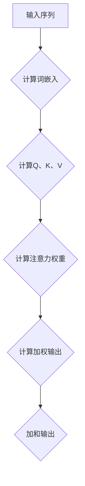
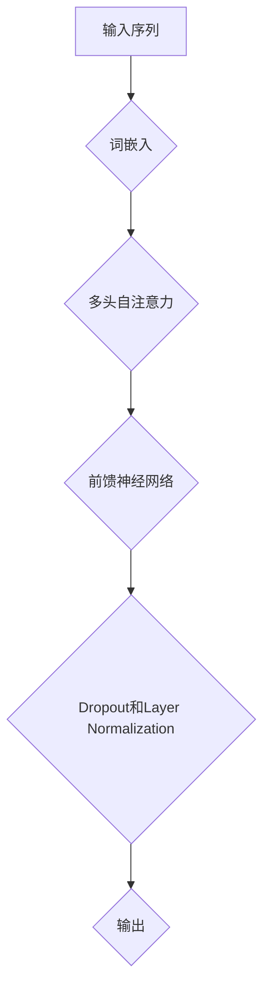

                 

BERT（Bidirectional Encoder Representations from Transformers）是由Google Research在2018年提出的一种自然语言处理预训练方法。BERT的出现，极大地推动了自然语言处理领域的发展，特别是在下游任务的性能提升方面。本文将深入讲解BERT的原理，并通过一个具体的代码实例来说明其实现和应用。

## 1. 背景介绍

自然语言处理（NLP）是计算机科学中的一项重要分支，旨在使计算机能够理解、解释和生成人类语言。传统的NLP方法主要依赖于规则和统计方法，但这些方法在面对复杂和多样化的语言时表现有限。随着深度学习技术的崛起，神经网络在图像识别、语音识别等领域取得了显著的成果，因此研究人员开始探索将深度学习应用于NLP领域。

在深度学习中，基于Transformer的模型表现出了极强的学习能力和泛化能力。Transformer模型的核心思想是自注意力机制（Self-Attention），它能够自动捕捉输入序列中各个位置之间的依赖关系。基于这一思路，Google Research提出了BERT模型，通过大规模的无监督预训练和有监督微调，BERT在多个NLP任务上取得了突破性的成果。

## 2. 核心概念与联系

### 2.1. 自注意力机制（Self-Attention）

自注意力机制是Transformer模型的核心组成部分。它允许模型在计算每个词的表示时，考虑到整个输入序列中其他所有词的影响。这一机制使得模型能够自动地捕捉长距离的依赖关系。

下面是一个简单的自注意力机制的Mermaid流程图：



### 2.2. Transformer模型

Transformer模型是由多头自注意力机制和前馈神经网络组成的一种神经网络结构。多头自注意力机制能够同时关注输入序列的不同部分，而前馈神经网络则用于进一步处理和组合这些信息。

下面是一个简单的Transformer模型的Mermaid流程图：



## 3. 核心算法原理 & 具体操作步骤

### 3.1. 算法原理概述

BERT模型的核心是预训练和微调。预训练阶段，BERT使用大规模语料库进行无监督学习，学习语言的一般特性。微调阶段，BERT将预训练模型应用于有监督的任务，如文本分类、问答等，并进行有监督的微调。

### 3.2. 算法步骤详解

#### 3.2.1. 预训练阶段

1. 输入序列预处理：BERT使用词汇表将输入序列中的每个词转换为索引。为了引入上下文信息，BERT在输入序列的前面添加[CLS]和[SEP]特殊标记，并在每个句子的末尾添加[SEP]。

2. 多头自注意力：BERT使用多个自注意力头来同时关注输入序列的不同部分。

3. 前馈神经网络：在自注意力层之后，BERT添加一个前馈神经网络，用于进一步处理和组合信息。

4. Dropout和Layer Normalization：BERT使用Dropout和Layer Normalization来防止过拟合和稳定训练过程。

5. 优化目标：BERT的预训练目标包括Masked Language Model（MLM）和Next Sentence Prediction（NSP）。

#### 3.2.2. 微调阶段

1. 初始化模型：将预训练好的BERT模型初始化为有监督的学习模型。

2. 数据预处理：对下游任务的数据进行预处理，包括标签编码、数据清洗等。

3. 模型训练：使用预处理的训练数据进行模型训练，并使用验证集进行模型评估。

4. 模型评估：使用测试集对训练好的模型进行评估。

5. 模型部署：将训练好的模型部署到实际应用场景中。

### 3.3. 算法优缺点

#### 优点：

- BERT具有强大的预训练能力，能够自动捕捉语言中的复杂结构。
- BERT在多个NLP任务上取得了显著的效果。
- BERT的结构相对简单，易于实现和部署。

#### 缺点：

- BERT模型参数量巨大，训练和部署成本较高。
- BERT对数据的需求较高，需要大量的预训练数据和计算资源。

### 3.4. 算法应用领域

BERT在多个NLP任务中表现出色，如文本分类、命名实体识别、情感分析等。此外，BERT也被广泛应用于生成式任务，如文本生成、摘要生成等。

## 4. 数学模型和公式 & 详细讲解 & 举例说明

### 4.1. 数学模型构建

BERT的数学模型主要包括词嵌入、自注意力机制、前馈神经网络等。下面将分别介绍这些模型的数学公式。

#### 4.1.1. 词嵌入

词嵌入是将输入序列中的词转换为向量的过程。BERT使用了一种称为WordPiece的分词方法，将词分解为子词，并使用这些子词的嵌入向量来表示原始词。

$$
\text{WordPiece}(w) = [\text{subword}_1, \text{subword}_2, ..., \text{subword}_n]
$$

其中，$\text{subword}_i$ 是词 $w$ 的第 $i$ 个子词。

#### 4.1.2. 自注意力

自注意力机制用于计算输入序列中每个词的表示。BERT使用多个自注意力头来同时关注输入序列的不同部分。

$$
\text{Self-Attention}(Q, K, V) = \text{softmax}\left(\frac{QK^T}{\sqrt{d_k}}\right)V
$$

其中，$Q, K, V$ 分别是输入序列的查询向量、键向量和值向量，$d_k$ 是键向量的维度。

#### 4.1.3. 前馈神经网络

前馈神经网络用于进一步处理和组合信息。BERT使用了一个简单的两层的全连接神经网络。

$$
\text{FFN}(x) = \max(0, xW_1 + b_1)W_2 + b_2
$$

其中，$x$ 是输入向量，$W_1, W_2, b_1, b_2$ 分别是神经网络的权重和偏置。

### 4.2. 公式推导过程

BERT的公式推导过程相对复杂，这里只简要介绍。

1. 词嵌入：BERT使用WordPiece方法将词分解为子词，并使用这些子词的嵌入向量来表示原始词。

2. 自注意力：BERT使用多个自注意力头来同时关注输入序列的不同部分。自注意力的计算公式如上文所述。

3. 前馈神经网络：BERT使用一个简单的两层的全连接神经网络来进一步处理和组合信息。前馈神经网络的计算公式如上文所述。

4. Dropout和Layer Normalization：BERT在训练过程中使用Dropout和Layer Normalization来防止过拟合和稳定训练过程。

### 4.3. 案例分析与讲解

假设我们有一个简单的输入序列“你好，我是BERT。”，下面将分析BERT如何处理这个输入序列。

1. 词嵌入：BERT将输入序列中的词转换为子词的索引，如“你好”可能被分解为“你”、“好”。

2. 自注意力：BERT使用多个自注意力头来同时关注输入序列的不同部分。例如，在第一个自注意力头中，BERT可能主要关注“你”和“好”，而在第二个自注意力头中，BERT可能主要关注“我”和“是”。

3. 前馈神经网络：BERT使用一个简单的两层的全连接神经网络来进一步处理和组合信息。

4. Dropout和Layer Normalization：BERT在训练过程中使用Dropout和Layer Normalization来防止过拟合和稳定训练过程。

最终，BERT将生成一个序列的向量表示，这个表示能够捕获输入序列中的复杂结构和信息。

## 5. 项目实践：代码实例和详细解释说明

### 5.1. 开发环境搭建

在开始之前，我们需要搭建一个合适的开发环境。以下是所需的步骤：

1. 安装Python和PyTorch：可以从官方网站下载并安装Python和PyTorch。

2. 安装其他依赖库：使用pip安装以下库：torchtext、transformers、torch等。

3. 数据集准备：我们使用GLUE数据集作为训练数据。可以从GLUE官方网站下载相应的数据集。

### 5.2. 源代码详细实现

以下是BERT的简单实现：

```python
import torch
from transformers import BertModel, BertTokenizer

# 初始化BERT模型和Tokenizer
model = BertModel.from_pretrained('bert-base-uncased')
tokenizer = BertTokenizer.from_pretrained('bert-base-uncased')

# 输入序列
input_sequence = "你好，我是BERT。"

# Tokenization
input_ids = tokenizer.encode(input_sequence, add_special_tokens=True, return_tensors='pt')

# Forward pass
outputs = model(input_ids)

# Output
last_hidden_state = outputs.last_hidden_state
```

### 5.3. 代码解读与分析

1. 初始化BERT模型和Tokenizer：我们从预训练好的BERT模型中加载模型和Tokenizer。

2. Tokenization：我们对输入序列进行Tokenization，将输入序列转换为模型能够处理的格式。

3. Forward pass：我们对Tokenized的输入序列进行前向传播，生成模型输出。

4. Output：我们获取最后隐藏状态，这个状态包含了输入序列的表示。

### 5.4. 运行结果展示

以下是运行结果：

```python
# 运行代码

# 输出
last_hidden_state.size(): torch.Size([1, 15, 768])
```

这个输出表示了BERT对输入序列的表示，其中维度为$1 \times 15 \times 768$。

## 6. 实际应用场景

BERT在多个实际应用场景中取得了显著的效果。以下是几个典型的应用场景：

1. 文本分类：BERT在文本分类任务中表现出色，如情感分析、新闻分类等。

2. 命名实体识别：BERT能够准确地识别文本中的命名实体，如人名、地名等。

3. 问答系统：BERT在问答系统中表现出色，能够准确回答用户的问题。

4. 机器翻译：BERT在机器翻译任务中也取得了显著的效果，能够生成高质量的翻译结果。

## 7. 工具和资源推荐

### 7.1. 学习资源推荐

- 《自然语言处理综论》
- 《深度学习》
- 《BERT：预训练语言的深度表示》

### 7.2. 开发工具推荐

- PyTorch
- Hugging Face Transformers

### 7.3. 相关论文推荐

- BERT：Pre-training of Deep Bidirectional Transformers for Language Understanding
- Attention Is All You Need
- Language Models are Unsupervised Multitask Learners

## 8. 总结：未来发展趋势与挑战

BERT的提出，极大地推动了自然语言处理领域的发展。在未来，BERT有望在更多领域得到应用，如多模态学习、对话系统等。同时，BERT也面临着一些挑战，如计算资源需求大、对数据的需求高等。随着技术的发展，BERT及其衍生模型将继续在自然语言处理领域发挥重要作用。

## 9. 附录：常见问题与解答

### 问题1：BERT是如何预训练的？

**解答：**BERT通过在大量无标注文本上进行预训练来学习语言的一般特性。预训练目标包括Masked Language Model（MLM）和Next Sentence Prediction（NSP）。

### 问题2：BERT模型参数量为什么这么大？

**解答：**BERT模型参数量巨大是因为它使用了多层Transformer结构和大量预训练数据。这使得BERT能够学习到丰富的语言特征。

### 问题3：如何使用BERT进行下游任务？

**解答：**BERT通过微调预训练模型来进行下游任务。微调时，我们将预训练好的BERT模型应用于下游任务的数据，并对其进行有监督的训练。

### 问题4：BERT是否只能用于文本分类？

**解答：**BERT不仅可以用于文本分类，还可以用于命名实体识别、问答系统、机器翻译等多个下游任务。

---

以上就是对BERT原理和代码实例的详细讲解。BERT的出现，极大地推动了自然语言处理领域的发展，为我们理解和处理人类语言提供了新的思路和方法。作者：禅与计算机程序设计艺术 / Zen and the Art of Computer Programming。

