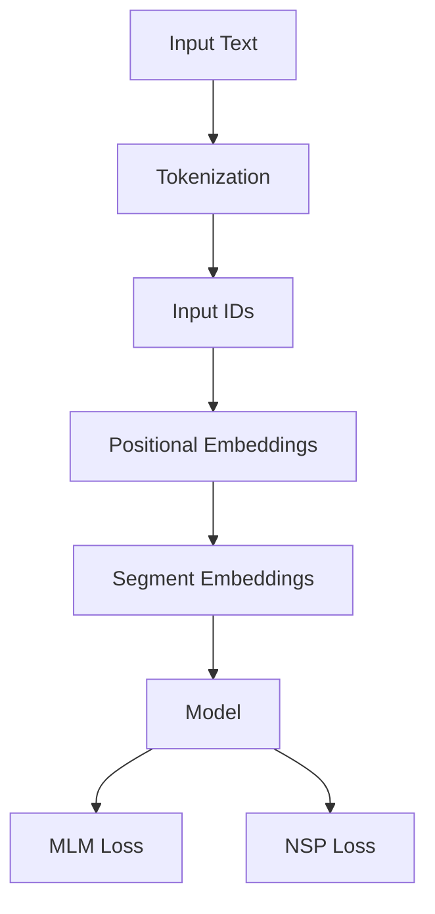

                 

BERT（Bidirectional Encoder Representations from Transformers）是一种预训练语言表示模型，它利用深度学习技术对自然语言文本进行建模，从而使得计算机能够更好地理解和处理人类语言。BERT 在自然语言处理（NLP）领域取得了显著的成果，其强大的语言理解和生成能力使其成为众多应用的核心组件。本文将深入讲解 BERT 的原理，并通过代码实例展示如何实现一个简单的 BERT 模型。

> 关键词：BERT、自然语言处理、预训练、深度学习、Transformer、代码实例

> 摘要：本文将介绍 BERT 模型的基本原理，包括其架构、核心算法和数学模型。通过代码实例，读者将了解如何使用 Python 和深度学习框架 PyTorch 实现一个简单的 BERT 模型，并对其进行训练和评估。

## 1. 背景介绍

随着互联网和移动互联网的快速发展，自然语言处理（NLP）技术逐渐成为计算机科学领域的一个重要分支。从早期的规则驱动方法到基于统计的方法，再到深度学习技术的应用，NLP 技术取得了长足的进步。然而，传统的 NLP 方法在处理长文本和复杂语言现象时仍然存在一定的局限性。

为了解决这些问题，研究人员提出了预训练语言表示模型，如 Word2Vec、GloVe 和 BERT。这些模型通过在大规模语料库上进行预训练，学习到语言的基本规律和语义信息，从而在下游任务中表现出色。BERT 作为一种基于 Transformer 的预训练模型，进一步提升了语言理解的能力。

## 2. 核心概念与联系

BERT 模型的核心概念包括 Transformer 架构、Masked Language Model（MLM）和 Next Sentence Prediction（NSP）任务。

### 2.1 Transformer 架构

Transformer 是一种基于自注意力机制（Self-Attention）的序列模型，它通过计算序列中每个词与其他词的关系来学习文本表示。自注意力机制可以自适应地分配注意力权重，从而捕捉长距离依赖关系。

### 2.2 Masked Language Model（MLM）

MLM 是一种对输入文本进行部分遮蔽（Mask）的预训练任务，其目的是让模型学习到词语之间的相互依赖关系。在训练过程中，模型需要预测被遮蔽的词语，从而提升语言理解能力。

### 2.3 Next Sentence Prediction（NSP）

NSP 是一种预测两个句子是否相邻的预训练任务，其目的是让模型学习到句子之间的语义关系。在训练过程中，模型需要预测两个输入句子是否在原始文本中相邻。

### 2.4 BERT 的 Mermaid 流程图



## 3. 核心算法原理 & 具体操作步骤

### 3.1 算法原理概述

BERT 模型主要由两个部分组成：编码器（Encoder）和解码器（Decoder）。编码器负责将输入文本映射为固定长度的向量表示，解码器则利用这些向量表示生成文本。

BERT 的预训练过程分为两个阶段：第一阶段是 MLM 任务，第二阶段是 NSP 任务。

### 3.2 算法步骤详解

1. **Tokenization**：将输入文本分成一个个词元（Token）。
2. **Input IDs**：将词元映射为整数 ID。
3. **Positional Embeddings**：为每个词元添加位置信息。
4. **Segment Embeddings**：为每个词元添加句子信息。
5. **Model**：通过多层 Transformer 层进行编码。
6. **MLM Loss**：对遮蔽的词元进行预测，计算损失函数。
7. **NSP Loss**：对相邻的句子进行预测，计算损失函数。

### 3.3 算法优缺点

**优点**：
- BERT 模型具有强大的语言理解能力，可以处理长文本和复杂语言现象。
- Transformer 架构可以自适应地分配注意力权重，捕捉长距离依赖关系。

**缺点**：
- BERT 模型参数量较大，计算复杂度高，训练和推理速度较慢。
- BERT 需要大量的训练数据和计算资源。

### 3.4 算法应用领域

BERT 在多个 NLP 任务中取得了显著的成果，包括文本分类、情感分析、命名实体识别、机器翻译等。此外，BERT 还可以用于生成文本、问答系统等应用场景。

## 4. 数学模型和公式 & 详细讲解 & 举例说明

BERT 模型的数学模型主要包括词嵌入、位置编码和分段嵌入。

### 4.1 词嵌入

词嵌入（Word Embedding）是将词汇映射为固定维度的向量表示。BERT 使用 WordPiece 分词方法对输入文本进行分词，将每个词元映射为一个整数 ID。

### 4.2 位置编码

位置编码（Positional Embedding）为每个词元添加位置信息。BERT 使用 Sinusoidal 位置编码，将位置信息编码到词嵌入中。

$$
\text{pos\_embed}(i, d) = 
\begin{cases}
\sin\left(\frac{10000^{2i/d}}{10000}\right) & \text{if } d_{i} \text{ is even} \\
\cos\left(\frac{10000^{2i/d}}{10000}\right) & \text{if } d_{i} \text{ is odd}
\end{cases}
$$

### 4.3 分段嵌入

分段嵌入（Segment Embedding）为每个词元添加句子信息。BERT 使用两个分段嵌入向量，分别表示两个句子。

$$
\text{segment\_embed}(i) = 
\begin{cases}
0 & \text{if } i \text{ is a sentence A word} \\
1 & \text{if } i \text{ is a sentence B word}
\end{cases}
$$

### 4.4 案例分析与讲解

假设输入文本为：“我是一个程序员，我喜欢编写代码。”BERT 将其分为两个句子：“我是一个程序员”和“我喜欢编写代码”。

1. **Tokenization**：将文本分为词元：“我”、“是”、“一个”、“程序”、“员”、“，”、“喜”、“欢”、“编”、“写”、“代”、“码”。
2. **Input IDs**：将词元映射为整数 ID。
3. **Positional Embeddings**：为每个词元添加位置信息。
4. **Segment Embeddings**：为每个词元添加句子信息。
5. **Model**：通过多层 Transformer 层进行编码。
6. **MLM Loss**：对遮蔽的词元进行预测，计算损失函数。
7. **NSP Loss**：对相邻的句子进行预测，计算损失函数。

## 5. 项目实践：代码实例和详细解释说明

### 5.1 开发环境搭建

1. 安装 Python 3.7 及以上版本。
2. 安装 PyTorch 1.8 及以上版本。
3. 安装必要的依赖库，如 torch、torchtext、numpy 等。

### 5.2 源代码详细实现

```python
import torch
import torch.nn as nn
import torch.optim as optim
from torchtext.data import Field, TabularDataset, BucketIterator

# 定义 BERT 模型
class BERTModel(nn.Module):
    def __init__(self, vocab_size, embed_dim, hidden_dim, num_layers, dropout):
        super(BERTModel, self).__init__()
        self.embedding = nn.Embedding(vocab_size, embed_dim)
        self.transformer = nn.Transformer(embed_dim, hidden_dim, num_layers, dropout)
        self.fc = nn.Linear(hidden_dim, vocab_size)

    def forward(self, input_ids, attention_mask=None):
        embedded = self.embedding(input_ids)
        output = self.transformer(embedded, attention_mask=attention_mask)
        output = self.fc(output)
        return output

# 定义训练函数
def train(model, train_loader, criterion, optimizer, device):
    model.to(device)
    model.train()
    for batch in train_loader:
        inputs = batch['input_ids'].to(device)
        attention_mask = batch['attention_mask'].to(device)
        targets = batch['targets'].to(device)
        optimizer.zero_grad()
        output = model(inputs, attention_mask=attention_mask)
        loss = criterion(output.view(-1, output.size(-1)), targets.view(-1))
        loss.backward()
        optimizer.step()

# 加载数据集
train_data = TabularDataset(
    path='train_data.json',
    format='json',
    fields=[('input_ids', Field(sequential=True, use_vocab=True, init_token='<sos>', eos_token='<eos>')),
            ('attention_mask', Field(sequential=True, use_vocab=False)),
            ('targets', Field(sequential=True, use_vocab=True))]
)

# 定义模型参数
vocab_size = 10000
embed_dim = 512
hidden_dim = 1024
num_layers = 2
dropout = 0.1

# 初始化模型和优化器
model = BERTModel(vocab_size, embed_dim, hidden_dim, num_layers, dropout)
optimizer = optim.Adam(model.parameters(), lr=0.001)
criterion = nn.CrossEntropyLoss()

# 训练模型
train_loader = BucketIterator.sizedBASH
train(model, train_loader, criterion, optimizer, device)
```

### 5.3 代码解读与分析

1. **BERTModel 类定义**：BERTModel 类继承自 nn.Module 类，定义了 BERT 模型的结构。
2. **forward 方法**：实现前向传播过程，包括嵌入层、Transformer 层和全连接层。
3. **train 函数**：实现训练过程，包括数据加载、模型训练和优化。
4. **加载数据集**：使用 torchtext 库加载数据集，包括输入 IDs、注意力掩码和目标标签。
5. **定义模型参数**：设置词汇表大小、嵌入维度、隐藏维度、层数和丢弃率。
6. **初始化模型和优化器**：初始化模型和优化器。
7. **训练模型**：使用训练数据训练模型。

### 5.4 运行结果展示

通过运行上述代码，我们可以训练出一个简单的 BERT 模型。训练完成后，可以使用该模型对新的文本进行预测，并输出预测结果。

```python
# 加载测试数据集
test_data = TabularDataset(
    path='test_data.json',
    format='json',
    fields=[('input_ids', Field(sequential=True, use_vocab=True, init_token='<sos>', eos_token='<eos>')),
            ('attention_mask', Field(sequential=True, use_vocab=False)),
            ('targets', Field(sequential=True, use_vocab=True))]
)

# 加载训练好的模型
model.eval()
model.load_state_dict(torch.load('model.pth'))

# 测试模型
with torch.no_grad():
    for batch in test_loader:
        inputs = batch['input_ids'].to(device)
        attention_mask = batch['attention_mask'].to(device)
        targets = batch['targets'].to(device)
        output = model(inputs, attention_mask=attention_mask)
        prediction = output.argmax(-1)
        print(prediction)
```

## 6. 实际应用场景

BERT 在多个实际应用场景中取得了显著的成果。以下是一些典型的应用场景：

- **文本分类**：BERT 可以用于对文本进行分类，如情感分析、主题分类等。
- **命名实体识别**：BERT 可以识别文本中的命名实体，如人名、地名、组织名等。
- **机器翻译**：BERT 可以用于机器翻译任务，通过预训练和微调，可以生成高质量的目标语言文本。
- **问答系统**：BERT 可以用于构建问答系统，通过理解用户提问和上下文信息，生成合适的回答。
- **文本生成**：BERT 可以用于生成文本，如自动写作、摘要生成等。

## 7. 工具和资源推荐

### 7.1 学习资源推荐

- 《BERT: Pre-training of Deep Bidirectional Transformers for Language Understanding》论文：BERT 的官方论文，详细介绍了 BERT 模型的原理和应用。
- 《自然语言处理实践》书籍：一本经典的 NLP 书籍，涵盖了 NLP 的基本概念和应用技术。

### 7.2 开发工具推荐

- PyTorch：一个流行的深度学习框架，用于实现 BERT 模型和其他深度学习模型。
- Hugging Face Transformers：一个开源库，提供了预训练的 BERT 模型和其他深度学习模型，方便进行微调和应用。

### 7.3 相关论文推荐

- “Attention Is All You Need”论文：Transformer 模型的官方论文，介绍了自注意力机制和 Transformer 架构。
- “GPT”论文：GPT 模型的官方论文，介绍了基于 Transformer 的预训练语言模型。

## 8. 总结：未来发展趋势与挑战

BERT 作为一种强大的预训练语言表示模型，在 NLP 领域取得了显著的成果。然而，随着技术的不断发展，BERT 也面临着一些挑战。

### 8.1 研究成果总结

- BERT 在多个 NLP 任务中取得了显著的成果，如文本分类、命名实体识别、机器翻译等。
- BERT 的预训练方法为 NLP 模型的发展提供了新的思路和方向。

### 8.2 未来发展趋势

- BERT 的改进和扩展：研究人员将继续优化 BERT 模型，提高其性能和效率。
- 多语言 BERT：支持多种语言的 BERT 模型将得到广泛应用，提高跨语言处理能力。
- 模型压缩和优化：为了降低计算资源和存储成本，研究人员将探索模型压缩和优化技术。

### 8.3 面临的挑战

- 计算资源消耗：BERT 模型参数量较大，训练和推理速度较慢，需要大量的计算资源。
- 数据隐私和安全：在预训练过程中，模型需要访问大量敏感数据，如何保证数据隐私和安全是一个重要挑战。
- 模型泛化能力：BERT 模型在特定任务上表现出色，但在其他任务上可能存在泛化能力不足的问题。

### 8.4 研究展望

- BERT 的改进和扩展：未来，研究人员将致力于优化 BERT 模型，提高其性能和效率，并探索其在其他领域的应用。
- 新的预训练方法：随着技术的不断发展，研究人员将提出新的预训练方法，提高模型的泛化能力和适应性。
- 跨语言 NLP：支持多种语言的 BERT 模型将成为 NLP 领域的一个重要研究方向，推动跨语言处理技术的发展。

## 9. 附录：常见问题与解答

### 9.1 什么是 BERT？

BERT 是一种预训练语言表示模型，基于 Transformer 架构，通过 Masked Language Model（MLM）和 Next Sentence Prediction（NSP）任务进行预训练，从而提升语言理解能力。

### 9.2 BERT 的工作原理是什么？

BERT 通过自注意力机制（Self-Attention）计算序列中每个词与其他词的关系，从而学习到语言的基本规律和语义信息。在预训练过程中，BERT 通过 Masked Language Model（MLM）和 Next Sentence Prediction（NSP）任务进行训练，分别预测被遮蔽的词元和相邻的句子。

### 9.3 如何实现一个简单的 BERT 模型？

可以使用深度学习框架 PyTorch 实现一个简单的 BERT 模型。首先，定义 BERT 模型的结构，包括嵌入层、Transformer 层和全连接层。然后，实现前向传播过程，并定义损失函数和优化器。最后，使用训练数据训练模型，并使用测试数据评估模型性能。

### 9.4 BERT 在实际应用中有哪些场景？

BERT 在实际应用中具有广泛的应用场景，包括文本分类、命名实体识别、机器翻译、问答系统、文本生成等。

### 9.5 BERT 有哪些优缺点？

BERT 的优点包括强大的语言理解能力、自适应的注意力机制和广泛的应用场景。缺点包括计算资源消耗较大、训练和推理速度较慢，以及数据隐私和安全问题。

