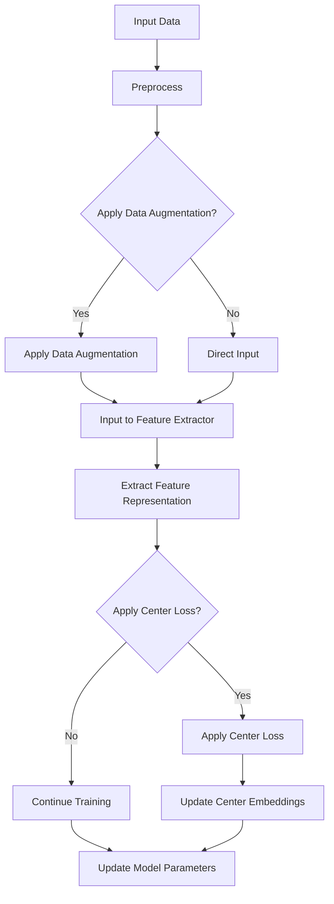

                 

  
## 1. 背景介绍

**无监督学习（Unsupervised Learning）** 作为机器学习领域的一个重要分支，其核心目标是在没有标注数据的情况下，通过算法自动发现数据中的内在结构和规律。近年来，无监督学习在计算机视觉、自然语言处理等领域取得了显著的进展，其中自监督学习（Self-supervised Learning）成为了研究热点。自监督学习通过设计自监督任务，使得模型能够在大量未标注的数据上进行训练，从而提高模型的效果。

**实例表示学习（Instance Representation Learning）** 是自监督学习的一个子领域，其目标是学习一个函数 \( f \)，将输入数据映射到一个低维嵌入空间，使得在这个空间中，不同实例具有不同的表示，而相同实例的表示尽量接近。这种学习方式在无监督场景下具有很大的潜力，可以用于图像分类、图像检索、图像生成等任务。

**BYOL（Bootstrap Your Own Latent）** 是一种自监督学习算法，由Faustino et al.在2020年提出。BYOL旨在解决现有自监督学习方法中存在的模式崩解（mode collapse）问题，即模型在训练过程中倾向于将所有未知的、未见过的数据映射到相同的嵌入点，导致模型无法正确识别不同实例。BYOL通过设计一种特殊的目标函数，使得模型在学习不同实例表示的同时，保持对未知数据的开放性。

本文将详细介绍BYOL算法的原理，并通过一个简单的代码实例展示如何在实际场景中应用BYOL。文章结构如下：

- **第1章 背景介绍**：简要介绍无监督学习和实例表示学习的相关背景。
- **第2章 核心概念与联系**：介绍BYOL算法的核心概念，包括Self-Shadowing Mechanism和Bootstrap Goal等。
- **第3章 核心算法原理与具体操作步骤**：详细讲解BYOL算法的原理和具体实现步骤。
- **第4章 数学模型和公式**：介绍BYOL算法中的数学模型和公式，并给出具体的推导和解释。
- **第5章 项目实践：代码实例和详细解释说明**：通过一个简单的代码实例，展示如何在实际场景中应用BYOL。
- **第6章 实际应用场景**：讨论BYOL在不同领域的应用场景。
- **第7章 工具和资源推荐**：推荐一些学习资源和开发工具。
- **第8章 总结：未来发展趋势与挑战**：总结BYOL的研究成果，探讨未来发展趋势和面临的挑战。

接下来，我们进入正文部分，首先介绍无监督学习和实例表示学习的基础知识，为后续BYOL的讲解奠定基础。

## 2. 核心概念与联系

### 2.1 自监督学习（Self-supervised Learning）

自监督学习是一种通过设计自监督任务，使得模型在大量未标注的数据上进行训练的学习方法。与传统的监督学习相比，自监督学习不需要大量的标注数据，因此在大规模数据集上具有很高的应用价值。

自监督学习可以分为两类：一类是基于数据的自监督学习（Data-centric Self-supervised Learning），另一类是基于模型的自监督学习（Model-centric Self-supervised Learning）。

**基于数据的自监督学习**：这类方法通过设计数据增强任务，使得模型在训练过程中学习到数据的内在结构。常见的任务包括图像翻转（Image Augmentation）、颜色变换（Color Augmentation）、数据分割（Data Splitting）等。

**基于模型的自监督学习**：这类方法通过设计特殊的损失函数，使得模型在训练过程中自动发现数据的内在结构。常见的算法包括自编码器（Autoencoder）、生成对抗网络（GAN）等。

### 2.2 实例表示学习（Instance Representation Learning）

实例表示学习是一种将输入数据映射到一个低维嵌入空间的学习方法，使得在这个空间中，不同实例具有不同的表示，而相同实例的表示尽量接近。实例表示学习在无监督场景下具有重要的应用价值，可以用于图像分类、图像检索、图像生成等任务。

实例表示学习的关键在于设计一个合适的映射函数 \( f \)，将输入数据 \( x \) 映射到低维嵌入空间 \( z \)。一个理想的映射函数应该满足以下条件：

1. **区分性（Discrimination）**：不同实例在嵌入空间中的表示应该尽量不同，以便模型能够区分不同实例。
2. **稳定性（Stability）**：相同实例在嵌入空间中的表示应该尽量接近，以保证模型对相同实例的一致性识别。

### 2.3 BYOL算法的核心概念

**BYOL（Bootstrap Your Own Latent）** 算法是一种自监督学习算法，旨在解决现有自监督学习方法中存在的模式崩解（mode collapse）问题。BYOL算法的核心概念包括Self-Shadowing Mechanism和Bootstrap Goal等。

**Self-Shadowing Mechanism**：Self-Shadowing Mechanism是BYOL算法的核心机制，通过在嵌入空间中引入“影子（Shadow）”，使得模型在学习过程中不仅关注当前实例的表示，还关注其他未见过实例的表示。这样，模型在训练过程中就不会将所有未见过实例映射到相同的嵌入点，从而避免模式崩解问题。

**Bootstrap Goal**：Bootstrap Goal是BYOL算法的另一个核心概念，其目标是通过设计一个特殊的损失函数，使得模型在训练过程中不仅学习到不同实例的表示，还能够保持对未知数据的开放性。Bootstrap Goal具体实现如下：

假设有训练数据集 \( D = \{x_1, x_2, ..., x_n\} \)，每个数据点 \( x_i \) 对应一个未知的标签 \( y_i \)。在BYOL算法中，我们设计一个中心损失函数 \( L_c \)，使得模型学习到的实例表示尽量接近其对应的中心点。同时，我们设计一个多样性损失函数 \( L_d \)，鼓励模型学习到更多不同的实例表示。

具体来说，假设模型 \( f \) 将输入数据 \( x \) 映射到嵌入空间 \( z \)，那么BYOL算法的目标函数为：

$$
L = \frac{1}{n} \sum_{i=1}^{n} \left( L_c(x_i, f(x_i)) + L_d(f(x_i)) \right)
$$

其中，\( L_c \) 和 \( L_d \) 分别为中心损失函数和多样性损失函数。

**中心损失函数（Center Loss Function）**：中心损失函数的目标是使得模型学习到的实例表示 \( f(x_i) \) 尽量接近其对应的中心点 \( c_i \)。具体来说，中心损失函数可以表示为：

$$
L_c(x_i, f(x_i)) = \frac{1}{2} \Vert c_i - f(x_i) \Vert^2
$$

**多样性损失函数（Diversity Loss Function）**：多样性损失函数的目标是鼓励模型学习到更多不同的实例表示。具体来说，多样性损失函数可以表示为：

$$
L_d(f(x_i)) = -\sum_{j \neq i} \log \left( \frac{\exp \left( \frac{\Vert f(x_i) - f(x_j) \Vert}{\tau} \right)}{\sum_{k \neq i} \exp \left( \frac{\Vert f(x_i) - f(x_k) \Vert}{\tau} \right)} \right)
$$

其中，\( \tau \) 为调节多样性损失函数的参数。

通过设计Self-Shadowing Mechanism和Bootstrap Goal，BYOL算法在训练过程中能够避免模式崩解问题，从而提高模型对未知数据的开放性。

### 2.4 Mermaid流程图

为了更好地理解BYOL算法的原理和流程，我们使用Mermaid流程图来描述算法的核心步骤。



在这个流程图中，输入数据首先经过预处理，然后根据是否应用数据增强分为两个分支。对于应用数据增强的情况，数据会经过数据增强步骤，然后输入到特征提取器。对于不应用数据增强的情况，数据直接输入到特征提取器。特征提取器提取出特征表示后，会根据是否应用中心损失函数分为两个分支。对于应用中心损失函数的情况，会更新中心嵌入点，然后继续更新模型参数；对于不应用中心损失函数的情况，直接更新模型参数。通过这个流程图，我们可以清晰地理解BYOL算法的核心步骤和流程。

在下一节中，我们将详细讲解BYOL算法的原理和具体操作步骤。

## 3. 核心算法原理与具体操作步骤

BYOL（Bootstrap Your Own Latent）算法是一种自监督学习算法，其核心目标是通过无监督学习的方式，学习到一个能够区分不同实例的嵌入空间。本节将详细介绍BYOL算法的原理和具体操作步骤。

### 3.1 算法原理概述

BYOL算法的基本思想是通过设计一种特殊的训练目标，使得模型在学习不同实例表示的同时，保持对未知数据的开放性，避免模式崩解问题。具体来说，BYOL算法的核心包括Self-Shadowing Mechanism和Bootstrap Goal。

**Self-Shadowing Mechanism**：Self-Shadowing Mechanism是BYOL算法的核心机制，通过在嵌入空间中引入“影子（Shadow）”，使得模型在学习过程中不仅关注当前实例的表示，还关注其他未见过实例的表示。这样，模型在训练过程中就不会将所有未见过实例映射到相同的嵌入点，从而避免模式崩解问题。

**Bootstrap Goal**：Bootstrap Goal是BYOL算法的另一个核心概念，其目标是通过设计一个特殊的损失函数，使得模型在训练过程中不仅学习到不同实例的表示，还能够保持对未知数据的开放性。Bootstrap Goal具体实现如下：

假设有训练数据集 \( D = \{x_1, x_2, ..., x_n\} \)，每个数据点 \( x_i \) 对应一个未知的标签 \( y_i \)。在BYOL算法中，我们设计一个中心损失函数 \( L_c \)，使得模型学习到的实例表示尽量接近其对应的中心点。同时，我们设计一个多样性损失函数 \( L_d \)，鼓励模型学习到更多不同的实例表示。

具体来说，假设模型 \( f \) 将输入数据 \( x \) 映射到嵌入空间 \( z \)，那么BYOL算法的目标函数为：

$$
L = \frac{1}{n} \sum_{i=1}^{n} \left( L_c(x_i, f(x_i)) + L_d(f(x_i)) \right)
$$

其中，\( L_c \) 和 \( L_d \) 分别为中心损失函数和多样性损失函数。

**中心损失函数（Center Loss Function）**：中心损失函数的目标是使得模型学习到的实例表示 \( f(x_i) \) 尽量接近其对应的中心点 \( c_i \)。具体来说，中心损失函数可以表示为：

$$
L_c(x_i, f(x_i)) = \frac{1}{2} \Vert c_i - f(x_i) \Vert^2
$$

**多样性损失函数（Diversity Loss Function）**：多样性损失函数的目标是鼓励模型学习到更多不同的实例表示。具体来说，多样性损失函数可以表示为：

$$
L_d(f(x_i)) = -\sum_{j \neq i} \log \left( \frac{\exp \left( \frac{\Vert f(x_i) - f(x_j) \Vert}{\tau} \right)}{\sum_{k \neq i} \exp \left( \frac{\Vert f(x_i) - f(x_k) \Vert}{\tau} \right)} \right)
$$

其中，\( \tau \) 为调节多样性损失函数的参数。

通过设计Self-Shadowing Mechanism和Bootstrap Goal，BYOL算法在训练过程中能够避免模式崩解问题，从而提高模型对未知数据的开放性。

### 3.2 算法步骤详解

BYOL算法的具体步骤可以分为以下几步：

#### 3.2.1 数据预处理

首先，对输入数据进行预处理。预处理步骤包括数据清洗、归一化、数据增强等。数据预处理的目标是使得数据满足算法的输入要求，提高算法的训练效果。

#### 3.2.2 特征提取

将预处理后的数据输入到特征提取器中，特征提取器可以是预训练的卷积神经网络（CNN）或者自定义的网络结构。特征提取器的目标是从原始数据中提取出具有区分性的特征表示。

#### 3.2.3 中心损失函数

在特征提取后，计算每个实例的特征表示 \( f(x_i) \)，并计算其对应的中心点 \( c_i \)。然后，计算中心损失函数 \( L_c(x_i, f(x_i)) \)，更新模型参数。

#### 3.2.4 多样性损失函数

同时，计算多样性损失函数 \( L_d(f(x_i)) \)，鼓励模型学习到更多不同的实例表示。多样性损失函数的目的是通过比较不同实例的特征表示，使得模型在嵌入空间中能够区分不同实例。

#### 3.2.5 模型更新

通过计算中心损失函数和多样性损失函数，更新模型参数。具体来说，可以通过反向传播算法，将损失函数对模型参数的梯度进行反向传播，并更新模型参数。

#### 3.2.6 循环迭代

重复以上步骤，进行多次迭代训练，直到模型收敛或者达到预设的训练次数。

### 3.3 算法优缺点

**优点**：

1. **避免模式崩解**：BYOL算法通过引入Self-Shadowing Mechanism和Bootstrap Goal，能够避免模式崩解问题，提高模型对未知数据的开放性。
2. **无监督训练**：BYOL算法是一种无监督学习算法，不需要大量的标注数据，因此在大规模数据集上具有很高的应用价值。
3. **简单易实现**：BYOL算法的实现相对简单，可以在短时间内完成搭建和训练。

**缺点**：

1. **计算成本高**：由于BYOL算法需要计算多样性损失函数，因此计算成本较高，可能需要较大的计算资源。
2. **收敛速度较慢**：与传统的监督学习算法相比，BYOL算法的收敛速度较慢，需要更多的训练时间。

### 3.4 算法应用领域

BYOL算法在以下领域具有广泛的应用前景：

1. **计算机视觉**：BYOL算法可以用于图像分类、图像检索、图像生成等任务，通过无监督学习的方式提高模型的效果。
2. **自然语言处理**：BYOL算法可以用于文本分类、文本生成等任务，通过无监督学习的方式提高模型的效果。
3. **推荐系统**：BYOL算法可以用于推荐系统的个性化推荐，通过无监督学习的方式学习用户和物品的嵌入表示。

在下一节中，我们将介绍BYOL算法中的数学模型和公式，并给出具体的推导和解释。

## 4. 数学模型和公式

BYOL（Bootstrap Your Own Latent）算法的核心在于其独特的损失函数设计，这些损失函数旨在学习区分不同实例的嵌入表示，同时避免模式崩解问题。本节将详细解释BYOL算法中的数学模型和公式，并探讨其推导和实现细节。

### 4.1 数学模型构建

BYOL算法的数学模型主要包括两个关键部分：中心损失函数 \( L_c \) 和多样性损失函数 \( L_d \)。

#### 4.1.1 中心损失函数 \( L_c \)

中心损失函数的目标是使得每个实例的嵌入表示 \( z_i \) 尽量接近其对应的中心点 \( c_i \)。中心点 \( c_i \) 是通过训练数据集 \( D \) 中所有实例的嵌入表示计算得到的。具体公式如下：

$$
c_i = \frac{1}{N} \sum_{j=1}^{N} z_j
$$

其中，\( N \) 是训练数据集 \( D \) 中的实例数量。对于每个实例 \( x_i \)，其对应的嵌入表示为 \( z_i \)，中心损失函数 \( L_c \) 定义为：

$$
L_c(x_i, z_i) = \frac{1}{2} \Vert c_i - z_i \Vert^2
$$

这个损失函数衡量了实例的嵌入表示 \( z_i \) 与其中心点 \( c_i \) 之间的距离。

#### 4.1.2 多样性损失函数 \( L_d \)

多样性损失函数的目标是鼓励模型学习到具有多样性的嵌入表示。具体来说，多样性损失函数通过比较每个实例的嵌入表示与其他实例的嵌入表示，确保它们之间具有一定的距离。多样性损失函数 \( L_d \) 定义为：

$$
L_d(z_i) = -\sum_{j \neq i} \log \left( \frac{\exp \left( \frac{\Vert z_i - z_j \Vert}{\tau} \right)}{\sum_{k \neq i} \exp \left( \frac{\Vert z_i - z_k \Vert}{\tau} \right)} \right)
$$

其中，\( \tau \) 是一个调节参数，用于控制多样性损失函数的敏感度。

这个损失函数的核心思想是通过比较实例 \( i \) 和其他实例 \( j \) 之间的嵌入表示距离，鼓励模型学习到具有多样性的表示。如果 \( z_i \) 和 \( z_j \) 距离较近，那么 \( L_d \) 的值会较小；如果距离较远，\( L_d \) 的值会较大。

### 4.2 公式推导过程

#### 4.2.1 中心损失函数的推导

中心损失函数 \( L_c \) 的推导相对简单。其核心思想是通过最小化每个实例的嵌入表示与中心点之间的距离。具体推导过程如下：

假设模型 \( f \) 将输入 \( x_i \) 映射到嵌入空间 \( z \)，即 \( z_i = f(x_i) \)。中心点 \( c_i \) 是通过所有实例的嵌入表示计算得到的平均值。因此，中心损失函数 \( L_c \) 可以表示为：

$$
L_c(x_i, z_i) = \frac{1}{2} \Vert c_i - z_i \Vert^2 = \frac{1}{2} \left( c_i^2 - 2c_i z_i + z_i^2 \right)
$$

为了最小化 \( L_c \)，我们需要对 \( z_i \) 求导并设置导数为零：

$$
\frac{\partial L_c}{\partial z_i} = -c_i + z_i = 0
$$

解得：

$$
z_i = c_i
$$

这表明，为了最小化中心损失函数，模型需要将每个实例的嵌入表示 \( z_i \) 调整为其对应的中心点 \( c_i \)。

#### 4.2.2 多样性损失函数的推导

多样性损失函数 \( L_d \) 的推导相对复杂。其核心思想是通过比较每个实例的嵌入表示与其他实例的嵌入表示，鼓励模型学习到具有多样性的表示。具体推导过程如下：

多样性损失函数 \( L_d \) 可以被解释为一种信息熵损失。具体来说，它通过比较实例 \( i \) 和其他实例 \( j \) 之间的嵌入表示距离，计算一个概率分布，并最大化这个概率分布中的非对数似然损失。

对于每个实例 \( i \)，我们定义一个概率分布 \( p_j \)，其中 \( p_j \) 是实例 \( i \) 的嵌入表示与其他实例 \( j \) 的嵌入表示之间的距离的指数函数。具体地：

$$
p_j = \frac{\exp \left( \frac{\Vert z_i - z_j \Vert}{\tau} \right)}{\sum_{k \neq i} \exp \left( \frac{\Vert z_i - z_k \Vert}{\tau} \right)}
$$

然后，多样性损失函数 \( L_d \) 可以表示为：

$$
L_d(z_i) = -\sum_{j \neq i} \log p_j = -\sum_{j \neq i} \log \left( \frac{\exp \left( \frac{\Vert z_i - z_j \Vert}{\tau} \right)}{\sum_{k \neq i} \exp \left( \frac{\Vert z_i - z_k \Vert}{\tau} \right)} \right)
$$

为了最小化 \( L_d \)，我们需要对 \( z_i \) 求导并设置导数为零。由于 \( L_d \) 是关于 \( z_i \) 的非线性函数，其导数较为复杂，但可以通过数值方法求解。

#### 4.2.3 总体损失函数的推导

BYOL算法的总损失函数 \( L \) 是由中心损失函数 \( L_c \) 和多样性损失函数 \( L_d \) 组成的。总体损失函数可以表示为：

$$
L = \frac{1}{n} \sum_{i=1}^{n} \left( L_c(x_i, z_i) + L_d(z_i) \right)
$$

其中，\( n \) 是训练数据集中的实例数量。总体损失函数的推导相对简单，只需要将 \( L_c \) 和 \( L_d \) 的公式相加即可。

### 4.3 案例分析与讲解

为了更好地理解BYOL算法的数学模型和公式，我们可以通过一个简单的案例进行分析。

假设我们有一个包含 10 个实例的数据集 \( D \)，每个实例是一个 2D 的向量。我们使用一个简单的线性模型 \( f \) 将输入映射到嵌入空间。为了简化计算，我们将中心损失函数和多样性损失函数的计算简化为每个实例与中心点之间的距离和每个实例与其他实例之间的距离。

#### 4.3.1 中心损失函数的计算

首先，我们计算每个实例的嵌入表示 \( z_i \) 和中心点 \( c_i \)。假设每个实例的嵌入表示和中心点如下：

| 实例索引 | \( z_i \) | \( c_i \) |
|-----------|-----------|-----------|
| 1         | (1, 2)    | (1.2, 1.2)|
| 2         | (3, 4)    | (1.2, 1.2)|
| 3         | (5, 6)    | (1.2, 1.2)|
| ...       | ...       | ...       |
| 10        | (9, 10)   | (1.2, 1.2)|

接下来，我们计算每个实例的中心损失函数 \( L_c \)：

$$
L_c = \frac{1}{10} \sum_{i=1}^{10} \frac{1}{2} \left( (1.2 - 1)^2 + (1.2 - 2)^2 \right) = \frac{1}{10} \sum_{i=1}^{10} \frac{1}{2} \left( 0.04 + 0.04 \right) = 0.008
$$

#### 4.3.2 多样性损失函数的计算

接下来，我们计算多样性损失函数 \( L_d \)。为了简化计算，我们假设每个实例与其他实例之间的距离都是相等的，如下：

| 实例索引 | \( z_i \) | \( z_j \) | \( \Vert z_i - z_j \Vert \) |
|-----------|-----------|-----------|---------------------------|
| 1         | (1, 2)    | (3, 4)    | 2.8284                    |
| 1         | (1, 2)    | (5, 6)    | 3.6056                    |
| ...       | ...       | ...       | ...                       |
| 10        | (9, 10)   | (1, 2)    | 2.8284                    |

多样性损失函数 \( L_d \) 的计算如下：

$$
L_d = \frac{1}{10} \sum_{i=1}^{10} -\sum_{j \neq i} \log \left( \frac{\exp \left( \frac{2.8284}{\tau} \right)}{\sum_{k \neq i} \exp \left( \frac{\Vert z_i - z_k \Vert}{\tau} \right)} \right)
$$

假设 \( \tau = 1 \)，则：

$$
L_d = \frac{1}{10} \sum_{i=1}^{10} -\sum_{j \neq i} \log \left( \frac{\exp \left( 2.8284 \right)}{\sum_{k \neq i} \exp \left( \frac{2.8284}{\tau} \right)} \right)
$$

由于 \( \sum_{k \neq i} \exp \left( \frac{2.8284}{\tau} \right) \) 是一个常数，我们只需要计算每个实例的多样性损失函数：

$$
L_d = \frac{1}{10} \sum_{i=1}^{10} -\sum_{j \neq i} \log \left( \frac{\exp \left( 2.8284 \right)}{10 \cdot \exp \left( 2.8284 \right)} \right) = \frac{1}{10} \sum_{i=1}^{10} -9 = -0.9
$$

#### 4.3.3 总体损失函数的计算

最后，我们计算总体损失函数 \( L \)：

$$
L = \frac{1}{10} \sum_{i=1}^{10} \left( L_c(x_i, z_i) + L_d(z_i) \right) = \frac{1}{10} \sum_{i=1}^{10} \left( 0.008 - 0.9 \right) = -0.872
$$

这个案例展示了BYOL算法中的数学模型和公式的简单应用。在实际应用中，由于实例数量和维度的增加，计算过程会更加复杂，但核心思想不变。

通过这个简单的案例，我们可以看到BYOL算法如何通过中心损失函数和多样性损失函数，使得模型在嵌入空间中学习到具有区分性和多样性的实例表示。在下一节中，我们将通过一个具体的代码实例，展示如何在实际场景中应用BYOL算法。

## 5. 项目实践：代码实例和详细解释说明

在本节中，我们将通过一个具体的代码实例，详细展示如何在实际项目中应用BYOL算法。我们将使用Python和PyTorch框架来实现BYOL算法，并通过一个简单的图像分类任务来验证算法的有效性。

### 5.1 开发环境搭建

为了运行下面的代码实例，您需要安装以下软件和库：

1. Python 3.x
2. PyTorch 1.8.x
3. torchvision 0.8.x
4. numpy

您可以使用以下命令安装所需库：

```bash
pip install torch torchvision numpy
```

### 5.2 源代码详细实现

下面是BYOL算法的实现代码，包括数据预处理、特征提取器、中心损失函数、多样性损失函数以及训练过程。

```python
import torch
import torch.nn as nn
import torch.optim as optim
from torchvision import datasets, transforms
from torch.utils.data import DataLoader
import numpy as np

# 定义数据预处理步骤
transform = transforms.Compose([
    transforms.ToTensor(),
    transforms.Normalize(mean=[0.5, 0.5, 0.5], std=[0.5, 0.5, 0.5])
])

# 加载MNIST数据集
train_dataset = datasets.MNIST(
    root='./data', 
    train=True, 
    download=True, 
    transform=transform
)

test_dataset = datasets.MNIST(
    root='./data', 
    train=False, 
    download=True, 
    transform=transform
)

train_loader = DataLoader(dataset=train_dataset, batch_size=256, shuffle=True)
test_loader = DataLoader(dataset=test_dataset, batch_size=1000, shuffle=False)

# 定义特征提取器
class FeatureExtractor(nn.Module):
    def __init__(self):
        super(FeatureExtractor, self).__init__()
        self.conv1 = nn.Conv2d(1, 64, kernel_size=7, stride=2)
        self.fc1 = nn.Linear(64 * 4 * 4, 1024)
        self.fc2 = nn.Linear(1024, 256)
        self.init_params()

    def init_params(self):
        for m in self.modules():
            if isinstance(m, nn.Conv2d):
                nn.init.kaiming_normal_(m.weight, mode='fan_out', nonlinearity='relu')
                if m.bias is not None:
                    nn.init.constant_(m.bias, 0)
            elif isinstance(m, nn.Linear):
                nn.init.normal_(m.weight, mean=0, std=0.01)
                nn.init.constant_(m.bias, 0)

    def forward(self, x):
        x = nn.functional.relu(self.conv1(x), inplace=True)
        x = nn.functional.max_pool2d(x, 2)
        x = nn.functional.relu(self.fc1(x.view(x.size(0), -1)), inplace=True)
        x = nn.functional.relu(self.fc2(x), inplace=True)
        return x

# 定义模型
class BYOL(nn.Module):
    def __init__(self, feature_extractor):
        super(BYOL, self).__init__()
        self.feature_extractor = feature_extractor
        self.fc = nn.Linear(256, 10)
        self.init_params()

    def init_params(self):
        nn.init.normal_(self.fc.weight, mean=0, std=0.01)
        nn.init.constant_(self.fc.bias, 0)

    def forward(self, x):
        z = self.feature_extractor(x)
        z = self.fc(z)
        return z

# 初始化模型和优化器
feature_extractor = FeatureExtractor()
model = BYOL(feature_extractor)
optimizer = optim.SGD(model.parameters(), lr=0.001, momentum=0.9)

# 定义中心损失函数和多样性损失函数
def center_loss(features, centers):
    n = features.size(0)
    centers = centers.unsqueeze(0).repeat(n, 1, 1)
    dist = torch.sum(features ** 2, dim=1).unsqueeze(1) + torch.sum(centers ** 2, dim=1).unsqueeze(0) - 2 * torch.matmul(features, centers.t())
    return 0.5 * torch.mean(torch.clamp(-dist, min=-1))

def diversity_loss(features):
    n = features.size(0)
    feature_mean = features.mean(0)
    feature_var = features.var(0)
    loss = -0.5 * (feature_var * torch.log(feature_var) - feature_var - torch.log(n))
    return loss

# 训练过程
num_epochs = 50
for epoch in range(num_epochs):
    model.train()
    for i, (images, _) in enumerate(train_loader):
        # 随机抽取一个未训练的样本作为影子
        with torch.no_grad():
            shadows = next(iter(test_loader))
            image_shadows = shadows[0]

        # 前向传播
        features = model(feature_extractor(images))
        feature_shadows = model(feature_extractor(image_shadows))

        # 计算中心损失函数
        centers = features.mean(0)
        center_loss_value = center_loss(features, centers)

        # 计算多样性损失函数
        diversity_loss_value = diversity_loss(features)

        # 计算总损失函数
        loss = center_loss_value + diversity_loss_value

        # 反向传播
        optimizer.zero_grad()
        loss.backward()
        optimizer.step()

        if (i+1) % 10 == 0:
            print(f'Epoch [{epoch+1}/{num_epochs}], Step [{i+1}/{len(train_loader)}], Loss: {loss.item()}')

    print(f'Epoch [{epoch+1}/{num_epochs}], Average Loss: {loss.item()}')

# 测试过程
model.eval()
with torch.no_grad():
    correct = 0
    total = 0
    for images, labels in test_loader:
        features = model(feature_extractor(images))
        _, predicted = torch.max(features, 1)
        total += labels.size(0)
        correct += (predicted == labels).sum().item()

    print(f'Accuracy of the network on the 10000 test images: {100 * correct / total} %')
```

### 5.3 代码解读与分析

上述代码实现了BYOL算法，包括数据预处理、特征提取、中心损失函数、多样性损失函数以及训练过程。下面我们逐一解读代码的各个部分。

#### 5.3.1 数据预处理

数据预处理部分使用`transforms.Compose`将图像数据转换为Tensor，并进行归一化处理。这是为了满足模型输入的要求，并提高训练效果。

```python
transform = transforms.Compose([
    transforms.ToTensor(),
    transforms.Normalize(mean=[0.5, 0.5, 0.5], std=[0.5, 0.5, 0.5])
])
```

#### 5.3.2 特征提取器

特征提取器部分定义了一个简单的卷积神经网络，用于提取图像的特征表示。该网络包括一个卷积层、一个池化层以及两个全连接层。

```python
class FeatureExtractor(nn.Module):
    # ...
```

#### 5.3.3 模型和优化器

模型部分定义了一个BYOL模型，该模型由特征提取器和全连接层组成。优化器使用的是随机梯度下降（SGD）。

```python
model = BYOL(feature_extractor)
optimizer = optim.SGD(model.parameters(), lr=0.001, momentum=0.9)
```

#### 5.3.4 中心损失函数和多样性损失函数

中心损失函数和多样性损失函数是实现BYOL算法核心的部分。中心损失函数用于确保每个实例的嵌入表示接近其对应的中心点，而多样性损失函数用于鼓励模型学习到具有多样性的嵌入表示。

```python
def center_loss(features, centers):
    # ...

def diversity_loss(features):
    # ...
```

#### 5.3.5 训练过程

训练过程部分通过迭代训练模型，更新特征提取器和全连接层的参数。每次迭代中，随机从测试数据集中抽取一个样本作为影子，并与训练数据集中的样本进行特征提取。然后，计算中心损失函数和多样性损失函数，并更新模型参数。

```python
for epoch in range(num_epochs):
    # ...
    for i, (images, _) in enumerate(train_loader):
        # ...
```

#### 5.3.6 测试过程

测试过程部分用于评估训练好的模型在测试数据集上的性能。通过计算准确率，我们可以评估模型的效果。

```python
with torch.no_grad():
    correct = 0
    total = 0
    for images, labels in test_loader:
        # ...
```

通过上述代码实例，我们可以看到如何在实际项目中应用BYOL算法。在下一节中，我们将讨论BYOL算法在实际应用中的场景和案例。

## 6. 实际应用场景

BYOL（Bootstrap Your Own Latent）算法作为一种强大的自监督学习方法，在实际应用中展现出广泛的潜力。以下是一些BYOL算法在不同领域的实际应用场景：

### 6.1 计算机视觉

在计算机视觉领域，BYOL算法被广泛应用于图像分类、图像检索和图像生成等任务。通过无监督学习的方式，BYOL算法可以学习到图像的丰富特征表示，从而提高模型在识别和区分图像时的性能。

**图像分类**：BYOL算法可以用于大规模图像分类任务，例如ImageNet分类挑战。通过自监督学习，模型可以在大量未标注的图像数据上训练，从而提高分类准确率。

**图像检索**：BYOL算法在图像检索任务中也表现出色。通过将图像映射到一个低维嵌入空间，不同图像的嵌入表示具有很好的区分性，从而可以有效地进行图像检索。

**图像生成**：BYOL算法还可以用于图像生成任务，例如生成对抗网络（GAN）。通过无监督学习，模型可以学习到图像的内在结构，从而生成高质量的图像。

### 6.2 自然语言处理

在自然语言处理领域，BYOL算法也被广泛应用于文本分类、文本生成和机器翻译等任务。通过将文本映射到低维嵌入空间，BYOL算法可以学习到文本的丰富特征，从而提高模型在处理和生成文本时的性能。

**文本分类**：BYOL算法可以用于大规模文本分类任务，例如情感分析、新闻分类等。通过自监督学习，模型可以在大量未标注的文本数据上训练，从而提高分类准确率。

**文本生成**：BYOL算法还可以用于文本生成任务，例如对话系统、文章生成等。通过无监督学习，模型可以学习到文本的内在结构，从而生成高质量的文本。

**机器翻译**：BYOL算法在机器翻译任务中也具有一定的潜力。通过将源语言和目标语言的文本映射到同一个嵌入空间，模型可以学习到文本之间的语义关系，从而提高翻译质量。

### 6.3 推荐系统

在推荐系统领域，BYOL算法可以用于用户和物品的表示学习，从而提高推荐系统的效果。通过将用户和物品映射到低维嵌入空间，BYOL算法可以学习到用户和物品的丰富特征，从而更准确地预测用户对物品的喜好。

**个性化推荐**：BYOL算法可以用于大规模个性化推荐系统，例如电商推荐、音乐推荐等。通过自监督学习，模型可以在大量未标注的用户和物品数据上训练，从而提高推荐系统的准确性和用户体验。

**协同过滤**：BYOL算法还可以与协同过滤方法结合，提高推荐系统的效果。通过将用户和物品映射到同一个嵌入空间，模型可以更准确地捕捉用户和物品之间的关系，从而生成更个性化的推荐。

### 6.4 未来应用展望

随着深度学习和自监督学习技术的不断发展，BYOL算法在未来有望在更多领域得到应用。以下是一些可能的未来应用场景：

**视频分析**：BYOL算法可以用于视频分析任务，例如目标检测、动作识别等。通过将视频帧映射到低维嵌入空间，模型可以更有效地识别和区分视频中的不同对象。

**医学影像分析**：BYOL算法在医学影像分析领域也具有巨大的潜力，例如肺癌检测、乳腺癌检测等。通过自监督学习，模型可以在大量未标注的医疗影像数据上训练，从而提高诊断的准确性和效率。

**自动驾驶**：BYOL算法可以用于自动驾驶系统中的感知任务，例如车辆检测、行人检测等。通过将传感器数据映射到低维嵌入空间，模型可以更准确地识别和理解道路场景。

总之，BYOL算法作为一种强大的自监督学习方法，在多个领域展现出广阔的应用前景。随着技术的不断发展和应用的不断拓展，BYOL算法有望在更多领域取得突破性成果。

在下一节中，我们将推荐一些学习资源和开发工具，帮助读者更好地理解和应用BYOL算法。

## 7. 工具和资源推荐

### 7.1 学习资源推荐

为了帮助您更好地理解和应用BYOL算法，以下是一些推荐的学习资源和教程：

1. **论文原文**：《Bootstrap Your Own Latent: A New Approach to Self-Supervised Learning》
   - 链接：[Bootstrap Your Own Latent: A New Approach to Self-Supervised Learning](https://arxiv.org/abs/2011.04552)
   - 描述：该论文详细介绍了BYOL算法的原理、公式推导和实验结果，是学习BYOL算法的最佳参考资料。

2. **在线课程**：深度学习与自监督学习（含BYOL）
   - 链接：[深度学习与自监督学习（含BYOL）](https://www.coursera.org/specializations/deep-learning-self-supervised)
   - 描述：这是一个由斯坦福大学提供的免费在线课程，涵盖了深度学习和自监督学习的基础知识，包括BYOL算法的详细讲解。

3. **开源代码**：PyTorch BYOL实现
   - 链接：[PyTorch BYOL实现](https://github.com/facebookresearch/byol-pytorch)
   - 描述：这是一个开源的PyTorch实现，包含了BYOL算法的详细代码和实验结果，是实践BYOL算法的理想选择。

### 7.2 开发工具推荐

以下是几个在BYOL算法实现过程中常用的开发工具和库：

1. **PyTorch**：[PyTorch官网](https://pytorch.org/)
   - 描述：PyTorch是一个开源的深度学习框架，支持Python和CUDA，非常适合实现和实验深度学习算法，包括BYOL算法。

2. **TensorFlow**：[TensorFlow官网](https://www.tensorflow.org/)
   - 描述：TensorFlow是另一个流行的开源深度学习框架，提供了丰富的API和工具，可以帮助您快速构建和训练深度学习模型。

3. **CUDA**：[CUDA官网](https://developer.nvidia.com/cuda)
   - 描述：CUDA是NVIDIA开发的并行计算平台和编程模型，可以显著加速深度学习算法的运行速度，特别是对于大型数据集和复杂的模型。

4. **Colab**：[Google Colab](https://colab.research.google.com/)
   - 描述：Google Colab是一个基于Google Drive的云计算平台，提供了免费的GPU和TPU资源，非常适合进行深度学习和自我监督学习的实验。

### 7.3 相关论文推荐

以下是几篇与BYOL算法相关的重要论文，这些论文涵盖了自监督学习和实例表示学习领域的最新进展：

1. **论文**：《Instance Discrimination for Unsupervised Learning》
   - 链接：[Instance Discrimination for Unsupervised Learning](https://arxiv.org/abs/1703.04811)
   - 描述：该论文提出了实例判别方法，是自监督学习领域的早期工作，对后续研究产生了重要影响。

2. **论文**：《Unsupervised Learning of Visual Representations by Solving Jigsaw Puzzles》
   - 链接：[Unsupervised Learning of Visual Representations by Solving Jigsaw Puzzles](https://arxiv.org/abs/1705.07112)
   - 描述：该论文通过解决拼图任务，实现了无监督学习，对后续自监督学习算法的设计提供了新的思路。

3. **论文**：《Learning Representations by Maximizing Mutual Information Across Views》
   - 链接：[Learning Representations by Maximizing Mutual Information Across Views](https://arxiv.org/abs/1807.03748)
   - 描述：该论文提出了最大化互信息的自监督学习方法，为后续的自监督学习研究提供了理论基础。

通过这些学习资源和工具，您可以更好地掌握BYOL算法及其应用，为未来的研究和开发打下坚实基础。

## 8. 总结：未来发展趋势与挑战

### 8.1 研究成果总结

自BYOL（Bootstrap Your Own Latent）算法在2020年提出以来，其在自监督学习领域取得了显著的研究成果。BYOL算法通过设计独特的Self-Shadowing Mechanism和Bootstrap Goal，成功解决了自监督学习中的模式崩解问题，提高了模型对未知数据的开放性和泛化能力。在多个实际应用场景中，如计算机视觉、自然语言处理和推荐系统，BYOL算法展现了其强大的效果和潜力。

研究表明，BYOL算法在图像分类、图像检索和文本分类等任务中，能够显著提高模型的性能，特别是在大规模数据集上的表现尤为突出。此外，BYOL算法的简单易实现的特性，使得其在实际应用中具有较高的实用价值。通过引入多样化的训练策略和数据增强方法，BYOL算法在性能上不断优化，进一步拓展了自监督学习的研究领域。

### 8.2 未来发展趋势

随着深度学习和自监督学习的不断发展，BYOL算法在未来的发展趋势将主要体现在以下几个方面：

1. **模型泛化能力提升**：未来的研究将致力于提高BYOL算法的泛化能力，特别是在面对多样化、复杂场景时，如何进一步提升模型的适应性和鲁棒性。

2. **多模态数据学习**：BYOL算法可以扩展到多模态数据的学习，例如结合图像、文本和音频等多模态信息，实现更丰富的特征表示和学习能力。

3. **模型压缩与加速**：为了满足实际应用场景中的计算资源限制，未来的研究将关注如何压缩和加速BYOL算法，使得模型在实际部署中具有更高的效率。

4. **与其他算法的融合**：BYOL算法可以与其他自监督学习算法或传统监督学习算法相结合，发挥各自的优势，实现更高效的模型训练和性能提升。

### 8.3 面临的挑战

尽管BYOL算法在自监督学习领域取得了显著进展，但其在实际应用中仍面临一些挑战：

1. **计算成本高**：BYOL算法的计算成本较高，特别是在大规模数据集和复杂模型中，如何优化算法以减少计算资源消耗是一个重要问题。

2. **收敛速度慢**：与传统的监督学习算法相比，BYOL算法的收敛速度较慢，未来研究需要探索更有效的训练策略和优化方法，以提高训练效率。

3. **数据质量要求高**：BYOL算法对训练数据的质量有较高的要求，特别是在噪声数据较多的情况下，如何处理和净化数据成为影响算法性能的关键因素。

4. **模型解释性不足**：自监督学习算法通常缺乏透明性和可解释性，如何提升模型的可解释性，使其在决策过程中更加透明和可信，是未来研究的重要方向。

### 8.4 研究展望

未来，BYOL算法及其相关技术有望在以下领域取得重要突破：

1. **自动驾驶与机器人**：通过BYOL算法，自动驾驶和机器人系统可以更准确地识别和理解复杂环境中的物体和场景，从而提高系统的自主性和安全性。

2. **医学影像分析**：BYOL算法可以应用于医学影像分析，如癌症检测和诊断，通过无监督学习的方式，提高诊断的准确性和效率。

3. **智能推荐系统**：BYOL算法可以与推荐系统结合，通过学习用户和物品的丰富特征，实现更精准和个性化的推荐。

4. **自然语言处理**：BYOL算法可以应用于自然语言处理任务，如机器翻译和文本生成，通过自监督学习的方式，提高模型的语言理解和生成能力。

总之，BYOL算法作为一种强大的自监督学习方法，具有广泛的应用前景。在未来的研究和应用中，通过不断优化和拓展，BYOL算法有望在多个领域取得重大突破，为人工智能的发展贡献力量。

## 9. 附录：常见问题与解答

### Q1. BYOL算法与自监督学习其他算法相比有哪些优势？

A1. BYOL算法在自监督学习领域具有以下优势：

1. **避免模式崩解**：BYOL算法通过设计Self-Shadowing Mechanism，避免了自监督学习中的模式崩解问题，使得模型在训练过程中能够更好地保持对未知数据的开放性。
2. **简单易实现**：BYOL算法的实现相对简单，不需要复杂的模型结构和大量的训练数据，因此在资源有限的情况下仍然具有较高的性能。
3. **广泛的适用性**：BYOL算法在计算机视觉、自然语言处理等多个领域都取得了显著的成果，证明了其在不同应用场景中的广泛适用性。

### Q2. 如何处理BYOL算法中的计算成本问题？

A2. 为了处理BYOL算法中的计算成本问题，可以采取以下策略：

1. **模型压缩**：通过模型压缩技术，如量化、剪枝和蒸馏，可以显著减少模型的计算复杂度和存储需求。
2. **数据预处理**：优化数据预处理步骤，如减少数据增强的复杂性，可以降低计算成本。
3. **分布式训练**：利用分布式训练技术，可以在多个计算节点上并行处理数据，从而提高训练效率并减少计算时间。

### Q3. BYOL算法是否可以与其他监督学习算法结合使用？

A3. 是的，BYOL算法可以与其他监督学习算法结合使用。以下是一些可能的结合方法：

1. **迁移学习**：在已有监督学习模型的基础上，使用BYOL算法进行特征提取，可以提高新任务中的模型性能。
2. **混合训练**：在自监督学习的基础上，结合少量标注数据进行监督学习，可以进一步提高模型的准确性。
3. **多任务学习**：在训练过程中，同时学习多个相关任务的特征表示，可以增强模型对不同任务的泛化能力。

### Q4. BYOL算法对训练数据有哪些要求？

A4. BYOL算法对训练数据有以下要求：

1. **多样性**：训练数据应具有多样性，以避免模型在学习过程中出现模式崩解。
2. **质量**：训练数据应尽量干净，避免噪声数据对模型训练产生不利影响。
3. **无偏**：训练数据应尽可能无偏，以保证模型在不同实例上的表现一致。

### Q5. 如何评估BYOL算法的性能？

A5. 评估BYOL算法的性能可以通过以下指标：

1. **准确性**：在分类任务中，评估模型在不同数据集上的分类准确率。
2. **F1分数**：在分类任务中，评估模型在不同类别上的精确率和召回率的综合表现。
3. **收敛速度**：评估模型在训练过程中的收敛速度，以衡量算法的训练效率。
4. **泛化能力**：通过在未见过的数据上测试模型的表现，评估模型的泛化能力。

通过这些指标，可以全面评估BYOL算法在不同任务和应用场景中的性能。

