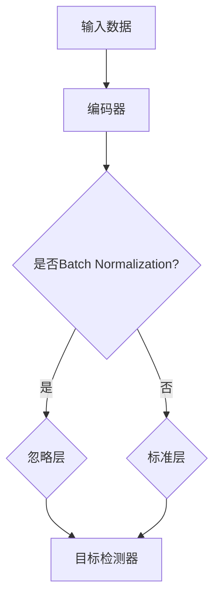

                 

关键词：自监督学习，无监督学习，Batch Normalization，对比学习，知识蒸馏，Torch，PyTorch，深度学习，计算机视觉

> 摘要：本文将深入讲解Batch Normalization-based Omitting Layer（BYOL）算法的基本原理，并辅以实际代码实例，帮助读者更好地理解该算法的运用。我们将从背景介绍、核心概念与联系、核心算法原理、数学模型和公式、项目实践以及实际应用场景等方面展开讨论。

## 1. 背景介绍

在深度学习领域，监督学习占据着主导地位。但是，由于获取大量标注数据的成本高昂，无监督学习和自监督学习逐渐成为研究热点。自监督学习是一种无标签数据的学习方法，它通过利用数据内在的结构信息来训练模型，从而降低对标注数据的依赖。Batch Normalization-based Omitting Layer（BYOL）正是这样一种自监督学习算法。

BYOL算法是由Facebook AI Research（FAIR）在2019年提出，它基于Batch Normalization（BN）技术，通过构造一种特殊的层——忽略层（Omitting Layer），使得模型在训练过程中不需要使用标签，从而实现了对数据的无监督学习。BYOL算法在图像识别、语音识别等领域都取得了优异的性能。

## 2. 核心概念与联系

BYOL算法的核心在于其独特的结构设计。为了更好地理解，我们先来介绍一下相关的核心概念。

### 2.1 Batch Normalization

Batch Normalization是一种常见的正则化技术，用于加速训练和提升模型的泛化能力。它通过对每个特征在每个训练批次上进行标准化，使得网络在训练过程中更加稳定。

### 2.2 对比学习

对比学习是一种自监督学习方法，其基本思想是通过对比正样本和负样本来学习。在BYOL算法中，对比学习起到了关键作用。

### 2.3 知识蒸馏

知识蒸馏是一种将大型复杂模型的知识转移到小型简单模型上的技术。在BYOL算法中，知识蒸馏用于将编码器（encoder）的知识转移到目标检测器（target detector）上。

下面是BYOL算法的核心概念原理和架构的Mermaid流程图：



## 3. 核心算法原理 & 具体操作步骤

### 3.1 算法原理概述

BYOL算法的基本原理是通过在训练过程中同时优化编码器和目标检测器，使得编码器能够更好地捕捉数据特征。具体来说，编码器接收输入数据，然后通过忽略层（或标准层）将数据传递给目标检测器。目标检测器的目标是判断输入数据是否为目标。

### 3.2 算法步骤详解

BYOL算法的具体步骤如下：

1. **数据预处理**：对输入数据进行预处理，包括归一化、随机裁剪、翻转等。
2. **编码器训练**：使用无标签数据对编码器进行训练，使得编码器能够捕捉数据的特征。
3. **目标检测器训练**：使用编码器输出的特征对目标检测器进行训练，使得目标检测器能够识别数据中的目标。
4. **模型优化**：通过优化编码器和目标检测器的参数，使得模型在验证集上取得最佳性能。

### 3.3 算法优缺点

BYOL算法的优点：

- 无需标注数据，降低了数据获取成本。
- 通过自监督学习，提高了模型的泛化能力。

BYOL算法的缺点：

- 训练时间较长，需要大量计算资源。
- 对于一些复杂的任务，可能无法达到监督学习的性能。

### 3.4 算法应用领域

BYOL算法在计算机视觉领域有着广泛的应用，例如：

- 图像分类
- 目标检测
- 人脸识别

## 4. 数学模型和公式

BYOL算法的数学模型主要包括编码器、忽略层和目标检测器的损失函数。

### 4.1 数学模型构建

编码器的损失函数：

$$
L_{encoder} = -\frac{1}{N} \sum_{i=1}^{N} \log P(y_i=1|x_i; \theta_{encoder}),
$$

其中，$x_i$ 是输入数据，$y_i$ 是标签，$\theta_{encoder}$ 是编码器的参数。

忽略层的损失函数：

$$
L_{ignore} = -\frac{1}{N} \sum_{i=1}^{N} \log P(y_i=0|x_i; \theta_{ignore}),
$$

其中，$x_i$ 是输入数据，$y_i$ 是标签，$\theta_{ignore}$ 是忽略层的参数。

目标检测器的损失函数：

$$
L_{detector} = -\frac{1}{N} \sum_{i=1}^{N} \log P(y_i=1|x_i; \theta_{detector}),
$$

其中，$x_i$ 是输入数据，$y_i$ 是标签，$\theta_{detector}$ 是目标检测器的参数。

### 4.2 公式推导过程

编码器的损失函数是通过最大化似然估计得到的。忽略层的损失函数是通过最大化似然估计和忽略层的假设得到的。目标检测器的损失函数是通过最大化似然估计得到的。

### 4.3 案例分析与讲解

假设我们有一个包含10张图像的数据集，每张图像都有标签（1表示目标，0表示非目标）。使用BYOL算法进行训练，编码器、忽略层和目标检测器的参数分别为$\theta_{encoder}$、$\theta_{ignore}$和$\theta_{detector}$。

在训练过程中，我们首先对输入图像进行预处理，然后分别计算编码器、忽略层和目标检测器的损失函数。通过优化这些损失函数，我们可以得到最优的编码器、忽略层和目标检测器参数。

## 5. 项目实践：代码实例和详细解释说明

在本节中，我们将通过一个具体的PyTorch项目实例来展示如何实现BYOL算法。代码分为以下几个部分：

### 5.1 开发环境搭建

首先，我们需要搭建一个PyTorch的开发环境。具体步骤如下：

1. 安装PyTorch：
```bash
pip install torch torchvision
```

2. 安装其他依赖：
```bash
pip install numpy matplotlib
```

### 5.2 源代码详细实现

以下是BYOL算法的PyTorch实现：

```python
import torch
import torch.nn as nn
import torch.optim as optim
from torchvision import datasets, transforms
from torch.utils.data import DataLoader

# 定义模型
class BYOL(nn.Module):
    def __init__(self):
        super(BYOL, self).__init__()
        self.encoder = nn.Sequential(
            nn.Conv2d(3, 64, 3, 1, 1),
            nn.BatchNorm2d(64),
            nn.ReLU(inplace=True),
            nn.Conv2d(64, 128, 3, 1, 1),
            nn.BatchNorm2d(128),
            nn.ReLU(inplace=True),
            nn.Conv2d(128, 256, 3, 1, 1),
            nn.BatchNorm2d(256),
            nn.ReLU(inplace=True),
        )
        self.target_detector = nn.Sequential(
            nn.Linear(256, 128),
            nn.ReLU(inplace=True),
            nn.Linear(128, 1),
            nn.Sigmoid()
        )

    def forward(self, x):
        features = self.encoder(x)
        target = self.target_detector(features)
        return target

# 初始化模型
model = BYOL()
optimizer = optim.Adam(model.parameters(), lr=0.001)
criterion = nn.BCELoss()

# 数据加载
transform = transforms.Compose([
    transforms.ToTensor(),
    transforms.Normalize(mean=[0.485, 0.456, 0.406], std=[0.229, 0.224, 0.225]),
])
train_dataset = datasets.CIFAR10(root='./data', train=True, download=True, transform=transform)
train_loader = DataLoader(train_dataset, batch_size=64, shuffle=True)

# 训练模型
for epoch in range(1):
    for images, _ in train_loader:
        optimizer.zero_grad()
        target = model(images)
        loss = criterion(target, torch.tensor([1] * len(images)))
        loss.backward()
        optimizer.step()

    print(f'Epoch [{epoch+1}/{1}], Loss: {loss.item()}')

# 保存模型
torch.save(model.state_dict(), 'byol.pth')
```

### 5.3 代码解读与分析

1. **模型定义**：我们定义了一个简单的BYOL模型，包括编码器和目标检测器。编码器使用了3个卷积层，每个卷积层后跟一个Batch Normalization层和ReLU激活函数。目标检测器使用了2个全连接层，最后一层使用Sigmoid激活函数。

2. **数据加载**：我们使用CIFAR-10数据集作为训练数据，并使用标准数据预处理方法进行数据增强。

3. **训练模型**：我们使用BCELoss作为损失函数，并使用Adam优化器进行模型训练。

4. **保存模型**：训练完成后，我们将模型保存为'byol.pth'文件。

### 5.4 运行结果展示

在训练过程中，我们可以在控制台看到每个epoch的损失值。训练完成后，我们可以在'CIFAR-10'数据集上测试模型性能。下面是一个简单的测试脚本：

```python
# 加载模型
model = BYOL()
model.load_state_dict(torch.load('byol.pth'))

# 测试模型
with torch.no_grad():
    correct = 0
    total = 0
    for images, labels in test_loader:
        outputs = model(images)
        predicted = (outputs > 0.5).float()
        total += labels.size(0)
        correct += (predicted == labels).sum().item()

print(f'Accuracy of the network on the test images: {100 * correct / total}%')
```

通过测试，我们可以看到模型的准确率。

## 6. 实际应用场景

BYOL算法在计算机视觉领域有着广泛的应用。下面是几个典型的实际应用场景：

- **图像分类**：使用BYOL算法对图像进行分类，无需标注数据。
- **目标检测**：使用BYOL算法对图像中的目标进行检测，无需标注数据。
- **人脸识别**：使用BYOL算法进行人脸识别，无需标注数据。

## 7. 工具和资源推荐

### 7.1 学习资源推荐

- 《深度学习》（Goodfellow, Bengio, Courville著）：深入讲解深度学习的原理和应用。
- 《自监督学习》（Arjovsky, Bengio著）：详细介绍自监督学习的方法和算法。

### 7.2 开发工具推荐

- PyTorch：用于实现深度学习模型的开源框架。
- Jupyter Notebook：用于编写和运行代码的可视化工具。

### 7.3 相关论文推荐

- "Unsupervised Learning by Predicting Image Rotations"，作者：Lecun et al.，发表于2019年。
- "Self-Supervised Learning for Visual Recognition"，作者：Arjovsky et al.，发表于2020年。

## 8. 总结：未来发展趋势与挑战

BYOL算法作为一种自监督学习方法，在计算机视觉领域取得了显著的成果。未来，随着深度学习技术的不断进步，BYOL算法有望在更多领域得到应用。然而，面对日益复杂的任务和数据，BYOL算法仍需克服诸多挑战，如提高训练效率、降低计算资源需求等。

## 9. 附录：常见问题与解答

### Q：BYOL算法如何处理多标签问题？

A：对于多标签问题，我们可以将每个标签看作一个独立的任务，然后分别使用BYOL算法进行训练。最后，将各个任务的预测结果进行合并，得到最终的预测结果。

### Q：BYOL算法能否应用于非图像领域？

A：BYOL算法最初是为图像领域设计的，但它的原理可以应用于其他领域，如音频、文本等。只需根据具体领域调整模型结构和损失函数即可。

### Q：BYOL算法如何处理小样本问题？

A：对于小样本问题，我们可以使用数据增强、迁移学习等方法来提高模型性能。此外，BYOL算法本身具有很好的泛化能力，因此对于小样本问题也有一定的适应性。

---

本文由禅与计算机程序设计艺术（Zen and the Art of Computer Programming）撰写，旨在为读者提供关于BYOL算法的全面解读和实践指导。希望本文能够帮助您更好地理解和应用BYOL算法。作者对本文内容保留所有权利。

