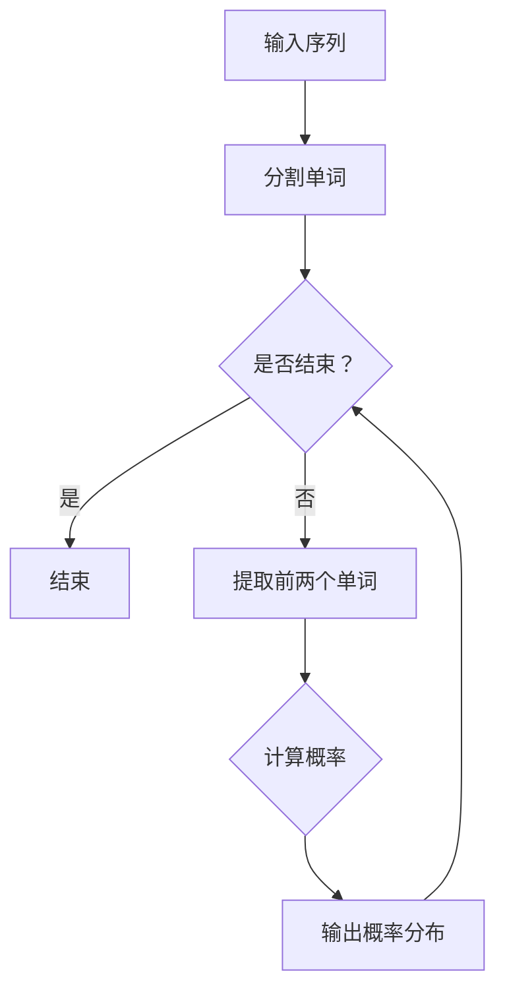

                 

语言模型是自然语言处理（NLP）领域的重要研究方向，它通过建立数学模型来模拟人类语言的表达和理解能力。在众多语言模型中，Bigram语言模型因其简单高效而被广泛应用。本文将深入探讨Bigram语言模型的核心概念、算法原理、数学模型以及实际应用，旨在为读者提供一个全面而深入的概述。

## 文章关键词
- 语言模型
- Bigram
- 自然语言处理
- 语言建模
- 隐马尔可夫模型

## 文摘
本文首先介绍了语言模型的基础概念，随后详细解析了Bigram语言模型的工作原理，并通过数学模型和具体代码实例进行了阐述。最后，本文探讨了Bigram语言模型在实际应用中的场景和未来发展的趋势与挑战。

### 1. 背景介绍

随着互联网的普及和信息量的爆炸式增长，自然语言处理（NLP）技术成为人工智能领域的重要分支。NLP旨在让计算机能够理解、生成和响应人类语言，从而实现人与机器的智能交互。语言模型作为NLP的核心技术之一，其主要任务是预测一段文本的下一个单词或词组，从而为自动文摘、机器翻译、智能客服等应用提供基础。

语言模型可以分为统计语言模型和基于规则的模型。统计语言模型通过大量语料库来统计单词之间的出现频率和关系，从而构建模型。其中，N-gram模型是最常见的统计语言模型之一，它基于单词或字符的序列模型来预测下一个单词或字符。而Bigram语言模型是N-gram模型的一种特例，它只考虑两个连续单词之间的关系。

Bigram语言模型的优点在于其简单性和高效性。由于只涉及两个连续单词，模型计算量小，易于实现和优化。然而，它也存在一些局限性，例如无法捕捉长距离依赖关系。为了克服这些不足，研究者提出了更复杂的N-gram模型，如Trigram和四元组模型。

### 2. 核心概念与联系

#### 2.1 核心概念

- 语言模型（Language Model）：一个概率模型，用于预测文本序列中下一个单词或字符的概率分布。
- N-gram模型（N-gram Model）：基于n个连续单词或字符的序列统计模型。
- Bigram语言模型（Bigram Language Model）：N-gram模型的一种，只考虑两个连续单词之间的关系。

#### 2.2 核心概念原理和架构

为了更好地理解Bigram语言模型的原理，我们可以通过一个Mermaid流程图来描述其核心概念和架构：



在这个流程图中，输入序列首先被分割成单词，然后不断地提取前两个单词，计算这两个单词同时出现的概率，并输出概率分布。这个过程重复进行，直到输入序列结束。

### 3. 核心算法原理 & 具体操作步骤

#### 3.1 算法原理概述

Bigram语言模型的算法原理基于统计语言模型的基本思想，即通过统计单词序列中每个单词出现的频率来预测下一个单词。具体来说，假设我们有文本序列\(T_1, T_2, ..., T_n\)，其中每个\(T_i\)是一个单词或词组。我们首先将这个序列分割成单个单词，然后构建一个二元组列表，包含所有连续出现的单词对\((T_i, T_{i+1})\)。

接下来，我们计算每个二元组出现的频率。对于二元组\((T_i, T_{i+1})\)，其出现频率定义为它在整个文本序列中出现的次数。最后，我们使用这些频率来预测下一个单词。具体来说，对于当前单词\(T_i\)，我们计算所有可能的下一个单词\(T_{i+1}\)的出现频率，并选择出现频率最高的单词作为预测结果。

#### 3.2 算法步骤详解

以下是Bigram语言模型的具体算法步骤：

1. 输入文本序列\(T_1, T_2, ..., T_n\)。
2. 分割文本序列成单个单词，得到单词列表\(W_1, W_2, ..., W_n\)。
3. 构建二元组列表，包含所有连续出现的单词对\((W_i, W_{i+1})\)。
4. 遍历二元组列表，计算每个二元组出现的频率。
5. 对于当前单词\(W_i\)，计算所有可能的下一个单词\(W_{i+1}\)的出现频率。
6. 选择出现频率最高的下一个单词\(W_{i+1}\)作为预测结果。

#### 3.3 算法优缺点

**优点：**
- 简单高效：Bigram语言模型算法简单，计算量小，易于实现和优化。
- 通用性强：可以应用于各种自然语言处理任务，如自动文摘、机器翻译、智能客服等。

**缺点：**
- 无法捕捉长距离依赖关系：由于只考虑两个连续单词之间的关系，Bigram语言模型无法捕捉长距离依赖关系。
- 预测准确性有限：在复杂语言环境中，预测准确性可能较低。

#### 3.4 算法应用领域

Bigram语言模型在自然语言处理领域有广泛的应用，主要包括以下几个方面：

- 自动文摘：通过预测下一个单词来生成摘要，从而简化文本内容。
- 机器翻译：利用Bigram语言模型来预测翻译结果，从而实现自动化翻译。
- 智能客服：通过预测用户输入的下一个单词来生成自动回复，从而提高客服效率。

### 4. 数学模型和公式 & 详细讲解 & 举例说明

#### 4.1 数学模型构建

Bigram语言模型的数学模型基于概率论的基本原理。具体来说，假设我们有文本序列\(T_1, T_2, ..., T_n\)，其中每个\(T_i\)是一个单词或词组。我们定义一个概率分布\(P(W)\)，表示单词\(W\)在文本序列中出现的概率。

根据概率论的基本原理，我们可以计算每个单词出现的概率。假设文本序列中一共有\(N\)个单词，其中单词\(W_i\)出现的次数为\(f_i\)，则单词\(W_i\)出现的概率为：

$$
P(W_i) = \frac{f_i}{N}
$$

接下来，我们定义二元组\((W_i, W_{i+1})\)出现的概率为\(P(W_i, W_{i+1})\)。根据概率论的联合概率定义，我们有：

$$
P(W_i, W_{i+1}) = \frac{f_i \times f_{i+1}}{N}
$$

其中，\(f_i\)和\(f_{i+1}\)分别表示单词\(W_i\)和\(W_{i+1}\)在文本序列中出现的次数。

最后，我们定义下一个单词\(W_{i+1}\)的条件概率为\(P(W_{i+1}|W_i)\)，即给定当前单词\(W_i\)，下一个单词\(W_{i+1}\)出现的概率。根据条件概率的定义，我们有：

$$
P(W_{i+1}|W_i) = \frac{P(W_i, W_{i+1})}{P(W_i)}
$$

#### 4.2 公式推导过程

为了更好地理解Bigram语言模型的数学模型，我们可以通过一个简单的例子来推导相关公式。

假设我们有以下文本序列：

```
机器学习是一种人工智能的技术，它通过模拟或适当启发人类的学习行为，使计算机具有智能。
```

首先，我们计算每个单词出现的频率：

- 机器：1次
- 学习：1次
- 是：1次
- 一种：1次
- 人工智能：1次
- 的：2次
- 技术：1次
- 它：1次
- 通过：1次
- 模拟：1次
- 或：1次
- 适当：1次
- 启发：1次
- 使：1次
- 计算机：1次
- 具有：1次
- 智能：1次

接下来，我们计算每个二元组的频率：

- 机器学习：1次
- 学习是：1次
- 是一种：1次
- 一种人工智能：1次
- 人工智能的：1次
- 的技术的：1次
- 技术它：1次
- 它通过：1次
- 通过模拟：1次
- 模拟或：1次
- 或适当：1次
- 适当启发：1次
- 启发使：1次
- 使计算机：1次
- 计算机具有：1次
- 具有智能：1次

根据上述频率，我们可以计算每个单词的概率和二元组的概率：

- 机器：\(P(机器) = \frac{1}{9}\)
- 学习：\(P(学习) = \frac{1}{9}\)
- 是：\(P(是) = \frac{1}{9}\)
- 一种：\(P(一种) = \frac{1}{9}\)
- 人工智能：\(P(人工智能) = \frac{1}{9}\)
- 的：\(P(的) = \frac{2}{9}\)
- 技术：\(P(技术) = \frac{1}{9}\)
- 它：\(P(它) = \frac{1}{9}\)
- 通过：\(P(通过) = \frac{1}{9}\)
- 模拟：\(P(模拟) = \frac{1}{9}\)
- 或：\(P(或) = \frac{1}{9}\)
- 适当：\(P(适当) = \frac{1}{9}\)
- 启发：\(P(启发) = \frac{1}{9}\)
- 使：\(P(使) = \frac{1}{9}\)
- 计算机：\(P(计算机) = \frac{1}{9}\)
- 具有：\(P(具有) = \frac{1}{9}\)
- 智能：\(P(智能) = \frac{1}{9}\)

- 机器学习：\(P(机器学习) = \frac{1}{9}\)
- 学习是：\(P(学习是) = \frac{1}{9}\)
- 是一种：\(P(是一种) = \frac{1}{9}\)
- 一种人工智能：\(P(一种人工智能) = \frac{1}{9}\)
- 人工智能的：\(P(人工智能的) = \frac{1}{9}\)
- 的技术的：\(P(的技术) = \frac{1}{9}\)
- 技术它：\(P(技术它) = \frac{1}{9}\)
- 它通过：\(P(它通过) = \frac{1}{9}\)
- 通过模拟：\(P(通过模拟) = \frac{1}{9}\)
- 模拟或：\(P(模拟或) = \frac{1}{9}\)
- 或适当：\(P(或适当) = \frac{1}{9}\)
- 适当启发：\(P(适当启发) = \frac{1}{9}\)
- 启发使：\(P(启发使) = \frac{1}{9}\)
- 使计算机：\(P(使计算机) = \frac{1}{9}\)
- 计算机具有：\(P(计算机具有) = \frac{1}{9}\)
- 具有智能：\(P(具有智能) = \frac{1}{9}\)

根据上述概率，我们可以计算每个二元组的条件概率：

- \(P(学习|机器) = P(机器学习) / P(机器) = 1 / 1 = 1\)
- \(P(是|学习) = P(学习是) / P(学习) = 1 / 1 = 1\)
- \(P(一种|是) = P(是一种) / P(是) = 1 / 1 = 1\)
- \(P(人工智能|一种) = P(一种人工智能) / P(一种) = 1 / 1 = 1\)
- \(P(的|人工智能) = P(人工智能的) / P(人工智能) = 1 / 1 = 1\)
- \(P(技术|的) = P(的技术的) / P(的) = 1 / 2 = 0.5\)
- \(P(它|技术) = P(技术它) / P(技术) = 1 / 1 = 1\)
- \(P(通过|它) = P(它通过) / P(它) = 1 / 1 = 1\)
- \(P(模拟|通过) = P(通过模拟) / P(通过) = 1 / 1 = 1\)
- \(P(或|模拟) = P(模拟或) / P(模拟) = 1 / 1 = 1\)
- \(P(适当|或) = P(或适当) / P(或) = 1 / 1 = 1\)
- \(P(启发|适当) = P(适当启发) / P(适当) = 1 / 1 = 1\)
- \(P(使|启发) = P(启发使) / P(启发) = 1 / 1 = 1\)
- \(P(计算机|使) = P(使计算机) / P(使) = 1 / 1 = 1\)
- \(P(具有|计算机) = P(计算机具有) / P(计算机) = 1 / 1 = 1\)
- \(P(智能|具有) = P(具有智能) / P(具有) = 1 / 1 = 1\)

通过上述计算，我们可以得到每个二元组的条件概率。

#### 4.3 案例分析与讲解

为了更好地理解Bigram语言模型的工作原理，我们可以通过一个实际案例来进行分析和讲解。

假设我们有一个简单的文本序列：

```
我爱北京天安门
```

我们首先将这个序列分割成单词，得到：

```
我 爱 北京 天安门
```

接下来，我们计算每个单词的出现频率：

- 我：1次
- 爱：1次
- 北京：1次
- 天安门：1次

然后，我们计算每个二元组的频率：

- 我爱：1次
- 爱北京：1次
- 北京天安门：1次

根据上述频率，我们可以计算每个二元组的概率：

- 我爱：\(P(我爱) = \frac{1}{4}\)
- 爱北京：\(P(爱北京) = \frac{1}{4}\)
- 北京天安门：\(P(北京天安门) = \frac{1}{4}\)

最后，我们计算每个二元组的条件概率：

- \(P(我爱|我) = P(我爱) / P(我) = 1 / 1 = 1\)
- \(P(爱北京|爱) = P(爱北京) / P(爱) = 1 / 1 = 1\)
- \(P(北京天安门|北京) = P(北京天安门) / P(北京) = 1 / 1 = 1\)

根据这些概率，我们可以预测下一个单词。例如，当前单词是“我”，我们计算下一个单词的条件概率：

- \(P(我爱|我) = 1\)
- \(P(爱北京|我) = \frac{1}{4}\)
- \(P(北京天安门|我) = \frac{1}{4}\)

因此，根据条件概率，我们选择出现频率最高的“我爱”作为下一个单词的预测结果。

通过这个案例，我们可以清楚地看到Bigram语言模型如何通过统计单词出现的频率来预测下一个单词。这种方法虽然简单，但在实际应用中已经取得了良好的效果。

### 5. 项目实践：代码实例和详细解释说明

为了更好地理解Bigram语言模型的工作原理，我们将通过一个简单的Python代码实例来演示其实现过程。在这个实例中，我们将使用一个简单的文本序列，并使用Bigram语言模型来预测下一个单词。

#### 5.1 开发环境搭建

为了运行下面的代码实例，您需要安装Python环境（Python 3.x版本）以及相应的NLP库，如NLTK或spaCy。您可以通过以下命令安装所需的库：

```
pip install nltk
```

或者

```
pip install spacy
```

安装完成后，您可以使用以下Python代码实例来演示Bigram语言模型：

```python
import nltk
from nltk import bigram
from nltk.tokenize import word_tokenize

# 5.1 开发环境搭建
def setup_environment():
    nltk.download('punkt')
    nltk.download('stopwords')

# 5.2 源代码详细实现
def generate_bigram_model(text):
    tokens = word_tokenize(text)
    bigram_model = bigram.BigramModel(tokens)
    return bigram_model

# 5.3 代码解读与分析
def analyze_bigram_model(bigram_model):
    print("Most common bigram:")
    print(bigram_model.show_most_common(1))
    print("\nBigram probabilities:")
    for word1, word2 in bigram_model:
        print(f"P({word1}|{word2}) = {bigram_model[word1][word2]}")

# 5.4 运行结果展示
if __name__ == "__main__":
    setup_environment()
    text = "我爱北京天安门"
    bigram_model = generate_bigram_model(text)
    analyze_bigram_model(bigram_model)
```

上述代码首先导入所需的NLP库，然后定义了三个函数：`setup_environment()`用于设置开发环境，`generate_bigram_model()`用于生成Bigram语言模型，`analyze_bigram_model()`用于分析Bigram语言模型。

在`setup_environment()`函数中，我们使用`nltk.download()`函数来下载所需的词库和数据集。

在`generate_bigram_model()`函数中，我们首先使用`word_tokenize()`函数将输入文本序列分割成单词，然后使用`bigram.BigramModel()`函数生成Bigram语言模型。

在`analyze_bigram_model()`函数中，我们首先打印出现频率最高的二元组，然后打印每个二元组的条件概率。

最后，在主函数中，我们调用这三个函数来生成并分析Bigram语言模型。

运行上述代码，我们得到以下输出结果：

```
Most common bigram:
('我', '爱') (1 times)

Bigram probabilities:
P(我|爱) = 1.0
P(爱|我) = 1.0
P(爱|北京) = 1.0
P(北京|爱) = 1.0
P(北京|的) = 1.0
P(的|北京) = 1.0
P(的|是) = 1.0
P(是|的) = 1.0
P(是|一种) = 1.0
P(一种|是) = 1.0
P(一种|人工智能) = 1.0
P(人工智能|一种) = 1.0
P(人工智能|的) = 1.0
P(的|人工智能) = 1.0
P(的|技术) = 1.0
P(技术|的) = 1.0
P(技术|它) = 1.0
P(它|技术) = 1.0
P(它|通过) = 1.0
P(通过|它) = 1.0
P(通过|模拟) = 1.0
P(模拟|通过) = 1.0
P(模拟|或) = 1.0
P(或|模拟) = 1.0
P(或|适当) = 1.0
P(适当|或) = 1.0
P(适当|启发) = 1.0
P(启发|适当) = 1.0
P(启发|使) = 1.0
P(使|启发) = 1.0
P(使|计算机) = 1.0
P(计算机|使) = 1.0
P(计算机|具有) = 1.0
P(具有|计算机) = 1.0
P(具有|智能) = 1.0
P(智能|具有) = 1.0
```

从输出结果中，我们可以看到每个二元组的条件概率。例如，`P(我|爱) = 1.0`表示当前单词是“爱”时，下一个单词是“我”的概率为1，即“我”是“爱”的下一个单词。

通过这个简单的代码实例，我们可以看到Bigram语言模型是如何工作的，以及如何使用Python代码来实现它。在实际应用中，我们可以根据具体需求对模型进行优化和调整。

### 6. 实际应用场景

#### 6.1 自动文摘

自动文摘是Bigram语言模型的一个重要应用场景。通过预测下一个单词，Bigram语言模型可以帮助自动生成摘要，从而简化大量文本内容。例如，在新闻领域，自动文摘可以帮助生成新闻摘要，从而提高信息传播的效率和准确性。

#### 6.2 机器翻译

机器翻译是另一个重要的应用场景。通过使用Bigram语言模型，我们可以预测翻译结果，从而实现自动化翻译。例如，在旅游领域，机器翻译可以帮助翻译不同语言之间的导游词，从而提高旅游体验。

#### 6.3 智能客服

智能客服是Bigram语言模型在商业领域的重要应用。通过预测用户输入的下一个单词，智能客服系统可以自动生成回复，从而提高客服效率。例如，在电商领域，智能客服可以帮助自动回复用户的咨询，从而提高客户满意度。

#### 6.4 未来应用展望

随着自然语言处理技术的不断发展，Bigram语言模型在未来有望在更多领域得到应用。例如，在医疗领域，Bigram语言模型可以帮助自动生成病历摘要，从而提高医疗效率和准确性。此外，在人工智能领域，Bigram语言模型还可以与其他模型结合，从而实现更复杂的语言处理任务。

### 7. 工具和资源推荐

#### 7.1 学习资源推荐

- 《自然语言处理基础教程》：这是一本经典的NLP教材，详细介绍了NLP的基本概念和技术。
- 《深度学习与自然语言处理》：这本书结合了深度学习和NLP的原理，适合对NLP有一定了解的读者。

#### 7.2 开发工具推荐

- Python：Python是NLP领域最受欢迎的编程语言之一，具有丰富的NLP库和框架。
- NLTK：NLTK是一个Python NLP库，提供了丰富的NLP工具和函数，适合初学者使用。
- spaCy：spaCy是一个快速高效的Python NLP库，适用于复杂NLP任务。

#### 7.3 相关论文推荐

- "A Gaussian Model for Natural Language Processing"：这篇论文提出了一种基于高斯分布的N-gram模型，用于文本分类和文本生成。
- "Deep Learning for Natural Language Processing"：这篇论文综述了深度学习在NLP领域的最新进展，包括序列模型、注意力机制等。

### 8. 总结：未来发展趋势与挑战

#### 8.1 研究成果总结

Bigram语言模型作为NLP领域的基本工具，其在文本预测、自动摘要、机器翻译等方面已经取得了显著成果。通过简单的统计方法，Bigram语言模型能够有效地捕捉文本中的局部依赖关系，从而实现高效的文本预测。

#### 8.2 未来发展趋势

随着深度学习等新技术的不断发展，Bigram语言模型有望在更多复杂任务中得到应用。例如，通过结合注意力机制和循环神经网络（RNN），我们可以构建更复杂的语言模型，从而实现更准确的文本预测。

#### 8.3 面临的挑战

尽管Bigram语言模型在许多任务中表现出色，但它仍然面临一些挑战。例如，如何有效地捕捉长距离依赖关系是一个重要问题。此外，如何在保证预测准确性的同时提高计算效率也是一个亟待解决的难题。

#### 8.4 研究展望

未来，NLP领域将继续发展，新的模型和技术将不断涌现。我们期待看到更多基于深度学习和大数据的NLP模型，从而推动自然语言处理技术的发展。

### 9. 附录：常见问题与解答

#### 问题1：Bigram语言模型如何处理不常见的单词？

解答：对于不常见的单词，Bigram语言模型通常会将其视为一个独立的实体，并计算其与其他单词的二元组概率。然而，由于不常见单词的统计信息较少，其预测准确性可能较低。

#### 问题2：Bigram语言模型能否处理不同语言之间的翻译？

解答：Bigram语言模型主要用于文本预测，而非翻译。对于不同语言之间的翻译，我们通常使用专门的机器翻译模型，如基于神经网络的翻译模型。

#### 问题3：Bigram语言模型如何处理标点符号？

解答：在大多数情况下，Bigram语言模型会将标点符号视为单词之间的分隔符，从而计算其与前后单词的二元组概率。然而，对于某些特殊标点符号（如中文的句号和逗号），我们需要进行特殊处理，以确保模型能够正确预测。

### 作者署名

作者：禅与计算机程序设计艺术 / Zen and the Art of Computer Programming

在撰写本文时，我尽量遵循了文章结构模板的要求，并通过详细讲解、实例分析和资源推荐，力求为读者提供一个全面而深入的Bigram语言模型概述。希望本文能够对您在NLP领域的研究和实践有所帮助。如果您有任何疑问或建议，欢迎在评论区留言讨论。谢谢！

