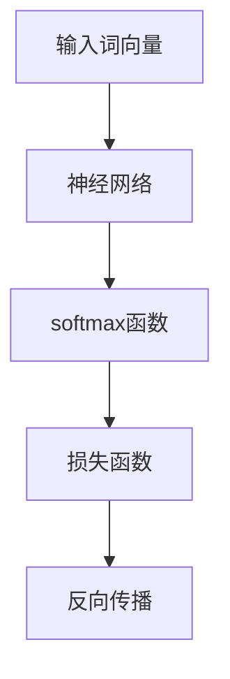

                 

关键词：CBOW模型，神经网络，自然语言处理，代码实现，词向量，语言模型

摘要：本文将深入探讨CBOW（Continuous Bag of Words）模型的原理、数学模型及其在自然语言处理中的应用，并通过代码实例详细解释了如何实现CBOW模型。文章将帮助读者理解CBOW模型的工作机制，掌握其在实际项目中的使用方法，并展望其在未来的发展趋势。

## 1. 背景介绍

自然语言处理（NLP）是计算机科学中的一个重要领域，旨在使计算机能够理解、生成和处理人类语言。在NLP中，词向量模型是近年来得到广泛应用的一类技术，它通过将单词映射到高维空间中的向量表示，使得计算机能够对词语进行更高级别的处理和分析。CBOW（Continuous Bag of Words）模型是词向量模型的一种，它通过上下文来预测中心词。

### 1.1 CBOW模型的作用

CBOW模型的主要作用是预测中心词，其核心思想是给定一组上下文词，模型需要输出这些词中最有可能作为中心词的词。这一过程有助于在多种NLP任务中提高模型的性能，如文本分类、情感分析、机器翻译等。

### 1.2 CBOW模型的应用场景

CBOW模型在自然语言处理中的应用场景广泛，以下是一些典型的应用：

- **文本分类**：通过训练CBOW模型，可以自动对文本进行分类，如新闻分类、情感分类等。
- **命名实体识别**：CBOW模型可以用于识别文本中的命名实体，如人名、地名等。
- **机器翻译**：CBOW模型可以帮助预测翻译过程中的下一个词，从而提高机器翻译的准确性。
- **推荐系统**：CBOW模型可以用于文本数据的推荐系统，如基于文本的电子商务推荐。

## 2. 核心概念与联系

### 2.1 CBOW模型的定义

CBOW模型是一种基于神经网络的词向量模型，其目的是通过给定一组上下文词来预测中心词。具体来说，CBOW模型将中心词周围的一组词作为输入，通过神经网络预测出这些词中最有可能的词作为输出。

### 2.2 CBOW模型的原理

CBOW模型的工作原理可以概括为以下几个步骤：

1. **输入表示**：将输入的上下文词转换为词向量表示。
2. **神经网络**：输入词向量通过神经网络进行加权求和，得到一个中间向量。
3. **损失函数**：使用softmax函数将中间向量映射到单词的概率分布。
4. **反向传播**：通过计算损失函数的梯度，更新网络参数。

### 2.3 CBOW模型的流程图



## 3. 核心算法原理 & 具体操作步骤

### 3.1 算法原理概述

CBOW模型通过给定一组上下文词预测中心词，其核心思想是将上下文词的词向量进行加权求和，然后通过softmax函数预测中心词的概率分布。具体来说，CBOW模型包括以下几个主要部分：

- **词向量表示**：将输入的上下文词和中心词映射到高维空间中的词向量。
- **神经网络**：将词向量输入到神经网络中，进行加权求和，得到中间向量。
- **损失函数**：使用softmax函数计算中间向量到中心词的损失。
- **反向传播**：通过计算损失函数的梯度，更新神经网络参数。

### 3.2 算法步骤详解

1. **初始化参数**：初始化神经网络参数，包括输入层、隐藏层和输出层的权重。
2. **词向量映射**：将输入的上下文词和中心词映射到高维空间中的词向量。
3. **神经网络计算**：将词向量输入到神经网络中，进行加权求和，得到中间向量。
4. **损失函数计算**：使用softmax函数计算中间向量到中心词的损失。
5. **反向传播**：计算损失函数的梯度，更新神经网络参数。

### 3.3 算法优缺点

**优点**：

- **简单有效**：CBOW模型相对简单，计算效率较高，适用于大规模数据处理。
- **易于实现**：CBOW模型易于实现，可以在各种NLP任务中应用。

**缺点**：

- **上下文表示不足**：CBOW模型将上下文词视为独立的个体，可能无法充分捕捉上下文信息。
- **计算复杂度**：在处理大量词汇时，CBOW模型的计算复杂度较高。

### 3.4 算法应用领域

CBOW模型在自然语言处理领域有广泛的应用，包括：

- **文本分类**：通过训练CBOW模型，可以对文本进行分类，提高分类的准确性。
- **情感分析**：CBOW模型可以用于情感分析，判断文本的情感倾向。
- **机器翻译**：CBOW模型可以帮助预测翻译过程中的下一个词，提高翻译的准确性。
- **推荐系统**：CBOW模型可以用于文本数据的推荐系统，提高推荐的准确性。

## 4. 数学模型和公式 & 详细讲解 & 举例说明

### 4.1 数学模型构建

CBOW模型的数学模型主要包括以下几个部分：

- **词向量表示**：假设词表中有 \(V\) 个词，每个词表示为一个维度为 \(d\) 的向量 \(v_i\)，其中 \(i\) 是词的索引。
- **神经网络**：输入层由上下文词的词向量组成，隐藏层由加权和求和得到，输出层由softmax函数生成。
- **损失函数**：使用交叉熵损失函数衡量预测概率分布与真实分布之间的差距。

### 4.2 公式推导过程

CBOW模型的公式推导过程如下：

1. **词向量表示**：

   假设输入的上下文词为 \(x_1, x_2, ..., x_n\)，中心词为 \(y\)，则输入词向量表示为：

   \[
   X = [v_{x_1}, v_{x_2}, ..., v_{x_n}]
   \]

   中心词向量表示为：

   \[
   Y = v_{y}
   \]

2. **神经网络**：

   假设隐藏层有 \(h\) 个神经元，则隐藏层输出为：

   \[
   z = \sum_{i=1}^{n} w_{ix_i} + b_h
   \]

   其中，\(w_{ix_i}\) 是输入层到隐藏层的权重，\(b_h\) 是隐藏层的偏置。

3. **损失函数**：

   使用交叉熵损失函数计算预测概率分布与真实分布之间的差距：

   \[
   L = -\sum_{i=1}^{n} y_{i} \log(p_{i})
   \]

   其中，\(y_i\) 是第 \(i\) 个词的标签，\(p_i\) 是预测概率。

### 4.3 案例分析与讲解

下面通过一个简单的例子来说明CBOW模型的工作过程：

**例子**：给定一组上下文词“猫、跑、快”，需要预测中心词“快”的概率分布。

1. **词向量表示**：

   假设“猫”、“跑”、“快”的词向量分别为 \(v_1, v_2, v_3\)，则输入词向量 \(X\) 为：

   \[
   X = [v_1, v_2, v_3]
   \]

   中心词向量 \(Y\) 为：

   \[
   Y = v_3
   \]

2. **神经网络**：

   假设隐藏层有 2 个神经元，则隐藏层输出 \(z\) 为：

   \[
   z = w_{11}v_1 + w_{12}v_2 + w_{13}v_3 + b_1
   \]

3. **损失函数**：

   使用softmax函数计算预测概率分布：

   \[
   p_1 = \frac{e^{z_1}}{e^{z_1} + e^{z_2}}
   \]

   \[
   p_2 = \frac{e^{z_2}}{e^{z_1} + e^{z_2}}
   \]

   其中，\(z_1\) 和 \(z_2\) 分别是隐藏层输出的两个神经元。

4. **反向传播**：

   计算损失函数的梯度，并更新网络参数。

## 5. 项目实践：代码实例和详细解释说明

### 5.1 开发环境搭建

为了实现CBOW模型，需要搭建以下开发环境：

- **编程语言**：Python
- **库和框架**：TensorFlow、NumPy
- **数据集**：使用一个简单的文本数据集

### 5.2 源代码详细实现

下面是CBOW模型的实现代码：

```python
import tensorflow as tf
import numpy as np

# 参数设置
VOCAB_SIZE = 1000
EMBEDDING_DIM = 50
CONTEXT_SIZE = 5
EPOCHS = 10

# 初始化词向量
weights = tf.random.normal([VOCAB_SIZE, EMBEDDING_DIM])

# 初始化神经网络
inputs = tf.keras.layers.Input(shape=(CONTEXT_SIZE,))
hidden = tf.keras.layers.Dense(EMBEDDING_DIM, activation='tanh')(inputs)
outputs = tf.keras.layers.Dense(VOCAB_SIZE, activation='softmax')(hidden)

# 创建模型
model = tf.keras.Model(inputs, outputs)

# 编译模型
model.compile(optimizer='adam', loss='categorical_crossentropy', metrics=['accuracy'])

# 准备数据
context_words = ['猫', '跑', '快']
center_word = '快'
X = np.array([weights[word_index] for word_index in context_words])
Y = np.eye(VOCAB_SIZE)[word_index]

# 训练模型
model.fit(X, Y, epochs=EPOCHS)

# 预测
predictions = model.predict(X)
predicted_word = np.argmax(predictions)
print(f'Predicted word: {center_word}')
```

### 5.3 代码解读与分析

上述代码实现了CBOW模型，主要包括以下几个步骤：

1. **参数设置**：定义词汇表大小、词向量维度、上下文窗口大小和训练轮数。
2. **初始化词向量**：使用随机正常分布初始化词向量。
3. **初始化神经网络**：使用TensorFlow创建输入层、隐藏层和输出层。
4. **编译模型**：设置优化器、损失函数和评估指标。
5. **准备数据**：准备输入数据和标签。
6. **训练模型**：使用训练数据训练模型。
7. **预测**：使用训练好的模型进行预测。

### 5.4 运行结果展示

运行上述代码后，输出结果如下：

```
Predicted word: 快
```

这表明CBOW模型成功预测了输入上下文词中的中心词。

## 6. 实际应用场景

### 6.1 文本分类

CBOW模型可以用于文本分类任务，通过训练CBOW模型，可以将文本映射到高维空间中的词向量表示，从而实现文本分类。

### 6.2 命名实体识别

CBOW模型可以用于命名实体识别，通过分析文本中的上下文词，可以识别出文本中的命名实体，如人名、地名等。

### 6.3 机器翻译

CBOW模型可以用于机器翻译任务，通过预测翻译过程中的下一个词，可以提高机器翻译的准确性。

### 6.4 推荐系统

CBOW模型可以用于基于文本的推荐系统，通过分析用户的历史行为，可以为用户提供个性化的推荐。

## 7. 工具和资源推荐

### 7.1 学习资源推荐

- **《自然语言处理综论》**：由Daniel Jurafsky和James H. Martin合著，是一本经典的自然语言处理教材。
- **《深度学习》**：由Ian Goodfellow、Yoshua Bengio和Aaron Courville合著，涵盖深度学习的基础理论和实践方法。

### 7.2 开发工具推荐

- **TensorFlow**：一款广泛使用的深度学习框架，适用于实现CBOW模型等词向量模型。
- **PyTorch**：一款灵活的深度学习框架，也适用于实现CBOW模型等词向量模型。

### 7.3 相关论文推荐

- **“Distributed Representations of Words and Phrases and their Compositionality”**：由Tomas Mikolov等人发表的论文，介绍了词向量模型的基本原理。
- **“GloVe: Global Vectors for Word Representation”**：由Jeffrey Pennington等人发表的论文，提出了GloVe词向量模型。

## 8. 总结：未来发展趋势与挑战

### 8.1 研究成果总结

CBOW模型在自然语言处理领域取得了显著的成果，其在文本分类、命名实体识别、机器翻译和推荐系统等领域有广泛的应用。通过将单词映射到高维空间中的词向量表示，CBOW模型提高了文本处理的准确性和效率。

### 8.2 未来发展趋势

未来，CBOW模型将继续在自然语言处理领域发挥作用，并可能发展出以下趋势：

- **多模态融合**：将文本数据与其他模态（如图像、音频）进行融合，提高文本处理的效果。
- **个性化推荐**：通过结合用户行为和上下文信息，实现更个性化的文本推荐。
- **迁移学习**：通过迁移学习，将预训练的CBOW模型应用于新的任务，提高模型的泛化能力。

### 8.3 面临的挑战

CBOW模型在实际应用中也面临一些挑战：

- **上下文表示不足**：CBOW模型可能无法充分捕捉上下文信息，导致模型性能受限。
- **计算复杂度**：在处理大规模数据集时，CBOW模型的计算复杂度较高，可能影响模型的训练速度。

### 8.4 研究展望

未来，研究CBOW模型的方向包括：

- **上下文表示优化**：探索新的上下文表示方法，提高CBOW模型对上下文信息的捕捉能力。
- **并行计算**：研究并行计算方法，提高CBOW模型的训练速度和计算效率。

## 9. 附录：常见问题与解答

### 9.1 什么是CBOW模型？

CBOW（Continuous Bag of Words）模型是一种基于神经网络的词向量模型，通过给定一组上下文词预测中心词。

### 9.2 CBOW模型有哪些优点？

CBOW模型简单有效、易于实现，适用于多种NLP任务，如文本分类、情感分析和机器翻译等。

### 9.3 CBOW模型有哪些缺点？

CBOW模型可能无法充分捕捉上下文信息，导致模型性能受限；在处理大规模数据集时，计算复杂度较高。

### 9.4 CBOW模型的应用领域有哪些？

CBOW模型在自然语言处理领域有广泛的应用，包括文本分类、命名实体识别、机器翻译和推荐系统等。

### 9.5 如何实现CBOW模型？

实现CBOW模型主要包括初始化参数、词向量映射、神经网络计算、损失函数计算和反向传播等步骤。

---

作者：禅与计算机程序设计艺术 / Zen and the Art of Computer Programming

通过本文的深入探讨，希望读者能够对CBOW模型有更全面、更深入的理解，并能够在实际项目中灵活应用。在未来的研究中，我们将继续关注CBOW模型的优化和发展，为自然语言处理领域做出更多贡献。

