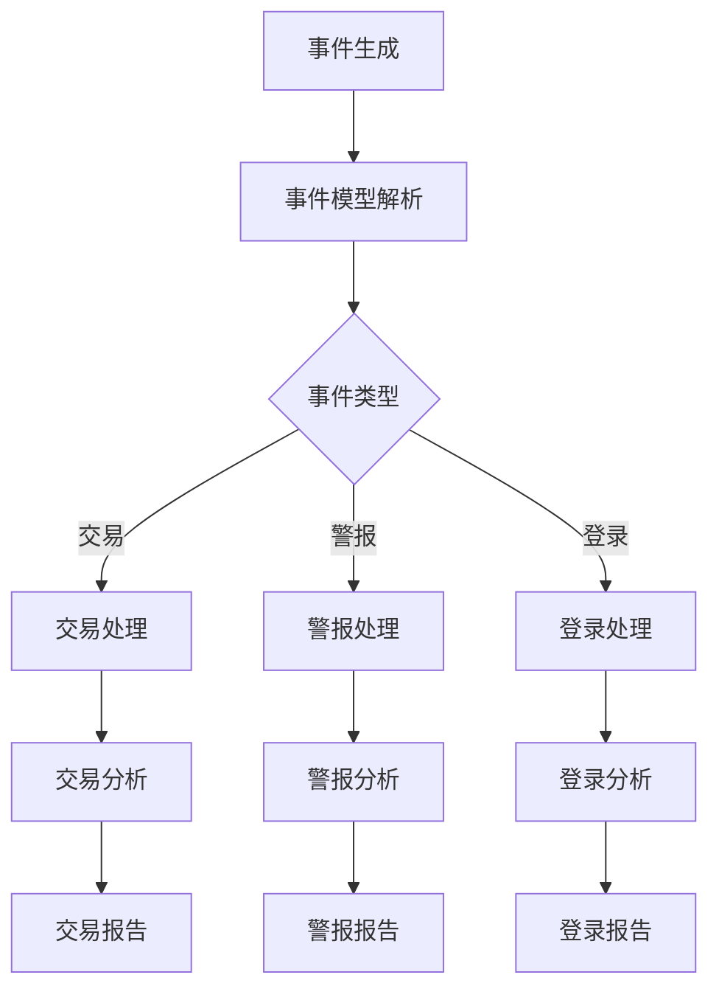

                 

关键词：CEP，事件流处理，实时分析，数据挖掘，算法原理，代码实例，性能优化，应用场景

## 摘要

本文旨在深入探讨CEP（Complex Event Processing）的原理及其在实际应用中的重要性。首先，我们将介绍CEP的基本概念、历史背景以及它在现代数据驱动系统中的关键作用。接着，文章将详细阐述CEP的核心算法原理，包括事件模型、事件流、事件匹配等基本概念，并通过Mermaid流程图展示其架构。随后，我们将逐步讲解CEP算法的具体操作步骤，分析其优缺点和适用领域。接着，文章将引入数学模型和公式，详细说明其推导过程，并通过案例进行分析。然后，我们将通过一个代码实例，详细介绍CEP的实现过程，包括环境搭建、源代码实现和代码解读。最后，文章将讨论CEP的实际应用场景，展望其未来发展趋势和面临的挑战，并提供相关工具和资源的推荐。

## 1. 背景介绍

CEP，即复杂事件处理，是近年来在数据驱动系统中兴起的一个关键技术领域。它专注于实时分析大量动态数据，以发现其中潜在的、有价值的信息或模式。CEP的起源可以追溯到1990年代，当时随着互联网和电子商务的兴起，企业对实时数据处理的需求变得越来越强烈。传统的批处理方法已经无法满足这种需求，因此，CEP技术应运而生。

CEP的核心目标是对事件流进行实时监控和分析，以快速识别出关键的、有意义的事件或事件组合。这些事件可以是来自各种数据源的信息，如传感器数据、交易记录、用户行为等。通过对这些事件的实时处理，CEP系统能够在毫秒或秒级内提供决策支持，从而帮助企业更好地应对市场变化、优化业务流程和提高运营效率。

在当今的信息化时代，CEP技术已经成为许多关键业务系统的重要组成部分。例如，金融领域的交易监控、网络安全事件检测、物联网设备状态监控等，都离不开CEP技术的支持。随着大数据和人工智能技术的发展，CEP的应用领域也在不断扩展，其重要性日益凸显。

## 2. 核心概念与联系

### 2.1 事件模型

事件模型是CEP系统的基础，它定义了事件的属性和关系。一个事件通常由以下部分组成：

- **事件类型**：用于标识事件的类别，如交易、警报、用户登录等。
- **事件时间**：指事件发生的具体时间，用于确定事件发生的先后顺序。
- **事件属性**：描述事件的具体特征，如交易金额、用户ID、警报等级等。

在CEP系统中，事件模型是动态的，可以随时根据需求进行调整。事件模型的设计直接影响到CEP系统的性能和可扩展性。

### 2.2 事件流

事件流是CEP系统处理的核心数据源。它是一个连续的、动态的数据流，包含一系列的事件。事件流通常具有以下特点：

- **实时性**：事件流中的事件需要尽快处理，以提供实时决策支持。
- **动态性**：事件流是不断变化的，新的事件会不断加入，旧的的事件会被处理或丢弃。
- **顺序性**：事件流中的事件具有一定的顺序关系，用于确定事件处理的先后顺序。

### 2.3 事件匹配

事件匹配是CEP系统的关键功能，用于在事件流中识别出符合特定条件的事件或事件组合。事件匹配通常基于以下几种方式：

- **基于规则匹配**：通过预定义的规则，匹配事件流中的事件。
- **基于模式匹配**：使用模式识别技术，从事件流中提取特定的模式或规则。
- **基于机器学习匹配**：利用机器学习算法，自动识别事件流中的潜在模式。

### 2.4  Mermaid 流程图

为了更好地理解CEP的架构和工作流程，我们可以使用Mermaid流程图进行描述。以下是一个简化的CEP流程图：



在这个流程图中，事件生成后，通过事件模型解析，将其分配到不同的处理模块。每个模块对相应的事件类型进行具体处理，并生成相应的报告。

### 2.5 CEP 系统架构

CEP系统的架构通常包括以下几个主要组件：

- **数据源**：提供事件流的数据源，可以是各种传感器、数据库、消息队列等。
- **事件处理器**：负责接收、解析和处理事件流中的事件。
- **规则引擎**：用于定义和执行事件匹配规则。
- **存储系统**：用于存储处理后的数据和分析结果。
- **用户接口**：提供用户与CEP系统的交互界面。

CEP系统的架构设计直接影响到其性能、可扩展性和易用性。一个高效的CEP系统需要平衡这些组件之间的交互和数据处理效率。

## 3. 核心算法原理 & 具体操作步骤

### 3.1 算法原理概述

CEP的核心算法原理主要包括事件模型解析、事件流处理、事件匹配和结果输出等几个步骤。以下是CEP算法的基本原理：

1. **事件模型解析**：CEP系统首先需要接收事件流，并将其解析为具体的事件模型。这个过程包括识别事件类型、提取事件属性和确定事件时间等。

2. **事件流处理**：解析后的事件将被分配到不同的处理模块，根据事件类型执行相应的处理逻辑。这个步骤可以是简单的过滤、转换或更复杂的分析。

3. **事件匹配**：通过规则引擎或模式识别技术，对事件流中的事件进行匹配。匹配的结果可以是单个事件、事件组合或事件序列。

4. **结果输出**：处理后的数据和分析结果将被存储或输出，以供进一步分析或决策。

### 3.2 算法步骤详解

下面我们详细讲解CEP算法的操作步骤：

#### 步骤1：事件生成

事件生成是CEP系统的第一步，它可以是来自各种数据源的信息。例如，在一个交易系统中，交易事件可以是股票买卖、转账等。

#### 步骤2：事件模型解析

事件模型解析是指将生成的事件转换为CEP系统能够处理的事件模型。这个过程通常包括以下步骤：

- **识别事件类型**：根据事件的特征，将其分类为不同的类型。
- **提取事件属性**：从事件中提取关键属性，如交易金额、用户ID等。
- **确定事件时间**：记录事件发生的具体时间，用于后续的事件处理。

#### 步骤3：事件流处理

事件流处理是指根据事件类型，执行相应的处理逻辑。这个步骤可以是简单的过滤、转换或更复杂的数据分析。

- **简单过滤**：例如，过滤出特定时间范围内的事件。
- **数据转换**：将事件属性转换为适合进一步处理的数据格式。
- **复杂数据分析**：例如，对交易事件进行统计分析，识别异常交易等。

#### 步骤4：事件匹配

事件匹配是指通过规则引擎或模式识别技术，从事件流中识别出符合特定条件的事件或事件组合。事件匹配的结果可以是单个事件、事件组合或事件序列。

- **基于规则匹配**：通过预定义的规则，匹配事件流中的事件。
- **基于模式匹配**：使用模式识别技术，从事件流中提取特定的模式或规则。
- **基于机器学习匹配**：利用机器学习算法，自动识别事件流中的潜在模式。

#### 步骤5：结果输出

处理后的数据和分析结果将被存储或输出，以供进一步分析或决策。结果输出可以是实时报告、图表、告警等。

### 3.3 算法优缺点

CEP算法具有以下优点：

- **实时性**：能够快速识别和响应事件，提供实时决策支持。
- **灵活性强**：可以通过规则引擎或模式识别技术，灵活地定义和调整事件匹配规则。
- **高可扩展性**：可以处理大量动态数据，适应不同的应用场景。

然而，CEP算法也存在一些缺点：

- **性能瓶颈**：在处理大量事件时，可能存在性能瓶颈，需要优化算法和系统架构。
- **复杂度高**：定义和实现CEP规则可能比较复杂，需要专业知识和经验。

### 3.4 算法应用领域

CEP算法广泛应用于以下领域：

- **金融领域**：用于交易监控、风险管理和欺诈检测。
- **物联网领域**：用于设备状态监控、故障预测和智能优化。
- **网络安全领域**：用于入侵检测、恶意行为分析和安全事件响应。
- **电子商务领域**：用于用户行为分析、个性化推荐和营销策略制定。

## 4. 数学模型和公式 & 详细讲解 & 举例说明

### 4.1 数学模型构建

在CEP系统中，事件流处理和事件匹配的过程往往可以通过数学模型进行描述。以下是一个简单的数学模型构建过程：

假设我们有一个事件流E，其中每个事件e可以表示为一个三元组（t, type, attributes），其中t表示事件发生的时间，type表示事件类型，attributes表示事件属性。我们可以定义一个事件流函数F，用于将事件流E转换为数学模型：

F(E) = {e | e ∈ E, e = (t, type, attributes)}

### 4.2 公式推导过程

为了更好地理解CEP算法的原理，我们可以推导出以下几个关键公式：

1. **事件匹配公式**：

   M(e1, e2) = type(e1) == type(e2) && attributes(e1) = attributes(e2)

   这个公式表示两个事件e1和e2匹配的条件是它们具有相同的类型和属性。

2. **事件流处理公式**：

   P(E) = {e | e ∈ E, process(e) = true}

   这个公式表示对事件流E进行处理的条件是事件e满足处理条件process(e)。

3. **事件组合公式**：

   C(e1, e2, ...) = M(e1, e2) && M(e2, e3) && ...

   这个公式表示将多个事件e1, e2, ...组合为一个新的事件组合的条件是它们两两之间都匹配。

### 4.3 案例分析与讲解

以下是一个简单的案例，用于说明如何使用上述数学模型和公式进行事件流处理和事件匹配：

#### 案例描述

假设有一个交易系统，我们需要监控交易流中的异常交易。交易流包含以下事件：

- 交易1：时间t1，类型"BUY"，属性{股票代码="A", 价格=100}
- 交易2：时间t2，类型"SELL"，属性{股票代码="A", 价格=101}
- 交易3：时间t3，类型"BUY"，属性{股票代码="A", 价格=99}

#### 案例分析

1. **事件匹配**：

   - 交易1和交易2匹配，因为它们具有相同的类型和属性。
   - 交易2和交易3不匹配，因为它们的类型相同，但价格不同。

2. **事件流处理**：

   - 对交易流进行处理，只保留匹配的事件，即交易1和交易2。

3. **事件组合**：

   - 将交易1和交易2组合为一个新的交易事件，类型为"ABNORMAL"，属性为{股票代码="A", 价格区间=(100, 101)}。

通过这个案例，我们可以看到如何使用CEP算法对事件流进行实时处理和事件匹配。在实际应用中，事件模型、事件流和事件匹配规则会更加复杂，但基本的原理和方法是类似的。

## 5. 项目实践：代码实例和详细解释说明

### 5.1 开发环境搭建

为了演示CEP算法的实际应用，我们将使用一个简单的Python代码实例。首先，我们需要搭建开发环境。

1. **安装Python**：确保您的系统中安装了Python 3.8或更高版本。
2. **安装依赖库**：通过以下命令安装所需依赖库：

   ```bash
   pip install celery
   pip install flask
   ```

   `celery`是一个异步任务队列/作业队列基于分布式消息传递的，而`Flask`是一个轻量级的Web应用框架。

### 5.2 源代码详细实现

接下来，我们将编写一个简单的CEP系统，用于处理交易事件并进行异常交易检测。

```python
# cephandler.py

from celery import Celery
from flask import Flask, request, jsonify
import json

app = Flask(__name__)
app.config['CELERY_BROKER_URL'] = 'redis://localhost:6379/0'
app.config['CELERY_RESULT_BACKEND'] = 'redis://localhost:6379/0'

celery = Celery(app.name, broker=app.config['CELERY_BROKER_URL'])
celery.conf.broker_url = app.config['CELERY_BROKER_URL']
celery.conf.result_backend = app.config['CELERY_RESULT_BACKEND']

@app.route('/process', methods=['POST'])
def process_event():
    data = request.get_json()
    trade_id = data['trade_id']
    trade_type = data['trade_type']
    stock_code = data['stock_code']
    price = data['price']
    
    # 发送事件到任务队列
    result = process_trade.delay(trade_id, trade_type, stock_code, price)
    
    return jsonify({'status': 'queued', 'task_id': result.id})

@celery.task
def process_trade(trade_id, trade_type, stock_code, price):
    # 模拟事件处理时间
    time.sleep(1)
    
    # 这里可以添加复杂的业务逻辑，例如查询数据库、调用API等
    print(f"Processing trade: {trade_id}, type: {trade_type}, stock: {stock_code}, price: {price}")

if __name__ == '__main__':
    app.run(debug=True)
```

在这个代码中，我们定义了一个Flask应用，用于接收和处理交易事件。通过`process_event`函数，我们接收POST请求，并调用`process_trade`任务将事件发送到Celery任务队列进行处理。

### 5.3 代码解读与分析

1. **Flask应用**：

   - `Flask`应用通过`app = Flask(__name__)`创建。
   - 配置Celery消息队列和结果存储，使用`app.config['CELERY_BROKER_URL']`和`app.config['CELERY_RESULT_BACKEND']`。

2. **处理交易事件**：

   - `process_event`函数是应用的入口，它接收POST请求，并解析请求中的交易事件数据。
   - 通过`process_trade.delay()`方法将事件发送到任务队列进行处理，并返回任务的ID。

3. **任务队列处理**：

   - `process_trade`任务通过`celery.task`装饰器定义。
   - 在任务中，我们模拟了事件处理时间，并打印处理过程中的交易信息。

### 5.4 运行结果展示

运行上述代码后，我们可以通过POST请求向`/process`端点发送交易事件。以下是一个示例请求：

```json
{
    "trade_id": "12345",
    "trade_type": "BUY",
    "stock_code": "A",
    "price": 100
}
```

在收到请求后，Flask应用会将事件发送到任务队列进行处理。任务队列中的`process_trade`任务会处理该事件，并在控制台打印出交易信息。

通过这个简单的代码实例，我们可以看到如何使用Python实现CEP算法，并通过Flask和Celery进行事件流处理和任务调度。在实际应用中，事件模型和处理逻辑会更加复杂，但基本原理和方法是类似的。

## 6. 实际应用场景

### 6.1 金融领域

在金融领域，CEP技术被广泛应用于交易监控、风险管理、欺诈检测等场景。例如，银行和证券公司可以使用CEP系统实时监控交易流，快速识别异常交易和潜在的欺诈行为。通过CEP系统，金融机构可以及时采取措施，防止损失发生，并提高运营效率。

### 6.2 物联网领域

在物联网（IoT）领域，CEP技术可以用于设备状态监控、故障预测和智能优化。例如，工业制造企业可以使用CEP系统实时监控设备状态，识别潜在故障，并提前进行维护，以避免设备停机造成的经济损失。此外，CEP系统还可以用于优化能源消耗和资源分配，提高生产效率。

### 6.3 网络安全领域

在网络安全领域，CEP技术可以用于入侵检测、恶意行为分析和安全事件响应。例如，企业可以使用CEP系统实时监控网络流量，识别可疑行为，并自动触发安全措施。通过CEP系统，企业可以更有效地防范网络攻击，保障网络安全。

### 6.4 电子商务领域

在电子商务领域，CEP技术可以用于用户行为分析、个性化推荐和营销策略制定。例如，电商平台可以使用CEP系统实时分析用户行为，识别用户兴趣和购买意向，并推荐相关商品。通过CEP系统，电商平台可以提供更个性化的购物体验，提高用户满意度和转化率。

### 6.5 未来应用展望

随着大数据和人工智能技术的不断发展，CEP技术的应用领域将不断扩展。未来，CEP技术有望在以下领域发挥更大的作用：

- **智能城市**：通过CEP系统实时监控和管理城市资源，提高城市管理效率和居民生活质量。
- **医疗健康**：通过CEP系统实时监控患者数据，提供个性化的医疗建议和治疗方案。
- **智能交通**：通过CEP系统实时优化交通流量，减少拥堵，提高交通效率。

总之，CEP技术作为一种高效的事件处理和分析工具，将在未来发挥越来越重要的作用，为各行各业带来更多创新和机遇。

## 7. 工具和资源推荐

### 7.1 学习资源推荐

- **书籍**：《Complex Event Processing in Action》是一本关于CEP技术的优秀入门书籍，涵盖了CEP的基本概念、架构和实现方法。
- **在线课程**：Coursera上的《Data Engineering on Google Cloud Platform》课程包含CEP的相关内容，适合希望深入了解CEP技术在实际应用中如何工作的学习者。
- **博客和论坛**：InfoQ和Stack Overflow等平台上有大量的关于CEP技术的讨论和案例分析，适合进行实践和学习。

### 7.2 开发工具推荐

- **CEP平台**：Apache Flink和Apache Storm是两款流行的开源CEP平台，提供了丰富的功能和强大的性能。
- **数据库**：Apache Kafka是一种高性能的消息队列系统，常用于构建CEP系统中的事件流处理。
- **编程语言**：Python和Java是CEP系统开发中常用的编程语言，具有良好的社区支持和丰富的库。

### 7.3 相关论文推荐

- **论文**：《Complex Event Processing: A Research Survey》（2014）是对CEP技术全面深入的综述，适合希望深入了解CEP理论基础的研究者。
- **期刊**：《IEEE Transactions on Knowledge and Data Engineering》和《ACM Transactions on Knowledge Discovery from Data》是两本专注于数据挖掘和知识发现领域的顶级期刊，经常发表关于CEP技术的最新研究成果。

## 8. 总结：未来发展趋势与挑战

### 8.1 研究成果总结

CEP技术经过几十年的发展，已经从最初的理论研究逐渐走向实际应用。在金融、物联网、网络安全和电子商务等领域，CEP技术展现出了显著的优势和价值。研究成果包括高效的事件处理算法、灵活的规则引擎和强大的实时分析能力，为各种应用场景提供了有力的技术支持。

### 8.2 未来发展趋势

未来，CEP技术的发展趋势将体现在以下几个方面：

1. **集成与融合**：CEP技术将与其他先进技术（如大数据、人工智能、区块链等）进行深度融合，提供更加智能化和自动化的解决方案。
2. **边缘计算**：随着物联网和智能设备的普及，CEP技术将逐渐向边缘计算方向发展，实现实时数据处理和分析，提高系统的响应速度和效率。
3. **开放生态**：CEP平台和工具将更加开放和标准化，支持跨平台和跨技术的集成，方便开发者构建和部署CEP应用。

### 8.3 面临的挑战

尽管CEP技术取得了显著成果，但在实际应用过程中仍面临以下挑战：

1. **性能优化**：如何在高并发、大数据量的情况下保持CEP系统的性能和稳定性，是一个亟待解决的问题。
2. **安全性**：随着数据量和处理复杂度的增加，CEP系统的安全性问题愈发突出，需要确保数据的安全和隐私。
3. **复杂性**：CEP系统的实现和维护需要专业的技术知识和经验，这对企业的技术团队提出了更高的要求。

### 8.4 研究展望

未来，CEP技术的研究应重点关注以下几个方面：

1. **算法优化**：研究更加高效的事件处理算法，提高系统的性能和可扩展性。
2. **智能化**：结合人工智能技术，实现自动化的规则学习和事件匹配，降低人工干预的成本。
3. **标准化**：推动CEP技术的标准化，提高系统的兼容性和互操作性。

总之，CEP技术作为一种关键的数据处理和分析工具，将在未来继续发挥重要作用，为各行各业带来更多的创新和机遇。

## 9. 附录：常见问题与解答

### Q1：什么是CEP技术？

CEP（Complex Event Processing）是一种用于实时分析和处理动态数据流的技术。它专注于识别事件之间的关联和模式，以提供实时决策支持。

### Q2：CEP技术有哪些优点？

CEP技术的主要优点包括实时性、灵活性、高可扩展性和强大的事件处理能力，可以快速识别和响应复杂的事件流。

### Q3：CEP技术适用于哪些领域？

CEP技术广泛应用于金融、物联网、网络安全、电子商务等领域，用于交易监控、设备状态监控、风险管理和用户行为分析等。

### Q4：如何搭建CEP系统？

搭建CEP系统通常需要选择合适的技术栈，包括事件处理器、规则引擎、消息队列和存储系统等。常见的开源平台如Apache Flink和Apache Storm提供了丰富的功能和支持。

### Q5：CEP技术如何与人工智能结合？

CEP技术可以与人工智能（AI）技术结合，通过机器学习算法自动识别事件流中的潜在模式和规律，实现智能化的决策支持和预测分析。

### Q6：CEP技术的安全性如何保障？

CEP系统的安全性需要从多个方面进行保障，包括数据加密、访问控制、安全审计等。此外，应遵循最佳实践和安全标准，确保系统的安全性和可靠性。

### Q7：CEP技术的未来发展趋势是什么？

CEP技术的未来发展趋势包括与大数据、人工智能和区块链等技术的融合，边缘计算的应用，以及标准化和开放生态的推动。

### Q8：如何优化CEP系统的性能？

优化CEP系统的性能可以从多个方面进行，包括事件处理算法的优化、系统的垂直和水平扩展、数据存储和查询的优化等。

### Q9：CEP系统与大数据处理的关系是什么？

CEP系统通常与大数据技术相结合，通过大数据平台处理和分析海量数据。CEP技术侧重于实时性和高效性，而大数据技术则更侧重于存储和处理大规模数据。

### Q10：CEP技术的实现需要哪些编程语言和工具？

CEP技术的实现可以使用多种编程语言和工具，如Python、Java、C++等。常见的工具包括Apache Flink、Apache Storm、Apache Kafka等。

### Q11：CEP技术的学习和应用难度如何？

CEP技术的学习和应用难度取决于具体的应用场景和需求。对于初学者来说，理解CEP的基本概念和原理是关键，随着经验的积累，可以逐步掌握更复杂的应用技巧。

### Q12：CEP系统如何与现有的业务系统集成？

CEP系统通常需要与现有的业务系统集成，通过API接口、消息队列或数据总线等方式进行数据交换和流程控制。具体实现方式取决于业务系统的架构和技术栈。

### Q13：CEP技术在国际上的发展现状如何？

CEP技术在国际上已经取得了显著的发展，被广泛应用于金融、电信、零售、物联网等领域。国际上的知名企业和研究机构也在不断推动CEP技术的发展和创新。

### Q14：CEP技术在国内的发展现状如何？

在国内，CEP技术也得到了广泛关注和应用。许多企业和研究机构正在积极研究和开发CEP技术，以应对快速变化的市场需求和技术挑战。

### Q15：如何选择适合自己项目的CEP解决方案？

选择适合自己项目的CEP解决方案需要考虑多个因素，包括项目的需求、规模、性能要求、预算和团队技能等。通常可以通过试用不同解决方案，评估其性能和易用性来做出决策。

### Q16：CEP技术在企业数字化转型中的作用是什么？

CEP技术在企业数字化转型中扮演了关键角色，通过实时数据处理和分析，帮助企业快速响应市场变化、优化业务流程和提升运营效率。

### Q17：CEP系统如何与其他实时数据处理技术（如流处理、批处理）区分？

CEP系统与流处理和批处理技术的区别在于其关注点不同。流处理侧重于实时处理动态数据流，批处理则侧重于批量处理静态数据集。CEP系统则更专注于识别事件之间的关联和模式，提供实时决策支持。

### Q18：CEP技术的未来发展有哪些新方向？

CEP技术的未来发展可能包括与物联网和边缘计算的融合、更加智能化和自动化的规则学习、与区块链技术的结合等新方向。

### Q19：CEP技术在不同行业中的应用有哪些共性？

尽管CEP技术在不同行业中的应用有所不同，但其共性在于都需要实时处理和分析动态数据，以提供实时决策支持。此外，行业特定的业务逻辑和规则也是其应用的重要方面。

### Q20：CEP技术对企业竞争优势的影响是什么？

CEP技术可以帮助企业快速响应市场变化，优化业务流程，提高运营效率，从而增强企业的竞争优势。特别是在高度竞争的市场环境中，CEP技术的作用尤为显著。

