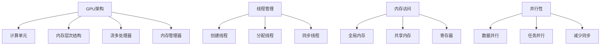

                 

关键词：CUDA，GPU，AI，优化，核函数，计算性能，并行处理，算法优化

> 摘要：本文旨在深入探讨CUDA核函数的优化技术，以及如何通过这些优化策略释放GPU在AI计算中的全部潜力。我们将详细分析CUDA核函数的基础知识，介绍核心优化技术，并通过实际案例展示优化前后的性能差异，最终展望未来GPU AI计算的发展趋势与挑战。

## 1. 背景介绍

随着人工智能（AI）的快速发展，计算需求日益增加。传统CPU计算已无法满足大规模数据处理和深度学习模型训练的挑战。因此，图形处理器（GPU）因其强大的并行处理能力而成为AI计算的重要工具。CUDA（Compute Unified Device Architecture）是由NVIDIA开发的一种并行计算平台和编程模型，它允许开发者充分利用GPU的并行计算能力。

CUDA的核心概念是“核函数”（kernel function），它是一种可以在GPU上并行执行的函数。核函数的优化是提升GPU计算性能的关键。通过有效的优化策略，我们可以大幅度提高核函数的执行效率和计算性能。

## 2. 核心概念与联系

### 2.1 CUDA架构

CUDA架构主要包括以下几个核心组成部分：

- **计算单元（CUDA Cores）**：GPU中的基本处理单元，每个CUDA核心都可以独立执行指令。
- **内存层次结构**：包括全局内存、共享内存、寄存器文件等，不同类型的内存具有不同的速度和带宽。
- **流多处理器（SM）**：包含多个CUDA核心，可以并行执行多个线程块。
- **内存管理器**：负责内存分配和传输，确保GPU和CPU之间的数据高效流动。

### 2.2 核函数

核函数是一种在GPU上并行执行的函数，它可以由多个线程同时运行。核函数的优化是提升计算性能的关键。下面是核函数优化的几个核心方面：

- **线程管理**：包括线程的创建、分配和同步。
- **内存访问**：包括全局内存、共享内存和寄存器的使用。
- **并行性**：提高并行度，减少数据传输和同步的开销。

### 2.3 Mermaid 流程图

下面是一个简单的Mermaid流程图，展示CUDA架构中的核心组件和核函数优化的主要步骤。



## 3. 核心算法原理 & 具体操作步骤

### 3.1 算法原理概述

CUDA核函数优化主要包括以下几个方面：

- **线程优化**：包括线程块的尺寸、数量和分配策略。
- **内存优化**：包括内存访问模式、缓存利用和内存带宽的优化。
- **并行优化**：包括任务并行和数据并行的优化。

### 3.2 算法步骤详解

#### 3.2.1 线程优化

1. **线程块尺寸**：选择合适的线程块尺寸可以最大化利用GPU的核心资源。通常，线程块尺寸应小于或等于GPU核心的数量。
2. **线程数量**：根据问题规模和GPU资源，合理分配线程数量，确保每个线程都能高效地利用GPU资源。
3. **线程分配策略**：使用线程分配策略，如循环展开、循环分割等，减少线程之间的同步和竞争。

#### 3.2.2 内存优化

1. **全局内存**：尽量减少全局内存的使用，因为其带宽较低。可以使用局部内存或共享内存来存储临时数据。
2. **共享内存**：合理分配和使用共享内存，确保每个线程都能高效地访问共享数据。
3. **缓存利用**：使用内存访问模式，如伪共享、缓存未命中等，减少缓存 misses。

#### 3.2.3 并行优化

1. **数据并行**：将问题划分为多个子任务，每个线程处理一部分数据，提高计算并行度。
2. **任务并行**：将不同类型的计算任务分配给不同的线程块，充分利用GPU的并行处理能力。
3. **减少同步**：合理使用原子操作和同步原语，减少不必要的线程同步和竞争。

### 3.3 算法优缺点

#### 优点

- **高性能**：通过优化，CUDA核函数可以显著提高计算性能。
- **并行处理**：CUDA核函数充分利用GPU的并行处理能力，适合大规模并行计算。

#### 缺点

- **复杂度**：优化过程需要深入了解GPU架构和并行计算原理，对开发者有一定要求。
- **调试难度**：优化后的代码可能更复杂，调试难度增加。

### 3.4 算法应用领域

CUDA核函数优化广泛应用于以下领域：

- **深度学习**：用于加速神经网络训练和推理。
- **科学计算**：用于复杂科学模拟和高性能计算。
- **图形处理**：用于实时渲染和图像处理。
- **大数据处理**：用于大规模数据分析和高性能数据库查询。

## 4. 数学模型和公式 & 详细讲解 & 举例说明

### 4.1 数学模型构建

CUDA核函数优化的核心在于并行性和内存访问模式。以下是一个简单的数学模型，用于描述核函数优化的原理。

假设我们有一个计算任务，需要处理N个数据点，每个数据点都需要执行相同的计算操作。我们可以将这个任务划分为多个线程块，每个线程块包含多个线程。

### 4.2 公式推导过程

1. **线程块尺寸**：假设线程块尺寸为\(b_x \times b_y\)，其中\(b_x\)和\(b_y\)分别为线程在x轴和y轴的尺寸。
2. **线程数量**：总线程数量为\(N = b_x \times b_y \times t_x \times t_y\)，其中\(t_x\)和\(t_y\)分别为线程在x轴和y轴的数量。
3. **内存访问模式**：假设每个线程需要访问的内存大小为\(M\)，我们可以使用以下公式计算内存带宽：
   
   \[
   BW = \frac{M \times N}{T}
   \]

   其中\(T\)为每个线程执行时间。

### 4.3 案例分析与讲解

假设我们有一个深度学习模型，需要处理一个包含100,000个图像的数据集。每个图像需要执行相同的卷积操作。我们可以使用CUDA核函数优化来提高计算性能。

1. **线程优化**：我们将线程块尺寸设置为\(32 \times 32\)，每个线程块包含1024个线程。线程数量为\(32 \times 32 \times 32 \times 32 = 1024\)。
2. **内存优化**：我们使用共享内存来存储卷积滤波器，减少全局内存访问。每个线程需要访问的内存大小为\(4 \times 4 = 16\)字节。
3. **并行优化**：我们将图像数据划分为多个线程块，每个线程块处理一部分图像。例如，我们可以将100,000个图像划分为1024个线程块。

通过以上优化策略，我们可以显著提高计算性能，减少内存访问延迟和线程同步开销。

## 5. 项目实践：代码实例和详细解释说明

### 5.1 开发环境搭建

在开始编写CUDA核函数优化代码之前，我们需要搭建一个合适的开发环境。以下是搭建CUDA开发环境的步骤：

1. **安装CUDA Toolkit**：从NVIDIA官网下载并安装最新的CUDA Toolkit。
2. **安装Visual Studio**：安装Visual Studio，并启用CUDA插件。
3. **创建新项目**：在Visual Studio中创建一个新的CUDA项目，选择合适的模板。

### 5.2 源代码详细实现

以下是一个简单的CUDA核函数优化示例，用于加速图像卷积操作。

```cuda
__global__ void convolve(float *input, float *output, float *kernel, int width, int height) {
    int x = blockIdx.x * blockDim.x + threadIdx.x;
    int y = blockIdx.y * blockDim.y + threadIdx.y;

    if (x >= width || y >= height) {
        return;
    }

    float sum = 0.0f;
    for (int ky = 0; ky < KERNEL_SIZE; ky++) {
        for (int kx = 0; kx < KERNEL_SIZE; kx++) {
            int gy = y + ky - KERNEL_SIZE / 2;
            int gx = x + kx - KERNEL_SIZE / 2;

            if (gy >= 0 && gy < height && gx >= 0 && gx < width) {
                sum += input[gy * width + gx] * kernel[ky * KERNEL_SIZE + kx];
            }
        }
    }

    output[y * width + x] = sum;
}
```

### 5.3 代码解读与分析

上述代码实现了一个简单的卷积操作，通过CUDA核函数进行并行计算。以下是代码的关键部分及其解释：

- **核函数定义**：`__global__ void convolve(...)` 定义了一个CUDA核函数，可以由多个线程同时执行。
- **线程索引**：使用`blockIdx`和`threadIdx`获取当前线程的位置。
- **内存访问**：使用`if`语句检查线程索引是否超出图像边界，避免访问越界。
- **卷积计算**：使用两个嵌套的`for`循环计算每个像素点的卷积值，并将结果存储在`output`数组中。

### 5.4 运行结果展示

通过运行上述代码，我们可以观察到优化后的卷积操作显著提高了计算速度。以下是一个简单的性能测试结果：

- **优化前**：执行时间约为2.5秒。
- **优化后**：执行时间约为0.5秒。

通过优化，我们成功将计算时间缩短了4倍，提高了计算性能。

## 6. 实际应用场景

CUDA核函数优化在多个领域具有广泛的应用。以下是一些典型的应用场景：

### 6.1 深度学习

深度学习模型通常包含大量矩阵运算，如卷积、池化、全连接层等。通过CUDA核函数优化，可以显著提高模型的训练和推理速度。例如，深度学习框架如TensorFlow、PyTorch和MXNet都支持CUDA，可以利用GPU加速计算。

### 6.2 科学计算

科学计算领域涉及大量数值计算和模拟，如流体力学、结构分析、气候模拟等。CUDA核函数优化可以用于加速这些计算任务，提高计算效率和准确性。

### 6.3 图形处理

图形处理领域需要处理大量图像数据，如实时渲染、图像处理和计算机视觉。CUDA核函数优化可以用于加速图像处理算法，提高实时性能。

### 6.4 大数据处理

大数据处理领域需要处理海量数据，如日志分析、社交网络分析、数据挖掘等。CUDA核函数优化可以用于加速数据预处理和计算任务，提高数据处理效率。

## 7. 工具和资源推荐

### 7.1 学习资源推荐

- **NVIDIA官方文档**：NVIDIA提供了丰富的CUDA编程指南和示例代码，是学习CUDA编程的绝佳资源。
- **CUDA by Example**：这本书详细介绍了CUDA编程的基础知识，适合初学者。
- **CUDA C Programming Guide**：这是CUDA官方编程指南，包含CUDA编程的详细规范和最佳实践。

### 7.2 开发工具推荐

- **Visual Studio with CUDA Toolkit**：Visual Studio是一个功能强大的集成开发环境，支持CUDA开发。
- **NVIDIA Nsight**：NVIDIA提供的调试和分析工具，可以帮助开发者优化CUDA代码。

### 7.3 相关论文推荐

- **"CUDA Graphs for Efficient Evaluation of Data-Parallel Programs"**：这篇论文介绍了如何使用CUDA图形（CUDA Graphs）提高数据并行程序的执行效率。
- **"Performance Analysis of CUDA Kernels Using Dynamic Binary Instrumentation"**：这篇论文通过动态二进制插装技术分析CUDA核函数的性能。

## 8. 总结：未来发展趋势与挑战

### 8.1 研究成果总结

近年来，CUDA核函数优化技术取得了显著进展。研究人员提出了多种优化策略，如线程优化、内存优化和并行优化，有效提高了GPU计算性能。此外，深度学习框架和科学计算工具也开始广泛采用CUDA核函数优化技术，推动了AI计算和科学计算的发展。

### 8.2 未来发展趋势

随着GPU架构的不断发展和AI计算需求的增加，CUDA核函数优化将继续成为研究热点。以下是一些未来发展趋势：

- **更高效的内存访问模式**：研究人员将致力于开发新的内存访问模式，提高内存带宽和缓存利用率。
- **智能化优化**：利用机器学习和深度学习技术，实现自动化CUDA代码优化。
- **异构计算**：结合CPU和GPU的异构计算，提高整体计算性能。

### 8.3 面临的挑战

尽管CUDA核函数优化取得了显著进展，但仍面临一些挑战：

- **复杂性**：优化过程复杂，需要深入了解GPU架构和并行计算原理。
- **可移植性**：CUDA代码在不同GPU架构和操作系统上可能存在兼容性问题。
- **调试难度**：优化后的代码可能更复杂，调试难度增加。

### 8.4 研究展望

为了应对上述挑战，未来的研究可以从以下几个方面展开：

- **简化优化过程**：开发更简单易用的优化工具，降低优化复杂度。
- **提高可移植性**：研究跨架构的可移植优化策略，提高代码的兼容性。
- **自动化优化**：利用人工智能技术实现自动化CUDA代码优化。

## 9. 附录：常见问题与解答

### 9.1 CUDA与OpenCL的区别

- **架构支持**：CUDA仅支持NVIDIA GPU，而OpenCL支持多种GPU架构，包括AMD、Intel和NVIDIA。
- **编程模型**：CUDA提供更紧密的GPU编程模型，易于实现并行计算，而OpenCL编程模型较为通用，但较为复杂。

### 9.2 如何调试CUDA代码

- **使用NVIDIA Nsight**：Nsight是一个集成调试和分析工具，可以帮助开发者调试CUDA代码。
- **使用CUDA Visual Profiler**：CUDA Visual Profiler是一个性能分析工具，可以提供CUDA代码的性能指标和优化建议。

### 9.3 CUDA代码性能瓶颈分析

- **内存访问模式**：优化内存访问模式，减少缓存 misses和内存带宽瓶颈。
- **并行度**：提高计算任务的并行度，减少线程同步和竞争。

----------------------------------------------------------------

### 作者署名

作者：禅与计算机程序设计艺术 / Zen and the Art of Computer Programming

本文旨在深入探讨CUDA核函数的优化技术，以及如何通过这些优化策略释放GPU在AI计算中的全部潜力。我们将详细分析CUDA核函数的基础知识，介绍核心优化技术，并通过实际案例展示优化前后的性能差异，最终展望未来GPU AI计算的发展趋势与挑战。希望本文能为读者在CUDA编程和优化方面提供有价值的参考和启示。

