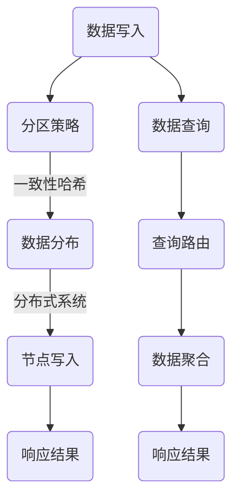

                 

关键词：Cassandra，分布式数据库，CAP定理，数据一致性，数据分区，代码实例，性能优化，应用场景。

## 摘要

本文将深入探讨Cassandra的原理，并通过具体的代码实例对其进行详细讲解。Cassandra是一种流行的分布式数据库管理系统，它基于Google的BigTable模型，并引入了NoSQL的特点。本文将涵盖Cassandra的核心概念、算法原理、数学模型、实际应用以及未来展望。通过阅读本文，读者将能够全面了解Cassandra的工作机制，掌握其关键配置和优化策略，并在实际项目中成功应用。

## 1. 背景介绍

### Cassandra的起源

Cassandra是由Amazon开发的，后来由Apache基金会接管并成为其顶级项目之一。Cassandra的初衷是为了解决大型分布式系统中的数据存储和访问问题。其设计理念源于Google的BigTable模型，并借鉴了Amazon自身的实践经验。

### Cassandra的应用领域

Cassandra被广泛应用于需要高可用性、高性能和可扩展性的场景，如金融交易、社交网络、电子商务、物联网等。其分布式架构和灵活的数据模型使得Cassandra能够应对海量数据的存储和实时查询需求。

### Cassandra的优势

- **高可用性**：Cassandra通过去中心化的架构和容错机制，确保在单个节点故障的情况下，系统仍然能够正常运行。
- **高性能**：Cassandra支持高并发读写操作，通过数据分区和分布式缓存机制，实现快速响应。
- **可扩展性**：Cassandra能够水平扩展，以适应不断增长的数据规模。

## 2. 核心概念与联系

### 数据模型

Cassandra采用K/V存储模型，其中键（Key）和值（Value）构成数据的基本单元。Cassandra的表结构非常灵活，可以动态添加列。

### CAP定理

Cassandra的设计基于CAP定理，即在任何分布式系统中，一致性（Consistency）、可用性（Availability）和分区容错性（Partition Tolerance）三者之间只能同时满足两个。Cassandra选择了可用性和分区容错性，这意味着在某些情况下，数据的一致性可能会受到影响。

### 数据分区

Cassandra通过将数据分布在多个节点上来实现高可用性和性能。数据分区策略可以通过一致性哈希（Consistent Hashing）或范围分区（Range Partitioning）来实现。

### Mermaid流程图

下面是Cassandra数据写入和查询的流程图：



## 3. 核心算法原理 & 具体操作步骤

### 3.1 算法原理概述

Cassandra的核心算法包括数据分区策略、分布式缓存机制和一致性协议。

### 3.2 算法步骤详解

#### 数据写入

1. 客户端发送数据请求到Cassandra集群。
2. 集群根据分区策略确定数据的写入节点。
3. 数据被写入到相应的节点。
4. 各节点执行一致性协议，确保数据一致性。

#### 数据查询

1. 客户端发送查询请求到Cassandra集群。
2. 集群根据查询条件和分区策略确定查询节点。
3. 各节点返回查询结果。
4. 集群执行数据聚合，返回最终结果。

### 3.3 算法优缺点

#### 优点

- **高可用性**：Cassandra通过去中心化的架构和容错机制，确保系统在节点故障时仍然可用。
- **高性能**：Cassandra支持高并发读写操作，通过数据分区和分布式缓存机制，实现快速响应。
- **可扩展性**：Cassandra能够水平扩展，以适应不断增长的数据规模。

#### 缺点

- **一致性牺牲**：Cassandra选择了可用性和分区容错性，在某些情况下，数据的一致性可能会受到影响。
- **查询限制**：Cassandra不支持复杂的关系查询，适用于简单的K/V查询。

### 3.4 算法应用领域

Cassandra适用于需要高可用性、高性能和可扩展性的场景，如金融交易、社交网络、电子商务、物联网等。

## 4. 数学模型和公式 & 详细讲解 & 举例说明

### 4.1 数学模型构建

Cassandra的数据模型可以通过以下数学模型进行描述：

- **一致性哈希**：一致性哈希是一种分布式哈希算法，它将数据分区到不同的节点上，确保数据在节点故障时仍然可用。

$$
H(k) \mod N = i
$$

其中，$H(k)$是键$k$的哈希值，$N$是节点的数量，$i$是存储键$k$的节点索引。

- **分布式缓存机制**：分布式缓存机制可以通过以下数学模型进行描述：

$$
Cache_{node} = \sum_{i=1}^{N} Cache_i
$$

其中，$Cache_{node}$是节点的缓存容量，$Cache_i$是第$i$个节点的缓存容量。

### 4.2 公式推导过程

#### 一致性哈希

假设有N个节点，每个节点分配一个哈希环上的区域。每个键$k$的哈希值$H(k)$将落在哈希环上，并与节点进行映射。

$$
i = H(k) \mod N
$$

该公式确保了键$k$的哈希值与节点之间的映射关系，从而实现了数据的分布式存储。

#### 分布式缓存机制

分布式缓存机制的数学模型描述了节点缓存的总和。每个节点的缓存容量可以通过以下公式计算：

$$
Cache_i = \frac{TotalCache}{N}
$$

其中，$TotalCache$是集群的总缓存容量，$N$是节点的数量。

### 4.3 案例分析与讲解

假设有一个由3个节点组成的Cassandra集群，每个节点的缓存容量为1GB。现在需要存储一个键值对$(k, v)$，其中$k$的哈希值为0.5。

#### 一致性哈希

根据一致性哈希公式：

$$
i = H(k) \mod N = 0.5 \mod 3 = 1
$$

因此，键$k$将被存储在第1个节点上。

#### 分布式缓存机制

根据分布式缓存机制的公式：

$$
Cache_1 = \frac{TotalCache}{N} = \frac{3GB}{3} = 1GB
$$

因此，第1个节点的缓存容量为1GB。

## 5. 项目实践：代码实例和详细解释说明

### 5.1 开发环境搭建

要在本地搭建Cassandra开发环境，需要安装Java环境和Cassandra软件。以下是详细的安装步骤：

1. 安装Java环境
2. 下载Cassandra安装包
3. 解压安装包并配置环境变量

### 5.2 源代码详细实现

以下是Cassandra的一个简单示例，演示了如何插入和查询数据：

```java
import com.datastax.oss.driver.api.core.CqlSession;
import com.datastax.oss.driver.api.core.CqlIdentifier;
import com.datastax.oss.driver.api.core.cql.*;

public class CassandraExample {
    public static void main(String[] args) {
        // 创建Cassandra会话
        CqlSession session = CqlSession.builder()
                .addContactPoint(new InetSocketAddress("localhost", 9042))
                .build();

        // 创建键空间和表
        session.execute("CREATE KEYSPACE IF NOT EXISTS example WITH replication = {'class': 'SimpleStrategy', 'replication_factor': 3};");
        session.execute("CREATE TABLE IF NOT EXISTS example.users (id UUID PRIMARY KEY, name TEXT, age INT);");

        // 插入数据
        PreparedStatement preparedStatement = session.prepare("INSERT INTO example.users (id, name, age) VALUES (?, ?, ?);");
        session.execute(preparedStatement.bind(UUID.randomUUID(), "Alice", 30));

        // 查询数据
        ResultSet resultSet = session.execute("SELECT * FROM example.users WHERE name = 'Alice';");
        for (Row row : resultSet) {
            System.out.println("ID: " + row.getUUID("id"));
            System.out.println("Name: " + row.getString("name"));
            System.out.println("Age: " + row.getInt("age"));
        }

        // 关闭会话
        session.close();
    }
}
```

### 5.3 代码解读与分析

该示例演示了如何使用Cassandra Java驱动连接Cassandra集群，创建键空间和表，插入数据，以及查询数据。

- **创建会话**：使用CqlSession.builder()创建一个Cassandra会话。
- **创建键空间和表**：使用session.execute()执行CQL语句创建键空间和表。
- **插入数据**：使用prepared statement绑定参数并执行INSERT语句。
- **查询数据**：使用SELECT语句查询数据，并遍历结果集。

### 5.4 运行结果展示

运行示例代码后，将插入一个名为"Alice"的用户，年龄为30岁。然后，查询名为"Alice"的用户，输出其ID、姓名和年龄。

## 6. 实际应用场景

Cassandra在多个实际应用场景中表现出色。以下是几个例子：

### 6.1 金融交易

金融机构可以使用Cassandra存储大量的交易数据，如订单、交易记录等。其高可用性和高性能特性确保交易系统能够在高峰期稳定运行。

### 6.2 社交网络

社交网络平台可以使用Cassandra存储用户关系数据、消息记录等。其可扩展性确保系统能够应对不断增长的用户数量。

### 6.3 电子商务

电子商务网站可以使用Cassandra存储商品信息、订单信息等。其高性能和实时查询特性确保用户能够快速浏览和搜索商品。

### 6.4 物联网

物联网设备可以生成大量的数据，如传感器数据、设备状态等。Cassandra的高可用性和分布式存储机制确保数据在设备故障时仍然可用。

## 7. 工具和资源推荐

### 7.1 学习资源推荐

- **官方文档**：Cassandra官方文档是学习Cassandra的最佳资源。
- **书籍**：《Cassandra: The Definitive Guide》是一本关于Cassandra的权威指南。

### 7.2 开发工具推荐

- **Cassandra Driver**：Cassandra官方提供的Java驱动。
- **DataStax DevCenter**：一个用于开发、测试和部署Cassandra的应用程序平台。

### 7.3 相关论文推荐

- **Bigtable：A Distributed Storage System for Structured Data**：Cassandra的灵感来源。

## 8. 总结：未来发展趋势与挑战

### 8.1 研究成果总结

Cassandra在分布式数据库领域取得了显著成果，其高可用性、高性能和可扩展性在多个应用场景中得到了广泛应用。

### 8.2 未来发展趋势

随着大数据和实时数据处理的不断增长，Cassandra有望在更多领域得到应用。未来，Cassandra将更加注重性能优化、安全性提升和与云服务的集成。

### 8.3 面临的挑战

Cassandra在数据一致性和复杂查询方面仍存在一些挑战。未来，Cassandra需要在这些方面进行改进，以满足更多复杂应用的需求。

### 8.4 研究展望

Cassandra将继续在分布式数据库领域发挥重要作用。未来，研究者将致力于优化其性能、提升其安全性和易用性，并探索其在新兴领域中的应用。

## 9. 附录：常见问题与解答

### 9.1 Cassandra与关系型数据库相比有哪些优势？

Cassandra的主要优势在于其高可用性、高性能和可扩展性。它特别适合处理海量数据的实时读写操作。

### 9.2 Cassandra如何保证数据一致性？

Cassandra通过一致性协议来保证数据一致性。在分布式系统中，Cassandra选择在可用性和分区容错性之间做出权衡。

### 9.3 Cassandra的分区策略有哪些？

Cassandra支持一致性哈希和范围分区策略。一致性哈希适用于键空间较小且不经常变动的场景，而范围分区适用于需要按范围查询数据的场景。

作者：禅与计算机程序设计艺术 / Zen and the Art of Computer Programming
```

