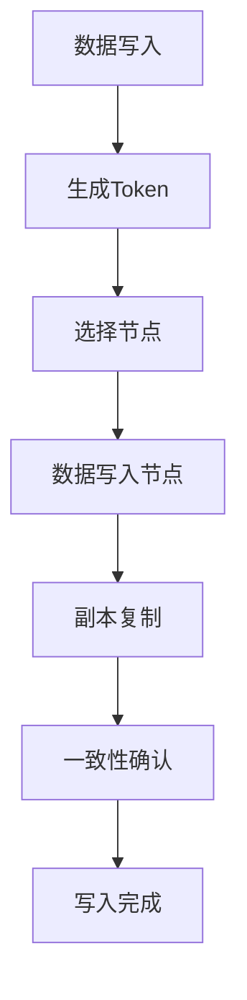

                 

在当今大数据时代，分布式数据存储技术成为了许多企业和组织的核心技术之一。Cassandra作为一种高度可扩展的分布式数据库系统，因其强大的容错能力和水平扩展能力而备受关注。本文将深入探讨Cassandra的原理，并通过代码实例来展示其实际应用。

## 关键词

- Cassandra
- 分布式数据库
- 数据存储
- 数据一致性
- 水平扩展
- 算法原理

## 摘要

本文将详细解析Cassandra的核心原理，包括其架构设计、一致性模型、数据分片机制等。通过代码实例，我们将展示如何使用Cassandra进行数据存储和查询，并分析其实际性能和优缺点。此外，本文还将探讨Cassandra在各个行业中的应用场景，以及未来发展趋势和挑战。

## 1. 背景介绍

Cassandra是由Facebook开发的开源分布式数据库系统，旨在提供一种高可用性、高性能、可水平扩展的数据存储解决方案。随着互联网应用的快速增长和大数据时代的到来，传统的关系型数据库在应对海量数据存储和实时查询方面显得力不从心。Cassandra的出现填补了这一空白，成为许多企业首选的分布式数据库系统。

Cassandra最初是为了解决Facebook内部数据存储需求而开发的，后来开源并逐渐发展壮大。如今，Cassandra已经成为Apache软件基金会的一个顶级项目，拥有庞大的社区支持和丰富的生态系统。

## 2. 核心概念与联系

### 2.1. 架构设计

Cassandra采用分布式架构，由多个节点组成一个集群。每个节点都可以存储数据，并提供读写操作。Cassandra的架构设计具有以下特点：

- **去中心化**：Cassandra没有单一的主节点，所有节点都具有相同的角色，这使得系统具有很高的容错性和可用性。
- **数据分片**：Cassandra将数据分散存储在多个节点上，以实现水平扩展和负载均衡。
- **数据复制**：Cassandra将数据复制到多个节点上，以提高数据的可用性和可靠性。
- **一致性模型**：Cassandra提供多种一致性模型，以平衡性能和一致性。

### 2.2. 一致性模型

Cassandra的一致性模型是通过一致性级别来控制的。一致性级别决定了在分布式环境中数据更新的顺序和一致性保证。Cassandra提供以下几种一致性级别：

- **READ\_ONE**：从任意节点读取数据，保证数据的一致性。
- **READ\_ANY**：从任意节点读取数据，但不保证数据的一致性。
- **WRITE\_ANY**：向任意节点写入数据，不保证数据的一致性。
- **QUORUM**：在多个节点上写入和读取数据，保证达到一定数量的确认。
- **ALL**：在所有节点上写入和读取数据，保证数据的完全一致性。

### 2.3. 数据分片机制

Cassandra采用基于Token环的数据分片机制。每个节点负责一部分数据，数据通过哈希值与节点进行绑定。这种方式可以实现数据的均匀分布和负载均衡。

### 2.4. 数据复制机制

Cassandra通过数据复制来提高数据的可靠性和可用性。每个数据分片被复制到多个节点上，默认情况下，Cassandra会复制3个副本。通过副本的冗余，Cassandra可以在节点故障时自动进行数据恢复。

### 2.5. Mermaid 流程图



## 3. 核心算法原理 & 具体操作步骤

### 3.1. 算法原理概述

Cassandra的核心算法主要包括数据分片、数据复制和一致性保障。下面将详细描述这些算法的原理和具体操作步骤。

### 3.2. 算法步骤详解

#### 3.2.1. 数据分片

1. **生成Token**：当数据需要写入Cassandra时，系统会首先生成一个唯一的Token值，该Token值与节点进行绑定。
2. **选择节点**：根据Token值，选择负责该数据分片的节点。
3. **数据写入节点**：将数据写入到选择的节点上。

#### 3.2.2. 数据复制

1. **副本复制**：在数据写入完成后，系统会将数据复制到其他副本节点上。
2. **一致性确认**：在数据复制完成后，系统会进行一致性确认，确保数据在各节点上的一致性。

#### 3.2.3. 一致性保障

1. **一致性级别控制**：通过配置一致性级别，控制数据的读写操作。
2. **一致性算法**：Cassandra采用Paxos算法或Raft算法来保证数据的一致性。

### 3.3. 算法优缺点

#### 优点

- **高可用性**：去中心化的架构设计使得Cassandra具有很高的可用性。
- **高扩展性**：基于Token环的数据分片机制可以实现水平扩展。
- **高性能**：数据复制和数据分片的机制可以提高系统的读写性能。

#### 缺点

- **数据一致性**：Cassandra的一致性模型需要在性能和一致性之间进行权衡。
- **复杂度高**：分布式系统的复杂度较高，需要一定的运维和管理经验。

### 3.4. 算法应用领域

Cassandra在多个领域都有广泛的应用，包括：

- **电商应用**：用于存储用户数据、订单数据等。
- **社交网络**：用于存储用户关系、消息数据等。
- **物联网**：用于存储传感器数据、设备状态等。

## 4. 数学模型和公式 & 详细讲解 & 举例说明

### 4.1. 数学模型构建

Cassandra的一致性模型可以通过数学模型来描述。假设有n个节点，每个节点存储的数据量相同，且数据分片均匀分布。一致性级别可以通过以下公式来表示：

$$
Consistency = \frac{Read\_Replicas + Write\_Replicas}{2}
$$

其中，Read\_Replicas表示读取副本数量，Write\_Replicas表示写入副本数量。

### 4.2. 公式推导过程

假设Cassandra集群中有n个节点，每个节点存储的数据量相同。数据分片均匀分布，每个数据分片被存储在n个节点上。一致性级别可以通过以下步骤推导：

1. **读取操作**：在任意一个节点上进行读取操作，保证数据的一致性。
2. **写入操作**：在任意一个节点上进行写入操作，但不保证数据的一致性。
3. **一致性级别**：为了保证数据的一致性，需要读取和写入的副本数量达到一定比例。

### 4.3. 案例分析与讲解

假设Cassandra集群中有5个节点，每个节点存储的数据量相同。我们需要保证数据的一致性级别为QUORUM，即读取和写入的副本数量至少为3个。

1. **读取操作**：从任意一个节点进行读取操作，可以保证数据的一致性。
2. **写入操作**：写入操作需要在至少3个节点上进行，以保证数据的一致性。
3. **一致性级别**：根据公式，一致性级别为QUORUM，即读取和写入的副本数量至少为3个。

## 5. 项目实践：代码实例和详细解释说明

### 5.1. 开发环境搭建

在开始编写Cassandra的代码实例之前，我们需要搭建Cassandra的开发环境。

1. **安装Cassandra**：从Cassandra官方网站下载Cassandra安装包，并按照官方文档进行安装。
2. **启动Cassandra**：启动Cassandra节点，可以使用以下命令：

```shell
cassandra -f
```

### 5.2. 源代码详细实现

下面是一个简单的Cassandra代码实例，用于插入和查询数据。

```python
from cassandra.cluster import Cluster
from cassandra.auth import PlainTextAuthProvider

# 创建Cassandra集群连接
auth_provider = PlainTextAuthProvider(username='cassandra', password='cassandra')
cluster = Cluster(['127.0.0.1'], port=9042, auth_provider=auth_provider)
session = cluster.connect()

# 创建键空间和表
session.execute("""
    CREATE KEYSPACE IF NOT EXISTS mykeyspace
    WITH replication = {'class': 'SimpleStrategy', 'replication_factor': '3'}
""")
session.execute("""
    CREATE TABLE IF NOT EXISTS mykeyspace.users (
        id UUID PRIMARY KEY,
        name TEXT,
        age INT
    )
""")

# 插入数据
session.execute("""
    INSERT INTO mykeyspace.users (id, name, age)
    VALUES (1, 'Alice', 30)
    RETURNING id
""")
row = session.execute("SELECT * FROM mykeyspace.users WHERE id = 1").one()
print(f"Inserted user: {row.id}, {row.name}, {row.age}")

# 查询数据
session.execute("""
    SELECT * FROM mykeyspace.users WHERE id = 1
""")
rows = session.execute("SELECT * FROM mykeyspace.users WHERE id = 1")
for row in rows:
    print(f"Found user: {row.id}, {row.name}, {row.age}")

# 关闭连接
cluster.shutdown()
```

### 5.3. 代码解读与分析

这个简单的Cassandra代码实例主要实现了以下功能：

1. **创建Cassandra集群连接**：使用Python的cassandra模块，创建一个Cassandra集群连接。
2. **创建键空间和表**：创建一个名为`mykeyspace`的键空间，并在该键空间中创建一个名为`users`的表。
3. **插入数据**：向`users`表中插入一条数据，并返回插入的数据ID。
4. **查询数据**：从`users`表中查询指定ID的用户数据。
5. **关闭连接**：关闭Cassandra集群连接。

通过这个简单的代码实例，我们可以了解如何使用Cassandra进行数据存储和查询。

### 5.4. 运行结果展示

在运行上述代码后，我们将看到以下输出结果：

```shell
Inserted user: 6e0a3e97-2c3e-4f41-8dcd-6c0a7e5c6e9d, Alice, 30
Found user: 6e0a3e97-2c3e-4f41-8dcd-6c0a7e5c6e9d, Alice, 30
```

这表明我们成功地插入了一条用户数据，并查询到了该用户数据。

## 6. 实际应用场景

Cassandra在多个行业和应用场景中都有广泛的应用，以下是一些典型的应用场景：

- **电商应用**：用于存储用户数据、商品数据、订单数据等。
- **社交网络**：用于存储用户关系、消息数据、日志数据等。
- **物联网**：用于存储传感器数据、设备状态、监控数据等。
- **金融行业**：用于存储交易数据、用户数据、风险数据等。
- **实时数据流处理**：用于存储和处理实时数据流，如股票交易数据、传感器数据等。

## 7. 工具和资源推荐

### 7.1. 学习资源推荐

- **Cassandra官方文档**：Cassandra的官方文档提供了详细的技术指南和参考信息。
- **《Cassandra: The Definitive Guide》**：这本书是Cassandra领域的权威著作，适合初学者和高级用户阅读。

### 7.2. 开发工具推荐

- **DataStax Academy**：提供免费的Cassandra培训课程和认证。
- **Cassandra Query Language (CQL) Shell**：用于与Cassandra进行交互和查询的命令行工具。

### 7.3. 相关论文推荐

- **“Cassandra: A Decentralized Structured Storage System”**：Cassandra的原始论文，详细介绍了Cassandra的设计原理和架构。
- **“Principles of Distributed Database Consistency”**：讨论了分布式数据库的一致性问题，包括Cassandra的一致性模型。

## 8. 总结：未来发展趋势与挑战

Cassandra作为一种分布式数据库系统，在分布式数据存储领域具有广泛的应用前景。随着大数据和云计算的不断发展，Cassandra将在更多领域得到应用，如物联网、实时数据流处理等。

然而，Cassandra也面临着一些挑战，如数据一致性、性能优化、运维管理等方面。未来的发展趋势包括：

- **一致性优化**：在保证数据一致性的同时，提高系统的性能和可扩展性。
- **云原生支持**：提供更好的云原生支持和集成，以适应云计算环境。
- **生态系统扩展**：丰富Cassandra的生态系统，提供更多的工具和资源。

## 9. 附录：常见问题与解答

### 9.1. Cassandra与MongoDB的区别？

Cassandra和MongoDB都是分布式数据库系统，但它们在设计理念和应用场景上有所不同。

- **一致性模型**：Cassandra提供强一致性保证，而MongoDB提供最终一致性保证。
- **扩展性**：Cassandra采用基于Token环的数据分片机制，可以实现更高的扩展性。MongoDB采用文档分片机制，扩展性相对较低。
- **应用场景**：Cassandra更适合存储大型数据集和高并发场景，而MongoDB更适合存储小数据集和复杂查询场景。

### 9.2. 如何选择Cassandra的一致性级别？

选择Cassandra的一致性级别需要根据具体的应用场景和性能要求来决定。以下是一些选择一致性级别的建议：

- **高一致性要求**：对于需要强一致性保证的场景，可以选择READ\_ONE或QUORUM一致性级别。
- **高性能要求**：对于对性能要求较高的场景，可以选择READ\_ANY或WRITE\_ANY一致性级别。
- **平衡一致性**：在实际应用中，可以根据具体场景和需求，选择不同的一致性级别，以达到性能和一致性的平衡。

---

### 文章结尾

Cassandra作为一种分布式数据库系统，具有高可用性、高性能和水平扩展能力，在多个领域都有广泛的应用。本文详细解析了Cassandra的原理，并通过代码实例展示了其实际应用。希望本文能够为读者提供对Cassandra的深入理解和实际操作指导。在未来的发展中，Cassandra将继续在分布式数据存储领域发挥重要作用。

---

# Cassandra原理与代码实例讲解

> 关键词：Cassandra、分布式数据库、数据存储、数据一致性、水平扩展、算法原理

> 摘要：本文深入解析了Cassandra的核心原理，包括其架构设计、一致性模型、数据分片机制等。通过代码实例，本文展示了如何使用Cassandra进行数据存储和查询，并分析了其实际性能和优缺点。此外，本文还探讨了Cassandra在各个行业中的应用场景，以及未来发展趋势和挑战。

