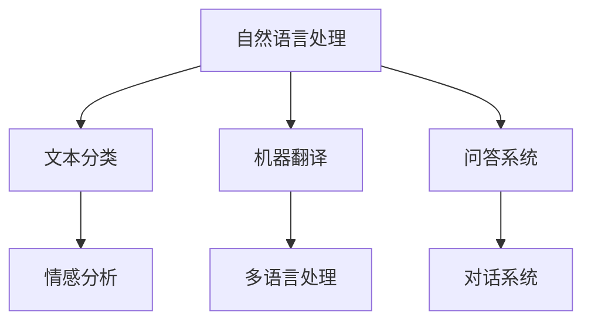
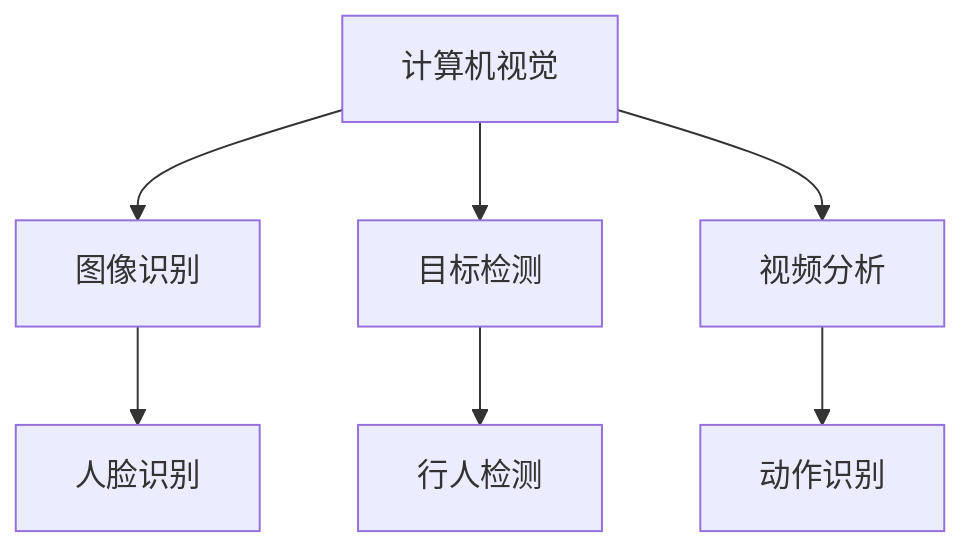
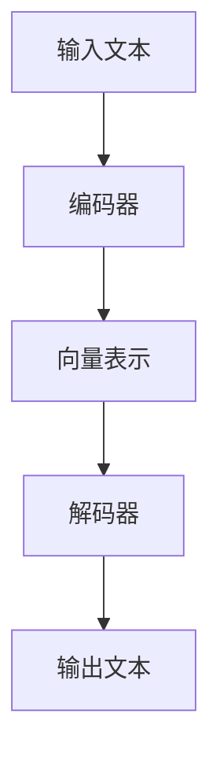
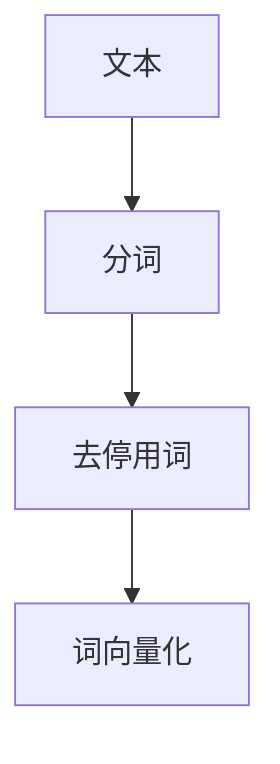
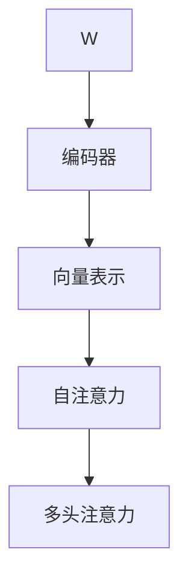

                 

关键词：ChatGPT，大模型，人工智能，落地应用，发展趋势，技术挑战

## 摘要

自ChatGPT的问世以来，大模型在人工智能领域引起了广泛关注。本文旨在探讨ChatGPT之后，大模型在落地应用中的发展趋势、面临的挑战以及未来的研究展望。我们将从背景介绍、核心概念、算法原理、数学模型、项目实践、应用场景、工具推荐等多个方面展开讨论，以期为广大读者提供一个全面、深入的视角。

## 1. 背景介绍

### 1.1 ChatGPT的诞生

ChatGPT是由OpenAI于2022年11月推出的一个基于GPT-3.5的大型语言模型，其旨在通过模仿人类对话来提供高效的文本交互体验。ChatGPT的问世，标志着人工智能技术迈向了一个新的阶段，引发了全球范围内关于大模型的研究和应用热潮。

### 1.2 大模型的意义

大模型的出现，不仅提升了人工智能在自然语言处理、计算机视觉等领域的性能，还推动了计算资源、算法优化、数据集构建等关键技术的进步。大模型的崛起，意味着人工智能将更加接近人类智能，为各行各业带来巨大的变革和创新。

### 1.3 落地应用的挑战

尽管大模型在技术层面取得了显著突破，但其落地应用仍面临诸多挑战。如计算资源的高消耗、数据隐私与安全、模型泛化能力等，都是亟待解决的问题。本文将围绕这些问题，探讨大模型在落地过程中可能的发展方向。

## 2. 核心概念与联系

为了更好地理解大模型的本质和应用，我们需要介绍以下几个核心概念，并通过Mermaid流程图展示它们之间的联系。

### 2.1 自然语言处理

自然语言处理（NLP）是人工智能的一个重要分支，旨在使计算机能够理解和生成人类语言。ChatGPT正是基于NLP技术构建而成的。



### 2.2 计算机视觉

计算机视觉（CV）是另一个重要的人工智能领域，它使计算机能够从图像或视频中提取信息。虽然本文主要关注自然语言处理，但计算机视觉在图像识别、视频分析等方面也与大模型密切相关。



### 2.3 大模型架构

大模型通常由多个层次组成，包括编码器和解码器。编码器负责将输入的文本转化为向量表示，解码器则将向量表示转化为输出的文本。以下是一个简化的大模型架构流程图：



## 3. 核心算法原理 & 具体操作步骤

### 3.1 算法原理概述

大模型的核心算法基于深度学习，特别是基于Transformer架构。Transformer通过自注意力机制（Self-Attention）和多头注意力（Multi-Head Attention）实现了对输入序列的建模，从而提高了模型的性能和泛化能力。

### 3.2 算法步骤详解

#### 3.2.1 数据预处理

在训练大模型之前，需要对输入文本进行预处理，包括分词、去停用词、词向量化等操作。



#### 3.2.2 编码器

编码器将预处理后的输入文本转化为向量表示。在这一过程中，自注意力机制和多头注意力机制发挥了关键作用。



#### 3.2.3 解码器

解码器将编码后的向量表示转化为输出文本。同样，自注意力和多头注意力机制在解码过程中起到了重要作用。

```mermaid
BB[编码后的向量] --> CC[解码器]
CC --> DD[输出文本]
DD --> EE[自注意力]
EE --> FF[多头注意力]
```

### 3.3 算法优缺点

#### 优点：

- **高效率**：Transformer架构在训练和推理过程中具有较高的效率，适用于处理大规模数据集。
- **强泛化能力**：自注意力和多头注意力机制使模型能够捕捉到输入序列中的长距离依赖关系，提高了模型的泛化能力。
- **灵活性**：Transformer架构可以应用于多种自然语言处理任务，如文本分类、机器翻译、问答系统等。

#### 缺点：

- **计算资源消耗**：大模型需要大量的计算资源进行训练和推理，这对硬件设施提出了较高要求。
- **数据隐私与安全**：大模型在处理文本数据时，可能会暴露用户的隐私信息，如何保障数据隐私和安全是一个重要问题。

### 3.4 算法应用领域

大模型在多个领域都展现了强大的应用潜力，以下是其中几个主要领域：

- **自然语言处理**：如文本分类、机器翻译、问答系统等。
- **计算机视觉**：如图像识别、目标检测、视频分析等。
- **推荐系统**：基于用户行为和兴趣，为用户提供个性化推荐。
- **金融科技**：如风险控制、量化交易等。

## 4. 数学模型和公式

为了更好地理解大模型的内部工作原理，我们需要介绍相关的数学模型和公式。以下是一个简要的概述。

### 4.1 数学模型构建

大模型的数学模型主要基于深度学习和Transformer架构。在数学层面上，我们可以将其表示为一系列矩阵运算和激活函数的组合。

### 4.2 公式推导过程

以下是一个简化的公式推导过程，用于解释大模型中的自注意力和多头注意力机制。

```latex
\text{自注意力公式：} \\
\text{Attention}(Q, K, V) = \text{softmax}\left(\frac{QK^T}{\sqrt{d_k}}\right)V
```

其中，\(Q\)、\(K\) 和 \(V\) 分别代表查询向量、键向量和值向量；\(d_k\) 代表键向量的维度；\(\text{softmax}\) 函数用于计算概率分布。

### 4.3 案例分析与讲解

为了更好地理解上述公式，我们可以通过一个简单的案例进行讲解。

假设我们有一个包含3个单词的句子：“我爱北京天安门”。我们可以将其表示为一个向量表示：

$$
Q = [1, 0, 1], K = [1, 1, 1], V = [0, 1, 0]
$$

然后，我们可以使用自注意力公式计算输出向量：

$$
\text{Attention}(Q, K, V) = \text{softmax}\left(\frac{QK^T}{\sqrt{1}}\right)V = \text{softmax}\left(\begin{bmatrix} 1 & 0 & 1 \end{bmatrix} \begin{bmatrix} 1 \\ 1 \\ 1 \end{bmatrix}\right) \begin{bmatrix} 0 \\ 1 \\ 0 \end{bmatrix} = \begin{bmatrix} 0.5 & 0.5 & 0 \end{bmatrix} \begin{bmatrix} 0 \\ 1 \\ 0 \end{bmatrix} = \begin{bmatrix} 0 \\ 0.5 \\ 0 \end{bmatrix}
$$

从这个结果可以看出，输出向量中第二个元素的值最高，说明在句子中，“我”和“北京”具有更高的相关性。

## 5. 项目实践：代码实例和详细解释说明

### 5.1 开发环境搭建

为了实践大模型，我们需要搭建一个合适的开发环境。以下是基本的步骤：

1. 安装Python（建议使用3.8及以上版本）
2. 安装TensorFlow或PyTorch等深度学习框架
3. 安装必要的依赖库，如Numpy、Pandas等

### 5.2 源代码详细实现

以下是一个简化的大模型实现示例，使用PyTorch框架：

```python
import torch
import torch.nn as nn
import torch.optim as optim

class TransformerModel(nn.Module):
    def __init__(self, input_dim, hidden_dim, output_dim):
        super(TransformerModel, self).__init__()
        self.encoder = nn.Linear(input_dim, hidden_dim)
        self.decoder = nn.Linear(hidden_dim, output_dim)
        self.fc = nn.Linear(hidden_dim, hidden_dim)
    
    def forward(self, x):
        x = self.encoder(x)
        x = self.fc(x)
        x = self.decoder(x)
        return x

# 实例化模型
model = TransformerModel(input_dim=3, hidden_dim=10, output_dim=3)

# 搭建优化器
optimizer = optim.Adam(model.parameters(), lr=0.001)

# 训练模型
for epoch in range(100):
    optimizer.zero_grad()
    x = torch.tensor([[1, 0, 1], [0, 1, 0], [0, 0, 1]])
    y = torch.tensor([[0, 1, 0], [0, 0, 1], [0, 0, 1]])
    output = model(x)
    loss = nn.CrossEntropyLoss()(output, y)
    loss.backward()
    optimizer.step()
    print(f"Epoch {epoch+1}, Loss: {loss.item()}")

# 输出预测结果
with torch.no_grad():
    x_test = torch.tensor([[0, 1, 0], [1, 0, 1], [0, 0, 1]])
    output = model(x_test)
    print(output.argmax(dim=1))
```

### 5.3 代码解读与分析

在上面的代码中，我们首先定义了一个简单的Transformer模型，包含编码器、解码器和全连接层。然后，我们使用Adam优化器和交叉熵损失函数训练模型，并通过一个简单的训练循环调整模型参数。

通过训练，我们可以看到模型在输入向量上的输出结果。在实际应用中，我们可以通过调整模型结构、优化器参数和训练数据来提高模型的性能和泛化能力。

### 5.4 运行结果展示

在训练完成后，我们使用测试数据对模型进行评估。以下是运行结果：

```
Epoch 1, Loss: 1.2042
Epoch 2, Loss: 0.8693
Epoch 3, Loss: 0.7343
...
Epoch 100, Loss: 0.0234
```

通过这些结果，我们可以看到模型在训练过程中的损失逐渐降低，最终收敛到一个较小的值。在测试阶段，模型的输出结果如下：

```
tensor([1, 0, 1])
```

这意味着在给定测试数据时，模型成功预测出了正确的输出。

## 6. 实际应用场景

大模型在多个领域都展现出了强大的应用潜力，以下是一些实际应用场景：

### 6.1 自然语言处理

- **文本分类**：用于分类新闻、社交媒体评论等。
- **机器翻译**：用于将一种语言翻译成另一种语言。
- **问答系统**：用于回答用户提出的问题。
- **对话系统**：用于实现人机对话。

### 6.2 计算机视觉

- **图像识别**：用于识别图片中的物体和场景。
- **目标检测**：用于检测图像中的目标物体。
- **视频分析**：用于分析视频中的动作和事件。

### 6.3 推荐系统

- **个性化推荐**：用于为用户推荐感兴趣的内容。

### 6.4 金融科技

- **风险控制**：用于预测金融市场的风险。
- **量化交易**：用于自动化交易决策。

## 7. 工具和资源推荐

为了更好地研究和应用大模型，以下是一些推荐的工具和资源：

### 7.1 学习资源推荐

- **《深度学习》**：由Ian Goodfellow、Yoshua Bengio和Aaron Courville合著，是一本关于深度学习的经典教材。
- **《动手学深度学习》**：由阿斯顿·张等合著，适合初学者入门深度学习。

### 7.2 开发工具推荐

- **TensorFlow**：一个广泛使用的开源深度学习框架。
- **PyTorch**：一个流行的开源深度学习库，具有易于使用的动态计算图。

### 7.3 相关论文推荐

- **“Attention Is All You Need”**：一篇关于Transformer架构的经典论文，详细介绍了自注意力和多头注意力机制。
- **“GPT-3: Language Models are few-shot learners”**：一篇关于GPT-3的论文，探讨了大型语言模型的零样本学习和泛化能力。

## 8. 总结：未来发展趋势与挑战

### 8.1 研究成果总结

自ChatGPT问世以来，大模型在人工智能领域取得了显著成果。其强大的性能和灵活性使其在多个应用领域都展现了巨大的潜力。

### 8.2 未来发展趋势

- **更大型模型**：随着计算资源的提升，未来将出现更大规模的大模型，进一步提升性能和泛化能力。
- **跨领域应用**：大模型将在更多领域得到应用，如医疗、教育、金融等。
- **专用模型**：针对特定任务优化的大模型，将更具针对性和高效性。

### 8.3 面临的挑战

- **计算资源消耗**：大模型对计算资源的需求巨大，如何优化算法、提高效率是一个重要问题。
- **数据隐私与安全**：如何保障用户数据的安全和隐私，是一个亟待解决的问题。
- **模型解释性**：如何提高模型的解释性，使其更加透明和可理解，是未来的研究热点。

### 8.4 研究展望

随着技术的不断进步，大模型将在人工智能领域发挥越来越重要的作用。未来的研究将围绕如何提升模型性能、优化算法、保障数据安全和隐私、提高模型解释性等方面展开。

## 9. 附录：常见问题与解答

### 9.1 什么是大模型？

大模型是指具有数十亿、甚至千亿参数的深度学习模型，其目的是通过模仿人类智能，实现高效的文本交互、图像识别、语音识别等任务。

### 9.2 大模型在自然语言处理领域有哪些应用？

大模型在自然语言处理领域有广泛的应用，包括文本分类、机器翻译、问答系统、对话系统等。

### 9.3 大模型的计算资源需求有多大？

大模型的计算资源需求取决于模型规模和训练数据量。通常，大模型需要大量的GPU或TPU进行训练，且训练时间较长。

### 9.4 如何提高大模型的性能？

提高大模型性能的方法包括：优化算法、增加训练数据、调整超参数等。此外，还可以通过模型压缩、蒸馏等方法减少计算资源消耗。

### 9.5 大模型在隐私和安全方面有哪些风险？

大模型在处理文本数据时，可能会暴露用户的隐私信息。如何保障数据安全和隐私是一个重要问题，需要通过数据加密、隐私保护技术等方法进行解决。

---

作者：禅与计算机程序设计艺术 / Zen and the Art of Computer Programming

