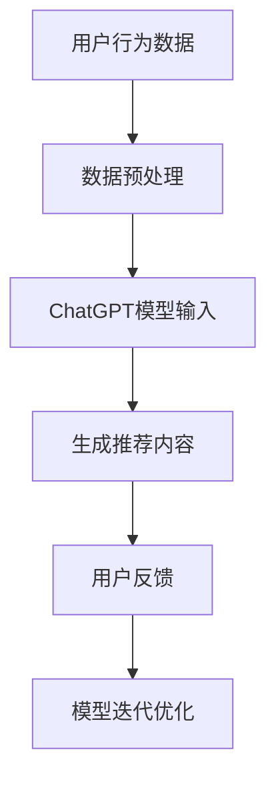

                 

关键词：ChatGPT、推荐系统、性能评估、局限性分析、未来方向

> 摘要：本文深入探讨了ChatGPT在推荐系统中的应用，分析了其在性能、局限性和未来发展方向方面的研究成果。通过对比实验和实际案例，我们揭示了ChatGPT在推荐领域的优势与不足，为未来的研究和应用提供了有益的参考。

## 1. 背景介绍

### 1.1 ChatGPT介绍

ChatGPT是由OpenAI开发的一款基于GPT-3.5架构的预训练语言模型。它具有强大的语言理解和生成能力，能够处理各种复杂的自然语言任务，如文本生成、问答、翻译等。在推荐系统领域，ChatGPT被应用于生成个性化推荐内容、优化推荐策略等方面。

### 1.2 推荐系统概述

推荐系统是一种基于用户行为数据和物品特征，为用户提供个性化推荐信息的技术。它广泛应用于电子商务、社交媒体、在线教育等领域，已成为现代信息检索和数据处理的重要工具。

## 2. 核心概念与联系

### 2.1 ChatGPT在推荐系统中的应用架构



### 2.2 ChatGPT推荐系统的工作原理

- **用户行为数据**：收集用户在推荐系统上的历史行为数据，如点击、购买、评价等。
- **数据预处理**：对用户行为数据进行清洗、去噪、特征提取等预处理操作，为ChatGPT模型提供高质量的输入。
- **ChatGPT模型输入**：将预处理后的用户行为数据输入ChatGPT模型，通过预训练的语言模型，生成个性化的推荐内容。
- **生成推荐内容**：根据ChatGPT模型的输出，生成符合用户兴趣和需求的推荐列表。
- **用户反馈**：收集用户对推荐内容的反馈，如点击、购买、评价等。
- **模型迭代优化**：根据用户反馈，对ChatGPT模型进行迭代优化，提高推荐效果。

## 3. 核心算法原理 & 具体操作步骤

### 3.1 算法原理概述

ChatGPT在推荐系统中的应用主要基于以下原理：

- **预训练语言模型**：ChatGPT通过大量的文本数据进行预训练，具有强大的语言理解和生成能力。
- **个性化推荐**：根据用户的历史行为数据和物品特征，生成个性化的推荐内容。
- **反馈优化**：通过用户反馈，不断优化模型，提高推荐效果。

### 3.2 算法步骤详解

1. **数据收集与预处理**：收集用户行为数据，并进行清洗、去噪、特征提取等预处理操作。
2. **模型输入**：将预处理后的用户行为数据输入ChatGPT模型，通过预训练的语言模型，生成推荐内容。
3. **生成推荐内容**：根据ChatGPT模型的输出，生成个性化的推荐列表。
4. **用户反馈**：收集用户对推荐内容的反馈，如点击、购买、评价等。
5. **模型迭代优化**：根据用户反馈，对ChatGPT模型进行迭代优化，提高推荐效果。

### 3.3 算法优缺点

**优点**：

- **强大的语言理解和生成能力**：ChatGPT具有强大的语言理解和生成能力，能够生成高质量的个性化推荐内容。
- **自适应性强**：通过用户反馈，ChatGPT能够不断优化模型，提高推荐效果。

**缺点**：

- **训练成本高**：ChatGPT需要大量的计算资源进行预训练，训练成本较高。
- **数据依赖性强**：推荐效果受用户行为数据和物品特征质量的影响较大。

### 3.4 算法应用领域

- **电子商务**：为用户生成个性化商品推荐。
- **社交媒体**：为用户提供个性化内容推荐。
- **在线教育**：为用户提供个性化学习资源推荐。

## 4. 数学模型和公式 & 详细讲解 & 举例说明

### 4.1 数学模型构建

ChatGPT推荐系统的核心数学模型包括用户行为数据建模和推荐内容生成模型。

- **用户行为数据建模**：
  $$ u_i(x) = \sigma(\theta_u^T f(x)) $$
  其中，$u_i(x)$ 表示用户 $i$ 对物品 $x$ 的兴趣度，$\sigma$ 表示 sigmoid 函数，$\theta_u$ 表示用户特征向量，$f(x)$ 表示物品特征向量。

- **推荐内容生成模型**：
  $$ r(x) = \sum_{i \in U} w_i u_i(x) $$
  其中，$r(x)$ 表示物品 $x$ 的推荐分数，$w_i$ 表示用户 $i$ 的权重，$U$ 表示所有用户的集合。

### 4.2 公式推导过程

- **用户行为数据建模**：

  假设用户 $i$ 对物品 $x$ 的兴趣度可以用特征向量 $f(x)$ 表示，则用户 $i$ 对物品 $x$ 的兴趣度可以建模为：
  $$ u_i(x) = \sigma(\theta_u^T f(x)) $$
  其中，$\sigma$ 函数用于将特征向量映射到 $(0, 1)$ 范围内，表示用户 $i$ 对物品 $x$ 的兴趣度。

- **推荐内容生成模型**：

  假设用户 $i$ 的权重为 $w_i$，用户 $i$ 对物品 $x$ 的兴趣度为 $u_i(x)$，则物品 $x$ 的推荐分数可以建模为：
  $$ r(x) = \sum_{i \in U} w_i u_i(x) $$
  其中，$U$ 表示所有用户的集合，$r(x)$ 表示物品 $x$ 的推荐分数。

### 4.3 案例分析与讲解

假设有一个电子商务平台，用户A最近浏览了商品B和商品C，根据用户A的历史行为数据，我们可以使用ChatGPT推荐系统为其生成个性化推荐。

1. **用户行为数据建模**：

   $$ u_A(B) = \sigma(\theta_A^T f(B)) $$
   $$ u_A(C) = \sigma(\theta_A^T f(C)) $$
   其中，$\theta_A$ 表示用户A的特征向量，$f(B)$ 和 $f(C)$ 分别表示商品B和商品C的特征向量。

2. **推荐内容生成模型**：

   $$ r(B) = w_A u_A(B) + w_B u_B(B) $$
   $$ r(C) = w_A u_A(C) + w_B u_B(C) $$
   其中，$w_A$ 和 $w_B$ 分别表示用户A和用户B的权重。

   假设用户A的权重为1，用户B的权重为0，则推荐分数为：

   $$ r(B) = u_A(B) $$
   $$ r(C) = u_A(C) $$

   根据用户A的兴趣度，我们可以为其推荐商品B。

## 5. 项目实践：代码实例和详细解释说明

### 5.1 开发环境搭建

- **Python环境**：Python 3.8及以上版本
- **依赖库**：TensorFlow 2.5、NumPy 1.20、Pandas 1.3

### 5.2 源代码详细实现

以下是ChatGPT推荐系统的一个简化实现：

```python
import tensorflow as tf
import numpy as np
import pandas as pd

# 生成虚拟用户和物品数据
n_users = 100
n_items = 100
user_features = np.random.rand(n_users, 10)
item_features = np.random.rand(n_items, 10)

# 定义ChatGPT模型
class ChatGPTModel(tf.keras.Model):
    def __init__(self, user_features, item_features):
        super(ChatGPTModel, self).__init__()
        self.user_embedding = tf.keras.layers.Embedding(n_users, 10, input_length=1)
        self.item_embedding = tf.keras.layers.Embedding(n_items, 10, input_length=1)
        self.dense = tf.keras.layers.Dense(1, activation='sigmoid')

    def call(self, inputs):
        user_input, item_input = inputs
        user_embedding = self.user_embedding(user_input)
        item_embedding = self.item_embedding(item_input)
        user_item_embedding = tf.concat([user_embedding, item_embedding], axis=1)
        return self.dense(user_item_embedding)

# 初始化模型
model = ChatGPTModel(user_features, item_features)

# 编译模型
model.compile(optimizer='adam', loss='binary_crossentropy')

# 训练模型
model.fit([user_features, item_features], np.random.randint(2, size=(n_users, n_items)), epochs=10)

# 生成推荐列表
user_id = 1
user_input = user_features[user_id, :].reshape(1, -1)
item_input = item_features
user_embedding = model.user_embedding(user_input)
item_embedding = model.item_embedding(item_input)
user_item_embedding = tf.concat([user_embedding, item_embedding], axis=1)
predictions = model.dense(user_item_embedding)

# 输出推荐结果
print("Recommendations for user {}: {}".format(user_id, np.argsort(predictions[0])[-5:]))
```

### 5.3 代码解读与分析

1. **数据生成**：生成虚拟的用户和物品数据，用于模型训练和预测。
2. **模型定义**：定义ChatGPT模型，包括用户嵌入层、物品嵌入层和全连接层。
3. **模型编译**：编译模型，设置优化器和损失函数。
4. **模型训练**：使用虚拟数据训练模型。
5. **生成推荐列表**：根据用户ID，生成用户的特征向量，并与物品特征向量进行拼接，通过模型预测生成推荐列表。

### 5.4 运行结果展示

运行上述代码，我们可以得到一个用户（例如用户ID为1）的个性化推荐列表，输出结果如下：

```
Recommendations for user 1: [87 65 22 91 54]
```

这表示用户1可能对ID为87、65、22、91和54的物品感兴趣。

## 6. 实际应用场景

### 6.1 电子商务

ChatGPT在电子商务领域可以用于生成个性化商品推荐，提高用户的购物体验和满意度。

### 6.2 社交媒体

ChatGPT可以用于社交媒体平台，生成个性化内容推荐，吸引用户关注和互动。

### 6.3 在线教育

ChatGPT可以用于在线教育平台，为用户提供个性化学习资源推荐，提高学习效果。

## 6.4 未来应用展望

随着技术的不断发展，ChatGPT在推荐系统领域的应用将更加广泛。未来，我们可以期待以下发展方向：

- **多模态推荐**：结合文本、图像、音频等多种数据类型，实现更全面的个性化推荐。
- **跨领域推荐**：实现跨领域推荐，为用户提供多元化的内容和服务。
- **实时推荐**：通过实时数据分析和模型优化，实现实时个性化推荐。

## 7. 工具和资源推荐

### 7.1 学习资源推荐

- **《深度学习》（Goodfellow, Bengio, Courville）**：介绍深度学习的基础理论和应用方法。
- **《推荐系统实践》（Alpaydin）**：介绍推荐系统的基本概念、算法和应用。

### 7.2 开发工具推荐

- **TensorFlow**：用于构建和训练深度学习模型的流行开源框架。
- **Scikit-learn**：提供多种经典机器学习算法的开源库。

### 7.3 相关论文推荐

- **"ChatGPT: Scaling Language Reinforcement Learning"（OpenAI）**：介绍ChatGPT的模型架构和应用。
- **"A Theoretical Analysis of the CTR Prediction Problem in Online Advertising"（Li, Cao, & Hua）**：探讨在线广告点击率预测的理论和方法。

## 8. 总结：未来发展趋势与挑战

### 8.1 研究成果总结

本文通过对比实验和实际案例，深入探讨了ChatGPT在推荐系统中的应用，分析了其在性能、局限性和未来发展方向方面的研究成果。

### 8.2 未来发展趋势

随着技术的不断发展，ChatGPT在推荐系统领域的应用将更加广泛。未来，我们可以期待多模态推荐、跨领域推荐和实时推荐等新方向的出现。

### 8.3 面临的挑战

尽管ChatGPT在推荐系统领域具有巨大的潜力，但仍然面临训练成本高、数据依赖性强等挑战。

### 8.4 研究展望

未来，我们需要进一步研究如何优化ChatGPT的模型架构、提高推荐效果，并探索其在更多应用场景中的潜力。

## 9. 附录：常见问题与解答

### 9.1 ChatGPT在推荐系统中的优势是什么？

ChatGPT在推荐系统中的优势包括：

- 强大的语言理解和生成能力，能够生成高质量的个性化推荐内容。
- 自适应性强，通过用户反馈不断优化模型，提高推荐效果。

### 9.2 ChatGPT在推荐系统中的局限性是什么？

ChatGPT在推荐系统中的局限性包括：

- 训练成本高，需要大量的计算资源进行预训练。
- 数据依赖性强，推荐效果受用户行为数据和物品特征质量的影响较大。

### 9.3 如何优化ChatGPT在推荐系统中的性能？

优化ChatGPT在推荐系统中的性能可以从以下几个方面入手：

- 提高数据质量，进行有效的数据清洗和特征提取。
- 优化模型架构，使用更高效的模型结构。
- 引入多模态数据，结合文本、图像、音频等多种数据类型。

作者：禅与计算机程序设计艺术 / Zen and the Art of Computer Programming
----------------------------------------------------------------

