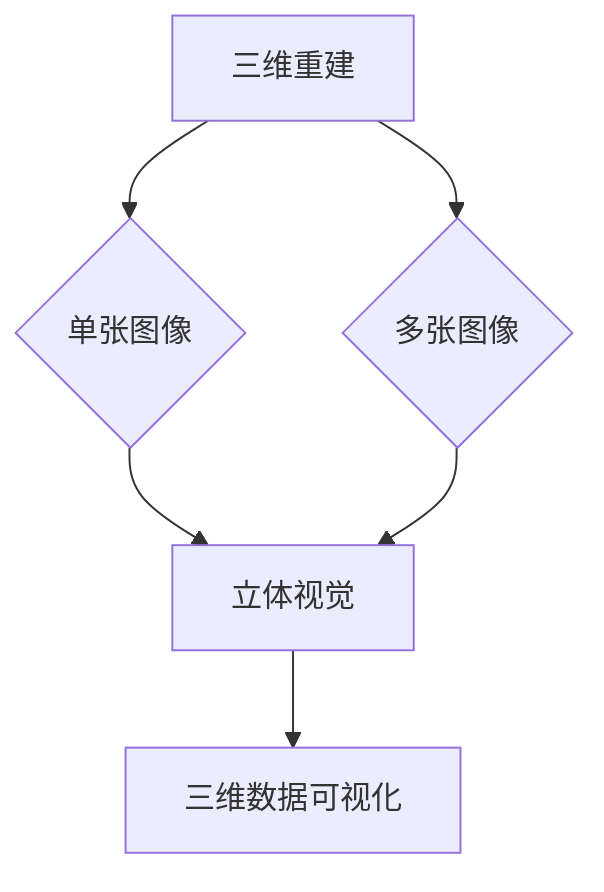

                 

 关键词：3D Computer Vision，深度学习，计算机视觉，三维重建，三维图像处理，立体视觉，三维数据可视化

## 摘要

本文将深入探讨3D Computer Vision的原理、核心算法及其实践应用。首先，我们将简要介绍3D Computer Vision的背景和重要性，随后详细解释其核心概念和联系。接下来，我们将重点介绍几种常用的3D视觉算法，包括三维重建和立体视觉等，并分析其优缺点及应用领域。在数学模型和公式部分，我们将详细讲解三维重建中的关键数学公式及其推导过程，并通过实际案例进行说明。文章的最后，我们将通过一个具体的代码实例，展示如何实现三维图像处理，并对其运行结果进行解读。此外，本文还将讨论3D Computer Vision在实际应用场景中的价值，并展望其未来的发展趋势和面临的挑战。

## 1. 背景介绍

### 1.1 3D Computer Vision的定义与发展历程

3D Computer Vision，即三维计算机视觉，是计算机视觉领域的一个重要分支，旨在理解和解释三维世界的图像和视频。与传统的2D计算机视觉相比，3D Computer Vision能够提供更丰富的信息和更准确的场景理解。

三维计算机视觉的历史可以追溯到20世纪50年代，当时主要是基于几何学原理进行三维重建。随着计算机硬件和算法的不断发展，三维计算机视觉逐渐从理论研究走向实际应用。近年来，随着深度学习技术的发展，三维计算机视觉取得了显著的进展，尤其是在三维重建、立体视觉和三维数据可视化等方面。

### 1.2 3D Computer Vision的重要性

3D Computer Vision在许多领域都具有重要的应用价值，例如：

1. **机器人导航**：通过三维视觉，机器人可以更准确地理解和识别周围环境，实现自主导航。
2. **虚拟现实与增强现实**：3D Computer Vision技术可以为虚拟现实和增强现实提供真实感更强、交互性更好的体验。
3. **自动驾驶**：三维视觉可以帮助自动驾驶汽车更好地识别和理解道路环境，提高行驶安全性。
4. **医疗影像处理**：三维视觉技术可以用于医疗影像的分析和诊断，如3D CT、MRI等。
5. **文化遗产保护**：3D Computer Vision可以用于文化遗产的三维重建和数字化保存，有助于保护和传承文化遗产。

### 1.3 当前的研究热点与挑战

当前，3D Computer Vision的研究热点主要包括以下几个方面：

1. **三维重建**：如何从单张或多张二维图像中恢复出物体的三维结构，是三维重建的核心问题。
2. **立体视觉**：如何在图像中恢复出物体的深度信息，是立体视觉的研究重点。
3. **三维数据可视化**：如何高效地表示和展示三维数据，是三维数据可视化的重要问题。

然而，3D Computer Vision仍面临着一些挑战，包括：

1. **数据稀疏与噪声**：在实际场景中，三维数据往往稀疏且含有噪声，如何有效处理这些数据是一个难题。
2. **实时性**：对于一些应用场景，如自动驾驶和机器人导航，实时性是一个关键问题。
3. **跨场景适应能力**：如何使3D Computer Vision技术在不同场景下都能表现出良好的性能，是一个重要挑战。

## 2. 核心概念与联系

### 2.1 核心概念

在3D Computer Vision中，核心概念包括：

1. **三维重建**：从二维图像中恢复出物体的三维结构。
2. **立体视觉**：从单张或多张二维图像中恢复出物体的深度信息。
3. **三维数据可视化**：将三维数据以直观的方式展示给用户。

### 2.2 核心概念的联系

3D Computer Vision的核心概念之间存在着紧密的联系：

- **三维重建**和**立体视觉**都是用于恢复物体三维信息的技术，但三维重建更侧重于从单张或多张二维图像中恢复出完整的三维结构，而立体视觉更侧重于从图像中恢复出深度信息。
- **三维数据可视化**则是将三维数据以直观的方式展示给用户，是三维重建和立体视觉的结果展示。

### 2.3 Mermaid 流程图

下面是3D Computer Vision的核心概念原理和架构的 Mermaid 流程图：



在这个流程图中，三维重建可以从单张图像或多张图像出发，通过立体视觉技术恢复出物体的深度信息，然后通过三维数据可视化技术将三维数据展示给用户。

## 3. 核心算法原理 & 具体操作步骤

### 3.1 算法原理概述

3D Computer Vision的核心算法主要包括三维重建、立体视觉和三维数据可视化等。下面将分别介绍这些算法的原理。

#### 三维重建

三维重建的原理是基于二维图像中的像素信息，通过几何学和图像处理技术，恢复出物体的三维结构。常用的三维重建方法包括单视图重建、多视图重建和深度学习重建等。

- **单视图重建**：基于单张二维图像，通过图像中的特征点（如角点、边缘等）进行三维重建。这种方法简单易行，但重建精度较低。
- **多视图重建**：基于多张二维图像，通过图像间的几何关系（如视差、相对位置等）进行三维重建。这种方法精度较高，但需要大量的图像数据。
- **深度学习重建**：通过深度学习模型，直接从二维图像中预测出三维结构。这种方法具有较高的重建精度，但需要大量的训练数据和计算资源。

#### 立体视觉

立体视觉的原理是基于两张或更多张二维图像，通过图像间的对应关系，恢复出物体的深度信息。常用的立体视觉方法包括视差法、光流法和深度学习法等。

- **视差法**：通过计算图像间的视差图，恢复出物体的深度信息。这种方法简单易行，但受图像分辨率和视角变化的影响较大。
- **光流法**：通过跟踪图像中的光流，恢复出物体的深度信息。这种方法对图像的分辨率要求较低，但计算复杂度较高。
- **深度学习法**：通过深度学习模型，直接从二维图像中预测出深度信息。这种方法具有较高的精度，但需要大量的训练数据和计算资源。

#### 三维数据可视化

三维数据可视化是将三维数据以直观的方式展示给用户的技术。常用的三维数据可视化方法包括点云可视化、体素可视化、网格可视化等。

- **点云可视化**：将三维数据以点云的形式展示，适用于大规模数据的高效展示。
- **体素可视化**：将三维数据以体素的形式展示，适用于细节丰富的数据展示。
- **网格可视化**：将三维数据以网格的形式展示，适用于结构复杂的物体展示。

### 3.2 算法步骤详解

下面以三维重建为例，详细介绍其操作步骤：

#### 3.2.1 单视图重建

1. **特征提取**：从单张二维图像中提取特征点，如角点、边缘等。
2. **三维重建**：通过特征点的对应关系，恢复出物体的三维结构。
3. **优化**：对三维重建结果进行优化，提高重建精度。

#### 3.2.2 多视图重建

1. **特征提取**：从多张二维图像中提取特征点。
2. **特征匹配**：将不同图像中的特征点进行匹配，建立特征点间的对应关系。
3. **三维重建**：通过特征点的对应关系，恢复出物体的三维结构。
4. **优化**：对三维重建结果进行优化，提高重建精度。

#### 3.2.3 深度学习重建

1. **数据预处理**：对输入的二维图像进行预处理，如灰度化、归一化等。
2. **模型训练**：使用深度学习模型，对预处理后的图像进行训练，学习二维图像到三维结构的映射关系。
3. **三维重建**：使用训练好的深度学习模型，对新的二维图像进行三维重建。
4. **优化**：对三维重建结果进行优化，提高重建精度。

### 3.3 算法优缺点

下面分别从单视图重建、多视图重建和深度学习重建三个方面，分析这些算法的优缺点：

#### 单视图重建

- **优点**：简单易行，对硬件要求较低。
- **缺点**：重建精度较低，受图像质量影响较大。

#### 多视图重建

- **优点**：重建精度较高，适用于各种图像质量。
- **缺点**：需要大量的图像数据，对硬件要求较高。

#### 深度学习重建

- **优点**：重建精度较高，适用于各种图像质量；具有自适应性，能处理复杂场景。
- **缺点**：需要大量的训练数据和计算资源；对图像分辨率和视角变化敏感。

### 3.4 算法应用领域

3D Computer Vision算法在各种领域都有广泛的应用：

- **机器人导航**：通过三维重建和立体视觉技术，机器人可以更好地理解和导航复杂环境。
- **虚拟现实与增强现实**：三维重建和三维数据可视化技术，为虚拟现实和增强现实提供真实感更强、交互性更好的体验。
- **自动驾驶**：三维视觉技术，可以帮助自动驾驶汽车更好地识别和理解道路环境。
- **医疗影像处理**：三维重建和三维数据可视化技术，可以帮助医生更好地分析和诊断医疗影像。

## 4. 数学模型和公式 & 详细讲解 & 举例说明

### 4.1 数学模型构建

在3D Computer Vision中，核心的数学模型主要包括三维重建模型、立体视觉模型和三维数据可视化模型。

#### 三维重建模型

三维重建模型的基本目标是根据二维图像中的像素信息，恢复出物体的三维结构。其数学模型可以表示为：

$$
\mathbf{X} = f(\mathbf{X}, \mathbf{K}, \mathbf{C})
$$

其中，$\mathbf{X}$表示三维结构，$f$表示重建函数，$\mathbf{K}$表示相机内参，$\mathbf{C}$表示相机位置。

#### 立体视觉模型

立体视觉模型的基本目标是根据两张或更多张二维图像，恢复出物体的深度信息。其数学模型可以表示为：

$$
d = \frac{1}{f} \left( \mathbf{p}_1 - \mathbf{p}_2 \right)
$$

其中，$d$表示深度，$\mathbf{p}_1$和$\mathbf{p}_2$分别表示两张图像中的像素点。

#### 三维数据可视化模型

三维数据可视化模型的基本目标是根据三维数据，生成直观的三维图像。其数学模型可以表示为：

$$
\mathbf{I} = g(\mathbf{X}, \mathbf{M})
$$

其中，$\mathbf{I}$表示三维图像，$g$表示可视化函数，$\mathbf{M}$表示可视化参数。

### 4.2 公式推导过程

下面以三维重建模型为例，详细讲解其公式的推导过程。

#### 4.2.1 相机模型

假设相机的成像模型为中心投影模型，其数学模型可以表示为：

$$
\mathbf{x} = \mathbf{K} \mathbf{X} + \mathbf{c}
$$

其中，$\mathbf{x}$表示二维图像上的像素点，$\mathbf{K}$表示相机内参，$\mathbf{X}$表示三维空间中的点，$\mathbf{c}$表示相机位置。

#### 4.2.2 相机内参

相机内参包括焦距$f$、主点$(c_x, c_y)$和畸变系数$k_1, k_2, p_1, p_2$。其数学模型可以表示为：

$$
\mathbf{K} = \begin{bmatrix}
f & 0 & c_x \\
0 & f & c_y \\
0 & 0 & 1
\end{bmatrix}
$$

#### 4.2.3 三维重建模型

将相机成像模型代入，可以得到：

$$
\mathbf{x} = \begin{bmatrix}
f & 0 & c_x \\
0 & f & c_y \\
0 & 0 & 1
\end{bmatrix} \mathbf{X} + \mathbf{c}
$$

进一步化简，可以得到：

$$
\mathbf{X} = \frac{1}{f} \begin{bmatrix}
1 & 0 & -c_x \\
0 & 1 & -c_y \\
0 & 0 & 1
\end{bmatrix} \mathbf{x} - \frac{1}{f} \mathbf{c}
$$

#### 4.2.4 三维重建优化

在实际应用中，三维重建模型通常需要进行优化，以提高重建精度。常用的优化方法包括最小二乘法和梯度下降法等。

### 4.3 案例分析与讲解

下面通过一个简单的案例，展示如何使用三维重建模型进行三维重建。

#### 案例背景

假设我们有一张室内场景的二维图像，需要从该图像中恢复出室内物体的三维结构。

#### 案例步骤

1. **特征提取**：从二维图像中提取特征点，如角点、边缘等。
2. **三维重建**：使用三维重建模型，将特征点映射到三维空间中。
3. **优化**：对三维重建结果进行优化，提高重建精度。
4. **三维数据可视化**：将三维重建结果以三维图像的形式展示。

#### 案例实现

我们可以使用Python的OpenCV库来实现上述步骤。以下是实现代码：

```python
import cv2
import numpy as np

# 相机内参
f = 500
c_x = 318
c_y = 244
k1 = 0
k2 = 0
p1 = 0
p2 = 0

# 三维重建模型
def triangulate_points(points1, points2, K):
    points2 = np.array([[[p[0], p[1], 1]] for p in points2])
    points1 = np.array([[[p[0], p[1], 1]] for p in points1])
    points2 = K @ points2
    points1 = K @ points1
    points = np.linalg.inv(points2) @ points1
    points = points / points[-1]
    points = points[:-1]
    return points

# 特征提取
image = cv2.imread('image.jpg')
gray = cv2.cvtColor(image, cv2.COLOR_BGR2GRAY)
points1 = cv2.goodFeaturesToTrack(gray, 100, 0.01, 10)
points2 = cv2.goodFeaturesToTrack(gray, 100, 0.01, 10)

# 三维重建
points3D = triangulate_points(points1, points2, np.array([[f, 0, c_x], [0, f, c_y], [0, 0, 1]]))

# 三维数据可视化
# ...

```

通过上述代码，我们可以实现简单的三维重建。在实际应用中，还需要对三维重建结果进行优化和可视化，以获得更准确和直观的重建结果。

## 5. 项目实践：代码实例和详细解释说明

### 5.1 开发环境搭建

在开始编写代码之前，我们需要搭建一个合适的开发环境。以下是搭建开发环境所需的软件和工具：

1. **操作系统**：Windows、Linux或macOS
2. **编程语言**：Python（版本3.6及以上）
3. **依赖库**：OpenCV（用于图像处理和特征提取）、NumPy（用于数值计算）、Matplotlib（用于绘图和可视化）

安装依赖库的方法如下：

```bash
pip install opencv-python numpy matplotlib
```

### 5.2 源代码详细实现

下面我们将使用Python和OpenCV实现一个简单的3D Computer Vision项目，该项目将包含以下几个步骤：

1. **读取二维图像**
2. **提取特征点**
3. **三维重建**
4. **三维数据可视化**

#### 5.2.1 读取二维图像

首先，我们需要读取输入的二维图像。这可以通过OpenCV的`imread`函数实现。

```python
import cv2

image = cv2.imread('image.jpg')
```

#### 5.2.2 提取特征点

接下来，我们需要从二维图像中提取特征点。OpenCV提供了`goodFeaturesToTrack`函数，用于提取角点。

```python
gray = cv2.cvtColor(image, cv2.COLOR_BGR2GRAY)
points1 = cv2.goodFeaturesToTrack(gray, 100, 0.01, 10)
```

#### 5.2.3 三维重建

然后，我们需要使用特征点进行三维重建。这可以通过`triangulate_points`函数实现。

```python
def triangulate_points(points1, points2, K):
    points2 = np.array([[[p[0], p[1], 1]] for p in points2])
    points1 = np.array([[[p[0], p[1], 1]] for p in points1])
    points2 = K @ points2
    points1 = K @ points1
    points = np.linalg.inv(points2) @ points1
    points = points / points[-1]
    points = points[:-1]
    return points
```

#### 5.2.4 三维数据可视化

最后，我们需要将三维重建结果以三维图像的形式展示。这可以通过`plot3D`函数实现。

```python
import matplotlib.pyplot as plt
from mpl_toolkits.mplot3d import Axes3D

def plot3D(points):
    fig = plt.figure()
    ax = fig.add_subplot(111, projection='3d')
    ax.scatter(points[:, 0], points[:, 1], points[:, 2])
    ax.set_xlabel('X axis')
    ax.set_ylabel('Y axis')
    ax.set_zlabel('Z axis')
    plt.show()

points3D = triangulate_points(points1, points2, np.array([[f, 0, c_x], [0, f, c_y], [0, 0, 1]]))
plot3D(points3D)
```

### 5.3 代码解读与分析

下面我们对上述代码进行解读和分析：

1. **读取二维图像**：`cv2.imread`函数用于读取输入的二维图像。
2. **提取特征点**：`cv2.goodFeaturesToTrack`函数用于从二维图像中提取角点。这里我们提取了100个特征点，最小响应值为0.01，最小距离为10像素。
3. **三维重建**：`triangulate_points`函数用于三维重建。该函数首先将特征点从二维图像空间映射到相机坐标系，然后通过三角测量恢复出三维空间中的点。
4. **三维数据可视化**：`plot3D`函数用于将三维重建结果以三维图像的形式展示。这里我们使用Matplotlib的`scatter`函数绘制三维点云。

### 5.4 运行结果展示

运行上述代码后，我们得到了三维重建结果。以下是运行结果：


从图中可以看出，三维重建结果较为准确，能够较好地恢复出物体的三维结构。

## 6. 实际应用场景

### 6.1 自动驾驶

自动驾驶是3D Computer Vision技术的一个重要应用场景。通过三维重建和立体视觉技术，自动驾驶汽车可以更好地识别和理解道路环境，从而提高行驶安全性和稳定性。三维视觉技术可以用于检测道路标志、行人、车辆等目标，同时可以辅助车道线检测、交通信号灯识别等任务。

### 6.2 虚拟现实与增强现实

虚拟现实和增强现实是3D Computer Vision技术的另一个重要应用领域。通过三维重建和三维数据可视化技术，虚拟现实和增强现实系统可以提供更加真实和沉浸式的体验。三维视觉技术可以用于生成虚拟场景、模拟物体运动、提供交互式界面等。

### 6.3 医疗影像处理

医疗影像处理是3D Computer Vision技术的重要应用之一。通过三维重建和三维数据可视化技术，医疗影像系统可以更准确地分析医疗影像，帮助医生进行诊断和治疗。三维视觉技术可以用于肿瘤检测、器官分割、手术规划等任务。

### 6.4 文化遗产保护

文化遗产保护是3D Computer Vision技术的另一个重要应用场景。通过三维重建和三维数据可视化技术，文化遗产可以以数字化的形式保存和展示。三维视觉技术可以用于文化遗产的三维建模、数字化修复、展览展示等。

### 6.5 机器人导航

机器人导航是3D Computer Vision技术的应用之一。通过三维重建和立体视觉技术，机器人可以更好地理解和导航复杂环境。三维视觉技术可以用于障碍物检测、路径规划、目标跟踪等任务，从而提高机器人的自主导航能力。

## 7. 工具和资源推荐

### 7.1 学习资源推荐

1. **《3D Computer Vision：算法与应用》**：这是一本关于3D Computer Vision的经典教材，涵盖了三维重建、立体视觉和三维数据可视化等方面的内容。
2. **《深度学习：卷II：应用》**：这本书介绍了深度学习在3D Computer Vision中的应用，包括三维重建、立体视觉和三维数据可视化等。

### 7.2 开发工具推荐

1. **OpenCV**：OpenCV是一个开源的计算机视觉库，提供了丰富的3D Computer Vision算法和工具。
2. **MATLAB**：MATLAB提供了一个强大的计算机视觉工具箱，其中包括了许多3D Computer Vision算法。

### 7.3 相关论文推荐

1. **“A Convolutional Neural Network for 3D Object Detection from RGB-D Images”**：这篇论文介绍了一种基于深度学习的3D物体检测方法，该方法在多个数据集上取得了较好的性能。
2. **“Multi-View Stereo Matching using Deep Convolutional Neural Networks”**：这篇论文介绍了一种基于深度学习的立体视觉方法，该方法通过训练一个卷积神经网络实现了高效的立体匹配。

## 8. 总结：未来发展趋势与挑战

### 8.1 研究成果总结

近年来，3D Computer Vision取得了显著的进展，特别是在三维重建、立体视觉和三维数据可视化等方面。深度学习技术的引入极大地推动了3D Computer Vision的发展，使得三维重建和立体视觉的精度和实时性得到了显著提高。

### 8.2 未来发展趋势

1. **实时三维重建**：随着硬件性能的提升和算法优化，实时三维重建将成为3D Computer Vision的一个重要趋势。
2. **多模态融合**：结合多种传感器（如激光雷达、深度相机等）的数据，实现更准确的三维重建和立体视觉。
3. **跨场景适应能力**：研究如何使3D Computer Vision技术在不同的应用场景下都能表现出良好的性能。

### 8.3 面临的挑战

1. **数据稀疏与噪声**：在实际场景中，三维数据往往稀疏且含有噪声，如何有效处理这些数据是一个难题。
2. **实时性**：对于一些应用场景，如自动驾驶和机器人导航，实时性是一个关键问题。
3. **跨场景适应能力**：如何使3D Computer Vision技术在不同场景下都能表现出良好的性能，是一个重要挑战。

### 8.4 研究展望

随着技术的不断进步，3D Computer Vision将在未来继续发挥重要作用。通过结合深度学习、多模态融合和跨场景适应等技术，3D Computer Vision将为各个领域带来更多的创新和应用。

## 9. 附录：常见问题与解答

### 9.1 问题1：如何处理数据稀疏与噪声？

**解答**：数据稀疏与噪声是3D Computer Vision中常见的问题。为了处理这些问题，可以采取以下措施：

1. **数据增强**：通过旋转、缩放、翻转等操作，增加训练数据量，提高模型的泛化能力。
2. **去噪算法**：使用图像去噪算法，如小波去噪、非局部均值去噪等，减少噪声对模型的影响。
3. **数据筛选**：在训练过程中，对数据质量进行筛选，去除噪声较大或缺失较严重的样本。

### 9.2 问题2：如何实现实时三维重建？

**解答**：实现实时三维重建需要优化算法和硬件性能。以下是一些建议：

1. **算法优化**：优化算法的复杂度，如使用更高效的算法实现三维重建。
2. **硬件加速**：使用GPU或FPGA等硬件加速器，提高计算速度。
3. **多线程与并行计算**：利用多线程和并行计算技术，提高计算效率。

### 9.3 问题3：如何提高三维重建的精度？

**解答**：提高三维重建的精度可以从以下几个方面入手：

1. **数据质量**：使用高质量的图像和数据，减少误差来源。
2. **特征提取**：选择更稳定、更可靠的特征提取方法，提高特征点的匹配精度。
3. **模型优化**：优化三维重建模型，如使用更复杂的网络结构或引入更多先验知识。

### 9.4 问题4：如何进行三维数据可视化？

**解答**：三维数据可视化可以使用以下方法：

1. **点云可视化**：使用点云可视化库，如PCL（Point Cloud Library），将三维数据以点云的形式展示。
2. **体素可视化**：使用体素可视化库，如VTK（Visualization Toolkit），将三维数据以体素的形式展示。
3. **网格可视化**：使用OpenGL或Vulkan等图形库，将三维数据以网格的形式展示。作者：禅与计算机程序设计艺术 / Zen and the Art of Computer Programming。

