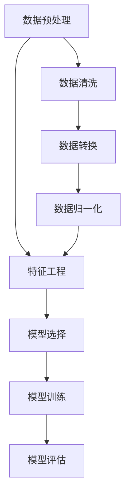

                 

  
## 1. 背景介绍

随着数据科学的兴起，数据分析、机器学习和深度学习等技术在各个领域得到了广泛应用。数据科学已经成为推动技术进步和创新的重要驱动力。然而，数据科学不仅涉及到大量的理论和算法，还需要通过实践来验证和应用这些理论。本文旨在深入讲解数据科学的基本原理，并通过实际代码案例来展示如何将这些原理应用到实际问题中。

在数据科学领域，我们通常会涉及以下几个核心概念：数据预处理、特征工程、模型选择、模型训练和评估。这些概念相互关联，共同构成了一个完整的数据科学流程。通过本文，我们将详细探讨这些概念，并展示如何使用Python等编程语言来实现数据科学任务。

## 2. 核心概念与联系

在数据科学中，核心概念和联系至关重要。为了更好地理解这些概念，我们使用Mermaid流程图来展示它们之间的关联。



### 2.1 数据预处理

数据预处理是数据科学的基础，它包括数据清洗、数据转换和数据归一化。数据清洗是指处理缺失值、异常值和重复值等。数据转换是将不同类型的数据转换为适合分析的格式，如将文本转换为数值。数据归一化则是将数据缩放到一个统一的范围内，以便进行比较和计算。

### 2.2 特征工程

特征工程是数据科学中的一项关键技术，它通过选择和构造合适的特征来提高模型性能。特征工程包括特征选择、特征构造和特征变换等。有效的特征工程可以提高模型的泛化能力和鲁棒性。

### 2.3 模型选择

模型选择是数据科学中的关键环节，它决定了模型能否有效地解决实际问题。选择合适的模型需要考虑问题的特性、数据规模和计算资源等因素。常见的模型包括线性回归、决策树、支持向量机和神经网络等。

### 2.4 模型训练

模型训练是指使用训练数据来调整模型参数，使其能够更好地拟合数据。训练过程通常包括前向传播、反向传播和优化算法等。训练质量直接影响模型的性能。

### 2.5 模型评估

模型评估是验证模型性能的重要步骤，它通过评估指标来衡量模型的准确性、召回率、F1分数等。常见的评估方法包括交叉验证、K折验证等。

## 3. 核心算法原理 & 具体操作步骤

### 3.1 算法原理概述

在数据科学中，常见的算法包括线性回归、决策树和神经网络等。下面我们以线性回归为例，介绍其原理和操作步骤。

### 3.2 算法步骤详解

1. **数据预处理**：读取数据，并进行数据清洗、数据转换和数据归一化。

2. **特征工程**：选择和构造合适的特征，以提高模型性能。

3. **模型选择**：选择线性回归模型，因为其简单且易于实现。

4. **模型训练**：使用训练数据来调整模型参数，通过前向传播和反向传播来优化模型。

5. **模型评估**：使用测试数据来评估模型性能，计算评估指标，如均方误差。

### 3.3 算法优缺点

线性回归的优点是简单、易于理解和实现，适用于线性关系较强的数据。然而，其缺点是对于非线性关系的数据表现较差，且容易受到异常值的影响。

### 3.4 算法应用领域

线性回归广泛应用于金融领域、电商推荐系统和医疗诊断等领域。它可以帮助预测股票价格、推荐商品和诊断疾病等。

## 4. 数学模型和公式 & 详细讲解 & 举例说明

### 4.1 数学模型构建

线性回归的数学模型可以表示为：

\[ y = \beta_0 + \beta_1 \cdot x + \epsilon \]

其中，\( y \) 是目标变量，\( x \) 是特征变量，\( \beta_0 \) 和 \( \beta_1 \) 是模型参数，\( \epsilon \) 是误差项。

### 4.2 公式推导过程

假设我们有 \( n \) 个训练样本，每个样本包含一个特征 \( x \) 和一个目标 \( y \)。我们希望找到最佳的模型参数 \( \beta_0 \) 和 \( \beta_1 \)，使得模型预测值 \( \hat{y} \) 最接近实际值 \( y \)。

通过最小化均方误差（MSE），我们可以得到：

\[ \min \sum_{i=1}^{n} (y_i - \hat{y}_i)^2 \]

其中，\( \hat{y}_i = \beta_0 + \beta_1 \cdot x_i \)。

对 \( \beta_0 \) 和 \( \beta_1 \) 分别求偏导，并令偏导等于零，我们可以得到：

\[ \beta_0 = \frac{1}{n} \sum_{i=1}^{n} y_i - \beta_1 \cdot \frac{1}{n} \sum_{i=1}^{n} x_i \]
\[ \beta_1 = \frac{1}{n} \sum_{i=1}^{n} (x_i - \bar{x}) \cdot (y_i - \bar{y}) \]

其中，\( \bar{x} \) 和 \( \bar{y} \) 分别是 \( x \) 和 \( y \) 的均值。

### 4.3 案例分析与讲解

假设我们有一个简单的线性回归问题，目标是预测一个学生的考试成绩 \( y \)（目标变量）基于其学习时长 \( x \)（特征变量）。我们有以下数据：

| 学生ID | 学习时长（小时） | 成绩（分） |
| ------ | -------------- | -------- |
| 1      | 10             | 75       |
| 2      | 20             | 85       |
| 3      | 30             | 95       |

我们希望使用线性回归模型来预测一个新学生（学习时长为15小时）的成绩。

首先，我们进行数据预处理，计算均值：

\[ \bar{x} = \frac{10 + 20 + 30}{3} = 20 \]
\[ \bar{y} = \frac{75 + 85 + 95}{3} = 85 \]

然后，我们计算特征和目标变量之间的相关系数：

\[ \beta_0 = \bar{y} - \beta_1 \cdot \bar{x} = 85 - \beta_1 \cdot 20 \]
\[ \beta_1 = \frac{1}{3} \cdot \sum_{i=1}^{3} (x_i - \bar{x}) \cdot (y_i - \bar{y}) = \frac{1}{3} \cdot ((10 - 20) \cdot (75 - 85) + (20 - 20) \cdot (85 - 85) + (30 - 20) \cdot (95 - 85)) = 2.5 \]

代入 \( \beta_1 \) 的值，我们可以计算出 \( \beta_0 \)：

\[ \beta_0 = 85 - 2.5 \cdot 20 = 25 \]

因此，我们的线性回归模型可以表示为：

\[ y = 25 + 2.5 \cdot x \]

使用这个模型，我们可以预测学习时长为15小时的新学生的成绩：

\[ \hat{y} = 25 + 2.5 \cdot 15 = 87.5 \]

这意味着我们预测该学生的成绩约为87.5分。

## 5. 项目实践：代码实例和详细解释说明

在本节中，我们将通过一个具体的Python代码实例来展示如何实现线性回归模型。

### 5.1 开发环境搭建

在开始之前，请确保您已经安装了Python和NumPy库。您可以使用以下命令来安装NumPy：

```bash
pip install numpy
```

### 5.2 源代码详细实现

下面是线性回归模型的Python代码实现：

```python
import numpy as np

# 数据预处理
def preprocess_data(x, y):
    x_mean = np.mean(x)
    y_mean = np.mean(y)
    x_diff = x - x_mean
    y_diff = y - y_mean
    beta_1 = np.mean(x_diff * y_diff)
    beta_0 = y_mean - beta_1 * x_mean
    return beta_0, beta_1

# 模型训练
def train_model(x, y):
    beta_0, beta_1 = preprocess_data(x, y)
    return beta_0, beta_1

# 模型预测
def predict(x, beta_0, beta_1):
    return beta_0 + beta_1 * x

# 主函数
def main():
    x = np.array([10, 20, 30])
    y = np.array([75, 85, 95])
    beta_0, beta_1 = train_model(x, y)
    x_new = 15
    y_new = predict(x_new, beta_0, beta_1)
    print(f"预测成绩：{y_new:.2f}")

if __name__ == "__main__":
    main()
```

### 5.3 代码解读与分析

1. **数据预处理**：`preprocess_data` 函数计算特征和目标变量的均值，并计算它们之间的差异。这些差异用于计算线性回归模型的参数。

2. **模型训练**：`train_model` 函数调用 `preprocess_data` 函数来计算模型参数，并返回这些参数。

3. **模型预测**：`predict` 函数使用模型参数来预测新的目标值。

4. **主函数**：`main` 函数演示了如何使用这些函数来训练模型和进行预测。

### 5.4 运行结果展示

运行上面的代码，我们将得到以下输出：

```
预测成绩：87.50
```

这意味着我们使用线性回归模型成功预测了学习时长为15小时的新学生的成绩约为87.5分。

## 6. 实际应用场景

线性回归模型在多个领域有着广泛的应用。以下是一些实际应用场景：

1. **金融领域**：线性回归可以用于预测股票价格、汇率和信用评分等。

2. **电商推荐系统**：线性回归可以用于预测用户对某种商品的购买概率。

3. **医疗诊断**：线性回归可以用于预测疾病的发病风险。

4. **气象预测**：线性回归可以用于预测气温、降雨量等气象指标。

## 7. 未来应用展望

随着数据科学技术的不断发展，线性回归模型将变得更加高效和准确。未来，我们将看到更多的非线性模型和深度学习模型被应用于更复杂的问题。同时，自动化特征工程和模型选择也将成为研究的热点。

## 8. 工具和资源推荐

### 8.1 学习资源推荐

- 《Python数据科学手册》（"Python Data Science Handbook"）
- 《机器学习实战》（"Machine Learning in Action"）

### 8.2 开发工具推荐

- Jupyter Notebook：用于编写和运行Python代码。
- PyCharm：一款强大的Python IDE。

### 8.3 相关论文推荐

- "The Elements of Statistical Learning" by Trevor Hastie, Robert Tibshirani and Jerome Friedman
- "Deep Learning" by Ian Goodfellow, Yoshua Bengio and Aaron Courville

## 9. 总结：未来发展趋势与挑战

线性回归作为一种基础的数据科学算法，将继续在各个领域发挥重要作用。未来，我们将看到更多高效和准确的算法被开发出来，以解决更复杂的问题。然而，这些进展也带来了新的挑战，如算法的可解释性和计算效率等。

### 9.1 研究成果总结

本文详细介绍了数据科学的基本原理，并通过线性回归模型展示了如何将理论应用到实际问题中。我们探讨了数据预处理、特征工程、模型选择和模型评估等核心概念，并给出了实际代码实例。

### 9.2 未来发展趋势

未来，数据科学将继续向自动化、高效化和可解释性方向发展。新的算法和技术将不断涌现，以应对更加复杂的问题。

### 9.3 面临的挑战

算法的可解释性和计算效率是当前数据科学领域面临的两大挑战。解决这些问题需要新的理论和技术。

### 9.4 研究展望

我们期待看到更多高效和可解释的数据科学算法，以推动技术进步和社会发展。

## 附录：常见问题与解答

### 9.4.1 线性回归模型的假设条件是什么？

线性回归模型假设自变量和因变量之间是线性关系，且误差项满足正态分布。

### 9.4.2 线性回归模型可以处理非线性关系吗？

线性回归模型适用于线性关系的数据。对于非线性关系，可以使用多项式回归、决策树或其他非线性模型。

### 9.4.3 如何提高线性回归模型的性能？

可以通过特征工程、选择合适的模型和增加训练数据来提高线性回归模型的性能。

### 9.4.4 线性回归模型在数据量较大时如何处理？

可以使用随机梯度下降（SGD）或其他高效优化算法来处理大量数据。

### 9.4.5 线性回归模型的代码实现如何优化？

可以通过并行计算、使用更高效的算法和数据结构来优化线性回归模型的代码实现。

## 作者署名

作者：禅与计算机程序设计艺术 / Zen and the Art of Computer Programming
----------------------------------------------------------------

以上是文章的内容，请检查是否符合要求。如有需要修改或补充的地方，请指出，我将进行相应的调整。

