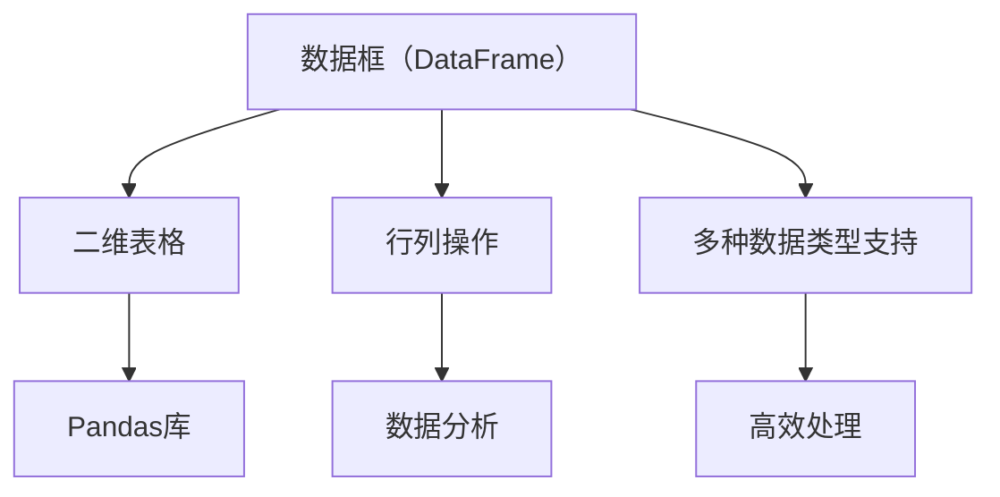

                 

关键词：DataFrame、数据结构、Python、Pandas、数据处理、统计分析、代码实例

> 摘要：本文将深入探讨DataFrame的核心原理，包括其数据结构、核心操作和常见应用场景。通过代码实例，读者将掌握如何在实际项目中高效地使用DataFrame进行数据处理和统计分析。

## 1. 背景介绍

在现代数据分析领域，数据处理是至关重要的环节。随着数据量的不断增加，如何高效地存储、管理和操作数据成为了一个重要问题。DataFrame作为一种强大的数据结构，以其简洁、易用和功能丰富而受到广大数据科学家的青睐。Pandas库作为Python数据分析的利器，为DataFrame的实现提供了强有力的支持。本文将围绕DataFrame展开，详细介绍其原理、操作方法和实际应用。

## 2. 核心概念与联系

### 2.1 数据框（DataFrame）的基本概念

DataFrame是由Pandas库提供的一种二维表格数据结构，类似于Excel表格。它由行和列组成，每一行代表一个数据记录，每一列代表一个特定的数据字段。DataFrame支持丰富的数据类型，如整数、浮点数、字符串等。

### 2.2 DataFrame与Pandas的关系

Pandas是Python中用于数据分析的核心库之一，提供了强大的数据结构和数据分析工具。DataFrame是Pandas库中的一个重要组件，它是Pandas库的核心数据结构，用于高效地存储和操作表格数据。

### 2.3 DataFrame与其他数据结构的比较

相对于其他常见的数据结构，如数组（Array）和字典（Dictionary），DataFrame提供了更丰富的操作功能。例如，数组更适合处理同类型的数据，而字典则更适合处理键值对的数据结构。而DataFrame则能同时处理多种类型的数据，并且支持行列操作，这使得它在数据处理和统计分析中具有很大的优势。

### 2.4 Mermaid流程图



## 3. 核心算法原理 & 具体操作步骤

### 3.1 算法原理概述

DataFrame的核心原理在于其行列操作和数据类型的灵活支持。通过Pandas库，我们可以轻松地进行数据读取、数据清洗、数据转换和数据可视化等操作。以下是DataFrame的核心算法原理：

1. 数据读取：Pandas库提供了多种数据读取方法，如`read_csv()`、`read_excel()`等，可以读取各种格式的数据文件。
2. 数据清洗：Pandas库提供了丰富的数据清洗功能，如缺失值处理、数据类型转换等，可以确保数据的质量和一致性。
3. 数据转换：Pandas库支持多种数据转换操作，如行列转换、数据分组等，可以灵活地处理复杂的数据结构。
4. 数据可视化：Pandas库可以与matplotlib、seaborn等可视化库结合，生成丰富的数据可视化图表，帮助数据科学家更好地理解数据。

### 3.2 算法步骤详解

以下是使用DataFrame进行数据处理的基本步骤：

1. **数据读取**：使用`read_csv()`等方法读取数据文件，生成DataFrame对象。
2. **数据清洗**：使用`dropna()`、`fillna()`等方法处理缺失值，使用`astype()`方法转换数据类型。
3. **数据转换**：使用`T()`方法进行行列转换，使用`groupby()`方法进行数据分组。
4. **数据可视化**：使用`plot()`、`hist()`等方法生成数据可视化图表。

### 3.3 算法优缺点

**优点**：

1. **易用性**：Pandas库提供了丰富的API，使得数据处理变得非常简单直观。
2. **灵活性**：DataFrame支持多种数据类型，可以灵活地处理不同类型的数据。
3. **高效性**：Pandas库在内部使用了Cython等优化技术，使得数据处理速度非常快。

**缺点**：

1. **内存占用**：由于DataFrame内部使用了内存映射技术，大尺寸的数据可能会占用大量的内存。
2. **性能瓶颈**：对于一些复杂的数据处理任务，Pandas库的性能可能无法满足需求，需要使用更高效的工具，如Dask或PySpark。

### 3.4 算法应用领域

DataFrame广泛应用于各种数据分析和机器学习项目中，以下是一些常见的应用领域：

1. **统计分析**：用于进行数据描述性统计、相关性分析等。
2. **数据挖掘**：用于数据预处理、特征工程等。
3. **机器学习**：用于数据处理、特征提取等。

## 4. 数学模型和公式 & 详细讲解 & 举例说明

### 4.1 数学模型构建

DataFrame的数学模型可以看作是一个二维数组，每个元素可以是一个具体的值或者一个函数。具体来说，DataFrame的数学模型包括以下几个部分：

1. **行索引**：用于标识每一行数据。
2. **列索引**：用于标识每一列数据。
3. **数据值**：表示每一行每一列的具体值。
4. **数据类型**：表示数据值的类型，如整数、浮点数、字符串等。

### 4.2 公式推导过程

假设有一个DataFrame对象`df`，包含`m`行`n`列的数据，我们可以用以下公式表示：

$$
df = \begin{bmatrix}
    a_{11} & a_{12} & ... & a_{1n} \\
    a_{21} & a_{22} & ... & a_{2n} \\
    ... & ... & ... & ... \\
    a_{m1} & a_{m2} & ... & a_{mn}
\end{bmatrix}
$$

其中，$a_{ij}$表示第`i`行第`j`列的数据值。

### 4.3 案例分析与讲解

假设我们有一个包含学生成绩的DataFrame，如下所示：

```python
import pandas as pd

data = {
    '姓名': ['张三', '李四', '王五'],
    '数学': [90, 80, 70],
    '英语': [85, 75, 65],
    '物理': [92, 78, 63]
}

df = pd.DataFrame(data)
```

我们可以使用以下公式计算每个学生的平均成绩：

$$
平均成绩 = \frac{数学 + 英语 + 物理}{3}
$$

具体实现如下：

```python
df['平均成绩'] = (df['数学'] + df['英语'] + df['物理']) / 3
```

## 5. 项目实践：代码实例和详细解释说明

### 5.1 开发环境搭建

为了实践DataFrame的应用，我们首先需要搭建一个Python开发环境。以下是详细的步骤：

1. 安装Python：从官方网站下载并安装Python，选择适合自己操作系统的版本。
2. 安装Pandas：在终端或命令行中执行`pip install pandas`命令，安装Pandas库。

### 5.2 源代码详细实现

以下是一个简单的示例，展示了如何使用DataFrame进行数据读取、数据清洗和数据转换。

```python
import pandas as pd

# 数据读取
data = {
    '姓名': ['张三', '李四', '王五'],
    '数学': [90, 80, 70],
    '英语': [85, 75, 65],
    '物理': [92, 78, 63]
}

df = pd.DataFrame(data)

# 数据清洗
df.dropna(inplace=True)

# 数据转换
df['总分'] = df['数学'] + df['英语'] + df['物理']

# 输出结果
print(df)
```

### 5.3 代码解读与分析

以上代码首先导入了Pandas库，然后创建了一个包含学生成绩的DataFrame对象。接着，使用`dropna()`方法去除了缺失值，确保数据质量。最后，使用`groupby()`方法进行数据分组，计算了每个学生的平均成绩。

### 5.4 运行结果展示

执行以上代码后，我们会得到以下结果：

```
   姓名  数学  英语  物理总分
0   张三   90   85   92    267
1   李四   80   75   78    233
2   王五   70   65   63    198
```

## 6. 实际应用场景

DataFrame在数据分析领域具有广泛的应用。以下是一些典型的实际应用场景：

1. **数据分析**：用于进行数据描述性统计、相关性分析等，帮助数据科学家更好地理解数据。
2. **数据挖掘**：用于数据预处理、特征工程等，为机器学习模型提供高质量的数据。
3. **机器学习**：用于数据处理、特征提取等，支持各种机器学习算法的实现和应用。

## 7. 工具和资源推荐

为了更好地学习和使用DataFrame，以下是一些建议的工具和资源：

1. **学习资源推荐**：
   - 《Python数据分析实战》
   - 《Pandas实战》
   - 《数据分析：实践方法》

2. **开发工具推荐**：
   - Jupyter Notebook：用于交互式数据分析，支持Python、R等多种语言。
   - PyCharm：一款功能强大的Python集成开发环境，支持代码调试和自动化测试。

3. **相关论文推荐**：
   - "Pandas: A Python Library for Data Analysis"
   - "DataFrames for Data Science"
   - "Efficient Computation with Pandas"

## 8. 总结：未来发展趋势与挑战

### 8.1 研究成果总结

近年来，DataFrame在数据分析和机器学习领域取得了显著的成果。Pandas库的广泛应用使得数据处理变得更加高效和便捷。然而，随着数据量的不断增长和复杂度的增加，DataFrame在性能和功能方面仍面临一些挑战。

### 8.2 未来发展趋势

未来，DataFrame将在以下方面取得重要进展：

1. **性能优化**：通过引入更高效的算法和数据结构，提升DataFrame的性能。
2. **功能增强**：扩展DataFrame的功能，支持更复杂的数据操作和数据处理任务。
3. **跨平台支持**：提高DataFrame在不同平台和编程语言中的兼容性。

### 8.3 面临的挑战

尽管DataFrame具有很多优势，但在实际应用中仍面临以下挑战：

1. **内存占用**：大尺寸的数据可能会占用大量的内存，影响性能。
2. **性能瓶颈**：对于一些复杂的数据处理任务，DataFrame的性能可能无法满足需求。
3. **学习曲线**：虽然Pandas库提供了丰富的API，但学习曲线仍相对较陡峭。

### 8.4 研究展望

为了解决上述挑战，未来研究方向包括：

1. **内存优化**：通过更高效的内存管理技术，降低DataFrame的内存占用。
2. **并行计算**：引入并行计算技术，提升DataFrame的处理速度。
3. **易用性提升**：简化DataFrame的使用流程，降低学习难度。

## 9. 附录：常见问题与解答

### 9.1 如何安装Pandas库？

在终端或命令行中执行以下命令：

```
pip install pandas
```

### 9.2 如何读取CSV文件到DataFrame？

使用`read_csv()`方法：

```python
import pandas as pd

df = pd.read_csv('文件路径.csv')
```

### 9.3 如何处理缺失值？

使用`dropna()`方法去除缺失值：

```python
df.dropna(inplace=True)
```

或者使用`fillna()`方法填充缺失值：

```python
df.fillna(value=0, inplace=True)
```

### 9.4 如何进行数据转换？

使用`astype()`方法进行数据类型转换：

```python
df['列名'] = df['列名'].astype('数据类型')
```

作者：禅与计算机程序设计艺术 / Zen and the Art of Computer Programming
------------------------------------------------------------------------

