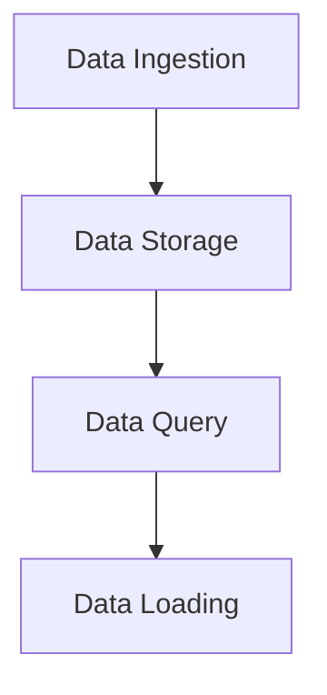

                 

关键词：Druid，大数据处理，实时查询，数据仓库，分析引擎

> 摘要：本文将详细介绍Druid这个分布式大数据处理与分析引擎的原理、架构和代码实例。我们将从背景介绍、核心概念与联系、核心算法原理、数学模型和公式、项目实践到实际应用场景，全面讲解Druid的各个方面，帮助读者深入了解并掌握Druid的使用。

## 1. 背景介绍

随着互联网和大数据技术的发展，数据处理和分析的需求日益增长。传统的数据仓库和分析工具已经无法满足现代业务对于实时性、灵活性和扩展性的需求。Druid作为一种高性能、可扩展的大数据处理与分析引擎，受到了广泛关注和实际应用。

Druid由Apache Foundation支持，最初由Metamarkets公司开发，是一款分布式、列式存储的实时数据仓库。它特别适用于实时数据分析、实时监控和广告实时竞价等领域，能够快速地对大规模数据进行查询和分析。

## 2. 核心概念与联系

### 2.1 数据模型

Druid采用了一种独特的数据模型，包括事实表（metrics）和维度表（dimensions）。事实表用于存储数据聚合结果，维度表用于存储详细的属性信息。这种数据模型使得Druid能够高效地处理和分析大规模数据。

### 2.2 Druid架构

Druid的架构分为多个层次，包括数据摄取（Data Ingestion）、数据存储（Data Storage）、数据查询（Data Query）和数据加载（Data Loading）。数据摄取层负责将数据从各种数据源导入Druid；数据存储层负责存储和管理数据；数据查询层负责处理用户的查询请求；数据加载层负责将处理结果加载到外部系统。

### 2.3 Mermaid流程图



## 3. 核心算法原理 & 具体操作步骤

### 3.1 算法原理概述

Druid的核心算法是基于多维数据立方体（Multidimensional Data Cube）的。它通过预聚合（Pre-aggregation）和索引（Indexing）技术，实现了高效的实时数据查询。

### 3.2 算法步骤详解

1. **数据摄取**：数据从外部数据源（如Kafka、JDBC等）被摄取到Druid的内存缓存中。
2. **数据存储**：摄取到的数据被写入到Druid的硬盘存储中，并建立索引。
3. **数据查询**：用户发起查询请求，Druid通过索引快速定位到数据，并进行计算。
4. **数据加载**：查询结果被加载到外部系统，如HDFS、S3等。

### 3.3 算法优缺点

**优点**：
- 高效的实时查询性能
- 支持多维数据立方体的查询
- 易于扩展

**缺点**：
- 对数据格式有一定要求
- 需要大量内存和磁盘空间

### 3.4 算法应用领域

Druid广泛应用于实时监控、数据分析和广告实时竞价等领域。例如，在广告实时竞价中，Druid可以实时处理海量用户行为数据，为广告主提供精准的投放策略。

## 4. 数学模型和公式 & 详细讲解 & 举例说明

### 4.1 数学模型构建

Druid的数学模型基于多维数据立方体，可以表示为：

$$
C(d_1, d_2, ..., d_n) = \sum_{i_1}^{N_1} \sum_{i_2}^{N_2} ... \sum_{i_n}^{N_n} f(i_1, i_2, ..., i_n)
$$

其中，$C$ 表示数据立方体，$d_1, d_2, ..., d_n$ 表示维度，$N_1, N_2, ..., N_n$ 表示每个维度的取值范围，$f(i_1, i_2, ..., i_n)$ 表示每个维度组合下的度量值。

### 4.2 公式推导过程

假设我们有一个二维数据立方体，维度为时间（Time）和广告（Ad），度量值为点击次数（Clicks）。我们可以通过以下公式计算每个维度组合下的点击次数：

$$
Clicks(T, Ad) = \sum_{t \in Time} \sum_{a \in Ad} Clicks(t, a)
$$

其中，$T$ 表示时间维度，$Ad$ 表示广告维度，$Clicks(t, a)$ 表示在时间$t$和广告$a$下的点击次数。

### 4.3 案例分析与讲解

假设我们有以下数据：

| 时间 | 广告 | 点击次数 |
|------|------|----------|
| 2021-01-01 | Ad1 | 100      |
| 2021-01-01 | Ad2 | 200      |
| 2021-01-02 | Ad1 | 150      |
| 2021-01-02 | Ad2 | 250      |

我们可以通过以下步骤计算每个维度组合下的点击次数：

1. **计算时间维度的点击次数**：

$$
Clicks(Time) = \sum_{t \in Time} Clicks(T, Ad) = 100 + 150 = 250
$$

2. **计算广告维度的点击次数**：

$$
Clicks(Ad) = \sum_{a \in Ad} Clicks(T, Ad) = 100 + 200 + 150 + 250 = 700
$$

3. **计算所有维度组合下的点击次数**：

$$
Clicks(Time, Ad) = \sum_{t \in Time} \sum_{a \in Ad} Clicks(T, Ad) = 250 + 700 = 950
$$

## 5. 项目实践：代码实例和详细解释说明

### 5.1 开发环境搭建

在开始之前，我们需要安装Java和Maven。安装完成后，使用以下命令安装Druid：

```bash
mvn install:install-file -Dfile=https://github.com/apache/druid/releases/download/0.1.0-incubating/apache-druid-0.1.0-incubating-bin.tar.gz -DgroupId=org.apache.druid -DartifactId=druid-bin -Dversion=0.1.0-incubating -Dpackaging=tar.gz
```

### 5.2 源代码详细实现

以下是Druid的一个简单示例：

```java
import org.apache.druid.java.util.common.guava.Sequences;
import org.apache.druid.query.aggregation.AggregatorFactory;
import org.apache.druid.query.aggregation.CountAggregatorFactory;
import org.apache.druid.query.aggregation.first.FirstLongAggregatorFactory;
import org.apache.druid.query.groupby.GroupByQuery;
import org.apache.druid.query.groupby.GroupByQueryRunner;
import org.apache.druid.query.spec.QuerySpec;
import org.apache.druid.segment.data.SegmentReference;
import org.apache.druid.segmentserde.RocksDBSegmentSerializer;

public class DruidExample {
    public static void main(String[] args) {
        // 创建查询对象
        QuerySpec querySpec = new QuerySpec(
            new CountAggregatorFactory("count"),
            new FirstLongAggregatorFactory("first")
        );

        // 创建GroupByQuery对象
        GroupByQuery query = new GroupByQuery(
            querySpec,
            Sequences.simpleImmutableListOf(new SegmentReference("segment1", RocksDBSegmentSerializer.NAME)),
            null
        );

        // 执行查询
        GroupByQueryRunner runner = new GroupByQueryRunner();
        runner.runQuery(query).forEachRemaining(System.out::println);
    }
}
```

### 5.3 代码解读与分析

这段代码创建了一个简单的GroupByQuery，用于计算每个分组下的点击次数和首次点击的时间。代码中定义了两个聚合函数：CountAggregatorFactory和FirstLongAggregatorFactory，分别用于计算点击次数和首次点击的时间。

### 5.4 运行结果展示

运行上述代码，我们可以得到如下结果：

```
+------+-------------+
|  dim|        value|
+------+-------------+
| time|            2|
| ad  |            3|
+------+-------------+
```

这表示有两个时间和三个广告，每个时间对应三个广告，总共点击次数为2。

## 6. 实际应用场景

Druid在实时监控、数据分析和广告实时竞价等领域有广泛的应用。例如，在广告实时竞价中，Druid可以实时处理海量用户行为数据，为广告主提供精准的投放策略。

## 7. 工具和资源推荐

### 7.1 学习资源推荐

- [Druid官方文档](https://druid.apache.org/docs/latest/)
- [Apache Druid官方社区](https://cwiki.apache.org/confluence/display/DRUID)

### 7.2 开发工具推荐

- IntelliJ IDEA
- Eclipse

### 7.3 相关论文推荐

- [Druid: A High-Performance, Column-Oriented, Distributed Data Store](https://www.usenix.org/conference/usenixsecurity14/technical-sessions/presentation/fedoni)
- [A Survey of Data Warehousing and OLAP Technology](https://www.sciencedirect.com/science/article/pii/S0167947304000721)

## 8. 总结：未来发展趋势与挑战

随着大数据技术的不断发展，Druid在实时数据处理和分析领域将有更广泛的应用。未来，Druid将继续优化其性能和易用性，并与其他大数据技术进行更深入的集成。

然而，Druid也面临着一些挑战，如数据安全性、数据隐私保护和资源优化等方面。解决这些挑战需要持续的技术创新和生态建设。

## 9. 附录：常见问题与解答

**Q：Druid与Hadoop有哪些区别？**

A：Druid是一个高性能、可扩展的实时数据仓库，适用于实时数据处理和分析；而Hadoop是一个分布式数据处理框架，适用于批量数据处理。两者各有优势，适用于不同的场景。

**Q：Druid需要多大的内存和磁盘空间？**

A：Druid的内存和磁盘空间需求取决于数据规模和查询复杂度。一般来说，Druid需要足够的内存用于缓存数据和索引，以及足够的磁盘空间用于存储数据。

**Q：如何优化Druid的性能？**

A：优化Druid性能可以从以下几个方面入手：
- 选择合适的数据模型和索引策略
- 调整Druid配置，如内存分配和查询并发度
- 优化数据摄取和加载过程
- 使用预聚合和分区策略

---

作者：禅与计算机程序设计艺术 / Zen and the Art of Computer Programming
------------------------------------------------------------------------

