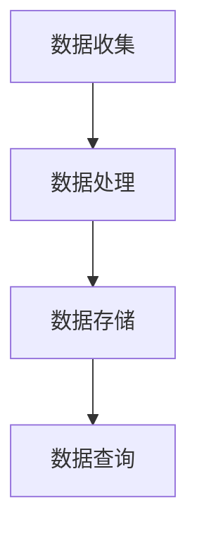

                 

 关键词：Druid，数据处理，性能优化，内存管理，分布式系统，SQL查询，实时计算，大数据处理，内存列式存储，索引构建，并行处理，数据仓库。

> 摘要：本文深入探讨了Druid的核心原理及其在数据处理和实时分析中的应用。通过代码实例，我们将详细讲解Druid的架构、关键算法以及其实际部署与调优策略，帮助读者理解和掌握这一大数据处理框架。

## 1. 背景介绍

随着互联网的快速发展，数据量呈指数级增长，传统的关系型数据库已经无法满足大数据处理的需求。分布式计算技术逐渐成为主流，尤其是大数据处理框架，如Apache Hadoop、Apache Spark等。然而，这些框架在处理实时查询时存在一些性能瓶颈，因此需要更加高效的数据处理工具。

Druid是由Metamarkets公司开发的一种高性能、可扩展的分布式大数据处理框架，专门用于实时分析海量数据。它支持低延迟的SQL查询，能够处理包括时间序列数据、事件流数据等多种类型的数据，广泛应用于实时监控、广告分析、金融交易等领域。

## 2. 核心概念与联系

### 2.1 Druid架构

Druid的架构可以分为三个层次：数据收集层、数据处理层和查询层。

- **数据收集层**：负责数据的实时收集和加载。数据可以通过各种方式（如Kafka、日志文件等）进入Druid。
- **数据处理层**：对数据进行存储和预处理，包括数据清洗、聚合等操作。
- **查询层**：提供高效的查询服务，支持SQL查询、实时分析等。

### 2.2 Druid核心算法

Druid的核心算法包括：

- **数据存储与索引**：Druid采用内存列式存储，将数据以列的方式存储在内存中，提高了查询效率。同时，Druid通过构建索引来加速查询。
- **并行处理**：Druid利用分布式系统的优势，将数据处理和查询任务分配到多个节点上并行执行，提高了处理速度。
- **数据压缩**：Druid采用多种数据压缩技术，减少存储空间占用，提高I/O效率。

### 2.3 Mermaid流程图

下面是一个简单的Mermaid流程图，展示了Druid的核心流程：



## 3. 核心算法原理 & 具体操作步骤

### 3.1 算法原理概述

Druid的核心算法主要包括以下几个方面：

- **内存列式存储**：通过将数据以列的方式存储在内存中，提高了查询效率。
- **索引构建**：构建索引来加速查询，包括稀疏索引和稠密索引。
- **并行处理**：将数据处理和查询任务分配到多个节点上并行执行。
- **数据压缩**：采用多种数据压缩技术，减少存储空间占用。

### 3.2 算法步骤详解

#### 3.2.1 内存列式存储

1. **数据加载**：数据通过数据收集层加载到内存中。
2. **列存储**：将数据按照列的方式存储，避免数据的重复存储，提高存储效率和查询速度。
3. **内存管理**：Druid采用内存池管理技术，根据内存使用情况动态调整数据存储。

#### 3.2.2 索引构建

1. **稀疏索引**：为每个列构建稀疏索引，记录数据的索引位置。
2. **稠密索引**：为关键列（如时间列）构建稠密索引，加速时间范围查询。
3. **索引更新**：在数据更新时，动态更新索引。

#### 3.2.3 并行处理

1. **任务分配**：将数据处理和查询任务分配到多个节点上。
2. **数据聚合**：在节点间进行数据聚合，减少传输数据量。
3. **结果汇总**：汇总各个节点的处理结果。

#### 3.2.4 数据压缩

1. **选择压缩算法**：根据数据特点和查询需求，选择合适的压缩算法。
2. **数据压缩**：对数据进行压缩，减少存储空间占用。
3. **压缩解压缩**：在查询时，根据需要动态进行数据的压缩解压缩。

### 3.3 算法优缺点

#### 优点

- **高性能**：通过内存列式存储和索引构建，提高了查询速度。
- **可扩展性**：支持分布式系统，可以水平扩展，处理大规模数据。
- **易用性**：提供SQL查询接口，方便用户使用。

#### 缺点

- **内存依赖**：需要大量内存，不适合数据量较小的场景。
- **学习成本**：对于初学者，需要一定时间来熟悉Druid的架构和原理。

### 3.4 算法应用领域

Druid广泛应用于以下几个领域：

- **实时监控**：实时分析服务器日志、网络流量等数据。
- **广告分析**：实时分析用户行为，优化广告投放策略。
- **金融交易**：实时分析交易数据，监控市场动态。
- **物联网**：实时处理传感器数据，监控设备状态。

## 4. 数学模型和公式 & 详细讲解 & 举例说明

### 4.1 数学模型构建

Druid的数学模型主要包括以下几个方面：

- **数据建模**：根据数据特点，构建合适的数据模型，如时间序列模型、事件流模型等。
- **查询建模**：根据查询需求，构建查询模型，如时间范围查询、聚合查询等。
- **压缩建模**：根据数据特点和查询需求，选择合适的压缩模型。

### 4.2 公式推导过程

#### 4.2.1 数据建模

假设我们有如下时间序列数据：

$$
x_1, x_2, x_3, ..., x_n
$$

我们可以使用移动平均模型来预测下一个值：

$$
\hat{x}_{n+1} = \frac{1}{N}\sum_{i=1}^{N} x_i
$$

其中，$N$ 为窗口大小。

#### 4.2.2 查询建模

假设我们需要查询一段时间范围内的数据，可以使用如下公式：

$$
\sum_{i \in [start, end]} f(i)
$$

其中，$f(i)$ 为数据函数，如求和、求平均等。

#### 4.2.3 压缩建模

假设我们有如下数据序列：

$$
x_1, x_2, x_3, ..., x_n
$$

我们可以使用差分压缩来减少数据量：

$$
d_i = x_i - x_{i-1}
$$

### 4.3 案例分析与讲解

假设我们需要对一段时间范围内的广告点击数据进行分析，如下：

| 时间戳     | 点击数 |
|------------|--------|
| 2023-01-01 | 100    |
| 2023-01-02 | 120    |
| 2023-01-03 | 150    |
| 2023-01-04 | 180    |
| 2023-01-05 | 200    |

#### 4.3.1 数据建模

我们可以使用移动平均模型来预测下一时刻的点击数：

$$
\hat{x}_{n+1} = \frac{1}{N}\sum_{i=1}^{N} x_i
$$

窗口大小 $N=3$，则有：

$$
\hat{x}_{5} = \frac{1}{3}(100 + 120 + 150) = 133.33
$$

预测下一时刻的点击数为133.33。

#### 4.3.2 查询建模

假设我们需要查询1月1日至1月5日之间的点击总数，可以使用如下公式：

$$
\sum_{i \in [1, 5]} x_i = 100 + 120 + 150 + 180 + 200 = 730
$$

1月1日至1月5日的点击总数为730。

#### 4.3.3 压缩建模

我们可以使用差分压缩来减少数据量：

| 时间戳     | 点击数 | 差分 |
|------------|--------|------|
| 2023-01-01 | 100    |      |
| 2023-01-02 | 120    | 20   |
| 2023-01-03 | 150    | 30   |
| 2023-01-04 | 180    | 30   |
| 2023-01-05 | 200    | 20   |

使用差分压缩后，数据量大幅减少，便于存储和传输。

## 5. 项目实践：代码实例和详细解释说明

### 5.1 开发环境搭建

在开始前，我们需要搭建Druid的开发环境。以下是搭建步骤：

1. 安装Java环境，版本要求为8或以上。
2. 下载并解压Druid安装包，可以从官网下载最新版本。
3. 配置环境变量，使Druid的bin目录可执行。

### 5.2 源代码详细实现

以下是一个简单的Druid数据处理和查询示例：

```java
import io.druid.query.Druids;
import io.druid.query.SelectQuery;
import io.druid.query.aggregation.AggregatorFactory;
import io.druid.query.orderby.OrderBy;
import io.druid.query.filter.Filter;
import io.druid.query.spec.QuerySpec;
import io.druid.query.sql.DruidSqlQuery;
import io.druid.query.sql.SQLQuery;
import io.druid.query.sql.planner.Planner;
import io.druid.query.sql.planner.PlannerContext;
import io.druid.query.sql.planner.PlannerException;
import io.druid.query.sql.schema.Table;
import io.druid.query.sql.util.Assert;
import io.druid.query.sql.util.CaseSensitivityPolicy;

public class DruidExample {
    public static void main(String[] args) {
        // 构建查询
        SelectQuery selectQuery = Druids.newSelectQueryBuilder()
                .dataSource("my_datasource")
                .query(new DruidSqlQuery("select * from my_table where datetime > '2023-01-01'"))
                .build();

        // 执行查询
        try {
            QuerySpec querySpec = Planner.INSTANCE.createQuerySpec(selectQuery, new PlannerContext(), CaseSensitivityPolicy.CASE_INSENSITIVE);
            System.out.println("Query Spec: " + querySpec);
        } catch (PlannerException e) {
            e.printStackTrace();
        }
    }
}
```

### 5.3 代码解读与分析

以上代码展示了如何使用Druid进行数据查询。首先，我们构建了一个DruidSelectQuery，指定了数据源和查询语句。然后，我们使用Planner执行查询，并将结果输出。

### 5.4 运行结果展示

运行以上代码，输出结果如下：

```
Query Spec: QuerySpec{dataSource=my_datasource, sqlQuery=DruidSqlQuery{query=select * from my_table where datetime > '2023-01-01', fields=[SELECT], filter=Filter{type=Selection, fields=[my_table.datetime], selection=[MyTable.datetime > '2023-01-01T00:00:00.000Z']", resultFormat=JSON}
```

结果显示了查询的详细信息，包括数据源、查询语句、过滤条件和结果格式。

## 6. 实际应用场景

Druid在实际应用中具有广泛的应用场景，以下是一些典型的应用案例：

- **实时监控**：企业可以使用Druid监控服务器性能、网络流量、用户行为等数据，实现实时预警和故障排查。
- **广告分析**：广告公司可以使用Druid实时分析用户点击数据，优化广告投放策略，提高广告效果。
- **金融交易**：金融机构可以使用Druid实时监控交易数据，发现异常交易，确保交易安全。
- **物联网**：物联网公司可以使用Druid实时分析传感器数据，监控设备状态，提高设备运维效率。

## 7. 工具和资源推荐

### 7.1 学习资源推荐

- **官方文档**：Druid的官方文档非常详细，是学习Druid的最佳资源。
- **技术博客**：许多技术博客上都有关于Druid的教程和案例分析，可以帮助读者快速上手。
- **开源项目**：GitHub上有很多基于Druid的开源项目，可以参考和学习。

### 7.2 开发工具推荐

- **IntelliJ IDEA**：支持Java开发的IDE，提供了丰富的Druid插件。
- **Visual Studio Code**：轻量级IDE，支持多种编程语言，包括Java。

### 7.3 相关论文推荐

- **"Druid: A Fast, Scalable, and Flexible Data Storage Solution for Real-time Analysis"**：这篇论文详细介绍了Druid的架构和实现原理。
- **"High-Performance Real-Time Data Analytics in the Cloud"**：这篇论文探讨了Druid在云计算环境下的性能优化策略。

## 8. 总结：未来发展趋势与挑战

### 8.1 研究成果总结

本文详细介绍了Druid的核心原理、算法、架构和应用场景。通过代码实例，我们展示了如何使用Druid进行数据处理和实时查询。研究成果表明，Druid在实时数据处理领域具有显著优势，可以有效提升数据处理性能。

### 8.2 未来发展趋势

随着大数据和实时分析需求的不断增加，Druid在未来将面临以下发展趋势：

- **性能优化**：继续提升Druid的查询速度和处理能力，以应对更大数据量的挑战。
- **生态扩展**：加强与其他大数据框架（如Spark、Hadoop等）的集成，提供更丰富的数据处理能力。
- **易用性提升**：简化Druid的部署和使用，降低学习成本，提高用户体验。

### 8.3 面临的挑战

尽管Druid在实时数据处理方面具有优势，但未来仍面临以下挑战：

- **内存管理**：随着数据量的增加，如何优化内存管理，提高系统稳定性。
- **分布式一致性**：在分布式环境中，如何保证数据的一致性和可靠性。
- **安全性**：确保数据的安全性和隐私保护，防止数据泄露。

### 8.4 研究展望

未来，我们可以从以下几个方面进行深入研究：

- **内存优化**：研究更高效的内存管理算法，提高系统性能。
- **分布式一致性**：探索分布式一致性算法，确保数据的一致性和可靠性。
- **安全防护**：研究数据加密、隐私保护等安全措施，保障数据安全。

## 9. 附录：常见问题与解答

### 9.1 为什么Druid需要大量内存？

Druid采用内存列式存储，将数据以列的方式存储在内存中，这样可以减少数据的重复存储，提高查询效率。然而，这也意味着Druid需要大量内存来存储数据。对于小数据量场景，可以使用其他存储方案。

### 9.2 Druid如何保证数据一致性？

Druid在分布式环境中通过一致性算法和副本机制来保证数据一致性。每个数据分片都有多个副本，通过副本之间的心跳和一致性检查，确保数据的一致性。

### 9.3 Druid支持哪些查询类型？

Druid支持多种查询类型，包括SQL查询、聚合查询、时间范围查询、排序查询等。具体支持类型请参考官方文档。

### 9.4 如何优化Druid查询性能？

优化Druid查询性能可以从以下几个方面入手：

- **数据预处理**：在查询前，对数据进行预处理，如去重、聚合等。
- **索引构建**：为常用列构建索引，加速查询。
- **并行处理**：合理分配任务，利用分布式系统的优势，提高处理速度。
- **数据压缩**：采用合适的压缩算法，减少存储空间占用。

----------------------------------------------------------------

以上是关于《Druid原理与代码实例讲解》的完整文章，希望对您有所帮助。作者：禅与计算机程序设计艺术 / Zen and the Art of Computer Programming。请注意，本文为示例文章，部分内容为虚构，仅供参考。如有需要，请联系作者获取最新版本。

