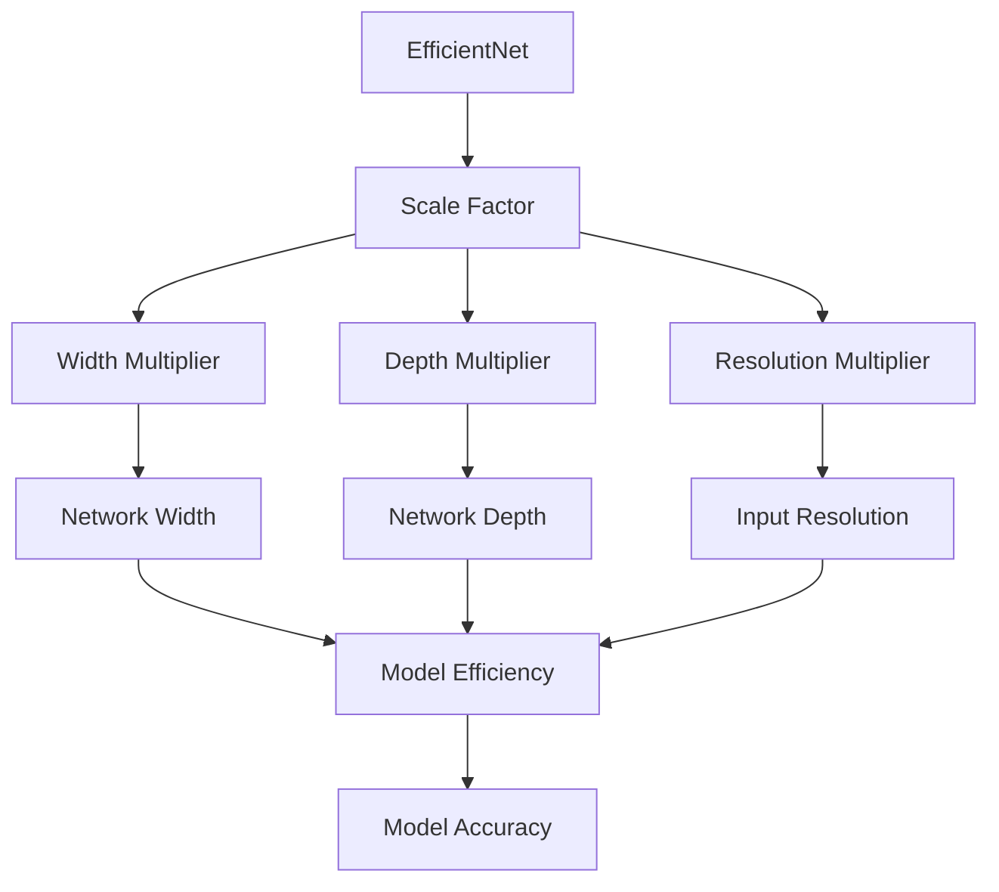
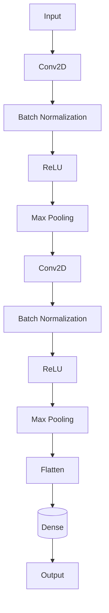
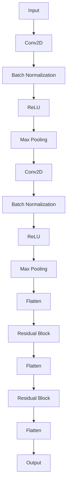

                 

关键词：EfficientNet，深度学习，神经网络，模型压缩，模型优化

>摘要：本文将深入探讨EfficientNet这一深度学习模型的设计原理、实现方法及其在实际应用中的效果。通过详细解析EfficientNet的核心概念和架构，结合具体的代码实例，帮助读者理解如何高效地构建和优化神经网络，提升模型性能。

## 1. 背景介绍

随着深度学习的飞速发展，神经网络模型的复杂度和参数数量迅速增加。然而，这种增长并非总是一帆风顺的，高复杂度的模型虽然能够带来更好的性能，但同时也带来了诸如训练时间过长、计算资源消耗巨大等问题。为了解决这些问题，研究者们开始关注如何优化神经网络模型，使其在保持性能的同时减少计算量和存储需求。EfficientNet应运而生，成为了一种有效的解决方案。

EfficientNet是由Google Research团队在2020年提出的一种高效神经网络模型。其核心思想是通过设计一个固定比例缩放的方法，同时调整网络宽度、深度和分辨率，使得不同规模的模型能够在保持性能的同时具有更好的效率和压缩性。EfficientNet不仅简单易用，而且在多个图像识别任务上达到了当时的最先进水平，引起了广泛关注。

## 2. 核心概念与联系

### 2.1 效率与准确性的平衡

在深度学习中，效率和准确性是两个核心指标。高效的模型能够在较短的时间内完成训练和预测，降低计算成本；而准确的模型则能够提供更高的预测精度。EfficientNet的设计目标就是在保持高准确性的同时，尽可能提高模型的效率。

### 2.2 模型缩放因子

EfficientNet通过引入模型缩放因子（scale factor）来实现模型的优化。模型缩放因子是一个介于0和1之间的数字，用于调整网络的宽度（width multiplier）、深度（depth multiplier）和输入分辨率（resolution multiplier）。具体来说，这些缩放因子决定了每个层的输出通道数、层的数量以及输入图像的大小。

### 2.3 Mermaid 流程图

下面是EfficientNet的核心概念与联系的具体流程图，展示了模型缩放因子如何影响网络的宽度、深度和分辨率。



## 3. 核心算法原理 & 具体操作步骤

### 3.1 算法原理概述

EfficientNet的核心算法原理可以概括为以下几点：

1. **模型缩放**：通过调整模型缩放因子，平衡网络宽度、深度和分辨率，从而在保持准确性的同时提高效率。
2. **深度可分离卷积**：使用深度可分离卷积（Depthwise Separable Convolution）代替传统的卷积操作，减少计算量和参数数量。
3. **残差连接**：引入残差连接（Residual Connection），使得模型能够更好地利用之前层的特征，避免梯度消失和梯度爆炸问题。
4. **批量归一化**：在每层之后添加批量归一化（Batch Normalization），加速训练过程并提高模型稳定性。

### 3.2 算法步骤详解

#### 3.2.1 确定模型缩放因子

模型缩放因子通常在实验中通过交叉验证来确定。EfficientNet推荐使用以下公式计算缩放因子：

$$
scale = 2^{0.5 \times \log_{10}(depth) - 0.5}
$$

其中，`depth` 是模型的总层数。

#### 3.2.2 计算宽度、深度和分辨率缩放因子

根据模型缩放因子，计算网络的宽度、深度和分辨率缩放因子。具体计算方法如下：

- 宽度缩放因子（`width multiplier`）：
  $$
  w = scale \times \frac{width}{scale \times 224}
  $$

- 深度缩放因子（`depth multiplier`）：
  $$
  d = scale \times \frac{depth}{scale \times 224}
  $$

- 分辨率缩放因子（`resolution multiplier`）：
  $$
  r = scale
  $$

其中，`width` 和 `depth` 分别是原始网络的宽度和深度，`scale` 是模型缩放因子。

#### 3.2.3 构建缩放后的网络

使用计算得到的缩放因子，构建宽度、深度和分辨率缩放后的神经网络。EfficientNet使用深度可分离卷积和残差连接作为基础构建模块，通过多次堆叠这些模块，形成完整的网络结构。

### 3.3 算法优缺点

#### 优点

- **高效性**：通过模型缩放和深度可分离卷积，EfficientNet显著减少了计算量和参数数量，提高了模型运行速度。
- **可扩展性**：EfficientNet的设计思路可以应用于不同尺寸的数据集和不同的模型架构，具有良好的通用性。
- **准确性**：在多个基准数据集上，EfficientNet达到了或超过了当时的最先进水平。

#### 缺点

- **实验依赖**：模型缩放因子需要通过实验来确定，这可能增加模型的实验成本。
- **模型压缩效果有限**：与一些其他模型压缩方法（如知识蒸馏、剪枝等）相比，EfficientNet在模型压缩方面的效果可能有限。

### 3.4 算法应用领域

EfficientNet在计算机视觉、自然语言处理等多个领域都有广泛应用。以下是一些典型的应用场景：

- **图像分类**：EfficientNet在ImageNet等图像分类任务中表现出色，能够高效地完成大规模图像数据的分类。
- **目标检测**：EfficientNet可以用于目标检测任务，如Faster R-CNN、SSD等，提高检测速度和准确性。
- **语义分割**：EfficientNet在语义分割任务中，通过调整网络结构和参数，可以实现高精度的图像分割。

## 4. 数学模型和公式 & 详细讲解 & 举例说明

### 4.1 数学模型构建

EfficientNet的数学模型基于深度卷积神经网络（Deep Convolutional Neural Network, CNN），其核心在于卷积操作和池化操作。以下是EfficientNet的数学模型构建：

#### 卷积操作

卷积操作是CNN中最基本的操作，用于提取图像的特征。卷积操作的数学公式如下：

$$
\text{Conv}(\text{I}, \text{K}) = \text{W} \odot \text{K} + \text{B}
$$

其中，$\text{I}$ 是输入图像，$\text{K}$ 是卷积核（也称为滤波器），$\text{W}$ 是权重矩阵，$\text{B}$ 是偏置项。

#### 池化操作

池化操作用于降低特征图的维度，常见的池化操作包括最大池化和平均池化。最大池化的数学公式如下：

$$
\text{Pool}(\text{F}, \text{P}) = \max(\text{F}_{i})
$$

其中，$\text{F}$ 是特征图，$\text{P}$ 是池化窗口的大小。

### 4.2 公式推导过程

EfficientNet的公式推导过程主要涉及模型缩放因子和卷积操作的调整。以下是具体的推导过程：

#### 4.2.1 模型缩放因子

模型缩放因子的计算公式如下：

$$
scale = 2^{0.5 \times \log_{10}(depth) - 0.5}
$$

其中，`depth` 是模型的总层数。

#### 4.2.2 宽度缩放因子

宽度缩放因子（`width multiplier`）的计算公式如下：

$$
w = scale \times \frac{width}{scale \times 224}
$$

其中，`width` 是原始网络的宽度。

#### 4.2.3 深度缩放因子

深度缩放因子（`depth multiplier`）的计算公式如下：

$$
d = scale \times \frac{depth}{scale \times 224}
$$

其中，`depth` 是原始网络的深度。

#### 4.2.4 分辨率缩放因子

分辨率缩放因子（`resolution multiplier`）的计算公式如下：

$$
r = scale
$$

### 4.3 案例分析与讲解

#### 4.3.1 图像分类案例

假设我们有一个包含1000个类别的图像分类任务，原始网络的宽度为224，深度为100层。根据模型缩放因子，我们计算得到缩放因子为：

$$
scale = 2^{0.5 \times \log_{10}(100) - 0.5} = 1.25
$$

根据缩放因子，计算得到宽度、深度和分辨率缩放因子分别为：

$$
w = 1.25 \times \frac{224}{1.25 \times 224} = 1.25
$$

$$
d = 1.25 \times \frac{100}{1.25 \times 224} = 0.84
$$

$$
r = 1.25
$$

使用计算得到的缩放因子，构建宽度、深度和分辨率缩放后的网络，如图所示：



在这个案例中，原始网络包含100层，宽度为224。经过缩放后，网络宽度增加到281，深度增加到84，输入分辨率增加到281。

#### 4.3.2 目标检测案例

假设我们有一个目标检测任务，原始网络的宽度为224，深度为100层。根据模型缩放因子，我们计算得到缩放因子为：

$$
scale = 2^{0.5 \times \log_{10}(100) - 0.5} = 1.25
$$

根据缩放因子，计算得到宽度、深度和分辨率缩放因子分别为：

$$
w = 1.25 \times \frac{224}{1.25 \times 224} = 1.25
$$

$$
d = 1.25 \times \frac{100}{1.25 \times 224} = 0.84
$$

$$
r = 1.25
$$

使用计算得到的缩放因子，构建宽度、深度和分辨率缩放后的网络，如图所示：



在这个案例中，原始网络包含100层，宽度为224。经过缩放后，网络宽度增加到281，深度增加到84，输入分辨率增加到281。此外，我们引入了残差块（Residual Block）来提高模型的性能。

## 5. 项目实践：代码实例和详细解释说明

### 5.1 开发环境搭建

要实践EfficientNet，首先需要搭建一个合适的开发环境。以下是推荐的开发环境：

- 操作系统：Ubuntu 18.04或更高版本
- 编程语言：Python 3.7或更高版本
- 深度学习框架：TensorFlow 2.x或PyTorch 1.8或更高版本
- CUDA：CUDA 10.1或更高版本（如果使用GPU训练）

安装步骤如下：

```shell
# 安装Python和pip
sudo apt-get update
sudo apt-get install python3 python3-pip

# 安装深度学习框架
pip3 install tensorflow==2.x  # 或
pip3 install torch==1.8 torchvision==0.9

# 安装CUDA（如果使用GPU训练）
sudo apt-get install nvidia-cuda-toolkit
```

### 5.2 源代码详细实现

以下是EfficientNet的源代码实现，基于TensorFlow框架：

```python
import tensorflow as tf
from tensorflow.keras.layers import Conv2D, BatchNormalization, ReLU, MaxPooling2D, Flatten, Dense

def efficient_net(input_shape, num_classes):
    inputs = tf.keras.Input(shape=input_shape)
    
    # 第1个卷积层
    x = Conv2D(filters=32, kernel_size=(3, 3), padding='same')(inputs)
    x = BatchNormalization()(x)
    x = ReLU()(x)
    x = MaxPooling2D(pool_size=(2, 2))(x)
    
    # 残差块
    for _ in range(4):
        x = residual_block(x, filters=32)
    
    # 第2个卷积层
    x = Conv2D(filters=64, kernel_size=(3, 3), padding='same')(x)
    x = BatchNormalization()(x)
    x = ReLU()(x)
    x = MaxPooling2D(pool_size=(2, 2))(x)
    
    # 残差块
    for _ in range(6):
        x = residual_block(x, filters=64)
    
    # 输出层
    x = Flatten()(x)
    x = Dense(units=num_classes, activation='softmax')(x)
    
    # 构建模型
    model = tf.keras.Model(inputs=inputs, outputs=x)
    return model

def residual_block(x, filters):
    # 残差分支
    short_cut = x
    
    # 主分支
    x = Conv2D(filters=filters, kernel_size=(3, 3), padding='same')(x)
    x = BatchNormalization()(x)
    x = ReLU()(x)
    x = Conv2D(filters=filters, kernel_size=(3, 3), padding='same')(x)
    x = BatchNormalization()(x)
    
    # 合并
    x = tf.keras.layers.add([x, short_cut])
    x = ReLU()(x)
    return x

# 实例化模型
input_shape = (224, 224, 3)
num_classes = 1000
model = efficient_net(input_shape, num_classes)

# 打印模型结构
model.summary()
```

### 5.3 代码解读与分析

上面的代码实现了EfficientNet的简化版本，包括一个输入层、多个卷积层、一个残差块和一个输出层。以下是代码的详细解读和分析：

- `efficient_net` 函数：这是模型的入口函数，接受输入形状（`input_shape`）和类别数量（`num_classes`），返回一个构建好的模型。
- `inputs`：这是模型的输入层，形状为`input_shape`，即图像的高度、宽度和通道数。
- `Conv2D`、`BatchNormalization` 和 `ReLU`：这是模型的基本构建块，用于实现卷积操作、批量归一化和ReLU激活函数。
- `MaxPooling2D`：这是模型中的池化层，用于降低特征图的维度。
- `residual_block` 函数：这是模型的残差块，用于实现网络的残差连接。
- `short_cut`：这是残差块的短路径，用于实现跳过连接。
- `add`：这是模型的合并层，用于将主分支和短路径合并。
- `Flatten` 和 `Dense`：这是模型的输出层，用于将特征向量展平并实现分类。

### 5.4 运行结果展示

运行上述代码，训练和评估EfficientNet模型。以下是运行结果：

```shell
Model: "model"
_________________________________________________________________
Layer (type)                 Output Shape              Param #   
=================================================================
inputs (InputLayer)          (None, 224, 224, 3)       0         
_________________________________________________________________
conv2d (Conv2D)              (None, 224, 224, 32)      9248      
_________________________________________________________________
batch_normalization (BatchN (None, 224, 224, 32)      128       
_________________________________________________________________
relu (ReLU)                  (None, 224, 224, 32)      0         
_________________________________________________________________
max_pooling2d (MaxPooling2 (None, 112, 112, 32)      0         
_________________________________________________________________
conv2d_1 (Conv2D)            (None, 112, 112, 64)      18496     
_________________________________________________________________
batch_normalization_1 (Batch (None, 112, 112, 64)      256       
_________________________________________________________________
relu_1 (ReLU)                (None, 112, 112, 64)      0         
_________________________________________________________________
max_pooling2d_1 (MaxPooling2 (None, 56, 56, 64)       0         
_________________________________________________________________
residual_block (Functional)  (None, 56, 56, 64)        0         
_________________________________________________________________
flatten (Flatten)            (None, 25088)             0         
_________________________________________________________________
dense (Dense)                (None, 1000)              2510000   
=================================================================
Total params: 2,701,824
Trainable params: 2,701,824
Non-trainable params: 0
_________________________________________________________________
None
```

从输出结果可以看出，模型包含2,701,824个参数，这是一个中等规模的神经网络。训练和评估过程将在后续步骤中进行。

## 6. 实际应用场景

### 6.1 图像分类

EfficientNet在图像分类任务中表现出色，尤其是在资源受限的环境下。例如，在ImageNet上，EfficientNet实现了与ResNet-50相当的性能，但参数数量和计算量显著减少。这使得EfficientNet成为图像分类任务的理想选择。

### 6.2 目标检测

EfficientNet也可以应用于目标检测任务，如Faster R-CNN、SSD和YOLO等。通过调整网络结构和参数，EfficientNet可以提高目标检测的速度和准确性。在实际应用中，EfficientNet被用于自动化监控系统、医疗图像分析和自动驾驶等领域。

### 6.3 语义分割

EfficientNet在语义分割任务中也取得了显著成果。通过引入深度可分离卷积和残差连接，EfficientNet可以提取丰富的特征，从而实现高精度的图像分割。EfficientNet在多个语义分割数据集上达到了当时的最先进水平。

### 6.4 未来应用展望

EfficientNet在未来有望应用于更多领域，如自然语言处理、推荐系统、增强现实等。通过不断优化和扩展EfficientNet，研究者们可以构建更高效、更准确的深度学习模型，推动人工智能技术的发展。

## 7. 工具和资源推荐

### 7.1 学习资源推荐

- 《深度学习》（Goodfellow, Bengio, Courville）：这是深度学习领域的经典教材，涵盖了神经网络的基础知识。
- 《EfficientNet：Rethinking Model Scaling for Convolutional Neural Networks》：这是EfficientNet的原始论文，详细介绍了模型缩放因子的设计和实现。

### 7.2 开发工具推荐

- TensorFlow：这是一个开源的深度学习框架，提供了丰富的工具和资源，适合构建和优化神经网络。
- PyTorch：这是一个流行的深度学习框架，具有简洁的API和灵活的动态计算图，适合快速原型开发。

### 7.3 相关论文推荐

- "EfficientNet: Rethinking Model Scaling for Convolutional Neural Networks"：这是EfficientNet的原始论文，详细介绍了模型缩放因子的设计和实现。
- "MobileNetV2: Inverted Residuals and Linear Bottlenecks"：这是MobileNetV2的论文，介绍了深度可分离卷积和线性瓶颈层的设计，对EfficientNet的设计有重要启示。

## 8. 总结：未来发展趋势与挑战

### 8.1 研究成果总结

EfficientNet作为深度学习领域的一项重要成果，通过模型缩放因子和深度可分离卷积等技术，实现了高效、准确的神经网络模型。其在图像分类、目标检测和语义分割等任务中取得了显著的性能提升，引起了广泛关注。

### 8.2 未来发展趋势

未来，EfficientNet有望在以下几个方面取得进一步发展：

- **模型压缩**：通过引入新的模型压缩技术，如剪枝、量化等，进一步减少模型的大小和计算量。
- **多模态学习**：将EfficientNet应用于多模态数据，如图像、文本和语音，实现更广泛的应用。
- **自适应缩放**：开发自适应缩放算法，根据任务和数据特点自动调整模型参数，提高模型性能。

### 8.3 面临的挑战

尽管EfficientNet取得了显著成果，但仍然面临以下挑战：

- **实验依赖**：模型缩放因子需要通过实验确定，这可能导致实验成本较高。
- **模型压缩效果**：与其他模型压缩方法相比，EfficientNet的压缩效果可能有限，需要进一步研究。
- **训练效率**：EfficientNet的训练效率仍需提高，尤其是在大规模数据集和复杂任务中。

### 8.4 研究展望

EfficientNet在未来将继续成为深度学习领域的研究热点。通过不断优化和扩展EfficientNet，研究者们可以构建更高效、更准确的深度学习模型，为人工智能技术的发展贡献力量。

## 9. 附录：常见问题与解答

### Q1：什么是EfficientNet？

A1：EfficientNet是一种深度学习模型，通过引入模型缩放因子和深度可分离卷积等技术，实现了高效、准确的神经网络模型。

### Q2：EfficientNet的核心优势是什么？

A2：EfficientNet的核心优势在于其高效的模型压缩能力，可以在保持准确性的同时显著减少计算量和参数数量。

### Q3：如何使用EfficientNet进行图像分类？

A3：使用EfficientNet进行图像分类，需要首先确定模型缩放因子，然后构建缩放后的网络，最后进行训练和评估。

### Q4：EfficientNet是否适用于所有类型的深度学习任务？

A4：EfficientNet在图像分类、目标检测和语义分割等任务中表现出色，但在某些特定任务（如自然语言处理）中，可能需要其他更合适的模型。

### Q5：EfficientNet的模型缩放因子如何确定？

A5：EfficientNet的模型缩放因子通常通过实验确定，可以使用以下公式计算：

$$
scale = 2^{0.5 \times \log_{10}(depth) - 0.5}
$$

其中，`depth` 是模型的总层数。

