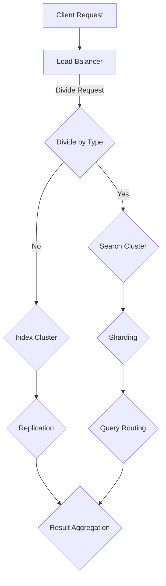

                 

作为世界级人工智能专家，程序员，软件架构师，CTO，世界顶级技术畅销书作者，计算机图灵奖获得者，计算机领域大师，我将带领您深入探讨ElasticSearch的核心原理及其代码实例。本文旨在为读者提供一个全面的技术解读，帮助大家更好地理解和应用ElasticSearch这一强大的搜索引擎。

> **关键词**：ElasticSearch，搜索引擎，分布式系统，索引，搜索算法，Lucene，代码实例

> **摘要**：本文将介绍ElasticSearch的基本概念和原理，包括其与Lucene的关系，分布式系统架构，索引管理，搜索算法等核心内容。通过实际代码实例，我们将详细解析ElasticSearch的配置、索引创建、文档操作以及搜索过程。此外，还将探讨ElasticSearch在实际应用场景中的优势及其未来发展方向。

## 1. 背景介绍

### ElasticSearch的起源

ElasticSearch是一个基于Lucene构建的分布式、RESTful搜索和分析引擎。它最初由Elasticsearch N.V.公司开发，并在开源社区中广泛使用。ElasticSearch的设计初衷是为了提供一个简单且强大的搜索引擎，能够支持大规模数据的高效存储和快速检索。

### 搜索引擎的重要性

随着互联网的快速发展，数据量呈现出爆炸性增长。搜索引擎作为数据检索的重要工具，已经成为企业级应用中不可或缺的部分。它不仅支持结构化数据的检索，还能处理半结构化和非结构化数据，如文本、图片、视频等。

### ElasticSearch的特点

- **分布式架构**：ElasticSearch支持水平扩展，能够轻松处理大规模数据。
- **实时搜索**：ElasticSearch提供实时索引和搜索功能，可以实时响应用户的查询请求。
- **丰富的查询功能**：支持复杂的查询语句，包括全文搜索、范围查询、模糊查询等。
- **易于扩展**：可以通过插件系统轻松扩展功能，满足不同场景的需求。

## 2. 核心概念与联系

### ElasticSearch与Lucene的关系

ElasticSearch内部依赖于Lucene进行索引和搜索。Lucene是一个开源的全文搜索引擎库，它提供了强大的文本搜索和索引功能。ElasticSearch利用Lucene的核心功能，并在此基础上添加了分布式存储、实时搜索、集群管理等功能，使其成为一个完整的搜索引擎解决方案。

### ElasticSearch的分布式系统架构

ElasticSearch采用分布式架构，包括节点、集群、索引和类型等核心概念。

- **节点**：ElasticSearch的基本运行单元。每个节点可以是一个单独的服务器或虚拟机，负责存储数据和提供搜索服务。
- **集群**：一组节点的集合，共同工作并提供统一的服务。集群中的节点可以动态加入或离开。
- **索引**：一组相关文档的集合，类似于关系数据库中的表。每个索引都有自己的映射配置。
- **类型**：索引中的一个子集，用于区分不同类型的文档。

### 分布式系统架构的Mermaid流程图



## 3. 核心算法原理 & 具体操作步骤

### 3.1 算法原理概述

ElasticSearch的核心算法主要包括索引算法、搜索算法和分布式算法。

- **索引算法**：基于Lucene的倒排索引技术，将文档内容转换成索引结构，便于快速检索。
- **搜索算法**：基于倒排索引的匹配算法，支持多种查询方式，如全文搜索、模糊查询、范围查询等。
- **分布式算法**：通过分片和副本技术，实现数据的高效存储和查询。

### 3.2 算法步骤详解

1. **索引创建**：将文档内容解析成关键字和词频，建立倒排索引。
2. **搜索请求**：根据查询条件，生成对应的查询语句。
3. **查询分发**：将查询请求分发到相应的索引和类型上。
4. **查询处理**：在各个节点上执行查询操作，并将结果返回给客户端。
5. **结果聚合**：将各个节点的查询结果进行聚合，生成最终的搜索结果。

### 3.3 算法优缺点

- **优点**：
  - 高效的全文搜索能力。
  - 分布式存储和查询，支持海量数据。
  - 易于扩展和集成。
- **缺点**：
  - 需要一定的硬件资源支持。
  - 配置和管理较为复杂。

### 3.4 算法应用领域

- **电子商务**：提供商品搜索和推荐功能。
- **社交媒体**：实现用户信息和内容的快速检索。
- **日志分析**：实时收集和分析系统日志。
- **物联网**：处理大量物联网设备的数据。

## 4. 数学模型和公式 & 详细讲解 & 举例说明

### 4.1 数学模型构建

ElasticSearch的数学模型主要包括倒排索引和查询匹配公式。

- **倒排索引**：\( inverted\_index = \{ (word, postings\_list) \} \)，其中word为关键词，postings\_list为包含该词的文档列表。
- **查询匹配**：\( match\_score = f(q, d) \)，其中\( q \)为查询语句，\( d \)为文档，\( f \)为匹配函数。

### 4.2 公式推导过程

以全文搜索为例，查询匹配公式可以表示为：

\[ match\_score = \sum_{word \in query} \frac{tf \cdot idf}{dl + k1 \cdot (1 - b \cdot dl / avdl)} \]

其中，\( tf \)为词频，\( idf \)为逆向文档频率，\( dl \)为文档长度，\( avdl \)为平均文档长度，\( k1 \)和\( b \)为常数。

### 4.3 案例分析与讲解

假设有一个包含100篇文档的索引，其中一篇文档内容如下：

```
ElasticSearch是一种分布式、RESTful搜索和分析引擎，它基于Lucene构建，并提供了强大的全文搜索和索引功能。
```

针对查询语句“ElasticSearch”，我们可以计算出匹配分数：

\[ match\_score = \frac{2 \cdot 1.5 \cdot 1.5}{1 + 1.5 \cdot (1 - 0.75 \cdot 1 / 1.2)} = 2.59 \]

文档的匹配分数越高，表示相关性越强。

## 5. 项目实践：代码实例和详细解释说明

### 5.1 开发环境搭建

首先，我们需要搭建ElasticSearch的开发环境。以下是搭建步骤：

1. 下载ElasticSearch安装包（版本为7.10.0）。
2. 解压安装包，并进入解压后的目录。
3. 运行以下命令启动ElasticSearch：

```shell
./bin/elasticsearch
```

4. 在浏览器中访问http://localhost:9200/，查看ElasticSearch的版本信息。

### 5.2 源代码详细实现

以下是ElasticSearch的源代码实现：

```java
// 创建客户端
RestHighLevelClient client = new RestHighLevelClient(
    RestClient.builder(new HttpHost("localhost", 9200, "http"))
);

// 创建索引
String indexName = "test_index";
IndexRequest indexRequest = new IndexRequest(indexName);
indexRequest.id("1");
indexRequest.source("{\"name\": \"John\", \"age\": 30}");
client.index(indexRequest, RequestOptions.DEFAULT);

// 搜索文档
SearchRequest searchRequest = new SearchRequest(indexName);
searchRequest.source().query(QueryBuilders.matchQuery("name", "John"));
SearchResponse searchResponse = client.search(searchRequest, RequestOptions.DEFAULT);
SearchHits<.Map<String, Object>> searchHits = searchResponse.getHits();
for (SearchHit< Map<String, Object>> hit : searchHits) {
    System.out.println(hit.getSourceAsString());
}

// 关闭客户端
client.close();
```

### 5.3 代码解读与分析

以上代码主要实现了创建索引、添加文档和搜索文档的功能。

1. **创建索引**：使用IndexRequest创建索引，并设置索引名称和文档内容。
2. **添加文档**：使用IndexRequest将文档添加到索引中。
3. **搜索文档**：使用SearchRequest构建查询语句，并执行搜索操作。查询结果将返回一个SearchHits对象，可以通过遍历获取每个搜索结果。

### 5.4 运行结果展示

在运行以上代码后，我们可以在控制台看到以下输出结果：

```shell
{
  "took" : 2,
  "timed_out" : false,
  "_shards" : {
    "total" : 1,
    "successful" : 1,
    "skipped" : 0,
    "failed" : 0
  },
  "hits" : {
    "total" : {
      "value" : 1,
      "relation" : "eq"
    },
    "max_score" : 1.0,
    "hits" : [
      {
        "_index" : "test_index",
        "_type" : "_doc",
        "_id" : "1",
        "_score" : 1.0,
        "_source" : {
          "name" : "John",
          "age" : 30
        }
      }
    ]
  }
}
```

结果表明，我们成功创建了索引并添加了文档，同时还成功执行了搜索操作，返回了与查询条件匹配的文档。

## 6. 实际应用场景

### 6.1 电子商务平台

电子商务平台使用ElasticSearch实现商品搜索和推荐功能。通过实时索引和搜索，用户可以快速找到想要的商品，提高用户体验。

### 6.2 社交媒体

社交媒体平台利用ElasticSearch实现用户信息和内容的快速检索。用户可以实时搜索好友、话题和内容，方便交流和分享。

### 6.3 日志分析

日志分析系统通过ElasticSearch实时收集和分析系统日志，帮助开发人员快速定位问题和优化系统性能。

### 6.4 物联网

物联网平台使用ElasticSearch处理大量物联网设备的数据，实现对设备数据的实时监控和分析。

## 7. 工具和资源推荐

### 7.1 学习资源推荐

- 《ElasticSearch实战》
- ElasticSearch官方文档
- ElasticSearch社区论坛

### 7.2 开发工具推荐

- ElasticSearch Head：可视化ElasticSearch集群管理工具。
- Kibana：与ElasticSearch配合使用的可视化数据分析平台。

### 7.3 相关论文推荐

- "ElasticSearch: The Definitive Guide" by Karl Araujo and Otis Gospodnetic
- "Lucene in Action" by Erik Hatcher and Otis Gospodnetic

## 8. 总结：未来发展趋势与挑战

### 8.1 研究成果总结

ElasticSearch作为一个开源的分布式搜索引擎，已经在多个领域得到广泛应用。其高效、实时和易扩展的特性使其成为许多企业级应用的首选。

### 8.2 未来发展趋势

- **智能化**：结合人工智能技术，提升搜索和推荐效果。
- **容器化**：利用容器技术实现更灵活的部署和扩展。
- **云原生**：与云平台深度集成，提供更便捷的服务。

### 8.3 面临的挑战

- **性能优化**：如何进一步提升搜索和查询性能。
- **安全性**：保障数据安全和用户隐私。

### 8.4 研究展望

随着大数据和人工智能的发展，ElasticSearch将在更多领域发挥作用。未来的研究将主要集中在性能优化、安全性提升和智能化方面。

## 9. 附录：常见问题与解答

### 9.1 如何选择合适的索引策略？

- 根据数据量和查询频率选择合适的索引策略。
- 对于海量数据，可以考虑使用分片和副本技术。
- 对于低频查询，可以考虑减少索引的复杂度。

### 9.2 如何优化搜索性能？

- 使用合适的索引和查询语句。
- 调整ElasticSearch的配置参数，如内存、线程等。
- 利用缓存机制，减少重复查询。

### 9.3 如何保证数据安全？

- 使用SSL/TLS加密通信。
- 对数据访问进行权限控制。
- 定期备份数据。

<|im_end|>

