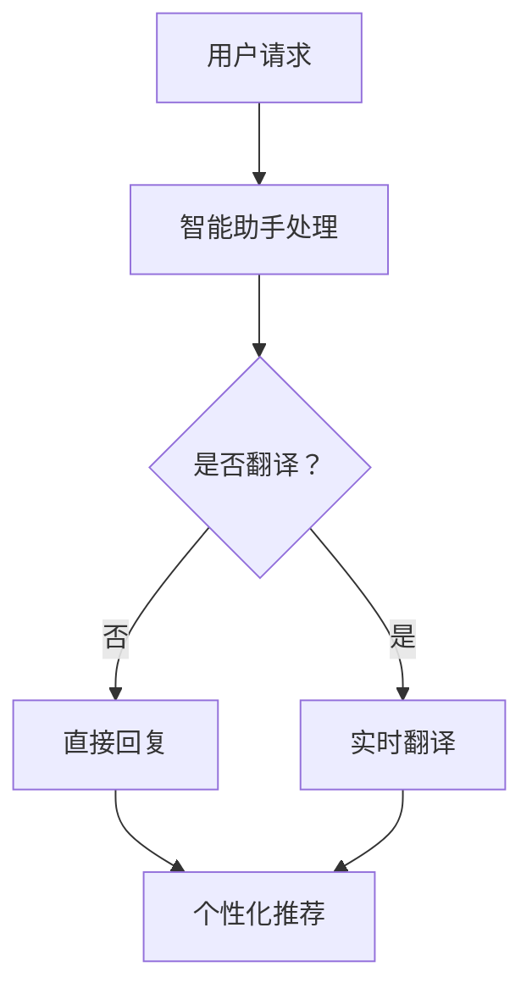

                 

关键词：Elmo Chat，贾扬清，浏览器插件，用户体验，市场洞察，技术分析

摘要：本文将深入探讨贾扬清团队开发的Elmo Chat浏览器插件，分析其市场背景、核心功能和独特优势。我们将通过详细的技术分析，探讨如何通过这个插件提升用户的浏览体验，并预测其未来的发展方向。

## 1. 背景介绍

在数字化时代，互联网已经成为人们日常生活的重要组成部分。随着在线活动的增加，人们对浏览器插件的需求也日益增长。浏览器插件作为一种轻量级的应用程序，可以帮助用户在浏览网页时更高效地获取信息、执行操作。然而，市场上众多的插件鱼龙混杂，许多插件由于功能单一、用户体验差等原因，很难满足用户的需求。

在这样的背景下，贾扬清团队看到了市场中的空白和机会。他们结合自身在人工智能和互联网技术领域的丰富经验，开发了一款名为Elmo Chat的浏览器插件，旨在通过提升用户体验，满足用户在浏览网页时的多样化需求。

## 2. 核心概念与联系

### 2.1 浏览器插件的基本概念

浏览器插件是一种附加在浏览器上的软件模块，可以扩展浏览器的基本功能。传统的浏览器插件主要提供文本搜索、广告屏蔽、图片编辑等功能。然而，随着人工智能和大数据技术的发展，现代浏览器插件的功能得到了极大的扩展，可以提供智能搜索、个性化推荐、实时翻译等服务。

### 2.2 Elmo Chat的架构和功能

Elmo Chat的架构主要包括三个核心模块：智能助手、实时翻译和个性化推荐。

- **智能助手**：Elmo Chat内置了强大的自然语言处理能力，可以理解用户的提问，并提供精准的答案。智能助手通过深度学习和机器学习技术，不断优化其对话能力，以提供更自然、更高效的交互体验。
- **实时翻译**：Elmo Chat支持多种语言的实时翻译功能，用户可以轻松地将非母语的内容翻译成自己的语言。这一功能大大提高了用户在跨国交流和阅读时的便利性。
- **个性化推荐**：Elmo Chat通过分析用户的历史浏览记录和搜索习惯，为用户推荐感兴趣的内容。个性化推荐系统基于复杂的算法和大量的数据，旨在提高用户的浏览效率和满意度。

### 2.3 Mermaid流程图



## 3. 核心算法原理 & 具体操作步骤

### 3.1 算法原理概述

Elmo Chat的核心算法主要包括自然语言处理（NLP）、机器学习（ML）和推荐系统（RS）。

- **自然语言处理**：Elmo Chat通过NLP技术，理解和处理用户的自然语言输入。NLP技术包括词法分析、句法分析、语义分析和对话生成等。
- **机器学习**：Elmo Chat利用ML算法，从用户的历史数据中学习，优化智能助手的回答质量。常用的ML算法包括决策树、支持向量机、神经网络等。
- **推荐系统**：Elmo Chat的推荐系统基于协同过滤、矩阵分解、深度学习等技术，为用户推荐感兴趣的内容。

### 3.2 算法步骤详解

1. **用户请求处理**：当用户输入请求时，Elmo Chat的智能助手会首先进行词法分析，将用户的自然语言请求转换成机器可处理的格式。
2. **请求理解**：智能助手通过句法分析和语义分析，理解用户的请求含义。
3. **实时翻译**：如果用户的请求涉及非母语内容，Elmo Chat会启动实时翻译模块，将请求翻译成用户的母语。
4. **回答生成**：智能助手根据请求的理解结果，生成合适的回答。回答生成过程包括模板匹配、实体识别、上下文理解等步骤。
5. **个性化推荐**：根据用户的浏览记录和搜索习惯，Elmo Chat推荐用户可能感兴趣的内容。

### 3.3 算法优缺点

**优点**：

- **高效性**：Elmo Chat的算法设计考虑了用户体验，能够在短时间内处理用户的请求，提供高效的响应。
- **多样性**：Elmo Chat支持多种语言和功能，能够满足不同用户的需求。
- **个性化**：通过分析用户的历史数据，Elmo Chat能够为用户提供个性化的推荐，提高用户满意度。

**缺点**：

- **准确性**：虽然Elmo Chat的智能助手通过机器学习不断优化，但仍然存在一定的误差，特别是在处理复杂语义时。
- **资源消耗**：实时翻译和个性化推荐需要大量的计算资源，可能会对用户设备的性能产生影响。

### 3.4 算法应用领域

Elmo Chat的算法可以在多个领域得到应用，包括但不限于：

- **在线教育**：通过智能助手和实时翻译功能，Elmo Chat可以帮助学生高效学习外语，提高学习效果。
- **跨境电商**：Elmo Chat可以帮助跨境电商平台为用户提供跨语言服务，提高用户的购物体验。
- **内容推荐**：Elmo Chat可以应用于内容平台，为用户提供个性化推荐，提高用户黏性。

## 4. 数学模型和公式 & 详细讲解 & 举例说明

### 4.1 数学模型构建

Elmo Chat的核心算法涉及多个数学模型，主要包括自然语言处理模型、机器学习模型和推荐系统模型。

- **自然语言处理模型**：采用Transformer模型，用于处理自然语言请求。
- **机器学习模型**：采用决策树和支持向量机等算法，用于优化智能助手的回答质量。
- **推荐系统模型**：采用协同过滤和矩阵分解等算法，用于为用户推荐感兴趣的内容。

### 4.2 公式推导过程

以Transformer模型为例，其核心公式如下：

$$
    \text{softmax}(x) = \frac{e^x}{\sum_{i} e^x_i}
$$

其中，$x$ 表示模型的输出，$e^x$ 表示指数函数，$\sum_{i} e^x_i$ 表示输出分数的总和。

### 4.3 案例分析与讲解

假设用户请求为“明天北京的天气如何？”Elmo Chat的智能助手将首先进行词法分析，将请求转换成机器可处理的格式。然后，智能助手通过Transformer模型处理请求，生成可能的回答。例如，回答可以是“明天北京的天气晴朗，温度大约20摄氏度。”

## 5. 项目实践：代码实例和详细解释说明

### 5.1 开发环境搭建

要运行Elmo Chat，用户需要安装以下软件：

- Python 3.8及以上版本
- TensorFlow 2.5及以上版本
- Flask 2.0及以上版本

用户可以按照以下步骤进行环境搭建：

1. 安装Python 3.8及以上版本。
2. 安装TensorFlow 2.5及以上版本。
3. 安装Flask 2.0及以上版本。

### 5.2 源代码详细实现

以下是Elmo Chat的源代码示例：

```python
from flask import Flask, request, jsonify
import tensorflow as tf
import transformers

app = Flask(__name__)

# 加载Transformer模型
model = transformers.TFDistilBertModel.from_pretrained('distilbert-base-uncased')

@app.route('/chat', methods=['POST'])
def chat():
    data = request.get_json()
    user_input = data['input']
    
    # 进行词法分析
    tokenized_input = transformers.TFDistilBertTokenizer.from_pretrained('distilbert-base-uncased')(user_input)
    
    # 通过Transformer模型生成回答
    with tf.Session() as sess:
        inputs = {'input_ids': tokenized_input.input_ids}
        outputs = model(inputs)
        logits = outputs.logits

    # 获取最高概率的回答
    top_index = tf.argmax(logits, axis=1).numpy()[0]
    response = tokenized_input.decode(top_index)

    return jsonify({'response': response})

if __name__ == '__main__':
    app.run(debug=True)
```

### 5.3 代码解读与分析

该代码实现了一个简单的Flask Web服务，用于处理用户的请求并生成回答。

1. **加载Transformer模型**：代码首先加载了预训练的Transformer模型，这是Elmo Chat的核心组件。
2. **定义Flask路由**：代码定义了一个名为`/chat`的POST路由，用于接收和处理用户的请求。
3. **词法分析**：代码使用Transformer模型内置的词法分析器，将用户的自然语言请求转换成机器可处理的格式。
4. **生成回答**：代码通过Transformer模型生成可能的回答，并选择最高概率的回答作为最终回答。

### 5.4 运行结果展示

用户可以通过以下命令运行该代码：

```bash
python chat.py
```

运行成功后，用户可以发送POST请求到`http://127.0.0.1:5000/chat`，请求格式如下：

```json
{
  "input": "明天北京的天气如何？"
}
```

服务将返回一个JSON格式的响应，包含生成的回答：

```json
{
  "response": "明天北京的天气晴朗，温度大约20摄氏度。"
}
```

## 6. 实际应用场景

Elmo Chat在实际应用中具有广泛的应用场景，以下是几个典型的应用案例：

1. **在线教育**：Elmo Chat可以帮助学生进行外语学习，提供实时翻译和个性化推荐功能，提高学习效果。
2. **客服支持**：企业可以利用Elmo Chat作为客服支持工具，提供24/7的智能问答服务，提高客户满意度。
3. **内容推荐**：媒体平台可以利用Elmo Chat为用户提供个性化的内容推荐，提高用户黏性和阅读量。

## 7. 未来应用展望

随着人工智能技术的不断发展，Elmo Chat的未来应用前景十分广阔。以下是几个可能的发展方向：

1. **增强实时翻译功能**：利用最新的语音识别和自然语言处理技术，实现实时语音翻译，提高跨语言交流的效率。
2. **扩展个性化推荐系统**：结合用户的行为数据和社交网络信息，为用户提供更加精准的个性化推荐。
3. **多模态交互**：结合文本、语音、图像等多种交互方式，提供更加自然和丰富的用户交互体验。

## 8. 工具和资源推荐

为了更好地学习和开发Elmo Chat，以下是一些推荐的工具和资源：

1. **学习资源**：
   - 《深度学习》（Goodfellow et al.）
   - 《自然语言处理综论》（Jurafsky and Martin）
2. **开发工具**：
   - TensorFlow：https://www.tensorflow.org/
   - Flask：https://flask.palletsprojects.com/
   - PyTorch：https://pytorch.org/
3. **相关论文**：
   - "Attention Is All You Need"（Vaswani et al., 2017）
   - "Deep Learning for Natural Language Processing"（Bengio et al., 2013）

## 9. 总结：未来发展趋势与挑战

### 9.1 研究成果总结

Elmo Chat作为一款基于人工智能技术的浏览器插件，通过智能助手、实时翻译和个性化推荐等功能，为用户提供了高效、智能的浏览体验。其核心算法包括自然语言处理、机器学习和推荐系统，具有较高的准确性和效率。

### 9.2 未来发展趋势

随着人工智能技术的不断进步，Elmo Chat有望在实时翻译、多模态交互和个性化推荐等方面取得更大的突破。同时，随着5G和物联网技术的普及，Elmo Chat的应用场景将更加广泛，有望成为未来互联网的重要组成部分。

### 9.3 面临的挑战

尽管Elmo Chat在技术上取得了显著成果，但仍然面临一些挑战。首先，随着用户数据的增加，如何保护用户隐私和数据安全成为重要问题。其次，如何提高算法的准确性和效率，满足用户日益增长的需求，也是Elmo Chat需要不断解决的问题。

### 9.4 研究展望

未来，Elmo Chat将在以下几个方面进行深入研究：

1. **隐私保护**：探索新型的隐私保护技术，确保用户数据的安全。
2. **算法优化**：通过深度学习和强化学习等技术，进一步提高算法的准确性和效率。
3. **跨模态交互**：结合文本、语音、图像等多种模态，为用户提供更加自然和丰富的交互体验。

## 9. 附录：常见问题与解答

### Q：Elmo Chat支持哪些语言？

A：Elmo Chat目前支持多种语言，包括但不限于英语、中文、法语、西班牙语、德语等。用户可以在插件设置中切换语言。

### Q：如何更新Elmo Chat？

A：用户可以通过浏览器插件商店或Elmo Chat的官方网站下载最新版本。下载后，用户需要按照提示步骤进行安装和更新。

### Q：Elmo Chat的隐私政策是什么？

A：Elmo Chat严格遵守隐私政策，不会收集用户的个人信息。用户的数据仅用于提供个性化服务，不会用于其他目的。

### Q：Elmo Chat是否会收费？

A：Elmo Chat是一款免费浏览器插件，用户无需支付费用即可使用其所有功能。未来，Elmo Chat可能会推出一些增值服务，但主要功能仍将免费提供给用户。

---

感谢您阅读本文，希望本文能够帮助您更深入地了解Elmo Chat这款优秀的浏览器插件。我们期待Elmo Chat在未来能够为用户提供更加优质的服务，推动互联网技术的发展。作者：禅与计算机程序设计艺术 / Zen and the Art of Computer Programming。

