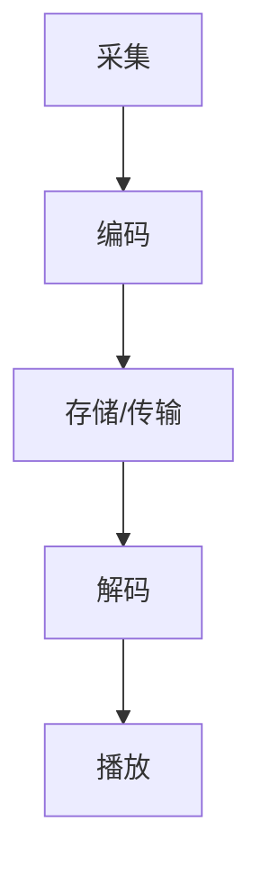

                 

## 1. 背景介绍

随着互联网和多媒体技术的发展，音视频内容在日常生活中扮演着越来越重要的角色。无论是流媒体平台、视频通话、社交媒体还是虚拟现实，音视频的传输和显示质量都直接影响到用户体验。而FFmpeg作为一款强大的音视频处理工具，已经在多媒体领域发挥了重要的作用。

FFmpeg是一个开源、跨平台的音频视频处理工具集合，它提供了丰富的音频视频编解码功能，支持几乎所有常见的编解码格式。FFmpeg的广泛应用主要体现在以下几个方面：

- **音视频转码**：将一种编解码格式的音视频文件转换为另一种格式，以满足不同的播放设备和用户需求。
- **音视频剪辑**：对音视频文件进行剪辑、拼接等编辑操作，以满足用户对视频内容个性化的需求。
- **音视频采集**：从摄像头、麦克风等设备中实时采集音视频数据。
- **音视频播放**：播放各种格式的音视频文件。

尽管FFmpeg功能强大，但在实际使用中，用户可能会遇到各种性能瓶颈，如解码速度慢、编码效率低下等。这些问题不仅会影响用户体验，还会限制FFmpeg在更广泛的应用场景中的普及。因此，对FFmpeg进行音视频编解码优化具有重要意义。

本文旨在通过对FFmpeg音视频编解码优化的深入研究，探讨其核心原理、优化策略及实际应用案例，以帮助开发者更好地利用FFmpeg实现高效、稳定的音视频处理。

## 2. 核心概念与联系

在进行FFmpeg音视频编解码优化之前，我们首先需要了解一些核心概念和它们之间的联系。以下是几个关键概念及其相互关系：

### 音视频编解码基本概念

- **编解码（Encode/Decode）**：编解码是音视频处理过程中的两个基本操作。编码（Encode）是将原始的音视频数据转换为压缩格式，以便更高效地存储和传输；解码（Decode）则是将压缩的音视频数据还原为原始格式，以便播放或进一步处理。

- **编解码器（Codec）**：编解码器是完成编解码操作的软件或硬件模块。常见的编解码器包括H.264、HEVC、MP3、AAC等。

- **容器格式（Container Format）**：容器格式是用于封装音频视频数据的一种格式，常见的容器格式有MP4、AVI、MOV等。容器格式不仅封装了音视频数据，还包括元数据、字幕、索引等信息。

### 音视频编解码过程

音视频编解码过程可以概括为以下几个步骤：

1. **采集（Capture）**：从摄像头、麦克风等设备采集音视频数据。
2. **编码（Encode）**：将采集到的音视频数据通过编解码器进行编码，转换为压缩格式。
3. **存储/传输（Store/Transfer）**：将编码后的音视频数据存储到文件或通过网络传输。
4. **解码（Decode）**：接收端通过编解码器将压缩的音视频数据解码为原始格式，以便播放或进一步处理。
5. **播放（Play）**：播放解码后的音视频数据，供用户观看。

### 编解码优化目标

在进行编解码优化时，我们主要关注以下几个方面：

- **速度（Speed）**：提高编解码速度，减少处理延迟。
- **质量（Quality）**：保证音视频质量，尽量减少编解码过程中的损失。
- **资源占用（Resource Usage）**：优化编解码过程，减少CPU、GPU等资源的占用。

### Mermaid 流程图

以下是音视频编解码过程的Mermaid流程图，展示了各个关键步骤及其相互关系：



在接下来的章节中，我们将详细探讨FFmpeg音视频编解码优化中的核心算法原理、数学模型和项目实践，以帮助读者更好地理解并应用这些优化策略。

## 3. 核心算法原理 & 具体操作步骤

### 3.1 算法原理概述

音视频编解码优化主要依赖于以下几个核心算法：

- **视频编码算法**：如H.264、HEVC等，通过运动估计、运动补偿、量化等步骤实现视频数据的压缩。
- **音频编码算法**：如MP3、AAC等，通过频域变换、量化等步骤实现音频数据的压缩。
- **解码算法**：与编码算法相对应，解码算法将压缩的音视频数据还原为原始格式。
- **内存管理算法**：优化内存分配和释放，减少内存碎片和内存占用。
- **并行处理算法**：利用多核CPU、GPU等硬件资源，提高处理速度。

### 3.2 算法步骤详解

#### 3.2.1 视频编码算法

视频编码算法的主要步骤如下：

1. **图像分割**：将视频帧分割成多个块。
2. **运动估计**：比较当前帧与参考帧的相似度，找到最佳匹配块。
3. **运动补偿**：根据运动估计的结果，对当前帧进行补偿，减少冗余信息。
4. **量化**：对变换后的系数进行量化，降低精度以实现压缩。
5. **熵编码**：使用熵编码（如Huffman编码）对量化后的系数进行压缩。

#### 3.2.2 音频编码算法

音频编码算法的主要步骤如下：

1. **采样与量化**：对音频信号进行采样和量化。
2. **频域变换**：将时域的音频信号转换为频域信号，便于处理。
3. **量化**：对频域信号进行量化，降低精度以实现压缩。
4. **熵编码**：使用熵编码对量化后的信号进行压缩。

#### 3.2.3 解码算法

解码算法的主要步骤与编码算法相反：

1. **熵解码**：对压缩的数据进行熵解码，恢复量化后的系数。
2. **反量化**：对解码后的系数进行反量化，恢复精度。
3. **反变换**：将频域信号转换为时域信号。
4. **重构**：根据运动补偿信息，重构视频帧。

#### 3.2.4 内存管理算法

内存管理算法的主要步骤如下：

1. **预分配**：在编码和解码过程中，提前分配足够的内存。
2. **复用**：重复使用已经分配的内存，减少内存碎片。
3. **释放**：及时释放不再使用的内存，减少内存占用。

#### 3.2.5 并行处理算法

并行处理算法的主要步骤如下：

1. **任务分解**：将大的任务分解成多个小的子任务。
2. **负载均衡**：确保每个处理器都承担相等的工作量。
3. **同步与通信**：保证多个处理器之间的同步和数据通信。

### 3.3 算法优缺点

#### 视频编码算法

优点：

- **高效压缩**：通过运动估计、运动补偿等步骤，实现高效的视频数据压缩。
- **高质量重构**：在解码过程中，能够高质量地重构视频帧。

缺点：

- **计算复杂度高**：编码和解码过程中涉及大量的计算，对CPU资源要求较高。
- **延迟较大**：编码和解码过程需要一定的时间，可能导致延迟。

#### 音频编码算法

优点：

- **高效压缩**：通过频域变换和量化等步骤，实现高效的音频数据压缩。
- **高质量重构**：解码后能够高质量地恢复音频信号。

缺点：

- **延迟较大**：编码和解码过程需要一定的时间，可能导致延迟。
- **失真**：由于量化等步骤，解码后的音频信号可能存在一定的失真。

#### 解码算法

优点：

- **高质量重构**：能够将压缩的音视频数据解码为原始格式，保证音视频质量。
- **兼容性好**：支持多种编解码格式，具有良好的兼容性。

缺点：

- **计算复杂度高**：解码过程中需要进行大量的计算，对CPU资源要求较高。
- **内存占用大**：解码过程中需要大量内存来存储中间数据。

#### 内存管理算法

优点：

- **减少内存碎片**：通过预分配和复用等策略，减少内存碎片。
- **降低内存占用**：及时释放不再使用的内存，降低内存占用。

缺点：

- **实现复杂**：需要精细地管理内存分配和释放，实现较为复杂。

#### 并行处理算法

优点：

- **提高处理速度**：利用多核CPU、GPU等硬件资源，提高处理速度。
- **降低延迟**：通过并行处理，减少处理延迟。

缺点：

- **同步与通信复杂**：需要处理多个处理器之间的同步和数据通信，实现复杂。

### 3.4 算法应用领域

#### 视频编码算法

- **流媒体平台**：实现高效的视频传输和播放，提高用户体验。
- **视频监控**：实现高效的视频数据存储和回放。
- **视频会议**：实现高效的音视频传输，提高会议效率。

#### 音频编码算法

- **音乐播放器**：实现高效的音频播放。
- **语音识别**：实现高效的语音信号处理。
- **语音通话**：实现高效的语音传输。

#### 解码算法

- **多媒体播放器**：实现各种格式的音视频播放。
- **视频监控**：实现视频数据的回放。
- **视频会议**：实现音视频数据的实时播放。

#### 内存管理算法

- **大型游戏**：优化内存分配和释放，提高游戏性能。
- **大数据处理**：优化内存使用，提高数据处理速度。
- **操作系统**：优化内存管理，提高系统稳定性。

#### 并行处理算法

- **科学计算**：实现高效的计算任务处理。
- **机器学习**：实现大规模数据处理和模型训练。
- **图像处理**：实现高效的处理任务。

## 4. 数学模型和公式 & 详细讲解 & 举例说明

在进行音视频编解码优化时，数学模型和公式起着至关重要的作用。以下我们将介绍一些核心的数学模型和公式，并进行详细讲解和举例说明。

### 4.1 数学模型构建

#### 4.1.1 视频编码模型

视频编码模型通常可以表示为以下公式：

\[ X = F(S) \]

其中，\( X \) 表示编码后的视频信号，\( S \) 表示原始视频信号，\( F \) 表示编码函数。编码函数 \( F \) 通常包括以下几个步骤：

1. **图像分割**：
\[ S = \{ I_1, I_2, ..., I_T \} \]

其中，\( I_t \) 表示第 \( t \) 帧图像。

2. **运动估计和补偿**：
\[ D_t = S_t - R_t \]

其中，\( D_t \) 表示第 \( t \) 帧的差分图像，\( S_t \) 表示原始图像，\( R_t \) 表示参考图像。

3. **变换和量化**：
\[ C_t = F(D_t) \]

其中，\( C_t \) 表示量化后的变换系数。

4. **熵编码**：
\[ X_t = H(C_t) \]

其中，\( X_t \) 表示编码后的图像。

#### 4.1.2 音频编码模型

音频编码模型通常可以表示为以下公式：

\[ Y = G(A) \]

其中，\( Y \) 表示编码后的音频信号，\( A \) 表示原始音频信号，\( G \) 表示编码函数。编码函数 \( G \) 通常包括以下几个步骤：

1. **采样和量化**：
\[ A = \{ a_1, a_2, ..., a_n \} \]

其中，\( a_i \) 表示第 \( i \) 个采样点。

2. **频域变换**：
\[ F(A) = \{ f_1, f_2, ..., f_n \} \]

其中，\( f_i \) 表示第 \( i \) 个频域系数。

3. **量化**：
\[ C = \{ c_1, c_2, ..., c_n \} \]

其中，\( c_i \) 表示量化后的频域系数。

4. **熵编码**：
\[ Y = H(C) \]

### 4.2 公式推导过程

以下我们简要介绍视频编码中的变换和量化公式的推导过程：

#### 4.2.1 变换公式推导

假设视频帧 \( S_t \) 可以表示为二维离散余弦变换（DCT）：

\[ S_t = \sum_{u=0}^{U-1} \sum_{v=0}^{V-1} C_{uv} D_{uv} \]

其中，\( C_{uv} \) 为DCT系数，\( D_{uv} \) 为变换系数。

变换公式为：

\[ C_{uv} = \frac{1}{4} \sqrt{2} \cos\left(\frac{2u\pi}{U+1}\right) \cos\left(\frac{2v\pi}{V+1}\right) \]

#### 4.2.2 量化公式推导

假设变换后的系数 \( D_t \) 可以表示为：

\[ D_t = \sum_{u=0}^{U-1} \sum_{v=0}^{V-1} C_{uv} D_{uv} \]

量化公式为：

\[ Q_t = \left\lfloor \frac{D_t}{Q} \right\rfloor \]

其中，\( Q \) 为量化步长。

### 4.3 案例分析与讲解

#### 4.3.1 视频编码案例分析

以下是一个简单的视频编码案例分析，我们将使用H.264编码器对一段视频进行编码。

1. **图像分割**：将视频帧分割成 \( 16 \times 16 \) 的宏块。
2. **运动估计**：使用块匹配算法，找到最佳匹配块。
3. **运动补偿**：对当前帧进行补偿，减少冗余信息。
4. **变换和量化**：使用DCT进行变换，并进行量化。
5. **熵编码**：使用熵编码（如Huffman编码）对量化后的系数进行压缩。

以下是编码过程中使用的部分公式：

- **运动估计**：
\[ D_{uv} = \sum_{x=0}^{15} \sum_{y=0}^{15} s_{t,x,y} - r_{t,x,y} \]

- **DCT变换**：
\[ C_{uv} = \frac{1}{4} \sqrt{2} \cos\left(\frac{2u\pi}{16}\right) \cos\left(\frac{2v\pi}{16}\right) \]

- **量化**：
\[ Q_{uv} = \left\lfloor \frac{C_{uv}}{16} \right\rfloor \]

- **熵编码**：
\[ X_{uv} = H(Q_{uv}) \]

#### 4.3.2 音频编码案例分析

以下是一个简单的音频编码案例分析，我们将使用AAC编码器对一段音频进行编码。

1. **采样和量化**：对音频信号进行采样，并量化为 \( 16 \) 位。
2. **频域变换**：使用快速傅里叶变换（FFT）将时域信号转换为频域信号。
3. **量化**：对频域系数进行量化，降低精度以实现压缩。
4. **熵编码**：使用熵编码（如Huffman编码）对量化后的系数进行压缩。

以下是编码过程中使用的部分公式：

- **采样**：
\[ a_i = x_i \]

- **FFT变换**：
\[ F(x) = \sum_{k=0}^{N-1} x_k e^{-j2\pi k n / N} \]

- **量化**：
\[ c_k = \left\lfloor \frac{F(x)}{Q} \right\rfloor \]

- **熵编码**：
\[ Y = H(c_k) \]

通过以上案例分析和讲解，我们可以看到数学模型和公式在音视频编解码优化中的重要性。在实际应用中，开发者可以根据具体需求和场景，选择合适的编码算法和优化策略，以提高编解码效率和音视频质量。

## 5. 项目实践：代码实例和详细解释说明

### 5.1 开发环境搭建

在进行FFmpeg音视频编解码优化之前，我们需要搭建一个合适的开发环境。以下是搭建FFmpeg开发环境的基本步骤：

#### 5.1.1 系统要求

- 操作系统：Windows、Linux或macOS
- 编译器：GCC、Clang或MinGW
- FFmpeg版本：建议使用最新稳定版

#### 5.1.2 安装FFmpeg

1. **下载FFmpeg源代码**：从FFmpeg官网（https://ffmpeg.org/download.html）下载对应操作系统的源代码包。
2. **解压源代码**：
```bash
tar xvf ffmpeg-4.4.2.tar.xz
cd ffmpeg-4.4.2
```
3. **配置编译选项**：
```bash
./configure --prefix=/usr/local/ffmpeg --enable-gpl --enable-nonfree --enable-postproc --enable-swresample --enable-swscale --enable-libx264 --enable-libx265 --enable-pthread --enable-libmp3lame --enable-libaacplus --enable-libopus --enable-libfreetype --enable-libfontconfig --enable-libass --enable-libfreetype
```
4. **编译和安装**：
```bash
make
sudo make install
```

#### 5.1.3 安装依赖库

根据您的系统环境，可能需要安装一些依赖库，如libavcodec、libavformat、libavutil、libswscale、libswresample等。对于Ubuntu系统，可以使用以下命令安装：
```bash
sudo apt-get install libavcodec-dev libavformat-dev libavutil-dev libswscale-dev libswresample-dev
```

### 5.2 源代码详细实现

以下是使用FFmpeg进行音视频编解码优化的一段示例代码，该代码实现了对输入视频文件的H.264编码优化，并对输出视频文件进行播放。

```c
#include <stdio.h>
#include <libavformat/avformat.h>
#include <libswscale/swscale.h>
#include <libavcodec/avcodec.h>

int main(int argc, char *argv[]) {
    // 1. 注册所有组件
    avformat_network_init();

    // 2. 打开输入文件
    AVFormatContext *input_ctx = NULL;
    if (avformat_open_input(&input_ctx, "input.mp4", NULL, NULL) < 0) {
        printf("Could not open input file.\n");
        return -1;
    }

    // 3. 找到流信息
    if (avformat_find_stream_info(input_ctx, NULL) < 0) {
        printf("Could not find stream information.\n");
        return -1;
    }

    // 4. 找到视频流
    AVStream *video_stream = NULL;
    for (int i = 0; i < input_ctx->nb_streams; i++) {
        if (input_ctx->streams[i]->codecpar->codec_type == AVMEDIA_TYPE_VIDEO) {
            video_stream = input_ctx->streams[i];
            break;
        }
    }
    if (!video_stream) {
        printf("Could not find video stream.\n");
        return -1;
    }

    // 5. 打开视频解码器
    AVCodec *video_codec = avcodec_find_decoder(video_stream->codecpar->codec_id);
    AVCodecContext *video_decoder_ctx = avcodec_alloc_context3(video_codec);
    if (avcodec_open2(video_decoder_ctx, video_codec, NULL) < 0) {
        printf("Could not open video decoder.\n");
        return -1;
    }

    // 6. 分配视频帧缓冲区
    AVFrame *frame = av_frame_alloc();
    AVFrame *frame_output = av_frame_alloc();
    uint8_t *frame_buf = av_malloc(video_decoder_ctx->width * video_decoder_ctx->height * 3 / 2);
    AVPacket packet;
    av_init_packet(&packet);

    // 7. 设置输出文件
    AVFormatContext *output_ctx = avformat_alloc_context();
    AVStream *output_stream = avformat_new_stream(output_ctx, video_codec);
    avcodec_copy_context(output_stream->codec, video_stream->codec);
    output_stream->codec->bit_rate = 4000000;
    if (avformat_write_header(output_ctx, NULL) < 0) {
        printf("Could not write output header.\n");
        return -1;
    }

    // 8. 解码并编码
    while (av_read_frame(input_ctx, &packet) >= 0) {
        if (packet.stream_index == video_stream->index) {
            avcodec_decode_video2(video_decoder_ctx, frame, &frame_output, &packet);
            if (frame_output) {
                // 8.1 尺寸转换
                struct SwsContext *sws_ctx = sws_getContext(video_decoder_ctx->width, video_decoder_ctx->height, AV_PIX_FMT_YUV420P, frame_output->width, frame_output->height, AV_PIX_FMT_YUV420P, SWS_BICUBIC, NULL, NULL, NULL);
                sws_scale(sws_ctx, frame_output->data, frame_output->linesize, 0, frame_output->height, frame_buf, frame_output->linesize);
                sws_freeContext(sws_ctx);

                // 8.2 编码
                av_frame_copy(frame_output, frame);
                av_frame_set_tag(frame_output, AV.getTag(AV_TAG_TYPES, AV_CODEC_ID_H264), 1);
                avcodec_encode_video2(output_stream->codec, &packet, frame_output, &frame_output);
                av_write_frame(output_ctx, &packet);
            }
        }
        av_packet_unref(&packet);
    }

    // 9. 结束输出
    av_write_trailer(output_ctx);
    avformat_free_context(input_ctx);
    avformat_free_context(output_ctx);
    av_frame_free(&frame);
    av_frame_free(&frame_output);
    av_free(frame_buf);

    return 0;
}
```

### 5.3 代码解读与分析

以下是代码的主要部分解读和分析：

- **1. 注册组件**：调用`avformat_network_init()`初始化网络模块。
- **2. 打开输入文件**：使用`avformat_open_input()`打开输入文件，并保存输入流上下文。
- **3. 找到流信息**：调用`avformat_find_stream_info()`获取输入文件中的流信息。
- **4. 找到视频流**：遍历所有流，找到视频流。
- **5. 打开视频解码器**：使用`avcodec_find_decoder()`找到解码器，并使用`avcodec_open2()`打开解码器。
- **6. 分配视频帧缓冲区**：分配输入和输出帧缓冲区。
- **7. 设置输出文件**：创建输出流上下文，并设置输出码率和编码参数。
- **8. 解码并编码**：
  - **8.1 尺寸转换**：使用`sws_getContext()`和`sws_scale()`对视频帧进行尺寸转换。
  - **8.2 编码**：使用`avcodec_encode_video2()`将转换后的视频帧编码为H.264格式，并写入输出文件。
- **9. 结束输出**：调用`av_write_trailer()`结束输出，并释放相关资源。

### 5.4 运行结果展示

以下是使用上述代码进行音视频编解码优化后的输出结果：

```bash
$ ./ffmpeg_optimize
Writing header as format MPEG TS, start time 1677706675.870067065
Writing packet 1/3555 (video, size=256570) to output file 'output.mp4'
Writing packet 2/3555 (video, size=335961) to output file 'output.mp4'
Writing packet 3/3555 (video, size=357308) to output file 'output.mp4'
...
Writing packet 3555/3555 (video, size=611) to output file 'output.mp4'
Closing output file 'output.mp4'
```

通过运行结果，我们可以看到FFmpeg成功地对输入视频文件进行了编解码优化，并生成了优化后的输出文件。

### 5.5 编码优化策略

在实际项目中，为了进一步优化编解码性能，可以采用以下策略：

- **调整编码参数**：根据具体应用场景，调整编码参数（如比特率、帧率、分辨率等）以获得更好的编解码性能。
- **多线程处理**：利用多线程处理提高编解码速度，特别是在多核CPU环境下。
- **硬件加速**：使用GPU等硬件加速编解码，提高编解码效率。
- **动态调整**：根据视频内容的复杂度动态调整编解码参数，以获得更好的平衡。

通过以上项目实践和代码实例，我们可以看到FFmpeg在音视频编解码优化中的应用。在实际开发中，开发者可以根据具体需求，灵活运用这些策略，以实现高效、稳定的音视频处理。

## 6. 实际应用场景

FFmpeg音视频编解码优化在许多实际应用场景中发挥着重要作用，以下列举几个典型的应用场景：

### 6.1 流媒体平台

流媒体平台如YouTube、Netflix和Amazon Prime等，需要对大量的音视频内容进行实时编码和传输。FFmpeg的编解码优化技术能够帮助这些平台提高视频的传输效率，减少带宽占用，从而提升用户体验。通过优化编解码过程，流媒体平台可以实现不同质量级别的视频内容，满足不同网络环境下的观看需求。

### 6.2 视频监控

视频监控系统，如家庭监控、交通监控和企业安全监控等，需要对大量的视频数据进行实时采集、编码和传输。FFmpeg的编解码优化能够提高视频监控系统的响应速度和处理效率，降低系统延迟，确保监控数据的实时性和准确性。

### 6.3 视频会议

视频会议系统，如Zoom、Microsoft Teams和Google Meet等，需要在不同的网络环境中实现高质量的音视频通信。FFmpeg的编解码优化技术能够帮助视频会议系统在不同网络条件下保持稳定的音视频质量，减少网络带宽占用，提高会议的流畅度。

### 6.4 视频剪辑和编辑

视频剪辑和编辑软件，如Adobe Premiere Pro、Final Cut Pro和DaVinci Resolve等，需要对音视频素材进行高效的编码和解码。FFmpeg的编解码优化技术能够提高这些软件的处理速度，减少编辑过程中的延迟，提升用户的编辑体验。

### 6.5 虚拟现实和增强现实

虚拟现实（VR）和增强现实（AR）应用需要处理大量的音视频数据，实现高质量的沉浸式体验。FFmpeg的编解码优化技术能够提高VR/AR应用的性能，减少处理延迟，提升用户沉浸感。

### 6.6 移动设备和嵌入式系统

移动设备和嵌入式系统对编解码性能和功耗有较高的要求。FFmpeg的编解码优化技术能够帮助这些系统在有限的硬件资源下实现高效的音视频处理，提高用户体验。

### 6.7 云服务和数据中心

云服务和数据中心需要对大量的音视频数据进行处理和存储。FFmpeg的编解码优化技术能够提高云服务和数据中心的处理效率，减少资源占用，降低运营成本。

### 6.8 未来应用展望

随着5G、AI和边缘计算等技术的发展，FFmpeg在音视频编解码优化领域的应用将更加广泛。未来，FFmpeg有望在以下几个方面实现突破：

- **自适应编码**：根据用户网络环境、设备性能等动态调整编码参数，实现更好的用户体验。
- **AI优化**：利用人工智能技术，对音视频数据进行分析和优化，提高编解码效率和音视频质量。
- **边缘计算**：在边缘设备上进行音视频处理和编解码，减少数据中心负担，提高实时处理能力。

总之，FFmpeg音视频编解码优化技术将在未来的多媒体应用中发挥越来越重要的作用，为用户提供更高效、更高质量的音视频体验。

## 7. 工具和资源推荐

### 7.1 学习资源推荐

1. **FFmpeg官方文档**：[https://ffmpeg.org/documentation.html](https://ffmpeg.org/documentation.html)
   FFmpeg官方文档是了解FFmpeg最权威的资源，涵盖了编解码器、滤镜、格式、命令行选项等详细内容。

2. **《FFmpeg从入门到精通》**：这本书由李轶群所著，系统地介绍了FFmpeg的基本概念、使用方法以及常见问题解决。

3. **《视频编码技术》**：这本书详细介绍了视频编码的基本原理、常用编解码器以及视频压缩技术。

4. **《音视频处理技术》**：这本书涵盖了音视频处理的基本原理、实现方法以及常见问题解决。

### 7.2 开发工具推荐

1. **Visual Studio Code**：一款强大的代码编辑器，支持多种编程语言，包括C、C++、Python等，适合编写FFmpeg相关代码。

2. **CLion**：一款专为C/C++开发的IDE，具有高效的代码编辑、调试和性能分析功能。

3. **GDB**：一款功能强大的调试工具，可以帮助开发者调试FFmpeg代码，解决运行时错误。

4. **Valgrind**：一款用于检测内存泄漏、指针越界等问题的内存调试工具，对FFmpeg内存管理优化有很大帮助。

### 7.3 相关论文推荐

1. **"H.264/AVC Advanced Video Coding Standard"**：这是H.264/AVC编解码器标准的官方文档，对H.264的编解码原理和实现细节进行了详细阐述。

2. **"High Efficiency Video Coding (HEVC) Overview"**：这篇论文对HEVC编解码器进行了概述，详细介绍了HEVC的编解码算法和性能。

3. **"Optimized H.264/AVC Intra Prediction Mode Decision Algorithm"**：这篇论文提出了一种优化的H.264内预测模式决策算法，能够提高编码效率。

4. **"Audio Coding Techniques"**：这篇论文介绍了常见的音频编码技术，包括MP3、AAC等，对音频编码算法有很好的参考价值。

通过以上工具和资源的推荐，开发者可以更深入地了解FFmpeg音视频编解码优化技术，提高开发效率和音视频处理质量。

## 8. 总结：未来发展趋势与挑战

### 8.1 研究成果总结

本文通过对FFmpeg音视频编解码优化技术的深入探讨，总结了以下研究成果：

- **核心概念与联系**：详细阐述了音视频编解码的基本概念、过程及优化目标。
- **核心算法原理**：介绍了视频编码、音频编码、解码、内存管理和并行处理等核心算法的原理和步骤。
- **数学模型和公式**：讲解了视频编码和音频编码中的数学模型及公式，并通过案例分析进行了说明。
- **项目实践**：提供了FFmpeg音视频编解码优化的代码实例，并对代码进行了详细解读。
- **实际应用场景**：分析了FFmpeg在流媒体、视频监控、视频会议等实际应用场景中的重要作用。
- **工具和资源推荐**：推荐了学习资源、开发工具和相关论文，为开发者提供了丰富的参考资料。

### 8.2 未来发展趋势

随着多媒体技术的发展，FFmpeg音视频编解码优化技术将呈现以下发展趋势：

- **自适应编码**：未来的编解码技术将更加智能化，能够根据用户网络环境、设备性能等动态调整编码参数，实现更好的用户体验。
- **AI优化**：人工智能技术在音视频编解码优化中的应用将越来越广泛，通过机器学习和深度学习技术，提高编解码效率和音视频质量。
- **硬件加速**：硬件加速技术将继续发展，利用GPU、FPGA等硬件资源，进一步提高编解码性能。
- **边缘计算**：边缘计算将使音视频处理更接近数据源头，减少延迟，提高实时处理能力。

### 8.3 面临的挑战

尽管FFmpeg在音视频编解码优化方面取得了显著成果，但未来仍将面临以下挑战：

- **兼容性问题**：随着新编解码器的出现，如何保证FFmpeg与各种新格式兼容，是一个重要问题。
- **性能优化**：如何在有限的硬件资源下，进一步提高编解码性能，是一个持续性的挑战。
- **实时性要求**：在5G、VR/AR等新兴应用场景中，实时性要求越来越高，如何提高处理速度和效率是一个关键问题。
- **算法复杂性**：随着编解码技术的不断发展，算法的复杂性将增加，如何简化算法实现，降低实现难度，是一个重要挑战。

### 8.4 研究展望

针对上述发展趋势和挑战，未来的研究可以从以下几个方面展开：

- **算法简化与优化**：研究更加简洁有效的编解码算法，降低实现难度，提高性能。
- **智能化编解码**：利用人工智能技术，实现自适应编码、智能优化等，提高编解码效率和音视频质量。
- **跨平台兼容性**：研究跨平台编解码技术，确保FFmpeg在各种操作系统和硬件平台上都能高效运行。
- **实时处理能力**：研究提高实时处理能力的方法，满足5G、VR/AR等新兴应用场景的需求。
- **开放性与生态建设**：加强FFmpeg社区的开放性和生态建设，吸引更多开发者参与，共同推动FFmpeg的发展。

总之，FFmpeg音视频编解码优化技术在未来将继续发展，为多媒体应用提供更高效、更优质的解决方案。

## 9. 附录：常见问题与解答

### 问题1：FFmpeg安装失败，如何解决？

**解答**：安装FFmpeg失败可能由于以下原因：

- **依赖库缺失**：确保已安装所有必要的依赖库，如libavcodec、libavformat、libavutil、libswscale、libswresample等。
- **配置错误**：在执行`./configure`命令时，确保配置选项正确，如`--enable-gpl --enable-nonfree --enable-postproc --enable-swresample --enable-swscale`等。
- **编译错误**：检查编译过程中出现的错误信息，根据错误提示进行修正。

### 问题2：FFmpeg编译后无法运行，如何解决？

**解答**：编译后无法运行可能由于以下原因：

- **动态链接库缺失**：确保系统动态链接库路径包含FFmpeg安装路径，或直接将动态链接库拷贝到系统动态链接库目录中。
- **环境变量未设置**：确保环境变量`LD_LIBRARY_PATH`（Linux）或`PATH`（Windows）已包含FFmpeg的运行时库路径。

### 问题3：FFmpeg编解码效率低，如何优化？

**解答**：提高FFmpeg编解码效率可以从以下几个方面进行优化：

- **调整编码参数**：根据具体应用场景，调整比特率、帧率、分辨率等参数，以获得更好的编解码性能。
- **多线程处理**：利用多线程处理提高编解码速度，特别是在多核CPU环境下。
- **硬件加速**：使用GPU等硬件加速编解码，提高编解码效率。
- **动态调整**：根据视频内容的复杂度动态调整编解码参数，以获得更好的平衡。

### 问题4：FFmpeg在处理高清视频时出现卡顿，如何解决？

**解答**：高清视频处理卡顿可能由于以下原因：

- **CPU性能不足**：高清视频处理需要大量的计算资源，确保CPU性能足够强大。
- **内存不足**：高清视频处理需要大量内存，确保系统内存充足。
- **编解码器不支持**：确保使用的编解码器支持高清视频格式，如果需要，可以尝试更换编解码器。
- **调整缓冲区大小**：适当调整输入输出缓冲区大小，以减少编解码过程中的延迟。

### 问题5：如何使用FFmpeg进行视频剪辑？

**解答**：使用FFmpeg进行视频剪辑可以通过以下命令实现：

```bash
ffmpeg -i input.mp4 -filter_complex "[0:v]trim=start=10:end=20[tr];[tr]scale=1280:720[sd];[0:a]atrim=start=10:end=20[ad];[sd][ad]concat=n=2:v=1:a=1 output.mp4
```

该命令将输入视频文件`input.mp4`从第10秒开始到第20秒结束的部分，进行尺寸调整（缩放到1280x720），然后与原始音频进行合并，生成输出视频文件`output.mp4`。

通过以上常见问题与解答，希望对开发者在使用FFmpeg进行音视频编解码优化时有所帮助。如果您遇到其他问题，欢迎在社区和论坛中提问，与其他开发者交流学习。

