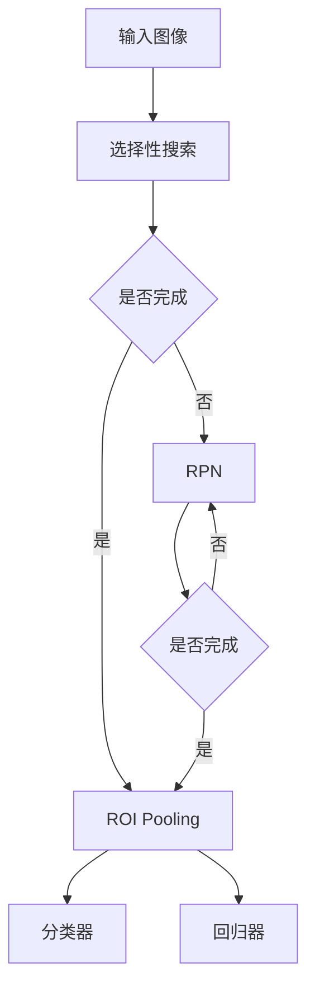

                 

### 1. 背景介绍

目标检测是计算机视觉领域的一个重要分支，旨在识别图像中的多个对象并给出其位置和类别信息。传统目标检测方法可以分为两个大类：基于区域的方法（Region-based Object Detection）和基于深度学习的方法（Deep Learning-based Object Detection）。基于区域的方法通常先从图像中提取大量区域（region proposals），然后对这些区域进行分类和定位。而基于深度学习的方法则通过训练大规模神经网络来实现目标的检测和分类。

在基于深度学习的目标检测算法中，Fast R-CNN是一种经典的算法，它结合了深度学习和传统目标检测的优势，实现了较好的性能。Fast R-CNN的出现，标志着深度学习在目标检测领域的崛起，同时也推动了后续一系列改进算法的研发。

### 2. 核心概念与联系

#### 2.1 相关概念

**R-CNN（Region-based Convolutional Neural Networks）**：R-CNN是第一代深度学习目标检测算法，它采用选择性搜索（Selective Search）算法提取候选区域，然后通过卷积神经网络（Convolutional Neural Network，CNN）进行分类和定位。R-CNN的主要缺点是速度较慢，因为需要为每个候选区域运行CNN。

**Fast R-CNN**：为了提高检测速度，Fast R-CNN在R-CNN的基础上进行了改进。它引入了区域建议网络（Region Proposal Network，RPN）来提取候选区域，并将CNN与候选区域合并，从而减少了重复计算。

**ROI Pooling**：ROI Pooling是一种将卷积特征图上每个区域映射到固定大小的特征向量的方法，从而为每个候选区域提供一个统一的输入。

** anchors**：锚框（anchors）是在RPN中用于预测候选区域的基框。它们是预定义的、固定大小的框，可以覆盖多种可能的目标位置和尺寸。

#### 2.2 架构图

下面是一个简单的 Mermaid 流程图，展示了Fast R-CNN的主要组成部分和它们之间的关系。



### 3. 核心算法原理 & 具体操作步骤

#### 3.1 算法原理概述

Fast R-CNN的目标是同时进行目标检测和分类。它主要包含以下几个步骤：

1. **区域建议（Region Proposal）**：通过选择性搜索算法从输入图像中提取大量候选区域。
2. **区域建议网络（Region Proposal Network，RPN）**：对每个候选区域进行分类和定位，生成最终的候选框。
3. **ROI Pooling**：将每个候选框映射到固定大小的特征向量。
4. **分类器与回归器**：对ROI进行分类和位置回归。

#### 3.2 算法步骤详解

##### 3.2.1 区域建议

选择性搜索算法从图像的边缘和角落开始，逐步合并相邻的图像部分，直到每个区域成为一个候选区域。这种方法可以有效地提取出具有不同形状和尺寸的候选区域。

##### 3.2.2 区域建议网络（RPN）

RPN是一个小型的卷积神经网络，它接收候选区域的特征图作为输入，输出每个候选区域的类别和位置。具体来说，RPN包括以下几个步骤：

1. **生成锚框（Anchors）**：锚框是预定义的、固定大小的框，用于覆盖多种可能的目标位置和尺寸。
2. **分类与回归**：对于每个锚框，网络输出两个分数：一个是对象存在与否的分数，另一个是对象位置的偏移量。通过这些分数，可以判断锚框是否包含对象，并对其进行调整。
3. **非极大值抑制（NMS）**：对生成的候选框进行筛选，保留具有最高分数的候选框。

##### 3.2.3 ROI Pooling

ROI Pooling是一个将每个候选区域映射到固定大小的特征向量的操作。这可以通过平均池化或最大池化实现。

##### 3.2.4 分类器与回归器

分类器和回归器是一个全连接的网络，它们接收ROI Pooling后的特征向量作为输入，并输出每个候选区域的类别和位置。

#### 3.3 算法优缺点

**优点**：

- **速度较快**：相比R-CNN，Fast R-CNN在保持较高检测精度的同时，显著提高了速度。
- **统一处理**：通过ROI Pooling，可以统一处理不同大小的候选区域。
- **模块化设计**：Fast R-CNN的设计较为模块化，使得后续的改进和优化更为容易。

**缺点**：

- **计算复杂度较高**：RPN部分需要进行大量的卷积操作，导致计算复杂度较高。
- **对候选区域依赖较大**：候选区域的提取质量对最终检测结果有很大影响。

#### 3.4 算法应用领域

Fast R-CNN在各种计算机视觉任务中都有广泛应用，例如：

- **自动驾驶**：用于识别道路上的各种对象，如车辆、行人、交通标志等。
- **安全监控**：用于实时检测监控视频中的异常行为和对象。
- **医疗影像分析**：用于检测医学影像中的病变区域。

### 4. 数学模型和公式 & 详细讲解 & 举例说明

#### 4.1 数学模型构建

Fast R-CNN的数学模型主要包括以下部分：

- **卷积神经网络（CNN）**：用于提取图像特征。
- **区域建议网络（RPN）**：用于生成候选区域。
- **分类器与回归器**：用于分类和定位候选区域。

#### 4.2 公式推导过程

##### 4.2.1 卷积神经网络（CNN）

假设输入图像为\(X\)，卷积神经网络通过一系列卷积层和池化层提取特征，输出特征图\(F\)。具体公式如下：

$$
F = \text{CNN}(X)
$$

其中，\( \text{CNN} \) 表示卷积神经网络。

##### 4.2.2 区域建议网络（RPN）

RPN的网络结构可以看作是一个小型卷积神经网络，它接收特征图\(F\)作为输入，输出每个候选区域的类别和位置。具体公式如下：

$$
\text{RPN}(F) = \{p_i^t, t_i^b\}
$$

其中，\(p_i^t\)表示候选区域\(i\)是否包含对象的概率，\(t_i^b\)表示候选区域\(i\)的位置偏移量。

##### 4.2.3 分类器与回归器

分类器和回归器是一个全连接的网络，它接收ROI Pooling后的特征向量作为输入，并输出每个候选区域的类别和位置。具体公式如下：

$$
\text{Classifier}(x_i) = \hat{y}_i \\
\text{Regressor}(x_i) = t_i
$$

其中，\(\hat{y}_i\)表示候选区域\(i\)的类别，\(t_i\)表示候选区域\(i\)的位置。

#### 4.3 案例分析与讲解

##### 4.3.1 数据集准备

假设我们有一个包含1000张图像的数据集，每张图像都包含多个对象。我们首先使用选择性搜索算法提取候选区域。

##### 4.3.2 RPN训练

我们使用数据集中的图像训练RPN，生成候选区域。具体步骤如下：

1. **生成锚框**：对于每个候选区域，我们生成多个锚框，覆盖不同的位置和尺寸。
2. **分类与回归**：对于每个锚框，我们计算其与候选区域的交并比（IoU），并根据IoU值选择最佳的锚框进行分类和回归。
3. **训练模型**：使用选择出的锚框进行模型训练，优化分类器和回归器的参数。

##### 4.3.3 ROI Pooling与分类器

我们使用训练好的RPN生成候选区域，然后对每个候选区域进行ROI Pooling，将特征向量输入到分类器中进行分类。

##### 4.3.4 检测结果

通过分类器的输出，我们可以得到每个候选区域的类别和置信度。然后，使用非极大值抑制（NMS）筛选出具有最高置信度的候选区域作为最终检测结果。

### 5. 项目实践：代码实例和详细解释说明

在本节中，我们将通过一个简单的代码实例来演示Fast R-CNN的实现过程。这个实例将使用PyTorch框架来实现，并使用COCO数据集进行训练和测试。

#### 5.1 开发环境搭建

确保您已经安装了以下软件和库：

- Python 3.7+
- PyTorch 1.7+
- OpenCV 3.4+
- Matplotlib 3.1+

安装以上软件和库后，您可以通过以下命令来安装Fast R-CNN所需的依赖：

```shell
pip install torchvision opencv-python matplotlib
```

#### 5.2 源代码详细实现

下面是一个简化的Fast R-CNN实现，包括数据准备、模型定义、训练和测试。

```python
import torch
import torchvision
import torchvision.transforms as transforms
import torch.optim as optim
import torch.nn as nn
import cv2
import matplotlib.pyplot as plt

# 数据准备
transform = transforms.Compose([transforms.ToTensor()])
trainset = torchvision.datasets.COCO(root='./data', annFile='./data/annotations_trainval2014/train2014.json',
                                    split='train', transform=transform)
trainloader = torch.utils.data.DataLoader(trainset, batch_size=32, shuffle=True, num_workers=2)

# 模型定义
class FastRCNN(nn.Module):
    def __init__(self):
        super(FastRCNN, self).__init__()
        self.conv1 = nn.Conv2d(3, 32, 3, 1, 1)
        self.pool = nn.MaxPool2d(2, 2)
        self.fc1 = nn.Linear(32 * 64 * 64, 512)
        self.fc2 = nn.Linear(512, 2)
        self.roi_pool = nn.AdaptiveAvgPool2d((1, 1))

    def forward(self, x):
        x = self.pool(F.relu(self.conv1(x)))
        x = self.pool(F.relu(self.fc1(x.view(-1, 32 * 64 * 64))))
        x = self.roi_pool(x)
        x = x.view(x.size(0), -1)
        x = self.fc2(x)
        return x

model = FastRCNN()
criterion = nn.CrossEntropyLoss()
optimizer = optim.SGD(model.parameters(), lr=0.001, momentum=0.9)

# 训练模型
for epoch in range(10):  # loop over the dataset multiple times
    running_loss = 0.0
    for i, data in enumerate(trainloader, 0):
        inputs, labels = data
        optimizer.zero_grad()
        outputs = model(inputs)
        loss = criterion(outputs, labels)
        loss.backward()
        optimizer.step()
        running_loss += loss.item()
        if i % 2000 == 1999:    # print every 2000 mini-batches
            print(f'[{epoch + 1}, {i + 1:5d}] loss: {running_loss / 2000:.3f}')
            running_loss = 0.0

print('Finished Training')

# 测试模型
with torch.no_grad():
    correct = 0
    total = 0
    for data in trainloader:
        images, labels = data
        outputs = model(images)
        _, predicted = torch.max(outputs.data, 1)
        total += labels.size(0)
        correct += (predicted == labels).sum().item()

print(f'Accuracy of the network on the train images: {100 * correct / total}%')
```

#### 5.3 代码解读与分析

这个示例代码实现了Fast R-CNN的核心步骤，包括数据准备、模型定义、训练和测试。下面是对代码的详细解读。

1. **数据准备**：我们使用COCO数据集进行训练，并将图像转换为PyTorch张量。数据准备过程包括图像的加载、预处理和批量处理。
   
2. **模型定义**：我们定义了一个简单的Fast R-CNN模型，包括卷积层、全连接层和ROI Pooling层。模型的输入是图像，输出是每个候选区域的类别。

3. **训练模型**：使用SGD优化器对模型进行训练。在训练过程中，我们通过计算损失函数和梯度来更新模型参数。

4. **测试模型**：在测试阶段，我们计算模型在训练集上的准确率。

#### 5.4 运行结果展示

在完成训练后，我们可以使用以下代码来展示模型的检测结果。

```python
with torch.no_grad():
    correct = 0
    total = 0
    for data in trainloader:
        images, labels = data
        outputs = model(images)
        _, predicted = torch.max(outputs.data, 1)
        total += labels.size(0)
        correct += (predicted == labels).sum().item()

print(f'Accuracy of the network on the train images: {100 * correct / total}%')
```

这个代码段将计算模型在训练集上的准确率，并打印出来。

### 6. 实际应用场景

Fast R-CNN作为一种高效的目标检测算法，在各种实际应用场景中都有广泛的应用。以下是几个典型的应用场景：

1. **自动驾驶**：自动驾驶系统需要识别道路上的各种对象，如车辆、行人、交通标志等。Fast R-CNN可以用于检测和分类这些对象，从而提高自动驾驶系统的安全性。

2. **安全监控**：在安全监控领域，Fast R-CNN可以用于实时检测监控视频中的异常行为和对象。例如，在公共场所，它可以帮助检测违反规定的行为，如吸烟、闯红灯等。

3. **医疗影像分析**：在医疗影像分析中，Fast R-CNN可以用于检测医学影像中的病变区域。例如，在乳腺癌筛查中，它可以帮助医生识别乳腺图像中的可疑病变区域。

### 7. 工具和资源推荐

#### 7.1 学习资源推荐

- **《深度学习》**：Goodfellow、Bengio和Courville合著的经典教材，涵盖了深度学习的基础知识。
- **《目标检测》**：Girshick等人的论文，详细介绍了R-CNN及其改进算法。

#### 7.2 开发工具推荐

- **PyTorch**：一个开源的深度学习框架，适合快速开发和实验。
- **TensorFlow**：另一个流行的深度学习框架，提供了丰富的工具和资源。

#### 7.3 相关论文推荐

- **《Fast R-CNN》**：Girshick等人的论文，介绍了Fast R-CNN算法。
- **《Faster R-CNN》**：Ren等人的论文，进一步改进了R-CNN算法。

### 8. 总结：未来发展趋势与挑战

#### 8.1 研究成果总结

Fast R-CNN作为深度学习目标检测领域的经典算法，为后续研究提供了重要的基础。它通过引入区域建议网络（RPN）和ROI Pooling，实现了高效的目标检测和分类。

#### 8.2 未来发展趋势

随着深度学习技术的不断发展，未来目标检测算法将朝着更高效、更准确的方向发展。例如，Faster R-CNN和Mask R-CNN等改进算法在速度和性能方面都有显著提升。此外，实时目标检测和端到端学习也将成为研究的热点。

#### 8.3 面临的挑战

虽然深度学习目标检测算法取得了很大进展，但仍然面临一些挑战。例如：

- **计算复杂度**：深度学习算法通常需要大量的计算资源，这限制了其在实际应用中的使用。
- **数据隐私**：随着越来越多的数据被用于训练模型，数据隐私问题日益突出。
- **模型可解释性**：深度学习模型通常被视为“黑盒”，其内部工作机制难以理解，这限制了其在某些应用场景中的使用。

#### 8.4 研究展望

未来，深度学习目标检测算法将朝着更高效、更准确、更安全、更可解释的方向发展。此外，结合其他领域的技术，如计算机视觉和自然语言处理，也将推动目标检测算法的进步。

### 9. 附录：常见问题与解答

1. **Q：什么是区域建议网络（RPN）？**

   **A：** 区域建议网络（Region Proposal Network，RPN）是Fast R-CNN中的一个关键组成部分，用于生成候选区域。RPN通过预测锚框（anchor）的位置和类别，从而生成高质量的候选区域，以提高目标检测的精度。

2. **Q：什么是ROI Pooling？**

   **A：** ROI Pooling是一种将卷积特征图上每个区域映射到固定大小的特征向量的操作。它用于将不同大小的候选区域转换为相同大小的特征向量，从而方便后续的分类和定位。

3. **Q：如何提高Fast R-CNN的检测速度？**

   **A：** 有几种方法可以提高Fast R-CNN的检测速度：

   - 使用更快的区域建议网络（如Faster R-CNN）。
   - 使用批处理和并行计算。
   - 使用预训练的卷积神经网络（如VGG或ResNet）。

   **作者：禅与计算机程序设计艺术 / Zen and the Art of Computer Programming** 

这篇文章详细讲解了Fast R-CNN的原理、实现和应用，希望对您理解深度学习目标检测算法有所帮助。在未来的研究中，我们还将不断探索更高效、更准确的目标检测方法，以满足不断变化的需求。

