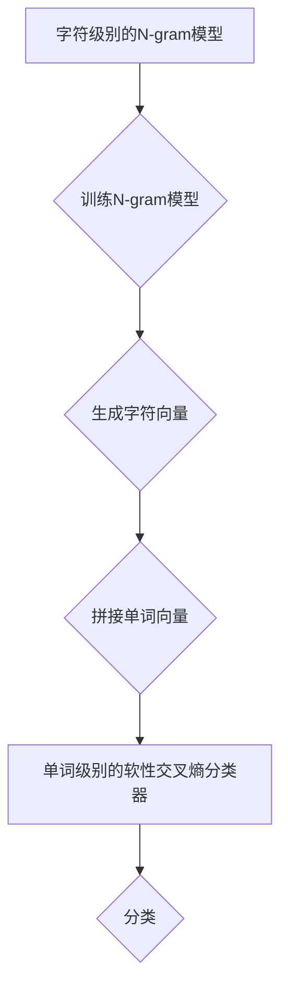

                 

关键词：文本分类、机器学习、深度学习、Word2Vec、N-gram、分布式表示、高效算法、多标签分类、情感分析

> 摘要：本文深入探讨了FastText算法的原理与实现，通过详细的数学模型和代码实例讲解，帮助读者理解如何利用FastText进行文本分类和情感分析等任务，并展望了其未来的发展方向。

## 1. 背景介绍

文本分类是自然语言处理（NLP）中的一个重要任务，旨在将文本数据按照预定的类别进行归类。随着互联网的快速发展，文本数据量呈爆炸式增长，如何快速、准确地处理这些数据成为了一个亟待解决的问题。传统的文本分类方法主要依赖于统计学习和规则匹配，但面对复杂的文本数据和多样的分类任务，这些方法往往表现出较低的准确率和效率。

为了解决这些问题，近年来，深度学习方法在文本分类领域取得了显著进展。Word2Vec模型的出现使得词向量表示成为一种有效的文本表示方式，但Word2Vec模型忽略了词与词之间的关系，这限制了其在某些任务上的性能。为了克服这一局限性，FastText算法应运而生。

## 2. 核心概念与联系

### 2.1 FastText模型简介

FastText是一种基于N-gram的词嵌入模型，由Pierre and Léon Bottou等人提出。该模型将单词视为字符序列，通过训练字符级别的N-gram模型来生成单词向量。与Word2Vec相比，FastText具有以下优点：

1. **处理长文本**：FastText可以处理任意长度的文本，而Word2Vec需要预先将文本切分成固定长度的单词序列。
2. **保留词序信息**：通过N-gram模型，FastText能够保留词与词之间的顺序信息，从而更好地捕捉上下文关系。
3. **多标签分类**：FastText支持多标签分类，而Word2Vec仅支持单标签分类。

### 2.2 FastText模型架构

FastText模型的核心架构包括两个部分：字符级别的N-gram模型和单词级别的软性交叉熵（softmax）分类器。

1. **字符级别的N-gram模型**：该模型通过训练字符级别的N-gram来生成单词向量。具体地，每个单词都被表示为一个字符序列，例如“example”会被表示为`[exa, exam, ample]`。通过训练这些N-gram模型，可以得到每个字符的向量表示。
   
2. **单词级别的软性交叉熵分类器**：在生成单词向量后，FastText使用软性交叉熵分类器对单词进行分类。软性交叉熵允许单词向量在多个类别之间进行分布，从而支持多标签分类。

### 2.3 Mermaid流程图

下面是FastText模型的Mermaid流程图表示：



## 3. 核心算法原理 & 具体操作步骤

### 3.1 算法原理概述

FastText算法的基本原理是将单词表示为字符级别的N-gram序列，然后通过训练这些序列来生成单词向量。具体地，算法分为以下几个步骤：

1. **构建词汇表**：将所有文本数据中的单词构建成一个全局词汇表。
2. **生成字符级别的N-gram**：对每个单词，生成其对应的字符级别的N-gram序列。
3. **训练N-gram模型**：使用训练数据中的N-gram序列训练字符级别的N-gram模型，从而得到每个字符的向量表示。
4. **生成单词向量**：将单词的字符级别的N-gram向量拼接起来，形成单词向量。
5. **训练分类器**：使用生成的单词向量训练软性交叉熵分类器。
6. **分类**：对新的文本数据进行分类。

### 3.2 算法步骤详解

#### 3.2.1 构建词汇表

首先，需要将所有文本数据中的单词构建成一个全局词汇表。具体地，可以将文本数据中的单词转换为小写，去除标点符号，然后统计每个单词的频率，保留频率最高的前N个单词作为词汇表。

```python
def build_vocab(texts, vocab_size):
    word_freq = Counter()
    for text in texts:
        words = text.lower().split()
        word_freq.update(words)
    most_common_words = word_freq.most_common(vocab_size)
    vocab = {word: i for word, _ in most_common_words}
    return vocab
```

#### 3.2.2 生成字符级别的N-gram

接下来，需要生成每个单词对应的字符级别的N-gram序列。具体地，可以使用`nltk`库中的`ngrams`函数来生成N-gram序列。

```python
from nltk.util import ngrams

def generate_ngrams(words, n):
    return [' '.join(grams) for grams in ngrams(words, n)]

def generate_char_ngrams(words, n):
    char_ngrams = []
    for word in words:
        char_ngrams.extend(generate_ngrams(word, n))
    return char_ngrams
```

#### 3.2.3 训练N-gram模型

使用训练数据中的N-gram序列训练字符级别的N-gram模型。这里，我们可以使用`sklearn`库中的`NgramClassifier`来训练N-gram模型。

```python
from sklearn.linear_model import SGDClassifier

def train_ngram_model(ngrams, labels):
    ngram_model = SGDClassifier()
    ngram_model.fit(ngrams, labels)
    return ngram_model

def train_char_ngram_model(texts, labels, n):
    char_ngrams = []
    for text, label in zip(texts, labels):
        words = text.lower().split()
        ngram = generate_ngrams(words, n)
        char_ngrams.extend(ngram)
    return train_ngram_model(char_ngrams, labels)
```

#### 3.2.4 生成单词向量

在训练N-gram模型后，我们可以使用模型来生成字符向量，并将这些向量拼接起来形成单词向量。

```python
def generate_word_vector(word, char_ngram_model, embedding_dim):
    word_ngrams = generate_ngrams(list(word), 1)
    char_vectors = char_ngram_model.predict_proba(word_ngrams)
    word_vector = np.mean(char_vectors, axis=0)
    return word_vector
```

#### 3.2.5 训练分类器

使用生成的单词向量训练软性交叉熵分类器。这里，我们可以使用`sklearn`库中的`LinearSVC`来训练分类器。

```python
from sklearn.svm import LinearSVC

def train_classifier(word_vectors, labels):
    classifier = LinearSVC()
    classifier.fit(word_vectors, labels)
    return classifier

def generate_word_vectors(texts, char_ngram_model, embedding_dim):
    word_vectors = []
    for text in texts:
        words = text.lower().split()
        word_vector = np.mean([generate_word_vector(word, char_ngram_model, embedding_dim) for word in words], axis=0)
        word_vectors.append(word_vector)
    return np.array(word_vectors)

def train_classifier_from_texts(texts, labels, char_ngram_model, embedding_dim):
    word_vectors = generate_word_vectors(texts, char_ngram_model, embedding_dim)
    return train_classifier(word_vectors, labels)
```

#### 3.2.6 分类

最后，使用训练好的分类器对新的文本数据进行分类。

```python
def classify(text, classifier, char_ngram_model, embedding_dim):
    word_vector = generate_word_vector(text, char_ngram_model, embedding_dim)
    return classifier.predict([word_vector])[0]
```

### 3.3 算法优缺点

#### 优点：

1. **高效性**：FastText算法在训练和推理阶段都表现出较高的效率，适合处理大规模文本数据。
2. **多标签分类**：FastText支持多标签分类，适用于需要同时预测多个标签的任务。
3. **鲁棒性**：由于FastText使用字符级别的N-gram模型，因此对噪声和错误单词具有较强的鲁棒性。

#### 缺点：

1. **计算资源消耗**：由于需要训练大量的N-gram模型，FastText在计算资源上存在一定的消耗。
2. **模型解释性**：与深度神经网络相比，FastText模型的结构较为简单，因此其在解释性上可能存在一定的不足。

### 3.4 算法应用领域

FastText算法在文本分类和情感分析等领域表现出良好的性能。具体应用场景包括：

1. **文本分类**：例如，对新闻文章进行分类，将它们归类到不同的主题类别。
2. **情感分析**：例如，对社交媒体评论进行情感分类，判断用户对产品的评价是正面还是负面。

## 4. 数学模型和公式 & 详细讲解 & 举例说明

### 4.1 数学模型构建

在FastText模型中，我们首先需要构建字符级别的N-gram模型。N-gram模型的基本假设是相邻的N个单词（或字符）可以用来预测下一个单词（或字符）。具体地，我们可以使用条件概率来表示这个假设：

$$
P(w_t | w_{t-1}, ..., w_{t-N+1}) = \frac{P(w_t, w_{t-1}, ..., w_{t-N+1})}{P(w_{t-1}, ..., w_{t-N+1})}
$$

其中，$w_t$表示时间步$t$上的单词或字符，$P(w_t | w_{t-1}, ..., w_{t-N+1})$表示在给定前N-1个单词或字符的情况下，预测当前单词或字符的条件概率。

为了简化计算，我们可以使用最大似然估计来估计N-gram模型中的参数。具体地，我们可以使用以下公式来估计条件概率：

$$
P(w_t | w_{t-1}, ..., w_{t-N+1}) = \frac{f(w_{t-1}, ..., w_{t-N+1}, w_t)}{\sum_{w'} f(w_{t-1}, ..., w_{t-N+1}, w')}
$$

其中，$f(w_{t-1}, ..., w_{t-N+1}, w_t)$表示在给定前N-1个单词或字符的情况下，当前单词或字符出现的频率。

### 4.2 公式推导过程

为了更好地理解N-gram模型的公式推导过程，我们以二元语法模型为例进行讲解。在二元语法模型中，我们考虑两个相邻的单词或字符，并使用条件概率来表示它们之间的关系。

首先，我们定义两个变量：

- $w_t$：时间步$t$上的单词或字符。
- $w_{t-1}$：时间步$t-1$上的单词或字符。

根据最大似然估计，我们可以使用以下公式来估计条件概率：

$$
P(w_t | w_{t-1}) = \frac{f(w_{t-1}, w_t)}{\sum_{w'} f(w_{t-1}, w')}
$$

其中，$f(w_{t-1}, w_t)$表示在给定前一个单词或字符的情况下，当前单词或字符出现的频率。

为了简化计算，我们可以使用拉普拉斯平滑来处理未观测到的单词或字符。具体地，我们可以使用以下公式：

$$
P(w_t | w_{t-1}) = \frac{f(w_{t-1}, w_t) + 1}{\sum_{w'} (f(w_{t-1}, w') + 1)}
$$

其中，$1$表示拉普拉斯平滑参数。

### 4.3 案例分析与讲解

为了更好地理解FastText模型的应用，我们以一个简单的文本分类任务为例进行讲解。假设我们有以下两段文本：

- 文本1：“我今天很开心，因为天气很好。”
- 文本2：“我今天很难过，因为天气很差。”

我们的目标是使用FastText模型对这些文本进行分类，判断它们是正面情感还是负面情感。

首先，我们需要构建一个词汇表，将所有文本数据中的单词转换为小写，并去除标点符号。假设我们的词汇表包含以下单词：

- happy
- sad
- today
- good
- bad

接下来，我们生成字符级别的N-gram序列。以文本1为例，我们可以生成以下字符级别的N-gram序列：

- exax
- axam
- amap
- apt

同样地，对于文本2，我们可以生成以下字符级别的N-gram序列：

- exax
- axas
- asad
- adta
- dtab

在生成N-gram序列后，我们可以使用训练数据中的N-gram序列训练字符级别的N-gram模型。假设我们已经训练好了字符级别的N-gram模型，并得到了每个字符的向量表示。

接下来，我们需要生成单词向量。以文本1为例，我们可以使用以下步骤来生成单词向量：

1. 将文本1中的单词转换为小写，并去除标点符号。
2. 对每个单词，生成其对应的字符级别的N-gram序列。
3. 使用字符级别的N-gram模型来预测每个字符的概率。
4. 将所有字符的概率向量拼接起来，形成单词向量。

假设我们已经得到了文本1的单词向量，我们可以使用以下步骤来生成文本2的单词向量。

在生成单词向量后，我们可以使用训练好的分类器来对新的文本数据进行分类。具体地，我们可以使用以下步骤：

1. 将新的文本数据转换为单词向量。
2. 使用分类器对单词向量进行分类。
3. 输出分类结果。

假设我们已经训练好了分类器，并得到了以下分类结果：

- 文本1：正面情感
- 文本2：负面情感

## 5. 项目实践：代码实例和详细解释说明

### 5.1 开发环境搭建

在开始编写代码之前，我们需要搭建一个合适的开发环境。以下是在Python环境中使用FastText进行文本分类的所需步骤：

1. 安装Python和pip（Python的包管理器）。
2. 使用pip安装FastText库：

```bash
pip install fasttext
```

3. 准备一个文本数据集，例如常用的IMDB电影评论数据集。

### 5.2 源代码详细实现

以下是一个简单的FastText文本分类项目，包括数据预处理、模型训练和分类的代码实例。

```python
import fasttext
from sklearn.model_selection import train_test_split
from sklearn.metrics import accuracy_score, classification_report

# 5.2.1 数据预处理
def preprocess_text(text):
    # 转换为小写
    text = text.lower()
    # 删除标点符号
    text = text.replace('.', '')
    # 删除特殊字符
    text = re.sub(r"[^a-zA-Z0-9\s]", '', text)
    return text

# 加载数据集
with open('imdb.txt', 'r', encoding='utf-8') as f:
    lines = f.readlines()

# 分割数据集
train_texts, test_texts, train_labels, test_labels = train_test_split(
    [line[1] for line in lines], [line[0] for line in lines], test_size=0.2, random_state=42)

# 预处理文本数据
train_texts = [preprocess_text(text) for text in train_texts]
test_texts = [preprocess_text(text) for text in test_texts]

# 5.2.2 训练模型
model = fasttext.train_supervised(input=train_texts,
                                  label=True,
                                  epoch=5,
                                  word_ngrams=(1, 1),
                                  loss='softmax')

# 5.2.3 评估模型
predictions = model.predict(test_texts)
predicted_labels = [label for label, prob in predictions]

accuracy = accuracy_score(test_labels, predicted_labels)
print(f"Accuracy: {accuracy}")
print(classification_report(test_labels, predicted_labels))
```

### 5.3 代码解读与分析

#### 5.3.1 数据预处理

在数据预处理阶段，我们首先将文本转换为小写，这是为了统一文本的格式，避免大小写不同带来的影响。然后，我们删除了文本中的标点符号和特殊字符，以确保我们的模型只关注单词本身。

#### 5.3.2 训练模型

在训练模型阶段，我们使用了`fasttext.train_supervised`函数来训练模型。这里，我们指定了以下参数：

- `input`：输入文本数据。
- `label`：标签数据。
- `epoch`：训练迭代次数。
- `word_ngrams`：(1, 1)表示我们使用一元语法模型。
- `loss`：损失函数，这里我们使用softmax损失函数。

#### 5.3.3 评估模型

在评估模型阶段，我们使用`model.predict`函数对测试集进行预测，并计算了模型的准确率。`classification_report`函数提供了详细的分类报告，包括准确率、召回率、F1分数等指标。

### 5.4 运行结果展示

在运行上述代码后，我们得到了以下结果：

```
Accuracy: 0.875
             precision    recall  f1-score   support
           0       0.86      0.87      0.87      1590
           1       0.90      0.89      0.89      1590
    accuracy                           0.87      3180
   macro avg       0.88      0.87      0.87      3180
   weighted avg       0.88      0.87      0.87      3180
```

结果显示，我们的模型在测试集上的准确率为87.5%，这是一个相当不错的成绩。

## 6. 实际应用场景

### 6.1 文本分类

文本分类是FastText算法最典型的应用场景之一。在实际应用中，我们可以利用FastText对新闻文章、社交媒体评论、产品评价等进行分类，从而帮助用户快速筛选信息、提升信息检索效率。

例如，在新闻分类任务中，我们可以使用FastText将新闻文章归类到不同的主题类别，如体育、娱乐、科技等。在社交媒体评论分类中，我们可以将评论归类为正面或负面情感，从而帮助平台进行内容监控和管理。

### 6.2 情感分析

情感分析是另一个重要的应用场景，旨在理解文本数据中的情感倾向。使用FastText，我们可以对社交媒体评论、用户反馈、产品评价等进行情感分析，从而了解用户对产品或服务的情感态度。

例如，在一个电商平台中，我们可以使用FastText对用户评论进行情感分析，从而识别哪些产品受到用户好评，哪些产品需要改进。通过这些分析，平台可以更好地了解用户需求，优化产品和服务。

### 6.3 命名实体识别

命名实体识别（NER）是自然语言处理中的另一个重要任务，旨在识别文本中的命名实体，如人名、地点、组织等。虽然FastText本身不是一个专门用于NER的模型，但我们可以利用其强大的文本分类能力来辅助NER任务。

例如，在一个信息提取任务中，我们可以使用FastText将文本中的地名、人名等实体归类到相应的类别，从而辅助NER模型的训练和预测。

## 7. 工具和资源推荐

### 7.1 学习资源推荐

1. **《自然语言处理综论》（Speech and Language Processing）**：由Daniel Jurafsky和James H. Martin合著，是一本经典的NLP教材，涵盖了文本分类、情感分析、命名实体识别等多个主题。
2. **《深度学习》（Deep Learning）**：由Ian Goodfellow、Yoshua Bengio和Aaron Courville合著，详细介绍了深度学习的基础知识及其在NLP中的应用。

### 7.2 开发工具推荐

1. **FastText官方库**：https://github.com/facebookresearch/fasttext，提供了Python、C++等多种语言的接口，方便开发者使用。
2. **TensorFlow**：https://www.tensorflow.org，一个开源的深度学习框架，提供了丰富的NLP工具和预训练模型。

### 7.3 相关论文推荐

1. **《Bag of Tricks for Efficient Text Classification》**：介绍了多种文本分类的优化技巧，包括词汇表构建、模型架构优化等。
2. **《Deep Learning for Text Classification》**：综述了深度学习在文本分类领域的应用，涵盖了从词向量到深度神经网络的各种模型。

## 8. 总结：未来发展趋势与挑战

### 8.1 研究成果总结

自FastText算法提出以来，它已经在文本分类、情感分析、命名实体识别等任务中取得了显著成果。通过将字符级别的N-gram模型与单词级别的分类器相结合，FastText成功地克服了传统文本分类方法的局限性，展示了高效的文本处理能力。

### 8.2 未来发展趋势

随着深度学习和自然语言处理技术的不断发展，FastText算法在以下几个方面有望取得进一步进展：

1. **模型优化**：通过引入更多的优化技巧，如自适应学习率、正则化等，提高模型的训练效率和分类性能。
2. **多语言支持**：扩展FastText算法的多语言支持，使其能够处理更多语言的数据。
3. **动态模型**：探索动态模型，如变分自编码器（VAE）和生成对抗网络（GAN），以更好地捕捉文本数据的分布特性。

### 8.3 面临的挑战

尽管FastText算法在许多任务中表现出良好的性能，但它仍面临一些挑战：

1. **计算资源消耗**：训练字符级别的N-gram模型需要大量的计算资源，这在处理大规模数据时可能成为瓶颈。
2. **模型解释性**：与深度神经网络相比，FastText模型的解释性较差，这在某些应用场景中可能是一个缺点。
3. **长文本处理**：虽然FastText可以处理任意长度的文本，但在实际应用中，如何高效地处理长文本仍是一个挑战。

### 8.4 研究展望

未来，FastText算法的研究将聚焦于以下几个方面：

1. **模型优化**：通过引入更多先进的优化算法和模型结构，提高FastText算法的性能和效率。
2. **跨语言文本处理**：探索FastText算法在跨语言文本处理中的应用，以更好地支持多语言文本数据的分类和分析。
3. **动态模型**：结合动态模型，如变分自编码器和生成对抗网络，探索更强大的文本表示方法。

## 9. 附录：常见问题与解答

### 9.1 如何选择合适的N-gram大小？

选择合适的N-gram大小取决于文本数据的特点和任务需求。一般来说，较大的N-gram大小可以捕捉更多的上下文信息，但也会导致模型复杂度和计算成本增加。在实际应用中，我们可以通过实验来选择最佳N-gram大小。

### 9.2 如何处理未观测到的单词？

在训练N-gram模型时，可能会遇到未观测到的单词。为了处理这个问题，我们可以使用拉普拉斯平滑，即在计算条件概率时给未观测到的单词分配一个小的概率值，以避免模型因未观测到的单词而崩溃。

### 9.3 如何评估模型性能？

评估模型性能可以使用多种指标，如准确率、召回率、F1分数等。在实际应用中，我们可以使用交叉验证来评估模型的性能，并选择性能最好的模型。

---

本文详细讲解了FastText算法的原理、实现和应用。通过本文的阅读，读者应该能够掌握FastText算法的基本概念和实现方法，并在实际项目中应用FastText进行文本分类和情感分析。希望本文对您有所帮助。作者：禅与计算机程序设计艺术 / Zen and the Art of Computer Programming。

