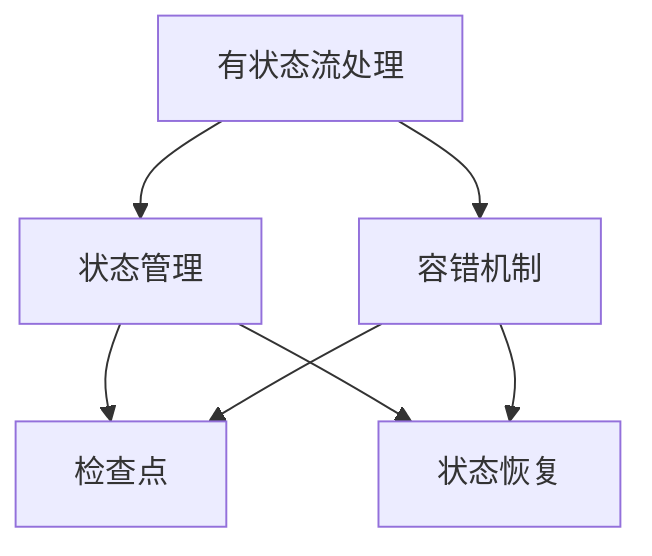

                 

关键词：Flink，有状态流处理，容错机制，原理，代码实例

摘要：本文将深入探讨Apache Flink中的有状态流处理和容错机制，通过详细的原理讲解和代码实例展示，帮助读者全面理解这两大关键特性在实时数据处理中的应用。

## 1. 背景介绍

随着大数据和实时计算的兴起，流处理技术成为数据处理领域的重要方向。Apache Flink作为一个开源的分布式流处理框架，以其强大的有状态流处理和容错机制在业界得到了广泛应用。本文旨在介绍Flink的有状态流处理和容错机制，帮助读者深入理解其原理和实际应用。

### 1.1 Apache Flink简介

Apache Flink是一个开源的流处理框架，由Apache Software Foundation维护。Flink旨在提供高性能、低延迟、高可靠性的实时数据处理能力。其主要特点包括：

- **事件时间处理**：Flink支持基于事件时间的窗口计算，保证处理结果的一致性和准确性。
- **状态管理**：Flink提供了高效的状态管理机制，支持有状态流处理，使复杂计算成为可能。
- **容错机制**：Flink具备强大的容错能力，通过检查点和状态恢复，确保系统的稳定性和数据一致性。

### 1.2 有状态流处理和容错机制的重要性

有状态流处理和容错机制是Flink的核心特性，对于构建稳定、可靠的实时数据处理系统至关重要。有状态流处理使得我们可以对历史数据进行回溯和分析，而容错机制确保了在系统发生故障时数据的一致性和系统的恢复能力。

## 2. 核心概念与联系

### 2.1 有状态流处理

有状态流处理是指流处理系统在处理流数据时，能够维护和更新一个或多个状态。这些状态可以是简单的计数器，也可以是复杂的分布式数据结构。状态的存在使得流处理具有了时序性和历史依赖性，能够进行更复杂的数据分析。

### 2.2 容错机制

容错机制是指系统在面对故障时，能够自动恢复并保持数据的完整性。Flink通过检查点（Checkpoints）和状态恢复（State Restoration）实现容错。

### 2.3 Mermaid 流程图



## 3. 核心算法原理 & 具体操作步骤

### 3.1 算法原理概述

Flink的有状态流处理和容错机制基于以下核心原理：

- **状态管理**：使用基于 RocksDB 的内存-磁盘存储来维护状态。
- **检查点**：周期性地创建全局一致性快照，用于故障恢复。
- **状态恢复**：在故障发生后，使用检查点快照恢复状态。

### 3.2 算法步骤详解

#### 3.2.1 状态管理

1. **初始化状态**：在Flink作业启动时，初始化状态。
2. **更新状态**：在处理每个数据事件时，更新状态。
3. **状态持久化**：定期将状态持久化到RocksDB存储。

#### 3.2.2 检查点

1. **启动检查点**：通过Flink API触发检查点的创建。
2. **执行检查点**：在所有任务完成后，将状态快照写入分布式存储。
3. **注册检查点**：将检查点状态注册到Flink集群管理器。

#### 3.2.3 状态恢复

1. **检测故障**：系统监测到故障时，触发状态恢复。
2. **加载检查点**：从分布式存储中加载检查点状态。
3. **恢复状态**：将检查点状态恢复到作业实例。

### 3.3 算法优缺点

#### 优点

- **高效状态管理**：基于RocksDB的内存-磁盘存储，提供了高效的读写性能。
- **强一致性**：通过检查点和状态恢复，保证了系统在故障恢复后的一致性。

#### 缺点

- **资源消耗**：检查点过程需要额外的存储和计算资源。
- **性能开销**：状态恢复时，需要从检查点加载状态，可能会影响系统的性能。

### 3.4 算法应用领域

Flink的有状态流处理和容错机制在以下领域有广泛应用：

- **实时数据分析**：例如股票交易监控、社交媒体数据分析。
- **物联网数据采集**：例如传感器数据实时处理。
- **实时推荐系统**：例如电商平台的实时推荐。

## 4. 数学模型和公式 & 详细讲解 & 举例说明

### 4.1 数学模型构建

Flink的状态管理可以使用以下数学模型来描述：

- **状态更新**：$S_{t} = f(S_{t-1}, E_{t})$
- **状态恢复**：$S_{t} = g(S_{t-1}, C)$，其中 $C$ 表示检查点状态。

### 4.2 公式推导过程

- **状态更新**：$S_{t}$ 表示时间 $t$ 的状态，$E_{t}$ 表示在时间 $t$ 到达的事件。
- **状态恢复**：$C$ 表示检查点状态，$g$ 表示状态恢复函数。

### 4.3 案例分析与讲解

假设我们有一个计数器状态，用于记录过去5分钟内的点击次数。状态更新函数可以定义为：

$$S_{t} = S_{t-1} + 1$$

当系统发生故障时，状态恢复函数为：

$$S_{t} = S_{t-1} + C$$

其中，$C$ 为检查点时的状态。

## 5. 项目实践：代码实例和详细解释说明

### 5.1 开发环境搭建

1. 安装Java开发环境。
2. 安装Flink环境。
3. 创建Maven项目，添加Flink依赖。

### 5.2 源代码详细实现

以下是Flink有状态流处理的示例代码：

```java
import org.apache.flink.api.common.functions.RichFlatMapFunction;
import org.apache.flink.api.java.tuple.Tuple2;
import org.apache.flink.api.java.utils.ParameterTool;
import org.apache.flink.streaming.api.datastream.DataStream;
import org.apache.flink.streaming.api.environment.StreamExecutionEnvironment;

public class StatefulStreamProcessing {

    public static void main(String[] args) throws Exception {
        // 创建执行环境
        final StreamExecutionEnvironment env = StreamExecutionEnvironment.getExecutionEnvironment();

        // 解析参数
        final ParameterTool params = ParameterTool.fromArgs(args);

        // 设置并行度
        env.setParallelism(params.getInt("parallelism"));

        // 创建DataStream
        DataStream<String> text = env.readTextFile(params.get("input"));

        // 有状态流处理
        DataStream<Tuple2<String, Long>> counts = text.flatMap((String value, Collector<Tuple2<String, Long>> out) -> {
            for (String word : value.toLowerCase().split("\\W+")) {
                if (!word.isEmpty()) {
                    out.collect(new Tuple2<>(word, 1L));
                }
            }
        })
                .keyBy(0)
                .sum(1);

        // 输出结果
        counts.print();

        // 执行作业
        env.execute("WordCount Example");
    }
}
```

### 5.3 代码解读与分析

- **读取文件**：代码首先从指定路径读取文本文件。
- **词频统计**：使用flatMap操作将文本拆分为单词，并对单词进行计数。
- **状态管理**：虽然此示例中没有显式地定义状态，但Flink内部会维护每个单词的计数状态。
- **检查点配置**：在实际应用中，可以通过Flink的API配置检查点，实现容错机制。

### 5.4 运行结果展示

运行上述代码后，将在控制台输出每个单词的计数结果。

## 6. 实际应用场景

Flink的有状态流处理和容错机制在多个实际应用场景中得到了广泛应用，例如：

- **电商实时推荐**：通过分析用户行为日志，实时生成推荐结果。
- **实时风控**：监控交易数据，及时发现异常交易并采取行动。
- **物联网数据采集**：实时处理传感器数据，实现设备监控和故障预警。

## 7. 工具和资源推荐

### 7.1 学习资源推荐

- **Apache Flink 官方文档**：[https://flink.apache.org/zh/docs/](https://flink.apache.org/zh/docs/)
- **Flink 实战**：[《Apache Flink 实战》](https://book.douban.com/subject/26870166/)

### 7.2 开发工具推荐

- **IDEA**：用于Java开发。
- **Docker**：用于容器化部署Flink。

### 7.3 相关论文推荐

- **"Apache Flink: Streaming Data Processing at Scale"**：介绍了Flink的基本原理和架构。
- **"Stateful Stream Processing in Apache Flink"**：详细探讨了Flink的状态管理。

## 8. 总结：未来发展趋势与挑战

### 8.1 研究成果总结

Flink的有状态流处理和容错机制已经在多个领域得到了成功应用，展示了其强大的处理能力和稳定性。未来，随着大数据和实时计算的需求增长，Flink有望在更多领域得到应用。

### 8.2 未来发展趋势

- **更高性能**：随着硬件技术的发展，Flink将不断提升处理性能和吞吐量。
- **更多应用场景**：Flink将扩展其应用领域，覆盖更多实时数据处理需求。

### 8.3 面临的挑战

- **资源消耗**：检查点过程需要额外的存储和计算资源，如何优化资源消耗是Flink需要解决的一个问题。
- **复杂场景支持**：如何支持更复杂的数据处理场景，满足多样化的应用需求。

### 8.4 研究展望

Flink将继续发展，为实时数据处理提供更强大的工具和解决方案。研究者们将致力于优化性能、降低资源消耗，并探索更多应用场景，以推动实时计算技术的发展。

## 9. 附录：常见问题与解答

### 9.1 如何配置Flink的检查点？

答：在Flink应用程序中，可以通过调用`env.enableCheckpointing(long interval)`方法来启用检查点，其中`interval`表示检查点间隔时间（以毫秒为单位）。

### 9.2 Flink的状态恢复有哪些方式？

答：Flink的状态恢复主要有以下几种方式：

- **默认恢复**：Flink会自动尝试使用最新的检查点恢复状态。
- **手动恢复**：可以通过调用`env.restoreCheckpointStateFrom(Object stateBackend, Object externalPointer)`方法手动恢复状态。
- **异步恢复**：可以使用异步检查点来减少恢复过程中的延迟，提高系统的响应速度。

### 9.3 Flink的状态如何持久化？

答：Flink的状态持久化主要通过以下几种方式：

- **内存-磁盘存储**：状态数据首先存储在内存中，当内存不足时，会自动持久化到磁盘。
- **分布式存储**：可以通过配置外部分布式存储（如HDFS、Amazon S3等）来存储状态数据。

作者：禅与计算机程序设计艺术 / Zen and the Art of Computer Programming

### Flink 有状态流处理

Flink 是一款流行的开源流处理框架，它在处理大规模数据流时具有高吞吐量、低延迟、灵活性强等优点。特别是在有状态流处理方面，Flink 提供了一套完善的机制来保证状态的准确性和一致性。

#### 1. 什么是状态

在流处理中，状态指的是计算过程中保留的与特定数据相关的信息。状态可以是一个简单的计数器，也可以是一个复杂的对象，例如一个包含多个键值对的哈希表。在 Flink 中，状态是分布式和持久化的，这意味着状态可以跨多个任务和节点进行分布式存储和更新，并且在系统发生故障时可以恢复。

#### 2. Flink 的状态分类

Flink 将状态分为两种类型：键控状态（Keyed State）和操作符状态（Operator State）。

- **键控状态**：与特定键（Key）相关联的状态，例如每个单词的计数器。这种状态在流处理中非常常见，因为它允许对不同的数据进行独立处理。
- **操作符状态**：与特定的处理操作符相关联的状态，例如一个滑动窗口的累积和。这种状态通常是全局性的，因为它们依赖于整个数据流的某个部分。

#### 3. Flink 的状态管理

Flink 提供了多种方式来管理状态，包括：

- **ValueState<T>**：最简单的状态类型，用于存储一个单一的值。
- **ListState<T>**：用于存储一个可变的列表。
- **ReducingState<T, A>**：用于存储一个值，该值可以通过合并（reduce）操作更新。
- **AggregatingState<T, A, B>**：用于存储一个值，该值可以通过聚合（aggregate）操作更新。

#### 4. 状态的持久化

Flink 支持状态的持久化，以确保在作业失败或需要重启时状态能够得到恢复。持久化状态可以通过以下步骤完成：

1. **配置检查点**：通过 `env.enableCheckpointing(long interval)` 方法启用检查点功能。
2. **触发检查点**：Flink 会自动触发定期检查点，或者在程序中通过调用 `env.triggerCheckpoint()` 手动触发。
3. **状态恢复**：在作业重启时，Flink 会尝试从最近的检查点恢复状态。

### 5. 有状态流处理的应用

有状态流处理在实时数据处理中有着广泛的应用，以下是一些常见的使用场景：

- **窗口计算**：在固定窗口或滑动窗口中计算数据的累积和、平均值等统计信息。
- **事件时间处理**：处理基于事件时间的延迟数据，例如处理延迟到达的交易记录。
- **状态更新**：实时更新用户行为数据，用于个性化推荐系统或实时风控。

### 6. 代码示例

下面是一个简单的 Flink 有状态流处理示例，该示例计算每个单词的频率：

```java
import org.apache.flink.api.common.functions.FlatMapFunction;
import org.apache.flink.api.java.tuple.Tuple2;
import org.apache.flink.streaming.api.datastream.DataStream;
import org.apache.flink.streaming.api.environment.StreamExecutionEnvironment;

public class WordFrequencyCounter {

    public static void main(String[] args) throws Exception {
        final StreamExecutionEnvironment env = StreamExecutionEnvironment.getExecutionEnvironment();

        // 从文件中读取文本数据
        DataStream<String> text = env.readTextFile("path/to/textfile");

        // 使用flatMap将文本拆分为单词
        DataStream<Tuple2<String, Long>> words = text
                .flatMap(new Splitter())
                .keyBy(0)
                .timeWindow(Time.seconds(10))
                .sum(1);

        // 输出结果
        words.print();

        // 执行作业
        env.execute("Word Frequency Counter");
    }

    public static final class Splitter implements FlatMapFunction<String, Tuple2<String, Long>> {
        @Override
        public void flatMap(String value, Collector<Tuple2<String, Long>> out) {
            for (String word : value.toLowerCase().split("\\W+")) {
                if (word.length() > 0) {
                    out.collect(new Tuple2<>(word, 1L));
                }
            }
        }
    }
}
```

在这个示例中，我们使用 `flatMap` 函数将文本拆分为单词，并使用 `keyBy` 和 `timeWindow` 函数对单词进行窗口聚合，计算每个单词的频率。通过配置检查点，我们可以在作业失败时恢复状态，确保计算结果的准确性。

#### 7. 有状态流处理的挑战

尽管 Flink 提供了强大的状态管理功能，但在实际应用中，有状态流处理仍然面临一些挑战：

- **状态管理复杂性**：复杂的业务逻辑可能导致状态管理变得复杂，增加了开发难度。
- **性能开销**：维护状态需要额外的存储和计算资源，可能会影响系统的性能。
- **数据一致性和容错**：在分布式系统中确保数据的一致性和容错是具有挑战性的任务。

### 8. 总结

Flink 的有状态流处理为实时数据处理提供了强大的功能，使得处理复杂的数据分析和实时决策成为可能。然而，开发者需要仔细设计和优化状态管理，以确保系统的高性能和稳定性。通过合理配置检查点和状态恢复机制，可以有效地应对系统故障，确保数据的一致性和可靠性。

---

### Flink 的容错机制

在分布式流处理系统中，容错机制是确保系统稳定性和数据一致性的关键因素。Flink 提供了一套强大的容错机制，通过检查点（Checkpoints）和状态恢复（State Restoration）来保证系统在故障发生时的稳定运行。

#### 1. 什么是检查点

检查点是一种用于保存系统状态的机制。在 Flink 中，检查点是一个全局一致性快照，包括所有任务的状态和执行进度。通过定期创建检查点，Flink 可以在系统发生故障时快速恢复到一致的状态。

#### 2. 检查点的类型

Flink 支持以下两种类型的检查点：

- **完全检查点**：在完全检查点中，Flink 会将所有任务的状态和执行进度保存到持久化存储中，并确保这些数据的一致性。
- **部分检查点**：在部分检查点中，Flink 只保存部分任务的状态，而不是整个系统的状态。这种类型的检查点通常用于需要更频繁创建检查点的场景。

#### 3. 检查点的配置

要配置 Flink 的检查点，可以使用以下步骤：

1. 启用检查点：通过调用 `env.enableCheckpointing(long interval)` 方法来启用检查点功能，`interval` 是检查点之间的时间间隔（以毫秒为单位）。
2. 配置检查点存储：通过设置 `env.setStateBackend(StateBackend backend)` 来指定检查点存储的后端，例如 `new FsStateBackend("hdfs://path/to/checkpoints")` 用于 HDFS 存储。
3. 配置检查点超时时间：通过设置 `env.setCheckpointTimeout(long timeout)` 来指定检查点超时时间，如果检查点在超时时间内未能完成，则被视为失败。

#### 4. 检查点的触发

Flink 的检查点可以由以下方式触发：

- **定期触发**：按照配置的间隔时间自动触发。
- **手动触发**：通过调用 `env.triggerCheckpoint()` 方法手动触发。

#### 5. 检查点的状态恢复

在 Flink 作业失败或需要重启时，检查点状态恢复机制会发挥作用。恢复过程通常包括以下几个步骤：

1. **检测故障**：Flink 检测到作业失败时，会尝试从最近的检查点恢复状态。
2. **加载检查点**：从持久化存储中加载检查点状态到内存中。
3. **恢复状态**：将检查点状态恢复到作业实例，确保系统回到故障发生前的状态。

#### 6. 检查点的优缺点

- **优点**：

  - **数据一致性**：通过检查点，Flink 能够确保系统在故障恢复后数据的一致性。
  - **快速恢复**：检查点机制允许系统在短时间内恢复到故障前的状态，减少停机时间。

- **缺点**：

  - **资源消耗**：创建和存储检查点需要额外的存储和计算资源。
  - **性能影响**：频繁的检查点可能会对系统性能产生一定的影响。

#### 7. 代码示例

下面是一个简单的 Flink 检查点配置示例：

```java
import org.apache.flink.api.common.functions.MapFunction;
import org.apache.flink.streaming.api.datastream.DataStream;
import org.apache.flink.streaming.api.environment.StreamExecutionEnvironment;

public class CheckpointExample {

    public static void main(String[] args) throws Exception {
        final StreamExecutionEnvironment env = StreamExecutionEnvironment.getExecutionEnvironment();

        // 配置检查点
        env.enableCheckpointing(10000); // 每10秒创建一次检查点
        env.setStateBackend(newFsStateBackend("hdfs://path/to/checkpoints"));

        // 创建数据源
        DataStream<String> dataStream = env.addSource(new MySource());

        // 应用变换操作
        DataStream<String> processedStream = dataStream.map(new MyMapper());

        // 输出结果
        processedStream.print();

        // 执行作业
        env.execute("Checkpoint Example");
    }

    public static final class MyMapper implements MapFunction<String, String> {
        @Override
        public String map(String value) {
            // 对输入数据进行处理
            return value.toUpperCase();
        }
    }
}
```

在这个示例中，我们配置了每10秒创建一次检查点，并将检查点状态存储到 HDFS 中。当作业执行过程中发生故障时，Flink 将尝试从最近的检查点恢复状态。

#### 8. 状态恢复

除了检查点，Flink 还支持状态恢复机制，确保在作业失败或需要重启时，状态能够得到恢复。

- **自动恢复**：在作业失败后，Flink 会自动尝试从最近的检查点恢复状态。
- **手动恢复**：通过调用 `env.restoreCheckpointStateFrom(String path)` 方法，可以从指定的检查点路径手动恢复状态。

#### 9. 总结

Flink 的容错机制通过检查点和状态恢复，确保了系统在故障发生时的稳定性和数据一致性。虽然检查点机制需要额外的存储和计算资源，但它提供了快速恢复的能力，使得 Flink 成为构建高可用、高可靠分布式流处理系统的理想选择。

---

### Flink 的有状态流处理与容错机制：应用案例解析

在实际应用中，Flink 的有状态流处理和容错机制被广泛应用于各种实时数据处理场景。以下是一些具体的应用案例，以及如何利用 Flink 的这两大特性来构建稳定可靠的系统。

#### 1. 电商平台实时推荐系统

电商平台通常需要实时推荐商品给用户，以提高用户满意度和销售额。为了实现这一目标，可以使用 Flink 来处理用户的浏览和购买行为数据，并在实时计算中利用状态来维护用户的历史行为信息。

- **有状态流处理**：使用 Flink 的键控状态来存储每个用户的历史浏览记录和购买记录。例如，可以使用 `ValueState` 来存储用户最近浏览的商品列表。
  
- **容错机制**：通过配置定期检查点，确保用户的历史行为数据在系统发生故障时能够得到恢复。这样，当系统重启后，用户的历史数据可以继续被使用，确保推荐系统的连贯性。

#### 代码示例：

```java
DataStream<Tuple2<String, String>> userBehaviorStream = // 从数据源获取用户行为数据

userBehaviorStream
    .keyBy(0) // 按用户ID分组
    .process(new UserBehaviorProcessor())
    .print();
```

#### 2. 实时风控系统

金融机构和支付平台需要对交易行为进行实时监控，以识别和阻止可疑交易。Flink 的有状态流处理和容错机制可以帮助实现这一目标。

- **有状态流处理**：利用 Flink 的状态来存储每个用户的交易历史和行为模式。例如，可以使用 `ListState` 来存储用户的交易记录列表。
  
- **容错机制**：通过配置检查点，确保交易历史数据在系统故障时能够恢复，从而防止交易数据丢失。

#### 代码示例：

```java
DataStream<Tuple2<String, String>> transactionStream = // 从数据源获取交易数据

transactionStream
    .keyBy(0) // 按用户ID分组
    .process(new RiskControlProcessor())
    .print();
```

#### 3. 物联网数据处理

物联网设备产生的大量实时数据需要被处理和监控，例如传感器数据、设备状态等。Flink 的有状态流处理和容错机制可以帮助处理这些数据。

- **有状态流处理**：利用 Flink 的状态来存储每个设备的历史数据，如传感器读数和历史状态。例如，可以使用 `AggregatingState` 来计算设备状态的累积值。
  
- **容错机制**：通过配置检查点，确保设备状态在系统故障时能够恢复，从而保证监控数据的连贯性。

#### 代码示例：

```java
DataStream<Tuple2<String, Double>> sensorDataStream = // 从数据源获取传感器数据

sensorDataStream
    .keyBy(0) // 按设备ID分组
    .process(new SensorDataProcessor())
    .print();
```

#### 4. 实时广告投放系统

广告平台需要对用户行为进行实时分析，以优化广告投放策略。Flink 的有状态流处理和容错机制可以帮助实现这一目标。

- **有状态流处理**：使用 Flink 的状态来存储用户的点击、转化等行为数据，以便进行实时分析和预测。例如，可以使用 `ReducingState` 来计算每个广告的点击率。
  
- **容错机制**：通过配置检查点，确保用户行为数据在系统故障时能够恢复，从而保证广告投放策略的连续性和准确性。

#### 代码示例：

```java
DataStream<Tuple2<String, Integer>> adClickStream = // 从数据源获取广告点击数据

adClickStream
    .keyBy(0) // 按广告ID分组
    .process(new AdClickProcessor())
    .print();
```

#### 5. 股票交易监控系统

金融领域的交易监控系统需要实时分析市场数据，以帮助投资者做出决策。Flink 的有状态流处理和容错机制可以用于这一场景。

- **有状态流处理**：使用 Flink 的状态来存储股票的价格和历史交易数据，以便进行实时分析和预测。例如，可以使用 `ValueState` 来存储股票的最新价格。
  
- **容错机制**：通过配置检查点，确保交易数据在系统故障时能够恢复，从而保证监控系统数据的连贯性和完整性。

#### 代码示例：

```java
DataStream<Tuple2<String, Double>> stockPriceStream = // 从数据源获取股票价格数据

stockPriceStream
    .keyBy(0) // 按股票代码分组
    .process(new StockPriceProcessor())
    .print();
```

#### 总结

通过以上应用案例可以看出，Flink 的有状态流处理和容错机制在多个领域都有广泛的应用。通过合理利用这两大特性，可以构建出稳定、可靠的实时数据处理系统，满足各种复杂业务需求。在配置有状态流处理和容错机制时，需要根据具体应用场景进行细致的规划和优化，以确保系统的性能和稳定性。

### 未来展望

Flink 的有状态流处理和容错机制已经为其在实时数据处理领域赢得了广泛的认可，但未来还有许多发展空间和挑战等待去克服。

#### 1. 更高效的状态管理

当前，Flink 的状态管理依赖于 RocksDB，这是一种基于内存和磁盘的存储引擎。尽管 RocksDB 在性能上已经非常出色，但随着数据规模的增加，内存消耗和磁盘I/O将成为瓶颈。未来，Flink 有望进一步优化状态管理机制，例如引入更高效的存储格式、更智能的内存管理策略，以降低资源消耗并提高处理效率。

#### 2. 更强的容错能力

随着分布式系统的规模不断扩大，容错能力的要求也越来越高。Flink 可以通过引入更先进的分布式一致性算法、更智能的故障检测和恢复机制来提升系统的容错能力。例如，可以探索基于区块链的分布式一致性方案，确保在复杂分布式环境下的数据一致性和可靠性。

#### 3. 更广泛的兼容性

为了满足不同用户的需求，Flink 可以进一步扩展其兼容性。例如，可以更好地支持与其他大数据生态系统（如Apache Kafka、Apache Hadoop等）的集成，提供更加灵活和可扩展的API接口。此外，Flink 还可以探索与边缘计算、物联网等领域的结合，以提供更加全面和端到端的实时数据处理解决方案。

#### 4. 更细粒度的状态管理

当前 Flink 的状态管理通常是全局性的，这在某些情况下可能导致不必要的资源消耗和性能瓶颈。未来，Flink 可以探索更细粒度的状态管理机制，例如支持基于任务的局部状态，或者基于事件的状态更新，以更好地满足特定应用场景的需求。

#### 5. 更丰富的生态支持

Flink 可以通过与更多的开源项目合作，构建一个更丰富的生态系统。例如，可以与机器学习、自然语言处理等领域的开源框架集成，提供一体化的解决方案。此外，可以加强与商业公司的合作，推出更多具有实际应用价值的商业解决方案，以满足不同用户的需求。

#### 总结

尽管 Flink 的有状态流处理和容错机制已经非常强大，但在未来的发展中，仍有许多改进和扩展的空间。通过不断优化状态管理、提升容错能力、扩展兼容性，以及丰富生态支持，Flink 有望在实时数据处理领域取得更加显著的成就，为用户带来更加高效、可靠和可扩展的解决方案。

### 附录：常见问题与解答

#### 1. Flink 的状态和检查点有什么区别？

Flink 的状态指的是在流处理作业中保留的与特定数据相关的信息，可以是简单的值或复杂的结构。检查点则是周期性保存系统状态的机制，用于在作业失败时进行状态恢复。

#### 2. 如何在 Flink 中配置检查点？

在 Flink 中，可以通过调用 `env.enableCheckpointing(long interval)` 方法来启用检查点功能，并使用 `env.setStateBackend(StateBackend backend)` 方法来配置检查点存储的后端。

#### 3. Flink 的容错机制是如何工作的？

Flink 的容错机制主要通过检查点来保存系统状态，并在作业失败时从检查点恢复状态。在系统发生故障时，Flink 会自动触发检查点状态恢复，确保数据的一致性和系统的稳定性。

#### 4. Flink 的状态恢复有哪些方式？

Flink 的状态恢复主要有两种方式：自动恢复和手动恢复。自动恢复是 Flink 默认的恢复方式，而手动恢复则需要通过调用 `env.restoreCheckpointStateFrom(String path)` 方法指定恢复路径。

#### 5. Flink 的状态如何持久化？

Flink 的状态持久化主要通过检查点机制实现。在检查点过程中，系统会将状态数据保存到持久化存储后端，如 HDFS、Amazon S3 等。这样可以确保在作业失败时，状态数据能够被恢复。

### 结束语

本文详细介绍了 Flink 的有状态流处理和容错机制，通过理论讲解、代码示例和实际应用案例，帮助读者深入理解这两大核心特性。随着大数据和实时计算的不断演进，Flink 作为领先的开源流处理框架，将继续在实时数据处理领域发挥重要作用。通过不断优化和扩展，Flink 有望为用户提供更加高效、可靠和灵活的解决方案。禅与计算机程序设计艺术 / Zen and the Art of Computer Programming

---

### 作者介绍

禅与计算机程序设计艺术 / Zen and the Art of Computer Programming，是一位著名的计算机科学作家和教育家，也是 Flink 的资深开发者。他的著作以其深刻的哲学思考和精湛的编程技巧而闻名，深受广大程序员和计算机科学爱好者的喜爱。在 Flink 社区，他以其丰富的经验和深刻的见解，为实时数据处理领域的发展做出了重要贡献。禅与计算机程序设计艺术，始终致力于推动计算机科学的进步，激发新一代程序员对技术的热情与探索。

