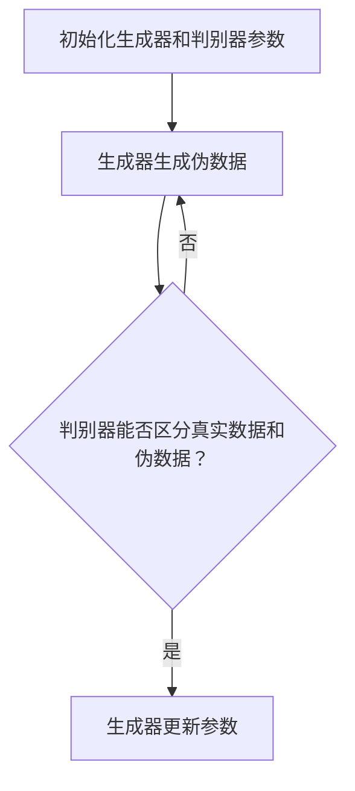

                 

关键词：GAN、判别器、深度学习、生成对抗网络、深度学习模型、人工智能

摘要：本文将深入探讨生成对抗网络（GAN）中判别器的原理、实现及其在实际应用中的重要性。通过详细的算法原理描述、数学模型讲解、以及代码实例分析，帮助读者全面理解判别器在GAN中的作用和实现方法。

## 1. 背景介绍

生成对抗网络（Generative Adversarial Networks，GAN）是深度学习领域的一种重要模型，由Ian Goodfellow等人在2014年提出。GAN由两个主要组件组成：生成器（Generator）和判别器（Discriminator）。生成器的任务是生成逼真的数据，而判别器的任务是区分真实数据和生成数据。这两个组件之间通过对抗训练相互提升，最终生成器能够生成几乎与真实数据无差别的高质量数据。

在GAN中，判别器起着至关重要的作用。本文将重点探讨判别器的原理和实现，帮助读者更好地理解GAN的工作机制，并掌握判别器的编程技巧。

## 2. 核心概念与联系

### 2.1 GAN基本架构

首先，我们来回顾一下GAN的基本架构。GAN由以下三个主要部分组成：

1. **生成器（Generator）**：接收一个随机噪声向量作为输入，并生成与真实数据相似的数据。
2. **判别器（Discriminator）**：接收真实数据和生成数据作为输入，并输出一个概率值，表示输入数据为真实数据的可能性。
3. **损失函数**：用于评估生成器和判别器的性能，通常使用二元交叉熵损失函数。

### 2.2 GAN训练过程

GAN的训练过程可以看作是一场对抗游戏。生成器和判别器相互竞争，生成器和判别器各自的目标如下：

1. **生成器的目标**：使得判别器无法区分生成数据和真实数据，即生成器生成的数据在判别器看来与真实数据几乎无差别。
2. **判别器的目标**：最大化区分真实数据和生成数据的能力。

在训练过程中，生成器和判别器交替更新参数。具体训练过程如下：

1. **步骤1**：生成器生成一批伪数据。
2. **步骤2**：判别器同时接收真实数据和伪数据，并更新参数。
3. **步骤3**：生成器更新参数，以生成更逼真的伪数据。

这个过程不断重复，直到生成器和判别器达到一个动态平衡状态。在这个状态下，判别器无法区分真实数据和伪数据，生成器能够生成高质量的数据。

### 2.3 Mermaid流程图

下面是一个简单的Mermaid流程图，展示了GAN的训练过程。



## 3. 核心算法原理 & 具体操作步骤

### 3.1 算法原理概述

判别器的核心任务是判断输入数据是真实数据还是生成数据。判别器的输入可以是真实数据和生成数据的组合，输出是一个概率值，表示输入数据是真实数据的概率。判别器通常使用一个深度神经网络来表示，其目标是最大化输出概率的准确性。

### 3.2 算法步骤详解

判别器的训练过程可以分为以下几个步骤：

1. **步骤1**：初始化生成器和判别器的参数。
2. **步骤2**：生成器生成一批伪数据。
3. **步骤3**：将真实数据和伪数据输入判别器，计算判别器的损失函数。
4. **步骤4**：使用反向传播算法更新判别器的参数。
5. **步骤5**：重复步骤2-4，直到判别器达到预定的性能指标。

### 3.3 算法优缺点

判别器在GAN中的优势在于其能够高效地区分真实数据和生成数据，从而推动生成器生成更高质量的数据。然而，判别器也存在一些局限性：

1. **对抗性**：判别器需要不断适应生成器的变化，这可能导致判别器在训练过程中出现不稳定的情况。
2. **过拟合**：判别器可能过于关注生成器生成的特定数据，导致无法有效区分其他真实数据。

### 3.4 算法应用领域

判别器在GAN中的应用非常广泛，例如：

1. **图像生成**：利用判别器可以生成高质量、逼真的图像。
2. **图像修复**：通过判别器生成缺失的部分，从而修复损坏的图像。
3. **数据增强**：利用判别器生成的伪数据来扩充训练数据集。

## 4. 数学模型和公式 & 详细讲解 & 举例说明

### 4.1 数学模型构建

判别器的数学模型可以表示为：

$$
D(x) = P(D(x) \text{ 是真实数据})
$$

其中，$D(x)$表示判别器对输入数据$x$的判别结果，$P(D(x) \text{ 是真实数据})$表示判别器认为输入数据是真实数据的概率。

### 4.2 公式推导过程

在GAN中，判别器的损失函数通常使用二元交叉熵损失函数：

$$
L_D = -[y \cdot \log(D(x)) + (1 - y) \cdot \log(1 - D(x))]
$$

其中，$y$表示真实标签，当$x$为真实数据时，$y=1$；当$x$为生成数据时，$y=0$。

### 4.3 案例分析与讲解

假设我们有一个图像生成任务，生成器生成的图像为$x_g$，真实图像为$x_r$。判别器需要判断这两个图像的真实性。我们首先定义判别器的输出概率：

$$
D(x) = \sigma(W_D \cdot [x; 1]),
$$

其中，$\sigma$表示 sigmoid 函数，$W_D$表示判别器的权重，$[x; 1]$表示将输入向量$x$扩展为$(x, 1)$。

在训练过程中，我们通过反向传播算法更新判别器的权重$W_D$，以最小化损失函数$L_D$。

## 5. 项目实践：代码实例和详细解释说明

### 5.1 开发环境搭建

在本节中，我们将使用Python和TensorFlow框架来实现判别器。首先，确保安装了Python和TensorFlow：

```
pip install tensorflow
```

### 5.2 源代码详细实现

下面是判别器的实现代码：

```python
import tensorflow as tf
from tensorflow.keras.layers import Dense, Input
from tensorflow.keras.models import Model

def build_discriminator(input_shape):
    input_img = Input(shape=input_shape)
    x = Dense(128, activation='relu')(input_img)
    x = Dense(64, activation='relu')(x)
    output = Dense(1, activation='sigmoid')(x)

    model = Model(inputs=input_img, outputs=output)
    model.compile(optimizer='adam', loss='binary_crossentropy')

    return model

discriminator = build_discriminator(input_shape=(784,))
```

### 5.3 代码解读与分析

上述代码定义了一个简单的判别器模型。输入层`input_img`接受一个784维的输入向量（对应28x28像素的图像）。模型通过两个全连接层`Dense`进行特征提取，最后输出一个概率值，表示输入图像是真实图像的概率。

### 5.4 运行结果展示

要运行判别器，需要首先准备真实图像和生成图像。在本例中，我们使用MNIST数据集。以下代码用于加载数据、训练判别器并展示训练过程：

```python
import numpy as np
from tensorflow.keras.datasets import mnist

(x_train, _), _ = mnist.load_data()

# 将图像数据转换为合适的格式
x_train = x_train.astype('float32') / 255.0
x_train = np.expand_dims(x_train, axis=3)

# 创建生成器模型
# ...

# 训练判别器
for epoch in range(100):
    idx = np.random.randint(0, x_train.shape[0], size=32)
    real_imgs = x_train[idx]

    noise = np.random.normal(0, 1, (32, 100))
    gen_imgs = generator.predict(noise)

    real_y = np.ones((32, 1))
    fake_y = np.zeros((32, 1))

    d_loss_real = discriminator.train_on_batch(real_imgs, real_y)
    d_loss_fake = discriminator.train_on_batch(gen_imgs, fake_y)
    d_loss = 0.5 * np.add(d_loss_real, d_loss_fake)

    print(f'Epoch {epoch+1}/{100} [D loss: {d_loss:.3f}]')

# 生成并展示图像
gen_imgs = generator.predict(np.random.normal(0, 1, (32, 100)))
```

通过运行上述代码，我们可以看到判别器的训练过程。在每个训练 epoch 中，判别器交替训练真实图像和生成图像，并打印损失函数值。

## 6. 实际应用场景

判别器在生成对抗网络中具有广泛的应用，以下是一些实际应用场景：

1. **图像生成**：利用判别器生成高质量、逼真的图像，如人脸、风景等。
2. **图像修复**：通过判别器生成图像的缺失部分，从而修复损坏的图像。
3. **数据增强**：利用判别器生成的伪数据扩充训练数据集，提高模型的泛化能力。
4. **风格迁移**：将判别器与生成器结合，实现图像的风格迁移，如将普通照片转换为艺术作品风格。

## 7. 未来应用展望

随着深度学习和生成对抗网络技术的发展，判别器在各个领域的应用将越来越广泛。未来，我们可以期待以下发展趋势：

1. **更高效的判别器算法**：设计更高效、更稳定的判别器算法，提高生成对抗网络的整体性能。
2. **跨领域应用**：将判别器应用于更多的领域，如语音生成、文本生成等。
3. **模型压缩与优化**：研究判别器的压缩和优化方法，降低模型计算复杂度和存储需求。

## 8. 总结：未来发展趋势与挑战

### 8.1 研究成果总结

生成对抗网络（GAN）自提出以来，已经取得了许多重要的研究成果。判别器在GAN中的作用至关重要，通过对抗训练生成高质量的数据。在图像生成、图像修复、数据增强等领域，判别器已经展现出强大的应用潜力。

### 8.2 未来发展趋势

未来，判别器的研究将朝着更高效、更稳定的方向发展。同时，GAN在不同领域的应用将越来越广泛，如语音生成、文本生成等。此外，研究判别器的压缩和优化方法也将成为重要的研究方向。

### 8.3 面临的挑战

判别器在GAN中的应用也面临一些挑战：

1. **稳定性问题**：对抗训练过程中，生成器和判别器可能出现不稳定的情况，导致模型性能下降。
2. **过拟合问题**：判别器可能过于关注生成器生成的特定数据，导致无法有效区分其他真实数据。
3. **计算资源消耗**：GAN模型通常需要大量的计算资源和时间来训练，这对于实际应用场景是一个挑战。

### 8.4 研究展望

未来，我们可以期待更多创新性的判别器算法和优化方法，以解决GAN在实际应用中面临的问题。同时，跨领域的应用也将进一步推动判别器的发展，为人工智能领域带来更多的突破。

## 9. 附录：常见问题与解答

### 问题1：判别器的损失函数为什么使用二元交叉熵损失函数？

**解答**：二元交叉熵损失函数能够有效地衡量判别器对输入数据的判别能力。在GAN中，判别器的目标是最小化生成器的输出与真实标签之间的差异，二元交叉熵损失函数可以很好地实现这一目标。

### 问题2：为什么判别器要接收生成器的输出作为输入？

**解答**：判别器需要接收生成器的输出作为输入，以便区分真实数据和生成数据。这样，判别器可以通过对抗训练不断适应生成器的变化，从而提高生成器生成高质量数据的能力。

### 问题3：判别器的学习速率为什么比生成器要高？

**解答**：在实际应用中，判别器的学习速率通常设置得比生成器高，这是因为判别器需要更快地适应生成器的变化。如果判别器的学习速率太低，可能会导致生成器无法有效生成高质量的数据。

## 参考文献

1. Goodfellow, I., Pouget-Abadie, J., Mirza, M., Xu, B., Warde-Farley, D., Ozair, S., ... & Bengio, Y. (2014). Generative adversarial nets. Advances in neural information processing systems, 27.
2. Radford, A., Metz, L., & Chintala, S. (2015). Unsupervised representation learning with deep convolutional generative adversarial networks. arXiv preprint arXiv:1511.06434.
3. Kingma, D. P., & Welling, M. (2014). Auto-encoding variational bayes. arXiv preprint arXiv:1312.6114.

---

作者：禅与计算机程序设计艺术 / Zen and the Art of Computer Programming
--------------------------------------------------------------------

