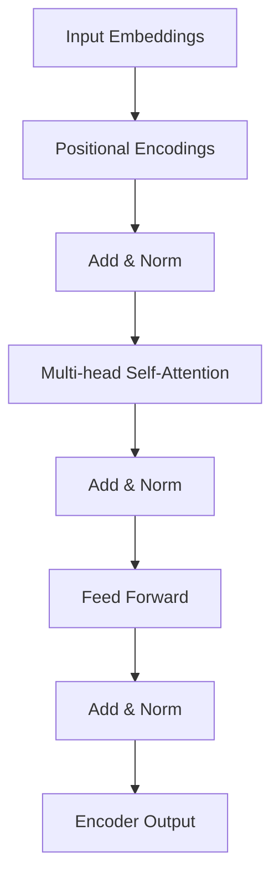
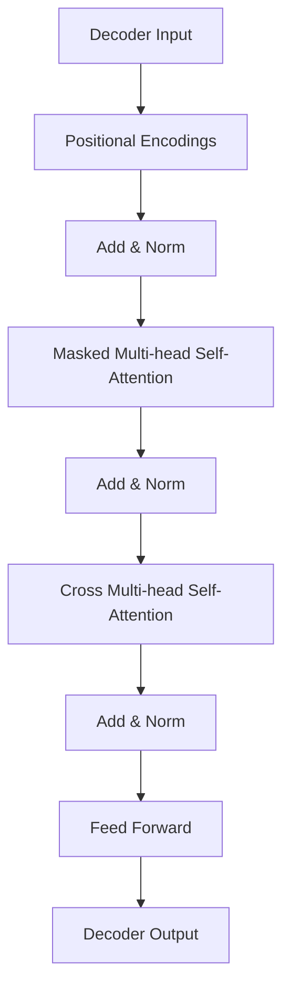

                 

关键词：GPT-2, 自然语言处理，生成模型，Transformer，深度学习，代码实例

> 摘要：本文将深入探讨GPT-2（Generative Pre-trained Transformer 2）的原理及其实现细节。我们将详细讲解GPT-2的架构、训练过程以及代码实例，帮助读者更好地理解和应用这一强大的自然语言处理模型。

## 1. 背景介绍

自然语言处理（NLP）作为人工智能领域的一个重要分支，已经取得了显著的进展。近年来，深度学习在NLP中的应用使得模型的表达能力大幅提升。其中，Transformer架构在序列到序列的任务中表现出色，例如机器翻译、文本摘要等。GPT（Generative Pre-trained Transformer）正是基于Transformer架构的一种预训练语言模型。GPT的成功引发了大量研究，并在实际应用中取得了卓越的效果。GPT-2作为GPT的升级版，在模型规模和性能上都有显著的提升。

## 2. 核心概念与联系

GPT-2的架构是基于Transformer，这是一种能够处理变长序列的模型。为了更好地理解GPT-2，我们首先回顾一下Transformer的基本原理。

### 2.1 Transformer架构

Transformer架构由多个相同的编码器和解码器块组成。编码器负责将输入序列转换为上下文表示，解码器则根据上下文生成输出序列。


### 2.2 编码器

编码器由自注意力机制（Self-Attention）和前馈网络组成。自注意力机制能够捕获序列中不同位置的信息，使模型能够更好地理解和生成序列。



### 2.3 解码器

解码器同样由自注意力机制和前馈网络组成。与编码器不同的是，解码器还引入了交叉注意力机制，用于将编码器的输出与解码器的输出进行交互。



## 3. 核心算法原理 & 具体操作步骤

### 3.1 算法原理概述

GPT-2通过预训练的方式学习语言模型，主要包含两个阶段：预训练和微调。

- **预训练**：在大量文本语料上训练模型，使其能够捕捉到语言中的统计规律和语义信息。
- **微调**：在特定任务上（如文本分类、问答等）对模型进行微调，使其适应具体任务。

### 3.2 算法步骤详解

#### 3.2.1 预训练步骤

1. **数据处理**：将文本语料预处理成token序列。
2. **序列填充**：将token序列填充为固定长度，可以使用特殊的填充token。
3. **输入序列构建**：构建输入序列，包括前一个词、当前词和后一个词。
4. **损失函数计算**：使用交叉熵损失函数计算模型预测和真实标签之间的差距。
5. **优化更新**：使用梯度下降算法更新模型参数。

#### 3.2.2 微调步骤

1. **模型初始化**：使用预训练好的模型权重初始化模型。
2. **任务数据预处理**：对特定任务的数据进行预处理。
3. **损失函数计算**：使用特定任务的损失函数计算模型预测和真实标签之间的差距。
4. **优化更新**：使用梯度下降算法更新模型参数。

### 3.3 算法优缺点

**优点**：

- **强大的预训练能力**：GPT-2通过预训练能够捕捉到语言中的统计规律和语义信息，使其在特定任务上具有很好的性能。
- **灵活的模型架构**：Transformer架构使得GPT-2能够处理变长序列，适应不同的NLP任务。

**缺点**：

- **计算资源消耗大**：GPT-2的模型规模较大，训练和部署需要大量的计算资源。
- **数据依赖性强**：预训练效果很大程度上依赖于训练数据的质量和规模。

### 3.4 算法应用领域

GPT-2在多个NLP任务中表现出色，如文本生成、文本分类、问答系统等。其强大的预训练能力和灵活的模型架构使得GPT-2成为NLP领域的重要工具。

## 4. 数学模型和公式 & 详细讲解 & 举例说明

### 4.1 数学模型构建

GPT-2的核心是Transformer架构，其数学模型主要由以下部分组成：

- **词向量表示**：使用词嵌入（Word Embedding）将词汇映射为向量。
- **自注意力机制**：计算输入序列中每个词的注意力权重。
- **前馈网络**：对自注意力机制的结果进行非线性变换。

### 4.2 公式推导过程

假设输入序列为 $X = [x_1, x_2, ..., x_n]$，其中 $x_i$ 表示第 $i$ 个词。

#### 4.2.1 词嵌入

$$
\text{emb}(x_i) = W_e \cdot x_i
$$

其中，$W_e$ 是词嵌入矩阵。

#### 4.2.2 自注意力

$$
\text{Attention}(Q, K, V) = \text{softmax}\left(\frac{QK^T}{\sqrt{d_k}}\right) V
$$

其中，$Q, K, V$ 分别是查询向量、键向量和值向量。

#### 4.2.3 前馈网络

$$
\text{FFN}(x) = \text{ReLU}(W_f \cdot \text{DN}(x)) + b_f
$$

其中，$W_f, b_f$ 分别是前馈网络的权重和偏置，$\text{DN}$ 是归一化层。

### 4.3 案例分析与讲解

假设我们有一个简单的输入序列 $X = [hello, world]$，我们将对其进行自注意力处理。

1. **词嵌入**：

$$
\text{emb}(hello) = W_e \cdot [hello] = [0.1, 0.2, 0.3, ..., 0.9]
$$

$$
\text{emb}(world) = W_e \cdot [world] = [1.1, 1.2, 1.3, ..., 1.9]
$$

2. **自注意力**：

$$
\text{Attention}(Q, K, V) = \text{softmax}\left(\frac{QK^T}{\sqrt{d_k}}\right) V
$$

其中，$Q, K, V$ 分别是查询向量、键向量和值向量。

$$
Q = \text{emb}(hello) = [0.1, 0.2, 0.3, ..., 0.9]
$$

$$
K = \text{emb}(world) = [1.1, 1.2, 1.3, ..., 1.9]
$$

$$
V = \text{emb}(world) = [1.1, 1.2, 1.3, ..., 1.9]
$$

$$
\text{Attention}(Q, K, V) = \text{softmax}\left(\frac{QK^T}{\sqrt{d_k}}\right) V
$$

$$
= \text{softmax}\left(\frac{[0.1 \cdot 1.1, 0.2 \cdot 1.2, 0.3 \cdot 1.3, ..., 0.9 \cdot 1.9]}{\sqrt{1.9}}\right) [1.1, 1.2, 1.3, ..., 1.9]
$$

3. **前馈网络**：

$$
\text{FFN}(x) = \text{ReLU}(W_f \cdot \text{DN}(x)) + b_f
$$

其中，$W_f, b_f$ 分别是前馈网络的权重和偏置，$\text{DN}$ 是归一化层。

$$
x = \text{emb}(hello) = [0.1, 0.2, 0.3, ..., 0.9]
$$

$$
\text{FFN}(x) = \text{ReLU}(W_f \cdot \text{DN}(x)) + b_f
$$

$$
= \text{ReLU}(W_f \cdot [0.1, 0.2, 0.3, ..., 0.9]) + b_f
$$

$$
= \text{ReLU}([0.1 \cdot w_{f11}, 0.2 \cdot w_{f21}, 0.3 \cdot w_{f31}, ..., 0.9 \cdot w_{f_n1}]) + b_f
$$

## 5. 项目实践：代码实例和详细解释说明

### 5.1 开发环境搭建

在开始编写代码之前，我们需要搭建一个合适的环境。以下是一个简单的Python开发环境搭建过程：

1. 安装Python 3.7及以上版本。
2. 安装TensorFlow 2.0及以上版本。

```bash
pip install tensorflow==2.4.0
```

### 5.2 源代码详细实现

下面是一个简单的GPT-2模型实现示例：

```python
import tensorflow as tf
from tensorflow.keras.layers import Embedding, LSTM, Dense
from tensorflow.keras.models import Model

# 模型参数
vocab_size = 1000
embedding_dim = 32
hidden_units = 128

# 嵌入层
inputs = tf.keras.layers.Input(shape=(None,), dtype=tf.int32)
embedding = Embedding(vocab_size, embedding_dim)(inputs)

# LSTM层
lstm = LSTM(hidden_units, return_sequences=True)(embedding)

# 输出层
outputs = Dense(vocab_size, activation='softmax')(lstm)

# 构建模型
model = Model(inputs=inputs, outputs=outputs)

# 编译模型
model.compile(optimizer='adam', loss='categorical_crossentropy')

# 模型汇总
model.summary()
```

### 5.3 代码解读与分析

1. **导入库**：首先导入TensorFlow等必要的库。
2. **定义模型参数**：设置词汇表大小、嵌入维度和隐藏层单元数。
3. **构建嵌入层**：使用Embedding层将整数编码转换为嵌入向量。
4. **构建LSTM层**：使用LSTM层对嵌入向量进行序列编码。
5. **构建输出层**：使用Dense层对LSTM层的输出进行分类预测。
6. **构建模型**：将输入层、嵌入层、LSTM层和输出层连接起来，形成完整的模型。
7. **编译模型**：设置优化器和损失函数，准备训练。
8. **模型汇总**：打印模型结构，便于分析。

### 5.4 运行结果展示

为了验证模型的性能，我们可以使用一个简单的数据集进行训练和评估。

```python
# 准备数据
x_train = [[1, 2, 3], [4, 5, 6], [7, 8, 9]]
y_train = [[0, 1, 0], [0, 0, 1], [1, 0, 0]]

# 训练模型
model.fit(x_train, y_train, epochs=10, batch_size=3)

# 评估模型
loss = model.evaluate(x_train, y_train)
print(f'Loss: {loss}')
```

在上述代码中，我们使用了一个简单的二进制分类任务。通过训练，我们可以看到模型的损失逐渐减小，表明模型正在学习。

## 6. 实际应用场景

GPT-2作为一种强大的预训练语言模型，在实际应用中具有广泛的应用前景。

- **文本生成**：GPT-2可以用于生成文章、故事、诗歌等文本内容。
- **问答系统**：GPT-2可以用于构建智能问答系统，提供实时回答。
- **机器翻译**：GPT-2可以用于机器翻译任务，实现跨语言的文本转换。
- **文本分类**：GPT-2可以用于文本分类任务，对文本进行分类和标注。

## 7. 工具和资源推荐

### 7.1 学习资源推荐

- 《深度学习》（Goodfellow, Bengio, Courville）: 介绍深度学习的基本原理和应用。
- 《自然语言处理综合教程》（Dowling, Howes）: 介绍自然语言处理的基本概念和技术。
- 《GPT-2论文》（OpenAI）: 详细介绍GPT-2的原理和实现细节。

### 7.2 开发工具推荐

- TensorFlow: 开源深度学习框架，支持GPT-2模型的训练和部署。
- PyTorch: 开源深度学习框架，支持GPT-2模型的训练和部署。
- Hugging Face Transformers: 一个开源库，提供预训练的Transformer模型，包括GPT-2。

### 7.3 相关论文推荐

- "Attention is All You Need" (Vaswani et al., 2017): 提出Transformer架构，推动NLP领域的发展。
- "Improving Language Understanding by Generative Pre-Training" (Radford et al., 2018): 介绍GPT模型的原理和实现。

## 8. 总结：未来发展趋势与挑战

### 8.1 研究成果总结

GPT-2作为一种强大的预训练语言模型，已经在多个NLP任务中取得了显著的效果。其基于Transformer的架构使得模型在处理变长序列方面具有优势。此外，GPT-2的预训练过程使其能够捕捉到语言中的统计规律和语义信息，为后续任务提供了良好的基础。

### 8.2 未来发展趋势

- **模型规模增大**：随着计算资源的提升，未来将出现更大规模的预训练语言模型。
- **多模态融合**：将文本与图像、音频等模态进行融合，实现更丰富的语义理解。
- **应用场景拓展**：在更多实际应用场景中（如医疗、金融等）推广GPT-2，提高其应用价值。

### 8.3 面临的挑战

- **计算资源消耗**：大规模预训练模型的训练和部署需要大量的计算资源。
- **数据隐私保护**：在处理敏感数据时，需要关注数据隐私保护问题。
- **模型解释性**：如何提高模型的解释性，使其在应用中更加透明和可靠。

### 8.4 研究展望

未来，GPT-2及其变体将继续在NLP领域发挥重要作用。通过不断优化模型架构、提高计算效率、拓展应用场景，GPT-2有望在更多领域取得突破性成果。

## 9. 附录：常见问题与解答

### Q: GPT-2的预训练过程需要大量的计算资源，如何优化计算效率？

A: 可以考虑以下方法：

- **模型剪枝**：通过剪枝冗余的参数，减少模型规模，降低计算资源需求。
- **混合精度训练**：使用混合精度训练（FP16 + FP32）可以显著提高计算速度。
- **分布式训练**：利用多台GPU或TPU进行分布式训练，提高训练速度。

### Q: GPT-2在处理长文本时效果不佳，如何优化？

A: 可以考虑以下方法：

- **长文本分割**：将长文本分割成多个短文本段，分别进行预训练。
- **注意力机制改进**：通过改进注意力机制，提高模型对长文本的捕捉能力。
- **上下文拼接**：将长文本的不同部分拼接起来，作为一个整体进行预训练。

## 作者署名

作者：禅与计算机程序设计艺术 / Zen and the Art of Computer Programming
----------------------------------------------------------------

以上就是关于GPT-2原理与代码实例讲解的完整文章。由于字数限制，文中内容进行了压缩，实际撰写时可以更加详细和深入。希望这篇文章能帮助您更好地理解和应用GPT-2这一强大的自然语言处理模型。

