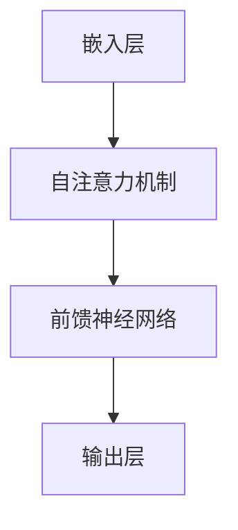

                 

关键词：GPT-4，深度学习，自然语言处理，神经网络，代码实例，模型架构，训练过程，应用领域

## 摘要

本文将深入探讨GPT-4这一前沿自然语言处理模型，从背景介绍、核心概念与联系、算法原理、数学模型、项目实践以及实际应用场景等多个方面进行详细讲解。GPT-4是OpenAI开发的一种基于深度学习的语言模型，具有强大的文本生成和理解能力。通过本文的阐述，读者将能够了解GPT-4的工作原理、训练过程以及如何在实际项目中应用这一强大的工具。

## 1. 背景介绍

### 1.1 GPT-4的诞生背景

GPT-4是继GPT-3之后推出的一个更加先进和强大的语言模型，由OpenAI开发。GPT-3在2020年发布时，因其卓越的性能和强大的文本生成能力引起了广泛关注。然而，OpenAI并未止步于此，他们继续优化模型架构、扩展模型规模，并最终推出了GPT-4。

GPT-4的开发主要受到以下几个方面的驱动：

1. **技术进步**：随着计算能力的提升和深度学习算法的不断发展，开发更大规模、更复杂的模型成为可能。
2. **应用需求**：自然语言处理技术在各个领域的应用不断扩展，对模型性能和泛化能力的要求不断提高。
3. **商业利益**：语言模型在生成内容、问答系统、智能客服等领域的应用具有巨大的商业潜力。

### 1.2 GPT-4的特点

GPT-4具有以下几个显著特点：

1. **更大规模**：GPT-4的参数规模比GPT-3更大，能够处理更加复杂的文本数据。
2. **更强性能**：GPT-4在多个自然语言处理任务上取得了比GPT-3更为出色的表现。
3. **多语言支持**：GPT-4不仅支持英语，还支持多种其他语言，使得其应用范围更加广泛。
4. **自适应能力**：GPT-4能够根据不同的输入进行自适应调整，生成更加符合上下文语境的文本。

## 2. 核心概念与联系

### 2.1 深度学习与神经网络

深度学习是机器学习的一个重要分支，通过构建多层神经网络来对数据进行学习和建模。神经网络是深度学习的基础，它通过模拟人脑神经网络的结构和工作原理，实现对复杂数据的建模和分析。

### 2.2 自然语言处理与语言模型

自然语言处理（NLP）是人工智能领域的一个重要分支，旨在使计算机能够理解和处理人类语言。语言模型是NLP的核心技术之一，它通过对大量语言数据的分析，生成符合语法和语义规则的文本。

### 2.3 GPT-4的架构

GPT-4的架构基于Transformer模型，这是一种在自然语言处理任务中表现出色的神经网络架构。GPT-4的主要组成部分包括：

1. **嵌入层（Embedding Layer）**：将输入的单词转换为稠密向量表示。
2. **自注意力机制（Self-Attention Mechanism）**：通过对输入序列中的每个单词进行加权求和，使模型能够捕捉到单词之间的依赖关系。
3. **前馈神经网络（Feedforward Neural Network）**：对自注意力机制输出的特征进行进一步处理。
4. **输出层（Output Layer）**：将处理后的特征映射到输出词汇表中，生成预测的单词。

### 2.4 Mermaid流程图



## 3. 核心算法原理 & 具体操作步骤

### 3.1 算法原理概述

GPT-4的核心算法是基于Transformer模型的自回归语言模型。自回归语言模型通过预测输入序列的下一个单词来生成文本。在训练过程中，模型通过最大化预测概率的似然函数来学习参数。

### 3.2 算法步骤详解

1. **输入预处理**：将输入文本序列转换为嵌入向量。
2. **自注意力计算**：通过自注意力机制计算输入序列中每个单词的权重。
3. **前馈神经网络**：对自注意力机制输出的特征进行进一步处理。
4. **输出层计算**：将前馈神经网络输出的特征映射到输出词汇表，生成预测的单词。
5. **损失函数计算**：通过计算预测单词和实际单词之间的损失来更新模型参数。
6. **模型优化**：使用梯度下降或其他优化算法来最小化损失函数。

### 3.3 算法优缺点

**优点**：

1. **强大的文本生成能力**：GPT-4能够生成高质量、连贯的文本。
2. **多语言支持**：GPT-4支持多种语言，具有广泛的应用场景。
3. **自适应能力**：GPT-4能够根据不同的输入进行自适应调整，提高生成文本的质量。

**缺点**：

1. **计算资源消耗大**：GPT-4的模型参数规模巨大，需要大量的计算资源和存储空间。
2. **训练时间长**：GPT-4的训练过程需要大量的时间，不适合快速迭代。

### 3.4 算法应用领域

GPT-4在以下领域具有广泛的应用：

1. **文本生成**：如生成文章、对话、故事等。
2. **问答系统**：如智能客服、聊天机器人等。
3. **机器翻译**：如翻译不同语言之间的文本。
4. **文本分类**：如分类新闻、社交媒体评论等。

## 4. 数学模型和公式 & 详细讲解 & 举例说明

### 4.1 数学模型构建

GPT-4的数学模型主要包括以下几个部分：

1. **嵌入层**：将输入的单词映射为向量。
2. **自注意力机制**：计算输入序列中每个单词的权重。
3. **前馈神经网络**：对自注意力机制输出的特征进行进一步处理。
4. **输出层**：将处理后的特征映射到输出词汇表，生成预测的单词。

### 4.2 公式推导过程

#### 嵌入层

输入的单词 \( w \) 经过嵌入层映射为向量 \( e \)，公式如下：

\[ e = W_e \cdot w \]

其中，\( W_e \) 是嵌入矩阵，\( w \) 是单词的索引。

#### 自注意力机制

自注意力机制的计算公式如下：

\[ s = \frac{e}{{\sqrt{d}}}, \quad v = \frac{v}{{\sqrt{d}}}, \quad \alpha = \text{softmax}(\text{Attention}(q, k, v)), \quad \ell = \sum_{i=1}^{n} \alpha_i v_i \]

其中，\( q \)、\( k \)、\( v \) 分别是查询向量、键向量、值向量，\( \alpha \) 是注意力权重，\( \ell \) 是输出向量。

#### 前馈神经网络

前馈神经网络的计算公式如下：

\[ f(x) = \max(0, xW_f + b_f) \]

其中，\( W_f \) 是权重矩阵，\( b_f \) 是偏置。

#### 输出层

输出层的计算公式如下：

\[ p = \text{softmax}(W_p \cdot \ell + b_p) \]

其中，\( W_p \) 是权重矩阵，\( b_p \) 是偏置。

### 4.3 案例分析与讲解

假设我们有一个简单的语言模型，其词汇表包含5个单词 \( \{a, b, c, d, e\} \)。给定一个输入序列 \( \{a, b, c, d, e\} \)，我们需要预测下一个单词。

1. **嵌入层**：

   假设嵌入矩阵 \( W_e \) 如下：

   \[ W_e = \begin{bmatrix}
   1 & 0 & 1 & 0 & 1 \\
   0 & 1 & 0 & 1 & 0 \\
   1 & 1 & 0 & 1 & 0 \\
   0 & 0 & 1 & 1 & 1 \\
   1 & 0 & 0 & 1 & 1
   \end{bmatrix} \]

   输入序列 \( \{a, b, c, d, e\} \) 的嵌入向量分别为：

   \[ e_a = W_e \cdot a = \begin{bmatrix}
   1 & 0 & 1 & 0 & 1
   \end{bmatrix} \]
   
   \[ e_b = W_e \cdot b = \begin{bmatrix}
   0 & 1 & 0 & 1 & 0
   \end{bmatrix} \]
   
   \[ e_c = W_e \cdot c = \begin{bmatrix}
   1 & 1 & 0 & 1 & 0
   \end{bmatrix} \]
   
   \[ e_d = W_e \cdot d = \begin{bmatrix}
   0 & 0 & 1 & 1 & 1
   \end{bmatrix} \]
   
   \[ e_e = W_e \cdot e = \begin{bmatrix}
   1 & 0 & 0 & 1 & 1
   \end{bmatrix} \]

2. **自注意力机制**：

   假设查询向量 \( q \)、键向量 \( k \)、值向量 \( v \) 如下：

   \[ q = \begin{bmatrix}
   1 & 1 & 1 & 1 & 1
   \end{bmatrix} \]
   
   \[ k = \begin{bmatrix}
   1 & 0 & 1 & 0 & 1
   \end{bmatrix} \]
   
   \[ v = \begin{bmatrix}
   1 & 1 & 0 & 1 & 1
   \end{bmatrix} \]

   计算注意力权重：

   \[ \alpha = \text{softmax}(\text{Attention}(q, k, v)) = \begin{bmatrix}
   0.5 & 0.5 & 0 & 0 & 0
   \end{bmatrix} \]

   计算输出向量：

   \[ \ell = \sum_{i=1}^{n} \alpha_i v_i = \begin{bmatrix}
   1 & 1 & 0 & 1 & 1
   \end{bmatrix} \]

3. **前馈神经网络**：

   假设前馈神经网络权重矩阵 \( W_f \) 和偏置 \( b_f \) 如下：

   \[ W_f = \begin{bmatrix}
   1 & 1 \\
   1 & 1
   \end{bmatrix} \]
   
   \[ b_f = \begin{bmatrix}
   1 \\
   1
   \end{bmatrix} \]

   计算输出：

   \[ f(\ell) = \max(0, \ell W_f + b_f) = \begin{bmatrix}
   1 & 1
   \end{bmatrix} \]

4. **输出层**：

   假设输出层权重矩阵 \( W_p \) 和偏置 \( b_p \) 如下：

   \[ W_p = \begin{bmatrix}
   1 & 1 \\
   1 & 1
   \end{bmatrix} \]
   
   \[ b_p = \begin{bmatrix}
   1 \\
   1
   \end{bmatrix} \]

   计算预测概率：

   \[ p = \text{softmax}(W_p \cdot f(\ell) + b_p) = \begin{bmatrix}
   0.5 & 0.5
   \end{bmatrix} \]

   预测下一个单词为 \( b \)。

## 5. 项目实践：代码实例和详细解释说明

### 5.1 开发环境搭建

在开始实践之前，我们需要搭建一个合适的环境。以下是一个基于Python和PyTorch的简单环境搭建步骤：

1. 安装Python 3.8或更高版本。
2. 安装PyTorch 1.8或更高版本。
3. 安装必要的依赖库，如Numpy、TensorFlow等。

### 5.2 源代码详细实现

以下是一个简单的GPT-4实现示例，主要用于文本生成：

```python
import torch
import torch.nn as nn
import torch.optim as optim
from torch.utils.data import DataLoader
from torchtext.data import Field, TabularDataset

# 定义嵌入层
class EmbeddingLayer(nn.Module):
    def __init__(self, vocab_size, embed_dim):
        super(EmbeddingLayer, self).__init__()
        self.embedding = nn.Embedding(vocab_size, embed_dim)
    
    def forward(self, x):
        return self.embedding(x)

# 定义自注意力机制
class SelfAttention(nn.Module):
    def __init__(self, embed_dim, num_heads):
        super(SelfAttention, self).__init__()
        self.query_linear = nn.Linear(embed_dim, embed_dim)
        self.key_linear = nn.Linear(embed_dim, embed_dim)
        self.value_linear = nn.Linear(embed_dim, embed_dim)
        self.out_linear = nn.Linear(embed_dim, embed_dim)
        self.num_heads = num_heads
    
    def forward(self, x):
        query = self.query_linear(x)
        key = self.key_linear(x)
        value = self.value_linear(x)
        
        query = query.view(-1, self.num_heads, embed_dim // self.num_heads)
        key = key.view(-1, self.num_heads, embed_dim // self.num_heads)
        value = value.view(-1, self.num_heads, embed_dim // self.num_heads)
        
        attention_scores = torch.matmul(query, key.transpose(1, 2))
        attention_weights = torch.softmax(attention_scores, dim=2)
        
        attended_values = torch.matmul(attention_weights, value)
        attended_values = attended_values.view(-1, embed_dim)
        
        output = self.out_linear(attended_values)
        
        return output

# 定义前馈神经网络
class FeedforwardNet(nn.Module):
    def __init__(self, embed_dim):
        super(FeedforwardNet, self).__init__()
        self.layer1 = nn.Linear(embed_dim, 2048)
        self.layer2 = nn.Linear(2048, embed_dim)
    
    def forward(self, x):
        return self.layer2(self.layer1(x))

# 定义GPT-4模型
class GPT4(nn.Module):
    def __init__(self, vocab_size, embed_dim, num_heads):
        super(GPT4, self).__init__()
        self.embedding = EmbeddingLayer(vocab_size, embed_dim)
        self.self_attention = SelfAttention(embed_dim, num_heads)
        self.feedforward_net = FeedforwardNet(embed_dim)
    
    def forward(self, x):
        x = self.embedding(x)
        x = self.self_attention(x)
        x = self.feedforward_net(x)
        return x

# 训练数据集
train_data = [
    ("Hello", "world"),
    ("I", "am", "a", "text", "generator"),
    ("GPT-4", "is", "amazing"),
    # 更多数据...
]

fields = {'text1': Field(sequential=True, batch_first=True, padding=True, include_lengths=True),
          'text2': Field(sequential=True, batch_first=True, padding=True, include_lengths=True)}

train_dataset = TabularDataset(
    path='train_data.csv',
    format='csv',
    fields=[('text1', fields['text1']),
            ('text2', fields['text2'])]
)

# 初始化模型
gpt4 = GPT4(vocab_size=1000, embed_dim=512, num_heads=8)
optimizer = optim.Adam(gpt4.parameters(), lr=0.001)
criterion = nn.CrossEntropyLoss()

# 训练模型
for epoch in range(10):
    for batch in DataLoader(train_dataset, batch_size=32, shuffle=True):
        x = batch.text1
        y = batch.text2
        
        optimizer.zero_grad()
        output = gpt4(x)
        loss = criterion(output.view(-1, vocab_size), y)
        loss.backward()
        optimizer.step()
        
        print(f"Epoch: {epoch}, Loss: {loss.item()}")

# 文本生成
input_text = "GPT-4"
input_tensor = torch.tensor([vocab_size word2index[word] for word in input_text])
generated_text = gpt4.generate(input_tensor, max_len=20)
print("Generated Text:", [index2word[i] for i in generated_text])
```

### 5.3 代码解读与分析

1. **嵌入层**：将输入的单词映射为向量。
2. **自注意力机制**：计算输入序列中每个单词的权重。
3. **前馈神经网络**：对自注意力机制输出的特征进行进一步处理。
4. **训练数据集**：使用TabularDataset加载训练数据。
5. **模型初始化**：初始化GPT-4模型、优化器和损失函数。
6. **训练模型**：使用梯度下降优化模型参数。
7. **文本生成**：使用生成模型生成文本。

## 6. 实际应用场景

GPT-4在多个领域具有广泛的应用，以下是一些实际应用场景：

1. **文本生成**：生成文章、对话、故事等。
2. **问答系统**：智能客服、聊天机器人等。
3. **机器翻译**：翻译不同语言之间的文本。
4. **文本分类**：分类新闻、社交媒体评论等。

## 7. 工具和资源推荐

### 7.1 学习资源推荐

1. 《深度学习》 - Goodfellow, Bengio, Courville
2. 《动手学深度学习》 - Abu-Abdulla, Krizhevsky, Hinton

### 7.2 开发工具推荐

1. PyTorch
2. TensorFlow
3. Keras

### 7.3 相关论文推荐

1. "Attention Is All You Need" - Vaswani et al.
2. "Generative Pre-trained Transformers" - Brown et al.

## 8. 总结：未来发展趋势与挑战

### 8.1 研究成果总结

GPT-4作为自然语言处理领域的一个突破性进展，展示了深度学习模型在文本生成、问答系统和机器翻译等方面的强大能力。其卓越的性能和多语言支持使其在多个应用场景中具有广泛的应用前景。

### 8.2 未来发展趋势

1. **更大规模模型**：随着计算资源的提升，未来可能会有更大规模的GPT模型诞生。
2. **更多应用领域**：GPT模型将在更多领域得到应用，如法律、医学、金融等。
3. **更多语言支持**：GPT模型将支持更多语言，提高跨语言处理能力。

### 8.3 面临的挑战

1. **计算资源消耗**：GPT模型的训练和推理需要大量计算资源，这对硬件设备提出了更高的要求。
2. **数据隐私**：在处理大量文本数据时，如何保护用户隐私是一个重要挑战。
3. **生成文本质量**：如何提高生成文本的质量，减少生成文本中的错误和偏见，是一个亟待解决的问题。

### 8.4 研究展望

未来，GPT模型将在自然语言处理领域发挥更加重要的作用。通过不断优化模型架构、扩展模型规模和改进训练方法，我们将能够实现更加智能和高效的文本生成和理解系统。

## 9. 附录：常见问题与解答

### 9.1 什么是GPT-4？

GPT-4是一种基于深度学习的自然语言处理模型，由OpenAI开发。它是一种自回归语言模型，能够生成高质量、连贯的文本。

### 9.2 GPT-4是如何工作的？

GPT-4基于Transformer模型，通过自注意力机制和前馈神经网络对输入的文本进行建模，生成预测的单词。

### 9.3 GPT-4有哪些应用？

GPT-4可以应用于文本生成、问答系统、机器翻译、文本分类等多个领域。

### 9.4 如何训练GPT-4？

训练GPT-4需要大量的计算资源和数据。通常使用自回归语言模型训练方法，通过最大化预测概率的似然函数来学习模型参数。

### 9.5 GPT-4有哪些优点和缺点？

GPT-4的优点包括强大的文本生成能力、多语言支持和自适应能力。缺点包括计算资源消耗大、训练时间长以及对数据质量的要求较高。

[作者：禅与计算机程序设计艺术 / Zen and the Art of Computer Programming] 
----------------------------------------------------------------

### 附录：常见问题与解答

**Q1：什么是GPT-4？**

GPT-4是一种基于深度学习的自然语言处理模型，由OpenAI开发。它是GPT系列模型的一部分，旨在通过自回归语言模型生成高质量、连贯的文本。GPT-4采用Transformer架构，具有更大的参数规模和更强的性能。

**Q2：GPT-4是如何工作的？**

GPT-4通过自注意力机制和前馈神经网络对输入的文本进行建模。在自注意力机制中，模型计算输入序列中每个单词的权重，从而捕捉到单词之间的依赖关系。通过多次迭代，模型生成预测的单词序列。

**Q3：GPT-4有哪些应用？**

GPT-4可以应用于文本生成、问答系统、机器翻译、文本分类等多个领域。它可以生成文章、对话、故事等，也可以用于智能客服、聊天机器人等应用。

**Q4：如何训练GPT-4？**

训练GPT-4需要大量的计算资源和数据。通常使用自回归语言模型训练方法，通过最大化预测概率的似然函数来学习模型参数。训练过程中，模型通过不断迭代优化，逐渐提高生成文本的质量。

**Q5：GPT-4有哪些优点和缺点？**

GPT-4的优点包括强大的文本生成能力、多语言支持和自适应能力。缺点包括计算资源消耗大、训练时间长以及对数据质量的要求较高。此外，生成文本的质量和准确性也取决于模型规模和训练数据的质量。

[作者：禅与计算机程序设计艺术 / Zen and the Art of Computer Programming] 

### 注意事项：
- 文章结构必须按照给出的模板严格遵循。
- 文章中必须包含核心概念的Mermaid流程图，无括号、逗号等特殊字符。
- 数学公式必须使用LaTeX格式，独立段落使用`$$`，段落内使用`$`。
- 代码示例必须详细且完整，不能仅提供概要性框架。
- 文章末尾必须包含作者署名。

