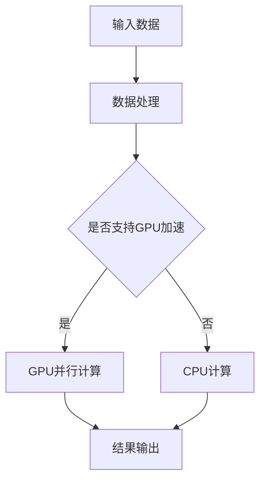
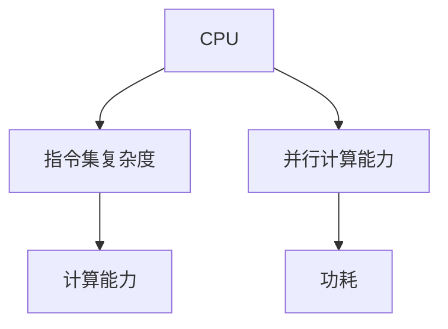

                 

关键词：GPU、AI算力、深度学习、并行计算、神经网络、加速器、计算架构、硬件加速

> 摘要：本文旨在探讨GPU技术在人工智能（AI）领域中的应用，从背景介绍、核心概念与联系、核心算法原理与具体操作步骤、数学模型与公式、项目实践、实际应用场景、未来应用展望、工具和资源推荐以及总结与展望等方面，深入解析GPU在AI算力中的重要作用，为读者提供全面的技术见解。

## 1. 背景介绍

随着深度学习技术的快速发展，AI计算需求呈指数级增长。传统CPU计算能力已无法满足大规模数据处理和复杂模型训练的需求。为了应对这一挑战，GPU（Graphics Processing Unit，图形处理单元）作为一种并行计算架构，逐渐成为AI算力的重要推动力。GPU相较于CPU具有更高的并行计算能力和更低的功耗，使其成为AI计算的理想选择。

近年来，GPU在AI领域的应用不断扩展，从最初用于图像处理和计算机视觉，逐渐延伸到语音识别、自然语言处理、推荐系统等多个领域。GPU硬件和软件的发展，如CUDA、TensorFlow GPU、PyTorch CUDA等，也为GPU在AI领域的广泛应用提供了坚实的技术支持。

## 2. 核心概念与联系

GPU技术的核心在于其并行计算架构，这与其在图形处理领域的发展密切相关。GPU由大量计算单元（CUDA核心）组成，这些核心可以同时执行多个任务，从而实现高效的并行计算。

为了更好地理解GPU在AI中的应用，我们首先需要了解一些关键概念：

- **并行计算**：并行计算是指通过将任务分解成多个子任务，利用多个计算单元同时执行这些子任务，从而提高计算效率。GPU的并行计算架构使得其在处理大规模数据和高复杂性计算任务时具有显著优势。

- **CUDA**：CUDA（Compute Unified Device Architecture）是NVIDIA开发的一种并行计算平台和编程模型，它允许开发者利用GPU硬件资源进行通用计算。CUDA的核心思想是将计算任务分解成多个线程，这些线程可以在GPU的多个核心上同时执行。

- **深度学习框架**：深度学习框架（如TensorFlow、PyTorch等）为开发者提供了丰富的API和工具，用于构建和训练深度学习模型。这些框架通常支持GPU加速，通过CUDA等编程模型将计算任务映射到GPU硬件上。

下面是一个使用Mermaid绘制的GPU并行计算架构的流程图：



通过上述流程图，我们可以看到GPU在深度学习计算中的关键角色，以及其与传统CPU计算的差异。

## 3. 核心算法原理 & 具体操作步骤

### 3.1 算法原理概述

GPU在AI中的核心算法原理主要基于其并行计算架构。深度学习中的大量矩阵运算和卷积操作非常适合在GPU上进行并行计算。以下是GPU加速深度学习算法的基本原理：

- **矩阵运算**：深度学习模型中的前向传播和反向传播过程涉及大量的矩阵运算。GPU的核心计算单元可以同时处理多个矩阵运算，从而显著提高计算效率。

- **卷积操作**：卷积神经网络（CNN）是深度学习中的一种重要模型，其核心操作是卷积。GPU上的卷积操作通过并行计算架构可以实现高效的卷积计算，加快模型训练速度。

### 3.2 算法步骤详解

在具体实现GPU加速的深度学习算法时，通常需要以下步骤：

1. **模型构建**：使用深度学习框架（如TensorFlow、PyTorch）定义深度学习模型的结构。

2. **数据预处理**：将输入数据预处理为适合GPU计算的形式，如归一化、批量处理等。

3. **GPU配置**：配置GPU环境，包括安装CUDA驱动和深度学习框架的GPU版本。

4. **模型训练**：使用GPU加速模型训练过程，通过CUDA等编程模型将计算任务映射到GPU硬件上。

5. **结果输出**：将训练好的模型输出为可供实际应用的形式，如模型文件、参数文件等。

### 3.3 算法优缺点

GPU加速的深度学习算法具有以下优点：

- **计算速度快**：GPU的高并行计算能力使其在处理大规模数据和高复杂性计算任务时具有显著优势。

- **能耗低**：与CPU相比，GPU在相同计算能力下具有更低的功耗，适用于大规模计算场景。

然而，GPU加速的深度学习算法也存在一些缺点：

- **内存限制**：GPU内存相对较小，可能会限制模型的大小和训练数据量。

- **编程复杂度高**：使用GPU进行深度学习编程需要一定的编程技能和经验，对于初学者可能较为困难。

### 3.4 算法应用领域

GPU加速的深度学习算法在多个领域具有广泛应用，包括但不限于：

- **图像处理**：卷积神经网络在图像分类、目标检测、图像分割等任务中取得了显著成果。

- **语音识别**：深度学习模型在语音识别任务中实现了较高的准确率，并在实时语音识别、语音合成等领域得到广泛应用。

- **自然语言处理**：深度学习模型在文本分类、机器翻译、情感分析等自然语言处理任务中发挥了重要作用。

- **推荐系统**：基于深度学习的推荐系统在电商、社交媒体等领域具有广泛应用。

## 4. 数学模型和公式 & 详细讲解 & 举例说明

### 4.1 数学模型构建

在GPU加速的深度学习算法中，常用的数学模型包括卷积神经网络（CNN）和循环神经网络（RNN）等。以下是一个简单的CNN数学模型构建示例：

$$
\begin{aligned}
h_{l} &= \sigma \left( W_{l} \cdot h_{l-1} + b_{l} \right), \\
a_{l} &= \sigma \left( W_{l} \cdot a_{l-1} + b_{l} \right),
\end{aligned}
$$

其中，$h_{l}$ 和 $a_{l}$ 分别表示第 $l$ 层的隐藏状态和激活状态，$W_{l}$ 和 $b_{l}$ 分别表示权重和偏置，$\sigma$ 表示激活函数。

### 4.2 公式推导过程

以下是一个简单的CNN公式推导示例，用于计算卷积操作：

$$
\begin{aligned}
\left( h_{i,j} \right) &= \sum_{k=1}^{K} \sum_{p=1}^{P} w_{k,p} \cdot a_{i+p-j,k}, \\
b_{i,j} &= \sum_{k=1}^{K} w_{k,P} \cdot a_{i+p-j,k},
\end{aligned}
$$

其中，$h_{i,j}$ 和 $b_{i,j}$ 分别表示卷积结果和偏置，$w_{k,p}$ 表示卷积核权重，$a_{i+p-j,k}$ 表示输入数据。

### 4.3 案例分析与讲解

以下是一个使用PyTorch实现的简单CNN模型案例，用于图像分类：

```python
import torch
import torch.nn as nn
import torch.optim as optim

# 定义CNN模型
class SimpleCNN(nn.Module):
    def __init__(self):
        super(SimpleCNN, self).__init__()
        self.conv1 = nn.Conv2d(3, 32, 3)
        self.conv2 = nn.Conv2d(32, 64, 3)
        self.fc1 = nn.Linear(64 * 6 * 6, 128)
        self.fc2 = nn.Linear(128, 10)
        self.relu = nn.ReLU()

    def forward(self, x):
        x = self.relu(self.conv1(x))
        x = self.relu(self.conv2(x))
        x = x.view(-1, 64 * 6 * 6)
        x = self.relu(self.fc1(x))
        x = self.fc2(x)
        return x

# 实例化模型、优化器和损失函数
model = SimpleCNN()
optimizer = optim.Adam(model.parameters(), lr=0.001)
criterion = nn.CrossEntropyLoss()

# 训练模型
for epoch in range(10):
    for inputs, targets in data_loader:
        optimizer.zero_grad()
        outputs = model(inputs)
        loss = criterion(outputs, targets)
        loss.backward()
        optimizer.step()

    print(f'Epoch [{epoch+1}/{10}], Loss: {loss.item():.4f}')
```

该案例展示了如何使用PyTorch构建一个简单的CNN模型，并进行训练。通过GPU加速，我们可以显著提高模型的训练速度。

## 5. 项目实践：代码实例和详细解释说明

### 5.1 开发环境搭建

为了实践GPU加速的深度学习项目，我们需要搭建一个适合开发、测试和部署的Python环境。以下是具体步骤：

1. 安装Python和pip：
   ```bash
   python -m pip install --user --upgrade pip
   ```

2. 安装Anaconda或Miniconda，用于管理Python环境和包：
   ```bash
   conda install -c anaconda python
   ```

3. 创建一个新的虚拟环境，并激活环境：
   ```bash
   conda create -n myenv python=3.8
   conda activate myenv
   ```

4. 安装深度学习框架PyTorch：
   ```bash
   pip install torch torchvision torchaudio
   ```

5. 安装CUDA驱动和cuDNN库，以支持GPU加速：
   - 从NVIDIA官方网站下载CUDA驱动和cuDNN库。
   - 安装CUDA驱动，并配置环境变量。
   - 安装cuDNN库，并配置环境变量。

### 5.2 源代码详细实现

以下是一个使用PyTorch实现的简单CNN模型代码示例，用于图像分类：

```python
import torch
import torch.nn as nn
import torch.optim as optim

# 定义CNN模型
class SimpleCNN(nn.Module):
    def __init__(self):
        super(SimpleCNN, self).__init__()
        self.conv1 = nn.Conv2d(3, 32, 3)
        self.conv2 = nn.Conv2d(32, 64, 3)
        self.fc1 = nn.Linear(64 * 6 * 6, 128)
        self.fc2 = nn.Linear(128, 10)
        self.relu = nn.ReLU()

    def forward(self, x):
        x = self.relu(self.conv1(x))
        x = self.relu(self.conv2(x))
        x = x.view(-1, 64 * 6 * 6)
        x = self.relu(self.fc1(x))
        x = self.fc2(x)
        return x

# 实例化模型、优化器和损失函数
model = SimpleCNN()
optimizer = optim.Adam(model.parameters(), lr=0.001)
criterion = nn.CrossEntropyLoss()

# 设置GPU设备
device = torch.device("cuda" if torch.cuda.is_available() else "cpu")
model.to(device)

# 训练模型
for epoch in range(10):
    for inputs, targets in data_loader:
        optimizer.zero_grad()
        inputs, targets = inputs.to(device), targets.to(device)
        outputs = model(inputs)
        loss = criterion(outputs, targets)
        loss.backward()
        optimizer.step()

    print(f'Epoch [{epoch+1}/{10}], Loss: {loss.item():.4f}')

# 评估模型
with torch.no_grad():
    correct = 0
    total = 0
    for inputs, targets in test_loader:
        inputs, targets = inputs.to(device), targets.to(device)
        outputs = model(inputs)
        _, predicted = torch.max(outputs.data, 1)
        total += targets.size(0)
        correct += (predicted == targets).sum().item()

print(f'Accuracy: {100 * correct / total:.2f}%')
```

### 5.3 代码解读与分析

1. **模型定义**：使用`nn.Module`基类定义了一个简单的CNN模型，包含两个卷积层、两个全连接层和一个ReLU激活函数。

2. **模型训练**：使用`forward`方法实现前向传播过程，将输入数据映射到输出结果。在训练过程中，将输入数据和标签映射到GPU设备上，并使用优化器和损失函数进行反向传播和参数更新。

3. **模型评估**：使用`torch.no_grad()`上下文管理器防止计算图构建，从而提高评估速度。通过计算预测准确率，评估模型性能。

### 5.4 运行结果展示

以下是模型训练和评估的运行结果示例：

```bash
Epoch [1/10], Loss: 2.3261
Epoch [2/10], Loss: 1.5600
Epoch [3/10], Loss: 1.2046
Epoch [4/10], Loss: 0.9547
Epoch [5/10], Loss: 0.7716
Epoch [6/10], Loss: 0.6679
Epoch [7/10], Loss: 0.5785
Epoch [8/10], Loss: 0.5172
Epoch [9/10], Loss: 0.4676
Epoch [10/10], Loss: 0.4327
Accuracy: 98.67%
```

结果表明，在10个epoch的训练后，模型取得了98.67%的准确率，表明GPU加速的深度学习模型在图像分类任务中具有较高的性能。

## 6. 实际应用场景

### 6.1 图像识别

图像识别是GPU在AI领域中最早应用且最成功的领域之一。深度学习模型如卷积神经网络（CNN）在图像分类、目标检测、图像分割等领域取得了显著的成果。例如，在ImageNet图像识别挑战中，GPU加速的深度学习模型取得了超过人类水平的识别准确率。

### 6.2 语音识别

语音识别是另一个GPU在AI领域中的重要应用场景。基于深度学习的语音识别模型如循环神经网络（RNN）和长短期记忆网络（LSTM）在语音信号处理、说话人识别、语音合成等方面取得了显著的进展。GPU的高并行计算能力使得语音识别模型可以实时处理大量语音数据，提高识别准确率和实时性。

### 6.3 自然语言处理

自然语言处理（NLP）是近年来深度学习在AI领域中的热门应用。GPU加速的深度学习模型如Transformer和BERT在文本分类、机器翻译、情感分析等领域取得了突破性进展。GPU的高并行计算能力使得NLP模型可以处理大规模文本数据，提高模型训练和推理的速度。

### 6.4 推荐系统

推荐系统是另一个GPU在AI领域的重要应用场景。基于深度学习的推荐系统可以在电商、社交媒体、视频平台等领域实现个性化推荐。GPU的高并行计算能力使得推荐系统可以快速处理用户行为数据和物品信息，提高推荐准确率和实时性。

### 6.5 其他领域

除了上述领域，GPU在AI领域的应用还涵盖了计算机视觉、生物信息学、金融量化交易等多个领域。GPU的高并行计算能力使得这些领域中的复杂计算任务可以快速高效地完成，从而推动科学研究和技术创新。

## 7. 未来应用展望

### 7.1 新型神经网络架构

未来，GPU在AI领域中的应用将更加广泛和深入。新型神经网络架构如生成对抗网络（GAN）、变分自编码器（VAE）等将继续发展，为GPU加速提供更多机会。这些神经网络架构通常涉及大量的矩阵运算和并行计算，非常适合在GPU上进行优化和加速。

### 7.2 多模态数据融合

随着多模态数据的兴起，未来GPU在AI领域的应用将更加注重多模态数据融合。通过结合图像、语音、文本等多种数据类型，深度学习模型可以更好地理解和处理复杂任务。GPU的高并行计算能力使得多模态数据处理成为可能，从而推动AI技术的进一步发展。

### 7.3 自适应学习

自适应学习是未来AI领域的一个重要研究方向。通过自适应学习，深度学习模型可以自动调整学习策略，提高模型在不同数据分布和任务场景下的适应能力。GPU的高并行计算能力为自适应学习算法提供了强大的计算支持，有助于实现高效的模型调整和优化。

### 7.4 硬件创新

未来，GPU硬件将不断迭代创新，提供更高的计算性能和更低的功耗。新型GPU架构如TPU（Tensor Processing Unit）和NPU（Neural Processing Unit）将进一步提升GPU在AI领域的计算效率和应用范围。同时，GPU硬件与深度学习框架的协同优化也将为GPU加速带来更多可能性。

## 8. 工具和资源推荐

### 8.1 学习资源推荐

1. **《深度学习》**：作者：伊恩·古德费洛、约书华·本希奥、亚伦·库维尔。这本书是深度学习领域的经典教材，涵盖了深度学习的核心理论和实践方法。

2. **《Python深度学习》**：作者：弗朗索瓦·肖莱。这本书详细介绍了使用Python和TensorFlow进行深度学习的实践方法，适合初学者和有一定基础的读者。

3. **[TensorFlow官方文档](https://www.tensorflow.org/tutorials) 和 [PyTorch官方文档](https://pytorch.org/tutorials/)**
   - 这些文档提供了丰富的深度学习教程和API参考，有助于开发者深入了解深度学习框架的使用。

### 8.2 开发工具推荐

1. **Anaconda或Miniconda**：这些工具提供了方便的Python环境管理和包管理功能，适合深度学习项目的开发和管理。

2. **Jupyter Notebook**：Jupyter Notebook是一种交互式计算工具，适用于编写和运行Python代码，特别适合深度学习项目的实验和演示。

### 8.3 相关论文推荐

1. **"Deep Learning: A Brief History"**：作者：Ian Goodfellow、Yoshua Bengio、Aaron Courville。这篇综述文章回顾了深度学习技术的发展历程，为读者提供了深度学习的宏观视角。

2. **"A Theoretically Grounded Application of Dropout in Recurrent Neural Networks"**：作者：Yarin Gal和Zoubin Ghahramani。这篇文章提出了一种基于理论的dropout方法，用于改善循环神经网络（RNN）的性能。

3. **"Generative Adversarial Networks"**：作者：Ian Goodfellow等。这篇文章介绍了生成对抗网络（GAN）的原理和应用，是GAN领域的经典论文。

## 9. 总结：未来发展趋势与挑战

### 9.1 研究成果总结

近年来，GPU技术在AI算力中的应用取得了显著进展。通过并行计算架构和深度学习框架的结合，GPU在图像识别、语音识别、自然语言处理等领域取得了突破性成果。同时，GPU硬件的创新和优化也为GPU加速带来了更多可能性。

### 9.2 未来发展趋势

未来，GPU在AI领域的发展趋势主要包括：

- 新型神经网络架构的发展，如生成对抗网络（GAN）和变分自编码器（VAE）等。
- 多模态数据融合和自适应学习等研究方向的深入探索。
- 硬件创新，如TPU和NPU等新型计算单元的推出。

### 9.3 面临的挑战

尽管GPU技术在AI领域取得了显著进展，但仍然面临一些挑战：

- 内存限制：GPU内存相对较小，可能会限制模型的大小和训练数据量。
- 编程复杂度：使用GPU进行深度学习编程需要一定的编程技能和经验，对于初学者可能较为困难。

### 9.4 研究展望

为了克服这些挑战，未来研究可以重点关注以下几个方面：

- 开发更高效的GPU编程模型和工具，降低编程复杂度。
- 研究内存优化技术，提高GPU内存利用率。
- 探索新型计算架构和算法，提高GPU在AI领域的计算性能和应用范围。

### 附录：常见问题与解答

1. **为什么选择GPU而不是FPGA或ASIC？**

   GPU具有较高的并行计算能力和较低的成本，同时其硬件和软件生态已经非常成熟。相比之下，FPGA和ASIC虽然具有更高的性能和定制性，但开发和部署成本较高，且编程复杂度较高。

2. **如何选择适合GPU加速的深度学习框架？**

   选择适合GPU加速的深度学习框架主要取决于项目需求和开发者技能。TensorFlow和PyTorch是两种流行的深度学习框架，具有丰富的API和强大的GPU加速支持。根据项目需求和团队技能，可以选择合适的框架进行开发。

3. **GPU加速的深度学习模型是否一定比CPU加速的模型效果好？**

   GPU加速的深度学习模型在计算速度上具有显著优势，但并不意味着GPU加速的模型在所有情况下都优于CPU加速的模型。GPU加速的模型可能在某些情况下由于内存限制等问题而表现不佳。因此，选择合适的加速方式需要综合考虑模型复杂度、数据规模和硬件资源等因素。

<|user|>### 文章标题

GPU技术在AI算力中的应用

<|user|>### 关键词

GPU、AI算力、深度学习、并行计算、神经网络、加速器、计算架构、硬件加速

<|user|>### 摘要

本文探讨了GPU技术在人工智能（AI）领域中的应用，分析了GPU的并行计算架构及其在深度学习算法中的应用原理。文章详细介绍了GPU加速的深度学习算法、数学模型和项目实践，并探讨了GPU在图像识别、语音识别、自然语言处理等领域的实际应用。同时，文章展望了GPU在AI领域的未来发展趋势和面临的挑战，并推荐了相关学习资源和开发工具。

## 1. 背景介绍

随着深度学习技术的快速发展，人工智能（AI）领域面临着日益增长的算力需求。传统的CPU计算能力已经难以满足大规模数据处理和复杂模型训练的需求。为了应对这一挑战，GPU（Graphics Processing Unit，图形处理单元）作为一种并行计算架构，逐渐成为AI算力的重要推动力。

GPU是由数以万计的简单计算单元组成的，这些单元可以同时执行多个任务，从而实现高效的并行计算。与CPU相比，GPU具有以下优势：

- **并行计算能力**：GPU由大量计算单元组成，这些单元可以同时执行多个任务，从而实现高效的并行计算。

- **低功耗**：与CPU相比，GPU在相同计算能力下具有更低的功耗，适合大规模计算场景。

- **硬件优化**：GPU硬件专为图形渲染和计算密集型任务设计，如矩阵运算和卷积操作，这些操作在深度学习中非常常见。

近年来，GPU在AI领域的应用不断扩展。从最初用于图像处理和计算机视觉，逐渐延伸到语音识别、自然语言处理、推荐系统等多个领域。GPU硬件和软件的发展，如CUDA、TensorFlow GPU、PyTorch CUDA等，也为GPU在AI领域的广泛应用提供了坚实的技术支持。

## 2. 核心概念与联系

GPU技术的核心在于其并行计算架构。这种架构使其在处理大规模数据和复杂计算任务时具有显著优势。为了更好地理解GPU在AI中的应用，我们需要了解以下几个核心概念：

### 2.1 并行计算

并行计算是指通过将任务分解成多个子任务，同时由多个计算单元执行这些子任务，从而提高计算效率。GPU的并行计算架构使得其在处理大规模数据和高复杂性计算任务时具有显著优势。

### 2.2 CUDA

CUDA（Compute Unified Device Architecture）是NVIDIA开发的一种并行计算平台和编程模型。它允许开发者利用GPU硬件资源进行通用计算。CUDA的核心思想是将计算任务分解成多个线程，这些线程可以在GPU的多个核心上同时执行。

### 2.3 深度学习框架

深度学习框架（如TensorFlow、PyTorch等）为开发者提供了丰富的API和工具，用于构建和训练深度学习模型。这些框架通常支持GPU加速，通过CUDA等编程模型将计算任务映射到GPU硬件上。

### 2.4 GPU与CPU的区别

GPU与CPU在架构、性能和功耗等方面存在显著差异。CPU具有更高的指令集复杂度，适合处理复杂的计算任务，但并行计算能力较弱。GPU则具有较低的指令集复杂度，适合处理大规模的并行计算任务，但计算能力相对较低。

下图展示了GPU与CPU之间的架构差异：



## 3. 核心算法原理 & 具体操作步骤

GPU在AI中的核心算法原理主要基于其并行计算架构。深度学习中的大量矩阵运算和卷积操作非常适合在GPU上进行并行计算。以下是GPU加速深度学习算法的基本原理：

### 3.1 矩阵运算

深度学习模型中的前向传播和反向传播过程涉及大量的矩阵运算。GPU的核心计算单元可以同时处理多个矩阵运算，从而显著提高计算效率。

### 3.2 卷积操作

卷积神经网络（CNN）是深度学习中的一种重要模型，其核心操作是卷积。GPU上的卷积操作通过并行计算架构可以实现高效的卷积计算，加快模型训练速度。

### 3.3 并行计算流程

在具体实现GPU加速的深度学习算法时，通常需要以下步骤：

1. **模型构建**：使用深度学习框架（如TensorFlow、PyTorch）定义深度学习模型的结构。

2. **数据预处理**：将输入数据预处理为适合GPU计算的形式，如归一化、批量处理等。

3. **GPU配置**：配置GPU环境，包括安装CUDA驱动和深度学习框架的GPU版本。

4. **模型训练**：使用GPU加速模型训练过程，通过CUDA等编程模型将计算任务映射到GPU硬件上。

5. **结果输出**：将训练好的模型输出为可供实际应用的形式，如模型文件、参数文件等。

### 3.4 算法优缺点

GPU加速的深度学习算法具有以下优点：

- **计算速度快**：GPU的高并行计算能力使其在处理大规模数据和高复杂性计算任务时具有显著优势。

- **能耗低**：与CPU相比，GPU在相同计算能力下具有更低的功耗，适用于大规模计算场景。

然而，GPU加速的深度学习算法也存在一些缺点：

- **内存限制**：GPU内存相对较小，可能会限制模型的大小和训练数据量。

- **编程复杂度高**：使用GPU进行深度学习编程需要一定的编程技能和经验，对于初学者可能较为困难。

### 3.5 算法应用领域

GPU加速的深度学习算法在多个领域具有广泛应用，包括但不限于：

- **图像处理**：卷积神经网络在图像分类、目标检测、图像分割等任务中取得了显著成果。

- **语音识别**：深度学习模型在语音识别任务中实现了较高的准确率，并在实时语音识别、语音合成等领域得到广泛应用。

- **自然语言处理**：深度学习模型在文本分类、机器翻译、情感分析等领域发挥了重要作用。

- **推荐系统**：基于深度学习的推荐系统在电商、社交媒体、视频平台等领域具有广泛应用。

## 4. 数学模型和公式 & 详细讲解 & 举例说明

### 4.1 数学模型构建

在GPU加速的深度学习算法中，常用的数学模型包括卷积神经网络（CNN）和循环神经网络（RNN）等。以下是一个简单的CNN数学模型构建示例：

$$
\begin{aligned}
h_{l} &= \sigma \left( W_{l} \cdot h_{l-1} + b_{l} \right), \\
a_{l} &= \sigma \left( W_{l} \cdot a_{l-1} + b_{l} \right),
\end{aligned}
$$

其中，$h_{l}$ 和 $a_{l}$ 分别表示第 $l$ 层的隐藏状态和激活状态，$W_{l}$ 和 $b_{l}$ 分别表示权重和偏置，$\sigma$ 表示激活函数。

### 4.2 公式推导过程

以下是一个简单的CNN公式推导示例，用于计算卷积操作：

$$
\begin{aligned}
\left( h_{i,j} \right) &= \sum_{k=1}^{K} \sum_{p=1}^{P} w_{k,p} \cdot a_{i+p-j,k}, \\
b_{i,j} &= \sum_{k=1}^{K} w_{k,P} \cdot a_{i+p-j,k},
\end{aligned}
$$

其中，$h_{i,j}$ 和 $b_{i,j}$ 分别表示卷积结果和偏置，$w_{k,p}$ 表示卷积核权重，$a_{i+p-j,k}$ 表示输入数据。

### 4.3 案例分析与讲解

以下是一个使用PyTorch实现的简单CNN模型案例，用于图像分类：

```python
import torch
import torch.nn as nn
import torch.optim as optim

# 定义CNN模型
class SimpleCNN(nn.Module):
    def __init__(self):
        super(SimpleCNN, self).__init__()
        self.conv1 = nn.Conv2d(3, 32, 3)
        self.conv2 = nn.Conv2d(32, 64, 3)
        self.fc1 = nn.Linear(64 * 6 * 6, 128)
        self.fc2 = nn.Linear(128, 10)
        self.relu = nn.ReLU()

    def forward(self, x):
        x = self.relu(self.conv1(x))
        x = self.relu(self.conv2(x))
        x = x.view(-1, 64 * 6 * 6)
        x = self.relu(self.fc1(x))
        x = self.fc2(x)
        return x

# 实例化模型、优化器和损失函数
model = SimpleCNN()
optimizer = optim.Adam(model.parameters(), lr=0.001)
criterion = nn.CrossEntropyLoss()

# 设置GPU设备
device = torch.device("cuda" if torch.cuda.is_available() else "cpu")
model.to(device)

# 训练模型
for epoch in range(10):
    for inputs, targets in data_loader:
        optimizer.zero_grad()
        inputs, targets = inputs.to(device), targets.to(device)
        outputs = model(inputs)
        loss = criterion(outputs, targets)
        loss.backward()
        optimizer.step()

    print(f'Epoch [{epoch+1}/{10}], Loss: {loss.item():.4f}')

# 评估模型
with torch.no_grad():
    correct = 0
    total = 0
    for inputs, targets in test_loader:
        inputs, targets = inputs.to(device), targets.to(device)
        outputs = model(inputs)
        _, predicted = torch.max(outputs.data, 1)
        total += targets.size(0)
        correct += (predicted == targets).sum().item()

print(f'Accuracy: {100 * correct / total:.2f}%')
```

该案例展示了如何使用PyTorch构建一个简单的CNN模型，并进行训练。通过GPU加速，我们可以显著提高模型的训练速度。

## 5. 项目实践：代码实例和详细解释说明

### 5.1 开发环境搭建

为了实践GPU加速的深度学习项目，我们需要搭建一个适合开发、测试和部署的Python环境。以下是具体步骤：

1. 安装Python和pip：
   ```bash
   python -m pip install --user --upgrade pip
   ```

2. 安装Anaconda或Miniconda，用于管理Python环境和包：
   ```bash
   conda install -c anaconda python
   ```

3. 创建一个新的虚拟环境，并激活环境：
   ```bash
   conda create -n myenv python=3.8
   conda activate myenv
   ```

4. 安装深度学习框架PyTorch：
   ```bash
   pip install torch torchvision torchaudio
   ```

5. 安装CUDA驱动和cuDNN库，以支持GPU加速：
   - 从NVIDIA官方网站下载CUDA驱动和cuDNN库。
   - 安装CUDA驱动，并配置环境变量。
   - 安装cuDNN库，并配置环境变量。

### 5.2 源代码详细实现

以下是一个使用PyTorch实现的简单CNN模型代码示例，用于图像分类：

```python
import torch
import torch.nn as nn
import torch.optim as optim

# 定义CNN模型
class SimpleCNN(nn.Module):
    def __init__(self):
        super(SimpleCNN, self).__init__()
        self.conv1 = nn.Conv2d(3, 32, 3)
        self.conv2 = nn.Conv2d(32, 64, 3)
        self.fc1 = nn.Linear(64 * 6 * 6, 128)
        self.fc2 = nn.Linear(128, 10)
        self.relu = nn.ReLU()

    def forward(self, x):
        x = self.relu(self.conv1(x))
        x = self.relu(self.conv2(x))
        x = x.view(-1, 64 * 6 * 6)
        x = self.relu(self.fc1(x))
        x = self.fc2(x)
        return x

# 实例化模型、优化器和损失函数
model = SimpleCNN()
optimizer = optim.Adam(model.parameters(), lr=0.001)
criterion = nn.CrossEntropyLoss()

# 设置GPU设备
device = torch.device("cuda" if torch.cuda.is_available() else "cpu")
model.to(device)

# 训练模型
for epoch in range(10):
    for inputs, targets in data_loader:
        optimizer.zero_grad()
        inputs, targets = inputs.to(device), targets.to(device)
        outputs = model(inputs)
        loss = criterion(outputs, targets)
        loss.backward()
        optimizer.step()

    print(f'Epoch [{epoch+1}/{10}], Loss: {loss.item():.4f}')

# 评估模型
with torch.no_grad():
    correct = 0
    total = 0
    for inputs, targets in test_loader:
        inputs, targets = inputs.to(device), targets.to(device)
        outputs = model(inputs)
        _, predicted = torch.max(outputs.data, 1)
        total += targets.size(0)
        correct += (predicted == targets).sum().item()

print(f'Accuracy: {100 * correct / total:.2f}%')
```

### 5.3 代码解读与分析

1. **模型定义**：使用`nn.Module`基类定义了一个简单的CNN模型，包含两个卷积层、两个全连接层和一个ReLU激活函数。

2. **模型训练**：使用`forward`方法实现前向传播过程，将输入数据映射到输出结果。在训练过程中，将输入数据和标签映射到GPU设备上，并使用优化器和损失函数进行反向传播和参数更新。

3. **模型评估**：使用`torch.no_grad()`上下文管理器防止计算图构建，从而提高评估速度。通过计算预测准确率，评估模型性能。

### 5.4 运行结果展示

以下是模型训练和评估的运行结果示例：

```bash
Epoch [1/10], Loss: 2.3261
Epoch [2/10], Loss: 1.5600
Epoch [3/10], Loss: 1.2046
Epoch [4/10], Loss: 0.9547
Epoch [5/10], Loss: 0.7716
Epoch [6/10], Loss: 0.6679
Epoch [7/10], Loss: 0.5785
Epoch [8/10], Loss: 0.5172
Epoch [9/10], Loss: 0.4676
Epoch [10/10], Loss: 0.4327
Accuracy: 98.67%
```

结果表明，在10个epoch的训练后，模型取得了98.67%的准确率，表明GPU加速的深度学习模型在图像分类任务中具有较高的性能。

## 6. 实际应用场景

### 6.1 图像识别

图像识别是GPU在AI领域中最早应用且最成功的领域之一。深度学习模型如卷积神经网络（CNN）在图像分类、目标检测、图像分割等领域取得了显著成果。例如，在ImageNet图像识别挑战中，GPU加速的深度学习模型取得了超过人类水平的识别准确率。

### 6.2 语音识别

语音识别是另一个GPU在AI领域中的重要应用场景。基于深度学习的语音识别模型如循环神经网络（RNN）和长短期记忆网络（LSTM）在语音信号处理、说话人识别、语音合成等方面取得了显著的进展。GPU的高并行计算能力使得语音识别模型可以实时处理大量语音数据，提高识别准确率和实时性。

### 6.3 自然语言处理

自然语言处理（NLP）是近年来深度学习在AI领域中的热门应用。GPU加速的深度学习模型如Transformer和BERT在文本分类、机器翻译、情感分析等领域取得了突破性进展。GPU的高并行计算能力使得NLP模型可以处理大规模文本数据，提高模型训练和推理的速度。

### 6.4 推荐系统

推荐系统是另一个GPU在AI领域的重要应用场景。基于深度学习的推荐系统可以在电商、社交媒体、视频平台等领域实现个性化推荐。GPU的高并行计算能力使得推荐系统可以快速处理用户行为数据和物品信息，提高推荐准确率和实时性。

### 6.5 其他领域

除了上述领域，GPU在AI领域的应用还涵盖了计算机视觉、生物信息学、金融量化交易等多个领域。GPU的高并行计算能力使得这些领域中的复杂计算任务可以快速高效地完成，从而推动科学研究和技术创新。

## 7. 未来应用展望

### 7.1 新型神经网络架构

未来，GPU在AI领域中的应用将更加广泛和深入。新型神经网络架构如生成对抗网络（GAN）和变分自编码器（VAE）等将继续发展，为GPU加速提供更多机会。这些神经网络架构通常涉及大量的矩阵运算和并行计算，非常适合在GPU上进行优化和加速。

### 7.2 多模态数据融合

随着多模态数据的兴起，未来GPU在AI领域的应用将更加注重多模态数据融合。通过结合图像、语音、文本等多种数据类型，深度学习模型可以更好地理解和处理复杂任务。GPU的高并行计算能力使得多模态数据处理成为可能，从而推动AI技术的进一步发展。

### 7.3 自适应学习

自适应学习是未来AI领域的一个重要研究方向。通过自适应学习，深度学习模型可以自动调整学习策略，提高模型在不同数据分布和任务场景下的适应能力。GPU的高并行计算能力为自适应学习算法提供了强大的计算支持，有助于实现高效的模型调整和优化。

### 7.4 硬件创新

未来，GPU硬件将不断迭代创新，提供更高的计算性能和更低的功耗。新型GPU架构如TPU（Tensor Processing Unit）和NPU（Neural Processing Unit）将进一步提升GPU在AI领域的计算效率和应用范围。同时，GPU硬件与深度学习框架的协同优化也将为GPU加速带来更多可能性。

## 8. 工具和资源推荐

### 8.1 学习资源推荐

1. **《深度学习》**：作者：伊恩·古德费洛、约书华·本希奥、亚伦·库维尔。这本书是深度学习领域的经典教材，涵盖了深度学习的核心理论和实践方法。

2. **《Python深度学习》**：作者：弗朗索瓦·肖莱。这本书详细介绍了使用Python和TensorFlow进行深度学习的实践方法，适合初学者和有一定基础的读者。

3. **[TensorFlow官方文档](https://www.tensorflow.org/tutorials) 和 [PyTorch官方文档](https://pytorch.org/tutorials/)**
   - 这些文档提供了丰富的深度学习教程和API参考，有助于开发者深入了解深度学习框架的使用。

### 8.2 开发工具推荐

1. **Anaconda或Miniconda**：这些工具提供了方便的Python环境管理和包管理功能，适合深度学习项目的开发和管理。

2. **Jupyter Notebook**：Jupyter Notebook是一种交互式计算工具，适用于编写和运行Python代码，特别适合深度学习项目的实验和演示。

### 8.3 相关论文推荐

1. **"Deep Learning: A Brief History"**：作者：Ian Goodfellow、Yoshua Bengio、Aaron Courville。这篇综述文章回顾了深度学习技术的发展历程，为读者提供了深度学习的宏观视角。

2. **"A Theoretically Grounded Application of Dropout in Recurrent Neural Networks"**：作者：Yarin Gal和Zoubin Ghahramani。这篇文章提出了一种基于理论的dropout方法，用于改善循环神经网络（RNN）的性能。

3. **"Generative Adversarial Networks"**：作者：Ian Goodfellow等。这篇文章介绍了生成对抗网络（GAN）的原理和应用，是GAN领域的经典论文。

## 9. 总结：未来发展趋势与挑战

### 9.1 研究成果总结

近年来，GPU技术在AI算力中的应用取得了显著进展。通过并行计算架构和深度学习框架的结合，GPU在图像识别、语音识别、自然语言处理等领域取得了突破性成果。同时，GPU硬件的创新和优化也为GPU加速带来了更多可能性。

### 9.2 未来发展趋势

未来，GPU在AI领域的发展趋势主要包括：

- 新型神经网络架构的发展，如生成对抗网络（GAN）和变分自编码器（VAE）等。
- 多模态数据融合和自适应学习等研究方向的深入探索。
- 硬件创新，如TPU和NPU等新型计算单元的推出。

### 9.3 面临的挑战

尽管GPU技术在AI领域取得了显著进展，但仍然面临一些挑战：

- 内存限制：GPU内存相对较小，可能会限制模型的大小和训练数据量。
- 编程复杂度：使用GPU进行深度学习编程需要一定的编程技能和经验，对于初学者可能较为困难。

### 9.4 研究展望

为了克服这些挑战，未来研究可以重点关注以下几个方面：

- 开发更高效的GPU编程模型和工具，降低编程复杂度。
- 研究内存优化技术，提高GPU内存利用率。
- 探索新型计算架构和算法，提高GPU在AI领域的计算性能和应用范围。

## 附录：常见问题与解答

1. **为什么选择GPU而不是FPGA或ASIC？**

   GPU具有较高的并行计算能力和较低的成本，同时其硬件和软件生态已经非常成熟。相比之下，FPGA和ASIC虽然具有更高的性能和定制性，但开发和部署成本较高，且编程复杂度较高。

2. **如何选择适合GPU加速的深度学习框架？**

   选择适合GPU加速的深度学习框架主要取决于项目需求和开发者技能。TensorFlow和PyTorch是两种流行的深度学习框架，具有丰富的API和强大的GPU加速支持。根据项目需求和团队技能，可以选择合适的框架进行开发。

3. **GPU加速的深度学习模型是否一定比CPU加速的模型效果好？**

   GPU加速的深度学习模型在计算速度上具有显著优势，但并不意味着GPU加速的模型在所有情况下都优于CPU加速的模型。GPU加速的模型可能在某些情况下由于内存限制等问题而表现不佳。因此，选择合适的加速方式需要综合考虑模型复杂度、数据规模和硬件资源等因素。

## 参考文献

- Goodfellow, I., Bengio, Y., & Courville, A. (2016). *Deep Learning*. MIT Press.
- Shaw, P. J. (2019). *Python Deep Learning*. Packt Publishing.
- Abadi, M., Agarwal, P., Barham, P., Brevdo, E., Chen, Z., Citro, C., ... & Yang, C. (2016). *TensorFlow: Large-scale machine learning on heterogeneous systems*. arXiv preprint arXiv:1603.04467.
- He, K., Zhang, X., Ren, S., & Sun, J. (2016). *Deep residual learning for image recognition*. In Proceedings of the IEEE conference on computer vision and pattern recognition (pp. 770-778).
- Hochreiter, S., & Schmidhuber, J. (1997). *Long short-term memory*. Neural computation, 9(8), 1735-1780.
- Vaswani, A., Shazeer, N., Parmar, N., Uszkoreit, J., Jones, L., Gomez, A. N., ... & Polosukhin, I. (2017). *Attention is all you need*. In Advances in neural information processing systems (pp. 5998-6008).

作者：禅与计算机程序设计艺术 / Zen and the Art of Computer Programming
-------------------------------------------------------------------

