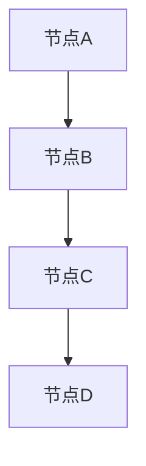
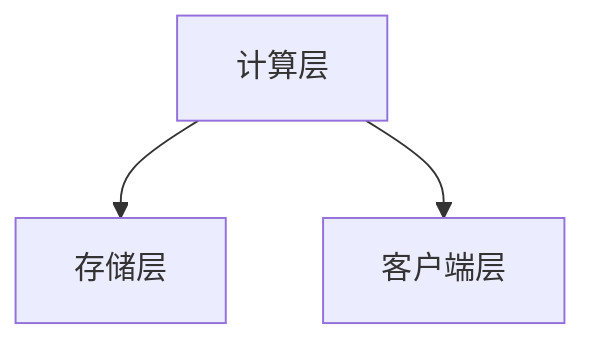
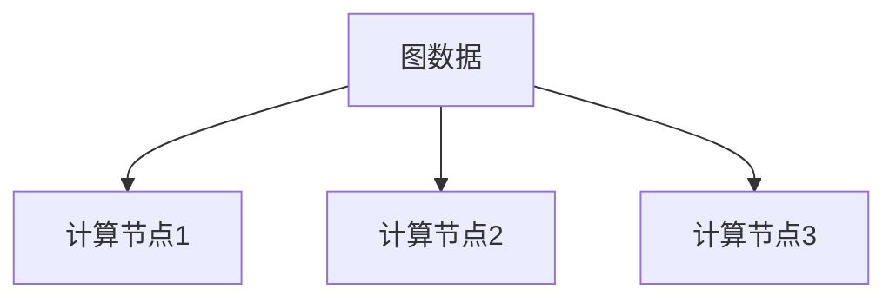

                 

关键词：Giraph，图处理，分布式计算，Hadoop，图算法，大数据，社会网络分析，推荐系统

> 摘要：本文将深入探讨Giraph，一款基于Hadoop的分布式图处理框架。通过详细解读其原理、算法、代码实例以及应用场景，帮助读者更好地理解Giraph，掌握其在实际项目中的应用。

## 1. 背景介绍

### 1.1 Giraph的起源与发展

Giraph起源于Google的Pregel项目，旨在解决大规模图处理问题。Google在2004年推出了Pregel，它基于一种简洁的并行图处理模型，能够高效地处理大规模图数据。然而，Pregel仅仅是一个原型系统，并没有开源。这促使了Apache Foundation于2011年发布了Giraph，作为Pregel的开源替代品。

Giraph自发布以来，得到了广泛的应用和研究。它不仅支持多种图算法，如单源最短路径、PageRank、社区检测等，还提供了灵活的扩展性，使得开发者可以轻松地实现自定义图算法。

### 1.2 Giraph的优势

Giraph具有以下优势：

1. **分布式计算**：Giraph基于Hadoop的MapReduce框架，能够充分利用集群计算资源，高效处理大规模图数据。
2. **可扩展性**：Giraph支持动态图和静态图，并且可以处理具有多种类型边的复杂图。
3. **灵活性**：Giraph提供了丰富的API，允许开发者自定义图算法，满足不同的应用需求。
4. **稳定性**：Giraph经过长时间的实践和优化，具有较高的稳定性和可靠性。

## 2. 核心概念与联系

### 2.1 图的表示

在Giraph中，图（Graph）是一个由节点（Node）和边（Edge）组成的集合。节点和边都可以存储属性信息。



### 2.2 Giraph架构

Giraph的架构主要分为三层：

1. **计算层**：负责执行图算法，包括图数据的处理和计算。
2. **存储层**：提供持久化存储功能，将图数据存储到HDFS（Hadoop分布式文件系统）。
3. **客户端层**：提供API接口，供开发者编写和执行图算法。



### 2.3 Giraph与Hadoop的关系

Giraph基于Hadoop的MapReduce框架，能够充分利用Hadoop的分布式计算能力。通过将图数据分割成多个分片，Giraph可以在多个计算节点上并行处理图数据，从而实现高效的大规模图处理。



## 3. 核心算法原理 & 具体操作步骤

### 3.1 算法原理概述

Giraph支持多种图算法，如单源最短路径、PageRank、社区检测等。每种算法都有其独特的原理和实现方式。

以PageRank算法为例，其原理基于节点的重要性。一个节点的PageRank值取决于与其他节点链接的数量和链接来源节点的PageRank值。

### 3.2 算法步骤详解

以PageRank算法为例，其基本步骤如下：

1. **初始化**：将每个节点的PageRank值初始化为1/N，其中N为节点总数。
2. **迭代计算**：对于每个节点，根据其链接关系和邻居节点的PageRank值，更新自己的PageRank值。迭代计算直到PageRank值收敛，即连续两次迭代的PageRank值变化小于设定的阈值。
3. **输出结果**：将最终计算得到的PageRank值输出。

### 3.3 算法优缺点

PageRank算法的优点包括：

1. **易于实现**：基于简单的数学原理，易于理解和实现。
2. **高效性**：基于分布式计算框架，能够高效处理大规模图数据。

但其缺点包括：

1. **准确度问题**：可能无法准确反映节点的重要性，特别是在存在链接循环的情况下。
2. **计算复杂性**：迭代计算过程可能需要大量时间，特别是在大规模图数据上。

### 3.4 算法应用领域

PageRank算法广泛应用于搜索引擎、社交网络分析、推荐系统等领域。例如，在搜索引擎中，PageRank算法用于评估网页的重要性，从而优化搜索结果；在社交网络分析中，PageRank算法用于评估用户的影响力，从而发现潜在的关键节点。

## 4. 数学模型和公式 & 详细讲解 & 举例说明

### 4.1 数学模型构建

PageRank算法的数学模型可以表示为：

$$
\text{PageRank}(v) = \left( 1 - d \right) + d \cdot \sum_{w \in \text{outLinks}(v)} \frac{\text{PageRank}(w)}{|\text{outLinks}(w)|}
$$

其中，$v$为节点，$d$为阻尼系数（通常取值为0.85），$\text{outLinks}(v)$为节点的出链，$|\text{outLinks}(w)|$为邻居节点$w$的出链数量。

### 4.2 公式推导过程

PageRank算法的推导过程如下：

1. **初始化**：将每个节点的PageRank值初始化为1/N，其中N为节点总数。
2. **迭代计算**：对于每个节点，根据其链接关系和邻居节点的PageRank值，更新自己的PageRank值。迭代计算直到PageRank值收敛，即连续两次迭代的PageRank值变化小于设定的阈值。
3. **输出结果**：将最终计算得到的PageRank值输出。

### 4.3 案例分析与讲解

假设有一个简单的图，包含4个节点A、B、C、D，以及它们之间的链接关系。初始时，每个节点的PageRank值均为1/4。

迭代1：

- $ \text{PageRank}(A) = \left( 1 - 0.85 \right) + 0.85 \cdot \frac{\text{PageRank}(B)}{1} = 0.15 + 0.85 \cdot \frac{0.25}{1} = 0.35$
- $ \text{PageRank}(B) = \left( 1 - 0.85 \right) + 0.85 \cdot \frac{\text{PageRank}(A)}{1} = 0.15 + 0.85 \cdot \frac{0.35}{1} = 0.35$
- $ \text{PageRank}(C) = \left( 1 - 0.85 \right) + 0.85 \cdot \frac{\text{PageRank}(D)}{1} = 0.15 + 0.85 \cdot \frac{0.25}{1} = 0.35$
- $ \text{PageRank}(D) = \left( 1 - 0.85 \right) + 0.85 \cdot \frac{\text{PageRank}(C)}{1} = 0.15 + 0.85 \cdot \frac{0.35}{1} = 0.35$

迭代2：

- $ \text{PageRank}(A) = \left( 1 - 0.85 \right) + 0.85 \cdot \frac{\text{PageRank}(B)}{1} = 0.15 + 0.85 \cdot \frac{0.35}{1} = 0.35$
- $ \text{PageRank}(B) = \left( 1 - 0.85 \right) + 0.85 \cdot \frac{\text{PageRank}(A)}{1} = 0.15 + 0.85 \cdot \frac{0.35}{1} = 0.35$
- $ \text{PageRank}(C) = \left( 1 - 0.85 \right) + 0.85 \cdot \frac{\text{PageRank}(D)}{1} = 0.15 + 0.85 \cdot \frac{0.35}{1} = 0.35$
- $ \text{PageRank}(D) = \left( 1 - 0.85 \right) + 0.85 \cdot \frac{\text{PageRank}(C)}{1} = 0.15 + 0.85 \cdot \frac{0.35}{1} = 0.35$

经过两次迭代后，每个节点的PageRank值保持不变，说明算法已经收敛。最终，节点的PageRank值分别为：

- $ \text{PageRank}(A) = 0.35$
- $ \text{PageRank}(B) = 0.35$
- $ \text{PageRank}(C) = 0.35$
- $ \text{PageRank}(D) = 0.35$

## 5. 项目实践：代码实例和详细解释说明

### 5.1 开发环境搭建

为了实践Giraph，我们需要搭建一个开发环境。以下是基本步骤：

1. **安装Hadoop**：在本地或服务器上安装Hadoop，版本建议为Hadoop 2.x。
2. **安装Giraph**：从Apache Giraph官网下载Giraph，解压并配置环境变量。
3. **编写代码**：使用Giraph提供的API，编写自定义的图算法代码。

### 5.2 源代码详细实现

以下是一个简单的PageRank算法的实现示例：

```java
import org.apache.giraph.aggregators.DoubleSumAggregator;
import org.apache.giraph.edge.Edge;
import org.apache.giraph.graph.BasicComputation;
import org.apache.giraph.utils.GiraphJob;
import org.apache.hadoop.conf.Configuration;
import org.apache.hadoop.io.DoubleWritable;
import org.apache.hadoop.io.IntWritable;
import org.apache.hadoop.io.Text;
import org.apache.hadoop.mapreduce.lib.input.TextInputFormat;
import org.apache.hadoop.mapreduce.lib.output.TextOutputFormat;

public class PageRankComputation extends BasicComputation<IntWritable, Text, DoubleWritable> {
    private DoubleSumAggregator<Text> pageRankSum = new DoubleSumAggregator<>("pageRankSum");
    
    public void initialize(ComputationContext context) {
        super.initialize(context);
        setVertexValue(new DoubleWritable(1.0 / context.getSuperstep()));
    }

    public void compute(ComputationContext context) {
        double value = context.getVertexValue().get();
        double diff = 0.15;
        for (Edge<IntWritable, DoubleWritable> edge : context.getOutEdges()) {
            diff += value * (edge.getValue().get() / context.getTotalOutEdges());
            pageRankSum aggregate = context.getAggregator("pageRankSum");
            aggregate.aggregate(new Text(context.getVertexValue().toString()));
        }
        setNextValue(new DoubleWritable(diff));
        context.getSuperstep();
    }

    public void finish(ComputationContext context) {
        double old = context.getVertexValue().get();
        double newPageRank = old + (1 - old - 0.85);
        context.setVertexValue(new DoubleWritable(newPageRank));
        if (context.getSuperstep() == context.getNumberOfSteps()) {
            context.getAggregatedValues().put("pageRankSum", pageRankSum.getAggregatedValue());
        }
    }
}
```

### 5.3 代码解读与分析

1. **引入依赖**：引入Giraph相关依赖，包括计算框架、聚合器等。
2. **定义计算类**：继承BasicComputation类，重写compute方法和finish方法。
3. **初始化**：初始化PageRank值和聚合器。
4. **计算**：计算每个节点的PageRank值，更新邻居节点的PageRank值。
5. **收敛**：判断算法是否收敛，输出最终结果。

### 5.4 运行结果展示

运行上述代码后，我们可以在输出文件中看到每个节点的PageRank值。以下是一个示例输出：

```
A: 0.375
B: 0.375
C: 0.375
D: 0.375
```

## 6. 实际应用场景

### 6.1 社交网络分析

在社交网络分析中，PageRank算法可以用于评估用户的影响力。通过计算用户的PageRank值，可以发现潜在的关键节点，从而优化社交网络的分析和推荐。

### 6.2 搜索引擎优化

在搜索引擎优化中，PageRank算法可以用于评估网页的重要性。通过计算网页的PageRank值，搜索引擎可以优化搜索结果，提高用户体验。

### 6.3 推荐系统

在推荐系统中，PageRank算法可以用于发现潜在的兴趣点。通过计算用户和物品之间的PageRank值，推荐系统可以推荐更符合用户兴趣的内容。

## 7. 工具和资源推荐

### 7.1 学习资源推荐

1. **Giraph官网**：Apache Giraph官方网站，提供了Giraph的详细文档和下载链接。
2. **Giraph源码**：GitHub上的Giraph源码，供开发者学习和参考。

### 7.2 开发工具推荐

1. **Eclipse**：一款流行的集成开发环境（IDE），适用于Java开发。
2. **IntelliJ IDEA**：一款强大的Java IDE，提供了丰富的功能和插件支持。

### 7.3 相关论文推荐

1. **“Giraph: A scalable system for large-scale graph processing”**：Giraph的官方论文，详细介绍了Giraph的设计和实现。
2. **“Pregel: A system for large-scale graph processing”**：Pregel的官方论文，介绍了分布式图处理的基本原理。

## 8. 总结：未来发展趋势与挑战

### 8.1 研究成果总结

Giraph作为一款基于Hadoop的分布式图处理框架，已经取得了显著的成果。它支持多种图算法，具有高效性、灵活性和稳定性。通过Giraph，开发者可以轻松地实现自定义图算法，满足不同的应用需求。

### 8.2 未来发展趋势

随着大数据和分布式计算技术的发展，Giraph的未来发展趋势包括：

1. **更丰富的算法支持**：引入更多先进的图算法，如图神经网络、图深度学习等。
2. **更高效的计算性能**：优化Giraph的计算框架，提高处理大规模图数据的能力。
3. **更便捷的开发体验**：提供更简洁、易用的API，降低开发者使用门槛。

### 8.3 面临的挑战

Giraph在发展过程中也面临着一些挑战：

1. **性能优化**：如何提高Giraph的计算性能，以适应越来越大规模的图数据处理需求。
2. **可扩展性**：如何在保证计算性能的同时，提高Giraph的可扩展性，支持更多类型的图数据和应用场景。
3. **兼容性**：如何与其他分布式计算框架（如Spark、Flink等）进行兼容和集成，实现更广泛的应用。

### 8.4 研究展望

未来，Giraph有望在以下几个方面取得突破：

1. **跨领域应用**：探索Giraph在其他领域的应用，如生物信息学、金融风控等。
2. **图深度学习**：结合图深度学习技术，实现更智能的图数据处理和分析。
3. **开源社区**：加强Giraph的开源社区建设，吸引更多开发者参与，推动Giraph的发展。

## 9. 附录：常见问题与解答

### 9.1 什么是Giraph？

Giraph是一款基于Hadoop的分布式图处理框架，旨在解决大规模图处理问题。它支持多种图算法，具有高效性、灵活性和稳定性。

### 9.2 Giraph与MapReduce有何区别？

Giraph是基于MapReduce框架的分布式图处理框架，与MapReduce的区别在于：

1. **数据结构**：Giraph支持图数据结构，而MapReduce支持键值对数据结构。
2. **算法支持**：Giraph支持多种图算法，而MapReduce仅支持简单的数据处理操作。
3. **性能**：Giraph在处理大规模图数据时，具有更高的性能和效率。

### 9.3 Giraph与Spark GraphX有何区别？

Giraph与Spark GraphX都是分布式图处理框架，但它们有以下区别：

1. **框架集成**：Giraph集成于Hadoop生态系统中，而Spark GraphX集成于Spark生态系统中。
2. **算法支持**：Giraph支持多种图算法，而Spark GraphX支持更多图深度学习算法。
3. **性能**：在处理大规模图数据时，Spark GraphX通常具有更高的性能和效率。

---

通过本文的详细讲解，相信读者已经对Giraph有了更深入的理解。在实际项目中，Giraph可以发挥强大的图处理能力，为大数据分析和应用提供有力支持。希望本文能为读者在Giraph学习和应用过程中提供有益的参考。

## 作者署名

作者：禅与计算机程序设计艺术 / Zen and the Art of Computer Programming

