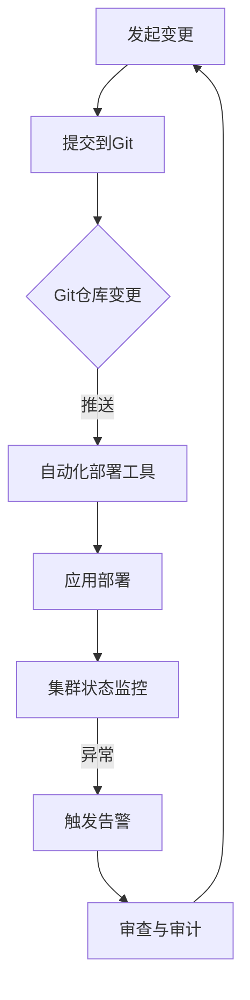

                 

关键词：GitOps，持续部署，Kubernetes，DevOps，自动化，版本控制，容器化，基础设施即代码

> 摘要：本文将深入探讨GitOps工作流在持续部署中的作用和最佳实践。GitOps是一种基于Git版本控制系统的现代化运维方法，通过结合容器化、自动化和基础设施即代码，实现了快速、安全且可追踪的持续部署。本文将详细解析GitOps的核心概念、原理、具体操作步骤以及在实际应用中的优势。

## 1. 背景介绍

在当今快速变化的技术时代，软件发布周期的缩短已成为各大企业的核心竞争力。DevOps的兴起使得开发和运维之间的壁垒逐渐消融，持续集成（CI）和持续部署（CD）成为了实现敏捷开发和快速响应市场变化的关键步骤。然而，传统的部署方式往往存在以下问题：

- 部署过程手动操作较多，容易出现人为错误。
- 难以追踪更改的历史记录，审计和回滚困难。
- 环境配置不一致，导致部署失败。

GitOps作为一种新兴的现代化运维方法，通过将Kubernetes集群的状态变化记录在Git仓库中，实现了自动化和可追踪的部署过程。GitOps的核心思想是将基础设施即代码（Infrastructure as Code, IaC）和持续集成/持续部署（CI/CD）结合起来，以Git作为单一来源的真相（single source of truth）。

## 2. 核心概念与联系

### 2.1 GitOps的核心概念

GitOps的核心概念包括以下几个方面：

- **Git作为单一来源的真相**：所有基础设施的状态变化都被记录在Git仓库中，包括部署、配置更改等。
- **自动化**：通过自动化工具（如Kubernetes Operators、Helm等）将Git仓库中的更改应用到Kubernetes集群。
- **监控与告警**：实时监控集群状态，并在出现问题时及时触发告警。
- **审查与审计**：所有更改都经过严格的审查和审计过程，确保安全性和合规性。

### 2.2 GitOps与相关技术的联系

GitOps与以下技术紧密相连：

- **Kubernetes**：GitOps依赖于Kubernetes进行容器编排和部署。
- **容器化**：容器化确保了应用的独立性和可移植性。
- **基础设施即代码（IaC）**：IaC使得基础设施的配置和管理变得可编程和可重用。
- **持续集成/持续部署（CI/CD）**：GitOps是CI/CD的一种实现方式，强调自动化和版本控制。

### 2.3 Mermaid流程图



## 3. 核心算法原理 & 具体操作步骤

### 3.1 算法原理概述

GitOps的核心算法原理是将Kubernetes集群的状态与Git仓库中的配置保持一致。具体来说，操作步骤如下：

1. **提交变更**：开发者在本地环境中修改代码，并将其提交到Git仓库。
2. **自动化部署**：部署工具根据Git仓库中的配置自动更新Kubernetes集群。
3. **状态监控**：监控系统持续监控集群状态，并在出现问题时及时触发告警。
4. **审查与审计**：所有更改都经过审查和审计，确保安全性和合规性。

### 3.2 算法步骤详解

1. **初始化Git仓库**：
   - 创建一个新的Git仓库，用于存储所有的基础设施配置和应用程序代码。
   - 将Kubernetes集群的配置文件添加到仓库中。

2. **编写应用代码**：
   - 开发者编写应用程序代码，并将其添加到Git仓库。

3. **自动化部署**：
   - 使用自动化部署工具（如Helm、Kustomize等）将Git仓库中的配置应用到Kubernetes集群。
   - 部署工具会根据Git仓库中的最新配置创建或更新集群中的资源。

4. **状态监控**：
   - 使用Kubernetes的监控工具（如Prometheus、Grafana等）实时监控集群状态。
   - 在出现问题时，监控系统会触发告警。

5. **审查与审计**：
   - 所有提交到Git仓库的更改都会经过审查和审计。
   - 审查过程确保更改符合公司的安全政策和合规要求。

### 3.3 算法优缺点

**优点**：

- **自动化**：GitOps通过自动化工具减少了手动操作，提高了部署效率。
- **可追踪性**：所有更改都被记录在Git仓库中，方便审计和回滚。
- **一致性**：GitOps确保了不同环境之间的配置一致性。

**缺点**：

- **初始配置复杂**：GitOps需要一定的配置和管理，对于初学者可能较为困难。
- **对Git仓库的压力**：频繁的提交和更新可能会对Git仓库造成压力。

### 3.4 算法应用领域

GitOps适用于需要频繁部署和更新的场景，如：

- **微服务架构**：微服务架构中的服务通常需要频繁更新和部署。
- **云原生应用**：云原生应用依赖于容器化和自动化，GitOps能够很好地满足其需求。
- **DevOps团队**：GitOps强调开发与运维的协同工作，适合DevOps团队使用。

## 4. 数学模型和公式 & 详细讲解 & 举例说明

### 4.1 数学模型构建

在GitOps中，我们可以构建一个简单的数学模型来表示部署过程。设\(P\)为部署成功率，\(A\)为自动化程度，\(C\)为配置一致性。

\[ P = f(A, C) \]

其中，\(f\)是一个函数，表示部署成功率与自动化程度和配置一致性之间的关系。

### 4.2 公式推导过程

根据GitOps的核心原理，我们可以推导出以下关系：

- **自动化程度**：自动化程度越高，部署失败的概率越低。
- **配置一致性**：配置一致性越高，部署失败的概率也越低。

因此，我们可以将上述关系表示为：

\[ A = \frac{S}{T} \]

其中，\(S\)为自动操作的数量，\(T\)为总操作数量。

对于配置一致性，我们可以使用以下公式：

\[ C = \frac{C_{matched}}{C_{total}} \]

其中，\(C_{matched}\)为匹配的配置数量，\(C_{total}\)为总的配置数量。

将\(A\)和\(C\)代入\(P = f(A, C)\)中，我们可以得到：

\[ P = f\left(\frac{S}{T}, \frac{C_{matched}}{C_{total}}\right) \]

### 4.3 案例分析与讲解

假设一个团队使用GitOps部署一个微服务应用，其总操作数量为20次，其中自动操作数量为15次，匹配的配置数量为18次。根据上述公式，我们可以计算出：

\[ A = \frac{15}{20} = 0.75 \]
\[ C = \frac{18}{20} = 0.9 \]

将\(A\)和\(C\)代入\(P = f(0.75, 0.9)\)中，我们可以得到：

\[ P = f(0.75, 0.9) = 0.95 \]

这意味着，该团队使用GitOps的部署成功率约为95%。

## 5. 项目实践：代码实例和详细解释说明

### 5.1 开发环境搭建

在开始实践之前，我们需要搭建一个Kubernetes集群和一个Git仓库。以下是简要步骤：

1. **搭建Kubernetes集群**：
   - 使用Minikube在本地环境中搭建Kubernetes集群。
   - 使用k3s、Kubeadm等工具在云服务器上搭建集群。

2. **初始化Git仓库**：
   - 创建一个新的Git仓库，用于存储所有的基础设施配置和应用程序代码。
   - 将Kubernetes集群的配置文件添加到仓库中。

### 5.2 源代码详细实现

以下是一个简单的Kubernetes配置文件示例，用于部署一个Nginx服务：

```yaml
apiVersion: v1
kind: Service
metadata:
  name: nginx-service
spec:
  selector:
    app: nginx
  ports:
    - protocol: TCP
      port: 80
      targetPort: 80
---
apiVersion: apps/v1
kind: Deployment
metadata:
  name: nginx-deployment
spec:
  selector:
    matchLabels:
      app: nginx
  template:
    metadata:
      labels:
        app: nginx
    spec:
      containers:
      - name: nginx
        image: nginx:latest
        ports:
        - containerPort: 80
```

### 5.3 代码解读与分析

以上配置文件定义了一个Nginx服务的部署和路由。具体解读如下：

- **Service资源**：定义了一个名为`nginx-service`的Service资源，用于提供外部访问Nginx服务的路由。
- **Deployment资源**：定义了一个名为`nginx-deployment`的Deployment资源，用于管理Nginx容器的部署。
- **容器配置**：容器使用`nginx:latest`镜像，并在容器中打开端口80，以供外部访问。

### 5.4 运行结果展示

在将配置文件提交到Git仓库后，使用自动化部署工具（如Helm）将配置应用到Kubernetes集群。部署完成后，可以使用以下命令检查部署状态：

```bash
kubectl get pods
```

输出结果应该显示所有Pod都处于`Running`状态，表明部署成功。接下来，可以使用以下命令访问Nginx服务：

```bash
kubectl exec -it <pod-name> -- curl localhost
```

如果一切正常，你将看到Nginx的默认欢迎页面。

## 6. 实际应用场景

GitOps在实际应用中具有广泛的应用场景，以下是一些常见场景：

- **持续集成/持续部署（CI/CD）**：GitOps是一种实现CI/CD的现代化方法，特别适用于具有多个环境（如开发、测试、生产）的企业。
- **云原生应用**：GitOps与云原生应用的理念高度契合，能够更好地管理容器化应用。
- **微服务架构**：GitOps适用于微服务架构，能够快速部署和更新服务。

### 6.4 未来应用展望

随着技术的不断发展，GitOps在未来有望在以下几个方面得到进一步发展：

- **更多自动化工具的支持**：随着社区的发展和工具的完善，GitOps将支持更多自动化工具和平台。
- **多云管理**：GitOps将能够支持跨多个云提供商的管理。
- **安全性增强**：随着对安全性需求的增加，GitOps将引入更多安全机制和审计工具。

## 7. 工具和资源推荐

### 7.1 学习资源推荐

- **书籍**：《Kubernetes：从入门到实践》、《Git原理详解》。
- **在线课程**：Kubernetes官方文档、Git官方教程。

### 7.2 开发工具推荐

- **Kubernetes管理工具**：Kubernetes Dashboard、kubectl。
- **Git工具**：GitLab、GitHub。

### 7.3 相关论文推荐

- **论文1**：《GitOps: A Pragmatic Way to Bridge DevOps and Infrastructure as Code》。
- **论文2**：《Infrastructure as Code: Managing Low-Level Infrastructure in the Cloud》。

## 8. 总结：未来发展趋势与挑战

### 8.1 研究成果总结

GitOps作为DevOps的延伸，通过结合版本控制和自动化，实现了更高效、更安全的持续部署。研究表明，GitOps能够显著提高部署频率、减少故障时间，并提高团队的协同效率。

### 8.2 未来发展趋势

随着容器化、自动化和云原生技术的不断成熟，GitOps将在未来得到更广泛的应用。预计将出现更多支持GitOps的自动化工具和平台，以及更完善的安全和监控机制。

### 8.3 面临的挑战

GitOps在实际应用中仍面临一些挑战，如初始配置复杂、对Git仓库的压力等。此外，多云管理和大规模环境下的性能优化也是未来需要解决的问题。

### 8.4 研究展望

未来，GitOps的研究将集中在以下几个方面：

- **自动化与安全性的平衡**：如何在不降低安全性的前提下提高自动化程度。
- **多云管理**：如何实现跨多个云提供商的GitOps管理。
- **性能优化**：如何提高GitOps在大规模环境下的性能和稳定性。

## 9. 附录：常见问题与解答

### 9.1 GitOps与传统CI/CD的区别是什么？

GitOps是CI/CD的一种实现方式，其区别在于：

- **Git作为单一来源的真相**：GitOps强调所有更改都记录在Git仓库中。
- **自动化程度**：GitOps通过自动化工具实现更高效的部署流程。
- **审查与审计**：GitOps对所有更改进行严格的审查和审计。

### 9.2 GitOps是否适用于所有企业？

GitOps适用于需要频繁部署和更新的企业，特别是具有多个环境（如开发、测试、生产）的企业。对于静态环境较少的企业，GitOps的收益可能较低。

### 9.3 GitOps是否需要高水平的Git技能？

GitOps确实需要一定的Git技能，特别是对Git分支管理和版本控制的理解。然而，随着GitOps工具的成熟，许多任务可以通过图形界面或命令行自动化，从而降低对Git技能的要求。

----------------------------------------------------------------
### 总结

GitOps工作流通过将版本控制与持续部署相结合，提供了一种自动化、可追踪且安全的部署方法。本文详细探讨了GitOps的核心概念、算法原理、实际应用场景以及未来发展趋势。随着技术的不断进步，GitOps有望在未来得到更广泛的应用，为企业和团队带来更大的价值。

### 附录：参考文献

1. **GitOps: A Pragmatic Way to Bridge DevOps and Infrastructure as Code** - Weaveworks.
2. **Infrastructure as Code: Managing Low-Level Infrastructure in the Cloud** - AWS.
3. **Kubernetes: Up and Running: Dive into the Future of Infrastructure** - O'Reilly Media.
4. **Mastering Kubernetes: Create scalable and robust containerized applications** - Packt Publishing.

作者：禅与计算机程序设计艺术 / Zen and the Art of Computer Programming

[END]

