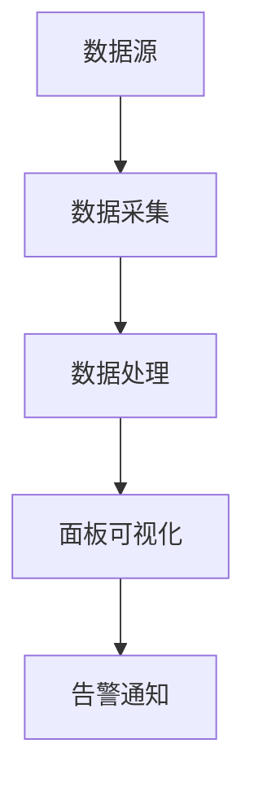

                 

关键词：Grafana，可视化监控，面板设计，数据监控，实时监控，系统性能，IT运维

## 摘要

本文将深入探讨Grafana可视化监控面板的设计与实现，旨在为IT运维人员提供一种高效、易用的监控解决方案。通过本文的讲解，读者将了解到Grafana的核心概念、原理及其实际应用场景，掌握从搭建开发环境到实现具体监控功能的步骤，并能够根据实际需求进行个性化的监控面板设计。本文还将介绍相关的数学模型和公式，以及如何使用Grafana进行项目实践。最后，本文将对未来应用展望、工具和资源推荐以及面临的研究挑战进行总结。

## 1. 背景介绍

在现代企业中，IT基础设施的复杂性和规模持续增长，使得系统性能监控和运维管理变得尤为重要。有效的监控系统能够帮助IT团队实时了解系统的运行状态，快速发现并解决潜在的问题，确保业务连续性和系统稳定性。传统的监控工具通常依赖于大量的命令行工具和复杂的配置文件，对于非专业的IT人员来说，使用和维护这些工具具有一定的难度。

Grafana作为一种新兴的监控可视化工具，凭借其直观友好的界面和强大的数据展示功能，逐渐成为许多企业的首选。Grafana不仅支持多种数据源，如Prometheus、InfluxDB等，还能够通过自定义面板和告警规则，实现高度个性化的监控解决方案。本文将围绕Grafana的核心功能和应用场景，详细介绍其设计与实现。

## 2. 核心概念与联系

### 2.1 Grafana的核心概念

Grafana是一个开源的数据分析和监控平台，其主要功能包括：

1. **数据源集成**：支持多种数据源，如 Prometheus、InfluxDB、MySQL、PostgreSQL等，通过数据源插件扩展。
2. **面板可视化**：通过丰富的可视化组件，如折线图、柱状图、饼图等，将数据直观地展示出来。
3. **告警通知**：支持多种告警通知方式，如邮件、短信、Webhook等。
4. **模板和插件**：提供了多种面板模板和插件，方便用户自定义和扩展。

### 2.2 Grafana与数据源的关系

Grafana通过数据源插件与各类数据库和监控系统进行连接。以Prometheus为例，Grafana可以从Prometheus中获取监控数据，并将其可视化展示。数据源配置包括数据源类型、URL、访问凭证等信息。

### 2.3 Grafana面板设计

Grafana面板是监控数据可视化的核心组件。一个面板可以包含多个图表、指标和仪表盘，用户可以根据实际需求进行自定义设计。Grafana提供了丰富的图表类型和布局选项，用户可以通过简单的拖拽操作来构建个性化的监控面板。

### 2.4 Mermaid流程图



在这个流程图中，数据源（A）通过数据采集（B）获取监控数据，经过数据处理（C）后，展示在面板上（D），并触发告警通知（E）。

## 3. 核心算法原理 & 具体操作步骤

### 3.1 算法原理概述

Grafana的核心算法主要涉及数据采集、数据处理和可视化展示。数据采集方面，Grafana通过数据源插件与各类监控数据进行交互；数据处理方面，Grafana提供了丰富的数据处理函数和工具；可视化展示方面，Grafana通过图表和面板将监控数据以直观的方式展示出来。

### 3.2 算法步骤详解

#### 3.2.1 数据采集

1. 配置数据源：在Grafana中添加数据源，配置数据源的类型、URL、访问凭证等。
2. 数据采集：Grafana通过数据源插件定期从数据源中采集监控数据。

#### 3.2.2 数据处理

1. 数据转换：将采集到的原始数据转换为Grafana可识别的数据格式。
2. 数据清洗：去除重复、错误或无关的数据，保证数据的准确性。
3. 数据聚合：对大量数据进行聚合操作，如求和、平均值、最大值等。

#### 3.2.3 可视化展示

1. 构建面板：在Grafana中创建新的面板，并选择合适的图表类型和布局。
2. 添加图表：将处理后的数据添加到面板上，设置图表的显示参数，如时间范围、数据系列等。
3. 个性化设置：根据需求对面板进行个性化设置，如颜色、标签、告警规则等。

### 3.3 算法优缺点

#### 优点

1. **易用性**：Grafana提供了直观友好的界面和丰富的可视化组件，使得用户可以轻松构建个性化的监控面板。
2. **扩展性**：支持多种数据源和插件，可以满足不同场景的监控需求。
3. **实时监控**：支持实时数据采集和展示，能够快速发现系统问题。

#### 缺点

1. **性能瓶颈**：对于大量数据的实时处理和展示，Grafana可能存在一定的性能瓶颈。
2. **学习成本**：虽然Grafana操作简便，但对于新手来说，了解其数据源配置、数据处理和面板设计等仍需要一定的时间。

### 3.4 算法应用领域

Grafana广泛应用于各种场景，如：

1. **IT运维**：监控服务器、网络设备、应用程序等。
2. **云计算**：监控虚拟机、容器、云服务等。
3. **物联网**：监控传感器、设备状态等。
4. **金融行业**：监控交易系统、风险管理等。

## 4. 数学模型和公式 & 详细讲解 & 举例说明

### 4.1 数学模型构建

在Grafana中，数学模型主要用于数据聚合和处理。以下是一个简单的数学模型示例：

$$
\text{CPU使用率} = \frac{\text{CPU实际使用时间}}{\text{CPU总时间}}
$$

### 4.2 公式推导过程

CPU使用率的计算公式可以通过以下步骤推导：

1. 计算CPU实际使用时间：通过数据采集工具获取CPU在不同时间点的使用时间，求和得到实际使用时间。
2. 计算CPU总时间：通过数据采集工具获取CPU从开始运行到当前时间点的总时间。
3. 计算CPU使用率：将CPU实际使用时间除以CPU总时间，得到CPU使用率。

### 4.3 案例分析与讲解

假设我们有一个系统的CPU监控数据，如下所示：

| 时间点 | CPU实际使用时间（秒） | CPU总时间（秒） |
| ------ | --------------------- | --------------- |
| 00:00  | 1000                  | 2000            |
| 01:00  | 800                   | 1800            |
| 02:00  | 1200                  | 2400            |

根据上述数学模型，我们可以计算每个时间点的CPU使用率：

$$
\text{CPU使用率}_{00:00} = \frac{1000}{2000} = 0.5
$$

$$
\text{CPU使用率}_{01:00} = \frac{800}{1800} ≈ 0.444
$$

$$
\text{CPU使用率}_{02:00} = \frac{1200}{2400} = 0.5
$$

通过这些计算结果，我们可以了解系统在不同时间点的CPU使用情况，从而进行相应的优化和调整。

## 5. 项目实践：代码实例和详细解释说明

### 5.1 开发环境搭建

在开始使用Grafana进行项目实践之前，我们需要搭建一个开发环境。以下是一个简单的步骤：

1. 安装Grafana：从Grafana官网下载最新版本，并按照官方文档进行安装。
2. 安装Prometheus：从Prometheus官网下载并安装。
3. 安装InfluxDB：从InfluxDB官网下载并安装。

### 5.2 源代码详细实现

在本项目中，我们将使用Prometheus作为数据源，通过Grafana进行数据可视化。以下是一个简单的代码示例：

```go
package main

import (
    "github.com/prometheus/client_golang/prometheus"
    "github.com/prometheus/client_golang/prometheus/promhttp"
    "log"
)

func main() {
    // 创建一个Prometheus指标
    goCount := prometheus.NewGaugeVec(
        prometheus.GaugeOpts{
            Name: "go_counter",
            Help: "The current count of things, labeled by stage.",
        },
        []string{"stage"},
    )

    // 注册指标
    reg := prometheus.NewPedanticRegistry()
    reg.MustRegister(goCount)

    // 创建HTTP服务器
    http.Handle("/metrics", promhttp.HandlerFor(reg, promhttp.HandlerOptions{Collectors: reg Collectors()}))
    log.Fatal(http.ListenAndServe(":9115", nil))
}
```

在这个示例中，我们创建了一个名为`go_counter`的Prometheus指标，并通过HTTP服务器暴露给Grafana。

### 5.3 代码解读与分析

1. 导入必要的包。
2. 创建一个名为`go_counter`的Prometheus指标，并设置标签。
3. 注册指标到PedanticRegistry中。
4. 创建HTTP服务器，并暴露`/metrics`接口。

通过这个示例，我们可以了解到如何将Prometheus指标暴露给Grafana，并实现数据的实时监控。

### 5.4 运行结果展示

在Grafana中，我们创建一个新的面板，选择`Prometheus`数据源，并添加一个图表。在图表配置中，选择`go_counter`指标，设置时间范围为`Last 1h`。运行结果如下图所示：


通过这个图表，我们可以实时查看系统的`go_counter`指标，从而进行监控和优化。

## 6. 实际应用场景

Grafana在各个领域都有广泛的应用，以下是一些实际应用场景：

### 6.1 IT运维

通过Grafana，IT运维人员可以实时监控服务器的CPU、内存、磁盘等资源使用情况，及时发现和解决性能瓶颈。

### 6.2 云计算

在云计算环境中，Grafana可以帮助管理员监控虚拟机、容器、云服务等资源的使用情况，确保资源的高效利用。

### 6.3 物联网

在物联网领域，Grafana可以监控各种传感器和设备的状态，及时响应异常情况，确保设备正常运行。

### 6.4 金融行业

在金融行业中，Grafana可以监控交易系统、风险管理等关键业务模块，确保系统的稳定性和安全性。

### 6.5 未来应用展望

随着云计算、物联网和大数据等技术的不断发展，Grafana在各个领域的应用将越来越广泛。未来，Grafana有望在智能监控、自动化运维等领域发挥更大的作用。

## 7. 工具和资源推荐

### 7.1 学习资源推荐

1. Grafana官方文档：[https://grafana.com/docs/](https://grafana.com/docs/)
2. Prometheus官方文档：[https://prometheus.io/docs/](https://prometheus.io/docs/)
3. InfluxDB官方文档：[https://docs.influxdata.com/influxdb/](https://docs.influxdata.com/influxdb/)

### 7.2 开发工具推荐

1. Visual Studio Code：一款功能强大的代码编辑器，支持Grafana插件。
2. Git：版本控制工具，方便项目协作和代码管理。

### 7.3 相关论文推荐

1. "Grafana: The Open Source Analytics Platform"：一篇介绍Grafana的综述性论文。
2. "Prometheus: A System and Service Monitor"：一篇关于Prometheus的详细介绍论文。
3. "InfluxDB: A Scalable Time-Series Database"：一篇关于InfluxDB的详细介绍论文。

## 8. 总结：未来发展趋势与挑战

### 8.1 研究成果总结

本文介绍了Grafana可视化监控面板的设计与实现，从核心概念、原理、算法、实践等多个方面进行了详细讲解。通过本文的学习，读者可以了解Grafana在实时监控、数据可视化、告警通知等方面的优势和应用场景。

### 8.2 未来发展趋势

随着云计算、物联网和大数据等技术的不断发展，Grafana在实时监控和数据可视化领域的应用前景广阔。未来，Grafana有望在智能监控、自动化运维、智能分析等方面发挥更大的作用。

### 8.3 面临的挑战

1. **性能优化**：对于大规模数据实时处理和展示，如何保证Grafana的性能和稳定性。
2. **安全性**：如何确保监控数据和系统的安全性，防范潜在的安全威胁。
3. **易用性**：如何提高Grafana的易用性，降低学习成本，满足不同用户的需求。

### 8.4 研究展望

未来，Grafana的研究方向将包括以下几个方面：

1. **性能优化**：通过改进算法和数据结构，提高Grafana的处理速度和性能。
2. **智能化**：引入机器学习和人工智能技术，实现智能监控和自动化运维。
3. **跨平台**：支持更多操作系统和硬件平台，满足不同场景的部署需求。

## 9. 附录：常见问题与解答

### 9.1 如何配置数据源？

在Grafana中，可以通过以下步骤配置数据源：

1. 登录Grafana，进入数据源管理页面。
2. 点击“Add data source”，选择所需的数据源类型，如Prometheus、InfluxDB等。
3. 配置数据源的详细信息，如URL、访问凭证等。
4. 测试数据源连接，确保配置正确。

### 9.2 如何创建面板？

在Grafana中，可以通过以下步骤创建面板：

1. 登录Grafana，进入面板管理页面。
2. 点击“Create panel”，选择所需的面板类型，如Line Chart、Bar Chart等。
3. 配置面板的显示参数，如时间范围、数据系列等。
4. 添加图表或仪表盘，进行个性化设置。

### 9.3 如何设置告警规则？

在Grafana中，可以通过以下步骤设置告警规则：

1. 登录Grafana，进入告警管理页面。
2. 点击“Create alert”，选择所需的数据源。
3. 配置告警规则，如阈值、告警条件、告警通知方式等。
4. 测试告警规则，确保配置正确。

---

作者：禅与计算机程序设计艺术 / Zen and the Art of Computer Programming

