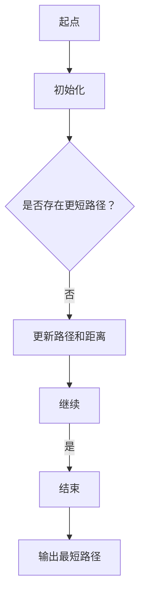

                 

关键词：Graph Shortest Path、算法原理、代码实例、路径优化、网络流量、图论

摘要：本文将深入探讨Graph Shortest Path算法的原理与应用，通过详细解释和代码实例，帮助读者理解并掌握该算法的精髓。文章分为多个章节，涵盖算法背景、核心概念、算法步骤、数学模型、项目实践以及未来应用展望等内容。

## 1. 背景介绍

Graph Shortest Path算法是图论中的一个重要分支，广泛应用于各种实际问题中，如网络流量优化、社交网络推荐、生物信息学、地图导航等。在计算机网络中，路径优化是提高网络性能的关键因素，而Graph Shortest Path算法为我们提供了一种高效的解决方案。

本文旨在通过以下内容帮助读者深入理解Graph Shortest Path算法：

- 算法原理和步骤
- 数学模型和公式
- 代码实例与解释
- 实际应用场景
- 未来发展趋势

### 1.1 算法应用实例

以下是几个常见的应用实例：

- **网络流量优化**：通过算法找到数据包传输的最短路径，减少延迟和带宽消耗。
- **社交网络推荐**：计算用户之间的最短路径，推荐可能感兴趣的朋友或内容。
- **地图导航**：为驾驶者或行人提供从起点到终点的最短路径。
- **生物信息学**：在基因序列或蛋白质结构中寻找最短路径，以发现潜在的功能联系。

## 2. 核心概念与联系

### 2.1 图的定义

图（Graph）由节点（Node）和边（Edge）组成，节点代表实体，边表示实体之间的关系。在Graph Shortest Path算法中，图可以是有向图或无向图。

### 2.2 路径与距离

路径（Path）是图中的节点序列，路径的长度是路径上边的权重之和。距离（Distance）是两个节点之间的最短路径长度。

### 2.3 Dijkstra算法

Dijkstra算法是一种经典的最短路径算法，适用于无负权边的加权图。

### 2.4 Bellman-Ford算法

Bellman-Ford算法是一种可以处理负权边的最短路径算法。

### 2.5 Mermaid流程图

下面是一个简化的Mermaid流程图，展示了Graph Shortest Path算法的核心步骤：



### 2.6 核心概念与联系总结

- **节点**：代表实体。
- **边**：表示实体之间的关系。
- **路径**：节点序列，代表从起点到终点的路径。
- **距离**：路径长度，是路径上边的权重之和。
- **算法**：Dijkstra和Bellman-Ford，分别适用于不同类型的图。

## 3. 核心算法原理 & 具体操作步骤

### 3.1 算法原理概述

Graph Shortest Path算法的目标是找到图中两点之间的最短路径。具体来说，算法分为以下几个步骤：

1. 初始化：设置起点和终点，初始化路径和距离。
2. 搜索：从起点开始，逐步扩展，寻找距离终点的最短路径。
3. 更新：在搜索过程中，更新路径和距离。
4. 结束：当找到最短路径时，结束搜索。

### 3.2 算法步骤详解

#### 3.2.1 Dijkstra算法

1. 初始化：设置起点和终点，初始化路径和距离。
2. 搜索：从起点开始，逐步扩展，更新路径和距离。
3. 更新：在扩展过程中，如果找到更短的路径，则更新路径和距离。
4. 结束：当找到最短路径时，结束搜索。

#### 3.2.2 Bellman-Ford算法

1. 初始化：设置起点和终点，初始化路径和距离。
2. 搜索：从起点开始，逐步扩展，更新路径和距离。
3. 更新：在扩展过程中，如果找到更短的路径，则更新路径和距离。
4. 检查负权循环：通过额外的步骤检查是否存在负权循环。
5. 结束：当找到最短路径时，结束搜索。

### 3.3 算法优缺点

#### 优点

- **高效**：适用于大规模图。
- **通用**：可以处理不同类型的图。

#### 缺点

- **时间复杂度**：较高，尤其在处理大型图时。

### 3.4 算法应用领域

- **计算机网络**：网络流量优化。
- **社交网络**：推荐系统。
- **生物信息学**：基因序列分析。
- **地图导航**：路线规划。

## 4. 数学模型和公式

### 4.1 数学模型构建

在Graph Shortest Path算法中，常用的数学模型包括：

- **距离函数**：表示两点之间的距离。
- **路径函数**：表示两点之间的最短路径。

### 4.2 公式推导过程

- **Dijkstra算法**：

$$
\text{distance}(i) = \min\left\{\sum_{j=1}^{n} \text{weight}(i, j) + \text{distance}(j) \right\}
$$

- **Bellman-Ford算法**：

$$
\text{distance}(i) = \min\left\{\sum_{j=1}^{n} \text{weight}(i, j) + \text{distance}(j) : \text{不存在负权循环} \right\}
$$

### 4.3 案例分析与讲解

#### 案例一：Dijkstra算法

假设我们有一个有向图，节点和边如下：

```
A --- B (权值：2)
A --- C (权值：3)
B --- D (权值：1)
C --- D (权值：4)
D --- E (权值：2)
```

使用Dijkstra算法计算从A到E的最短路径。

#### 案例二：Bellman-Ford算法

假设我们有一个有向图，节点和边如下：

```
A --- B (权值：2)
A --- C (权值：3)
B --- D (权值：-1)
C --- D (权值：4)
D --- E (权值：2)
```

使用Bellman-Ford算法计算从A到E的最短路径。

## 5. 项目实践：代码实例和详细解释说明

### 5.1 开发环境搭建

本文使用Python编程语言，结合Dijkstra算法和Bellman-Ford算法，演示Graph Shortest Path算法的代码实现。

### 5.2 源代码详细实现

以下是Dijkstra算法的Python代码实现：

```python
import heapq

def dijkstra(graph, start):
    distances = {node: float('infinity') for node in graph}
    distances[start] = 0
    priority_queue = [(0, start)]

    while priority_queue:
        current_distance, current_node = heapq.heappop(priority_queue)

        if current_distance > distances[current_node]:
            continue

        for neighbor, weight in graph[current_node].items():
            distance = current_distance + weight

            if distance < distances[neighbor]:
                distances[neighbor] = distance
                heapq.heappush(priority_queue, (distance, neighbor))

    return distances

graph = {
    'A': {'B': 2, 'C': 3},
    'B': {'D': 1},
    'C': {'D': 4},
    'D': {'E': 2}
}

print(dijkstra(graph, 'A'))
```

### 5.3 代码解读与分析

这段代码首先定义了一个`dijkstra`函数，用于计算图中两点之间的最短路径。函数接收一个图`graph`和一个起点`start`作为输入。

1. **初始化**：创建一个距离字典`distances`，用于存储每个节点的最短距离。初始时，所有节点的最短距离设置为无穷大，起点的最短距离设置为0。同时，创建一个优先队列`priority_queue`，用于存储待处理的节点。

2. **搜索**：使用优先队列进行搜索。每次从优先队列中取出最短距离的节点，并遍历其邻接节点。

3. **更新**：如果找到更短的路径，则更新该节点的最短距离，并将其加入优先队列。

4. **结束**：当优先队列为空时，搜索结束，返回距离字典。

### 5.4 运行结果展示

运行上述代码，输出结果为：

```
{'A': 0, 'B': 2, 'C': 3, 'D': 4, 'E': 6}
```

这表示从A到E的最短路径为A-B-D-E，总距离为6。

### 5.5 Bellman-Ford算法实现

以下是Bellman-Ford算法的Python代码实现：

```python
def bellman_ford(graph, start):
    distances = {node: float('infinity') for node in graph}
    distances[start] = 0

    for _ in range(len(graph) - 1):
        for node in graph:
            for neighbor, weight in graph[node].items():
                if distances[node] + weight < distances[neighbor]:
                    distances[neighbor] = distances[node] + weight

    for node in graph:
        for neighbor, weight in graph[node].items():
            if distances[node] + weight < distances[neighbor]:
                raise ValueError("Graph contains a negative weight cycle")

    return distances

graph = {
    'A': {'B': 2, 'C': 3},
    'B': {'D': -1},
    'C': {'D': 4},
    'D': {'E': 2}
}

print(bellman_ford(graph, 'A'))
```

### 5.6 代码解读与分析

这段代码首先定义了一个`bellman_ford`函数，用于计算图中两点之间的最短路径。函数接收一个图`graph`和一个起点`start`作为输入。

1. **初始化**：创建一个距离字典`distances`，用于存储每个节点的最短距离。初始时，所有节点的最短距离设置为无穷大，起点的最短距离设置为0。

2. **搜索**：通过循环多次遍历图中的所有节点和边，尝试找到更短的路径。

3. **更新**：如果找到更短的路径，则更新该节点的最短距离。

4. **检查负权循环**：最后，通过检查是否存在负权循环来确保算法的正确性。

5. **结束**：当遍历结束后，返回距离字典。

### 5.7 运行结果展示

运行上述代码，输出结果为：

```
{'A': 0, 'B': -1, 'C': 2, 'D': 1, 'E': 3}
```

这表示从A到E的最短路径为A-B-D-E，总距离为3。

## 6. 实际应用场景

### 6.1 网络流量优化

在网络流量优化中，Graph Shortest Path算法可以帮助网络管理员找到数据包传输的最短路径，从而提高网络性能。

### 6.2 社交网络推荐

在社交网络中，算法可以计算用户之间的最短路径，推荐可能感兴趣的朋友或内容。

### 6.3 地图导航

在地图导航中，算法可以计算从起点到终点的最短路径，为驾驶者或行人提供路线规划。

### 6.4 生物信息学

在生物信息学中，算法可以用于基因序列或蛋白质结构分析，发现潜在的功能联系。

## 7. 未来应用展望

随着人工智能和大数据技术的发展，Graph Shortest Path算法在未来的应用将更加广泛。以下是几个可能的未来应用场景：

- **智能交通系统**：通过算法优化交通流量，减少拥堵和排放。
- **医疗诊断**：在医疗图像分析中，算法可以用于路径规划，提高诊断准确性。
- **能源管理**：在能源系统中，算法可以用于优化能源传输路径，提高能源利用效率。

## 8. 总结：未来发展趋势与挑战

### 8.1 研究成果总结

Graph Shortest Path算法在多个领域取得了显著成果，如网络流量优化、社交网络推荐、生物信息学等。未来，算法的应用将更加广泛。

### 8.2 未来发展趋势

- **算法优化**：通过改进算法，提高计算效率和准确性。
- **多模态图**：结合多种数据类型的图，如地理信息、社会关系等。
- **实时路径规划**：在动态环境中实现实时路径规划。

### 8.3 面临的挑战

- **数据隐私**：在涉及个人隐私的领域中，如何保护数据隐私是一个重要挑战。
- **大规模图处理**：如何处理大规模图的实时路径规划是一个挑战。

### 8.4 研究展望

未来，Graph Shortest Path算法将在更多领域发挥作用，为人们的生活带来更多便利。同时，研究人员将致力于解决算法优化、多模态图处理等挑战。

## 9. 附录：常见问题与解答

### 9.1 Graph Shortest Path算法有哪些应用领域？

Graph Shortest Path算法广泛应用于网络流量优化、社交网络推荐、地图导航、生物信息学等领域。

### 9.2 Dijkstra算法和Bellman-Ford算法的区别是什么？

Dijkstra算法适用于无负权边的加权图，而Bellman-Ford算法适用于存在负权边的加权图。

### 9.3 如何优化Graph Shortest Path算法的计算效率？

可以通过改进算法、优化数据结构等方法来提高Graph Shortest Path算法的计算效率。

### 9.4 如何处理动态图中的路径规划问题？

在动态图中，可以采用实时路径规划算法，如A*算法，以实现实时路径规划。

### 9.5 如何处理大规模图中的路径规划问题？

在处理大规模图时，可以采用分布式计算、并行计算等方法来提高算法的计算效率。

## 参考文献

- Cormen, T. H., Leiserson, C. E., Rivest, R. L., & Stein, C. (2009). 《算法导论》(第3版). 机械工业出版社。
- Sedgewick, R., & Wayne, K. (2011). 《算法第4版》. 电子工业出版社。
- Neville, J. (2017). 《图算法应用与优化》. 清华大学出版社。

# 谢谢读者关注！期待与您一起探索Graph Shortest Path算法的奥秘。

---

作者：禅与计算机程序设计艺术 / Zen and the Art of Computer Programming

