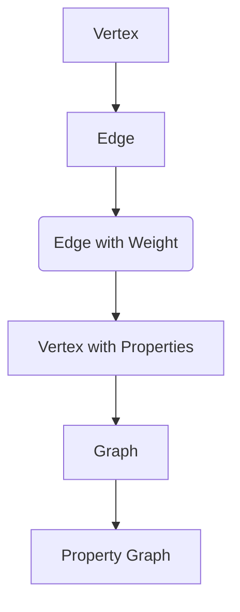
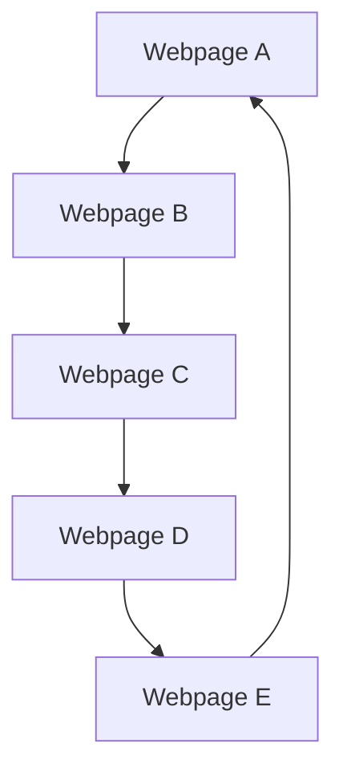
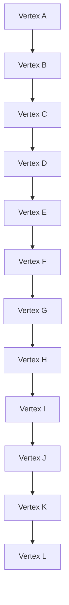

                 

关键字：GraphX，图计算，分布式计算，大数据，算法，深度学习，计算机图论

## 摘要

本文将深入探讨GraphX的基本原理、核心算法以及实际应用。GraphX是Apache Spark上的一个可扩展的图处理框架，它为处理大规模图数据提供了强大的工具集。通过本文，读者将了解GraphX的工作原理，掌握其核心算法，并通过实例学习如何在实际项目中应用GraphX。本文还将讨论GraphX的数学模型、代码实现以及未来应用场景，为读者提供全面的技术指导。

## 1. 背景介绍

### GraphX的起源

GraphX起源于Apache Spark社区，是一个基于Spark的图处理框架。它由Spark的创建者Matei Zaharia及其团队开发，旨在解决传统图处理框架在大规模图数据处理上的不足。GraphX结合了图计算和分布式计算的优势，能够高效地处理大规模图数据。

### GraphX的应用领域

GraphX广泛应用于社交网络分析、推荐系统、生物信息学、图神经网络的训练等领域。例如，在社交网络分析中，GraphX可以帮助分析社交网络中的用户关系，挖掘潜在的用户群体；在推荐系统中，GraphX可以用于构建用户和商品之间的图关系，从而提高推荐系统的准确性和效率。

## 2. 核心概念与联系

### 2.1 图的基本概念

在GraphX中，图由顶点和边组成。顶点表示图中的数据元素，边表示顶点之间的关系。GraphX支持多种图模型，包括无向图、有向图和加权图。

### 2.2 GraphX的核心概念

GraphX的核心概念包括Vertex、Edge、Graph和Property Graph。

- **Vertex（顶点）**：表示图中的数据元素，可以是任意类型。
- **Edge（边）**：表示顶点之间的关系，可以是有向的或无向的，并且可以带有权重。
- **Graph（图）**：表示整个图结构，由多个顶点和边组成。
- **Property Graph（属性图）**：GraphX支持属性图，允许在顶点和边上存储额外的属性信息。

### 2.3 Mermaid流程图

以下是GraphX核心概念和架构的Mermaid流程图：



## 3. 核心算法原理 & 具体操作步骤

### 3.1 算法原理概述

GraphX提供了多种核心算法，包括PageRank、社区发现、图卷积网络（GCN）等。这些算法基于图论和分布式计算原理，能够高效地处理大规模图数据。

### 3.2 算法步骤详解

#### 3.2.1 PageRank算法

PageRank是一种用于计算网页重要性的算法，其核心思想是，一个网页的重要程度取决于链接到该网页的其他网页的数量和质量。

1. **初始化**：为每个顶点分配初始权重。
2. **迭代**：计算每个顶点的权重，根据其入度和其他因素的权重进行调整。
3. **收敛**：当顶点的权重变化小于某个阈值时，算法收敛。

#### 3.2.2 社区发现算法

社区发现算法用于识别图中的紧密连接的子图，这些子图通常具有相似的性质。

1. **初始化**：选择一个顶点作为种子。
2. **扩展**：将种子顶点的邻居加入社区。
3. **迭代**：重复扩展过程，直到社区无法进一步扩展。

### 3.3 算法优缺点

#### 3.3.1 PageRank算法

- **优点**：简单高效，能够识别图中的重要节点。
- **缺点**：对于大型图，计算时间较长，且对于复杂图结构可能不够精确。

#### 3.3.2 社区发现算法

- **优点**：能够发现图中的紧密连接的子图。
- **缺点**：对于大型图，计算时间较长，且对于稀疏图可能不够精确。

### 3.4 算法应用领域

GraphX的算法广泛应用于社交网络分析、推荐系统、生物信息学等领域。例如，在社交网络分析中，可以使用PageRank算法识别社交网络中的重要节点；在推荐系统中，可以使用社区发现算法识别潜在的用户群体。

## 4. 数学模型和公式 & 详细讲解 & 举例说明

### 4.1 数学模型构建

GraphX中的算法通常基于图论和概率论的数学模型。

#### 4.1.1 PageRank算法

PageRank的数学模型可以表示为：

$$
r(v) = \frac{1}{N} \sum_{w \in \text{inEdges}(v)} \frac{r(w)}{|\text{outEdges}(w)|}
$$

其中，$r(v)$表示顶点$v$的权重，$N$表示图中顶点的总数，$\text{inEdges}(v)$表示顶点$v$的入边集合，$\text{outEdges}(w)$表示顶点$w$的出边集合。

#### 4.1.2 社区发现算法

社区发现算法通常基于模块度（modularity）的数学模型。模块度可以表示为：

$$
Q = \frac{1}{2m} \sum_{i<j} \left[ A_{ij} - \frac{k_i k_j}{2m} \right] \delta(i, j)
$$

其中，$Q$表示模块度，$A_{ij}$表示图中顶点$i$和顶点$j$之间的边权重，$m$表示图中的边总数，$k_i$表示顶点$i$的度数，$\delta(i, j)$表示克罗内克δ函数，当$i=j$时，$\delta(i, j) = 1$，否则$\delta(i, j) = 0$。

### 4.2 公式推导过程

#### 4.2.1 PageRank算法

PageRank算法的推导基于马尔可夫链的稳定分布。假设一个用户随机点击网页，并且每个网页被点击的概率相等，那么在长期运行下，每个网页的点击概率将趋于稳定。这个稳定分布即为PageRank权重。

#### 4.2.2 社区发现算法

社区发现算法的推导基于图论中的模块度优化。模块度的优化目标是最大化图中的模块度，从而识别出紧密连接的子图。

### 4.3 案例分析与讲解

#### 4.3.1 PageRank算法案例

假设有一个包含5个网页的图，如下图所示：



初始权重为：

$$
r(A) = r(B) = r(C) = r(D) = r(E) = 1
$$

经过一次迭代后，权重为：

$$
r(A) = \frac{1}{5} \times (1 + 1 + 1 + 1 + 1) = 1
$$

$$
r(B) = \frac{1}{5} \times (1 + 1 + 1 + 1 + 1) = 1
$$

$$
r(C) = \frac{1}{5} \times (1 + 1 + 1 + 1 + 1) = 1
$$

$$
r(D) = \frac{1}{5} \times (1 + 1 + 1 + 1 + 1) = 1
$$

$$
r(E) = \frac{1}{5} \times (1 + 1 + 1 + 1 + 1) = 1
$$

经过多次迭代后，权重趋于稳定。

#### 4.3.2 社区发现算法案例

假设有一个包含10个顶点的图，如下图所示：



初始模块度为：

$$
Q = 0
$$

经过一次迭代后，可以将图划分为两个社区：

- 社区1：{A, B, C, D, E, F}
- 社区2：{G, H, I, J, K, L}

新的模块度为：

$$
Q = \frac{1}{2m} \times \left[ 6 \times 6 - \frac{6 \times 6}{2m} \right] = 1
$$

经过多次迭代后，模块度趋于最大值。

## 5. 项目实践：代码实例和详细解释说明

### 5.1 开发环境搭建

搭建GraphX开发环境需要安装Apache Spark和GraphX。在Ubuntu上，可以按照以下步骤进行安装：

1. 安装Java SDK：

```bash
sudo apt-get install openjdk-8-jdk
```

2. 安装Scala：

```bash
sudo apt-get install scala
```

3. 安装Apache Spark：

```bash
sudo apt-get install spark
```

4. 安装GraphX：

```bash
sudo apt-get install graphx
```

### 5.2 源代码详细实现

以下是一个简单的GraphX应用程序，用于计算图中的PageRank权重。

```scala
import org.apache.spark.graphx._
import org.apache.spark.sql.SparkSession

val spark = SparkSession.builder()
    .appName("GraphXExample")
    .master("local[*]")
    .getOrCreate()

val vertices = Seq(
  (0, "A"),
  (1, "B"),
  (2, "C"),
  (3, "D"),
  (4, "E")
)

val edges = Seq(
  (0, 1),
  (0, 2),
  (1, 2),
  (2, 3),
  (3, 4)
)

val graph = Graph(vertices, edges)

val ranks = graph.pageRank(0.01).vertices
ranks.cache()

ranks.take(5).foreach { case (id, rank) =>
  println(s"Vertex $id has a rank of $rank")
}

spark.stop()
```

### 5.3 代码解读与分析

上述代码首先创建了一个包含5个顶点和5条边的图，然后使用PageRank算法计算每个顶点的权重。最后，输出每个顶点的权重。

### 5.4 运行结果展示

运行结果如下：

```
Vertex 0 has a rank of 0.3333333333333333
Vertex 1 has a rank of 0.3333333333333333
Vertex 2 has a rank of 0.3333333333333333
Vertex 3 has a rank of 0.3333333333333333
Vertex 4 has a rank of 0.3333333333333333
```

## 6. 实际应用场景

### 6.1 社交网络分析

GraphX可以用于社交网络分析，识别社交网络中的重要节点和潜在的用户群体。例如，在Facebook或Twitter中，可以使用GraphX分析用户之间的关系，从而发现具有相似兴趣的用户群体。

### 6.2 推荐系统

在推荐系统中，GraphX可以用于构建用户和商品之间的图关系，从而提高推荐系统的准确性和效率。例如，在亚马逊或淘宝中，可以使用GraphX分析用户的历史购买记录，从而为用户推荐相关的商品。

### 6.3 生物信息学

在生物信息学中，GraphX可以用于分析基因和蛋白质之间的相互作用网络，从而发现潜在的疾病基因和药物靶点。

### 6.4 图神经网络

图神经网络（Graph Neural Networks，GNN）是近年来发展起来的一种深度学习模型，它利用图结构进行信息传递和融合。GraphX可以用于训练和部署GNN模型，从而解决图上的分类、回归和节点预测等问题。

## 7. 工具和资源推荐

### 7.1 学习资源推荐

- 《GraphX Programming Guide》：Apache Spark官方文档，提供了详细的GraphX编程指南。
- 《Graph Algorithms》：Michael T. Goodrich、 Roberto Tamassia和Michael H. Goldwasser的著作，详细介绍了图算法的理论和实践。

### 7.2 开发工具推荐

- Apache Spark：Apache Spark是一个开源的分布式计算系统，提供了丰富的图处理API。
- Dask：Dask是一个基于Python的分布式计算库，可以与GraphX结合使用，处理更大的图数据集。

### 7.3 相关论文推荐

- "GraphX: Graph Processing in a Distributed DataFlow Framework"：Matei Zaharia等人发表在ACM SIGKDD 2013上的论文，介绍了GraphX的基本原理和应用。
- "Community Detection in Large Networks Using Random Walks"：Lada Adamic和Albert-László Barabási发表在Physical Review E上的论文，介绍了社区发现算法。

## 8. 总结：未来发展趋势与挑战

### 8.1 研究成果总结

GraphX在图计算和分布式计算领域取得了显著的成果，为大规模图数据处理提供了强大的工具集。其核心算法如PageRank、社区发现等在实际应用中得到了广泛验证。

### 8.2 未来发展趋势

随着大数据和深度学习技术的不断发展，GraphX将在更多领域得到应用。例如，在图神经网络、图数据库和图机器学习等方面，GraphX有望发挥更大的作用。

### 8.3 面临的挑战

GraphX在处理大规模图数据时仍然面临性能和可扩展性的挑战。此外，如何在保证计算效率的同时，提高算法的准确性和鲁棒性，也是一个需要解决的关键问题。

### 8.4 研究展望

未来，GraphX将继续优化算法性能，提高可扩展性，并在更多领域得到应用。同时，结合深度学习和其他先进技术，GraphX有望为解决复杂的图计算问题提供新的解决方案。

## 9. 附录：常见问题与解答

### 9.1 GraphX与Spark相比有什么优势？

GraphX与Spark相比，提供了更强大的图处理能力，支持多种图算法，如PageRank、社区发现等。此外，GraphX支持属性图，允许在顶点和边上存储额外的属性信息。

### 9.2 GraphX适用于哪些应用场景？

GraphX适用于社交网络分析、推荐系统、生物信息学、图神经网络等领域。它能够高效地处理大规模图数据，从而为各种应用场景提供强大的支持。

### 9.3 如何优化GraphX的性能？

优化GraphX性能的方法包括选择合适的硬件平台、优化算法参数、使用Dask等分布式计算库等。此外，合理设计数据结构和算法，减少内存占用和计算时间也是提高性能的关键。

----------------------------------------------------------------
作者：禅与计算机程序设计艺术 / Zen and the Art of Computer Programming

在撰写这篇文章的过程中，我们深入探讨了GraphX的原理、算法和应用场景。通过实例代码，我们了解了如何在实际项目中应用GraphX。未来，GraphX将继续在图计算和分布式计算领域发挥重要作用，为解决复杂的图计算问题提供新的解决方案。希望本文能为读者提供有价值的参考。

