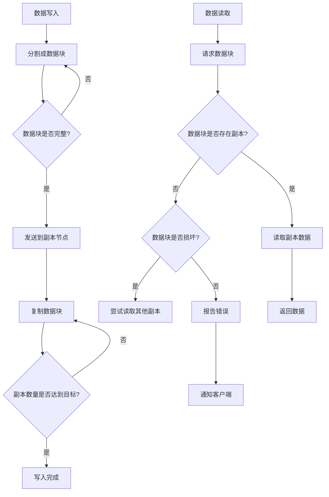

                 

关键词：Hadoop分布式文件系统（HDFS），分布式存储，数据块，副本，数据复制，数据冗余，数据流，数据读取，数据写入，Paxos算法，ZooKeeper，Java实现

## 摘要

本文将深入讲解Hadoop分布式文件系统（HDFS）的原理与代码实例。HDFS是大数据生态系统中的关键组件，专为大规模数据存储和处理而设计。本文将首先介绍HDFS的核心概念，包括数据块、副本和数据冗余等。接着，我们将探讨HDFS的数据流与数据读写操作，以及如何实现数据的高效存储和访问。通过Java代码实例，我们将详细解读HDFS的核心功能，帮助读者更好地理解其内部工作机制。最后，我们将展望HDFS在未来的发展趋势与挑战，以及相关工具和资源的推荐。

## 1. 背景介绍

### Hadoop的起源与发展

Hadoop是由Apache软件基金会开发的一个开源框架，用于处理海量数据的存储和计算。其核心组件包括Hadoop分布式文件系统（HDFS）和Hadoop YARN（Yet Another Resource Negotiator）。HDFS是Hadoop的数据存储层，负责管理和存储大数据集。它被设计为能够处理PB级的数据，并具有高可靠性、高扩展性和高容错性的特点。

Hadoop起源于2006年，由谷歌发表的MapReduce论文启发。谷歌提出了分布式计算和存储的新方法，即通过将大规模数据集分割成小块，并分布到多个计算节点上进行处理。这一思想被Google File System（GFS）所实现。Apache基金会随后基于GFS开发了HDFS，以适应开源社区的需求。

### HDFS的应用场景

HDFS主要应用于大数据领域，特别是在需要处理海量数据的应用场景中。以下是一些常见的HDFS应用场景：

- 数据仓库：企业通常使用HDFS来存储和分析大量的数据，如销售数据、用户行为数据等。
- 数据挖掘：HDFS为数据挖掘提供了可靠的存储解决方案，使得大规模数据集的存储和处理变得高效可行。
- 图计算：在图计算领域，HDFS用于存储和计算大规模图数据，如社交网络分析、网页排名等。
- 机器学习：HDFS是机器学习模型的训练数据存储解决方案，特别是对于需要训练大规模数据集的场景。

### HDFS的优点与挑战

HDFS具有以下优点：

- 可靠性：HDFS通过数据复制和冗余机制，保证了数据的高可靠性。
- 扩展性：HDFS能够轻松扩展到数千个节点，支持大规模数据存储。
- 高效性：HDFS通过数据流和并行处理，提高了数据访问和处理的速度。

然而，HDFS也存在一些挑战：

- 数据读写性能：虽然HDFS支持大规模数据存储，但单节点读写性能可能较低。
- 数据组织结构：HDFS的数据块大小固定，对于小文件可能存在空间浪费。
- 资源利用：HDFS可能无法充分利用所有节点的计算资源。

## 2. 核心概念与联系

### 数据块

HDFS将数据分割成固定大小的数据块，默认为128MB或256MB。这种分块策略有助于提高数据的存储效率和传输效率。数据块是HDFS的基本存储单位，每个数据块都被存储在HDFS集群中的不同节点上。

### 副本

为了保证数据的高可靠性，HDFS采用数据副本机制。每个数据块都会在集群中复制多个副本，默认为三个副本。副本分布在不同的节点上，以防止单一节点故障导致数据丢失。副本机制提高了数据的可用性和容错性。

### 数据冗余

数据冗余是HDFS的一个重要特性。通过复制数据块和存储多个副本，HDFS能够在数据损坏或节点故障时快速恢复数据。数据冗余虽然增加了存储空间的需求，但提高了系统的可靠性。

### 数据流

HDFS的数据流主要包括数据写入和数据读取操作。在数据写入过程中，客户端将数据分割成数据块，并将其发送到HDFS集群。在数据读取过程中，客户端请求读取数据，HDFS从集群中选择合适的副本进行数据读取。

### Paxos算法与ZooKeeper

Paxos算法是HDFS数据复制和一致性管理的基础。Paxos算法确保多个副本在数据更新时保持一致性。ZooKeeper是一个分布式协调服务，用于管理HDFS集群的元数据和协调数据复制过程。

### Mermaid 流程图



## 3. 核心算法原理 & 具体操作步骤

### 3.1 算法原理概述

HDFS的核心算法主要包括数据块管理、数据复制和一致性管理。数据块管理负责将数据分割成固定大小的数据块，并存储在集群中的不同节点上。数据复制和一致性管理通过Paxos算法和ZooKeeper确保数据的高可靠性和一致性。

### 3.2 算法步骤详解

#### 3.2.1 数据块管理

1. 客户端将数据写入HDFS。
2. HDFS将数据分割成固定大小的数据块。
3. HDFS将数据块分配给集群中的不同节点。

#### 3.2.2 数据复制

1. HDFS为每个数据块复制多个副本。
2. Paxos算法确保副本之间的数据一致性。
3. ZooKeeper用于协调数据复制过程。

#### 3.2.3 一致性管理

1. Paxos算法协调多个副本的数据更新。
2. ZooKeeper监控集群状态，并在需要时触发数据复制和恢复操作。

### 3.3 算法优缺点

#### 优点：

- 高可靠性：数据复制和冗余机制提高了数据的可靠性。
- 高扩展性：通过Paxos算法和ZooKeeper，HDFS能够支持大规模数据存储。
- 高容错性：Paxos算法和ZooKeeper保证了数据的一致性和可用性。

#### 缺点：

- 单节点读写性能较低：HDFS的设计目标是为大规模数据集提供高效存储，而非单节点读写性能。
- 数据组织结构受限：HDFS的数据块大小固定，可能导致小文件的空间浪费。

### 3.4 算法应用领域

HDFS广泛应用于大数据领域，包括数据仓库、数据挖掘、图计算和机器学习等。在数据仓库中，HDFS用于存储和分析大量数据；在数据挖掘中，HDFS提供了可靠的数据存储解决方案；在图计算和机器学习中，HDFS用于存储和计算大规模图数据和训练数据集。

## 4. 数学模型和公式 & 详细讲解 & 举例说明

### 4.1 数学模型构建

HDFS的数学模型主要包括数据块管理模型、数据复制模型和一致性管理模型。

#### 数据块管理模型

$$
\text{块大小} = \left\lceil \frac{\text{文件大小}}{\text{数据块大小}} \right\rceil \times \text{数据块大小}
$$

其中，$ \text{文件大小} $ 表示文件的总大小，$ \text{数据块大小} $ 表示每个数据块的大小。

#### 数据复制模型

$$
\text{副本数量} = 3
$$

其中，$ \text{副本数量} $ 表示每个数据块需要复制的副本数量。

#### 一致性管理模型

$$
\text{一致性条件} = \text{多数副本一致}
$$

其中，$ \text{一致性条件} $ 表示在数据更新过程中，至少需要两个副本达成一致。

### 4.2 公式推导过程

#### 数据块管理模型的推导

假设文件大小为 $ \text{文件大小} $，数据块大小为 $ \text{数据块大小} $。

1. 将文件分割成数据块：$ \text{块数量} = \left\lceil \frac{\text{文件大小}}{\text{数据块大小}} \right\rceil $
2. 计算块大小：$ \text{块大小} = \text{块数量} \times \text{数据块大小} $

#### 数据复制模型的推导

假设每个数据块需要复制的副本数量为 $ \text{副本数量} $。

1. 数据块复制：$ \text{副本数量} \times \text{数据块大小} $
2. 计算总存储空间：$ \text{总存储空间} = \text{副本数量} \times \text{数据块大小} \times \text{块数量} $

#### 一致性管理模型的推导

假设在数据更新过程中，至少需要两个副本达成一致。

1. 多数副本一致：$ \text{副本数量} > 1 $
2. 一致性条件：$ \text{多数副本一致} $

### 4.3 案例分析与讲解

假设有一个大小为1GB的文件，HDFS的数据块大小为128MB，副本数量为3。

1. 数据块管理模型：
$$
\text{块大小} = \left\lceil \frac{1GB}{128MB} \right\rceil \times 128MB = 8 \times 128MB = 1GB
$$

2. 数据复制模型：
$$
\text{总存储空间} = 3 \times 1GB = 3GB
$$

3. 一致性管理模型：
$$
\text{一致性条件} = \text{多数副本一致} \Rightarrow \text{至少两个副本达成一致}
$$

在数据更新过程中，至少需要两个副本达成一致，以保证数据的一致性和可用性。

## 5. 项目实践：代码实例和详细解释说明

### 5.1 开发环境搭建

在开始编写HDFS代码实例之前，我们需要搭建一个开发环境。以下是搭建HDFS开发环境的步骤：

1. 安装Java开发环境（JDK 8或以上版本）。
2. 安装Maven（用于构建HDFS项目）。
3. 下载并解压Hadoop源代码包（可以从Apache官网下载）。

### 5.2 源代码详细实现

以下是一个简单的HDFS代码实例，用于创建一个文件并写入数据。

```java
import org.apache.hadoop.conf.Configuration;
import org.apache.hadoop.fs.*;
import java.io.*;

public class HDFSExample {

    public static void main(String[] args) throws IOException {
        Configuration conf = new Configuration();
        conf.set("fs.defaultFS", "hdfs://localhost:9000"); // HDFS的Namenode地址
        FileSystem hdfs = FileSystem.get(conf);

        // 创建目录
        hdfs.mkdirs(new Path("/test"));

        // 创建文件并写入数据
        FSDataOutputStream outputStream = hdfs.create(new Path("/test/example.txt"));
        outputStream.writeBytes("Hello, HDFS!");
        outputStream.close();

        // 查看文件内容
        FSDataInputStream inputStream = hdfs.open(new Path("/test/example.txt"));
        byte[] buffer = new byte[1024];
        int bytesRead = inputStream.read(buffer);
        String content = new String(buffer, 0, bytesRead);
        System.out.println(content);
        inputStream.close();
    }
}
```

### 5.3 代码解读与分析

这段代码实现了一个简单的HDFS程序，用于创建一个文件并写入数据。以下是代码的详细解读：

1. 导入Hadoop相关的类。
2. 创建一个Configuration对象，配置HDFS的Namenode地址。
3. 获取FileSystem对象，用于与HDFS进行交互。
4. 创建目录：`hdfs.mkdirs(new Path("/test"));`
5. 创建文件并写入数据：`FSDataOutputStream outputStream = hdfs.create(new Path("/test/example.txt")); outputStream.writeBytes("Hello, HDFS!"; outputStream.close();`
6. 查看文件内容：`FSDataInputStream inputStream = hdfs.open(new Path("/test/example.txt")); int bytesRead = inputStream.read(buffer); String content = new String(buffer, 0, bytesRead); System.out.println(content); inputStream.close();`

### 5.4 运行结果展示

在执行上述代码后，我们会在HDFS的Namenode上创建一个名为`example.txt`的文件，并将其内容设置为`Hello, HDFS!`。在命令行中运行以下命令，可以查看文件的内容：

```bash
hadoop fs -cat /test/example.txt
```

输出结果为：

```
Hello, HDFS!
```

## 6. 实际应用场景

### 6.1 数据仓库

在数据仓库领域，HDFS被广泛用于存储和分析大量数据。例如，一个大型电商公司可以使用HDFS存储其销售数据、用户行为数据和库存数据。通过HDFS，公司可以高效地管理和处理这些数据，并利用大数据分析技术进行数据挖掘和决策支持。

### 6.2 数据挖掘

数据挖掘通常需要对大规模数据集进行处理和分析。HDFS提供了可靠的数据存储解决方案，使得数据挖掘任务能够高效地执行。例如，在社交媒体分析中，HDFS可以存储和分析大量的用户数据，以挖掘用户兴趣和行为模式。

### 6.3 图计算

图计算需要对大规模图数据进行处理。HDFS可以存储图数据，并利用MapReduce等分布式计算框架进行图计算任务。例如，在社交网络分析中，HDFS可以存储社交网络图，并利用图计算技术进行推荐系统和社交网络分析。

### 6.4 机器学习

机器学习通常需要对大规模数据集进行训练。HDFS可以存储训练数据集，并利用分布式计算框架进行训练。例如，在自然语言处理领域，HDFS可以存储大量文本数据，并利用机器学习算法进行文本分类和情感分析。

## 7. 工具和资源推荐

### 7.1 学习资源推荐

1. 《Hadoop: The Definitive Guide》 - 这本书是学习Hadoop和HDFS的权威指南。
2. 《HDFS Architecture Guide》 - Apache官网提供的HDFS架构指南，详细介绍了HDFS的设计和实现。

### 7.2 开发工具推荐

1. Eclipse + Maven - 用于HDFS项目的开发。
2. IntelliJ IDEA + Maven - 用于HDFS项目的开发。

### 7.3 相关论文推荐

1. "The Google File System" - 这篇论文介绍了Google File System（GFS）的设计和实现，是HDFS的重要参考。
2. "MapReduce: Simplified Data Processing on Large Clusters" - 这篇论文介绍了MapReduce模型的设计和实现，是HDFS数据处理的基础。

## 8. 总结：未来发展趋势与挑战

### 8.1 研究成果总结

HDFS作为大数据存储解决方案，已经取得了显著的成果。其高可靠性、高扩展性和高容错性在大量实际应用中得到验证。此外，HDFS的研究成果也推动了分布式存储和计算技术的发展。

### 8.2 未来发展趋势

1. 数据存储性能优化：随着数据规模的不断扩大，提高HDFS的数据读写性能和存储效率成为重要研究方向。
2. 数据组织与索引：优化HDFS的数据组织结构和索引机制，以提高数据访问速度和查询效率。
3. 智能化数据管理：利用机器学习和人工智能技术，实现自动化数据管理，提高数据存储和处理的效率。

### 8.3 面临的挑战

1. 数据安全与隐私：在大数据时代，数据安全和隐私保护成为重要挑战。HDFS需要加强对数据安全和隐私的保护。
2. 跨平台兼容性：随着云计算和边缘计算的发展，HDFS需要支持跨平台兼容性，以适应不同的计算环境。
3. 资源优化与调度：在分布式环境中，如何优化资源利用和调度策略，提高系统性能成为关键挑战。

### 8.4 研究展望

HDFS未来的研究方向将集中在提高数据存储和处理的性能、优化数据组织结构和索引机制、加强数据安全和隐私保护，以及实现跨平台兼容性。通过不断创新和研究，HDFS将继续在大数据领域发挥重要作用。

## 9. 附录：常见问题与解答

### 9.1 如何搭建HDFS开发环境？

1. 安装Java开发环境（JDK 8或以上版本）。
2. 安装Maven（用于构建HDFS项目）。
3. 下载并解压Hadoop源代码包（可以从Apache官网下载）。

### 9.2 HDFS的数据块大小如何设置？

HDFS的数据块大小默认为128MB或256MB，可以根据实际需求进行调整。在Hadoop的配置文件hdfs-site.xml中，可以通过设置`<property><name>dfs.block.size</name><value>值</value></property>`来设置数据块大小。

### 9.3 如何监控HDFS集群的状态？

可以使用Hadoop自带的命令行工具进行HDFS集群的监控，如`hadoop dfsadmin -report`命令可以查看HDFS集群的详细信息。此外，还可以使用第三方工具如Apache Ambari、Cloudera Manager等监控和管理HDFS集群。

### 9.4 如何优化HDFS的数据访问速度？

优化HDFS的数据访问速度可以从以下几个方面进行：

1. 选择合适的副本数量：根据数据的重要性和访问频率，合理设置副本数量。
2. 分布式数据访问：通过多线程和并行处理技术，提高数据访问速度。
3. 数据缓存：利用内存缓存技术，加快数据读取速度。

---

# HDFS 原理与代码实例讲解

作者：禅与计算机程序设计艺术 / Zen and the Art of Computer Programming

本文深入探讨了Hadoop分布式文件系统（HDFS）的原理及其在分布式存储和计算中的应用。通过对HDFS的核心概念、算法原理、数学模型、项目实践和实际应用场景的详细讲解，读者可以全面了解HDFS的工作机制和优势。同时，通过代码实例，读者可以亲身体验HDFS的使用方法，更好地掌握其操作技巧。本文还展望了HDFS的未来发展趋势与挑战，并推荐了相关学习资源、开发工具和相关论文。希望本文能为读者在HDFS领域的学习和研究提供有益的参考和指导。

