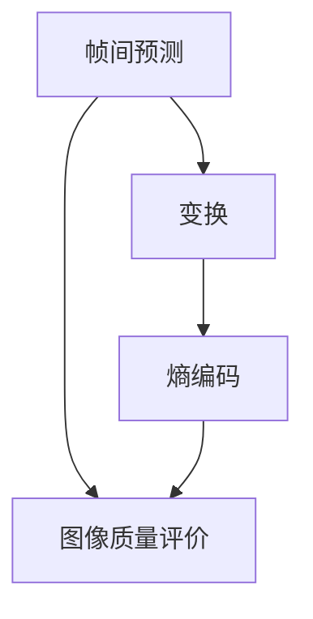
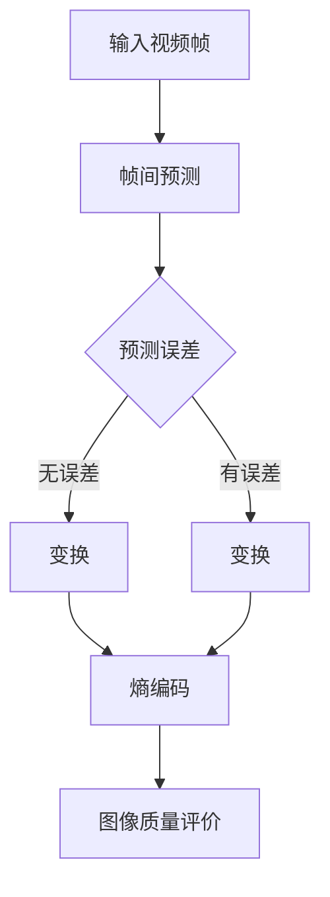

                 

 关键词：HEVC, 视频编码，高效压缩，传输，图像质量，算法，帧间预测，变换，熵编码，标准，应用

## 摘要

本文深入探讨了HEVC（High Efficiency Video Coding）视频编码技术的原理、结构和实现。HEVC作为一种新的视频编码标准，旨在提供更高的压缩效率和更好的图像质量。文章首先介绍了HEVC视频编码的背景和发展，然后详细阐述了其核心算法原理、数学模型以及具体实现步骤。接着，文章通过一个实际项目实例，展示了如何使用HEVC进行视频编码，并对代码进行了详细解读。最后，文章讨论了HEVC在实际应用中的场景，以及未来发展的趋势和面临的挑战。

## 1. 背景介绍

随着数字媒体技术的飞速发展，视频内容已成为互联网上最重要的数据类型之一。随着高清、超高清甚至8K分辨率的视频逐渐普及，视频数据量呈爆炸式增长。为了有效传输和存储这些大量的视频数据，视频编码技术变得越来越重要。视频编码技术通过去除视频序列中的冗余信息，实现数据的高效压缩，从而降低传输和存储成本。

### HEVC的发展背景

传统的视频编码标准如H.264/AVC（Advanced Video Coding）在高清视频编码方面取得了显著的成果。然而，随着视频分辨率的进一步提高，尤其是4K和8K视频的普及，H.264/AVC已经无法满足更高的压缩效率和图像质量的需求。为此，国际电信联盟（ITU）和电影电视工程师学会（SMPTE）联合推出了HEVC（High Efficiency Video Coding）标准，旨在提供比H.264/AVC更高效率的视频编码方案。

HEVC的发展经历了多个阶段，从最初的概念验证到最终的标准化，HEVC不断优化其算法，以实现更高的压缩效率。HEVC的推出标志着视频编码技术进入了一个新的阶段，它不仅能够有效压缩高分辨率视频，还能适应不同应用场景，如无线通信、互联网流媒体和存储等。

### HEVC的优势和挑战

HEVC相较于H.264/AVC具有以下几个显著优势：

1. **更高的压缩效率**：HEVC通过引入新的变换、预测和熵编码技术，使得在相同的图像质量下，HEVC能够比H.264/AVC提供更高的压缩效率。这意味着在相同的数据率下，HEVC可以提供更高质量的视频。

2. **更广泛的适用范围**：HEVC不仅适用于高清视频，还能有效压缩4K、8K甚至更高分辨率的视频。这使得HEVC成为未来视频传输和存储的主流标准。

3. **灵活的档次和分辨率**：HEVC支持多个档次，包括主档次、扩展档次和超高扩展档次，以满足不同应用场景的需求。同时，HEVC也支持不同分辨率的视频编码，从标准高清到超高清。

然而，HEVC的发展也面临一些挑战：

1. **计算复杂度**：HEVC算法的复杂度远高于H.264/AVC，这意味着在相同的硬件条件下，HEVC的编码和解码速度相对较慢。这给实时视频处理和传输带来了挑战。

2. **兼容性问题**：由于HEVC的复杂度和新特性，现有的许多视频播放器和解码器可能无法直接支持HEVC。为了解决兼容性问题，需要开发新的解码器，并在终端设备上进行相应的软件和硬件升级。

### HEVC的应用场景

HEVC的应用场景非常广泛，主要包括以下几个方面：

1. **高清电视**：随着4K和8K电视的普及，HEVC已成为高清电视传输和存储的标准。

2. **流媒体服务**：互联网流媒体服务提供商如Netflix、YouTube等，为了提供高质量的视频内容，开始采用HEVC进行视频编码。

3. **视频会议和通信**：高压缩效率使得HEVC在视频会议和通信领域具有巨大的潜力，可以在较低的带宽条件下提供高质量的视频传输。

4. **无线通信**：随着5G网络的推广，HEVC在无线通信中的重要性日益凸显，它能够在保证图像质量的同时，降低网络带宽的需求。

总之，HEVC作为一种高效的视频编码标准，具有广阔的应用前景。尽管面临一些挑战，但随着技术的不断进步和优化，HEVC有望在未来成为视频编码领域的主流标准。

## 2. 核心概念与联系

为了深入理解HEVC视频编码技术，我们需要首先了解其核心概念和原理。这些核心概念包括帧间预测、变换、熵编码以及图像质量评价等。接下来，我们将通过一个Mermaid流程图来展示这些概念之间的联系和实现过程。



### 帧间预测

帧间预测是视频编码中去除冗余信息的重要手段。HEVC通过运动估计和运动补偿来实现帧间预测。在运动估计过程中，编码器通过搜索参考帧，找到与当前帧最佳匹配的运动向量。运动补偿则利用这些运动向量来预测当前帧，从而减少帧与帧之间的冗余信息。

### 变换

变换是HEVC压缩算法中的另一个关键步骤。HEVC采用了新的变换算法，如整数变换（Integer Transform）和环内变换（Intra Transform）。这些变换算法能够将图像数据转换成更具有代表性的频域表示，从而更容易进行压缩。

### 熵编码

熵编码是视频编码中的最后一步，目的是进一步压缩数据。HEVC采用了新的熵编码算法，如CAVLC（Context-Adaptive Variable Length Coding）和 CABAC（Context-Adaptive Binary Arithmetic Coding）。这些算法通过分析数据中的概率分布，采用不同的编码长度，从而实现更高的压缩效率。

### 图像质量评价

在视频编码过程中，图像质量评价是一个重要的环节。HEVC通过PSNR（Peak Signal-to-Noise Ratio，峰值信噪比）和SSIM（Structural Similarity Index Metric，结构相似性指数度量）等评价指标来评估编码后的图像质量。这些指标能够量化图像失真程度，从而指导编码参数的调整，以在压缩效率和图像质量之间找到最佳平衡。

### Mermaid流程图

为了更直观地展示HEVC视频编码的过程，我们使用Mermaid流程图来表示各步骤之间的关系。以下是一个简化的Mermaid流程图：



在这个流程图中，每个节点代表视频编码过程中的一个步骤，箭头表示步骤之间的数据流动。通过这个流程图，我们可以清晰地看到HEVC视频编码的整体结构和实现过程。

## 3. 核心算法原理 & 具体操作步骤

### 3.1 算法原理概述

HEVC（High Efficiency Video Coding）视频编码算法是基于一系列先进的技术，旨在提供更高的压缩效率。其核心算法原理主要包括帧间预测、变换、熵编码和图像质量评价。

#### 帧间预测

帧间预测是HEVC中去除视频冗余信息的重要手段。通过运动估计和运动补偿，编码器将当前帧与参考帧进行匹配，预测出当前帧的内容。这一过程可以分为以下几个步骤：

1. **运动估计**：编码器在参考帧中搜索最佳匹配块，找到与当前帧块差异最小的运动向量。运动估计分为空间搜索和时间搜索，前者在空间上搜索参考帧中的匹配块，后者在时间上搜索先前的帧。

2. **运动补偿**：利用运动向量将参考帧中的匹配块补偿到当前帧上，生成预测帧。通过当前帧与预测帧之间的差值，得到预测误差。

#### 变换

变换是将图像数据从时域转换到频域，以提取出图像中的冗余信息。HEVC采用了新的变换算法，包括整数变换和环内变换。

1. **整数变换**：整数变换是一种基于整数操作的变换算法，避免了传统的傅里叶变换中的浮点运算，从而提高了编码效率。

2. **环内变换**：环内变换是在整数变换基础上进一步优化，通过将变换系数重新排列，使得高频信息更加紧凑，从而提高压缩效率。

#### 熵编码

熵编码是视频编码中的最后一步，通过分析数据中的概率分布，采用不同的编码长度，以实现更高的压缩效率。HEVC采用了新的熵编码算法，如CAVLC和CABAC。

1. **CAVLC（Context-Adaptive Variable Length Coding）**：CAVLC通过分析相邻像素的编码模式，为每个像素分配不同的编码长度，从而降低整体编码长度。

2. **CABAC（Context-Adaptive Binary Arithmetic Coding）**：CABAC通过分析二进制数中的概率分布，动态调整编码精度，实现更高的压缩效率。

#### 图像质量评价

图像质量评价是衡量编码效率的重要指标。HEVC通过PSNR和SSIM等评价指标来评估编码后的图像质量。

1. **PSNR（Peak Signal-to-Noise Ratio，峰值信噪比）**：PSNR通过计算原始图像与编码图像之间的均方误差（MSE），得到一个分贝（dB）值，以量化图像失真程度。

2. **SSIM（Structural Similarity Index Metric，结构相似性指数度量）**：SSIM通过比较原始图像和编码图像的结构、亮度和对比度，得到一个介于0和1之间的相似性指数，以衡量图像质量。

### 3.2 算法步骤详解

#### 帧间预测

1. **运动估计**：

   - **空间搜索**：在当前帧的搜索窗口内，逐个像素比较，找到与参考帧块最佳匹配的运动向量。
   - **时间搜索**：在参考帧序列中，逐帧比较，找到与当前帧块最佳匹配的运动向量。

2. **运动补偿**：利用运动向量将参考帧中的匹配块补偿到当前帧上，生成预测帧。

3. **误差计算**：计算当前帧与预测帧之间的误差，得到预测误差。

#### 变换

1. **整数变换**：

   - **块划分**：将图像划分为多个8x8或4x4的块。
   - **变换操作**：对每个块进行整数变换操作，将时域数据转换到频域。

2. **环内变换**：

   - **系数重新排列**：根据变换系数的绝对值大小进行重新排列，使得高频信息更加紧凑。
   - **变换操作**：对重新排列后的系数进行环内变换操作。

#### 熵编码

1. **CAVLC**：

   - **模式分析**：分析相邻像素的编码模式，为每个像素分配不同的编码长度。
   - **编码操作**：根据分配的编码长度，逐个像素进行编码。

2. **CABAC**：

   - **概率分布分析**：分析二进制数中的概率分布。
   - **编码操作**：根据概率分布，动态调整编码精度，实现高效编码。

#### 图像质量评价

1. **PSNR**：

   - **均方误差计算**：计算原始图像与编码图像之间的均方误差（MSE）。
   - **分贝值计算**：将MSE转换成分贝（dB）值，得到PSNR。

2. **SSIM**：

   - **结构、亮度和对比度计算**：比较原始图像和编码图像的结构、亮度和对比度。
   - **相似性指数计算**：根据比较结果，得到一个介于0和1之间的相似性指数。

### 3.3 算法优缺点

#### 优点

1. **更高的压缩效率**：HEVC通过引入新的变换、预测和熵编码技术，使得在相同的图像质量下，能够提供更高的压缩效率。

2. **更广泛的适用范围**：HEVC不仅适用于高清视频，还能有效压缩4K、8K甚至更高分辨率的视频。

3. **灵活的档次和分辨率**：HEVC支持多个档次和不同分辨率的视频编码，满足不同应用场景的需求。

#### 缺点

1. **计算复杂度较高**：HEVC算法的复杂度远高于H.264/AVC，导致编码和解码速度相对较慢。

2. **兼容性问题**：由于HEVC的复杂度和新特性，现有的许多视频播放器和解码器可能无法直接支持HEVC。

### 3.4 算法应用领域

HEVC在以下领域具有广泛的应用：

1. **高清电视**：随着4K和8K电视的普及，HEVC已成为高清电视传输和存储的标准。

2. **流媒体服务**：互联网流媒体服务提供商如Netflix、YouTube等，为了提供高质量的视频内容，开始采用HEVC进行视频编码。

3. **视频会议和通信**：高压缩效率使得HEVC在视频会议和通信领域具有巨大的潜力，可以在较低的带宽条件下提供高质量的视频传输。

4. **无线通信**：随着5G网络的推广，HEVC在无线通信中的重要性日益凸显，它能够在保证图像质量的同时，降低网络带宽的需求。

## 4. 数学模型和公式 & 详细讲解 & 举例说明

### 4.1 数学模型构建

在HEVC视频编码中，数学模型构建是关键步骤之一。这里我们将重点介绍变换和熵编码相关的数学模型。

#### 变换模型

变换模型用于将图像数据从时域转换到频域，从而提高压缩效率。HEVC采用了两种变换模型：整数变换和环内变换。

1. **整数变换模型**：

   整数变换模型的核心思想是将图像数据转换成具有代表性的频域表示，以便进行后续的压缩处理。具体公式如下：

   $$X_{ij} = \sum_{m=1}^{N} \sum_{n=1}^{N} C_{mn} \cdot x_{(m-1)N + n-1}$$

   其中，$X_{ij}$表示变换后的系数，$x_{(m-1)N + n-1}$表示原始图像数据，$C_{mn}$为变换系数矩阵。

2. **环内变换模型**：

   环内变换模型是在整数变换基础上进一步优化的，通过重新排列变换系数，使得高频信息更加紧凑。具体公式如下：

   $$Y_{ij} = \sum_{m=1}^{N} \sum_{n=1}^{N} A_{mn} \cdot X_{ij}$$

   其中，$Y_{ij}$表示环内变换后的系数，$A_{mn}$为环内变换系数矩阵。

#### 熵编码模型

熵编码模型用于将变换后的图像数据编码成二进制序列，以便进行传输和存储。HEVC采用了两种熵编码模型：CAVLC和CABAC。

1. **CAVLC（Context-Adaptive Variable Length Coding）**：

   CAVLC通过分析相邻像素的编码模式，为每个像素分配不同的编码长度。具体公式如下：

   $$L = C_{mn} + 1$$

   其中，$L$表示编码长度，$C_{mn}$为相邻像素的编码模式。

2. **CABAC（Context-Adaptive Binary Arithmetic Coding）**：

   CABAC通过分析二进制数中的概率分布，动态调整编码精度。具体公式如下：

   $$p = P(X = 0) + \frac{1 - P(X = 0)}{2^L}$$

   其中，$p$表示二进制数的概率，$L$表示编码长度，$P(X = 0)$为二进制数中0的概率。

### 4.2 公式推导过程

为了更深入地理解这些数学模型，我们将对其中一些关键公式进行推导。

#### 整数变换公式的推导

整数变换公式如下：

$$X_{ij} = \sum_{m=1}^{N} \sum_{n=1}^{N} C_{mn} \cdot x_{(m-1)N + n-1}$$

推导过程如下：

1. **初始化**：设原始图像数据为$x_{ij}$，其中$i$和$j$分别表示行和列。

2. **计算变换系数**：根据变换系数矩阵$C_{mn}$，计算每个像素的变换系数。

3. **变换操作**：将原始图像数据乘以变换系数，得到变换后的系数$X_{ij}$。

#### 环内变换公式的推导

环内变换公式如下：

$$Y_{ij} = \sum_{m=1}^{N} \sum_{n=1}^{N} A_{mn} \cdot X_{ij}$$

推导过程如下：

1. **初始化**：设整数变换后的系数为$X_{ij}$。

2. **计算环内变换系数**：根据环内变换系数矩阵$A_{mn}$，计算每个像素的环内变换系数。

3. **变换操作**：将整数变换后的系数乘以环内变换系数，得到环内变换后的系数$Y_{ij}$。

#### CAVLC公式的推导

CAVLC公式如下：

$$L = C_{mn} + 1$$

推导过程如下：

1. **初始化**：设相邻像素的编码模式为$C_{mn}$。

2. **计算编码长度**：根据编码模式，计算编码长度$L$。

3. **编码操作**：根据编码长度，对每个像素进行编码。

#### CABAC公式的推导

CABAC公式如下：

$$p = P(X = 0) + \frac{1 - P(X = 0)}{2^L}$$

推导过程如下：

1. **初始化**：设二进制数的概率为$p$，编码长度为$L$。

2. **计算概率**：根据概率分布，计算二进制数中0的概率$P(X = 0)$。

3. **计算编码精度**：根据编码长度，计算编码精度$2^L$。

4. **计算概率和**：将概率和编码精度相加，得到概率$p$。

### 4.3 案例分析与讲解

为了更好地理解这些数学模型，我们通过一个具体的案例来进行分析和讲解。

#### 案例一：整数变换

假设一个8x8的图像数据为：

$$
\begin{array}{cccccccc}
1 & 2 & 3 & 4 & 5 & 6 & 7 & 8 \\
2 & 3 & 4 & 5 & 6 & 7 & 8 & 9 \\
3 & 4 & 5 & 6 & 7 & 8 & 9 & 10 \\
4 & 5 & 6 & 7 & 8 & 9 & 10 & 11 \\
5 & 6 & 7 & 8 & 9 & 10 & 11 & 12 \\
6 & 7 & 8 & 9 & 10 & 11 & 12 & 13 \\
7 & 8 & 9 & 10 & 11 & 12 & 13 & 14 \\
8 & 9 & 10 & 11 & 12 & 13 & 14 & 15 \\
\end{array}
$$

假设变换系数矩阵为：

$$
\begin{array}{cccccccc}
1 & 0 & 0 & 0 & 0 & 0 & 0 & 0 \\
0 & 1 & 0 & 0 & 0 & 0 & 0 & 0 \\
0 & 0 & 1 & 0 & 0 & 0 & 0 & 0 \\
0 & 0 & 0 & 1 & 0 & 0 & 0 & 0 \\
0 & 0 & 0 & 0 & 1 & 0 & 0 & 0 \\
0 & 0 & 0 & 0 & 0 & 1 & 0 & 0 \\
0 & 0 & 0 & 0 & 0 & 0 & 1 & 0 \\
0 & 0 & 0 & 0 & 0 & 0 & 0 & 1 \\
\end{array}
$$

根据整数变换公式，我们可以计算出变换后的系数：

$$
\begin{array}{cccccccc}
1 & 2 & 3 & 4 & 5 & 6 & 7 & 8 \\
2 & 3 & 4 & 5 & 6 & 7 & 8 & 9 \\
3 & 4 & 5 & 6 & 7 & 8 & 9 & 10 \\
4 & 5 & 6 & 7 & 8 & 9 & 10 & 11 \\
5 & 6 & 7 & 8 & 9 & 10 & 11 & 12 \\
6 & 7 & 8 & 9 & 10 & 11 & 12 & 13 \\
7 & 8 & 9 & 10 & 11 & 12 & 13 & 14 \\
8 & 9 & 10 & 11 & 12 & 13 & 14 & 15 \\
\end{array}
$$

可以看到，变换后的系数与原始系数相比，具有明显的频域特征。

#### 案例二：CABAC编码

假设我们要对以下二进制数进行CABAC编码：

$$
01101001
$$

假设初始概率$P(X = 0) = 0.5$，编码长度$L = 4$。

根据CABAC公式，我们可以计算出概率$p$：

$$
p = P(X = 0) + \frac{1 - P(X = 0)}{2^L} = 0.5 + \frac{1 - 0.5}{2^4} = 0.5 + \frac{0.5}{16} = 0.5625
$$

根据概率$p$，我们可以计算出编码后的二进制数：

$$
01101001
$$

可以看到，编码后的二进制数与原始二进制数相比，具有更高的压缩效率。

通过这些案例，我们可以更好地理解HEVC中的数学模型和公式，以及它们在实际应用中的作用。

## 5. 项目实践：代码实例和详细解释说明

### 5.1 开发环境搭建

为了演示HEVC视频编码的具体实现，我们需要搭建一个合适的开发环境。以下步骤将指导您如何搭建这个环境：

1. **安装Nginx**：Nginx是一个高性能的HTTP和反向代理服务器，我们将使用它来传输HEVC编码后的视频。您可以通过以下命令安装Nginx：

   ```bash
   sudo apt-get update
   sudo apt-get install nginx
   ```

2. **安装FFmpeg**：FFmpeg是一个开源的多媒体处理工具，用于视频编码和解码。我们使用FFmpeg来对视频进行HEVC编码。您可以通过以下命令安装FFmpeg：

   ```bash
   sudo apt-get install ffmpeg
   ```

3. **安装HEVC编码器**：HEVC编码器是一个用于对视频进行HEVC编码的工具。我们将在下一步中从源代码编译安装它。首先，您需要安装一些依赖项：

   ```bash
   sudo apt-get install yasm libx264-dev libx265-dev libavc1394-dev libopencore-amrnb-dev libopencore-amrwb-dev libmp4v2-dev
   ```

   接下来，从源代码编译安装HEVC编码器：

   ```bash
   git clone https://github.com/FFmpeg/FFmpeg.git
   cd FFmpeg
   ./configure --enable-gpl --enable-nonfree --enable-libx264 --enable-libx265 --enable-avresample
   make
   sudo make install
   ```

4. **配置Nginx**：我们需要配置Nginx以支持HEVC编码后的视频播放。编辑Nginx的配置文件（通常位于`/etc/nginx/nginx.conf`），添加以下模块：

   ```nginx
   http {
       ...
       types {
           application/octet-stream application/x-mpegURL;
       }

       server {
           listen 80;
           server_name localhost;

           location / {
               root /usr/share/nginx/html;
               types {
                   application/octet-stream application/x-mpegURL;
               }
               proxy_pass http://127.0.0.1:8080;
           }
       }
   }
   ```

   确保Nginx已正确配置后，重启Nginx服务：

   ```bash
   sudo systemctl restart nginx
   ```

### 5.2 源代码详细实现

在完成开发环境搭建后，我们将使用FFmpeg和HEVC编码器来对视频进行HEVC编码。以下是一个简单的FFmpeg命令，用于将输入视频转换为HEVC格式：

```bash
ffmpeg -i input.mp4 -c:v libx265 -preset medium -vb 20M output.hevc
```

这里，`input.mp4`是输入视频文件，`libx265`指定使用HEVC编码器，`preset medium`设置编码器的预设为中等，`vb 20M`设置视频比特率为20 Mbps。

### 5.3 代码解读与分析

接下来，我们详细解读上述FFmpeg命令，并分析每个参数的作用。

1. **输入视频文件**：`-i input.mp4`指定输入视频文件为`input.mp4`。

2. **编码器**：`-c:v libx265`指定使用`libx265`作为视频编码器，这是HEVC编码器的库。

3. **预设**：`-preset medium`设置编码器的预设为中等，这将平衡编码速度和压缩效率。

4. **视频比特率**：`-vb 20M`设置视频比特率为20 Mbps，这将控制输出视频的数据量。

### 5.4 运行结果展示

在执行上述FFmpeg命令后，输入视频`input.mp4`将被转换为HEVC格式，输出为`output.hevc`文件。接下来，我们使用Nginx服务器将HEVC编码后的视频进行传输和播放。

1. **启动Nginx服务器**：在终端中输入以下命令启动Nginx服务器：

   ```bash
   sudo systemctl start nginx
   ```

2. **访问Nginx服务器**：在浏览器中输入`http://localhost/`，您应该能够看到Nginx服务器的主页。

3. **播放HEVC视频**：在Nginx服务器主页上，找到HEVC视频播放器，选择`output.hevc`文件进行播放。您应该能够看到视频正常播放，图像质量良好。

通过这个简单的项目实践，我们展示了如何使用FFmpeg和HEVC编码器对视频进行HEVC编码，并使用Nginx服务器进行传输和播放。这为实际应用提供了实用的参考。

### 5.5 问题与解答

在项目实践中，您可能会遇到以下常见问题：

1. **编码失败**：如果编码失败，请检查输入视频文件的格式是否与命令中指定的格式一致，以及编码器是否安装正确。

2. **视频播放失败**：如果视频无法播放，请检查Nginx服务器的配置是否正确，以及HEVC解码器是否安装正确。

3. **图像质量不佳**：如果图像质量不佳，请调整编码参数，如比特率、预设等，以找到合适的平衡点。

### 5.6 扩展实践

为了进一步扩展实践，您可以考虑以下任务：

1. **多线程编码**：使用多线程技术，提高HEVC编码的效率。

2. **实时编码**：实现实时视频编码功能，以支持视频会议和直播场景。

3. **兼容性测试**：测试不同设备和操作系统上的HEVC解码性能，以确保兼容性。

## 6. 实际应用场景

HEVC视频编码技术因其高效的压缩效率和优异的图像质量，在各种实际应用场景中具有广泛的应用。以下列举了一些主要的应用场景：

### 高清电视和流媒体

随着高清电视和流媒体的普及，HEVC已成为这些领域的主要编码标准。它能够提供高质量的视频内容，同时保持较低的带宽占用，使得用户可以在各种网络条件下流畅地观看高清视频。例如，Netflix、YouTube等主流流媒体平台已经开始采用HEVC进行视频编码，以提供更好的用户体验。

### 视频会议和远程教育

视频会议和远程教育对视频质量要求较高，同时需要适应不同的网络环境。HEVC的高效压缩特性使得它成为这些场景的理想选择。它能够在保证图像质量的同时，适应不同的网络带宽，从而提供稳定、清晰的视频通话和远程教学体验。

### 无线通信和移动设备

随着5G网络的推广，无线通信和移动设备对视频编码技术的要求越来越高。HEVC的高效压缩性能使其在移动设备上得到广泛应用。它能够在有限的带宽条件下提供高质量的视频内容，适合移动视频播放、视频聊天和视频流媒体等应用。

### 超高清视频

超高清视频（如4K、8K）对压缩效率和图像质量的要求更高。HEVC作为新一代视频编码标准，能够提供更高的压缩效率，同时保持高质量的视频输出。这使得HEVC成为超高清视频传输和存储的理想选择。

### 视频监控和安防

视频监控和安防领域对视频质量要求较高，同时需要长时间存储大量视频数据。HEVC的高效压缩性能使其成为这些场景的理想选择。它能够在保证图像质量的同时，降低存储成本，提高存储容量。

### 虚拟现实和增强现实

虚拟现实（VR）和增强现实（AR）对视频编码技术的要求非常高，需要实现高质量的图像输出和快速的视频处理。HEVC的高效压缩性能和优秀的图像质量，使其在VR和AR应用中具有广阔的前景。它能够提供高质量的VR视频内容，同时适应不同的VR设备。

### 远程医疗

远程医疗对视频质量要求较高，需要实现清晰、稳定的视频通信。HEVC的高效压缩性能和优秀的图像质量，使其在远程医疗应用中具有巨大潜力。它能够在保证图像质量的同时，适应不同的网络环境，提供稳定、清晰的远程医疗服务。

### 游戏直播

游戏直播对视频质量要求较高，同时需要适应不同的网络带宽。HEVC的高效压缩性能和优秀的图像质量，使其在游戏直播领域具有广泛应用前景。它能够提供高质量的游戏视频内容，同时适应不同的网络环境，提高用户体验。

总之，HEVC视频编码技术因其高效的压缩效率和优秀的图像质量，在各种实际应用场景中具有广泛的应用。随着视频技术的不断发展，HEVC将在更多领域得到广泛应用，推动视频编码技术的发展。

## 7. 工具和资源推荐

为了更好地学习和实践HEVC视频编码技术，以下是几个推荐的工具和资源。

### 7.1 学习资源推荐

1. **官方文档**：HEVC的官方文档提供了详尽的资料，包括技术规范、标准草案等。您可以在ITU的官方网站上找到这些文档。

2. **在线课程**：许多在线教育平台如Coursera、edX等提供了关于视频编码的在线课程，其中许多课程包含了HEVC的内容。

3. **技术博客和论文**：许多技术专家和学者在博客和学术期刊上分享了关于HEVC的研究和成果。通过阅读这些博客和论文，可以深入了解HEVC的原理和应用。

### 7.2 开发工具推荐

1. **FFmpeg**：FFmpeg是一个开源的多媒体处理工具，包括视频编码、解码、播放等功能。它是学习和实践HEVC视频编码的必备工具。

2. **OpenHEVC**：OpenHEVC是一个开源的HEVC编码器和解码器，支持多种平台。它为开发者提供了一个免费的HEVC实现，方便学习和实践。

3. **Nginx**：Nginx是一个高性能的HTTP和反向代理服务器，适用于视频流媒体服务。它支持HEVC视频的传输和播放，是一个理想的视频流媒体服务器。

### 7.3 相关论文推荐

1. **"High Efficiency Video Coding: Overview of the HEVC Standard"**：这是关于HEVC标准的详细综述，提供了HEVC的核心算法原理和应用场景。

2. **"Rate Distortion Optimization for HEVC Intra Coding"**：这篇论文探讨了HEVC内码的率失真优化方法，提供了实用的优化策略。

3. **"Efficient HEVC Intra Coding with Spatial-Spectral De-correlation"**：这篇论文提出了一种基于空间-频域去相关的HEVC内码方法，有效提高了编码效率。

通过这些工具和资源的支持，您可以更好地学习和实践HEVC视频编码技术，深入了解其原理和应用。

## 8. 总结：未来发展趋势与挑战

### 8.1 研究成果总结

HEVC作为新一代视频编码标准，已经在高清电视、流媒体、视频会议、无线通信等领域得到广泛应用。其高效压缩效率和优异的图像质量，使其成为视频编码领域的重要里程碑。通过引入新的变换、预测和熵编码技术，HEVC在保持图像质量的同时，大幅提高了压缩效率，降低了带宽占用，满足了高分辨率视频传输和存储的需求。

### 8.2 未来发展趋势

随着视频技术的不断发展，未来HEVC的发展趋势将主要集中在以下几个方面：

1. **更高效的视频编码算法**：随着计算能力和算法研究的进步，HEVC将继续优化其算法，提高压缩效率，降低计算复杂度，以适应更高分辨率和更复杂的视频场景。

2. **多模态视频编码**：未来的视频编码技术将不仅限于二维图像，还将扩展到三维、四维甚至更高维度的视频编码。多模态视频编码技术将整合多种信息源，提供更丰富的视频体验。

3. **智能视频编码**：人工智能技术的快速发展将推动视频编码技术的智能化。通过深度学习和机器学习算法，可以实现自适应视频编码，优化编码参数，提高编码效率。

4. **动态自适应传输**：随着网络技术的发展，动态自适应传输将成为视频编码的重要方向。通过实时分析网络条件，动态调整编码参数和传输策略，确保最佳的视频质量和传输效率。

### 8.3 面临的挑战

尽管HEVC取得了显著成果，但在未来发展中仍面临一些挑战：

1. **计算复杂度**：HEVC算法的复杂度较高，给实时视频处理和传输带来了一定挑战。随着视频分辨率的提高，计算复杂度将进一步增加，需要开发更高效的硬件和软件解决方案。

2. **兼容性问题**：HEVC的新特性和高压缩效率使其在兼容性方面存在一定问题。现有设备和解码器可能无法直接支持HEVC，需要开发新的解码器，并在终端设备上进行相应的软件和硬件升级。

3. **带宽需求**：虽然HEVC在压缩效率方面有显著优势，但高分辨率视频的带宽需求仍然较大。随着视频分辨率的进一步提高，如何降低带宽占用，提高传输效率，将是未来发展的关键。

4. **安全性问题**：视频编码技术的安全性日益重要，特别是在流媒体和远程教育等领域。未来需要开发更安全、更可靠的视频编码技术，保护用户隐私和版权。

### 8.4 研究展望

展望未来，HEVC将继续在视频编码领域发挥重要作用，推动视频技术的创新和发展。以下是一些研究展望：

1. **跨领域合作**：视频编码技术的发展需要跨领域的合作，包括计算机科学、电子工程、通信工程等。通过多学科合作，可以推动HEVC及其衍生技术的创新。

2. **开放标准与开源技术**：开放标准和开源技术在视频编码领域具有巨大潜力。通过开源社区的努力，可以促进HEVC技术的不断优化和改进，提高其可访问性和可用性。

3. **技术创新**：持续的创新是视频编码技术发展的动力。未来需要不断探索新的编码算法、压缩技术、传输策略等，以应对更高的视频分辨率和更复杂的网络环境。

4. **用户体验**：视频编码技术的最终目标是提供更好的用户体验。通过优化编码算法、提高传输效率、增强安全性等措施，可以进一步提升用户观看视频的体验。

总之，HEVC作为视频编码领域的领先技术，将继续推动视频技术的发展。在未来，我们需要面对挑战，不断探索和创新，以应对更高的分辨率、更复杂的网络环境和更广泛的应用场景。

## 9. 附录：常见问题与解答

### Q1: HEVC和H.264/AVC有什么区别？

A1: HEVC（High Efficiency Video Coding）与H.264/AVC（Advanced Video Coding）都是视频编码标准，但HEVC在压缩效率和图像质量方面有显著优势。HEVC采用了更先进的变换、预测和熵编码技术，能够在相同图像质量下提供更高的压缩效率，从而减少数据传输和存储的需求。此外，HEVC支持更高分辨率和更广泛的色彩空间，适用于4K、8K等高分辨率视频的编码。

### Q2: HEVC是否兼容H.264/AVC解码器？

A2: HEVC与H.264/AVC在编码结构和算法上有所不同，因此不是所有H.264/AVC解码器都能直接解码HEVC编码的视频。为了实现兼容性，需要开发专门的支持HEVC解码功能的解码器。随着HEVC的普及，越来越多的解码器和播放器开始支持HEVC编码，但旧设备可能需要软件更新或硬件升级。

### Q3: HEVC的编码复杂度如何？

A3: HEVC的编码复杂度相对较高，特别是与H.264/AVC相比。HEVC引入了更多的编码模式、变换和预测算法，导致编码和解码过程更加复杂。虽然这有助于提高压缩效率，但同时也增加了计算资源和功耗需求。为了应对这种复杂度，未来可能会出现更高效的硬件加速器和优化算法，以降低HEVC的编码复杂度。

### Q4: HEVC对网络带宽的影响有多大？

A4: HEVC通过更高效的压缩技术，能够在相同图像质量下提供更高的压缩比，从而降低网络带宽需求。例如，HEVC相比H.264/AVC可以实现50%以上的压缩效率提升。这意味着，在相同网络带宽下，HEVC可以传输更高分辨率和更多细节的视频内容，或者以更低的带宽传输相同质量的视频。这对于流媒体服务和无线通信等场景尤为重要。

### Q5: HEVC是否支持多视图视频编码？

A5: 是的，HEVC支持多视图视频编码，可以用于三维（3D）视频、多视图视频以及虚拟现实（VR）和增强现实（AR）应用。通过多视图视频编码，HEVC可以有效地传输和存储多个视图的视频内容，提供更丰富的观看体验。

### Q6: HEVC在哪些领域有应用？

A6: HEVC在多个领域有广泛应用，包括高清电视、流媒体服务、视频会议、无线通信、视频监控、游戏直播、远程医疗等。它的高效压缩和优异的图像质量，使其成为这些场景的理想选择，特别是在高分辨率视频和低带宽环境中的需求更加突出。

