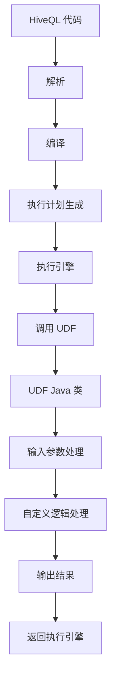

                 

 引言

在现代大数据处理领域，Apache Hive 作为一种基于 Hadoop 的数据仓库基础设施，已经成为许多企业和组织的关键技术栈之一。它提供了丰富的 SQL 功能和复杂查询操作，但是默认提供的函数库有时候并不能满足特定业务场景的需求。这就需要开发者能够自定义函数，扩展 Hive 的功能，以满足多样化的数据处理需求。

本文将深入探讨 Hive UDF（User-Defined Function）自定义函数的原理与实现，通过一个具体的代码实例，详细讲解如何从零开始开发一个 Hive UDF。我们将涵盖以下几个方面：

1. **背景介绍**：简述 Hive UDF 的概念和作用。
2. **核心概念与联系**：介绍 UDF 的基本原理，并使用 Mermaid 流程图展示其架构。
3. **核心算法原理与操作步骤**：讲解 UDF 的算法原理和实现步骤。
4. **数学模型与公式**：介绍 UDF 中的数学模型和公式推导。
5. **项目实践**：展示一个完整的 UDF 开发实例，包括环境搭建、代码实现和解读。
6. **实际应用场景**：探讨 UDF 的应用领域和未来前景。
7. **工具和资源推荐**：推荐学习资源和开发工具。
8. **总结与展望**：总结研究成果，探讨未来的发展趋势与挑战。

## 1. 背景介绍

Hive UDF（User-Defined Function）是一种在 Hive 中定义的、用于扩展 Hive SQL 功能的自定义函数。由于 Hive 的内置函数库可能无法覆盖所有的业务需求，尤其是那些需要特定业务逻辑处理的场景，UDF 提供了一种灵活的解决方案。通过编写自定义函数，开发者可以扩展 Hive 的函数库，使其能够处理更多的数据类型和复杂的业务逻辑。

UDF 的引入为 Hive 提供了以下几个优势：

- **灵活性**：允许开发者根据业务需求自定义函数，灵活应对不同的数据处理场景。
- **扩展性**：可以通过编写新的 UDF 函数来扩展 Hive 的功能，无需更改现有的系统架构。
- **多样化**：支持各种数据类型和操作，满足多样化的数据处理需求。

然而，UDF 也有一些局限性，例如执行效率可能不如内置函数高，且编写和调试 UDF 需要一定的编程技能。因此，在考虑使用 UDF 时，需要权衡其优缺点，根据具体场景做出决策。

## 2. 核心概念与联系

### 2.1. UDF 基本原理

Hive UDF 是通过 Java 语言编写的外部函数，它接收输入参数，进行自定义逻辑处理，并返回输出结果。UDF 的实现通常包含以下步骤：

1. **定义函数**：编写 Java 类，实现 `org.apache.hadoop.hive.ql.exec.UDF` 接口。
2. **函数签名**：定义函数的输入参数类型和返回值类型。
3. **逻辑处理**：在 `execute` 方法中实现自定义逻辑处理。
4. **编译打包**：将 Java 类编译成 JAR 包，并将其添加到 Hive 的类路径中。

### 2.2. UDF 架构

以下是 UDF 的架构示意图，使用 Mermaid 流程图展示其内部流程：



### 2.3. UDF 与 Hive 的关系

UDF 是 Hive 生态系统的一部分，与 Hive 的关系可以概括为：

- **依赖性**：UDF 需要依赖 Hive 的运行环境，并遵循 Hive 的接口规范。
- **扩展性**：通过 UDF，开发者可以扩展 Hive 的功能，使其能够处理特定的数据类型和操作。
- **集成性**：UDF 可以与 Hive 的内置函数和 SQL 语句无缝集成，提高数据处理能力。

## 3. 核心算法原理与具体操作步骤

### 3.1. 算法原理概述

Hive UDF 的核心在于自定义逻辑处理，即通过 Java 编程实现特定的业务逻辑。算法原理可以概括为以下几个步骤：

1. **接收输入参数**：UDF 在执行时接收输入参数，这些参数可以是各种数据类型，如字符串、数字、布尔值等。
2. **逻辑处理**：在 Java 类的 `execute` 方法中实现自定义逻辑处理，根据业务需求进行计算或转换。
3. **返回结果**：处理完毕后，UDF 返回处理结果，可以是各种数据类型。

### 3.2. 算法步骤详解

以下是实现一个简单的 Hive UDF 的步骤：

#### 3.2.1. 定义函数签名

首先，需要定义 UDF 的函数签名，包括输入参数类型和返回值类型。例如，一个简单的字符串转换函数可以定义如下：

```java
public class StringTransformer extends UDF {
    public String evaluate(String input) {
        // 自定义逻辑处理
        return input.toUpperCase();
    }
}
```

#### 3.2.2. 实现自定义逻辑

在 `evaluate` 方法中实现自定义逻辑处理。这里以字符串转换函数为例，将输入字符串转换为大写形式：

```java
public String evaluate(String input) {
    if (input == null) {
        return null;
    }
    return input.toUpperCase();
}
```

#### 3.2.3. 编译打包

将 Java 类编译成 JAR 包，并将其添加到 Hive 的类路径中。具体步骤如下：

1. 编写 Java 类。
2. 使用 `mvn package` 命令编译成 JAR 包。
3. 将生成的 JAR 包添加到 Hive 的类路径中，例如通过 `add jar` 命令。

#### 3.2.4. 使用 UDF

在 Hive SQL 中使用自定义的 UDF，例如：

```sql
SELECT StringTransformer(name) FROM employees;
```

这里，`StringTransformer` 是自定义的 UDF 函数，`name` 是输入参数。

### 3.3. 算法优缺点

#### 优点

- **灵活性**：允许自定义逻辑处理，满足多样化业务需求。
- **扩展性**：可以扩展 Hive 的功能，提高数据处理能力。
- **集成性**：可以与 Hive 的内置函数和 SQL 语句无缝集成。

#### 缺点

- **性能影响**：与内置函数相比，UDF 的执行效率可能较低。
- **开发成本**：编写和调试 UDF 需要一定的编程技能。

### 3.4. 算法应用领域

Hive UDF 可以广泛应用于各种数据处理场景，包括但不限于：

- **文本处理**：自定义文本转换、提取、分析等操作。
- **数据验证**：自定义数据校验、格式转换等操作。
- **业务逻辑**：自定义业务规则、计算模型等操作。

## 4. 数学模型和公式

在 UDF 的实现过程中，可能涉及到各种数学模型和公式。以下是一个简单的例子：

### 4.1. 数学模型构建

假设我们需要实现一个函数，计算两个数字的平均值。数学模型可以构建如下：

- 输入：两个数字 `a` 和 `b`。
- 返回：两个数字的平均值 `(a + b) / 2`。

### 4.2. 公式推导过程

平均值的计算公式非常直观，可以直接从数学定义推导得出：

- 平均值 = (总和) / (数量)
- 对于两个数字的平均值，总和 = a + b，数量 = 2

因此，平均值 = (a + b) / 2。

### 4.3. 案例分析与讲解

以 Python 为例，实现一个计算两个数字平均值的 UDF：

```python
from org.apache.hadoop.hive.ql.exec.UDF import UDF

class AverageUDF(UDF):
    def evaluate(self, a, b):
        if a is None or b is None:
            return None
        return (a + b) / 2.0

# 使用 Hive SQL 调用 AverageUDF
SELECT AverageUDF(a, b) FROM numbers;
```

在这个例子中，`AverageUDF` 类实现了 `evaluate` 方法，用于计算两个数字的平均值。在 Hive SQL 中，通过 `AverageUDF(a, b)` 调用自定义函数。

## 5. 项目实践：代码实例和详细解释说明

### 5.1. 开发环境搭建

在开始编写 UDF 之前，需要搭建开发环境。以下是搭建 Hive UDF 开发环境的步骤：

1. **安装 Java 开发工具包**：确保已安装 Java 开发工具包（JDK），版本建议为 1.8 或更高。
2. **安装 Maven**：安装 Maven，用于编译和打包 Java 项目。
3. **安装 Hive**：确保已经安装了 Hive，并启动了 Hive 的 metastore 和 HiveServer2。
4. **配置 Hive**：在 Hive 的 `hive-env.sh` 文件中配置 Java Home 和其他环境变量。

### 5.2. 源代码详细实现

以下是一个简单的 UDF 代码实例，实现一个将字符串转换为 HTML 标签的函数：

```java
import org.apache.hadoop.hive.ql.exec.UDF;
import org.apache.hadoop.hive.ql.udf.UDFType;
import org.apache.hadoop.hive.ql.exec.Description;
import org.apache.hadoop.io.Text;

@Description(name = "string_to_html", value = "_FUNC_(str) - Returns the given string wrapped in an HTML tag.")
@UDFType(deterministic = true, stateful = false)
public class StringToHtmlUDF extends UDF {
    public Text evaluate(Text str) {
        if (str == null) {
            return null;
        }
        return new Text("<html>" + str.toString() + "</html>");
    }
}
```

在这个例子中，`StringToHtmlUDF` 类实现了 `evaluate` 方法，将输入字符串 `str` 用 HTML 标签 `<html>` 和 `</html>` 包围起来。

### 5.3. 代码解读与分析

#### 类定义

`@Description` 注解用于提供 UDF 的描述信息，包括名称和功能描述。

`@UDFType` 注解用于指定 UDF 的类型，这里设置为 `deterministic` 和 `stateful`，表示该函数是确定性的，并且不需要保存状态。

#### 方法实现

`evaluate` 方法是 UDF 的核心，接收输入参数 `str`，并返回处理后的结果。

- **参数处理**：检查输入参数 `str` 是否为空，如果是，则返回 `null`。
- **逻辑处理**：将输入字符串 `str` 用 HTML 标签 `<html>` 和 `</html>` 包围起来，返回新的字符串。

### 5.4. 运行结果展示

在 Hive 中运行以下 SQL 语句，调用自定义的 `StringToHtmlUDF` 函数：

```sql
SELECT StringToHtmlUDF(name) FROM employees;
```

运行结果将返回一个包含 HTML 标签的字符串，例如：

```
<html>John Doe</html>
```

## 6. 实际应用场景

Hive UDF 在大数据处理领域有着广泛的应用，以下是一些典型的实际应用场景：

1. **数据清洗和转换**：通过自定义 UDF，可以实现复杂的数据清洗和转换操作，如日期格式转换、字符串分割、正则表达式匹配等。
2. **业务规则计算**：自定义 UDF 可以实现业务规则的计算，如财务报表计算、用户行为分析、营销活动计算等。
3. **文本处理和分析**：自定义 UDF 可以处理和解析文本数据，如提取关键词、分词、文本分类等。
4. **数据校验和验证**：自定义 UDF 可以实现数据校验和验证操作，如电子邮件格式验证、手机号码验证等。
5. **数据可视化**：通过自定义 UDF，可以将数据处理结果转换为可视化数据，如图表、地图等。

## 7. 工具和资源推荐

### 7.1. 学习资源推荐

- **《Hive 实战》**：深入讲解 Hive 的原理和使用方法，适合初学者和进阶者。
- **《大数据技术导论》**：涵盖大数据处理的基本概念和技术，包括 Hive 的使用。
- **Apache Hive 官方文档**：了解 Hive 的最新功能和最佳实践。

### 7.2. 开发工具推荐

- **IntelliJ IDEA**：优秀的 Java 开发工具，支持 Maven 和 Hive 开发。
- **Eclipse**：功能强大的 Java 开发环境，适合编写和调试 UDF。

### 7.3. 相关论文推荐

- **"Hive on Spark: A Fast and Scalable Data Warehouse Solution"**：介绍 Hive on Spark 的实现和性能优化。
- **"User-Defined Functions in Hive"**：详细讨论 Hive UDF 的设计原理和实现方法。
- **"HiveSQL: A Query Language for Large Scale Data Warehouse"**：探讨 HiveSQL 的设计和优化。

## 8. 总结与展望

### 8.1. 研究成果总结

本文深入探讨了 Hive UDF 自定义函数的原理与实现，包括核心概念、算法原理、数学模型和项目实践。通过一个简单的字符串转换 UDF 代码实例，详细讲解了 UDF 的开发过程和运行结果。

### 8.2. 未来发展趋势

随着大数据处理技术的不断发展，Hive UDF 的应用前景十分广阔。未来可能的发展趋势包括：

- **性能优化**：通过改进 UDF 的实现，提高执行效率。
- **功能扩展**：增加更多的内置函数和自定义函数，满足多样化的数据处理需求。
- **跨平台支持**：支持更多的编程语言和数据类型，提高 UDF 的通用性。

### 8.3. 面临的挑战

尽管 Hive UDF 提供了强大的扩展能力，但在实际应用中仍然面临一些挑战：

- **开发成本**：编写和调试 UDF 需要一定的编程技能，对开发人员的要求较高。
- **性能问题**：与内置函数相比，UDF 的执行效率可能较低，需要优化 UDF 的实现。
- **调试难度**：UDF 的调试相对复杂，需要结合 Hive 的日志和工具进行。

### 8.4. 研究展望

未来的研究可以从以下几个方面展开：

- **性能优化**：研究 UDF 的性能瓶颈，提出优化方案，提高 UDF 的执行效率。
- **通用性提升**：研究如何通过 UDF 支持更多的编程语言和数据类型，提高其通用性。
- **易用性增强**：研究如何简化 UDF 的开发和使用过程，降低开发门槛。

通过不断的研究和改进，Hive UDF 将在未来大数据处理领域发挥更大的作用。

## 9. 附录：常见问题与解答

### 9.1. Q：如何编写 Hive UDF？

A：编写 Hive UDF 需要遵循以下步骤：

1. 定义 UDF 类，并实现 `org.apache.hadoop.hive.ql.exec.UDF` 接口。
2. 定义函数签名，包括输入参数类型和返回值类型。
3. 在 `evaluate` 方法中实现自定义逻辑处理。
4. 编译 UDF 类，生成 JAR 包。
5. 将 JAR 包添加到 Hive 的类路径中。

### 9.2. Q：如何调试 Hive UDF？

A：调试 Hive UDF 可以通过以下几种方法：

1. **日志分析**：查看 Hive 的日志文件，分析错误原因。
2. **IDE 调试**：使用开发工具（如 IntelliJ IDEA 或 Eclipse）进行本地调试。
3. **单元测试**：编写单元测试，测试 UDF 的功能是否符合预期。

### 9.3. Q：如何提高 Hive UDF 的执行效率？

A：提高 Hive UDF 的执行效率可以从以下几个方面入手：

1. **优化算法**：优化 UDF 中的算法实现，减少计算复杂度。
2. **数据缓存**：合理使用数据缓存，减少重复计算。
3. **并行处理**：利用 Hive 的并行处理能力，提高 UDF 的执行效率。
4. **代码优化**：优化 Java 代码，减少内存占用和垃圾回收。

### 9.4. Q：如何部署 Hive UDF？

A：部署 Hive UDF 可以通过以下步骤：

1. 编译 UDF 类，生成 JAR 包。
2. 将 JAR 包上传到 Hive 集群中的 HDFS 上。
3. 在 Hive 中使用 `add jar` 命令，将 JAR 包添加到 Hive 的类路径中。
4. 在 Hive 中使用 `create function` 命令，创建 UDF 函数。

通过遵循这些步骤，可以成功部署和运行 Hive UDF。

### 9.5. Q：如何处理 Hive UDF 的异常？

A：处理 Hive UDF 的异常可以通过以下几种方式：

1. **捕获异常**：在 `evaluate` 方法中使用 `try-catch` 语句，捕获并处理异常。
2. **返回默认值**：在捕获异常后，返回默认值或 `null`，以避免中断查询执行。
3. **日志记录**：记录异常信息和错误日志，以便后续分析和调试。

通过合理处理异常，可以确保 Hive UDF 的稳定性和可靠性。

