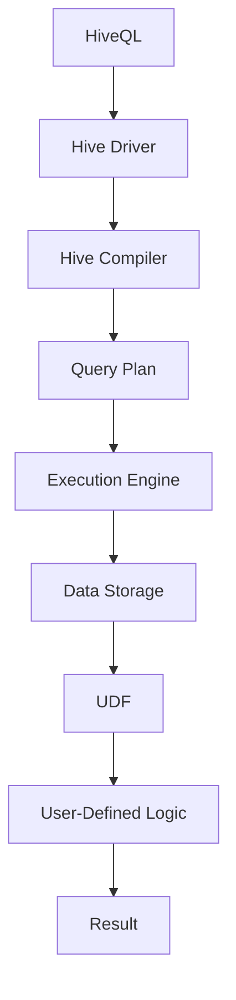

                 

 

> **关键词**：Hive，自定义函数，UDF，原理，代码实例，数据仓库，编程技术

> **摘要**：本文将深入探讨Hive中的用户定义函数（UDF）的原理和实现，通过详细的代码实例，帮助读者理解和掌握如何在Hive中开发自定义函数，以及这些函数在实际数据仓库中的应用。

## 1. 背景介绍

Hive作为Apache Software Foundation的一个开源项目，是一种建立在Hadoop之上的数据仓库工具。它提供了一种类似SQL的语言（HiveQL），用于处理和分析存储在Hadoop文件系统上的大规模数据集。然而，Hive内置的函数库虽然功能强大，但仍然有限。在实际应用中，我们可能需要一些特定的数据处理能力，这就需要通过自定义函数来实现。

用户定义函数（User-Defined Function，简称UDF）是Hive提供的一种扩展机制，允许用户根据实际需求编写自定义的函数，并将其集成到Hive中。这些函数可以是简单的数据转换，也可以是复杂的数据处理逻辑。通过UDF，用户可以大大扩展Hive的功能，以满足各种复杂的数据处理需求。

## 2. 核心概念与联系

### 2.1 UDF的定义

在Hive中，UDF是一种Java类的实现，它扩展了`org.apache.hadoop.hive.ql.udf.generic.GenericUDF`类。UDF通常包含一个`evaluate`方法，该方法接收输入参数，执行特定的数据处理逻辑，并返回结果。

### 2.2 UDF架构

下面是一个简化的UDF架构流程图：

```mermaid
graph TD
A[User Query] --> B[HiveQL Parser]
B --> C[Hive Compiler]
C --> D[Hive Runtime]
D --> E[GenericUDF]
E --> F[evaluate()]
F --> G[Result]
```

- **User Query**：用户编写的Hive查询。
- **HiveQL Parser**：将用户查询解析为抽象语法树（AST）。
- **Hive Compiler**：将AST编译为执行计划。
- **Hive Runtime**：执行编译后的执行计划。
- **GenericUDF**：实现自定义逻辑的Java类。
- **evaluate()**：执行自定义数据处理逻辑。
- **Result**：返回处理结果。

### 2.3 UDF与Hive的关系

UDF与Hive的关系可以用以下流程图表示：



- **HiveQL**：用户编写的查询语句。
- **Hive Driver**：Hive的客户端部分，负责提交查询。
- **Hive Compiler**：将查询语句编译为查询计划。
- **Query Plan**：查询计划的执行逻辑。
- **Execution Engine**：执行查询计划。
- **Data Storage**：数据存储，如HDFS。
- **UDF**：用户定义的自定义函数。
- **User-Defined Logic**：自定义处理逻辑。
- **Result**：最终的查询结果。

## 3. 核心算法原理 & 具体操作步骤

### 3.1 算法原理概述

UDF的核心在于自定义数据处理逻辑。开发者可以通过继承`GenericUDF`类，并实现`evaluate`方法来定义自己的逻辑。`evaluate`方法通常接收输入参数，通过Java语言进行数据处理，并返回结果。

### 3.2 算法步骤详解

1. **创建Java类**：首先，我们需要创建一个Java类，继承自`GenericUDF`。

2. **实现evaluate方法**：在类中实现`evaluate`方法，这是自定义处理逻辑的核心。

3. **注册函数**：在Hive中注册自定义函数，使其可以被查询语句使用。

4. **编写测试代码**：编写测试代码，验证自定义函数的正确性。

### 3.3 算法优缺点

#### 优点：

- **扩展性强**：可以灵活地添加自定义数据处理逻辑。
- **易于集成**：自定义函数可以与Hive内置函数无缝集成。
- **高效性**：对于特定数据处理任务，自定义函数可以提供更高的执行效率。

#### 缺点：

- **开发难度**：需要掌握Java编程和Hive相关的知识。
- **维护成本**：自定义函数需要定期更新和维护。

### 3.4 算法应用领域

- **数据清洗和转换**：如字符串处理、日期处理等。
- **复杂计算**：如统计计算、机器学习等。

## 4. 数学模型和公式 & 详细讲解 & 举例说明

### 4.1 数学模型构建

假设我们有一个简单的自定义函数，用于计算字符串的长度。

### 4.2 公式推导过程

假设输入字符串为`s`，我们需要计算字符串的长度。我们可以使用以下公式：

$$
\text{length}(s) = \sum_{i=1}^{n} \text{char}_i
$$

其中，$n$是字符串`s`的长度，$\text{char}_i$是字符串`s`的第$i$个字符。

### 4.3 案例分析与讲解

假设我们有一个字符串`s = "Hello World!"$，我们需要计算它的长度。

1. **输入**：$s = "Hello World!"$
2. **计算**：$n = 12$
3. **输出**：$\text{length}(s) = 12$

## 5. 项目实践：代码实例和详细解释说明

### 5.1 开发环境搭建

1. **安装Hive**：从[Hive官网](https://hive.apache.org/)下载并安装Hive。
2. **配置Hadoop**：确保Hadoop环境已经配置好，并与Hive集成。
3. **编写Java类**：创建一个Java类，继承自`GenericUDF`。

### 5.2 源代码详细实现

```java
import org.apache.hadoop.hive.ql.exec.UDF;
import org.apache.hadoop.hive.ql.exec.Description;
import org.apache.hadoop.io.Text;

@Description(name = "string_length",
value = "_FUNC_(s) - Returns the length of the string s.",
extended = "Example: > SELECT string_length('Hello World!');\n" +
        "     string_length(string_length)\n" +
        "-------------------------\n" +
        "          12\n")
public class StringLengthUDF extends UDF {
    public int evaluate(String s) {
        return s.length();
    }
}
```

### 5.3 代码解读与分析

1. **导入必需的类**：导入`UDF`和`Description`类。
2. **定义注释**：使用`@Description`注释，提供函数的描述。
3. **实现evaluate方法**：在`evaluate`方法中实现计算字符串长度的逻辑。

### 5.4 运行结果展示

1. **编译Java类**：使用`javac`命令编译Java类。
2. **添加到Hive**：将编译好的Java类添加到Hive的类路径中。
3. **测试函数**：在Hive中运行测试查询，验证函数的正确性。

```sql
SELECT string_length('Hello World!');
```

输出结果应为12。

## 6. 实际应用场景

### 6.1 数据清洗

在数据清洗过程中，自定义函数可以用于检测和修复数据中的错误。例如，我们可以编写一个自定义函数，用于检测和替换缺失的值。

### 6.2 数据转换

自定义函数可以用于数据转换，如将字符串转换为数字，或将日期格式转换为特定的格式。

### 6.3 统计计算

在统计分析中，自定义函数可以用于计算复杂的统计指标，如平均值、中位数等。

## 7. 未来应用展望

随着大数据和云计算的不断发展，自定义函数在数据仓库中的应用将越来越广泛。未来的发展趋势可能包括：

- **更加丰富的函数库**：随着社区的不断贡献，Hive的自定义函数库将越来越丰富。
- **更好的性能优化**：通过改进执行引擎和优化算法，自定义函数的性能将得到显著提升。
- **更简单的开发体验**：未来可能会出现更简单、更易于使用的自定义函数开发工具。

## 8. 总结：未来发展趋势与挑战

### 8.1 研究成果总结

本文详细介绍了Hive自定义函数（UDF）的原理和实现方法，并通过代码实例展示了如何在Hive中开发自定义函数。我们还探讨了自定义函数在实际数据仓库中的应用，并展望了未来的发展趋势。

### 8.2 未来发展趋势

随着大数据技术的不断进步，自定义函数将在数据仓库领域发挥越来越重要的作用。未来的发展趋势可能包括：

- **更加丰富的函数库**：社区将贡献更多的自定义函数，满足多样化的数据处理需求。
- **更好的性能优化**：通过改进执行引擎和算法，自定义函数的性能将得到进一步提升。
- **更简单的开发体验**：未来的开发工具可能会简化自定义函数的开发过程，降低开发难度。

### 8.3 面临的挑战

- **开发难度**：自定义函数的开发需要一定的编程知识和经验，对于新手来说可能有一定的难度。
- **维护成本**：自定义函数需要定期更新和维护，以确保其稳定性和性能。

### 8.4 研究展望

随着技术的不断发展，自定义函数在数据仓库中的应用前景非常广阔。未来的研究可以集中在以下几个方面：

- **优化执行引擎**：通过改进执行引擎，提高自定义函数的执行效率。
- **简化开发过程**：开发更简单、更易于使用的开发工具，降低自定义函数的开发难度。
- **拓展应用领域**：探索自定义函数在更广泛的应用场景中的潜力。

## 9. 附录：常见问题与解答

### 9.1 如何安装Hive？

可以从[Hive官网](https://hive.apache.org/)下载Hive，并按照官方文档进行安装。

### 9.2 如何编写自定义函数？

编写自定义函数需要以下步骤：

1. 创建一个Java类，继承自`GenericUDF`。
2. 实现一个`evaluate`方法，用于定义自定义处理逻辑。
3. 编译Java类。
4. 将编译好的Java类添加到Hive的类路径中。

### 9.3 自定义函数如何集成到Hive？

将编译好的Java类打包成JAR文件，并将其添加到Hive的类路径中。这样，自定义函数就可以在Hive中使用了。

---

**作者：禅与计算机程序设计艺术 / Zen and the Art of Computer Programming**

通过本文的详细讲解，相信读者已经对Hive自定义函数有了深入的理解。在实际应用中，自定义函数可以帮助我们实现更加复杂的数据处理任务，提高数据仓库的灵活性和效率。希望本文能对您的学习之路有所帮助。

