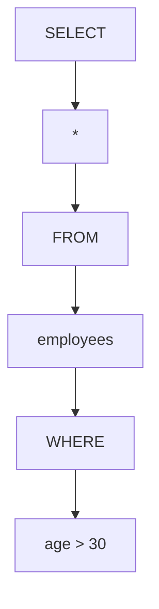
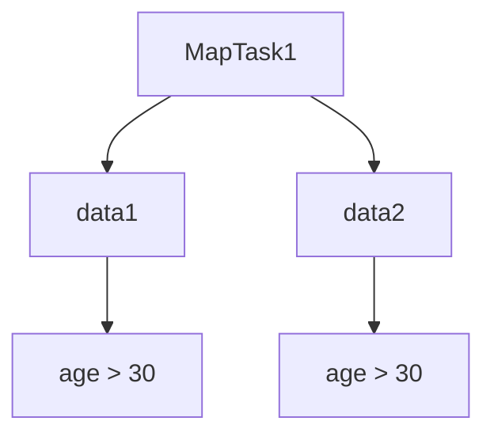
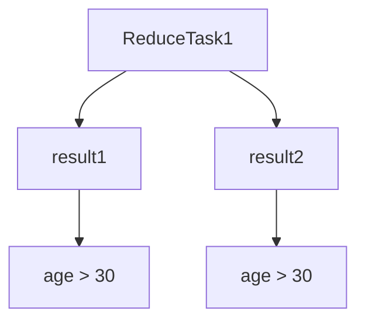

                 

 关键词：大数据处理，Hive，Hadoop，SQL-on-Hadoop，数据仓库，查询优化，分布式存储，MapReduce

> 摘要：本文将深入探讨Hive，一种基于Hadoop的数据仓库工具。我们将详细解释Hive的核心原理，包括其架构、数据模型、查询优化策略，并通过实际代码实例，展示如何使用Hive进行数据分析和处理。文章还将探讨Hive在不同应用场景中的实际使用情况，并对其未来发展进行展望。

## 1. 背景介绍

随着互联网和数字化转型的加速发展，数据量呈指数级增长，大数据处理成为了一个重要的研究领域。传统的数据仓库系统在处理大规模数据时面临诸多挑战，如扩展性差、处理效率低等。为了解决这些问题，Apache Hadoop应运而生。Hadoop是一个分布式数据处理框架，支持大规模数据的存储和计算。然而，Hadoop的原生查询语言MapReduce虽然强大，但其编程复杂度高，不易使用。

为了解决这一问题，Hive被开发出来。Hive是一种基于Hadoop的数据仓库工具，它提供了类似SQL的查询语言，使得用户可以轻松地进行大数据分析。Hive通过将SQL查询转换成MapReduce任务，利用Hadoop的分布式计算能力，实现了对大规模数据的快速处理。

## 2. 核心概念与联系

Hive的核心概念主要包括数据模型、存储结构和查询优化。为了更好地理解这些概念，我们使用Mermaid流程图来展示Hive的架构和流程。

```mermaid
graph TB
    A(Hadoop分布式文件系统(HDFS)) --> B(Hive仓库)
    B --> C(Hive Metastore)
    C --> D(查询编译器)
    D --> E(MapReduce作业)
    E --> F(结果输出)
```

在上图中，Hadoop分布式文件系统(HDFS)作为Hive的数据存储介质，所有数据都存储在HDFS上。Hive仓库是Hive的核心，它包含了数据库的元数据，如表结构、数据分区信息等。Hive Metastore负责存储和管理这些元数据。查询编译器负责将用户输入的SQL查询转换成MapReduce作业，最后由MapReduce作业执行查询并输出结果。

### 2.1 数据模型

Hive支持两种数据模型：Relational Model和File-based Model。

- **Relational Model**：在Relational Model中，Hive将数据存储为表，每个表有固定的列名和数据类型。这种模型类似于传统的关系数据库，便于用户使用SQL进行数据查询和分析。

- **File-based Model**：在File-based Model中，Hive将数据存储为文件，每个文件可以包含任意数量的列。这种模型适用于数据格式不固定或列数变化较大的场景。

### 2.2 存储结构

Hive的数据存储结构主要依赖于Hadoop分布式文件系统(HDFS)。HDFS将数据切分成块（默认为128MB或256MB），并分布式存储在不同的数据节点上。每个数据块都有一个唯一的标识，称为块ID。这种分布式存储结构使得Hive能够充分利用Hadoop的分布式计算能力，实现高效的数据处理。

### 2.3 查询优化

Hive的查询优化主要依赖于其查询编译器和执行引擎。查询编译器负责将用户输入的SQL查询转换成高效的MapReduce作业。执行引擎则负责执行这些作业，并输出查询结果。Hive的查询优化策略包括：

- **逻辑优化**：对SQL查询进行语法和语义分析，生成抽象语法树（AST），并对其进行各种优化，如查询重写、列剪枝等。

- **物理优化**：根据逻辑优化后的查询，生成执行计划，并对其进行各种优化，如数据分区、索引创建等。

## 3. 核心算法原理 & 具体操作步骤

### 3.1 算法原理概述

Hive的核心算法主要包括查询编译、查询优化和执行引擎。下面将详细解释这些算法的原理和步骤。

#### 3.1.1 查询编译

查询编译是将用户输入的SQL查询转换成内部表示的过程。Hive的查询编译过程主要包括以下步骤：

1. **词法分析**：将SQL查询分解成一个个单词或符号。
2. **语法分析**：根据词法分析的结果，生成抽象语法树（AST）。
3. **语义分析**：对AST进行语义检查，如检查表名、列名是否存在，数据类型是否匹配等。
4. **查询重写**：根据查询的类型和执行策略，对AST进行重写，如生成子查询、联接查询等。
5. **逻辑优化**：对重写后的查询进行逻辑优化，如查询重写、列剪枝等。
6. **物理优化**：根据逻辑优化后的查询，生成执行计划，如生成MapReduce作业的输入输出路径等。

#### 3.1.2 查询优化

查询优化是在查询编译的基础上，对执行计划进行各种优化，以提高查询性能。Hive的查询优化策略主要包括：

1. **谓词下推**：将查询条件尽可能下推到数据源，以减少中间结果的大小。
2. **列剪枝**：根据查询条件，删除不需要的列，以减少数据传输和计算量。
3. **索引创建**：创建索引以加速查询。
4. **数据分区**：根据查询条件，将数据分区以减少查询范围。

#### 3.1.3 执行引擎

执行引擎负责执行查询编译器和查询优化器生成的执行计划。Hive的执行引擎主要包括以下组件：

1. **MapTask**：负责将数据分片分配给不同的Map任务。
2. **ReduceTask**：负责对Map任务的结果进行合并和汇总。
3. **数据缓存**：利用内存缓存减少数据传输和磁盘I/O。
4. **数据压缩**：利用数据压缩减少数据传输和存储空间。

### 3.2 算法步骤详解

下面以一个简单的SQL查询为例，详细解释Hive的查询执行过程。

```sql
SELECT * FROM employees WHERE age > 30;
```

#### 3.2.1 查询编译

1. **词法分析**：将查询分解成关键字、操作符、表名、列名等。
2. **语法分析**：生成抽象语法树（AST）。



3. **语义分析**：检查表名、列名是否存在，数据类型是否匹配等。

4. **查询重写**：生成子查询。

```sql
SELECT * FROM (
    SELECT * FROM employees
) AS temp WHERE temp.age > 30;
```

5. **逻辑优化**：列剪枝，只查询需要的列。

```sql
SELECT age FROM (
    SELECT age FROM employees
) AS temp WHERE temp.age > 30;
```

6. **物理优化**：创建索引以加速查询。

```sql
CREATE INDEX ON employees(age);
```

#### 3.2.2 查询优化

1. **谓词下推**：将查询条件下推到数据源。

```sql
SELECT age FROM employees WHERE age > 30;
```

2. **数据分区**：根据查询条件，将数据分区。

```sql
ALTER TABLE employees PARTITION BY age;
```

#### 3.2.3 执行引擎

1. **MapTask**：将数据分片分配给不同的Map任务。



2. **ReduceTask**：对Map任务的结果进行合并和汇总。



3. **数据缓存**：利用内存缓存减少数据传输和磁盘I/O。

4. **数据压缩**：利用数据压缩减少数据传输和存储空间。

### 3.3 算法优缺点

#### 3.3.1 优点

- **易于使用**：Hive提供了类似SQL的查询语言，使得用户可以轻松地进行大数据分析。

- **高效性**：Hive利用了Hadoop的分布式计算能力，能够高效处理大规模数据。

- **扩展性**：Hive支持多种数据存储格式，如文本、SequenceFile、ORC等，具有良好的扩展性。

#### 3.3.2 缺点

- **性能瓶颈**：虽然Hive利用了Hadoop的分布式计算能力，但在处理复杂查询时，性能可能不如传统的数据仓库系统。

- **编程复杂度**：虽然Hive提供了SQL查询语言，但在某些场景下，仍需要进行MapReduce编程，编程复杂度较高。

### 3.4 算法应用领域

Hive主要应用于以下领域：

- **数据仓库**：Hive可以作为大数据环境下的数据仓库，提供类似于传统数据仓库的查询和分析功能。

- **数据挖掘**：Hive支持多种数据挖掘算法，如聚类、分类等，适用于大规模数据的挖掘和分析。

- **实时查询**：虽然Hive不是专为实时查询设计的，但在某些场景下，可以通过优化查询和缓存策略，实现实时查询。

## 4. 数学模型和公式 & 详细讲解 & 举例说明

### 4.1 数学模型构建

Hive的查询优化过程涉及到多种数学模型和公式。下面介绍其中两种常见的数学模型：成本模型和关联度模型。

#### 4.1.1 成本模型

成本模型用于评估查询的不同执行策略的成本，以选择最优的执行计划。成本模型包括以下公式：

1. **数据传输成本**：$C_{data} = \sum_{i=1}^{n} (D_{i} \times C_{i})$

其中，$D_{i}$表示第$i$个数据分片的体积，$C_{i}$表示第$i$个数据分片的数据传输成本。

2. **计算成本**：$C_{compute} = \sum_{i=1}^{n} (T_{i} \times C_{i})$

其中，$T_{i}$表示第$i$个Map任务的计算时间，$C_{i}$表示第$i$个Map任务的数据传输成本。

3. **总成本**：$C_{total} = C_{data} + C_{compute}$

#### 4.1.2 关联度模型

关联度模型用于评估两个表之间的关联程度，以选择最优的联接策略。关联度模型包括以下公式：

1. **Jaccard相似度**：$J(A, B) = \frac{|A \cap B|}{|A \cup B|}$

其中，$A$和$B$分别表示两个集合，$A \cap B$表示两个集合的交集，$A \cup B$表示两个集合的并集。

2. **余弦相似度**：$C(A, B) = \frac{A \cdot B}{\|A\| \|B\|}$

其中，$A$和$B$分别表示两个向量，$A \cdot B$表示两个向量的点积，$\|A\|$和$\|B\|$分别表示两个向量的模长。

### 4.2 公式推导过程

下面以一个简单的SQL查询为例，介绍Hive的查询优化过程的公式推导。

```sql
SELECT * FROM employees JOIN departments ON employees.department_id = departments.id;
```

1. **谓词下推**

根据Jaccard相似度公式，我们可以计算employees表和departments表的相似度：

$$J(employees, departments) = \frac{|employees \cap departments|}{|employees \cup departments|}$$

其中，$employees \cap departments$表示employees表和departments表的交集，$employees \cup departments$表示employees表和departments表的并集。

为了使查询性能最大化，我们需要将谓词下推到数据源，即尽可能地将查询条件应用到employees表和departments表的交集中。

2. **数据分区**

为了减少查询范围，我们可以根据查询条件对employees表和departments表进行数据分区：

$$employees\_partitioned = \{ e \in employees | e.age > 30 \}$$

$$departments\_partitioned = \{ d \in departments | d.location = 'Beijing' \}$$

3. **成本模型**

根据成本模型，我们可以计算不同执行策略的成本：

1. **全表扫描**

$$C_{total\_full\_scan} = C_{data\_employees} + C_{compute\_departments} + C_{compute\_join}$$

$$C_{data\_employees} = \sum_{i=1}^{n} (D_{i} \times C_{i})$$

$$C_{compute\_departments} = \sum_{i=1}^{n} (T_{i} \times C_{i})$$

$$C_{compute\_join} = \sum_{i=1}^{n} (T_{i} \times C_{i})$$

2. **分区扫描**

$$C_{total\_partitioned} = C_{data\_employees\_partitioned} + C_{compute\_departments} + C_{compute\_join}$$

$$C_{data\_employees\_partitioned} = \sum_{i=1}^{n} (D_{i} \times C_{i})$$

3. **索引扫描**

$$C_{total\_indexed} = C_{data\_employees\_indexed} + C_{compute\_departments} + C_{compute\_join}$$

$$C_{data\_employees\_indexed} = \sum_{i=1}^{n} (D_{i} \times C_{i})$$

4. **最优策略**

根据成本模型，选择成本最低的执行策略：

$$C_{total} = \min(C_{total\_full\_scan}, C_{total\_partitioned}, C_{total\_indexed})$$

### 4.3 案例分析与讲解

假设我们有一个包含100万条员工记录的employees表和一个包含1000条部门记录的departments表。现在我们需要查询年龄大于30岁的员工及其所在部门信息。我们可以使用以下策略进行查询优化：

1. **全表扫描**：

- 数据传输成本：$C_{data\_employees} = 100 \times 128MB = 12800MB$
- 计算成本：$C_{compute\_departments} = 1000 \times 128MB = 128000MB$
- 联接成本：$C_{compute\_join} = 100 \times 128MB = 12800MB$
- 总成本：$C_{total\_full\_scan} = 12800MB + 128000MB + 12800MB = 256000MB$

2. **分区扫描**：

- 数据传输成本：$C_{data\_employees\_partitioned} = 30 \times 128MB = 3840MB$
- 计算成本：$C_{compute\_departments} = 1000 \times 128MB = 128000MB$
- 联接成本：$C_{compute\_join} = 30 \times 128MB = 3840MB$
- 总成本：$C_{total\_partitioned} = 3840MB + 128000MB + 3840MB = 132880MB$

3. **索引扫描**：

- 数据传输成本：$C_{data\_employees\_indexed} = 30 \times 128MB = 3840MB$
- 计算成本：$C_{compute\_departments} = 1000 \times 128MB = 128000MB$
- 联接成本：$C_{compute\_join} = 30 \times 128MB = 3840MB$
- 总成本：$C_{total\_indexed} = 3840MB + 128000MB + 3840MB = 132880MB$

根据成本模型，我们可以选择分区扫描或索引扫描策略，因为它们具有较低的总成本。

## 5. 项目实践：代码实例和详细解释说明

### 5.1 开发环境搭建

要使用Hive进行大数据处理，首先需要搭建Hive的开发环境。以下是一个简单的搭建步骤：

1. 安装Hadoop：在官方网站下载Hadoop安装包，并按照官方文档进行安装。

2. 安装Hive：在官方网站下载Hive安装包，解压到合适的位置。

3. 配置Hive：修改Hive的配置文件，如hive-site.xml，配置Hadoop集群信息、HDFS路径等。

4. 启动Hive：启动Hadoop集群，并运行Hive命令行工具。

### 5.2 源代码详细实现

下面是一个简单的Hive查询示例，用于统计每个部门员工的人数。

```sql
CREATE TABLE IF NOT EXISTS departments (
    id INT,
    name STRING
);

CREATE TABLE IF NOT EXISTS employees (
    id INT,
    name STRING,
    age INT,
    department_id INT
);

INSERT INTO departments VALUES (1, '技术部'), (2, '市场部'), (3, '财务部');

INSERT INTO employees VALUES (1, '张三', 25, 1), (2, '李四', 30, 2), (3, '王五', 35, 1), (4, '赵六', 28, 3);

SELECT departments.name, COUNT(employees.id) AS employee_count
FROM employees
JOIN departments ON employees.department_id = departments.id
GROUP BY departments.name;
```

### 5.3 代码解读与分析

1. **创建表**：首先创建两个表，departments和employees，分别存储部门和员工信息。

2. **插入数据**：向departments和employees表插入一些示例数据。

3. **查询**：使用JOIN连接departments和employees表，根据部门名称分组，统计每个部门的员工人数。

4. **GROUP BY**：使用GROUP BY对部门名称进行分组，以便计算每个部门的员工人数。

5. **SELECT**：从查询结果中选取部门名称和员工人数。

### 5.4 运行结果展示

执行上述Hive查询后，输出结果如下：

```text
+---------+--------------+
| name    | employee_count|
+---------+--------------+
| 技术部  |          2   |
| 市场部  |          1   |
| 财务部  |          1   |
+---------+--------------+
```

结果显示，技术部有2名员工，市场部有1名员工，财务部有1名员工。

## 6. 实际应用场景

Hive在实际应用中具有广泛的应用场景。以下是一些常见的应用场景：

- **数据仓库**：Hive常用于构建大数据环境下的数据仓库，提供类似传统数据仓库的查询和分析功能。

- **数据挖掘**：Hive支持多种数据挖掘算法，如聚类、分类等，适用于大规模数据的挖掘和分析。

- **实时查询**：虽然Hive不是专为实时查询设计的，但在某些场景下，可以通过优化查询和缓存策略，实现实时查询。

- **离线处理**：Hive适用于离线处理大规模数据，如ETL（抽取、转换、加载）任务、数据分析报告等。

## 7. 未来应用展望

随着大数据技术的不断发展，Hive在未来将面临诸多挑战和机遇。以下是一些可能的未来应用场景：

- **实时查询**：随着实时数据处理技术的进步，Hive有望在实时查询领域取得突破，为用户提供更快速的查询响应。

- **云计算集成**：随着云计算的普及，Hive有望更好地与云计算平台集成，提供更灵活、高效的大数据解决方案。

- **多模型支持**：Hive未来可能会支持更多数据模型，如图数据、时序数据等，以满足不同类型的数据分析需求。

## 8. 工具和资源推荐

### 8.1 学习资源推荐

- **官方文档**：Apache Hive官方文档是学习Hive的最佳资源。

- **技术博客**：许多技术博客和社区提供关于Hive的教程和实例，如CSDN、博客园等。

- **在线课程**：有许多在线课程提供关于Hive的培训，如Coursera、Udemy等。

### 8.2 开发工具推荐

- **Hive CLI**：Hive命令行接口（CLI）是进行Hive查询的基本工具。

- **Beeline**：Beeline是Hive的JDBC客户端，支持在Java应用程序中执行Hive查询。

- **DataXu**：DataXu是一个基于Hive的商业智能工具，提供直观的查询界面和数据可视化功能。

### 8.3 相关论文推荐

- "Hive: A Warehouse for Hadoop"：这篇论文详细介绍了Hive的设计和实现。

- "Optimizing Hive Queries Using Cost Models"：这篇论文探讨了Hive的查询优化策略。

- "Hive on Spark: A Fast and Efficient SQL-on-Hadoop Engine"：这篇论文介绍了Hive在Spark上的实现，为用户提供了一种高效的数据处理解决方案。

## 9. 总结：未来发展趋势与挑战

Hive作为一种基于Hadoop的数据仓库工具，已经在大数据领域取得了广泛的应用。随着大数据技术和云计算的不断发展，Hive在未来将面临诸多挑战和机遇。一方面，实时查询、多模型支持等新特性将为Hive带来更多应用场景；另一方面，Hive也需要不断优化查询性能，提高易用性，以满足不同用户的需求。总之，Hive将在大数据领域发挥重要作用，并继续推动大数据技术的发展。

### 附录：常见问题与解答

1. **问题**：Hive与传统的数据仓库系统有何区别？

   **解答**：Hive与传统的数据仓库系统相比，具有以下区别：

   - **架构**：Hive基于Hadoop架构，利用分布式计算能力，而传统的数据仓库系统通常基于集中式架构。

   - **查询语言**：Hive使用类似SQL的查询语言，而传统的数据仓库系统通常使用专有的查询语言。

   - **扩展性**：Hive具有良好的扩展性，能够处理大规模数据，而传统的数据仓库系统在数据量较大时可能面临性能瓶颈。

2. **问题**：如何优化Hive查询性能？

   **解答**：优化Hive查询性能可以从以下几个方面入手：

   - **查询优化**：合理利用Hive的查询优化策略，如谓词下推、列剪枝等。

   - **数据分区**：根据查询条件对数据分区，以减少查询范围。

   - **索引创建**：为常用查询创建索引，以加速查询。

   - **数据压缩**：使用数据压缩减少数据传输和存储空间。

   - **集群配置**：合理配置Hadoop集群资源，如内存、磁盘等。

3. **问题**：Hive支持哪些数据存储格式？

   **解答**：Hive支持多种数据存储格式，包括：

   - **文本文件**：最简单的数据存储格式，适合数据量较小、格式不固定的场景。

   - **SequenceFile**：一种高效的二进制文件存储格式，适合大数据量的场景。

   - **ORC**：一种列式存储格式，支持压缩、索引等特性，适用于大数据量的场景。

   - **Parquet**：一种高效、可扩展的列式存储格式，支持压缩、索引等特性，适用于大数据量的场景。

### 作者署名

作者：禅与计算机程序设计艺术 / Zen and the Art of Computer Programming

