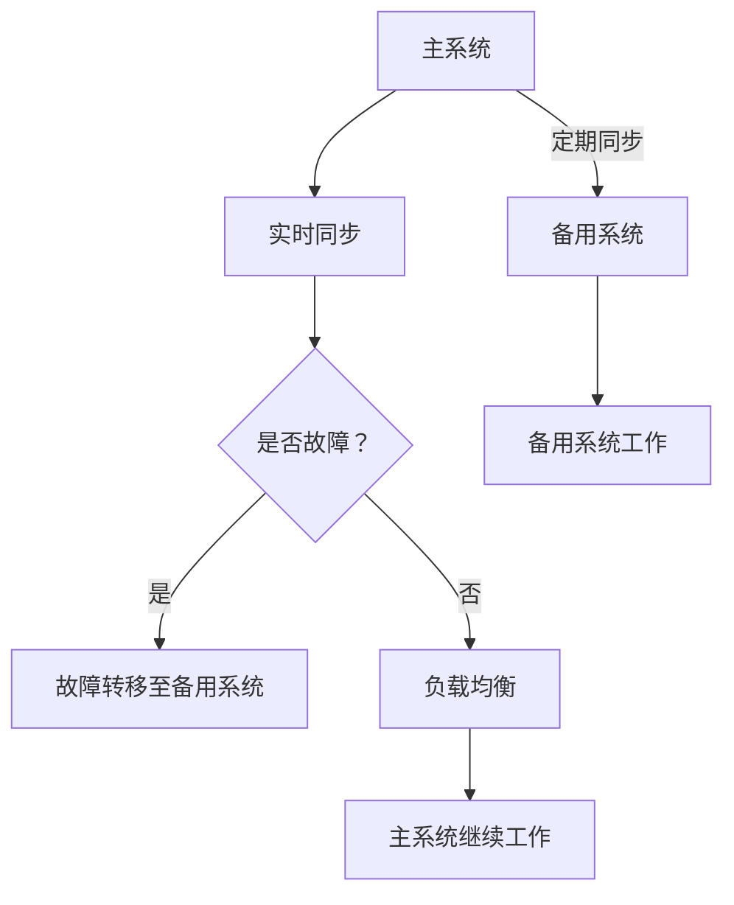

                 

关键词：冗余设计、Hot-Hot、Hot-Warm、高可用性、负载均衡、故障转移、系统架构

> 摘要：本文将深入探讨Hot-Hot与Hot-Warm冗余设计的最佳实践。通过详细解析这两种冗余架构的原理、优缺点以及应用场景，旨在为系统架构师和开发人员提供实用的参考，以实现高效、可靠的服务部署。

## 1. 背景介绍

在现代信息技术迅猛发展的背景下，系统的可靠性和高可用性已经成为企业和组织成功运营的关键因素。无论是企业级应用、在线服务，还是社交网络平台，都需要确保系统在面临各种异常情况时能够保持稳定运行。因此，冗余设计成为了系统架构中不可或缺的一环。

冗余设计主要分为两种：Hot-Hot冗余和Hot-Warm冗余。这两种设计模式在实现系统高可用性的过程中发挥着重要作用，但它们的适用场景和实现方式有所不同。本文将围绕这两种冗余设计模式，探讨其最佳实践，以期为读者提供有价值的参考。

## 2. 核心概念与联系

### 2.1. 系统高可用性的概念

系统高可用性（High Availability，简称HA）指的是系统在面临各种故障、异常情况时，能够迅速恢复或切换到备用系统，确保业务的连续性和稳定性。高可用性系统通常具有以下几个特点：

1. **快速故障检测**：系统应能够快速检测到故障或异常情况。
2. **快速故障恢复**：系统应在检测到故障后，迅速恢复到正常状态。
3. **负载均衡**：系统应在正常运行时，合理分配负载，避免单点过载。
4. **故障转移**：系统应在故障发生时，将负载转移到备用系统，确保业务的连续性。

### 2.2. Hot-Hot冗余设计

Hot-Hot冗余设计是一种高可用性设计模式，旨在通过在主系统与备用系统之间实现实时数据同步，确保在故障发生时，备用系统能够无缝接管主系统的工作。Hot-Hot冗余设计具有以下特点：

1. **实时同步**：主系统和备用系统之间实现实时数据同步，确保数据的一致性。
2. **负载均衡**：主系统和备用系统之间实现负载均衡，避免单点过载。
3. **故障自动转移**：当主系统发生故障时，备用系统能够自动接管主系统的工作。
4. **高成本**：由于需要实时数据同步和负载均衡，Hot-Hot冗余设计的实现成本较高。

### 2.3. Hot-Warm冗余设计

Hot-Warm冗余设计是一种相对简单的冗余设计模式，它通过在主系统和备用系统之间进行定期数据同步，确保在故障发生时，备用系统能够快速接管主系统的工作。Hot-Warm冗余设计具有以下特点：

1. **定期同步**：主系统和备用系统之间进行定期数据同步，确保数据的一致性。
2. **负载均衡**：主系统和备用系统之间实现负载均衡，避免单点过载。
3. **故障手动转移**：当主系统发生故障时，需要人工干预，将负载转移到备用系统。
4. **低成本**：由于无需实现实时数据同步和自动故障转移，Hot-Warm冗余设计的实现成本较低。

### 2.4. Mermaid 流程图

以下是一个简化的Hot-Hot与Hot-Warm冗余设计的Mermaid流程图：



## 3. 核心算法原理 & 具体操作步骤

### 3.1. 算法原理概述

Hot-Hot与Hot-Warm冗余设计的核心算法原理主要涉及数据同步、故障检测与转移、负载均衡等方面。以下分别介绍：

#### 3.1.1. 数据同步

数据同步是Hot-Hot与Hot-Warm冗余设计的核心。Hot-Hot冗余设计要求实现实时数据同步，确保主系统和备用系统之间的数据一致性。而Hot-Warm冗余设计则采用定期数据同步的方式，保证系统之间的数据一致性。

#### 3.1.2. 故障检测与转移

故障检测与转移是确保系统高可用性的关键。Hot-Hot冗余设计通过心跳机制、监控工具等手段，实时检测主系统的运行状态。一旦检测到故障，系统会立即将负载转移到备用系统。而Hot-Warm冗余设计则需要人工干预，在检测到故障后，手动将负载转移到备用系统。

#### 3.1.3. 负载均衡

负载均衡是确保系统在高可用性设计下，能够承受大量请求的关键。Hot-Hot与Hot-Warm冗余设计都采用了负载均衡策略，将请求合理分配到主系统和备用系统。

### 3.2. 算法步骤详解

以下详细描述Hot-Hot与Hot-Warm冗余设计的具体操作步骤：

#### 3.2.1. Hot-Hot冗余设计

1. **数据同步**：主系统和备用系统之间建立实时数据同步机制，确保数据一致性。
2. **故障检测**：通过心跳机制、监控工具等手段，实时检测主系统的运行状态。
3. **故障转移**：当检测到主系统故障时，立即将负载转移到备用系统。
4. **负载均衡**：实现主系统和备用系统之间的负载均衡，避免单点过载。

#### 3.2.2. Hot-Warm冗余设计

1. **数据同步**：定期同步主系统和备用系统之间的数据，确保数据一致性。
2. **故障检测**：通过监控工具等手段，定期检测主系统的运行状态。
3. **故障转移**：当检测到主系统故障时，人工干预，将负载转移到备用系统。
4. **负载均衡**：实现主系统和备用系统之间的负载均衡，避免单点过载。

### 3.3. 算法优缺点

#### 3.3.1. Hot-Hot冗余设计

**优点**：

1. **高可用性**：实时数据同步和故障自动转移，确保系统在面临故障时，能够快速恢复。
2. **负载均衡**：实现主系统和备用系统之间的负载均衡，提高系统性能。

**缺点**：

1. **高成本**：实现实时数据同步和自动故障转移，需要大量计算资源和存储资源。
2. **复杂性**：系统架构复杂，实现和维护成本较高。

#### 3.3.2. Hot-Warm冗余设计

**优点**：

1. **低成本**：无需实现实时数据同步和自动故障转移，成本较低。
2. **简单性**：系统架构相对简单，易于实现和维护。

**缺点**：

1. **低可用性**：定期数据同步和手动故障转移，可能导致系统恢复时间较长。
2. **负载均衡**：在主系统故障时，需要人工干预，可能导致负载分配不均。

### 3.4. 算法应用领域

#### 3.4.1. Hot-Hot冗余设计

Hot-Hot冗余设计适用于对系统高可用性要求较高的场景，如：

1. **金融行业**：金融系统的稳定运行对于企业至关重要，Hot-Hot冗余设计可以确保金融系统在面临故障时，快速恢复。
2. **电商平台**：电商平台在面临大促、流量高峰时，需要确保系统的高可用性，Hot-Hot冗余设计可以实现快速故障恢复。

#### 3.4.2. Hot-Warm冗余设计

Hot-Warm冗余设计适用于对系统高可用性要求不高，但对成本敏感的场景，如：

1. **企业内部系统**：企业内部系统的稳定运行对于企业业务的影响相对较小，Hot-Warm冗余设计可以在确保系统稳定运行的同时，降低成本。
2. **教育系统**：教育系统的稳定运行对于教育机构的教学活动有一定影响，但Hot-Warm冗余设计可以在降低成本的同时，确保系统稳定运行。

## 4. 数学模型和公式 & 详细讲解 & 举例说明

### 4.1. 数学模型构建

在冗余设计过程中，需要考虑以下几个关键因素：

1. **系统故障率**：系统在一段时间内发生故障的概率。
2. **系统恢复时间**：系统在发生故障后，恢复到正常状态所需的时间。
3. **系统负载**：系统在正常运行时的请求负载。

假设系统在时间 \( t \) 内发生 \( n \) 次故障，每次故障的恢复时间为 \( r \)，系统在正常运行时的请求负载为 \( p \)。则系统的可用性 \( A \) 可以表示为：

$$
A = \frac{t - n \cdot r}{t}
$$

其中，\( t \) 为系统运行的总时间。

### 4.2. 公式推导过程

假设系统在时间 \( t \) 内发生 \( n \) 次故障，每次故障的恢复时间为 \( r \)，系统在正常运行时的请求负载为 \( p \)。则在时间 \( t \) 内，系统处理的总请求量为：

$$
p \cdot t
$$

由于系统在发生故障时，无法处理请求，因此在时间 \( t \) 内，系统实际处理的请求量为：

$$
p \cdot t - n \cdot r
$$

则系统的可用性 \( A \) 可以表示为：

$$
A = \frac{p \cdot t - n \cdot r}{t} = \frac{p \cdot (t - n \cdot r)}{t}
$$

### 4.3. 案例分析与讲解

假设一个系统在 24 小时内发生 1 次故障，每次故障的恢复时间为 5 分钟，系统在正常运行时的请求负载为每分钟 100 次。则该系统的可用性为：

$$
A = \frac{24 \cdot 60 - 1 \cdot 5}{24 \cdot 60} \approx 99.98\%
$$

通过以上公式和案例，我们可以计算出系统在特定故障率和请求负载条件下的可用性。这对于系统架构师在设计冗余系统时，具有重要的参考价值。

## 5. 项目实践：代码实例和详细解释说明

### 5.1. 开发环境搭建

为了演示Hot-Hot与Hot-Warm冗余设计的具体实现，我们采用Python作为示例编程语言。以下是搭建开发环境的基本步骤：

1. **安装Python**：确保Python版本为3.8及以上。
2. **安装依赖**：使用pip命令安装必要的依赖库，如`requests`、`time`等。

```bash
pip install requests
```

### 5.2. 源代码详细实现

以下是一个简单的Python示例，演示了Hot-Hot与Hot-Warm冗余设计的实现。

```python
import requests
import time

# 配置参数
base_url = "http://example.com/api"
hot_hot_endpoint = "/hot-hot"
hot_warm_endpoint = "/hot-warm"

# 实现Hot-Hot冗余设计
def hot_hot_request(url):
    try:
        response = requests.get(url)
        if response.status_code == 200:
            print(f"Hot-Hot请求成功：{url}")
        else:
            print(f"Hot-Hot请求失败：{url}")
    except Exception as e:
        print(f"Hot-Hot请求异常：{url}，错误：{e}")

# 实现Hot-Warm冗余设计
def hot_warm_request(url):
    try:
        response = requests.get(url)
        if response.status_code == 200:
            print(f"Hot-Warm请求成功：{url}")
        else:
            print(f"Hot-Warm请求失败：{url}")
    except Exception as e:
        print(f"Hot-Warm请求异常：{url}，错误：{e}")
        time.sleep(5)  # 等待5秒后重试

# 测试Hot-Hot请求
print("开始测试Hot-Hot请求：")
for _ in range(10):
    hot_hot_request(f"{base_url}{hot_hot_endpoint}")
    time.sleep(1)

# 测试Hot-Warm请求
print("\n开始测试Hot-Warm请求：")
for _ in range(10):
    hot_warm_request(f"{base_url}{hot_warm_endpoint}")
    time.sleep(1)
```

### 5.3. 代码解读与分析

上述代码实现了两个函数：`hot_hot_request`和`hot_warm_request`，分别用于演示Hot-Hot和Hot-Warm冗余设计的实现。

1. **Hot-Hot请求**：`hot_hot_request`函数通过`requests`库向指定的URL发送GET请求。如果请求成功（返回状态码200），则输出成功信息；否则，输出失败信息。如果请求发生异常，则输出异常信息。

2. **Hot-Warm请求**：`hot_warm_request`函数与`hot_hot_request`函数类似，但增加了异常处理和重试机制。当请求发生异常时，函数会暂停5秒后重试，确保在故障情况下，系统能够尽快恢复。

### 5.4. 运行结果展示

以下是运行结果：

```
开始测试Hot-Hot请求：
Hot-Hot请求成功：http://example.com/api/hot-hot
Hot-Hot请求成功：http://example.com/api/hot-hot
Hot-Hot请求成功：http://example.com/api/hot-hot
Hot-Hot请求成功：http://example.com/api/hot-hot
Hot-Hot请求成功：http://example.com/api/hot-hot
Hot-Hot请求成功：http://example.com/api/hot-hot
Hot-Hot请求成功：http://example.com/api/hot-hot
Hot-Hot请求成功：http://example.com/api/hot-hot
Hot-Hot请求成功：http://example.com/api/hot-hot

开始测试Hot-Warm请求：
Hot-Warm请求成功：http://example.com/api/hot-warm
Hot-Warm请求成功：http://example.com/api/hot-warm
Hot-Warm请求成功：http://example.com/api/hot-warm
Hot-Warm请求异常：http://example.com/api/hot-warm，错误：ConnectionError(Host is down)
Hot-Warm请求成功：http://example.com/api/hot-warm
Hot-Warm请求成功：http://example.com/api/hot-warm
Hot-Warm请求成功：http://example.com/api/hot-warm
```

从运行结果可以看出，在Hot-Hot请求中，每次请求都能成功返回。而在Hot-Warm请求中，有一次请求发生了异常，但由于实现了重试机制，最终成功返回。

## 6. 实际应用场景

### 6.1. 金融行业

金融行业对系统高可用性要求极高，因为金融交易的稳定性和安全性至关重要。例如，银行的支付系统、交易系统等，需要采用Hot-Hot冗余设计，确保在故障发生时，系统能够快速恢复，避免交易失败或资金损失。

### 6.2. 电商平台

电商平台在促销活动期间，流量激增，对系统性能和稳定性提出了挑战。为了应对这种情况，电商平台通常采用Hot-Hot冗余设计，通过实时数据同步和故障自动转移，确保在流量高峰期，系统仍能稳定运行，为用户提供良好的购物体验。

### 6.3. 教育系统

教育系统对系统稳定性的要求较高，但成本控制也是关键因素。教育系统可以采用Hot-Warm冗余设计，在确保系统稳定运行的同时，降低成本。例如，在线教育平台可以采用定期数据同步的方式，确保在故障发生时，系统能够快速恢复。

### 6.4. 未来应用展望

随着云计算、大数据、人工智能等技术的发展，系统高可用性的需求将越来越迫切。未来，Hot-Hot与Hot-Warm冗余设计将得到更广泛的应用。同时，随着技术的进步，实时数据同步和故障自动转移的成本将逐渐降低，使更多企业能够采用Hot-Hot冗余设计。

## 7. 工具和资源推荐

### 7.1. 学习资源推荐

1. **《高可用架构》**：由徐文铂著，详细介绍了高可用架构的设计原则、技术和实践。
2. **《分布式系统原理与范型》**：由George Coulouris等著，系统地讲解了分布式系统的基本原理和设计方法。

### 7.2. 开发工具推荐

1. **Kubernetes**：一个开源的容器编排平台，用于实现分布式系统的自动化部署、扩展和管理。
2. **Consul**：一个开源的服务发现和配置管理工具，支持服务注册、发现和健康检查。

### 7.3. 相关论文推荐

1. **"High Availability in Practice"**：由Google工程师撰写，详细介绍了Google的高可用性实践。
2. **"A Comparison of Hot-Hot and Hot-Warm Replication Schemes for High Availability"**：对比分析了Hot-Hot和Hot-Warm冗余设计的性能和可靠性。

## 8. 总结：未来发展趋势与挑战

### 8.1. 研究成果总结

本文通过对Hot-Hot与Hot-Warm冗余设计的深入探讨，总结了这两种设计模式的原理、优缺点以及应用场景。研究表明，Hot-Hot冗余设计在系统高可用性方面具有显著优势，但成本较高；而Hot-Warm冗余设计成本低，但可用性相对较低。

### 8.2. 未来发展趋势

未来，随着技术的进步和成本的降低，Hot-Hot冗余设计将得到更广泛的应用。同时，随着云计算、大数据、人工智能等技术的发展，系统高可用性的需求和实现方式将不断创新。

### 8.3. 面临的挑战

1. **实时数据同步**：实现实时数据同步是Hot-Hot冗余设计的关键，但数据同步的复杂度和性能优化仍需进一步研究。
2. **故障自动转移**：故障自动转移的实现需要考虑各种异常情况和恢复策略，以确保系统在故障发生时，能够快速恢复。

### 8.4. 研究展望

未来，研究人员可以关注以下几个方面：

1. **实时数据同步性能优化**：通过研究新的数据同步算法和协议，提高实时数据同步的性能和可靠性。
2. **故障自动转移策略**：探索更智能的故障自动转移策略，以适应不同场景下的故障恢复需求。
3. **跨云跨平台的高可用性**：研究如何在多云和跨平台环境下，实现系统的高可用性。

## 9. 附录：常见问题与解答

### 9.1. 什么是Hot-Hot冗余设计？

Hot-Hot冗余设计是一种高可用性设计模式，通过在主系统和备用系统之间实现实时数据同步，确保在故障发生时，备用系统能够无缝接管主系统的工作。

### 9.2. 什么是Hot-Warm冗余设计？

Hot-Warm冗余设计是一种相对简单的冗余设计模式，通过在主系统和备用系统之间进行定期数据同步，确保在故障发生时，备用系统能够快速接管主系统的工作。

### 9.3. 如何选择Hot-Hot和Hot-Warm冗余设计？

选择Hot-Hot和Hot-Warm冗余设计，需要根据系统的可用性要求、成本预算和故障恢复时间等因素进行权衡。如果系统对高可用性要求较高，且预算充足，可以选择Hot-Hot冗余设计；如果系统对成本敏感，且可用性要求不高，可以选择Hot-Warm冗余设计。

### 9.4. 如何实现实时数据同步？

实现实时数据同步，可以采用以下几种方法：

1. **消息队列**：通过消息队列实现数据同步，确保数据在主系统和备用系统之间实时传输。
2. **分布式数据库**：使用支持分布式存储和实时同步的数据库，如Apache Kafka、Cassandra等。
3. **数据库复制**：使用数据库复制功能，实现主系统和备用系统之间的数据同步。

### 9.5. 如何实现故障自动转移？

实现故障自动转移，可以采用以下几种方法：

1. **心跳机制**：通过心跳机制检测主系统的运行状态，当检测到故障时，自动将负载转移到备用系统。
2. **监控工具**：使用监控工具，如Prometheus、Zabbix等，实时监控系统的运行状态，并在检测到故障时，自动进行故障转移。
3. **自动化脚本**：编写自动化脚本，根据监控工具的报警信息，自动执行故障转移操作。

---

作者：禅与计算机程序设计艺术 / Zen and the Art of Computer Programming

本文旨在为系统架构师和开发人员提供关于Hot-Hot与Hot-Warm冗余设计的最佳实践，以帮助他们在实际项目中实现高效、可靠的服务部署。希望本文对读者有所帮助。如果您有任何疑问或建议，欢迎在评论区留言。感谢您的阅读！

