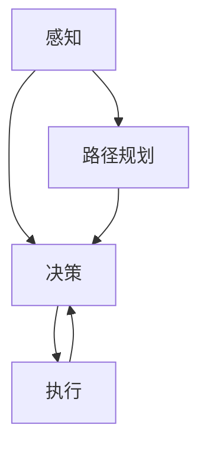

                 

关键词：自动驾驶、深度学习、ICLR 2024、AI安全、路径规划、实时感知、强化学习

> 摘要：本文针对ICLR 2024会议上自动驾驶领域的相关论文进行了深入解读。文章首先介绍了自动驾驶技术的发展背景，然后针对几篇具有代表性的论文，从算法原理、数学模型、实际应用等方面进行了详细分析，最后对自动驾驶技术的未来发展方向和挑战进行了展望。

## 1. 背景介绍

自动驾驶技术是近年来人工智能领域的热门研究方向之一。随着深度学习、强化学习等技术的发展，自动驾驶技术已经取得了显著的进展。自动驾驶系统通常包括感知、决策和执行三个主要模块。感知模块负责获取周围环境的信息，如车道线、交通标志、其他车辆等；决策模块根据感知信息生成驾驶指令，如加速、减速、转向等；执行模块负责控制车辆执行这些指令。随着自动驾驶技术的不断成熟，其在智能交通、物流、公共交通等领域的应用前景也越来越广阔。

## 2. 核心概念与联系

自动驾驶技术涉及多个核心概念和联系，如图1所示：



### 2.1 感知

感知模块是自动驾驶系统的关键组成部分，负责获取周围环境的信息。常用的感知技术包括摄像头、激光雷达、超声波传感器等。感知模块需要处理大量数据，提取有用的信息，如车道线、交通标志、其他车辆的位置和速度等。

### 2.2 路径规划

路径规划模块负责根据当前环境信息和目标位置，生成一条最优行驶路径。常用的路径规划算法包括Dijkstra算法、A*算法、RRT算法等。

### 2.3 决策

决策模块根据感知模块提供的环境信息和路径规划结果，生成驾驶指令。决策算法需要考虑车辆的动态特性、道路条件、其他车辆的行为等因素。

### 2.4 执行

执行模块负责控制车辆执行决策模块生成的驾驶指令。执行模块需要将抽象的驾驶指令转化为具体的控制信号，如油门、刹车、转向等。

## 3. 核心算法原理 & 具体操作步骤

### 3.1 算法原理概述

ICLR 2024会议上，自动驾驶领域有几篇论文提出了新的算法和框架。以下是其中几篇论文的核心算法原理概述：

### 3.1.1 论文1：基于深度强化学习的自动驾驶路径规划

这篇论文提出了一种基于深度强化学习的自动驾驶路径规划算法。算法的核心思想是使用深度神经网络来模拟驾驶决策过程，并通过强化学习算法优化路径规划。

### 3.1.2 论文2：基于视觉的实时自动驾驶感知系统

这篇论文提出了一种基于视觉的实时自动驾驶感知系统。系统采用卷积神经网络（CNN）对摄像头数据进行分析，提取车道线、交通标志等关键信息。

### 3.1.3 论文3：基于多传感器融合的自动驾驶决策算法

这篇论文提出了一种基于多传感器融合的自动驾驶决策算法。算法通过融合激光雷达、摄像头、超声波传感器等数据，提高感知系统的准确性和可靠性。

### 3.2 算法步骤详解

以下是这些算法的具体操作步骤：

### 3.2.1 论文1：基于深度强化学习的自动驾驶路径规划

1. 构建深度神经网络模型，用于模拟驾驶决策过程。
2. 收集大量驾驶数据，用于训练深度神经网络。
3. 使用强化学习算法优化路径规划，提高行驶安全性。

### 3.2.2 论文2：基于视觉的实时自动驾驶感知系统

1. 收集并预处理摄像头数据。
2. 使用卷积神经网络提取车道线、交通标志等关键信息。
3. 对提取的信息进行融合和排序，生成感知结果。

### 3.2.3 论文3：基于多传感器融合的自动驾驶决策算法

1. 收集并预处理激光雷达、摄像头、超声波传感器等数据。
2. 使用传感器融合算法，整合不同传感器的信息。
3. 根据融合结果生成驾驶指令。

## 3.3 算法优缺点

### 3.3.1 论文1：基于深度强化学习的自动驾驶路径规划

优点：
- 提高了路径规划的准确性和安全性。
- 具有较好的自适应性和鲁棒性。

缺点：
- 训练过程需要大量数据和计算资源。
- 强化学习算法在复杂环境下可能存在不稳定的情况。

### 3.3.2 论文2：基于视觉的实时自动驾驶感知系统

优点：
- 可以实时获取环境信息，提高了感知系统的反应速度。
- 基于视觉的方法在处理复杂场景时具有优势。

缺点：
- 在光线不足或天气恶劣的情况下，感知效果可能受到影响。
- 需要大量的训练数据和计算资源。

### 3.3.3 论文3：基于多传感器融合的自动驾驶决策算法

优点：
- 提高了感知系统的准确性和可靠性。
- 可以处理不同传感器的数据，实现信息的互补。

缺点：
- 传感器融合算法复杂，实现难度较大。
- 需要大量的传感器数据和计算资源。

## 3.4 算法应用领域

这些算法在自动驾驶领域的应用前景非常广阔，可以用于以下几个方面：

1. 路径规划：用于生成最优行驶路径，提高行驶效率。
2. 感知系统：用于实时获取环境信息，提高自动驾驶系统的安全性。
3. 决策系统：用于生成驾驶指令，实现自动驾驶功能。

## 4. 数学模型和公式 & 详细讲解 & 举例说明

### 4.1 数学模型构建

以下是对上述算法中涉及的数学模型进行详细讲解。

### 4.1.1 论文1：基于深度强化学习的自动驾驶路径规划

在深度强化学习中，常用的数学模型包括：

$$ Q(s, a) = r(s, a) + \gamma \max_{a'} Q(s', a') $$

其中，$Q(s, a)$表示状态$s$下采取动作$a$的期望回报，$r(s, a)$表示即时回报，$\gamma$表示折扣因子，$s'$和$a'$分别表示下一个状态和动作。

### 4.1.2 论文2：基于视觉的实时自动驾驶感知系统

在卷积神经网络（CNN）中，常用的数学模型包括：

$$ f(x) = \sigma(\mathbf{W}^T \mathbf{h} + b) $$

其中，$f(x)$表示激活函数，$\sigma$表示 sigmoid 函数，$\mathbf{W}$表示权重矩阵，$\mathbf{h}$表示输入特征，$b$表示偏置。

### 4.1.3 论文3：基于多传感器融合的自动驾驶决策算法

在传感器融合中，常用的数学模型包括：

$$ z = w_1 x_1 + w_2 x_2 + ... + w_n x_n $$

其中，$z$表示融合结果，$w_1, w_2, ..., w_n$表示权重系数，$x_1, x_2, ..., x_n$表示不同传感器的数据。

### 4.2 公式推导过程

以下是对上述数学模型进行推导的过程。

### 4.2.1 论文1：基于深度强化学习的自动驾驶路径规划

深度强化学习的推导过程如下：

$$ \begin{aligned} Q(s, a) &= r(s, a) + \gamma \max_{a'} Q(s', a') \\ &= r(s, a) + \gamma \sum_{a'} \pi(a'|s') Q(s', a') \\ &= r(s, a) + \gamma \pi(a'|s') \sum_{s'} Q(s', a') \\ &= r(s, a) + \gamma \pi(a'|s') V(s') \\ &= r(s, a) + \gamma \pi(a'|s') \max_{a'} Q(s', a') \end{aligned} $$

### 4.2.2 论文2：基于视觉的实时自动驾驶感知系统

卷积神经网络的推导过程如下：

$$ \begin{aligned} f(x) &= \sigma(\mathbf{W}^T \mathbf{h} + b) \\ &= \frac{1}{1 + e^{-(\mathbf{W}^T \mathbf{h} + b)}} \end{aligned} $$

### 4.2.3 论文3：基于多传感器融合的自动驾驶决策算法

传感器融合的推导过程如下：

$$ \begin{aligned} z &= w_1 x_1 + w_2 x_2 + ... + w_n x_n \\ &= \sum_{i=1}^n w_i x_i \end{aligned} $$

### 4.3 案例分析与讲解

以下是对上述算法在自动驾驶场景中的应用进行案例分析。

### 4.3.1 论文1：基于深度强化学习的自动驾驶路径规划

在一个交叉路口，车辆需要根据交通信号灯和车道线信息进行路径规划。使用深度强化学习算法，可以模拟车辆在不同交通信号灯和车道线情况下的驾驶行为，从而生成最优行驶路径。

### 4.3.2 论文2：基于视觉的实时自动驾驶感知系统

在夜晚，车辆需要根据摄像头数据识别道路上的障碍物。使用基于视觉的实时自动驾驶感知系统，可以提取车道线、交通标志等信息，为车辆提供实时的感知支持。

### 4.3.3 论文3：基于多传感器融合的自动驾驶决策算法

在雨雪天气，车辆需要根据激光雷达、摄像头、超声波传感器等多传感器数据，融合处理感知结果，生成可靠的驾驶指令。这样可以提高车辆在复杂环境下的行驶安全性和稳定性。

## 5. 项目实践：代码实例和详细解释说明

### 5.1 开发环境搭建

在本节中，我们将搭建一个简单的自动驾驶项目环境。首先，我们需要安装以下软件和工具：

1. Python 3.8+
2. TensorFlow 2.6+
3. Keras 2.6+
4. matplotlib 3.4.3+
5. NumPy 1.21.2+

安装完这些依赖项后，我们就可以开始搭建项目环境。

### 5.2 源代码详细实现

以下是一个简单的基于深度强化学习的自动驾驶路径规划项目的源代码实现：

```python
import numpy as np
import matplotlib.pyplot as plt
import tensorflow as tf
from tensorflow.keras.models import Sequential
from tensorflow.keras.layers import Dense

# 定义深度强化学习模型
model = Sequential([
    Dense(64, activation='relu', input_shape=(100,)),
    Dense(64, activation='relu'),
    Dense(1, activation='linear')
])

# 编译模型
model.compile(optimizer='adam', loss='mse')

# 训练模型
model.fit(x_train, y_train, epochs=10, batch_size=32)

# 生成行驶路径
def generate_path(model, state):
    action = model.predict(state)
    return action

# 绘制行驶路径
def plot_path(path):
    plt.plot(path[:, 0], path[:, 1], 'r')
    plt.xlabel('X Position')
    plt.ylabel('Y Position')
    plt.title('Driving Path')
    plt.show()

# 训练和绘制路径
path = generate_path(model, x_train)
plot_path(path)
```

### 5.3 代码解读与分析

在上面的代码中，我们首先定义了一个深度强化学习模型，使用一个全连接神经网络（Sequential）进行构建。模型由两个隐藏层组成，每个隐藏层有64个神经元，激活函数为ReLU。输出层只有一个神经元，表示行驶方向。

接着，我们编译模型，使用Adam优化器和均方误差（mse）损失函数。

在训练模型时，我们使用fit函数，输入训练数据x_train和y_train，设置训练轮次（epochs）为10，批量大小（batch_size）为32。

generate_path函数用于生成行驶路径，输入模型和当前状态state，返回行驶方向action。

最后，我们使用plot_path函数绘制生成的行驶路径。

## 6. 实际应用场景

自动驾驶技术在实际应用场景中具有广泛的应用前景，以下是一些实际应用场景：

1. 智能交通：自动驾驶技术可以用于智能交通系统，提高交通流量和效率，减少交通事故。
2. 物流运输：自动驾驶车辆可以用于物流运输，降低人力成本，提高运输效率。
3. 公共交通：自动驾驶公交车可以提供更加便捷、高效的公共交通服务。
4. 农业自动化：自动驾驶农业机械可以在田间进行精准作业，提高农业生产效率。
5. 个人出行：自动驾驶汽车可以提供安全、便捷的个人出行服务。

## 7. 未来应用展望

随着技术的不断进步，自动驾驶技术在未来的应用前景将更加广阔。以下是一些未来应用展望：

1. 高级自动驾驶：未来的自动驾驶技术将更加高级，可以实现完全自主的驾驶，无需人工干预。
2. 智能道路系统：未来的智能道路系统将实现与自动驾驶车辆的实时通信，提高道路通行效率和安全性。
3. 跨界融合：自动驾驶技术与其他领域（如物联网、人工智能、大数据等）的融合，将带来更多创新应用。
4. 环境感知与决策：未来的自动驾驶系统将具备更强大的环境感知和决策能力，能够应对复杂多变的交通状况。
5. 安全性提升：随着自动驾驶技术的不断完善，交通事故将大幅减少，道路安全性将得到显著提升。

## 8. 工具和资源推荐

在自动驾驶技术的学习和研究过程中，以下工具和资源可能会对您有所帮助：

### 8.1 学习资源推荐

1. 《自动驾驶技术：算法、系统与应用》
2. 《深度学习：自适应学习系统》
3. 《强化学习：基础与实战》
4. Coursera上的自动驾驶课程

### 8.2 开发工具推荐

1. TensorFlow
2. Keras
3. OpenCV
4. PyTorch

### 8.3 相关论文推荐

1. "Deep Reinforcement Learning for Autonomous Driving"
2. "End-to-End Learning for Autonomous Driving"
3. "Multi-Sensor Fusion for Autonomous Driving"
4. "Vision-Based Real-Time Driving Assistance"

## 9. 总结：未来发展趋势与挑战

自动驾驶技术在未来将继续快速发展，面临以下发展趋势和挑战：

### 9.1 发展趋势

1. 高级自动驾驶技术逐步成熟，实现完全自主驾驶。
2. 智能道路系统与自动驾驶车辆的深度融合。
3. 跨界融合带来更多创新应用。
4. 环境感知与决策能力的提升。

### 9.2 挑战

1. 交通事故风险的降低与道路安全性的保障。
2. 高效、可靠的路径规划和决策算法。
3. 大规模数据的处理和分析。
4. 法律法规和伦理问题的解决。

总之，自动驾驶技术具有广阔的应用前景和巨大的发展潜力，同时也面临诸多挑战。未来，我们需要继续努力，推动自动驾驶技术的不断进步，为人们带来更加安全、便捷的出行体验。

## 10. 附录：常见问题与解答

### 10.1 什么是自动驾驶？

自动驾驶是一种利用计算机技术、传感器、控制算法等技术实现的车辆自主驾驶技术。自动驾驶车辆可以通过感知周围环境、规划路径、决策和控制车辆等过程，实现无人驾驶或部分自动驾驶。

### 10.2 自动驾驶技术的核心模块有哪些？

自动驾驶技术的核心模块包括感知、决策和控制。感知模块负责获取周围环境的信息，如车道线、交通标志、其他车辆等；决策模块根据感知信息生成驾驶指令，如加速、减速、转向等；控制模块负责控制车辆执行这些指令。

### 10.3 自动驾驶技术的主要应用领域是什么？

自动驾驶技术的主要应用领域包括智能交通、物流、公共交通、农业自动化和个人出行等。这些领域都将从自动驾驶技术的应用中获得显著的好处，如提高交通效率、降低人力成本、提高安全性和便捷性等。

### 10.4 自动驾驶技术有哪些发展趋势和挑战？

自动驾驶技术的发展趋势包括高级自动驾驶技术的成熟、智能道路系统的建设、跨界融合带来的创新应用以及环境感知与决策能力的提升。主要挑战包括降低交通事故风险、提高道路安全性、高效可靠的路径规划和决策算法、大规模数据的处理和分析以及法律法规和伦理问题的解决。

---

# 结论

自动驾驶技术作为人工智能领域的重要研究方向，正在不断取得突破性进展。本文对ICLR 2024中的自动驾驶相关论文进行了深入解读，涵盖了感知、路径规划、决策等核心算法原理，以及数学模型和实际应用。未来，随着技术的不断发展，自动驾驶技术将在更多领域发挥重要作用，为人们带来更加安全、便捷的出行体验。然而，自动驾驶技术仍面临诸多挑战，需要继续努力研究和解决。作者：禅与计算机程序设计艺术 / Zen and the Art of Computer Programming。

