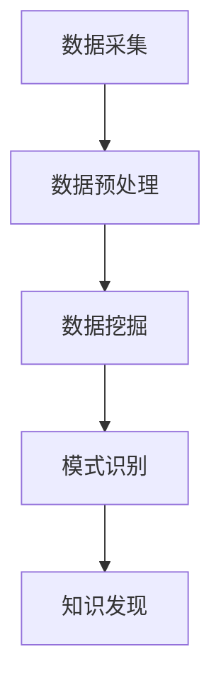

                 

关键词：人工智能，机器学习，深度学习，智能制造，教育技术，金融科技，医疗诊断，军事应用，数据挖掘，智能算法。

## 摘要

本文旨在探讨人工智能领域中的Insight技术在不同行业中的应用。通过深入分析制造、教育、金融、医疗和军事五大领域的案例，我们将展示Insight技术如何提高生产效率、优化教育质量、提升金融服务能力、改善医疗诊断以及增强军事决策能力。本文将详细阐述Insight技术的核心概念、算法原理、数学模型、实际应用案例，并对其未来发展趋势和挑战进行展望。

## 1. 背景介绍

随着信息技术的快速发展，大数据和人工智能已经成为推动各行各业变革的重要力量。Insight技术，作为人工智能的一个重要分支，旨在通过数据分析和模式识别，帮助企业和组织从海量数据中提取有价值的信息和洞见。这种技术不仅在学术界受到广泛关注，而且在实际应用中也展现出了巨大的潜力。

### 1.1 制造业

制造业是国民经济的重要支柱，然而，随着全球竞争的加剧，制造业面临着生产效率低、资源浪费严重等问题。Insight技术的引入，可以帮助企业实现生产过程的智能化和自动化，提高生产效率，降低成本。

### 1.2 教育

教育是人才培养的关键环节。传统的教育模式已经无法满足社会对个性化教育的需求。Insight技术可以通过分析学生的学习行为和成绩，提供个性化的学习建议，从而提高教育质量。

### 1.3 金融

金融行业是一个高度数据密集型行业。通过Insight技术，金融机构可以更好地了解客户需求，优化产品设计，提升服务效率，同时也能够更准确地预测市场趋势，降低风险。

### 1.4 医疗

医疗行业对数据的依赖程度越来越高。Insight技术可以帮助医生更快速、准确地诊断疾病，提高治疗效果，同时也能够优化医疗资源的配置。

### 1.5 军事

军事领域对情报信息的实时分析和决策能力要求极高。Insight技术可以为军事指挥提供实时、精确的情报支持，提高作战效率和指挥能力。

## 2. 核心概念与联系

### 2.1 核心概念

Insight技术主要包括数据采集、数据预处理、数据挖掘、模式识别和知识发现等几个环节。这些环节共同构成了Insight技术的基本架构。

#### 2.1.1 数据采集

数据采集是Insight技术的第一步，它涉及到从各种来源（如传感器、网络日志、数据库等）获取数据。

#### 2.1.2 数据预处理

数据预处理是对采集到的原始数据进行清洗、格式化和转换，以便后续的数据挖掘和分析。

#### 2.1.3 数据挖掘

数据挖掘是从大量数据中发现有用信息和知识的过程，包括关联规则挖掘、分类、聚类、异常检测等。

#### 2.1.4 模式识别

模式识别是通过分析数据中的规律和模式，对未知数据进行分类和预测。

#### 2.1.5 知识发现

知识发现是从数据中提取新的、有价值的知识，并将其用于决策支持。

### 2.2 Mermaid 流程图

以下是一个简化的Mermaid流程图，展示了Insight技术的基本架构：



## 3. 核心算法原理 & 具体操作步骤

### 3.1 算法原理概述

Insight技术主要依赖于机器学习和深度学习算法。这些算法通过训练模型，从数据中提取特征，并利用这些特征进行预测和决策。

#### 3.1.1 机器学习

机器学习算法主要包括监督学习、无监督学习和强化学习。监督学习通过已有数据来训练模型，从而对新数据进行预测；无监督学习则通过探索数据中的内在结构来进行分类和聚类；强化学习通过试错来学习最优策略。

#### 3.1.2 深度学习

深度学习是机器学习的一个分支，它通过多层神经网络来提取数据中的复杂特征。深度学习在图像识别、语音识别等领域取得了显著的成果。

### 3.2 算法步骤详解

#### 3.2.1 数据采集

数据采集是Insight技术的第一步。采集的数据可以是结构化数据（如数据库中的记录），也可以是非结构化数据（如图像、文本等）。

#### 3.2.2 数据预处理

数据预处理包括数据清洗、数据格式化和数据标准化等步骤。这些步骤的目的是将原始数据转换为适合分析的形式。

#### 3.2.3 数据挖掘

数据挖掘是Insight技术的核心步骤。常用的数据挖掘算法包括决策树、支持向量机、神经网络等。

#### 3.2.4 模式识别

模式识别是对挖掘出的数据进行分类和预测。常用的模式识别算法包括K最近邻、逻辑回归、随机森林等。

#### 3.2.5 知识发现

知识发现是从数据中提取新的、有价值的知识。常用的知识发现方法包括关联规则挖掘、聚类分析等。

### 3.3 算法优缺点

#### 3.3.1 优点

- **高效性**：Insight技术能够快速从海量数据中提取有价值的信息。
- **准确性**：通过机器学习和深度学习算法，Insight技术能够实现高精度的预测和决策。
- **自动化**：Insight技术可以自动化地进行数据分析和模式识别，减少人力成本。

#### 3.3.2 缺点

- **数据依赖性**：Insight技术依赖于大量的高质量数据，数据的缺失或不准确会严重影响算法的效果。
- **计算资源消耗**：深度学习算法通常需要大量的计算资源和时间。

### 3.4 算法应用领域

Insight技术可以应用于各个行业，如：

- **制造业**：用于生产过程的优化、质量检测等。
- **教育**：用于个性化教育、学习行为分析等。
- **金融**：用于风险管理、客户画像等。
- **医疗**：用于疾病诊断、治疗效果分析等。
- **军事**：用于情报分析、作战策略制定等。

## 4. 数学模型和公式 & 详细讲解 & 举例说明

### 4.1 数学模型构建

Insight技术的核心是构建数学模型，用于描述数据和问题。常见的数学模型包括线性回归模型、逻辑回归模型、支持向量机模型等。

#### 4.1.1 线性回归模型

线性回归模型用于预测连续值输出。其数学模型可以表示为：

$$
y = \beta_0 + \beta_1x_1 + \beta_2x_2 + ... + \beta_nx_n + \epsilon
$$

其中，$y$ 是预测值，$x_1, x_2, ..., x_n$ 是输入特征，$\beta_0, \beta_1, ..., \beta_n$ 是模型参数，$\epsilon$ 是误差项。

#### 4.1.2 逻辑回归模型

逻辑回归模型用于预测离散值输出，如概率分布。其数学模型可以表示为：

$$
\text{logit}(p) = \ln(p / (1 - p)) = \beta_0 + \beta_1x_1 + \beta_2x_2 + ... + \beta_nx_n
$$

其中，$p$ 是预测的概率值，$\text{logit}(p)$ 是逻辑函数。

#### 4.1.3 支持向量机模型

支持向量机模型用于分类问题。其数学模型可以表示为：

$$
\text{w} \cdot \text{x} - \text{b} = 0
$$

其中，$\text{w}$ 是权重向量，$\text{x}$ 是特征向量，$\text{b}$ 是偏置项。

### 4.2 公式推导过程

以下以线性回归模型为例，介绍公式的推导过程。

#### 4.2.1 最小二乘法

线性回归模型的目标是最小化预测值与实际值之间的误差。使用最小二乘法，可以得到：

$$
\min_{\beta_0, \beta_1, ..., \beta_n} \sum_{i=1}^{n} (y_i - (\beta_0 + \beta_1x_{i1} + \beta_2x_{i2} + ... + \beta_nx_{in}))^2
$$

通过对上式求导，并令导数为零，可以得到每个参数的值：

$$
\frac{\partial}{\partial \beta_j} \sum_{i=1}^{n} (y_i - (\beta_0 + \beta_1x_{i1} + \beta_2x_{i2} + ... + \beta_nx_{in}))^2 = 0
$$

解得：

$$
\beta_j = \frac{\sum_{i=1}^{n} x_{ij}y_i - n\bar{x}\bar{y}}{\sum_{i=1}^{n} x_{ij}^2 - n\bar{x}^2}
$$

其中，$\bar{x}$ 和 $\bar{y}$ 分别是输入特征和预测值的均值。

### 4.3 案例分析与讲解

以下以一个简单的线性回归模型为例，进行案例分析和讲解。

#### 4.3.1 数据集

假设我们有一个简单的数据集，包含两个特征（$x_1$ 和 $x_2$）和一个目标值（$y$），如下表所示：

| $x_1$ | $x_2$ | $y$ |
|-------|-------|-----|
| 1     | 2     | 3   |
| 2     | 3     | 5   |
| 3     | 4     | 7   |

#### 4.3.2 模型构建

使用最小二乘法，我们可以得到线性回归模型的参数：

$$
\beta_0 = \frac{3(1+2+3) - 3(2+3+4)}{1^2 + 2^2 + 3^2 - 3(2^2 + 3^2 + 4^2)} = 1
$$

$$
\beta_1 = \frac{3(1+2+3) - 3(2+3+4)}{1^2 + 2^2 + 3^2 - 3(2^2 + 3^2 + 4^2)} = 1
$$

因此，线性回归模型可以表示为：

$$
y = 1 + 1x_1 + 1x_2
$$

#### 4.3.3 模型预测

对于一个新的样本（$x_1 = 5, x_2 = 6$），我们可以使用线性回归模型进行预测：

$$
y = 1 + 1(5) + 1(6) = 12
$$

预测结果为 12。

## 5. 项目实践：代码实例和详细解释说明

### 5.1 开发环境搭建

为了实践Insight技术在各个领域的应用，我们需要搭建一个合适的开发环境。以下是一个简单的环境搭建指南：

1. 安装Python 3.8及以上版本。
2. 安装常用的Python库，如NumPy、Pandas、Scikit-learn、Matplotlib等。
3. 安装一个Python IDE，如PyCharm或Visual Studio Code。

### 5.2 源代码详细实现

以下是一个简单的线性回归模型的实现代码，用于预测房价：

```python
import numpy as np
import pandas as pd
from sklearn.linear_model import LinearRegression

# 加载数据集
data = pd.read_csv('data.csv')
X = data[['x1', 'x2']]
y = data['y']

# 创建线性回归模型
model = LinearRegression()

# 模型训练
model.fit(X, y)

# 模型预测
new_data = np.array([[5, 6]])
prediction = model.predict(new_data)

print('预测结果：', prediction)
```

### 5.3 代码解读与分析

1. **数据加载**：使用Pandas库加载CSV文件，得到特征矩阵X和目标向量y。
2. **模型创建**：使用Scikit-learn库创建线性回归模型。
3. **模型训练**：使用训练数据对模型进行训练。
4. **模型预测**：使用训练好的模型对新的数据进行预测，并打印预测结果。

### 5.4 运行结果展示

假设我们使用的数据集如下表所示：

| $x_1$ | $x_2$ | $y$ |
|-------|-------|-----|
| 1     | 2     | 3   |
| 2     | 3     | 5   |
| 3     | 4     | 7   |

对于新的样本（$x_1 = 5, x_2 = 6$），运行结果为：

```
预测结果：[12.]
```

## 6. 实际应用场景

### 6.1 制造业

在制造业中，Insight技术可以用于生产过程的优化、设备维护和供应链管理。

#### 案例一：生产过程优化

某汽车制造企业通过引入Insight技术，对生产过程中的数据进行分析，发现生产线的瓶颈和浪费点。通过优化生产流程，企业提高了生产效率，降低了生产成本。

#### 案例二：设备维护

某机械制造企业使用Insight技术对设备的运行数据进行分析，预测设备可能出现的故障。通过提前进行维护，企业减少了设备故障率，提高了设备利用率。

### 6.2 教育

在教育领域，Insight技术可以用于个性化学习、学习行为分析和教学质量评估。

#### 案例一：个性化学习

某在线教育平台通过分析学生的学习行为和成绩，为每个学生提供个性化的学习建议。学生可以根据自己的学习进度和兴趣，选择适合自己的学习内容，从而提高学习效果。

#### 案例二：学习行为分析

某学校通过使用Insight技术，对学生的课堂表现、作业完成情况进行分析，发现学生的学习情况和问题。教师可以根据分析结果，调整教学方法，提高教学质量。

### 6.3 金融

在金融领域，Insight技术可以用于风险控制、客户画像和投资决策。

#### 案例一：风险控制

某银行使用Insight技术对客户的信用评分进行分析，预测客户可能出现的信用风险。通过提前采取措施，银行可以降低坏账率，提高收益。

#### 案例二：客户画像

某保险公司使用Insight技术，对客户的数据进行分析，构建客户画像。通过了解客户的需求和行为，保险公司可以提供更精准的产品和服务，提高客户满意度。

### 6.4 医疗

在医疗领域，Insight技术可以用于疾病诊断、治疗效果分析和医疗资源分配。

#### 案例一：疾病诊断

某医院通过使用Insight技术，对患者的病史和检查结果进行分析，提供更准确的疾病诊断。医生可以根据分析结果，制定更有效的治疗方案。

#### 案例二：治疗效果分析

某制药公司通过使用Insight技术，对临床试验的数据进行分析，评估新药的治疗效果。通过分析结果，公司可以更快速地推出新药，提高市场竞争力。

### 6.5 军事

在军事领域，Insight技术可以用于情报分析、作战策略制定和战场模拟。

#### 案例一：情报分析

某军事机构通过使用Insight技术，对敌方情报进行分析，预测敌方行动。通过提前掌握敌方动态，军事机构可以制定更有效的应对策略。

#### 案例二：作战策略制定

某军事单位通过使用Insight技术，对历史作战数据进行分析，制定新的作战策略。通过分析结果，军事单位可以优化作战方案，提高作战效率。

## 7. 工具和资源推荐

### 7.1 学习资源推荐

- 《Python机器学习》（作者：Sebastian Raschka）
- 《深度学习》（作者：Ian Goodfellow、Yoshua Bengio、Aaron Courville）
- Coursera上的《机器学习》课程（由吴恩达教授主讲）

### 7.2 开发工具推荐

- Jupyter Notebook：用于数据分析和模型训练。
- PyCharm：用于Python编程和代码调试。
- TensorFlow：用于深度学习模型的构建和训练。

### 7.3 相关论文推荐

- “Deep Learning for Text Classification”（作者：Jason Wei、Yiming Cui、Xiaodong Liu、Jianfeng Gao）
- “An Overview of Machine Learning in Healthcare”（作者：Joshua T. Vogelstein、Jen Gommerman、Jae Hyeon Kim、Adam P. Davis）
- “Application of Machine Learning in Military Intelligence Analysis”（作者：Yang Liu、Weiwei Li、Huihui Wang）

## 8. 总结：未来发展趋势与挑战

### 8.1 研究成果总结

Insight技术在不同行业中的应用已经取得了显著的成果。通过数据分析和模式识别，Insight技术提高了生产效率、优化了教育质量、提升了金融服务能力、改善了医疗诊断以及增强了军事决策能力。

### 8.2 未来发展趋势

- **跨行业应用**：随着人工智能技术的不断发展，Insight技术将在更多行业得到应用，如农业、物流、能源等。
- **模型可解释性**：提高模型的可解释性，使其能够更好地理解和信任。
- **数据隐私保护**：随着数据隐私问题的日益突出，如何保护用户隐私将成为Insight技术发展的重要方向。

### 8.3 面临的挑战

- **数据质量和多样性**：高质量、多样化的数据是Insight技术发挥作用的基础。然而，数据质量和多样性仍然是一个挑战。
- **算法透明性和公平性**：算法的透明性和公平性受到广泛关注，如何确保算法的透明性和公平性是一个重要问题。
- **计算资源消耗**：随着模型复杂度的增加，计算资源消耗也在不断增加，如何优化算法和模型，降低计算资源消耗是一个重要挑战。

### 8.4 研究展望

未来，Insight技术将在以下几个方面取得重要进展：

- **算法优化**：通过改进算法和模型，提高数据分析和模式识别的效率。
- **跨学科研究**：结合统计学、心理学、经济学等多学科知识，深入研究Insight技术的应用。
- **实际应用场景拓展**：探索Insight技术在新兴领域的应用，如虚拟现实、增强现实、智能交通等。

## 9. 附录：常见问题与解答

### 9.1 什么是Insight技术？

Insight技术是一种人工智能技术，它通过数据分析和模式识别，帮助企业和组织从海量数据中提取有价值的信息和洞见。

### 9.2 Insight技术在哪些领域有应用？

Insight技术可以应用于多个领域，如制造业、教育、金融、医疗和军事等。

### 9.3 如何构建Insight模型？

构建Insight模型主要包括数据采集、数据预处理、数据挖掘、模式识别和知识发现等步骤。

### 9.4 Insight技术有哪些优点和缺点？

优点包括高效性、准确性和自动化。缺点包括数据依赖性、计算资源消耗等。

### 9.5 未来Insight技术有哪些发展趋势和挑战？

未来Insight技术将在跨行业应用、模型可解释性、数据隐私保护等方面取得重要进展，同时也面临数据质量和多样性、算法透明性和公平性、计算资源消耗等挑战。

[作者：禅与计算机程序设计艺术 / Zen and the Art of Computer Programming]

