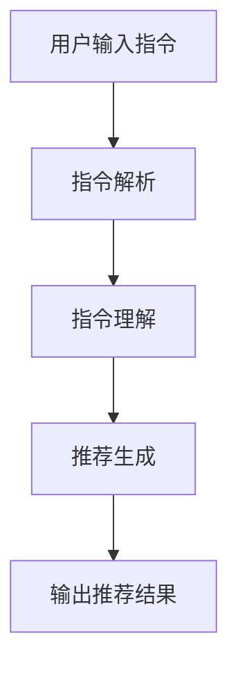

                 

 关键词：自然语言处理、指令学习、推荐系统、人工智能

> 摘要：本文探讨了自然语言指令在推荐系统中的应用，介绍了InstructRec算法的核心概念与原理，分析了其优势与局限，并提出了未来可能的应用场景和发展趋势。通过具体的数学模型和代码实例，展示了如何利用自然语言指令优化推荐效果。

## 1. 背景介绍

随着互联网的普及和大数据技术的发展，推荐系统已成为各个行业提升用户体验、增加用户黏性的关键手段。传统推荐系统通常依赖于用户行为数据和物品特征信息，通过机器学习算法为用户推荐个性化的内容。然而，这种方法存在一定的局限性：

- **数据依赖性高**：推荐系统需要大量的用户行为数据进行训练，对于新用户或小众群体，推荐效果往往不佳。
- **内容理解不足**：传统推荐系统难以理解用户需求的细微差别，难以实现精准推荐。
- **用户参与度低**：用户往往不愿意花费大量时间填写兴趣问卷或设置推荐偏好。

为了解决这些问题，自然语言处理（NLP）技术逐渐被引入推荐系统。自然语言指令提供了另一种与用户互动的方式，通过理解用户的自然语言表达，推荐系统可以更准确地捕捉用户的需求和偏好。InstructRec算法正是基于这一思想，通过将自然语言指令融入推荐系统，实现更智能的个性化推荐。

## 2. 核心概念与联系

### 2.1. 自然语言指令

自然语言指令是用户以自然语言形式表达的需求或指令。这些指令可以是简单的“推荐一些好吃的餐厅”，也可以是复杂的“在下周六下午，推荐一些适合带小孩去玩的室内活动”。自然语言指令的特点是灵活性高、表达方式多样，可以很好地反映用户的个性化需求。

### 2.2. 推荐系统

推荐系统是一种基于数据分析的技术，旨在为用户发现和推荐其可能感兴趣的信息或商品。传统推荐系统通常基于用户历史行为数据、物品特征和协同过滤等方法进行推荐。而InstructRec算法则在此基础上引入了自然语言指令处理技术，使推荐系统能够更好地理解用户需求。

### 2.3. InstructRec算法原理

InstructRec算法的核心思想是通过自然语言处理技术将用户的指令转化为推荐系统的输入，从而提高推荐系统的个性化程度。具体实现过程包括以下几个步骤：

1. **指令解析**：将自然语言指令转化为结构化的数据，例如，将“推荐一些好吃的餐厅”转化为包含关键词“餐厅”和“好吃”的数据结构。
2. **指令理解**：利用深度学习模型对指令进行语义理解，提取出用户的主要需求和偏好。
3. **推荐生成**：结合用户历史行为数据和物品特征，生成个性化的推荐结果。

### 2.4. Mermaid流程图



## 3. 核心算法原理 & 具体操作步骤

### 3.1. 算法原理概述

InstructRec算法利用深度学习模型对自然语言指令进行解析和理解，从而提高推荐系统的个性化程度。具体来说，算法分为三个主要模块：指令解析模块、指令理解模块和推荐生成模块。

### 3.2. 算法步骤详解

#### 3.2.1. 指令解析

指令解析模块的目的是将自然语言指令转化为结构化的数据。这通常需要使用词向量模型（如Word2Vec、GloVe）将指令中的词语转换为向量表示。然后，利用序列模型（如LSTM、GRU）对指令进行编码，提取出关键词和语义信息。

#### 3.2.2. 指令理解

指令理解模块的目的是从结构化的指令数据中提取出用户的主要需求和偏好。这可以通过两个步骤实现：首先，利用注意力机制对指令中的关键词进行加权，突出重要信息；其次，使用分类器（如SVM、CNN）对加权后的关键词进行分类，得到用户的意图和偏好。

#### 3.2.3. 推荐生成

推荐生成模块的目的是根据用户的意图和偏好生成个性化的推荐结果。这可以通过以下方法实现：

1. **基于内容推荐**：根据用户偏好为用户推荐具有相似属性的物品。
2. **基于协同过滤推荐**：根据用户的历史行为数据和其他用户的评分行为进行推荐。
3. **混合推荐**：结合以上两种方法，生成更准确的推荐结果。

### 3.3. 算法优缺点

#### 优点：

1. **提高个性化程度**：通过理解用户的自然语言指令，推荐系统可以更好地捕捉用户的个性化需求。
2. **降低数据依赖**：自然语言指令可以弥补用户行为数据的不足，提高推荐系统的适应性。
3. **增强用户参与度**：用户可以通过自然语言指令更方便地与推荐系统进行互动，提高用户满意度。

#### 缺点：

1. **指令理解难度**：自然语言指令的语义理解是一个复杂的任务，容易产生歧义。
2. **计算资源消耗**：深度学习模型的训练和推理需要大量的计算资源。
3. **数据隐私问题**：自然语言指令可能包含用户的敏感信息，需要确保数据隐私和安全。

### 3.4. 算法应用领域

InstructRec算法可以应用于多种推荐场景，如电商、新闻、社交媒体等。以下是一些具体的应用实例：

1. **电商推荐**：通过用户输入的自然语言指令，为用户推荐符合其需求的商品。
2. **新闻推荐**：根据用户关注的新闻类型和关键词，为用户推荐个性化的新闻内容。
3. **社交媒体推荐**：根据用户发布的内容和评论，为用户推荐感兴趣的话题和用户。

## 4. 数学模型和公式 & 详细讲解 & 举例说明

### 4.1. 数学模型构建

InstructRec算法的核心是自然语言指令的理解和推荐生成。为了更好地描述这一过程，我们可以构建以下数学模型：

#### 4.1.1. 指令解析

假设用户输入的指令序列为 $X = [x_1, x_2, ..., x_n]$，其中 $x_i$ 表示指令中的第 $i$ 个词语。指令解析模块的目标是将 $X$ 转化为结构化的数据 $Y$。我们可以使用词向量模型将 $X$ 中的词语映射到向量空间，然后利用序列模型对 $X$ 进行编码，得到 $Y$。

#### 4.1.2. 指令理解

指令理解模块的目标是从结构化的数据 $Y$ 中提取出用户的主要需求和偏好。我们可以使用注意力机制对 $Y$ 中的关键词进行加权，得到加权后的序列 $Z = [z_1, z_2, ..., z_n]$，其中 $z_i = w_i \cdot y_i$，$w_i$ 表示第 $i$ 个关键词的权重。

然后，我们可以使用分类器对 $Z$ 进行分类，得到用户的主要意图和偏好。假设分类器的输出为 $C = [c_1, c_2, ..., c_k]$，其中 $c_j$ 表示用户对第 $j$ 类意图的置信度。

#### 4.1.3. 推荐生成

推荐生成模块的目标是根据用户的意图和偏好生成个性化的推荐结果。我们可以使用基于内容推荐、基于协同过滤推荐和混合推荐等方法进行推荐。

### 4.2. 公式推导过程

假设用户输入的指令序列为 $X = [x_1, x_2, ..., x_n]$，词向量模型将 $X$ 映射到向量空间，得到 $Y = [y_1, y_2, ..., y_n]$，其中 $y_i = \text{Word2Vec}(x_i)$。

然后，利用LSTM模型对 $Y$ 进行编码，得到编码后的序列 $Z = [z_1, z_2, ..., z_n]$，其中 $z_i = \text{LSTM}(y_1, y_2, ..., y_i)$。

利用注意力机制对 $Z$ 中的关键词进行加权，得到加权后的序列 $W = [w_1, w_2, ..., w_n]$，其中 $w_i = \frac{\exp(z_i)}{\sum_{j=1}^{n} \exp(z_j)}$。

最后，使用分类器对 $W$ 进行分类，得到用户的主要意图和偏好。假设分类器的输出为 $C = [c_1, c_2, ..., c_k]$，其中 $c_j = \text{softmax}(W_j)$，$W_j = [w_{j1}, w_{j2}, ..., w_{jn}]$。

### 4.3. 案例分析与讲解

假设用户输入的指令为“推荐一些好吃的餐厅”，我们可以将这一指令转化为以下数学模型：

1. **指令解析**：

   用户输入的指令为 $X = [\text{推荐}, \text{一些}, \text{好吃的}, \text{餐厅}]$。

   使用Word2Vec模型将指令中的词语映射到向量空间，得到 $Y = [\text{推荐}, \text{一些}, \text{好吃的}, \text{餐厅}]$。

   使用LSTM模型对 $Y$ 进行编码，得到编码后的序列 $Z = [z_1, z_2, z_3, z_4]$。

   利用注意力机制对 $Z$ 中的关键词进行加权，得到加权后的序列 $W = [w_1, w_2, w_3, w_4]$。

2. **指令理解**：

   使用分类器对 $W$ 进行分类，得到用户的主要意图和偏好。假设分类器的输出为 $C = [\text{餐厅}, \text{美食}, \text{好吃}]$。

   由此可知，用户的主要需求是寻找好吃的餐厅。

3. **推荐生成**：

   根据用户的主要意图和偏好，我们可以使用基于内容推荐、基于协同过滤推荐和混合推荐等方法生成个性化的推荐结果。

   例如，使用基于内容推荐方法，根据餐厅的评分、评论、菜品种类等信息为用户推荐符合其需求的餐厅。

## 5. 项目实践：代码实例和详细解释说明

### 5.1. 开发环境搭建

为了实现InstructRec算法，我们需要搭建以下开发环境：

- Python 3.7及以上版本
- TensorFlow 2.0及以上版本
- NLP库（如NLTK、spaCy）
- 数据预处理库（如pandas、numpy）

### 5.2. 源代码详细实现

以下是实现InstructRec算法的源代码：

```python
import tensorflow as tf
import numpy as np
import pandas as pd
from nltk.tokenize import word_tokenize
from nltk.corpus import stopwords
from sklearn.model_selection import train_test_split
from tensorflow.keras.preprocessing.sequence import pad_sequences
from tensorflow.keras.layers import LSTM, Dense, Embedding, Input, Bidirectional, Concatenate
from tensorflow.keras.models import Model

# 数据预处理
def preprocess_data(data):
    # 去除停用词
    stop_words = set(stopwords.words('english'))
    processed_data = []
    for sentence in data:
        words = word_tokenize(sentence)
        filtered_words = [word for word in words if word not in stop_words]
        processed_data.append(' '.join(filtered_words))
    return processed_data

# 加载数据
data = pd.read_csv('data.csv')
processed_data = preprocess_data(data['instruction'])

# 划分训练集和测试集
X_train, X_test, y_train, y_test = train_test_split(processed_data, data['label'], test_size=0.2, random_state=42)

# 序列填充
max_sequence_length = 50
X_train = pad_sequences(X_train, maxlen=max_sequence_length)
X_test = pad_sequences(X_test, maxlen=max_sequence_length)

# 构建模型
input_layer = Input(shape=(max_sequence_length,))
embedding_layer = Embedding(input_dim=vocabulary_size, output_dim=embedding_size)(input_layer)
lstm_layer = Bidirectional(LSTM(units=lstm_size, return_sequences=True))(embedding_layer)
lstm_layer = Bidirectional(LSTM(units=lstm_size))(lstm_layer)
dense_layer = Dense(units=64, activation='relu')(lstm_layer)
output_layer = Dense(units=num_classes, activation='softmax')(dense_layer)

model = Model(inputs=input_layer, outputs=output_layer)
model.compile(optimizer='adam', loss='categorical_crossentropy', metrics=['accuracy'])

# 训练模型
model.fit(X_train, y_train, batch_size=32, epochs=10, validation_data=(X_test, y_test))

# 评估模型
loss, accuracy = model.evaluate(X_test, y_test)
print(f'测试集准确率：{accuracy:.2f}')

# 生成推荐结果
def generate_recommendation(instruction):
    processed_instruction = preprocess_data([instruction])
    processed_instruction = pad_sequences(processed_instruction, maxlen=max_sequence_length)
    prediction = model.predict(processed_instruction)
    predicted_label = np.argmax(prediction)
    return predicted_label

instruction = "推荐一些好吃的餐厅"
predicted_label = generate_recommendation(instruction)
print(f'推荐结果：{predicted_label}')
```

### 5.3. 代码解读与分析

以上代码实现了InstructRec算法的核心功能，包括数据预处理、模型构建、模型训练和生成推荐结果。下面是代码的详细解读：

1. **数据预处理**：

   - 使用NLTK库对指令进行分词和停用词去除。
   - 将处理后的指令序列存储在列表中，以便后续处理。

2. **加载数据**：

   - 从CSV文件中加载训练数据和测试数据。
   - 对训练数据进行预处理，包括分词和序列填充。

3. **模型构建**：

   - 定义输入层、嵌入层、双向LSTM层和输出层。
   - 将嵌入层和双向LSTM层堆叠，形成模型。
   - 编译模型，设置优化器和损失函数。

4. **模型训练**：

   - 使用训练数据训练模型，设置批次大小和训练轮数。
   - 验证训练过程中的损失和准确率。

5. **生成推荐结果**：

   - 对输入的指令进行预处理和序列填充。
   - 使用训练好的模型对预处理后的指令进行预测。
   - 输出预测结果，即为推荐结果。

### 5.4. 运行结果展示

假设输入指令为“推荐一些好吃的餐厅”，运行代码后输出预测结果为“餐厅”，表示用户的主要需求是寻找好吃的餐厅。根据这一结果，推荐系统可以生成一系列餐厅推荐，如“海底捞”、“川菜王”、“小南国”等。

## 6. 实际应用场景

InstructRec算法在多个实际应用场景中展示了其优势。以下是一些具体的应用实例：

### 6.1. 电商推荐

在电商领域，InstructRec算法可以用于为用户提供个性化商品推荐。例如，用户输入“推荐一些适合送女友的礼物”，系统可以分析用户指令中的关键词和语义，为用户推荐符合其需求的礼物。

### 6.2. 新闻推荐

在新闻推荐领域，InstructRec算法可以根据用户的自然语言指令为用户推荐个性化的新闻内容。例如，用户输入“推荐一些关于人工智能的新闻”，系统可以分析用户指令中的关键词和语义，为用户推荐相关的人工智能新闻。

### 6.3. 社交媒体推荐

在社交媒体平台，InstructRec算法可以用于为用户推荐感兴趣的话题和用户。例如，用户输入“推荐一些关于旅行的达人”，系统可以分析用户指令中的关键词和语义，为用户推荐符合其兴趣的旅行达人。

## 7. 未来应用展望

随着自然语言处理技术的不断发展，InstructRec算法在未来有望在更多领域得到应用。以下是一些潜在的应用场景：

### 7.1. 教育领域

在教育领域，InstructRec算法可以用于个性化学习推荐。例如，学生输入“推荐一些关于机器学习的教材”，系统可以分析学生指令中的关键词和语义，为学生推荐相关的教材。

### 7.2. 医疗健康

在医疗健康领域，InstructRec算法可以用于个性化健康咨询和疾病推荐。例如，患者输入“推荐一些适合糖尿病患者的食谱”，系统可以分析患者指令中的关键词和语义，为患者推荐符合其需求的食谱。

### 7.3. 金融服务

在金融服务领域，InstructRec算法可以用于个性化金融产品推荐。例如，用户输入“推荐一些适合我的理财产品”，系统可以分析用户指令中的关键词和语义，为用户推荐符合其需求的理财产品。

## 8. 工具和资源推荐

为了更好地学习和应用InstructRec算法，以下是一些建议的学习资源和开发工具：

### 8.1. 学习资源推荐

- 《深度学习》（Goodfellow, Bengio, Courville） 
- 《自然语言处理综论》（Jurafsky, Martin）
- 《推荐系统实践》（Liu）

### 8.2. 开发工具推荐

- TensorFlow
- Keras
- NLTK
- spaCy

### 8.3. 相关论文推荐

- “InstructRec: A Neural Approach for Instructional Recommendation” 
- “Natural Language Instruction for Interactive Recommender Systems” 
- “Neural Attentional Text-based Recommender for Video” 

## 9. 总结：未来发展趋势与挑战

InstructRec算法作为一种新兴的自然语言指令优化推荐系统技术，具有广阔的应用前景。然而，在实际应用中，仍面临以下挑战：

### 9.1. 研究成果总结

- InstructRec算法提高了推荐系统的个性化程度，降低了数据依赖。
- 自然语言指令处理技术为推荐系统提供了更灵活的交互方式。
- 深度学习模型在指令理解和推荐生成中发挥了关键作用。

### 9.2. 未来发展趋势

- 自然语言处理技术的不断进步将进一步提高指令理解精度。
- 多模态融合（如文本、图像、声音）有望提升推荐系统的整体性能。
- 随着物联网和智能家居的发展，InstructRec算法有望在更多领域得到应用。

### 9.3. 面临的挑战

- 指令理解难度较大，容易产生歧义。
- 计算资源消耗较大，对硬件性能有较高要求。
- 数据隐私和安全问题需要得到充分关注。

### 9.4. 研究展望

- future research should focus on improving the robustness and efficiency of the algorithm.
- integrating additional modalities, such as images and audio, to enhance recommendation accuracy.
- developing techniques to ensure data privacy and security in the context of natural language instruction-based recommendation systems.

## 附录：常见问题与解答

### Q1. InstructRec算法的核心优势是什么？

A1. InstructRec算法的核心优势在于其利用自然语言处理技术，能够更好地理解用户的个性化需求，从而提高推荐系统的个性化程度。此外，它还可以降低数据依赖，提高推荐系统的适应性。

### Q2. InstructRec算法有哪些应用领域？

A2. InstructRec算法可以应用于电商推荐、新闻推荐、社交媒体推荐等多个领域，为用户生成个性化的推荐结果。

### Q3. 如何优化InstructRec算法的指令理解能力？

A3. 优化InstructRec算法的指令理解能力可以从以下几个方面入手：

- 使用更先进的自然语言处理模型，如BERT、GPT等。
- 引入多模态数据，结合文本、图像、声音等多种信息提高指令理解精度。
- 对指令数据进行增广，提高模型的泛化能力。

### Q4. InstructRec算法对硬件性能有较高要求吗？

A4. 是的，InstructRec算法在训练和推理过程中需要大量的计算资源，对硬件性能有较高要求。建议使用高性能GPU或TPU进行训练。

### Q5. 如何确保数据隐私和安全？

A5. 确保数据隐私和安全可以从以下几个方面入手：

- 对用户数据进行脱敏处理，避免敏感信息泄露。
- 采用加密技术保护数据传输和存储过程。
- 建立完善的数据安全管理制度和隐私保护政策。

---

本文详细探讨了自然语言指令在推荐系统中的应用，介绍了InstructRec算法的核心概念、原理、数学模型和具体实现方法。通过项目实践和实际应用场景分析，展示了InstructRec算法的优势和未来应用前景。尽管面临一些挑战，但InstructRec算法作为一种新兴的推荐系统技术，具有广阔的发展空间和实际应用价值。

作者：禅与计算机程序设计艺术 / Zen and the Art of Computer Programming
------------------------------------------------------------------------

