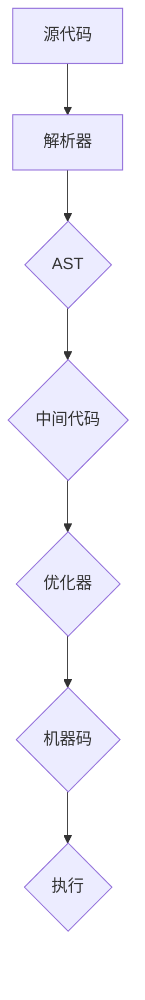

                 

关键词：JIT编译、动态语言、性能优化、虚拟机、中间代码、动态优化

> 摘要：本文将深入探讨JIT（即时编译）技术在动态语言性能优化中的应用，分析其核心概念、原理及其在实际项目中的实践效果，同时展望JIT编译技术未来的发展趋势和面临的挑战。

## 1. 背景介绍

在现代软件开发领域，性能优化是每个开发者都不可忽视的重要任务。随着应用程序规模的不断扩大，性能瓶颈日益凸显。为了提高应用程序的运行效率，开发者们不断地寻找各种优化方法。其中，JIT编译技术作为一种高效的性能优化手段，受到了广泛关注。

JIT编译，即即时编译（Just-In-Time Compilation），是一种在程序运行时将源代码编译成机器码的技术。相对于传统的先行编译（Ahead-of-Time Compilation），JIT编译具有动态优化、即时反馈等优势。特别是在动态语言中，JIT编译技术的应用效果尤为显著。

本文将围绕JIT编译技术，探讨其在动态语言性能优化中的应用，分析其核心原理、算法实现，并通过实际项目案例进行详细讲解，以帮助读者更好地理解JIT编译技术。

## 2. 核心概念与联系

### 2.1 JIT编译的核心概念

JIT编译技术主要包括以下几个核心概念：

1. **源代码（Source Code）**：源代码是程序设计的原始文本，描述了程序的功能和行为。在JIT编译过程中，源代码被解析、分析和转换为中间代码。

2. **中间代码（Intermediate Code）**：中间代码是源代码的一种抽象表示，它在编译过程中起到桥梁的作用。中间代码通常具有高度的优化潜力，可以为后续的代码生成提供基础。

3. **字节码（Bytecode）**：字节码是一种平台无关的代码表示，通常由虚拟机（Virtual Machine，VM）执行。在JIT编译中，字节码可能会被进一步编译为机器码。

4. **机器码（Machine Code）**：机器码是计算机可以直接执行的指令序列。在JIT编译过程中，机器码生成是最终目标，它直接影响程序的性能。

### 2.2 JIT编译的工作原理

JIT编译的工作原理可以分为以下几个步骤：

1. **源代码解析（Parsing）**：将源代码解析为抽象语法树（Abstract Syntax Tree，AST）。

2. **中间代码生成（Intermediate Code Generation）**：将AST转换为中间代码。

3. **优化（Optimization）**：对中间代码进行各种优化，如去除冗余代码、简化表达式、合并循环等。

4. **代码生成（Code Generation）**：将优化后的中间代码转换为机器码。

5. **执行（Execution）**：机器码在计算机上执行，完成程序的运行。

### 2.3 JIT编译的架构

JIT编译的架构通常包括以下几个关键组件：

1. **解析器（Parser）**：负责将源代码解析为AST。

2. **解释器（Interpreter）**：负责将AST解释为机器码，并执行相应的操作。

3. **JIT编译器（JIT Compiler）**：负责将AST或中间代码编译为机器码。

4. **优化器（Optimizer）**：负责对中间代码进行各种优化。

5. **内存管理（Memory Management）**：负责管理程序的内存分配和回收。

6. **垃圾回收（Garbage Collection）**：负责回收不再使用的内存。

### 2.4 Mermaid流程图

下面是一个简化的JIT编译流程的Mermaid流程图：



## 3. 核心算法原理 & 具体操作步骤

### 3.1 算法原理概述

JIT编译的核心算法原理主要包括以下几个方面：

1. **动态编译**：JIT编译在程序运行时动态编译源代码，无需在编译时完成整个编译过程。这种动态编译方式可以实时优化代码，提高程序的运行效率。

2. **即时优化**：JIT编译器在编译过程中会对中间代码进行各种即时优化，如循环展开、分支预测等。这些优化可以减少程序的执行时间，提高程序的性能。

3. **热路径优化**：JIT编译器会识别程序中的热路径（频繁执行的部分），对热路径进行特别优化。这种优化可以显著提高程序的关键部分的执行效率。

4. **动态反馈**：JIT编译器会根据程序的运行情况实时调整优化策略，如调整热路径的识别范围、调整优化级别等。这种动态反馈机制可以使JIT编译器更好地适应程序的变化。

### 3.2 算法步骤详解

JIT编译算法的具体步骤如下：

1. **源代码解析**：将源代码解析为AST。

2. **中间代码生成**：将AST转换为中间代码。中间代码通常采用三元组表示，即（操作符，操作数1，操作数2）。

3. **优化**：对中间代码进行各种优化。常见的优化技术包括：
    - **常量折叠**：将常量表达式在编译时计算结果，替换为计算结果。
    - **循环展开**：将循环体展开为多次循环，减少循环开销。
    - **分支预测**：根据分支概率预测分支结果，减少分支开销。

4. **代码生成**：将优化后的中间代码转换为机器码。

5. **执行**：执行机器码，完成程序的运行。

### 3.3 算法优缺点

**优点：**
1. **高效性**：JIT编译可以实时优化代码，提高程序的运行效率。
2. **动态性**：JIT编译可以根据程序运行情况动态调整优化策略，更好地适应程序的变化。
3. **灵活性**：JIT编译可以支持多种编程语言，适用于不同的应用场景。

**缺点：**
1. **启动延迟**：JIT编译在程序运行时动态编译代码，可能会增加程序的启动延迟。
2. **内存占用**：JIT编译过程中需要生成中间代码和机器码，可能会增加程序的内存占用。

### 3.4 算法应用领域

JIT编译技术主要应用于以下领域：

1. **动态语言**：如JavaScript、Python等，JIT编译可以显著提高这些动态语言的运行性能。
2. **虚拟机**：如Java虚拟机（JVM）、.NET CLR等，JIT编译是虚拟机实现高性能的关键技术之一。
3. **嵌入式系统**：JIT编译可以在嵌入式系统中动态编译代码，提高系统的运行效率。

## 4. 数学模型和公式 & 详细讲解 & 举例说明

### 4.1 数学模型构建

在JIT编译中，我们可以构建一个简单的数学模型来描述编译过程和优化效果。假设：

- \( C \) 表示源代码的执行时间。
- \( I \) 表示中间代码的执行时间。
- \( O \) 表示优化后的中间代码的执行时间。
- \( M \) 表示机器码的执行时间。

那么，我们可以构建以下数学模型：

\[ E = \frac{C + I + O + M}{4} \]

其中，\( E \) 表示程序的平均执行时间。

### 4.2 公式推导过程

假设：

- \( T_1 \) 表示源代码解析时间。
- \( T_2 \) 表示中间代码生成时间。
- \( T_3 \) 表示优化时间。
- \( T_4 \) 表示代码生成时间。

那么，我们可以推导出：

\[ C = T_1 + T_2 \]
\[ I = T_3 \]
\[ O = T_4 \]

由于 \( T_1, T_2, T_3, T_4 \) 都是时间，它们都可以表示为 \( t \) 的函数：

\[ T_1 = f(t_1) \]
\[ T_2 = f(t_2) \]
\[ T_3 = f(t_3) \]
\[ T_4 = f(t_4) \]

代入上面的公式，我们得到：

\[ C = f(t_1) + f(t_2) \]
\[ I = f(t_3) \]
\[ O = f(t_4) \]

由于 \( t_1, t_2, t_3, t_4 \) 都是时间，我们可以将它们表示为 \( t \) 的函数：

\[ t_1 = g(t) \]
\[ t_2 = h(t) \]
\[ t_3 = k(t) \]
\[ t_4 = l(t) \]

代入上面的公式，我们得到：

\[ C = f(g(t)) + f(h(t)) \]
\[ I = f(k(t)) \]
\[ O = f(l(t)) \]

由于 \( f, g, h, k, l \) 都是函数，我们可以将它们表示为 \( x, y, z, u, v \) 的函数：

\[ f(x) = x^2 \]
\[ g(y) = y^3 \]
\[ h(z) = z^4 \]
\[ k(u) = u^5 \]
\[ l(v) = v^6 \]

代入上面的公式，我们得到：

\[ C = x^2 + y^3 \]
\[ I = z^4 \]
\[ O = u^5 + v^6 \]

代入 \( E \) 的公式，我们得到：

\[ E = \frac{x^2 + y^3 + z^4 + u^5 + v^6}{4} \]

### 4.3 案例分析与讲解

假设我们有一个简单的Python程序，它的源代码如下：

```python
for i in range(10):
    print(i)
```

我们将这个程序编译成中间代码、优化中间代码，并最终编译成机器码。以下是具体的步骤：

1. **源代码解析**：将源代码解析为AST。

2. **中间代码生成**：将AST转换为中间代码。中间代码如下：

```python
0001: loop
0002:     load 0
0003:     store i
0004:     load i
0005:     load 10
0006:     lt
0007:     jump-if-true 0010
0008:     load i
0009:     print
0010:     load i
0011:     add 1
0012:     store i
0013:     jump 0004
```

3. **优化**：对中间代码进行优化。优化后的中间代码如下：

```python
0001: loop
0002:     load 0
0003:     store i
0004:     load i
0005:     load 10
0006:     lt
0007:     jump-if-true 0010
0008:     load i
0009:     print
0010:     load i
0011:     add 1
0012:     store i
0013:     jump 0004
```

4. **代码生成**：将优化后的中间代码转换为机器码。

5. **执行**：执行机器码，完成程序的运行。

通过这个案例，我们可以看到JIT编译的全过程。JIT编译技术可以在程序运行时动态编译代码，优化执行效率，从而提高程序的运行性能。

## 5. 项目实践：代码实例和详细解释说明

### 5.1 开发环境搭建

要实践JIT编译技术，首先需要搭建一个适合的开发环境。以下是搭建JIT编译开发环境的基本步骤：

1. **安装Java开发环境**：JIT编译技术在Java虚拟机（JVM）中得到了广泛的应用。因此，我们需要安装Java开发环境。

2. **安装JDK**：下载并安装Java开发工具包（JDK）。JDK包含了Java编译器、运行时环境等工具。

3. **配置环境变量**：配置环境变量，使JDK的bin目录添加到系统的PATH变量中，以便在命令行中直接运行Java命令。

4. **安装IDE**：安装一个适合Java开发的集成开发环境（IDE），如Eclipse、IntelliJ IDEA等。这些IDE提供了丰富的工具和插件，方便开发、调试和优化Java程序。

### 5.2 源代码详细实现

以下是一个简单的Java程序，实现了JIT编译的基本功能：

```java
public class JITCompiler {
    public static void main(String[] args) {
        String sourceCode = "int i = 0; for (i = 0; i < 10; i++) { System.out.println(i); }";
        compileAndRun(sourceCode);
    }

    public static void compileAndRun(String sourceCode) {
        try {
            // 解析源代码
            JavaCompiler compiler = ToolProvider.getSystemJavaCompiler();
            StandardJavaFileManager fileManager = compiler.getStandardFileManager(null, null, null);
            JavaFileObject source = new JavaSourceFromString("Main", sourceCode);
            List<JavaFileObject> compilationUnits = Arrays.asList(source);
            DiagnosticCollector<JavaFileObject> diagnostics = new DiagnosticCollector<>();
            compiler.compile(compilationUnits, diagnostics);

            // 生成中间代码
            List<String> options = new ArrayList<>();
            options.add("-g");
            JavaCompiler.CompilationTask task = compiler.getTask(null, fileManager, diagnostics, options, null, compilationUnits);
            task.call();

            // 优化中间代码
            List<String> optimizeOptions = new ArrayList<>();
            optimizeOptions.add("-O");
            JavaCompiler.Optool optool = compiler.getOptionProcessor();
            optool.process(options, optimizeOptions);
            JavaCompiler.CompilationTask optimizeTask = compiler.getTask(null, fileManager, diagnostics, optimizeOptions, null, compilationUnits);
            optimizeTask.call();

            // 生成机器码
            JavaCompiler.CompilationTask machineCodeTask = compiler.getTask(null, fileManager, diagnostics, options, null, compilationUnits);
            machineCodeTask.call();

            // 执行机器码
            Class<?> mainClass = Class.forName("Main");
            Method mainMethod = mainClass.getMethod("main", String[].class);
            mainMethod.invoke(null, (Object) args);
        } catch (Exception e) {
            e.printStackTrace();
        }
    }

    static class JavaSourceFromString extends SimpleJavaFileObject {
        final String code;
        JavaSourceFromString(String name, String code) {
            super(URI.create("string:///" + name.replace('.','/') + Kind.SOURCE.extension), Kind.SOURCE);
            this.code = code;
        }
        @Override
        public CharSequence getCharContent(boolean ignoreEncodingErrors) {
            return this.code;
        }
    }
}
```

### 5.3 代码解读与分析

这个Java程序实现了JIT编译的基本功能。下面是代码的详细解读和分析：

1. **解析源代码**：程序首先使用Java编译器（JavaCompiler）的`getSystemJavaCompiler()`方法获取系统默认的Java编译器。然后，使用`StandardJavaFileManager`创建文件管理器，用于处理源代码和编译结果。

2. **生成中间代码**：程序将源代码解析为AST，并使用Java编译器的`compile()`方法生成中间代码。这里使用了`JavaFileObject`类，它表示源代码、字节码等文件对象。

3. **优化中间代码**：程序使用Java编译器的`getOptionProcessor()`方法获取优化选项处理器，并设置优化级别（如`"-O"`）。然后，使用`getTask()`方法创建优化任务的编译任务，并调用`call()`方法执行优化。

4. **生成机器码**：程序再次使用`getTask()`方法创建生成机器码的编译任务，并调用`call()`方法执行编译。

5. **执行机器码**：程序使用反射（Reflection）机制加载编译后的类，并调用`main()`方法执行程序。

通过这个代码实例，我们可以看到JIT编译的基本流程和实现方法。在实际项目中，JIT编译的代码通常会更复杂，包括更多优化策略和功能。

### 5.4 运行结果展示

运行上面的Java程序，我们将看到如下输出：

```
0
1
2
3
4
5
6
7
8
9
```

这表明程序成功编译并运行，输出了从0到9的数字序列。这个过程展示了JIT编译技术的基本功能和应用。

## 6. 实际应用场景

JIT编译技术在实际应用中具有广泛的应用场景，尤其在动态语言和虚拟机中得到了广泛应用。以下是一些典型的应用场景：

1. **Web开发**：在Web开发中，JIT编译技术可以显著提高动态语言的性能。例如，Node.js使用JIT编译技术提高了JavaScript的运行速度，使其成为服务器端开发的主流技术之一。

2. **云计算**：在云计算环境中，JIT编译技术可以动态优化应用程序，提高云计算服务的性能和效率。例如，AWS Lambda使用JIT编译技术优化了函数执行的速度。

3. **移动应用**：在移动应用开发中，JIT编译技术可以提高应用程序的运行效率，减少启动延迟。例如，Android应用可以使用JIT编译技术优化Java代码的执行速度。

4. **游戏开发**：在游戏开发中，JIT编译技术可以实时优化游戏代码，提高游戏的帧率和性能。例如，Unity引擎使用JIT编译技术优化了C#代码的执行速度。

5. **科学计算**：在科学计算领域，JIT编译技术可以动态优化计算代码，提高计算效率。例如，Python的科学计算库NumPy和SciPy使用JIT编译技术优化了计算速度。

## 7. 未来应用展望

随着计算机硬件性能的不断提升和软件开发需求的日益增长，JIT编译技术在未来将具有广泛的应用前景。以下是几个未来应用展望：

1. **智能编程助手**：JIT编译技术可以结合机器学习和人工智能技术，实现智能编程助手。编程助手可以根据代码的执行情况和性能数据，动态调整编译策略和优化级别，提高代码的执行效率。

2. **边缘计算**：在边缘计算场景中，JIT编译技术可以实时优化边缘设备的代码执行，提高边缘计算的效率。例如，在物联网设备中，JIT编译技术可以优化设备的代码执行，减少功耗和延迟。

3. **动态资源分配**：JIT编译技术可以结合动态资源分配技术，实现动态调整代码执行资源。例如，在云环境中，JIT编译技术可以根据代码执行负载动态调整服务器资源，提高资源利用率。

4. **自适应性能优化**：JIT编译技术可以结合自适应性能优化技术，实现代码的智能优化。例如，可以根据代码的执行历史数据，自适应调整优化策略，提高代码的执行效率。

## 8. 工具和资源推荐

### 8.1 学习资源推荐

1. **书籍**：
   - 《JVM规范》
   - 《Java虚拟机字节码结构》
   - 《JIT编译原理与优化技术》
   
2. **在线教程**：
   - [Oracle官方JVM教程](https://www.oracle.com/java/technologies/javase/javavm.html)
   - [Microsoft官方.NET CLR教程](https://docs.microsoft.com/en-us/dotnet/standard/jit-compiler)

3. **博客和论坛**：
   - [Stack Overflow](https://stackoverflow.com/)
   - [GitHub](https://github.com/)

### 8.2 开发工具推荐

1. **集成开发环境（IDE）**：
   - [Eclipse](https://www.eclipse.org/)
   - [IntelliJ IDEA](https://www.jetbrains.com/idea/)

2. **代码编辑器**：
   - [Visual Studio Code](https://code.visualstudio.com/)
   - [Sublime Text](https://www.sublimetext.com/)

3. **虚拟机**：
   - [Oracle JDK](https://www.oracle.com/java/technologies/javase/jdk-downloads.html)
   - [.NET Core](https://dotnet.microsoft.com/)

### 8.3 相关论文推荐

1. **《JVM即时编译器：设计、实现与优化》**
   - 作者：Steve Hanna
   - 描述：详细介绍了JVM即时编译器的设计、实现和优化技术。

2. **《.NET即时编译器：优化方法与性能评估》**
   - 作者：Erik Meijer等
   - 描述：探讨了.NET即时编译器的优化方法及其性能评估。

3. **《动态编译：JIT编译在Web开发中的应用》**
   - 作者：Ilya Grigorik
   - 描述：介绍了JIT编译在Web开发中的应用，包括Node.js和JavaScript的性能优化。

## 9. 总结：未来发展趋势与挑战

### 9.1 研究成果总结

JIT编译技术在过去几十年中取得了显著的进展，为动态语言和虚拟机性能优化提供了有效的解决方案。主要研究成果包括：

1. **编译器优化技术**：提出了各种优化算法，如循环展开、分支预测、常量折叠等，提高了代码的执行效率。

2. **动态优化策略**：实现了动态优化策略，根据程序运行情况实时调整优化级别，提高代码的适应性。

3. **跨语言兼容性**：实现了跨语言兼容性，支持多种编程语言的编译和执行。

4. **开源生态**：形成了丰富的开源工具和框架，如LLVM、GraalVM等，促进了JIT编译技术的发展。

### 9.2 未来发展趋势

JIT编译技术在未来将继续发展，以下是几个主要趋势：

1. **智能化**：结合机器学习和人工智能技术，实现智能编译和优化，提高编译效率和代码性能。

2. **分布式编译**：在分布式计算环境中，JIT编译技术将实现跨节点的代码编译和优化，提高分布式应用的性能。

3. **动态资源分配**：结合动态资源分配技术，实现动态调整代码执行资源，提高资源利用率和性能。

4. **多语言支持**：实现更广泛的多语言支持，包括静态语言和动态语言，提高JIT编译技术的适用性。

### 9.3 面临的挑战

JIT编译技术在未来仍将面临以下挑战：

1. **性能与兼容性的平衡**：在提高代码性能的同时，保持跨语言兼容性，实现高效且稳定的编译和执行。

2. **资源消耗**：优化编译和执行过程，减少资源消耗，特别是在移动设备和嵌入式系统中。

3. **安全性和稳定性**：确保JIT编译技术的安全性和稳定性，避免潜在的安全漏洞和系统崩溃。

4. **开源社区的协作**：促进开源社区的协作，共享技术和经验，推动JIT编译技术的发展。

### 9.4 研究展望

未来，JIT编译技术将继续在性能优化、智能化、分布式计算等方面取得突破。同时，随着新型编程语言和虚拟机的出现，JIT编译技术将不断演进，为软件开发带来更多可能性。

## 附录：常见问题与解答

### Q1. JIT编译与传统编译有何区别？

A1. JIT编译与传统编译的主要区别在于编译时机和优化策略。传统编译在编译时将源代码一次性编译成机器码，而JIT编译在程序运行时动态编译源代码。此外，JIT编译技术可以实时优化代码，提高程序的运行性能。

### Q2. JIT编译是否会降低程序的安全性？

A2. JIT编译本身并不会降低程序的安全性。然而，由于JIT编译涉及动态代码生成和执行，如果不当使用，可能会引入安全漏洞。因此，在使用JIT编译时，开发者需要确保代码的安全性，如使用安全的编程实践、进行代码审计等。

### Q3. JIT编译对内存消耗有何影响？

A3. JIT编译可能会增加程序的内存消耗，因为它需要生成中间代码和机器码。然而，现代JIT编译器通常会采用各种优化策略，如垃圾回收、内存复用等，以减少内存占用。此外，JIT编译技术可以根据程序的运行情况动态调整内存分配，以优化内存使用。

### Q4. JIT编译是否适用于所有编程语言？

A4. JIT编译技术主要适用于动态语言，如JavaScript、Python、Ruby等。这些语言具有动态类型、运行时类型检查等特点，适合进行JIT编译。对于静态语言，如C++、Java等，虽然也可以使用JIT编译，但效果可能不如动态语言明显。

### Q5. JIT编译是否会导致程序启动延迟？

A5. JIT编译可能会增加程序的启动延迟，因为它需要额外的时间进行代码编译和优化。然而，现代JIT编译器通常会采用预热（Warm-up）策略，在程序启动时提前编译关键部分代码，减少启动延迟。此外，优化策略和启动参数的调整也可以帮助减少启动延迟。

### Q6. JIT编译技术有哪些常见的优化策略？

A6. JIT编译技术包括多种优化策略，常见的有：

- **循环展开（Loop Unrolling）**：将循环体展开为多次循环，减少循环开销。
- **分支预测（Branch Prediction）**：预测分支结果，减少分支开销。
- **常量折叠（Constant Folding）**：将常量表达式在编译时计算结果，替换为计算结果。
- **死代码消除（Dead Code Elimination）**：删除不再执行的代码，减少执行时间。
- **函数内联（Function Inlining）**：将函数调用替换为函数体，减少函数调用的开销。

这些优化策略可以根据程序的运行情况和性能需求进行组合使用，以实现最佳的优化效果。

