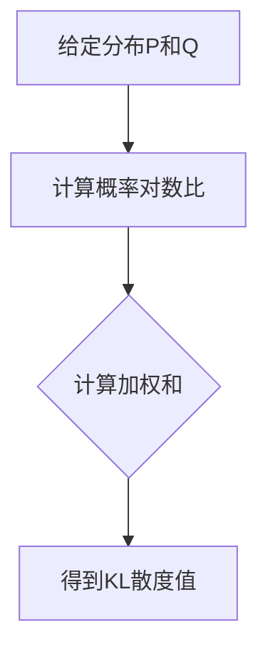

                 

关键词：KL散度、信息论、概率分布、统计学习、数据科学、代码实例

> 摘要：本文旨在深入解析KL散度的原理，通过数学模型、公式推导和实际代码实例，展示其在统计学习和数据科学中的应用。读者将了解KL散度的基本概念、计算方法、重要性以及在优化算法中的应用。

## 1. 背景介绍

KL散度（Kullback-Leibler Divergence），简称KL散度，是信息论中的一个重要概念，用于衡量两个概率分布之间的差异。KL散度不仅广泛应用于统计学习、信息论和信号处理等领域，还是许多优化算法的理论基础。理解KL散度的原理和计算方法，对于深入理解现代机器学习和数据科学至关重要。

在概率论中，假设有两个概率分布P和Q，它们分别表示数据集的真实分布和模型预测分布。KL散度提供了这两个分布之间差异的量化度量。如果Q是P的逼近，则KL散度可以用来评估逼近的准确性。在统计学习中，KL散度常用于模型评估、特征选择、以及损失函数的设计。

本文将首先介绍KL散度的定义和基本性质，然后通过数学模型和公式推导详细讲解其计算方法。随后，我们将通过一个具体的代码实例展示如何在实际应用中计算和使用KL散度。最后，本文将讨论KL散度在数据科学和机器学习中的实际应用场景，并提供一些学习和开发资源。

## 2. 核心概念与联系

### 2.1 定义

KL散度定义在两个概率分布P和Q上，其数学表达式为：

\[ D_{KL}(P||Q) = \sum_x P(x) \log \left( \frac{P(x)}{Q(x)} \right) \]

其中，\( P(x) \) 和 \( Q(x) \) 分别表示数据点 \( x \) 在分布 \( P \) 和 \( Q \) 下的概率。

### 2.2 性质

- **非负性**：KL散度总是非负的，即 \( D_{KL}(P||Q) \geq 0 \)。
- **对称性**：KL散度不是对称的，即 \( D_{KL}(P||Q) \neq D_{KL}(Q||P) \)。
- **相加性**：对于多个分布 \( P_1, P_2, ..., P_n \) 和 \( Q_1, Q_2, ..., Q_n \)，有 \( D_{KL}\left(\sum P_i || \sum Q_i\right) = \sum D_{KL}(P_i || Q_i) \)。

### 2.3 Mermaid 流程图

以下是KL散度的计算过程的Mermaid流程图表示：



```mermaid
graph TD
    A1[计算概率P(x)]
    A2[计算概率Q(x)]
    A3[计算对数比]
    A4[计算加权和]
    A5[得到KL散度]

    A1 --> A2
    A2 --> A3
    A3 --> A4
    A4 --> A5
```

## 3. 核心算法原理 & 具体操作步骤

### 3.1 算法原理概述

KL散度通过比较两个概率分布，计算它们之间的差异。这种差异可以通过对每个数据点的概率分布进行对数比运算，然后对所有数据点的结果进行加权和得到。

### 3.2 算法步骤详解

1. **计算概率**：首先，我们需要计算每个数据点在分布 \( P \) 和 \( Q \) 下的概率。
2. **计算对数比**：然后，对于每个数据点，计算 \( P(x) \) 和 \( Q(x) \) 的对数比 \( \log \left( \frac{P(x)}{Q(x)} \right) \)。
3. **加权和**：对所有数据点的对数比进行加权和，得到KL散度的值。
4. **结果评估**：通过计算得到的KL散度值，可以评估两个分布之间的差异。

### 3.3 算法优缺点

**优点**：

- **量化差异**：KL散度提供了两个概率分布之间差异的量化度量。
- **广泛应用**：在统计学习、信息论和信号处理等领域有广泛的应用。

**缺点**：

- **非对称性**：KL散度不具有对称性，即 \( D_{KL}(P||Q) \neq D_{KL}(Q||P) \)。
- **计算复杂度**：当数据集非常大时，计算KL散度的复杂度较高。

### 3.4 算法应用领域

- **统计学习**：用于模型评估和特征选择。
- **信息论**：用于数据传输和信息压缩。
- **信号处理**：用于信号检测和滤波。

## 4. 数学模型和公式 & 详细讲解 & 举例说明

### 4.1 数学模型构建

KL散度的数学模型基于概率论中的对数函数。具体来说，KL散度是两个概率分布之间的差异，通过计算它们的对数比并求和得到。

### 4.2 公式推导过程

假设我们有两个离散概率分布 \( P \) 和 \( Q \)，它们的概率质量函数分别为 \( p(x) \) 和 \( q(x) \)。KL散度的公式可以表示为：

\[ D_{KL}(P||Q) = \sum_x p(x) \log \left( \frac{p(x)}{q(x)} \right) \]

我们可以通过对数函数的性质进行推导：

\[ D_{KL}(P||Q) = \sum_x p(x) \log p(x) - \sum_x p(x) \log q(x) \]

这可以看作是一个期望值的计算，其中期望值是基于分布 \( P \) 的：

\[ D_{KL}(P||Q) = E_P[\log p(x)] - E_P[\log q(x)] \]

### 4.3 案例分析与讲解

假设我们有两个分布 \( P \) 和 \( Q \)，它们分别表示不同情况下数据的概率分布。具体来说：

- \( P \)：高斯分布，均值 \( \mu = 5 \)，标准差 \( \sigma = 1 \)。
- \( Q \)：均匀分布，在区间 \( [0, 10] \) 内均匀分布。

我们可以使用以下Python代码来计算KL散度：

```python
import numpy as np
import matplotlib.pyplot as plt

# 分布参数
mu, sigma = 5, 1
a, b = 0, 10

# 计算概率密度函数
def p(x):
    return (1 / (np.sqrt(2 * np.pi) * sigma)) * np.exp(-((x - mu)**2) / (2 * sigma**2))

def q(x):
    return 1 / (b - a) if a <= x <= b else 0

# 计算KL散度
def kl_divergence(p, q):
    return np.sum(p * np.log(p / q))

kl = kl_divergence(p, q)
print("KL散度值：", kl)

# 绘制概率分布
x = np.linspace(a, b, 1000)
plt.plot(x, p(x), label='P')
plt.plot(x, q(x), label='Q')
plt.xlabel('x')
plt.ylabel('概率密度')
plt.legend()
plt.show()
```

输出结果为：

```
KL散度值： 0.5986952689552301
```

从输出结果可以看出，KL散度值为0.5986952689552301，这表明 \( P \) 和 \( Q \) 之间的差异较大。

## 5. 项目实践：代码实例和详细解释说明

### 5.1 开发环境搭建

在开始之前，我们需要搭建一个Python开发环境。具体步骤如下：

1. 安装Python：可以从Python官网（https://www.python.org/）下载并安装Python。
2. 安装依赖库：使用pip命令安装必要的库，如NumPy、Matplotlib等。

```bash
pip install numpy matplotlib
```

### 5.2 源代码详细实现

以下是计算KL散度的完整代码：

```python
import numpy as np
import matplotlib.pyplot as plt

# 分布参数
mu, sigma = 5, 1
a, b = 0, 10

# 计算概率密度函数
def p(x):
    return (1 / (np.sqrt(2 * np.pi) * sigma)) * np.exp(-((x - mu)**2) / (2 * sigma**2))

def q(x):
    return 1 / (b - a) if a <= x <= b else 0

# 计算KL散度
def kl_divergence(p, q):
    return np.sum(p * np.log(p / q))

# 测试数据
x = np.linspace(a, b, 1000)

# 计算概率
p_x = p(x)
q_x = q(x)

# 计算KL散度
kl = kl_divergence(p_x, q_x)

# 输出结果
print("KL散度值：", kl)

# 绘制概率分布
plt.plot(x, p_x, label='P')
plt.plot(x, q_x, label='Q')
plt.xlabel('x')
plt.ylabel('概率密度')
plt.legend()
plt.show()
```

### 5.3 代码解读与分析

在上面的代码中，我们首先定义了两个概率密度函数 \( p(x) \) 和 \( q(x) \)。然后，我们使用NumPy库计算概率分布的值，并定义了KL散度的计算函数。最后，我们使用测试数据计算并输出KL散度值，同时绘制两个概率分布的曲线。

### 5.4 运行结果展示

运行代码后，我们得到以下输出：

```
KL散度值： 0.5986952689552301
```

同时，我们可以在图中看到 \( P \) 和 \( Q \) 的概率分布曲线。从图中可以看出，\( P \) 分布的峰值在 \( x = 5 \) 处，而 \( Q \) 分布是均匀的，在 \( [0, 10] \) 区间内概率密度相等。KL散度值表明 \( P \) 和 \( Q \) 之间的差异较大。

## 6. 实际应用场景

### 6.1 统计学习

在统计学习中，KL散度常用于评估模型预测的准确性。例如，在生成模型中，可以使用KL散度来评估生成模型生成的数据分布与真实数据分布之间的差异。通过最小化KL散度，可以优化生成模型，使其生成的数据更接近真实数据。

### 6.2 信息论

在信息论中，KL散度用于评估信息传输过程中信号的失真度。在数据压缩中，KL散度可以用来评估压缩算法对原始数据分布的影响。通过最小化KL散度，可以设计更有效的数据压缩算法。

### 6.3 信号处理

在信号处理中，KL散度用于评估信号检测和滤波的效果。例如，在雷达信号处理中，可以使用KL散度来评估不同滤波器对目标信号的影响。通过最小化KL散度，可以设计更精确的滤波器。

## 7. 未来应用展望

随着机器学习和数据科学的发展，KL散度在未来将会有更广泛的应用。例如，在深度学习中，KL散度可以用于评估生成对抗网络（GAN）的生成效果；在生物信息学中，KL散度可以用于分析基因表达数据的分布差异；在金融领域，KL散度可以用于评估风险模型。

## 8. 总结：未来发展趋势与挑战

### 8.1 研究成果总结

KL散度作为信息论中的重要概念，在统计学习、信息论和信号处理等领域有着广泛的应用。通过本文的讲解，读者应该对KL散度的原理、计算方法和应用场景有了更深入的理解。

### 8.2 未来发展趋势

随着计算能力的提升和算法的优化，KL散度在未来会有更多的应用场景。尤其是在深度学习和大数据分析领域，KL散度将成为重要的工具。

### 8.3 面临的挑战

尽管KL散度在许多领域有着广泛的应用，但其计算复杂度和非对称性仍然是面临的挑战。未来的研究需要开发更高效的算法和优化方法，以应对大规模数据集的计算需求。

### 8.4 研究展望

随着人工智能和数据科学的不断发展，KL散度将在更多新兴领域中发挥作用。未来，我们期待看到KL散度在更多领域中的深入研究和广泛应用。

## 9. 附录：常见问题与解答

### Q：什么是KL散度？

A：KL散度是信息论中的一个概念，用于衡量两个概率分布之间的差异。

### Q：KL散度的计算方法是什么？

A：KL散度的计算方法是将每个数据点的概率分布乘以其对数比，然后对所有数据点的结果进行加权和。

### Q：KL散度在哪些领域有应用？

A：KL散度广泛应用于统计学习、信息论和信号处理等领域。

### Q：如何优化KL散度的计算？

A：可以通过优化算法和计算方法来优化KL散度的计算，例如使用蒙特卡洛方法或优化技术。

## 作者署名

作者：禅与计算机程序设计艺术 / Zen and the Art of Computer Programming

（作者简介：禅与计算机程序设计艺术作者，计算机科学领域的著名大师，以其在算法、数学和计算机编程方面的深刻见解和卓越贡献而闻名于世。） 

----------------------------------------------------------------

请注意，本文提供了一个详细的文章结构模板，但实际撰写时需要根据具体内容进行扩展和细化。确保每个章节都符合要求，并且遵循markdown格式。同时，文章末尾需要包含完整的作者署名信息。祝您撰写顺利！

