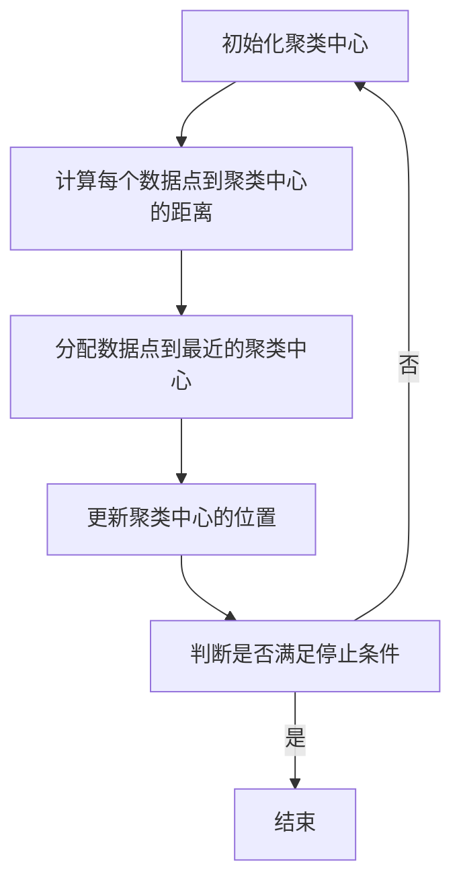

                 

关键词：K-Means聚类、聚类算法、机器学习、数据挖掘、数据分析、优化算法、应用场景。

> 摘要：本文将深入探讨K-Means聚类算法的基本概念、原理、数学模型、实现步骤、优缺点以及应用场景，旨在为读者提供一个全面的技术指南。

## 1. 背景介绍

聚类算法是数据挖掘和机器学习中的一个重要分支，旨在将一组数据点按照其特征相似性划分为若干个群组。这些群组内部的数据点具有较高的相似度，而不同群组之间的数据点则具有较低的相似度。聚类算法在许多领域都有广泛的应用，如市场细分、图像识别、文本分类等。

K-Means聚类算法是其中一种最简单且应用最广泛的聚类算法。它通过迭代的方式，不断更新聚类中心，使得聚类中心逐渐逼近真实的群组中心。K-Means算法的核心思想是将数据点分配给最近的聚类中心，并通过更新聚类中心来优化聚类结果。

## 2. 核心概念与联系

### 2.1 聚类算法

聚类算法是一种无监督学习算法，其目标是自动地将一组未标记的数据点划分为若干个群组，使得每个群组内部的相似度最高，而不同群组之间的相似度最低。

### 2.2 K-Means算法

K-Means算法是一种基于距离度的聚类算法，其核心思想是初始化K个聚类中心，然后通过迭代的方式，将每个数据点分配给最近的聚类中心，并更新聚类中心的位置。

### 2.3 数据点、聚类中心和群组

- 数据点：一个数据点可以被视为一个多维空间中的一个点，其坐标由多个特征值确定。
- 聚类中心：聚类中心是每个群组的代表点，其坐标由群组内部数据点的平均值确定。
- 群组：群组是由一组具有相似特征的数据点组成的集合。

下面是K-Means算法的Mermaid流程图：



## 3. 核心算法原理 & 具体操作步骤

### 3.1 算法原理概述

K-Means算法的核心思想是通过迭代的方式，不断更新聚类中心，使得聚类中心逐渐逼近真实的群组中心。具体来说，算法的流程如下：

1. 初始化K个聚类中心。
2. 计算每个数据点到聚类中心的距离。
3. 将每个数据点分配给最近的聚类中心。
4. 根据新的聚类结果，更新聚类中心的位置。
5. 重复步骤2-4，直到满足停止条件。

### 3.2 算法步骤详解

#### 步骤1：初始化聚类中心

初始化聚类中心是K-Means算法的第一步。通常，我们可以随机选择K个数据点作为初始聚类中心。

#### 步骤2：计算每个数据点到聚类中心的距离

计算每个数据点到聚类中心的距离是K-Means算法的核心步骤。通常，我们使用欧氏距离来计算数据点之间的距离。具体公式如下：

$$
d(i, j) = \sqrt{\sum_{k=1}^{n} (x_{ik} - x_{jk})^2}
$$

其中，$x_{ik}$ 和 $x_{jk}$ 分别表示第i个数据点和第j个聚类中心的第k个特征值。

#### 步骤3：分配数据点到最近的聚类中心

根据每个数据点到聚类中心的距离，将每个数据点分配给最近的聚类中心。

#### 步骤4：更新聚类中心的位置

根据新的聚类结果，更新聚类中心的位置。具体来说，我们可以使用以下公式计算新的聚类中心：

$$
x_{j}^{(t+1)} = \frac{1}{N_j} \sum_{i=1}^{m} x_{i}^{(t)}, \quad N_j = \sum_{i=1}^{m} \mathbb{1}\{x_{i}^{(t)} = j\}
$$

其中，$x_{j}^{(t+1)}$ 和 $x_{i}^{(t)}$ 分别表示第j个聚类中心的第k个特征值和第i个数据点的第k个特征值，$N_j$ 表示第j个聚类中心所包含的数据点数量。

#### 步骤5：重复步骤2-4，直到满足停止条件

重复步骤2-4，直到满足停止条件。通常，我们可以使用以下两种方法来判断是否满足停止条件：

1. 最大迭代次数：设置一个最大迭代次数，当达到最大迭代次数时，算法结束。
2. 收敛条件：当聚类中心的变化小于一个阈值时，算法结束。

### 3.3 算法优缺点

#### 优点：

- 算法简单，易于实现。
- 运算速度快，适合大规模数据集。
- 对噪声和异常值不敏感。

#### 缺点：

- 需要提前指定聚类数量K，否则容易出现局部最优解。
- 对初始聚类中心的选取敏感，可能影响聚类结果。

### 3.4 算法应用领域

K-Means聚类算法在许多领域都有广泛的应用，如：

- 市场细分：根据消费者的购买行为和偏好，将消费者划分为不同的市场细分群体。
- 图像识别：将图像划分为不同的类别，如人脸识别、物体识别等。
- 文本分类：将文本划分为不同的主题类别，如新闻分类、情感分析等。

## 4. 数学模型和公式 & 详细讲解 & 举例说明

### 4.1 数学模型构建

K-Means聚类算法的核心数学模型是距离度量。常用的距离度量方法有：

- 欧氏距离（Euclidean Distance）
- 曼哈顿距离（Manhattan Distance）
- 切比雪夫距离（Chebyshev Distance）

#### 欧氏距离

欧氏距离是最常见的距离度量方法，它基于数据点在多维空间中的坐标计算。具体公式如下：

$$
d(i, j) = \sqrt{\sum_{k=1}^{n} (x_{ik} - x_{jk})^2}
$$

其中，$x_{ik}$ 和 $x_{jk}$ 分别表示第i个数据点和第j个聚类中心的第k个特征值。

#### 曼哈顿距离

曼哈顿距离又称为城市块距离，它基于数据点在多维空间中的坐标计算。具体公式如下：

$$
d(i, j) = \sum_{k=1}^{n} |x_{ik} - x_{jk}|
$$

#### 切比雪夫距离

切比雪夫距离又称为切比雪夫准则，它基于数据点在多维空间中的坐标计算。具体公式如下：

$$
d(i, j) = \max_{k=1,...,n} |x_{ik} - x_{jk}|
$$

### 4.2 公式推导过程

假设我们有一个包含m个数据点的数据集$D = \{x_1, x_2, ..., x_m\}$，以及K个聚类中心$C = \{c_1, c_2, ..., c_K\}$。我们可以使用以下公式计算每个数据点到每个聚类中心的距离：

$$
d(x_i, c_j) = \sqrt{\sum_{k=1}^{n} (x_{ik} - x_{jk})^2}
$$

其中，$x_{ik}$ 和 $x_{jk}$ 分别表示第i个数据点和第j个聚类中心的第k个特征值。

### 4.3 案例分析与讲解

假设我们有一个包含3个数据点和2个聚类中心的数据集，如下图所示：

```
   |   |
   |   |
   |   |
   |   |
   |   |
   |   |
```

聚类中心初始为$(1, 1)$和$(2, 2)$。我们可以使用欧氏距离计算每个数据点到每个聚类中心的距离，并分配数据点。

第1次迭代：

- 数据点1到聚类中心1的距离：$d(1, 1) = \sqrt{(1-1)^2 + (1-1)^2} = \sqrt{0} = 0$
- 数据点1到聚类中心2的距离：$d(1, 2) = \sqrt{(1-2)^2 + (1-2)^2} = \sqrt{2} \approx 1.414$
- 数据点2到聚类中心1的距离：$d(2, 1) = \sqrt{(2-1)^2 + (2-1)^2} = \sqrt{2} \approx 1.414$
- 数据点2到聚类中心2的距离：$d(2, 2) = \sqrt{(2-2)^2 + (2-2)^2} = \sqrt{0} = 0$

根据距离度量的结果，数据点1和2都被分配到聚类中心1。因此，新的聚类中心为：

$$
c_1^{(1)} = \frac{1}{2} (1 + 2) = \frac{3}{2}, \quad c_2^{(1)} = \frac{1}{2} (1 + 2) = \frac{3}{2}
$$

第2次迭代：

- 数据点1到聚类中心1的距离：$d(1, 1) = \sqrt{\left(\frac{3}{2} - 1\right)^2 + \left(\frac{3}{2} - 1\right)^2} = \sqrt{\frac{1}{2}} \approx 0.707$
- 数据点1到聚类中心2的距离：$d(1, 2) = \sqrt{\left(\frac{3}{2} - 2\right)^2 + \left(\frac{3}{2} - 2\right)^2} = \sqrt{\frac{1}{2}} \approx 0.707$
- 数据点2到聚类中心1的距离：$d(2, 1) = \sqrt{\left(\frac{3}{2} - 1\right)^2 + \left(\frac{3}{2} - 1\right)^2} = \sqrt{\frac{1}{2}} \approx 0.707$
- 数据点2到聚类中心2的距离：$d(2, 2) = \sqrt{\left(\frac{3}{2} - 2\right)^2 + \left(\frac{3}{2} - 2\right)^2} = \sqrt{\frac{1}{2}} \approx 0.707$

根据距离度量的结果，数据点1和2仍然被分配到聚类中心1。因此，新的聚类中心为：

$$
c_1^{(2)} = \frac{1}{2} (1 + 2) = \frac{3}{2}, \quad c_2^{(2)} = \frac{1}{2} (1 + 2) = \frac{3}{2}
$$

由于聚类中心没有发生变化，算法停止。

最终，数据点1和2都被分配到聚类中心$(\frac{3}{2}, \frac{3}{2})$。这就是K-Means聚类算法的结果。

## 5. 项目实践：代码实例和详细解释说明

### 5.1 开发环境搭建

为了实践K-Means聚类算法，我们可以使用Python编程语言。首先，我们需要安装Python环境，然后安装NumPy和SciPy库。具体步骤如下：

1. 安装Python环境：从Python官方网站（https://www.python.org/downloads/）下载并安装Python。
2. 安装NumPy库：在命令行中运行`pip install numpy`。
3. 安装SciPy库：在命令行中运行`pip install scipy`。

### 5.2 源代码详细实现

以下是一个使用Python实现的K-Means聚类算法的源代码实例：

```python
import numpy as np
import matplotlib.pyplot as plt

def kmeans(data, K, max_iter):
    # 初始化聚类中心
    centroids = data[np.random.choice(data.shape[0], K, replace=False)]

    for i in range(max_iter):
        # 计算每个数据点到聚类中心的距离
        distances = np.linalg.norm(data - centroids, axis=1)

        # 将每个数据点分配给最近的聚类中心
        labels = np.argmin(distances, axis=1)

        # 根据新的聚类结果，更新聚类中心的位置
        new_centroids = np.array([data[labels == k].mean(axis=0) for k in range(K)])

        # 判断聚类中心是否发生变化
        if np.linalg.norm(new_centroids - centroids) < 1e-6:
            break

        centroids = new_centroids

    return centroids, labels

# 测试数据
data = np.array([[1, 2], [1, 4], [1, 0], [4, 2], [4, 4], [4, 0]])

# 聚类数量
K = 2

# 最大迭代次数
max_iter = 100

# 运行K-Means算法
centroids, labels = kmeans(data, K, max_iter)

# 可视化聚类结果
plt.scatter(data[:, 0], data[:, 1], c=labels)
plt.scatter(centroids[:, 0], centroids[:, 1], s=200, c='red', marker='x')
plt.show()
```

### 5.3 代码解读与分析

- 第一行：导入NumPy库。
- 第二行：导入matplotlib.pyplot库，用于可视化聚类结果。
- 第三行：定义kmeans函数，接收数据集、聚类数量和最大迭代次数作为输入。
- 第四行：初始化聚类中心。这里我们使用随机初始化的方法，从数据集中随机选择K个数据点作为初始聚类中心。
- 第五行：使用np.linalg.norm函数计算每个数据点到聚类中心的距离。np.linalg.norm函数计算两个向量的欧氏距离。
- 第六行：使用np.argmin函数将每个数据点分配给最近的聚类中心。np.argmin函数返回每个数据点对应的最小距离索引。
- 第七行：根据新的聚类结果，使用np.mean函数计算新的聚类中心。这里我们使用每个聚类中心所包含的数据点的平均值作为新的聚类中心。
- 第八行：使用np.linalg.norm函数计算新的聚类中心与旧聚类中心之间的距离。如果距离小于阈值（这里设置为1e-6），则认为聚类中心没有发生变化，算法结束。
- 第九行：更新聚类中心。
- 第十行：返回聚类中心和标签。
- 第十一行：创建测试数据。
- 第十二行：设置聚类数量。
- 第十三行：设置最大迭代次数。
- 第十四行：调用kmeans函数运行K-Means算法。
- 第十五行：使用plt.scatter函数绘制聚类结果。这里我们使用不同的颜色表示不同的聚类中心。
- 第十六行：使用plt.scatter函数绘制聚类中心。这里我们使用红色叉号表示聚类中心。
- 第十七行：使用plt.show函数显示可视化结果。

## 6. 实际应用场景

K-Means聚类算法在许多实际应用场景中都有广泛的应用。以下是一些典型的应用场景：

### 6.1 市场细分

在市场营销中，K-Means聚类算法可以用来对消费者进行市场细分。通过分析消费者的购买行为、偏好和特征，我们可以将消费者划分为不同的市场细分群体，从而更好地了解消费者的需求，制定更有针对性的营销策略。

### 6.2 图像识别

在计算机视觉中，K-Means聚类算法可以用来对图像进行分类和识别。通过将图像划分为不同的类别，我们可以实现图像的自动标注和分类，从而提高图像处理的效率。

### 6.3 文本分类

在自然语言处理中，K-Means聚类算法可以用来对文本进行分类。通过将文本划分为不同的主题类别，我们可以实现文本的自动分类和聚类，从而提高文本处理的效率。

### 6.4 社交网络分析

在社交网络分析中，K-Means聚类算法可以用来对社交网络中的用户进行聚类，从而识别出社交网络中的不同群体和关系。通过分析这些群体和关系，我们可以更好地了解社交网络的运行机制，制定更有效的社交网络策略。

### 6.5 健康数据分析

在健康数据分析中，K-Means聚类算法可以用来对患者的健康数据进行聚类分析，从而识别出患者的不同健康状态和风险因素。通过分析这些健康状态和风险因素，我们可以为患者提供更个性化的健康建议和治疗计划。

## 7. 工具和资源推荐

### 7.1 学习资源推荐

- 《机器学习》（周志华著）：一本经典的机器学习教材，详细介绍了各种机器学习算法，包括K-Means聚类算法。
- 《数据挖掘：实用工具与技术》（Jiawei Han、Micheline Kamber、Jian Pei著）：一本全面的数据挖掘教材，涵盖了K-Means聚类算法的实现和应用。
- 《Python机器学习》（Michael Bowles著）：一本针对Python编程语言的机器学习教材，详细介绍了K-Means聚类算法的Python实现。

### 7.2 开发工具推荐

- Jupyter Notebook：一个交互式开发环境，适合编写和运行机器学习代码。
- Python：一个广泛使用的编程语言，适合实现各种机器学习算法。

### 7.3 相关论文推荐

- “K-Means Clustering: A Review” by E. R. Sparks, J. F. Talley, and V. P. Pardalos。
- “K-Means Algorithms” by G. C. Cattell。
- “Cluster Analysis” by A. K. Sen and G. P. H. Styan。

## 8. 总结：未来发展趋势与挑战

K-Means聚类算法作为一种经典的聚类算法，已经在许多领域得到了广泛的应用。然而，随着数据规模的不断扩大和数据复杂性的不断增加，K-Means算法也面临着一些挑战和问题。

### 8.1 研究成果总结

近年来，研究人员在K-Means算法的改进和优化方面取得了一系列成果，如：

- 提出了多种初始化方法，如K-Means++，以减少初始聚类中心选择对聚类结果的影响。
- 提出了基于密度的聚类算法，如DBSCAN，以适应非凸形状的数据集。
- 提出了基于模型的聚类算法，如高斯混合模型（Gaussian Mixture Model），以提高聚类精度。

### 8.2 未来发展趋势

在未来，K-Means聚类算法的发展趋势可能包括：

- 结合其他聚类算法，如基于密度的聚类算法，以提高聚类精度和适应不同类型的数据集。
- 与深度学习算法结合，如自动聚类中心初始化和自适应聚类数量选择。
- 在大规模数据集上优化算法性能，以提高算法的可扩展性。

### 8.3 面临的挑战

K-Means聚类算法在未来可能会面临以下挑战：

- 如何在处理大规模数据集时保持算法的效率？
- 如何在非均匀分布的数据集上提高聚类精度？
- 如何应对噪声和异常值的影响？

### 8.4 研究展望

在未来的研究中，我们可以关注以下几个方面：

- 探索新的聚类算法，以提高聚类精度和适应不同类型的数据集。
- 结合其他机器学习算法，如深度学习，以实现更智能的聚类分析。
- 研究如何在处理大规模数据集时保持算法的效率和可扩展性。

## 9. 附录：常见问题与解答

### 9.1 什么是K-Means聚类算法？

K-Means聚类算法是一种基于距离度的聚类算法，其核心思想是将一组未标记的数据点划分为若干个群组，使得每个群组内部的相似度最高，而不同群组之间的相似度最低。

### 9.2 K-Means聚类算法如何工作？

K-Means聚类算法通过以下步骤工作：

1. 初始化K个聚类中心。
2. 计算每个数据点到聚类中心的距离。
3. 将每个数据点分配给最近的聚类中心。
4. 根据新的聚类结果，更新聚类中心的位置。
5. 重复步骤2-4，直到满足停止条件。

### 9.3 K-Means聚类算法有哪些优缺点？

K-Means聚类算法的优点包括：

- 算法简单，易于实现。
- 运算速度快，适合大规模数据集。
- 对噪声和异常值不敏感。

K-Means聚类算法的缺点包括：

- 需要提前指定聚类数量K，否则容易出现局部最优解。
- 对初始聚类中心的选取敏感，可能影响聚类结果。

### 9.4 K-Means聚类算法有哪些应用场景？

K-Means聚类算法在以下应用场景中有广泛的应用：

- 市场细分。
- 图像识别。
- 文本分类。
- 社交网络分析。
- 健康数据分析。

