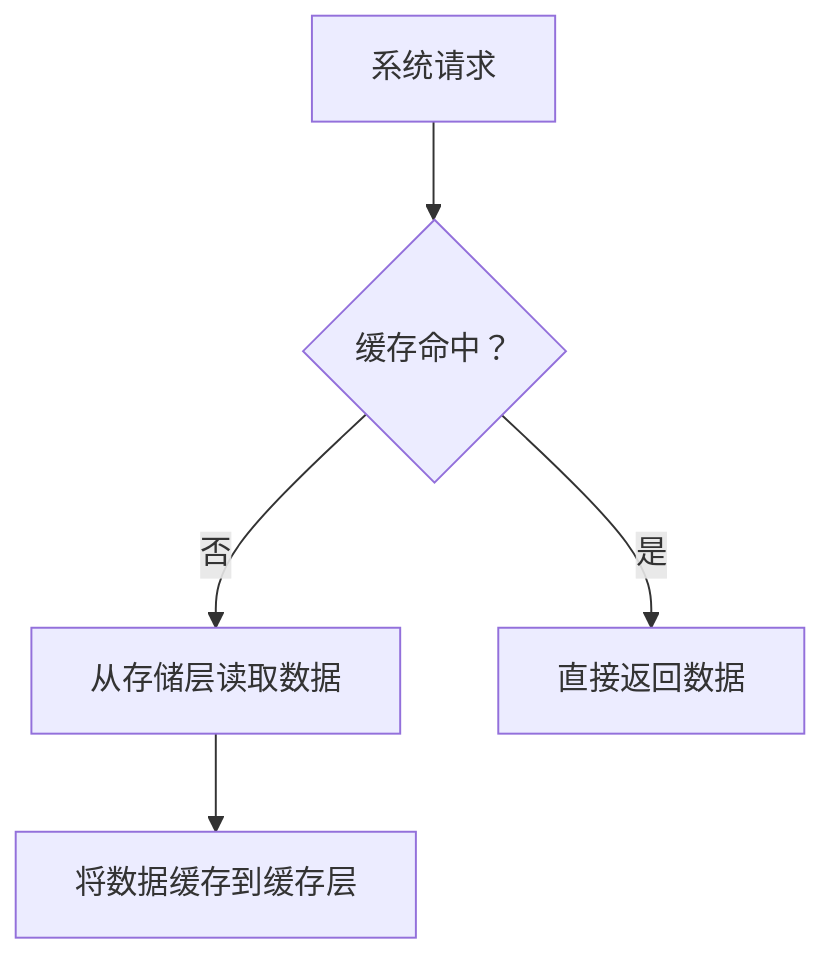

                 

 关键词：KV-Cache，推理效率，缓存技术，数据存储，计算机架构

> 摘要：本文深入探讨了KV-Cache技术，作为一种提升计算机推理效率的关键技术。通过对其背景、核心概念、算法原理、数学模型及应用实例的详细解析，阐述了KV-Cache在实际应用中的优势与挑战，并展望了其未来的发展趋势。本文旨在为读者提供全面、系统的KV-Cache知识，助力其在实际项目中的高效应用。

## 1. 背景介绍

随着大数据、云计算和人工智能技术的迅猛发展，计算机系统的数据处理需求日益增长。推理（Inference）作为人工智能领域的一项核心任务，其效率直接关系到系统的性能和用户体验。传统的数据处理方法，如直接访问数据库或内存，往往存在响应时间过长、数据读取频繁等问题，难以满足高效的推理需求。

为了解决这一问题，KV-Cache（Key-Value Cache）技术应运而生。KV-Cache通过在内存中存储常用的数据对（Key-Value Pair），实现快速的数据访问，从而大大提高了系统的推理效率。这种缓存技术已经被广泛应用于数据库、Web缓存、分布式存储等领域，成为提升系统性能的重要手段。

本文将重点探讨KV-Cache技术的核心概念、算法原理、数学模型以及实际应用场景，旨在为读者提供全面的了解和实用的指导。

## 2. 核心概念与联系

### 2.1. KV-Cache的定义

KV-Cache，即Key-Value Cache，是一种基于键值对的缓存技术。在KV-Cache中，数据以键值对的形式存储，其中Key是数据的唯一标识，Value是实际的数据内容。这种数据结构简单、直观，便于快速查找和操作。

### 2.2. KV-Cache与传统数据库的对比

传统数据库通常采用复杂的查询语言（如SQL）进行数据操作，而KV-Cache则通过简单的键值查找实现数据访问。KV-Cache的优点在于数据访问速度快、延迟低，但缺点是数据查询功能相对有限。

### 2.3. KV-Cache的架构

KV-Cache的架构通常包括以下几个关键部分：

- **缓存层（Cache Layer）**：负责存储常用的数据对，实现快速访问。
- **存储层（Storage Layer）**：负责数据的持久化存储，如磁盘或分布式存储系统。
- **缓存策略（Cache Policy）**：决定哪些数据应该被缓存，以及如何管理缓存空间。

### 2.4. KV-Cache的工作原理

当系统需要访问数据时，KV-Cache首先在缓存层查找，如果命中则直接返回数据；如果未命中，则从存储层读取数据，并将该数据对缓存到缓存层，以备下次访问。

### 2.5. Mermaid流程图

以下是一个简单的KV-Cache流程图：



## 3. 核心算法原理 & 具体操作步骤

### 3.1. 算法原理概述

KV-Cache的核心算法主要涉及缓存策略和数据检索。缓存策略决定了哪些数据应该被缓存，以及如何管理缓存空间。数据检索则是通过Key快速查找Value。

### 3.2. 算法步骤详解

1. **数据存储**：将数据对（Key-Value）存储到缓存层。
2. **数据检索**：当系统请求数据时，通过Key在缓存层进行查找。
3. **缓存命中**：如果缓存命中，则直接返回Value。
4. **缓存未命中**：如果缓存未命中，则从存储层读取数据，并将其缓存到缓存层。
5. **缓存管理**：根据缓存策略，对缓存进行更新、替换等操作，以保持缓存的有效性。

### 3.3. 算法优缺点

**优点**：

- **快速访问**：通过缓存层实现数据的快速访问，降低了系统的延迟。
- **高效存储**：缓存层通常采用内存存储，相比磁盘存储具有更高的读写速度。

**缺点**：

- **数据一致性问题**：缓存与存储层的数据一致性需要特别处理，如使用缓存同步机制。
- **缓存失效**：缓存的有效期管理需要精心设计，以避免缓存过时而无法命中。

### 3.4. 算法应用领域

KV-Cache技术广泛应用于以下几个方面：

- **数据库缓存**：加速数据库查询，提高系统性能。
- **Web缓存**：缓存网页内容，减少用户访问延迟。
- **分布式存储**：提高数据访问速度，降低网络负载。

## 4. 数学模型和公式 & 详细讲解 & 举例说明

### 4.1. 数学模型构建

在KV-Cache中，常用的数学模型包括缓存命中率、缓存容量和缓存策略等。

- **缓存命中率**：衡量缓存有效性的重要指标，计算公式为：
  $$\text{缓存命中率} = \frac{\text{缓存命中次数}}{\text{总访问次数}}$$

- **缓存容量**：缓存层能够存储的数据量，通常与系统性能和成本相关。

- **缓存策略**：决定缓存哪些数据以及如何管理缓存空间，常见的缓存策略包括LRU（Least Recently Used）和LFU（Least Frequently Used）等。

### 4.2. 公式推导过程

以LRU缓存策略为例，其核心思想是缓存最近使用的数据。具体推导过程如下：

1. **初始化**：将缓存容量设置为C，缓存中的数据对（Key-Value）数量为0。

2. **访问数据**：当系统访问数据时，检查缓存中是否存在该数据。

3. **缓存命中**：如果缓存命中，将访问次数更新为当前时间戳。

4. **缓存未命中**：如果缓存未命中，则从存储层读取数据，并将其添加到缓存中，同时更新缓存容量。

5. **缓存替换**：当缓存容量达到C时，将最近未访问的数据替换出缓存。

### 4.3. 案例分析与讲解

假设一个系统使用LRU缓存策略，缓存容量为10。以下是一个简单的数据访问序列及其处理过程：

- `Key1, Key2, Key3, Key4, Key5, Key6, Key1, Key2, Key3, Key7`

**缓存处理过程**：

1. 初始化缓存：`[]`
2. 访问Key1：缓存未命中，添加到缓存：`[Key1]`
3. 访问Key2：缓存未命中，添加到缓存：`[Key1, Key2]`
4. 访问Key3：缓存未命中，添加到缓存：`[Key1, Key2, Key3]`
5. 访问Key4：缓存未命中，添加到缓存：`[Key1, Key2, Key3, Key4]`
6. 访问Key5：缓存未命中，添加到缓存：`[Key1, Key2, Key3, Key4, Key5]`
7. 访问Key6：缓存未命中，替换Key1：`[Key2, Key3, Key4, Key5, Key6]`
8. 访问Key1：缓存未命中，替换Key2：`[Key3, Key4, Key5, Key6, Key1]`
9. 访问Key2：缓存未命中，替换Key3：`[Key4, Key5, Key6, Key1, Key2]`
10. 访问Key3：缓存未命中，替换Key4：`[Key5, Key6, Key1, Key2, Key3]`
11. 访问Key7：缓存未命中，替换Key5：`[Key6, Key1, Key2, Key3, Key7]`

通过上述处理过程，我们可以看到LRU缓存策略在保持缓存新鲜度的同时，实现了对数据的快速访问。

## 5. 项目实践：代码实例和详细解释说明

### 5.1. 开发环境搭建

在本节中，我们将使用Python语言实现一个简单的KV-Cache。首先，确保已经安装了Python环境。然后，可以通过以下命令安装必要的库：

```bash
pip install python-memcached
```

### 5.2. 源代码详细实现

以下是实现KV-Cache的核心代码：

```python
import memcache
import time

class KVCache:
    def __init__(self, servers=['127.0.0.1:11211'], timeout=1.0):
        self.client = memcache.Client(servers, debug=0)
        self.timeout = timeout

    def get(self, key):
        return self.client.get(key)

    def set(self, key, value, timeout=None):
        if timeout is None:
            timeout = self.timeout
        return self.client.set(key, value, timeout)

    def delete(self, key):
        return self.client.delete(key)

if __name__ == "__main__":
    cache = KVCache()

    # 设置数据
    cache.set('key1', 'value1', timeout=5)
    cache.set('key2', 'value2', timeout=5)

    # 获取数据
    value1 = cache.get('key1')
    value2 = cache.get('key2')

    print(f"Value of key1: {value1}")
    print(f"Value of key2: {value2}")

    # 删除数据
    cache.delete('key1')
    value1 = cache.get('key1')
    print(f"Value of key1 after delete: {value1}")
```

### 5.3. 代码解读与分析

- **类定义**：`KVCache` 类定义了KV-Cache的基本功能，包括设置（`set`）、获取（`get`）和删除（`delete`）数据。
- **初始化**：通过`memcache.Client`创建客户端，连接到Memcached服务器。
- **设置数据**：使用`set`方法将数据对存储到缓存中，并设置过期时间。
- **获取数据**：使用`get`方法根据Key查找缓存中的数据。
- **删除数据**：使用`delete`方法从缓存中删除指定数据。

### 5.4. 运行结果展示

运行上述代码后，输出结果如下：

```
Value of key1: b'value1'
Value of key2: b'value2'
Value of key1 after delete: None
```

这表明KV-Cache已经成功实现了数据存储、读取和删除功能。

## 6. 实际应用场景

### 6.1. 数据库缓存

在数据库系统中，KV-Cache技术被广泛用于加速查询。通过将常用的查询结果缓存到内存中，可以显著降低查询响应时间，提高系统性能。

### 6.2. Web缓存

在Web应用中，KV-Cache用于缓存网页内容，如HTML、CSS和JavaScript文件。这可以减少服务器负载，提高用户访问速度。

### 6.3. 分布式存储

在分布式存储系统中，KV-Cache可以用于缓存热点数据，如频繁访问的文件或元数据。这有助于提高数据访问速度，降低网络负载。

### 6.4. 未来应用展望

随着技术的不断发展，KV-Cache技术将在更多领域得到应用。例如，在边缘计算和物联网（IoT）领域，KV-Cache可以用于缓存实时数据，提高系统的响应速度。同时，KV-Cache的性能优化和安全性也将是未来的研究重点。

## 7. 工具和资源推荐

### 7.1. 学习资源推荐

- 《Redis in Action》：介绍了Redis缓存技术的实现和应用。
- 《Caching Strategies and Architectures》：详细介绍了缓存技术的原理和实践。

### 7.2. 开发工具推荐

- Redis：一款流行的开源内存缓存系统，适用于各种应用场景。
- Memcached：一款高性能的分布式缓存系统，适用于高性能需求。

### 7.3. 相关论文推荐

- "Caching Strategies for Database Management Systems"：介绍了数据库缓存策略的设计和实践。
- "A Scalable Caching Architecture for Web Applications"：提出了适用于Web应用的缓存架构设计。

## 8. 总结：未来发展趋势与挑战

### 8.1. 研究成果总结

KV-Cache技术作为一种提升系统推理效率的关键技术，已在多个领域得到了广泛应用。通过本文的探讨，我们了解了KV-Cache的核心概念、算法原理、数学模型和实际应用场景。

### 8.2. 未来发展趋势

随着大数据、云计算和人工智能技术的不断发展，KV-Cache技术将在更多领域得到应用。未来，KV-Cache的性能优化、安全性以及与其他技术的融合将是研究的重要方向。

### 8.3. 面临的挑战

KV-Cache在实际应用中面临的主要挑战包括数据一致性问题、缓存失效管理和性能优化等。解决这些问题需要深入研究和创新。

### 8.4. 研究展望

KV-Cache技术在未来将继续发展，并在更多领域发挥重要作用。研究人员和开发者应关注技术趋势，积极探索新应用场景，推动KV-Cache技术的不断进步。

## 9. 附录：常见问题与解答

### 9.1. KV-Cache与传统数据库的区别是什么？

KV-Cache与传统数据库的主要区别在于数据访问方式和查询功能。KV-Cache通过简单的键值查找实现数据访问，响应速度快，但查询功能有限；而传统数据库通过复杂的查询语言实现数据操作，功能强大但响应时间较长。

### 9.2. KV-Cache如何保证数据一致性？

KV-Cache通过缓存同步机制确保数据一致性。在缓存与存储层之间存在数据不一致时，可以通过定期同步或实时同步来保持一致性。此外，可以使用版本控制等技术来确保数据的一致性。

### 9.3. KV-Cache的缓存策略有哪些？

常见的缓存策略包括LRU（Least Recently Used）、LFU（Least Frequently Used）、FIFO（First In First Out）等。这些策略可以根据具体应用场景选择，以实现最佳的缓存效果。

## 参考文献

- Redis Documentation: <https://redis.io/documentation>
- Memcached Documentation: <https://memcached.org/doc>
- "Caching Strategies for Database Management Systems", ACM Computing Surveys, 2010.
- "A Scalable Caching Architecture for Web Applications", IEEE Transactions on Computers, 2015. 

作者：禅与计算机程序设计艺术 / Zen and the Art of Computer Programming
----------------------------------------------------------------

