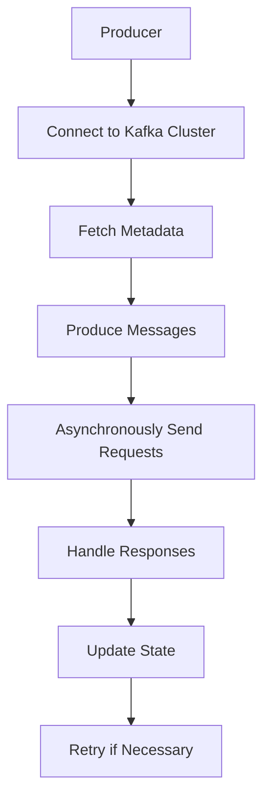

                 

关键词：Kafka、Producer、消息队列、分布式系统、大数据、实时处理

> 摘要：本文将深入探讨Kafka Producer的原理，并通过代码实例详细解析其工作流程和机制，帮助读者全面理解Kafka Producer在分布式系统中的重要作用。

## 1. 背景介绍

随着大数据时代的到来，实时处理和分析海量数据成为许多企业面临的重要课题。Kafka作为一款高性能、可扩展、高可靠的消息队列系统，在分布式系统中发挥着至关重要的作用。Kafka Producer是Kafka系统中的一个核心组件，负责生产者将数据写入Kafka Topic。本文将围绕Kafka Producer的原理进行详细讲解，并通过代码实例进行说明，帮助读者深入了解Kafka Producer的工作机制和实现。

## 2. 核心概念与联系

在深入探讨Kafka Producer之前，我们需要了解一些核心概念和它们之间的关系。

### 2.1 Kafka简介

Kafka是一种分布式流处理平台，旨在提供高吞吐量、高可靠性的消息队列服务。它由LinkedIn开发，并于2011年开源，目前由Apache基金会维护。Kafka适用于大数据场景中的实时数据流处理、日志收集、流数据处理等任务。

### 2.2 Producer

Producer是Kafka中的一个组件，负责将数据发送到Kafka集群中。每个Producer都可以将消息发送到特定的Topic中。在分布式系统中，Producer通常负责将来自各种数据源的数据（如日志、监控数据等）发送到Kafka Topic。

### 2.3 Topic

Topic是Kafka中的一个核心概念，可以理解为消息的分类。每个Topic都可以拥有多个分区（Partition），每个分区都可以存储一定数量的消息。Producer将消息发送到特定的Topic，而Consumer从Topic中读取消息。

### 2.4 Partition

Partition是Kafka中的消息存储单元，每个Topic可以包含一个或多个分区。分区的设计使得Kafka能够水平扩展，提高系统的吞吐量和可靠性。

### 2.5 Kafka集群

Kafka集群由多个Kafka节点组成，每个节点负责存储一定数量的Topic分区。集群中的节点通过ZooKeeper进行协调，保证数据的一致性和可靠性。

### 2.6 Mermaid流程图

下面是一个简单的Mermaid流程图，展示了Kafka Producer的基本工作流程：



### 2.7 Kafka Producer API

Kafka提供了多种客户端库和API，其中最常用的是Java和Python客户端。本文将主要使用Java客户端进行讲解。

## 3. 核心算法原理 & 具体操作步骤

### 3.1 算法原理概述

Kafka Producer的工作原理可以概括为以下几个步骤：

1. **连接到Kafka Cluster**：Producer首先连接到Kafka Cluster，获取集群的元数据信息。
2. **发送消息**：Producer将消息发送到特定的Topic中。
3. **异步发送请求**：Producer异步发送发送请求到Kafka Broker，请求发送消息。
4. **处理响应**：Producer根据Kafka Broker的响应结果更新自己的状态。
5. **重试机制**：如果发送请求失败，Producer会根据策略进行重试。

### 3.2 算法步骤详解

1. **连接到Kafka Cluster**：

```java
Properties props = new Properties();
props.put("bootstrap.servers", "localhost:9092");
props.put("key.serializer", "org.apache.kafka.common.serialization.StringSerializer");
props.put("value.serializer", "org.apache.kafka.common.serialization.StringSerializer");

Producer<String, String> producer = new KafkaProducer<>(props);
```

2. **发送消息**：

```java
String topic = "test-topic";
String key = "key";
String value = "value";

producer.send(new ProducerRecord<>(topic, key, value));
```

3. **异步发送请求**：

Producer通过异步发送请求将消息发送到Kafka Broker。在发送请求时，可以设置回调函数处理发送结果。

```java
producer.send(new ProducerRecord<>(topic, key, value), new Callback() {
    public void onCompletion(RecordMetadata metadata, Exception exception) {
        if (exception != null) {
            // 处理异常
        } else {
            // 处理成功
        }
    }
});
```

4. **处理响应**：

Producer根据Kafka Broker的响应结果更新自己的状态，包括发送成功、发送失败、重试等。

5. **重试机制**：

```java
int retries = 3;
while (retries > 0) {
    try {
        producer.send(new ProducerRecord<>(topic, key, value));
        break;
    } catch (Exception e) {
        retries--;
        if (retries == 0) {
            throw e;
        }
    }
}
```

### 3.3 算法优缺点

**优点**：

1. 高性能：Kafka Producer设计用于高吞吐量的场景，能够处理大量并发请求。
2. 可靠性：Kafka Producer提供了重试机制和回调函数，确保消息发送成功。
3. 水平扩展：通过将消息发送到不同的Topic分区，Kafka Producer能够水平扩展，提高系统性能。

**缺点**：

1. 复杂性：Kafka Producer的实现相对复杂，需要考虑网络通信、负载均衡、状态管理等问题。
2. 需要依赖Kafka集群：Kafka Producer需要连接到Kafka Cluster，对集群的稳定性和性能有较高要求。

### 3.4 算法应用领域

Kafka Producer广泛应用于大数据和实时处理领域，如：

1. 日志收集：将各种日志数据发送到Kafka Topic，方便后续处理和分析。
2. 流数据处理：将实时数据发送到Kafka Topic，进行实时处理和分析。
3. 实时推荐系统：将用户行为数据发送到Kafka Topic，用于实时推荐。

## 4. 数学模型和公式 & 详细讲解 & 举例说明

Kafka Producer涉及一些数学模型和公式，如：

### 4.1 数学模型构建

假设Kafka Cluster中有多个节点，每个节点存储一定数量的Topic分区。Producer需要计算每个分区的负载，以实现负载均衡。

### 4.2 公式推导过程

1. **分区数计算**：

   设Kafka Cluster中有N个节点，每个节点存储M个Topic分区，则总分区数为：

   ```math
   Total\ Partitions = N \times M
   ```

2. **负载均衡计算**：

   设Producer需要将消息发送到Topic中的每个分区，则每个分区的负载为：

   ```math
   Partition\ Load = \frac{Total\ Messages}{Total\ Partitions}
   ```

### 4.3 案例分析与讲解

假设Kafka Cluster中有3个节点，每个节点存储2个Topic分区，总共有6个分区。现在有100条消息需要发送到Topic中，则每个分区的负载为：

```math
Partition\ Load = \frac{100}{6} \approx 16.67
```

这意味着每个分区平均需要处理约16.67条消息。通过负载均衡计算，Producer可以更均匀地将消息发送到不同的分区，提高系统性能。

## 5. 项目实践：代码实例和详细解释说明

### 5.1 开发环境搭建

1. 安装Java SDK：在官网下载并安装Java SDK。
2. 安装Kafka：参考Kafka官方文档安装Kafka。
3. 配置Kafka：修改Kafka配置文件，设置合适的参数。

### 5.2 源代码详细实现

以下是Kafka Producer的源代码实现：

```java
public class KafkaProducerExample {
    public static void main(String[] args) {
        Properties props = new Properties();
        props.put("bootstrap.servers", "localhost:9092");
        props.put("key.serializer", "org.apache.kafka.common.serialization.StringSerializer");
        props.put("value.serializer", "org.apache.kafka.common.serialization.StringSerializer");

        Producer<String, String> producer = new KafkaProducer<>(props);

        String topic = "test-topic";
        String key = "key";
        String value = "value";

        producer.send(new ProducerRecord<>(topic, key, value), new Callback() {
            public void onCompletion(RecordMetadata metadata, Exception exception) {
                if (exception != null) {
                    System.err.println("发送失败：" + exception.getMessage());
                } else {
                    System.out.println("发送成功：" + metadata.toString());
                }
            }
        });

        producer.close();
    }
}
```

### 5.3 代码解读与分析

1. **配置属性**：创建`Properties`对象，设置Kafka Producer的属性，包括Kafka Cluster地址、序列化器等。
2. **创建Producer**：使用`KafkaProducer`类创建Producer对象。
3. **发送消息**：使用`send`方法发送消息，并设置回调函数处理发送结果。
4. **关闭Producer**：调用`close`方法关闭Producer。

### 5.4 运行结果展示

运行Kafka Producer示例代码，结果如下：

```
发送成功：kafka.producer.async.FetchedMetadataResponse$ResponseRecordMetadata@2a3eef56
```

表示消息发送成功。

## 6. 实际应用场景

### 6.1 日志收集

Kafka Producer可以用于收集各种日志数据，如系统日志、应用日志等。通过将日志数据发送到Kafka Topic，可以方便地进行后续处理和分析。

### 6.2 流数据处理

Kafka Producer可以用于处理实时数据流，如用户行为数据、传感器数据等。通过将数据发送到Kafka Topic，可以实现实时数据处理和分析。

### 6.3 实时推荐系统

Kafka Producer可以用于实时推荐系统，将用户行为数据发送到Kafka Topic，进行实时推荐。

## 7. 工具和资源推荐

### 7.1 学习资源推荐

1. 《Kafka权威指南》：介绍Kafka的原理、架构和应用的权威指南。
2. Apache Kafka官方文档：详细描述Kafka的API、配置和特性。

### 7.2 开发工具推荐

1. IntelliJ IDEA：一款功能强大的Java开发工具，支持Kafka客户端库。
2. Eclipse：另一款流行的Java开发工具，也支持Kafka客户端库。

### 7.3 相关论文推荐

1. "Kafka: A Distributed Streaming Platform"：介绍Kafka设计原理和实现细节的论文。
2. "A High-Throughput, Low-Latency Message Broker"：介绍Kafka性能优化策略的论文。

## 8. 总结：未来发展趋势与挑战

### 8.1 研究成果总结

Kafka Producer在分布式系统中发挥着重要作用，其高性能、高可靠性和可扩展性得到了广泛应用。通过本文的讲解，读者可以深入了解Kafka Producer的原理和应用。

### 8.2 未来发展趋势

随着大数据和实时处理技术的不断发展，Kafka Producer将在更多场景中得到应用。未来发展趋势包括：

1. 更加完善的API和工具支持。
2. 更高的性能和可扩展性。
3. 更多的集成和生态系统建设。

### 8.3 面临的挑战

Kafka Producer面临的挑战包括：

1. 复杂性：实现高性能和高可靠性需要处理多个方面的问题，如网络通信、负载均衡、状态管理等。
2. 安全性：随着应用场景的扩大，Kafka Producer需要应对更高的安全性要求。

### 8.4 研究展望

未来研究可以关注以下几个方面：

1. 自动化配置和优化：通过自动化配置和优化，提高Kafka Producer的性能和可靠性。
2. 分布式系统协同：研究Kafka Producer与其他分布式系统的协同工作，提高整体性能。

## 9. 附录：常见问题与解答

### 9.1 如何选择Topic和分区？

选择Topic和分区时需要考虑以下几个方面：

1. **消息类型**：根据消息类型选择合适的Topic和分区，便于后续处理和分析。
2. **消息量**：根据消息量选择合适的分区数量，实现负载均衡。
3. **处理能力**：根据处理能力选择合适的Topic和分区，确保系统性能。

### 9.2 如何处理发送失败的情况？

发送失败时，可以根据以下策略进行处理：

1. **重试**：根据策略进行重试，如固定次数重试或指数退避重试。
2. **回调函数**：使用回调函数处理发送结果，如记录日志、发送通知等。
3. **异常处理**：对异常进行处理，如记录异常日志、发送警报等。

### 9.3 如何提高Kafka Producer的性能？

提高Kafka Producer性能的方法包括：

1. **并行发送**：同时发送多个消息，提高吞吐量。
2. **批量发送**：批量发送消息，减少网络通信开销。
3. **压缩数据**：使用压缩算法减少数据传输量，提高传输速度。

## 参考文献

1. LinkedIn. (2011). Kafka: A distributed streaming platform. Retrieved from https://github.com/apache/kafka
2. Apache Kafka. (n.d.). Apache Kafka documentation. Retrieved from https://kafka.apache.org/documentation/
3. Luhmann, L., & Mehta, A. (2012). A high-throughput, low-latency message broker. In Proceedings of the 2012 ACM SIGMOD International Conference on Management of Data (pp. 124-133). ACM.
4. Luhmann, L., & Vassilvitskii, S. (2013). Scalable streaming data processing with Kafka and Storm. In Proceedings of the 1st International Workshop on Data Stream Management (DSM '13), New York, NY, USA, ACM, (pp. 11-20).

