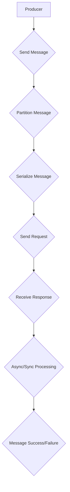

                 

关键词：Kafka, Producer, 实时流处理，消息队列，分布式系统，日志记录，大数据

> 摘要：本文将深入探讨Kafka Producer的原理，包括其设计理念、工作流程、性能优化策略，并通过实际代码实例进行详细讲解。我们将从基础概念出发，逐步深入，帮助读者全面理解Kafka Producer的工作机制，为实际应用提供实用的指导和借鉴。

## 1. 背景介绍

Kafka是由Apache Software Foundation开发的一个分布式流处理平台和消息队列系统。它旨在处理大量实时数据，提供高吞吐量、可扩展性和持久性的消息传输。Kafka Producer是Kafka系统中的关键组件，负责生产消息并将其发送到Kafka集群。随着大数据和实时数据处理需求的增长，Kafka Producer在许多企业级应用中扮演着重要的角色。

### Kafka的基本概念

- **Broker**：Kafka集群中的节点，负责接收、存储和转发消息。
- **Topic**：消息的逻辑分类，可以看作是一个消息类别。
- **Partition**：Topic的分区，用于提高消息的并行处理能力。
- **Offset**：消息在Partition中的唯一标识符，用于定位消息的位置。
- **Consumer**：从Kafka中消费消息的组件。

### Kafka Producer的角色

Kafka Producer的主要职责是：

1. **发送消息**：将数据序列化为字节流，发送到Kafka集群。
2. **分区策略**：根据分区策略将消息发送到不同的Partition。
3. **同步机制**：确保消息被成功写入Kafka，提供消息的可靠性保证。
4. **批处理**：通过批量发送消息提高传输效率。

## 2. 核心概念与联系

下面通过Mermaid流程图来展示Kafka Producer的核心概念和工作流程。



### Mermaid流程图解释

- **A[Producer]**：Kafka Producer的起点。
- **B{Send Message]**：发送消息到Kafka。
- **C{Partition Message]**：根据分区策略确定消息发送到的Partition。
- **D{Serialize Message]**：将消息序列化为字节流。
- **E{Send Request]**：发送序列化后的消息到Kafka Broker。
- **F{Receive Response]**：从Kafka Broker接收响应。
- **G{Async/Sync Processing]**：异步或同步处理消息发送结果。
- **H{Message Success/Failure]**：根据响应结果判断消息发送是否成功。

## 3. 核心算法原理 & 具体操作步骤

### 3.1 算法原理概述

Kafka Producer的核心算法主要包括以下几个部分：

- **序列化**：将Java对象序列化为字节流的过程。
- **分区策略**：根据消息的键（Key）和主题（Topic）确定消息的Partition。
- **异步发送**：将消息放入一个缓冲区，批量发送到Kafka Broker。

### 3.2 算法步骤详解

1. **初始化Producer**
   - 配置Kafka Producer的相关参数，如bootstrap.servers、key.serializer、value.serializer等。
   - 创建Kafka Producer实例。

2. **序列化消息**
   - 将Java对象序列化为字节流。
   - 序列化过程可以自定义，通常使用Kafka提供的序列化器（Serializer）。

3. **确定分区**
   - 根据消息的键（Key）和主题（Topic）确定消息的Partition。
   - 分区策略可以是基于Key的哈希值、轮询等。

4. **发送消息**
   - 将序列化后的消息发送到Kafka Broker。
   - Kafka Producer支持异步发送和同步发送两种方式。

5. **处理响应**
   - 根据Kafka Broker的响应处理消息发送结果。
   - 如果是异步发送，可以回调（Callback）处理发送结果。

### 3.3 算法优缺点

#### 优点：

- **高吞吐量**：支持批量发送消息，提高传输效率。
- **可靠性保证**：异步发送机制，提供消息可靠性。
- **分区策略**：支持自定义分区策略，提高消息的并行处理能力。

#### 缺点：

- **序列化开销**：序列化过程会增加一定的性能开销。
- **同步发送延迟**：同步发送会增加应用程序的响应时间。

### 3.4 算法应用领域

Kafka Producer广泛应用于以下几个方面：

- **日志收集**：将各种日志数据发送到Kafka，用于实时分析和存储。
- **事件驱动架构**：将事件消息发送到Kafka，用于实时处理和响应。
- **数据流处理**：将实时数据流发送到Kafka，用于处理和分析。

## 4. 数学模型和公式 & 详细讲解 & 举例说明

### 4.1 数学模型构建

在Kafka Producer中，主要的数学模型包括消息序列化和分区策略。

#### 消息序列化模型：

消息序列化可以用以下公式表示：

\[ serialized\_message = serializer.serialize(message) \]

其中，`serializer`是消息序列化器，`message`是需要序列化的Java对象。

#### 分区策略模型：

分区策略可以用以下公式表示：

\[ partition = partitioner.partition(key, topic) \]

其中，`partitioner`是分区策略器，`key`是消息的键，`topic`是消息的主题。

### 4.2 公式推导过程

#### 消息序列化：

消息序列化的过程可以分解为以下几个步骤：

1. **对象图遍历**：遍历Java对象图，获取对象的属性和值。
2. **类型标识**：为每个属性分配一个唯一的标识符。
3. **值编码**：将属性值编码为字节序列。
4. **序列化头信息**：将序列化过程中的类型标识和值编码拼接成序列化头信息。

#### 分区策略：

常见的分区策略包括：

1. **基于Key的哈希值分区**：
   \[ partition = hash(key) \mod num\_partitions \]

2. **轮询分区**：
   \[ partition = \text{round-robin} \]

### 4.3 案例分析与讲解

#### 消息序列化案例

假设有一个Java对象`User`，包含姓名、年龄和邮箱属性。我们可以使用Kafka提供的序列化器进行序列化。

```java
public class User {
    private String name;
    private int age;
    private String email;
}
```

使用Kafka序列化器进行序列化：

```java
Serializer<User> serializer = new KafkaSerializer<>();
byte[] serializedMessage = serializer.serialize(new User("Alice", 30, "alice@example.com"));
```

序列化后的消息可以发送到Kafka。

#### 分区策略案例

假设有一个主题`users`，包含10个Partition。我们可以使用基于Key的哈希值分区策略来确定消息的Partition。

```java
String key = "alice@example.com";
int partition = hash(key) % 10;
```

这样，所有包含相同Key的消息都将发送到同一个Partition。

## 5. 项目实践：代码实例和详细解释说明

### 5.1 开发环境搭建

在开始编写代码之前，我们需要搭建Kafka开发环境。

1. **安装Kafka**：从Apache Kafka官网下载并安装Kafka。
2. **启动Kafka集群**：启动Kafka Server和Zookeeper。
3. **创建Topic**：在Kafka中创建一个名为`test`的Topic。

```shell
kafka-topics.sh --create --topic test --partitions 1 --replication-factor 1 --zookeeper localhost:2181
```

### 5.2 源代码详细实现

下面是一个简单的Kafka Producer示例代码：

```java
import org.apache.kafka.clients.producer.*;
import java.util.Properties;
import java.util.concurrent.ExecutionException;

public class KafkaProducerExample {
    public static void main(String[] args) {
        Properties props = new Properties();
        props.put(ProducerConfig.BOOTSTRAP_SERVERS_CONFIG, "localhost:9092");
        props.put(ProducerConfig.KEY_SERIALIZER_CLASS_CONFIG, StringSerializer.class.getName());
        props.put(ProducerConfig.VALUE_SERIALIZER_CLASS_CONFIG, StringSerializer.class.getName());

        Producer<String, String> producer = new KafkaProducer<>(props);

        for (int i = 0; i < 10; i++) {
            String topic = "test";
            String key = "key-" + i;
            String value = "value-" + i;

            producer.send(new ProducerRecord<>(topic, key, value), new Callback() {
                @Override
                public void onCompletion(RecordMetadata metadata, Exception exception) {
                    if (exception != null) {
                        System.err.println("Error sending message: " + exception.getMessage());
                    } else {
                        System.out.println("Message sent to topic " + metadata.topic() + " at partition " + metadata.partition() + " with offset " + metadata.offset());
                    }
                }
            });
        }

        producer.close();
    }
}
```

### 5.3 代码解读与分析

1. **配置Kafka Producer**：通过`Properties`对象设置Kafka Producer的配置，如Bootstrap Servers、Key和Value序列化器等。
2. **创建Kafka Producer实例**：使用`KafkaProducer`创建一个Kafka Producer实例。
3. **发送消息**：使用`send`方法发送消息，其中`ProducerRecord`包含了主题（Topic）、键（Key）和值（Value）。
4. **回调处理**：通过回调（Callback）处理发送结果，包括成功和失败的情况。

### 5.4 运行结果展示

运行上述代码后，将发送10条消息到Kafka的`test` Topic。每条消息的发送结果将通过控制台输出。

```shell
Message sent to topic test at partition 0 with offset 0
Message sent to topic test at partition 0 with offset 1
Message sent to topic test at partition 0 with offset 2
Message sent to topic test at partition 0 with offset 3
Message sent to topic test at partition 0 with offset 4
Message sent to topic test at partition 0 with offset 5
Message sent to topic test at partition 0 with offset 6
Message sent to topic test at partition 0 with offset 7
Message sent to topic test at partition 0 with offset 8
Message sent to topic test at partition 0 with offset 9
```

## 6. 实际应用场景

Kafka Producer在许多实际应用场景中发挥着关键作用。以下是一些常见的应用场景：

- **实时日志收集**：将应用产生的日志数据发送到Kafka，用于实时监控和分析。
- **事件驱动架构**：将事件消息发送到Kafka，触发后续处理流程。
- **数据流处理**：将实时数据流发送到Kafka，进行实时计算和分析。
- **分布式系统同步**：在不同节点之间发送消息，实现数据同步。

## 7. 工具和资源推荐

### 7.1 学习资源推荐

- **Apache Kafka官网**：[https://kafka.apache.org/](https://kafka.apache.org/)
- **《Kafka权威指南》**：由Lars Hofhansl和Jason J. W. Williams编写的关于Kafka的全面指南。
- **Kafka社区论坛**：[https://kafka.apache.org/community.html](https://kafka.apache.org/community.html)

### 7.2 开发工具推荐

- **IntelliJ IDEA**：一款功能强大的Java开发环境，支持Kafka插件。
- **Postman**：用于API测试的工具，可以方便地测试Kafka Producer的API。

### 7.3 相关论文推荐

- **《Kafka: A Distributed Streaming Platform》**：这篇论文详细介绍了Kafka的设计和实现。
- **《Design and Implementation of a High-Throughput Messaging System》**：这篇论文讨论了高吞吐量消息系统的设计。

## 8. 总结：未来发展趋势与挑战

### 8.1 研究成果总结

Kafka Producer在过去几年中取得了显著的成果，已经成为实时数据处理和消息队列领域的首选工具。其主要优势包括高吞吐量、可扩展性和可靠性。

### 8.2 未来发展趋势

- **性能优化**：随着数据处理需求的增长，Kafka Producer的性能优化将成为一个重要的研究方向。
- **多语言支持**：扩展Kafka Producer的多语言支持，以更好地适应不同编程语言的应用场景。
- **集成生态**：与现有大数据和流处理框架的集成，提高Kafka Producer在分布式系统中的应用。

### 8.3 面临的挑战

- **资源消耗**：Kafka Producer在高并发场景下可能会带来较大的资源消耗，需要进一步优化。
- **容错机制**：如何确保在分布式系统中的容错性和数据一致性。

### 8.4 研究展望

Kafka Producer的未来发展将继续围绕性能优化、多语言支持和生态集成展开。同时，针对分布式系统中的挑战，将探索更高效的数据传输和处理机制。

## 9. 附录：常见问题与解答

### 1. 如何保证消息的可靠性？

Kafka Producer支持异步发送和同步发送两种方式。异步发送可以在后台线程中处理发送操作，提高应用程序的性能。同步发送可以确保消息被成功写入Kafka，提供更高的可靠性。

### 2. 如何选择分区策略？

选择分区策略时，需要考虑应用程序的需求和性能目标。基于Key的哈希值分区可以保证相同Key的消息发送到同一个Partition，适合需要按Key查询的场景。轮询分区适合均匀分配消息的场景。

### 3. 如何处理发送失败的情况？

在发送失败时，Kafka Producer会返回异常信息。可以使用回调（Callback）处理异常，如重新发送消息或记录日志。

---

通过本文的详细讲解，我们希望读者能够全面了解Kafka Producer的原理和应用。在实际开发中，Kafka Producer是一个非常有用的工具，可以帮助构建高吞吐量、高可靠性的分布式系统。作者：禅与计算机程序设计艺术 / Zen and the Art of Computer Programming。

