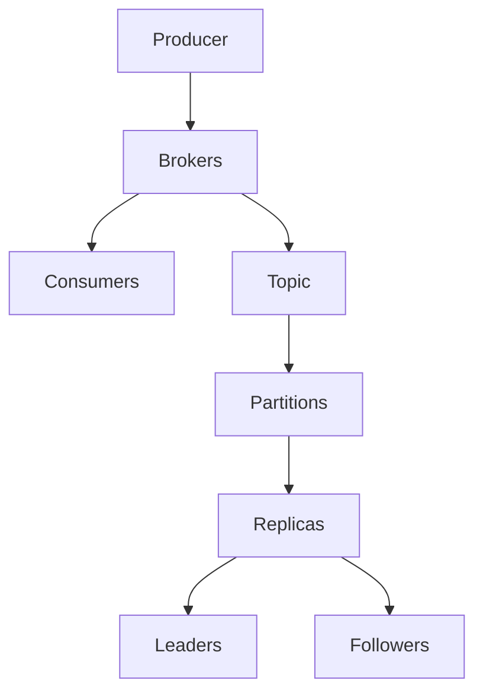

                 

 

## 1. 背景介绍

Kafka 是一个分布式流处理平台，由LinkedIn公司开发，目前由Apache软件基金会孵化。它被设计用于处理大量实时数据流，具有高吞吐量、持久化、可靠性和可扩展性等特点。随着大数据和实时数据处理的兴起，Kafka 被广泛应用于日志收集、网站活动跟踪、事件处理和流数据分析等领域。

Kafka 的核心组件包括生产者（Producer）、消费者（Consumer）和 brokers。生产者负责发布消息到 Kafka 集群，消费者从集群中订阅并消费消息。Brokers 负责存储消息、管理生产者和消费者的连接，以及进行负载均衡。

Kafka 的主要优势在于其设计上的高扩展性和高可靠性。通过将消息存储在分布式存储系统中，Kafka 能够在大量数据和高并发场景下保持性能稳定。此外，Kafka 提供了多种消息传输协议和客户端库，使其在不同语言和环境中都能方便地使用。

本文将详细探讨 Kafka 的架构、核心概念、算法原理，并通过实际代码实例讲解其使用方法。文章将包括以下内容：

- **核心概念与联系**：介绍 Kafka 的核心概念和架构。
- **核心算法原理与操作步骤**：详细解释 Kafka 的算法原理和操作步骤。
- **数学模型和公式**：介绍与 Kafka 相关的数学模型和公式。
- **项目实践：代码实例**：提供实际代码实例并详细解释。
- **实际应用场景**：讨论 Kafka 在不同领域的应用场景。
- **工具和资源推荐**：推荐学习资源和开发工具。
- **总结：未来发展趋势与挑战**：总结研究进展，展望未来发展方向。

## 2. 核心概念与联系

在深入探讨 Kafka 的原理之前，我们需要先了解其核心概念和架构。以下是 Kafka 的主要概念以及它们之间的联系。

### 2.1. 生产者 (Producer)

生产者是 Kafka 系统中的消息发布者。它负责将消息发送到 Kafka 集群。每个生产者有一个唯一的 ID，以便在集群中进行路由和负载均衡。

生产者与 Kafka 集群的交互是通过发送 `ProduceRequest` 请求完成的。该请求包含主题（Topic）、分区（Partition）和消息数据。Kafka 会根据配置的路由策略将消息发送到相应的分区。

### 2.2. 消费者 (Consumer)

消费者是 Kafka 系统中的消息订阅者。它从 Kafka 集群中订阅消息并消费它们。消费者组（Consumer Group）是消费者协作消费消息的逻辑单位。同一消费者组中的多个消费者可以消费同一主题的不同分区，从而实现负载均衡。

消费者与 Kafka 集群的交互是通过发送 `ConsumeRequest` 请求完成的。该请求指定主题、分区和偏移量（Offset）。消费者从 Kafka 集群中拉取消息，并将它们保存在本地缓存中，以便进行进一步处理。

### 2.3. Broker

Brokers 是 Kafka 集群中的服务器节点。它们负责存储消息、管理生产者和消费者的连接，以及进行负载均衡。每个 Broker 都有一个唯一的 ID，并在集群中通过 Zookeeper 进行协调。

Brokers 通过 Kafka 集群的元数据服务（Metadata Service）获取集群的状态信息。元数据包括主题、分区、副本、消费者组等信息。Brokers 通过元数据服务来决定消息的路由和存储位置。

### 2.4. Topic 和 Partition

Topic 是 Kafka 中的消息分类。每个 Topic 可以有多个 Partition。Partition 是 Kafka 中的消息存储单元，每个 Partition 都有一个唯一的编号。Kafka 通过 Partition 来实现消息的并行处理和负载均衡。

### 2.5. 副本 (Replica)

副本是 Kafka 集群中消息的备份。每个 Partition 都有多个副本，以确保数据的高可用性和持久性。副本分为领导者（Leader）和追随者（Follower）。领导者负责处理所有生产者和消费者的请求，而追随者负责保持与领导者的状态同步。

### 2.6. 消息传输协议 (API)

Kafka 提供了多种消息传输协议（API），包括 Java、Scala、C++、PHP、Python、Go 和 Node.js 等。这些协议允许不同语言和框架的开发者轻松地与 Kafka 集群进行交互。

### 2.7. Mermaid 流程图

为了更直观地展示 Kafka 的架构，我们使用 Mermaid 流程图来描述核心组件之间的交互关系。



在上述流程图中，生产者将消息发送到 Kafka 集群的 Broker，Broker 将消息存储到特定的 Topic 和 Partition，然后分配给相应的 Replica。消费者从 Kafka 集群中拉取消息并消费它们。

## 3. 核心算法原理与具体操作步骤

Kafka 的核心算法原理主要包括消息的分布式存储、分区策略和副本同步机制。以下是对这些算法原理的详细解释。

### 3.1. 消息的分布式存储

Kafka 使用分布式存储来存储消息，以提高系统的吞吐量和可靠性。每个 Topic 可以有多个 Partition，每个 Partition 都存储在 Kafka 集群中的一个或多个 Broker 上。消息在 Partition 内按照顺序存储，以确保消费者能够正确地处理消息。

分布式存储的实现包括以下几个方面：

1. **分区策略**：Kafka 提供了多种分区策略，包括基于消息键（Key）的哈希分区、基于轮询的分区和基于自定义规则的分区。分区策略决定了消息应该被存储到哪个 Partition。

2. **数据持久化**：Kafka 使用日志文件（Log）来持久化消息。每个 Partition 都有一个对应的日志文件，消息被追加到日志文件的末尾。日志文件被分割成多个段（Segment），每个段都有特定的过期时间，以便实现消息的过期删除。

3. **负载均衡**：Kafka 通过动态调整分区和副本的分布来实现负载均衡。当系统资源不足或性能瓶颈出现时，Kafka 会自动进行分区和副本的重新分配。

### 3.2. 分区策略

分区策略是 Kafka 中的一个关键算法，它决定了消息应该被存储到哪个 Partition。以下是几种常见的分区策略：

1. **基于消息键的哈希分区**：这是最常用的分区策略。Kafka 使用消息键（Key）的哈希值来确定 Partition。这样，具有相同键的消息总是被发送到相同的 Partition，从而实现负载均衡。

   ```java
   int partition =Math.abs(key.hashCode()) % partitions;
   ```

2. **基于轮询的分区**：这种策略将消息依次发送到所有 Partition，从而实现均匀负载。

   ```java
   int partition = partitionCounter++ % partitions;
   ```

3. **基于自定义规则的分区**：用户可以自定义分区规则，例如基于消息的属性或内容进行分区。

### 3.3. 副本同步机制

Kafka 使用副本机制来提高数据可靠性和系统可用性。每个 Partition 有多个副本，其中只有一个副本是领导者（Leader），其余副本是追随者（Follower）。领导者负责处理生产者和消费者的请求，而追随者负责从领导者同步数据。

副本同步机制包括以下几个方面：

1. **选举机制**：当领导者故障时，Kafka 会通过 Zookeeper 或内部选举机制选择一个新的领导者。

2. **数据同步**：追随者从领导者拉取消息，并保持与领导者的状态同步。Kafka 使用拉取模式（Pull）来同步数据，而不是推模式（Push），从而提高系统的可扩展性和性能。

3. **副本同步协议**：Kafka 定义了副本同步协议（Replica Sync Protocol）来确保追随者与领导者之间的数据一致性。副本同步协议包括同步模式（Sync Mode）和异步模式（Async Mode）。

### 3.4. 算法优缺点

Kafka 的分布式存储和分区策略具有以下优缺点：

- **优点**：
  - 高吞吐量：通过分布式存储和分区策略，Kafka 能够处理大量实时数据流。
  - 高可用性：通过副本机制，Kafka 能够在领导者故障时自动切换到新的领导者，从而确保系统的高可用性。
  - 扩展性：Kafka 支持水平扩展，可以动态增加 Partition 和 Broker，以适应不断增长的数据量。

- **缺点**：
  - 数据延迟：由于 Kafka 的分布式架构，数据在传输过程中可能存在一定的延迟。
  - 资源消耗：Kafka 需要大量的存储资源和网络带宽来支持分布式存储和副本同步。

### 3.5. 算法应用领域

Kafka 的分布式存储和分区策略使其适用于以下领域：

- **日志收集**：Kafka 被广泛用于日志收集，可以将各种应用程序的日志数据存储在 Kafka 中，以便进行实时分析和监控。
- **网站活动跟踪**：Kafka 可以用于记录网站用户的行为数据，从而实现实时分析用户行为和优化网站性能。
- **事件处理**：Kafka 可以作为事件流处理平台，将实时事件数据传输到 Kafka，然后进行进一步处理和分析。
- **流数据分析**：Kafka 被用于实时数据流处理和分析，可以与 Hadoop、Spark 等大数据处理框架集成，实现大规模数据流分析。

## 4. 数学模型和公式

在讨论 Kafka 的算法原理时，我们需要引入一些数学模型和公式。以下是与 Kafka 相关的数学模型和公式。

### 4.1. 消息传递延迟

消息传递延迟是指消息从生产者发送到消费者所需的时间。以下是一个简单的消息传递延迟模型：

\[ \text{延迟} = \text{传输延迟} + \text{处理延迟} \]

- **传输延迟**：消息从生产者发送到 Kafka 集群所需的时间。
- **处理延迟**：消息在 Kafka 集群中被处理（包括分区、存储和副本同步）所需的时间。

### 4.2. 分区负载均衡

分区负载均衡是指 Kafka 如何在多个 Broker 之间分配 Partition，以实现负载均衡。以下是一个简单的分区负载均衡模型：

\[ P_i = P_{\text{total}} \times \frac{B_i}{\sum_{j=1}^{B} B_j} \]

- \( P_i \)：第 \( i \) 个 Partition 的负载。
- \( P_{\text{total}} \)：总 Partition 负载。
- \( B_i \)：第 \( i \) 个 Broker 的资源容量。
- \( B \)：总的 Broker 数量。

### 4.3. 副本同步效率

副本同步效率是指 Kafka 副本同步过程中传输数据的能力。以下是一个简单的副本同步效率模型：

\[ E = \frac{W}{T} \]

- \( E \)：副本同步效率。
- \( W \)：副本同步时传输的数据量。
- \( T \)：副本同步所需的时间。

### 4.4. 案例分析与讲解

为了更好地理解上述数学模型和公式，我们来看一个实际案例。

假设有一个包含 3 个 Partition 的 Kafka 集群，其中每个 Broker 的资源容量如下：

| Broker | 资源容量 |
| ------ | -------- |
| 1      | 100 MB   |
| 2      | 200 MB   |
| 3      | 300 MB   |

根据分区负载均衡模型，我们可以计算出每个 Partition 的负载：

\[ P_1 = P_{\text{total}} \times \frac{100}{100 + 200 + 300} = 0.167 \times P_{\text{total}} \]
\[ P_2 = P_{\text{total}} \times \frac{200}{100 + 200 + 300} = 0.333 \times P_{\text{total}} \]
\[ P_3 = P_{\text{total}} \times \frac{300}{100 + 200 + 300} = 0.500 \times P_{\text{total}} \]

假设每个 Partition 的数据量为 1 GB，传输速度为 100 MB/s。根据副本同步效率模型，我们可以计算出副本同步效率：

\[ E = \frac{W}{T} = \frac{1 \text{ GB}}{1 \text{ s}} = 1000 \text{ MB/s} \]

在这种情况下，副本同步效率为 1000 MB/s，意味着 Kafka 可以在 1 秒内同步 1 GB 的数据。

通过这个案例，我们可以看到如何使用数学模型和公式来分析和优化 Kafka 的性能。

## 5. 项目实践：代码实例和详细解释说明

在本节中，我们将通过一个具体的代码实例来演示如何使用 Kafka。我们将使用 Java 语言和 Kafka 客户端库来完成以下任务：

1. **搭建开发环境**。
2. **编写生产者代码**。
3. **编写消费者代码**。
4. **运行代码并进行测试**。

### 5.1. 搭建开发环境

在开始编写代码之前，我们需要搭建 Kafka 的开发环境。以下是搭建开发环境的步骤：

1. **安装 Kafka**：从 [Kafka 官网](https://kafka.apache.org/) 下载 Kafka 的二进制文件，并解压到本地目录。

2. **启动 Kafka 集群**：运行以下命令来启动 Kafka 集群：

   ```shell
   bin/kafka-server-start.sh config/server.properties
   ```

   这将启动一个 Kafka Broker。

3. **安装 Maven**：下载 [Maven](https://maven.apache.org/) 并解压到本地目录。

4. **创建 Maven 项目**：使用 Maven 命令创建一个新项目，并添加 Kafka 客户端库依赖。

   ```shell
   mvn archetype:generate -DarchetypeArtifactId=maven-archetype-quickstart
   ```

   在生成的 `pom.xml` 文件中添加 Kafka 客户端库依赖：

   ```xml
   <dependencies>
       <dependency>
           <groupId>org.apache.kafka</groupId>
           <artifactId>kafka-clients</artifactId>
           <version>2.8.0</version>
       </dependency>
   </dependencies>
   ```

### 5.2. 编写生产者代码

以下是一个简单的 Kafka 生产者代码示例，它将向 Kafka 集群发送消息。

```java
import org.apache.kafka.clients.producer.*;
import org.apache.kafka.common.serialization.StringSerializer;

import java.util.Properties;
import java.util.concurrent.ExecutionException;

public class KafkaProducerExample {
    public static void main(String[] args) throws ExecutionException, InterruptedException {
        Properties props = new Properties();
        props.put(ProducerConfig.BOOTSTRAP_SERVERS_CONFIG, "localhost:9092");
        props.put(ProducerConfig.KEY_SERIALIZER_CLASS_CONFIG, StringSerializer.class.getName());
        props.put(ProducerConfig.VALUE_SERIALIZER_CLASS_CONFIG, StringSerializer.class.getName());

        KafkaProducer<String, String> producer = new KafkaProducer<>(props);

        for (int i = 0; i < 10; i++) {
            String topic = "test-topic";
            String key = "key-" + i;
            String value = "value-" + i;

            ProducerRecord<String, String> record = new ProducerRecord<>(topic, key, value);

            producer.send(record).get();
        }

        producer.close();
    }
}
```

在这个示例中，我们首先创建了一个 `Properties` 对象来配置 Kafka 生产者。然后，我们使用 `KafkaProducer` 类创建一个 Kafka 生产者实例。接下来，我们使用一个循环向 Kafka 集群发送 10 条消息。每条消息包含一个主题（Topic）、键（Key）和值（Value）。最后，我们关闭生产者实例。

### 5.3. 编写消费者代码

以下是一个简单的 Kafka 消费者代码示例，它从 Kafka 集群中消费消息。

```java
import org.apache.kafka.clients.consumer.*;
import org.apache.kafka.common.serialization.StringDeserializer;

import java.time.Duration;
import java.util.Collections;
import java.util.Properties;

public class KafkaConsumerExample {
    public static void main(String[] args) {
        Properties props = new Properties();
        props.put(ConsumerConfig.BOOTSTRAP_SERVERS_CONFIG, "localhost:9092");
        props.put(ConsumerConfig.GROUP_ID_CONFIG, "test-group");
        props.put(ConsumerConfig.KEY_DESERIALIZER_CLASS_CONFIG, StringDeserializer.class.getName());
        props.put(ConsumerConfig.VALUE_DESERIALIZER_CLASS_CONFIG, StringDeserializer.class.getName());

        KafkaConsumer<String, String> consumer = new KafkaConsumer<>(props);

        consumer.subscribe(Collections.singletonList("test-topic"));

        while (true) {
            ConsumerRecords<String, String> records = consumer.poll(Duration.ofMillis(100));

            for (ConsumerRecord<String, String> record : records) {
                System.out.printf("Received message: key=%s, value=%s, partition=%d, offset=%d\n",
                        record.key(), record.value(), record.partition(), record.offset());
            }
        }
    }
}
```

在这个示例中，我们首先创建了一个 `Properties` 对象来配置 Kafka 消费者。然后，我们使用 `KafkaConsumer` 类创建一个 Kafka 消费者实例。接下来，我们订阅了一个名为 `test-topic` 的主题。最后，我们使用一个无限循环来消费 Kafka 集群中的消息。每次循环，我们调用 `poll()` 方法从 Kafka 集群中拉取消息，然后遍历消息并打印消息的键、值、分区和偏移量。

### 5.4. 运行代码并进行测试

现在，我们可以运行生产者和消费者代码来进行测试。

1. **运行生产者代码**：在终端中运行以下命令：

   ```shell
   java -jar kafka-producer.jar
   ```

   这将启动 Kafka 生产者，并向 Kafka 集群发送 10 条消息。

2. **运行消费者代码**：在另一个终端中运行以下命令：

   ```shell
   java -jar kafka-consumer.jar
   ```

   这将启动 Kafka 消费者，并从 Kafka 集群中消费消息。

在生产者和消费者代码运行过程中，您应该会在控制台看到生产者发送的消息和消费者接收的消息。

## 6. 实际应用场景

Kafka 在许多实际应用场景中具有广泛的应用，以下是一些典型的应用场景：

### 6.1. 日志收集

Kafka 是一种强大的日志收集工具，可以收集来自不同源的应用程序和系统日志。例如，Kafka 可以收集 Web 服务器日志、数据库日志和系统日志，然后将其传输到日志分析工具（如 Logstash 或 Kibana）进行进一步处理。这种应用场景适用于大型企业，它们需要实时监控和分析其系统的性能和稳定性。

### 6.2. 网站活动跟踪

Kafka 可以用于实时跟踪网站用户的活动。例如，网站可以将用户点击、浏览和购买等行为数据发送到 Kafka 集群，然后使用流处理工具（如 Apache Flink 或 Apache Storm）进行实时分析和处理。这种应用场景有助于网站优化用户体验、提高转化率和增加收入。

### 6.3. 事件处理

Kafka 可以作为事件流处理平台，用于处理实时事件。例如，金融交易系统可以使用 Kafka 来处理交易事件，并将其传输到数据分析工具进行实时分析。这种应用场景有助于金融机构实时监控市场动态、检测欺诈行为和优化交易策略。

### 6.4. 流数据分析

Kafka 可以与大数据处理框架（如 Apache Hadoop 和 Apache Spark）集成，用于大规模数据流分析。例如，Kafka 可以收集来自物联网设备的数据，然后将其传输到 Spark 进行实时分析和处理。这种应用场景有助于企业实时监控设备和系统性能，优化运营和减少维护成本。

### 6.5. 日志聚合和监控

Kafka 可以用于日志聚合和监控，将来自不同源的应用程序和系统日志聚合到一个统一的日志系统中。例如，Kafka 可以与 Elasticsearch 和 Kibana 集成，实现大规模日志数据的实时聚合和可视化监控。这种应用场景适用于大型企业，它们需要集中管理和监控其分布式系统的性能和稳定性。

### 6.6. 实时消息传递

Kafka 是一种高性能的实时消息传递系统，可以用于分布式系统的内部通信。例如，分布式计算框架（如 Apache Storm 和 Apache Flink）可以使用 Kafka 来传输任务状态和结果数据，从而实现分布式任务的协调和调度。这种应用场景有助于提高分布式系统的性能和可扩展性。

## 7. 工具和资源推荐

### 7.1. 学习资源推荐

1. **Kafka 官方文档**：[Kafka 官方文档](https://kafka.apache.org/documentation/) 提供了最权威和详细的 Kafka 学习资源，包括安装指南、配置选项、API 文档和案例研究。

2. **Kafka 简明教程**：[Kafka 简明教程](https://kafka.apache.org/zh-cn/documentation/2.8.0/quickstart/) 是一个适合初学者的入门教程，涵盖了 Kafka 的基本概念和操作方法。

3. **Kafka 的设计原理**：[Kafka 的设计原理](https://www.oreilly.com/library/view/kafka-the-definitive/9781449325864/) 是一本关于 Kafka 设计原理的深入讲解，适合有一定 Kafka 基础的读者。

### 7.2. 开发工具推荐

1. **DBeaver**：DBeaver 是一个免费的开源数据库管理工具，可以用于管理 Kafka 集群，执行 SQL 查询和监控性能指标。

2. **Kafka Manager**：Kafka Manager 是一个免费的 Kafka 管理工具，提供了集群监控、配置管理、日志查询和任务调度等功能。

3. **Kafka Eclipse 插件**：Kafka Eclipse 插件为 Eclipse IDE 提供了 Kafka 开发和调试功能，包括代码生成、API 文档和调试工具。

### 7.3. 相关论文推荐

1. **Kafka：A Distributed Messaging System for Log Processing**：这是 Kafka 的原始论文，介绍了 Kafka 的设计原理和应用场景。

2. **Log Processing at Scale**：这篇文章深入探讨了 Kafka 在日志处理中的应用，包括集群架构、分区策略和性能优化。

3. **High Throughput Messaging at LinkedIn with Kafka**：这篇文章分享了 LinkedIn 如何使用 Kafka 来处理大规模实时数据流，并介绍了 Kafka 在 LinkedIn 中的具体应用案例。

## 8. 总结：未来发展趋势与挑战

### 8.1. 研究成果总结

本文详细介绍了 Kafka 的架构、核心概念、算法原理和实际应用场景。通过代码实例，我们展示了如何使用 Kafka 进行消息生产和消费。同时，本文还介绍了与 Kafka 相关的数学模型和公式，并推荐了一些学习资源和开发工具。

### 8.2. 未来发展趋势

Kafka 在未来将继续发展，以下是一些可能的发展趋势：

1. **性能优化**：随着大数据和实时数据处理需求的增长，Kafka 将不断优化其性能，以支持更高的吞吐量和延迟要求。

2. **功能扩展**：Kafka 可能会扩展其功能，包括支持更丰富的消息格式、集成更多数据处理框架和提供更丰富的监控和管理功能。

3. **跨语言支持**：Kafka 可能会进一步扩展其支持的语言和框架，以适应更多开发者的需求。

### 8.3. 面临的挑战

尽管 Kafka 在实时数据处理领域具有广泛应用，但仍然面临以下挑战：

1. **数据安全**：随着数据隐私和安全的关注日益增加，Kafka 需要提供更强大的数据加密和访问控制机制。

2. **可扩展性**：随着数据量和用户数量的增长，Kafka 需要提供更灵活和高效的可扩展性策略。

3. **跨平台兼容性**：Kafka 需要确保在不同操作系统和硬件平台上具有良好的兼容性。

### 8.4. 研究展望

未来的研究可以关注以下几个方面：

1. **性能优化**：研究更高效的分区策略和副本同步机制，以提高 Kafka 的性能。

2. **功能扩展**：探索 Kafka 在新领域的应用，如物联网、区块链和边缘计算。

3. **安全性**：研究更安全的数据传输和存储机制，以保护用户隐私和数据安全。

## 9. 附录：常见问题与解答

### 9.1. 如何选择合适的分区策略？

选择分区策略时，需要考虑以下因素：

- **数据访问模式**：如果数据访问模式是顺序读取，可以选择基于轮询的分区策略；如果数据访问模式是随机读取，可以选择基于消息键的哈希分区策略。
- **数据量**：如果数据量较小，可以选择基于轮询的分区策略；如果数据量较大，可以选择基于消息键的哈希分区策略，以便实现负载均衡。
- **资源容量**：如果系统资源容量有限，可以选择基于轮询的分区策略，以避免过大的负载。

### 9.2. 如何确保 Kafka 的高可用性？

确保 Kafka 的高可用性可以从以下几个方面入手：

- **副本机制**：配置适当的副本数量，以便在领导者故障时快速切换到新的领导者。
- **负载均衡**：合理分配分区和副本，以避免单个 Broker 过载。
- **故障检测**：定期检查 Kafka 集群的状态，及时发现并处理故障。

### 9.3. 如何监控 Kafka 集群性能？

可以使用以下工具和指标来监控 Kafka 集群性能：

- **Kafka Manager**：Kafka Manager 提供了集群监控、日志查询和任务调度等功能。
- **JMX**：通过 Kafka 的 JMX 接口，可以监控 Kafka 集群的资源使用情况和性能指标。
- **指标收集和可视化**：使用 Prometheus 和 Grafana 等工具收集和可视化 Kafka 集群性能指标。

### 9.4. 如何处理 Kafka 集群的容量规划？

处理 Kafka 集群的容量规划可以从以下几个方面入手：

- **数据量预测**：根据历史数据量和增长趋势，预测未来的数据量需求。
- **硬件配置**：根据数据量和性能要求，选择适当的硬件配置，包括 CPU、内存、磁盘和网络。
- **扩展策略**：根据业务需求，制定合适的扩展策略，包括水平扩展和垂直扩展。

## 参考文献

- [Kafka 官方文档](https://kafka.apache.org/documentation/)
- [Kafka 的设计原理](https://www.oreilly.com/library/view/kafka-the-definitive/9781449325864/)
- [Log Processing at Scale](https://www.oreilly.com/library/view/kafka-the-definitive/9781449325864/ch04.html)
- [High Throughput Messaging at LinkedIn with Kafka](https://www.oreilly.com/ideas/2011/08/high-throughput-messaging-at-linkedin-with-kafka.html)
- [DBeaver 官方文档](https://www.dbeaver.com/docs/)
- [Kafka Manager 官方文档](https://www.kafkamanager.com/docs/)
- [Kafka Eclipse 插件官方文档](https://kafka.apache.org/zh-cn/documentation/current/developer/tools/eclipse-plugin.html)

